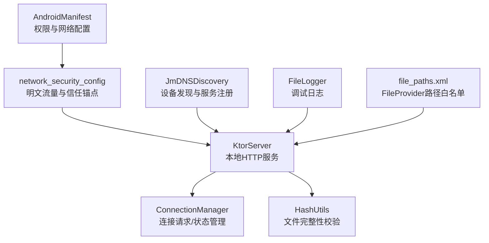
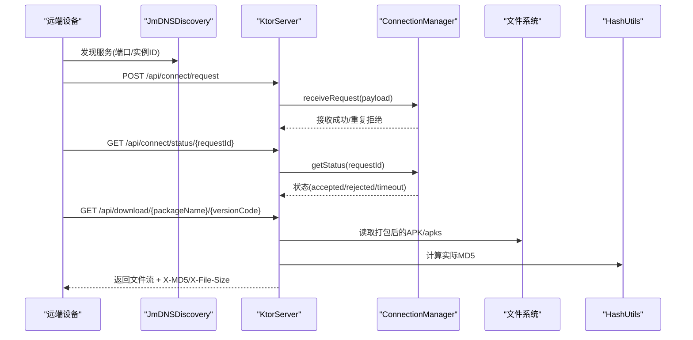
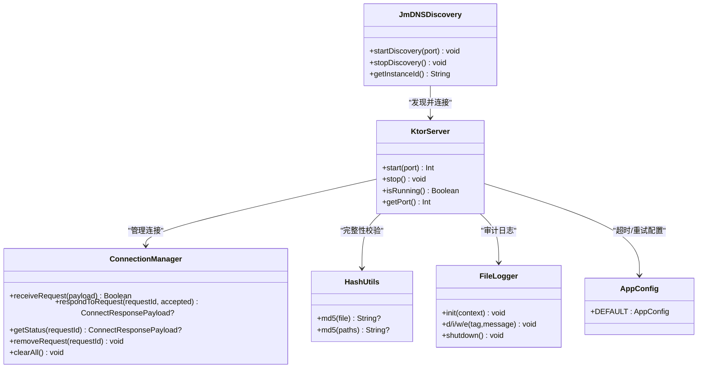

# 安全考虑

<cite>
**本文引用的文件**
- [AndroidManifest.xml](file://app/src/main/AndroidManifest.xml)
- [network_security_config.xml](file://app/src/main/res/xml/network_security_config.xml)
- [KtorServer.kt](file://app/src/main/java/com/lansync/app/data/server/KtorServer.kt)
- [ConnectionManager.kt](file://app/src/main/java/com/lansync/app/data/connection/ConnectionManager.kt)
- [JmDNSDiscovery.kt](file://app/src/main/java/com/lansync/app/data/discovery/JmDNSDiscovery.kt)
- [AppConfig.kt](file://app/src/main/java/com/lansync/app/data/AppConfig.kt)
- [HashUtils.kt](file://app/src/main/java/com/lansync/app/data/HashUtils.kt)
- [Models.kt](file://app/src/main/java/com/lansync/app/data/model/Models.kt)
- [FileLogger.kt](file://app/src/main/java/com/lansync/app/data/FileLogger.kt)
- [file_paths.xml](file://app/src/main/res/xml/file_paths.xml)
</cite>

## 目录
1. [简介](#简介)
2. [项目结构](#项目结构)
3. [核心组件](#核心组件)
4. [架构总览](#架构总览)
5. [详细组件分析](#详细组件分析)
6. [依赖关系分析](#依赖关系分析)
7. [性能与安全权衡](#性能与安全权衡)
8. [故障排查指南](#故障排查指南)
9. [结论](#结论)
10. [附录：安全配置与威胁建模](#附录：安全配置与威胁建模)

## 简介
本文件面向LanSync应用的安全设计与实现，聚焦以下方面：
- 网络安全措施：HTTPS/TLS、证书校验、明文流量控制、本地服务暴露面管理
- 数据安全保护：敏感信息存储、数据完整性校验、隐私最小化
- 权限最小化：运行时权限请求、权限边界控制
- 输入验证与输出编码：防止注入、XSS等常见漏洞
- 安全审计与漏洞扫描：日志策略、可观测性、自动化检查建议
- 安全配置示例与威胁建模：帮助开发者构建安全的移动应用

## 项目结构
LanSync在Android端通过内置HTTP服务器（Ktor）提供局域网内设备间通信能力，结合JmDNS进行设备发现，使用哈希校验保障传输完整性。关键安全相关位置如下：
- 网络与安全配置：AndroidManifest与network_security_config
- 本地HTTP服务：KtorServer路由与响应处理
- 连接与会话管理：ConnectionManager
- 设备发现：JmDNSDiscovery
- 数据完整性：HashUtils（MD5）
- 模型与载荷：Models（请求/响应结构）
- 日志与可观测性：FileLogger
- 文件共享：file_paths.xml（FileProvider）

图表来源
- [AndroidManifest.xml:1-60](file://app/src/main/AndroidManifest.xml#L1-L60)
- [network_security_config.xml:1-8](file://app/src/main/res/xml/network_security_config.xml#L1-L8)
- [KtorServer.kt:65-290](file://app/src/main/java/com/lansync/app/data/server/KtorServer.kt#L65-L290)
- [ConnectionManager.kt:19-156](file://app/src/main/java/com/lansync/app/data/connection/ConnectionManager.kt#L19-L156)
- [JmDNSDiscovery.kt:23-134](file://app/src/main/java/com/lansync/app/data/discovery/JmDNSDiscovery.kt#L23-L134)
- [HashUtils.kt:6-54](file://app/src/main/java/com/lansync/app/data/HashUtils.kt#L6-L54)
- [file_paths.xml:1-6](file://app/src/main/res/xml/file_paths.xml#L1-L6)

章节来源
- [AndroidManifest.xml:1-60](file://app/src/main/AndroidManifest.xml#L1-L60)
- [network_security_config.xml:1-8](file://app/src/main/res/xml/network_security_config.xml#L1-L8)

## 核心组件
- KtorServer：提供本地HTTP API，包含ping、应用列表、连接请求/响应、下载、断开、刷新应用列表、设备信息等路由；对下载文件附加MD5与大小头用于完整性校验。
- ConnectionManager：维护待处理的连接请求、超时处理、状态流转（PENDING/ACCEPTED/REJECTED/TIMEOUT），并对外暴露状态查询接口。
- JmDNSDiscovery：基于mDNS的设备发现与服务注册，广播设备实例ID，过滤自身与无效服务。
- HashUtils：计算文件MD5，用于下载前后完整性校验。
- Models：定义跨设备通信的载荷结构（如ConnectRequestPayload、DeviceInfoResponse等）。
- FileLogger：异步落盘日志，支持日志轮转与截断，便于安全审计与问题定位。
- file_paths.xml：限定FileProvider可共享的缓存/下载目录，缩小文件访问面。

章节来源
- [KtorServer.kt:65-330](file://app/src/main/java/com/lansync/app/data/server/KtorServer.kt#L65-L330)
- [ConnectionManager.kt:19-156](file://app/src/main/java/com/lansync/app/data/connection/ConnectionManager.kt#L19-L156)
- [JmDNSDiscovery.kt:23-275](file://app/src/main/java/com/lansync/app/data/discovery/JmDNSDiscovery.kt#L23-L275)
- [HashUtils.kt:6-54](file://app/src/main/java/com/lansync/app/data/HashUtils.kt#L6-L54)
- [Models.kt:6-138](file://app/src/main/java/com/lansync/app/data/model/Models.kt#L6-L138)
- [FileLogger.kt:19-167](file://app/src/main/java/com/lansync/app/data/FileLogger.kt#L19-L167)
- [file_paths.xml:1-6](file://app/src/main/res/xml/file_paths.xml#L1-L6)

## 架构总览
LanSync采用“设备自发现 + 本地HTTP服务”的局域网协作模式。设备通过JmDNS广播服务信息（含设备名与实例ID），其他设备监听并建立HTTP连接进行应用列表同步与APK打包下载。服务端为Netty引擎，启用JSON内容协商，并在下载响应中附带MD5与文件大小以支持完整性校验。

图表来源
- [JmDNSDiscovery.kt:60-134](file://app/src/main/java/com/lansync/app/data/discovery/JmDNSDiscovery.kt#L60-L134)
- [KtorServer.kt:88-250](file://app/src/main/java/com/lansync/app/data/server/KtorServer.kt#L88-L250)
- [ConnectionManager.kt:29-112](file://app/src/main/java/com/lansync/app/data/connection/ConnectionManager.kt#L29-L112)
- [HashUtils.kt:8-36](file://app/src/main/java/com/lansync/app/data/HashUtils.kt#L8-L36)

## 详细组件分析

### 网络安全措施
- HTTPS/TLS与证书校验
  - 当前本地HTTP服务未启用TLS，仅通过局域网内网段限制暴露面。建议在后续版本引入自签名证书或系统信任链，强制HTTPS，并禁用明文HTTP。
  - network_security_config允许明文流量且信任系统证书，需在生产环境关闭明文流量，仅允许受信任证书。
- 网络通信加密
  - 当前下载响应通过HTTP传输，存在被嗅探风险。应升级为HTTPS，并对关键API增加鉴权（如一次性令牌或设备白名单）。
- 本地服务暴露面
  - 仅绑定本机端口，避免对外网开放；配合防火墙规则进一步限制入站。
- 设备发现安全
  - 通过instanceId过滤自身与未知设备，降低误匹配风险；但mDNS本身无认证，仍需结合上层鉴权。

章节来源
- [network_security_config.xml:1-8](file://app/src/main/res/xml/network_security_config.xml#L1-L8)
- [AndroidManifest.xml:28-37](file://app/src/main/AndroidManifest.xml#L28-L37)
- [KtorServer.kt:65-290](file://app/src/main/java/com/lansync/app/data/server/KtorServer.kt#L65-L290)
- [JmDNSDiscovery.kt:119-134](file://app/src/main/java/com/lansync/app/data/discovery/JmDNSDiscovery.kt#L119-L134)

### 数据安全保护
- 敏感信息存储
  - 设备实例ID持久化于私有SharedPreferences，非敏感但具唯一性；避免将其作为密钥使用。
  - 日志写入外部存储的应用专属目录，注意脱敏与轮转，避免记录敏感字段。
- 数据完整性校验
  - 下载时服务端计算文件MD5并通过响应头返回，客户端应在接收后校验MD5，确保未被篡改。
- 隐私保护
  - 设备名与IP在局域网内可见，属于必要暴露；可通过最小化字段与短期会话令牌减少泄露面。
- 文件共享安全
  - FileProvider仅暴露cache/downloads子目录，限制可访问范围，降低越权读取风险。

章节来源
- [JmDNSDiscovery.kt:45-56](file://app/src/main/java/com/lansync/app/data/discovery/JmDNSDiscovery.kt#L45-L56)
- [FileLogger.kt:21-44](file://app/src/main/java/com/lansync/app/data/FileLogger.kt#L21-L44)
- [KtorServer.kt:293-312](file://app/src/main/java/com/lansync/app/data/server/KtorServer.kt#L293-L312)
- [HashUtils.kt:8-36](file://app/src/main/java/com/lansync/app/data/HashUtils.kt#L8-L36)
- [file_paths.xml:1-6](file://app/src/main/res/xml/file_paths.xml#L1-L6)

### 权限最小化原则
- 声明权限
  - 网络访问、WiFi状态、多播、位置（用于WiFi扫描）、包查询等权限已在清单中声明。
- 运行时权限
  - 位置与附近设备权限需在运行时申请；UI层应明确提示用户原因，并提供拒绝时的降级体验。
- 权限边界控制
  - 将敏感操作封装在最小作用域内（如仅下载流程需要文件读写），避免全局授权。
  - 使用FileProvider精确限定可共享目录，禁止直接暴露内部存储路径。

章节来源
- [AndroidManifest.xml:4-12](file://app/src/main/AndroidManifest.xml#L4-L12)
- [file_paths.xml:1-6](file://app/src/main/res/xml/file_paths.xml#L1-L6)

### 输入验证与输出编码
- 输入验证
  - 所有API请求体通过序列化框架解析，非法或缺失字段将被拒绝；参数型路由（如requestId、packageName）需做长度与格式校验。
  - 连接请求去重：ConnectionManager基于requestId拒绝重复请求，防止重放。
- 输出编码
  - 响应体为结构化JSON，避免直接拼接HTML/脚本；若未来扩展Web界面，需对所有动态内容进行上下文相关的编码。
- 防注入
  - 当前未使用SQL数据库，SQL注入风险较低；但仍需对任何字符串拼接场景进行严格校验与参数化。
- 防XSS
  - 当前为纯API服务，不涉及渲染；若新增前端页面，需启用CSP与输出编码。

章节来源
- [KtorServer.kt:88-250](file://app/src/main/java/com/lansync/app/data/server/KtorServer.kt#L88-L250)
- [ConnectionManager.kt:29-56](file://app/src/main/java/com/lansync/app/data/connection/ConnectionManager.kt#L29-L56)
- [Models.kt:69-138](file://app/src/main/java/com/lansync/app/data/model/Models.kt#L69-L138)

### 安全审计与漏洞扫描
- 日志策略
  - FileLogger异步落盘，支持日志轮转与最大容量限制，便于审计与取证；应避免记录敏感信息（如完整IP+端口组合、用户标识）。
- 可观测性
  - 关键事件（连接请求、下载、错误）均有日志记录；建议增加结构化字段（时间戳、设备ID、操作类型）以便检索。
- 漏洞扫描
  - 建议使用静态分析工具（如Detekt、SonarQube）与依赖漏洞扫描（如OWASP Dependency Check）纳入CI流水线。
  - 针对网络与权限配置进行专项检查，确保生产环境禁用明文流量与多余权限。

章节来源
- [FileLogger.kt:19-167](file://app/src/main/java/com/lansync/app/data/FileLogger.kt#L19-L167)
- [KtorServer.kt:77-285](file://app/src/main/java/com/lansync/app/data/server/KtorServer.kt#L77-L285)

## 依赖关系分析
- KtorServer依赖ConnectionManager处理连接生命周期，依赖HashUtils进行文件完整性校验，依赖FileLogger记录审计日志。
- JmDNSDiscovery负责设备发现，向KtorServer所在端口提供服务注册，供远端设备发现与连接。
- AppConfig集中管理心跳、超时、重试等参数，影响网络稳定性与资源占用。

图表来源
- [KtorServer.kt:30-330](file://app/src/main/java/com/lansync/app/data/server/KtorServer.kt#L30-L330)
- [ConnectionManager.kt:19-156](file://app/src/main/java/com/lansync/app/data/connection/ConnectionManager.kt#L19-L156)
- [HashUtils.kt:6-54](file://app/src/main/java/com/lansync/app/data/HashUtils.kt#L6-L54)
- [JmDNSDiscovery.kt:23-275](file://app/src/main/java/com/lansync/app/data/discovery/JmDNSDiscovery.kt#L23-L275)
- [AppConfig.kt:3-18](file://app/src/main/java/com/lansync/app/data/AppConfig.kt#L3-L18)

章节来源
- [KtorServer.kt:30-330](file://app/src/main/java/com/lansync/app/data/server/KtorServer.kt#L30-L330)
- [ConnectionManager.kt:19-156](file://app/src/main/java/com/lansync/app/data/connection/ConnectionManager.kt#L19-L156)
- [JmDNSDiscovery.kt:23-275](file://app/src/main/java/com/lansync/app/data/discovery/JmDNSDiscovery.kt#L23-L275)
- [AppConfig.kt:3-18](file://app/src/main/java/com/lansync/app/data/AppConfig.kt#L3-L18)

## 性能与安全权衡
- 明文流量 vs 安全性
  - 当前允许明文流量以提升局域网兼容性，但带来嗅探风险。建议生产环境强制HTTPS，仅在可信局域网内运行。
- 日志量 vs 可观测性
  - 详细日志有助于审计，但可能影响I/O性能并泄露敏感信息。建议分级日志、脱敏与轮转策略。
- 超时与重试
  - 合理设置心跳、连接超时与重试次数，避免资源耗尽与DoS风险。

[本节为通用指导，不直接分析具体文件]

## 故障排查指南
- 连接请求重复或失败
  - 检查ConnectionManager是否已收到相同requestId；确认服务端是否就绪（connectionManager是否为空）。
- 下载完整性不一致
  - 对比响应头中的X-MD5与实际文件MD5；若不一致，重新下载并记录错误日志。
- 设备无法发现
  - 确认JmDNS服务注册成功、多播锁获取正常；检查防火墙与路由器是否阻断UDP mDNS。
- 日志缺失或过大
  - 检查FileLogger初始化与目录权限；确认日志轮转策略生效，避免磁盘占满。

章节来源
- [ConnectionManager.kt:29-112](file://app/src/main/java/com/lansync/app/data/connection/ConnectionManager.kt#L29-L112)
- [KtorServer.kt:293-312](file://app/src/main/java/com/lansync/app/data/server/KtorServer.kt#L293-L312)
- [JmDNSDiscovery.kt:88-134](file://app/src/main/java/com/lansync/app/data/discovery/JmDNSDiscovery.kt#L88-L134)
- [FileLogger.kt:46-76](file://app/src/main/java/com/lansync/app/data/FileLogger.kt#L46-L76)

## 结论
LanSync在当前实现中具备基础的局域网安全机制：设备发现过滤、连接请求去重、文件完整性校验与日志审计。然而，网络层仍使用明文HTTP，且未启用TLS与强鉴权，存在被嗅探与中间人攻击的风险。建议优先升级至HTTPS并引入轻量鉴权，同时收紧网络与安全配置，完善输入校验与输出编码，持续进行安全审计与漏洞扫描，以确保生产环境的安全性。

[本节为总结性内容，不直接分析具体文件]

## 附录：安全配置与威胁建模

### 安全配置示例（建议）
- 网络与安全
  - 关闭明文流量，仅允许HTTPS；配置自定义信任锚点或企业CA。
  - 在Ktor中启用TLS连接器，加载服务器证书与私钥。
- 鉴权与会话
  - 为关键API增加一次性令牌或设备白名单校验；连接请求携带设备指纹与签名。
- 权限最小化
  - 仅在必要时申请位置与附近设备权限；提供拒绝后的降级流程。
- 日志与审计
  - 脱敏日志内容；限制日志保留周期；接入集中式日志平台。

[本节为概念性建议，不直接分析具体文件]

### 威胁建模分析
- 威胁：局域网嗅探
  - 影响：下载内容被窃听
  - 缓解：强制HTTPS，校验证书；客户端校验响应头MD5
- 威胁：重放攻击
  - 影响：重复发起连接或下载
  - 缓解：requestId去重、时间戳校验、短期令牌
- 威胁：恶意设备伪装
  - 影响：伪造设备名或实例ID
  - 缓解：基于已知设备白名单与实例ID匹配；拒绝未知设备
- 威胁：文件完整性破坏
  - 影响：下载被篡改
  - 缓解：服务端计算MD5并返回，客户端校验；失败则拒绝安装
- 威胁：权限滥用
  - 影响：越权访问文件或网络
  - 缓解：最小权限原则；FileProvider白名单；运行时权限申请

[本节为概念性分析，不直接分析具体文件]