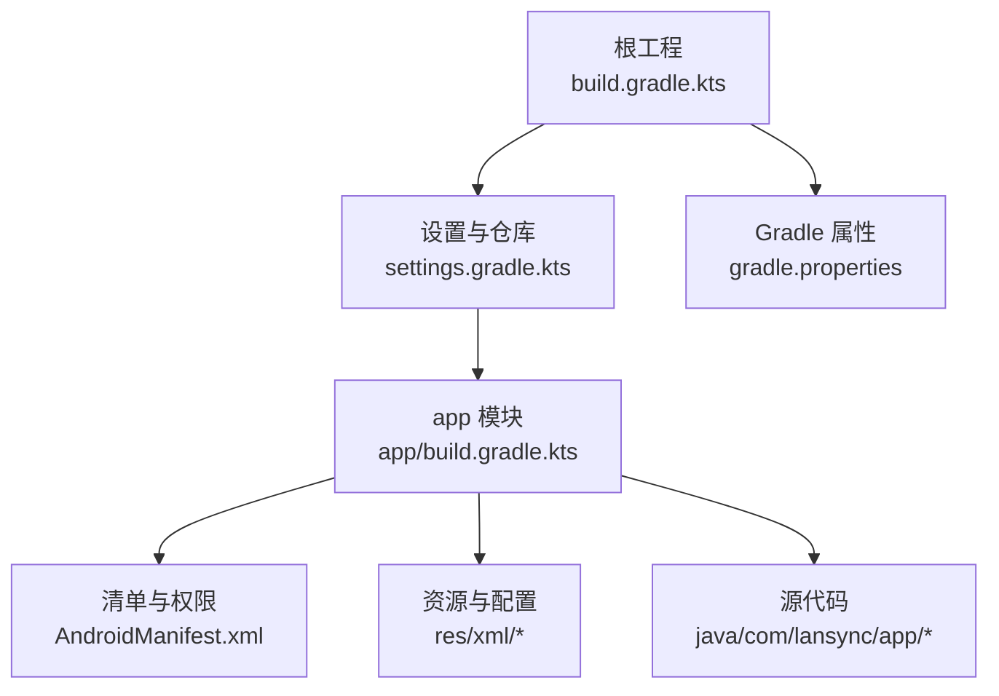
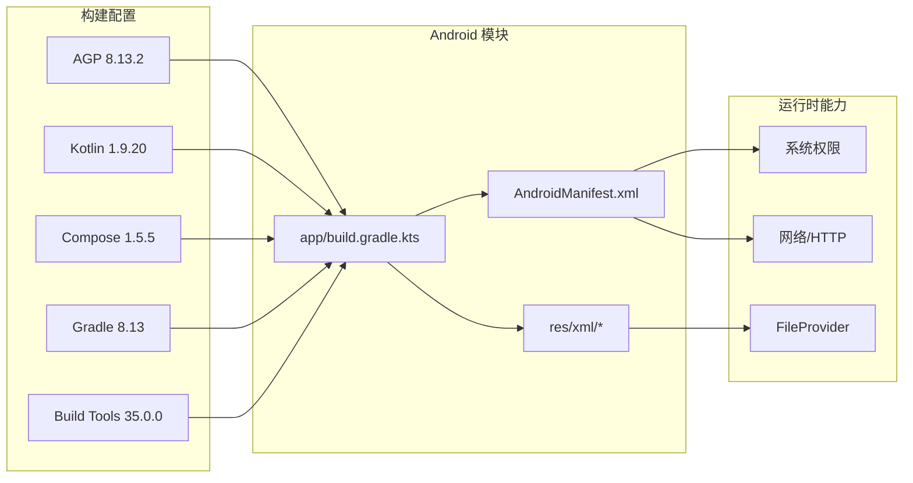
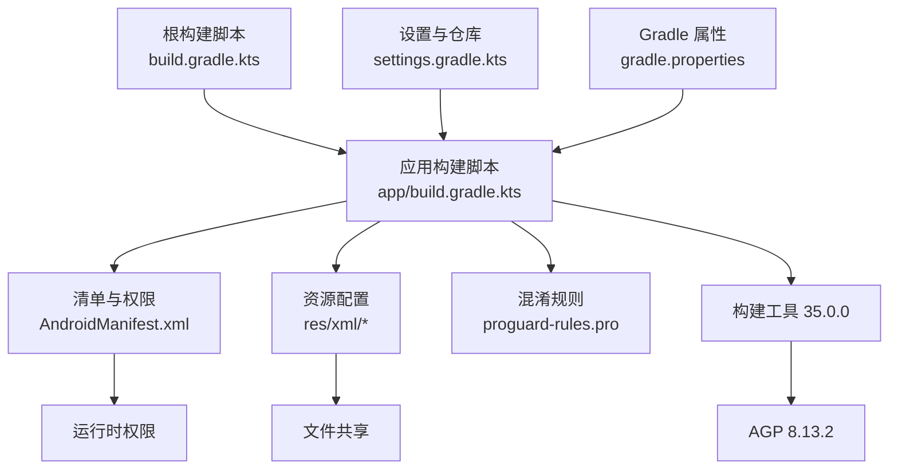

# 安装与部署

<cite>
**本文引用的文件**
- [build.gradle.kts](file://build.gradle.kts)
- [app/build.gradle.kts](file://app/build.gradle.kts)
- [settings.gradle.kts](file://settings.gradle.kts)
- [gradle.properties](file://gradle.properties)
- [gradle/wrapper/gradle-wrapper.properties](file://gradle/wrapper/gradle-wrapper.properties)
- [app/src/main/AndroidManifest.xml](file://app/src/main/AndroidManifest.xml)
- [app/src/main/res/xml/file_paths.xml](file://app/src/main/res/xml/file_paths.xml)
- [app/src/main/res/xml/network_security_config.xml](file://app/src/main/res/xml/network_security_config.xml)
- [app/proguard-rules.pro](file://app/proguard-rules.pro)
- [app/src/main/java/com/lansync/app/LanSyncApplication.kt](file://app/src/main/java/com/lansync/app/LanSyncApplication.kt)
- [REPORT.md](file://REPORT.md)
</cite>

## 更新摘要
**变更内容**
- 更新了开发环境要求部分，强调了固定 buildToolsVersion 的重要性
- 新增了构建工具配置说明，解释为什么需要本地安装的构建工具
- 增强了故障排除指南，包含构建工具相关问题的解决方案
- 更新了 CI/CD 最佳实践，包含构建工具缓存策略

## 目录
1. [简介](#简介)
2. [项目结构](#项目结构)
3. [核心组件](#核心组件)
4. [架构总览](#架构总览)
5. [详细组件分析](#详细组件分析)
6. [依赖关系分析](#依赖关系分析)
7. [性能考量](#性能考量)
8. [故障排除指南](#故障排除指南)
9. [结论](#结论)
10. [附录](#附录)

## 简介
本指南面向希望从源码构建并部署 LanSync 的开发者与运维人员。内容涵盖：
- 开发环境要求（Android Studio、SDK、Gradle、构建工具）
- 构建系统配置（依赖管理、编译选项、签名）
- 完整安装步骤（克隆到安装）
- 权限与安全配置（网络、存储、文件共享）
- 发布流程（混淆、资源优化、APK 生成）
- 常见构建与部署问题排查
- CI/CD 集成最佳实践建议

LanSync 是一款基于局域网的 P2P Android 应用更新同步工具，使用 Kotlin + Jetpack Compose UI，服务端基于 Ktor（Netty），设备发现使用 JmDNS，下载通过 OkHttp，支持 Split APK 打包传输与本地安装。

**章节来源**
- [REPORT.md:16-34](file://REPORT.md#L16-L34)

## 项目结构
仓库为单模块 Android 应用，根工程负责插件与全局仓库配置，app 模块包含全部业务代码与资源。关键目录与职责：
- app/src/main/java/com/lansync/app：应用入口、数据层、UI 层
- app/src/main/res/xml：FileProvider 路径映射、网络安全策略
- gradle/wrapper：Gradle Wrapper 版本锁定
- build.gradle.kts / settings.gradle.kts：插件与仓库源配置
- app/build.gradle.kts：Android 构建脚本（SDK、依赖、签名、混淆等）

**图表来源**
- [build.gradle.kts:1-6](file://build.gradle.kts#L1-L6)
- [settings.gradle.kts:1-27](file://settings.gradle.kts#L1-L27)
- [app/build.gradle.kts:7-76](file://app/build.gradle.kts#L7-L76)
- [app/src/main/AndroidManifest.xml:28-57](file://app/src/main/AndroidManifest.xml#L28-L57)

**章节来源**
- [settings.gradle.kts:1-27](file://settings.gradle.kts#L1-L27)
- [app/build.gradle.kts:7-76](file://app/build.gradle.kts#L7-L76)

## 核心组件
- 构建与插件：AGP 8.13.2、Kotlin 1.9.20、Compose Compiler 1.5.5
- SDK 目标：compileSdk/targetSdk 34，minSdk 29；Java/Kotlin/JVM target 17
- **构建工具**：固定使用 buildToolsVersion 35.0.0（满足 AGP 8.13 最低要求）
- 依赖管理：统一在 settings 中声明仓库（含阿里云镜像与 jitpack），启用 FAIL_ON_PROJECT_REPOS 避免子模块覆盖
- 构建类型：debug 可调试；release 开启 minify/shrinkResources 与 ProGuard 规则
- 安全与权限：INTERNET/Wi-Fi/定位/多播/Nearby Devices/QUERY_ALL_PACKAGES；明文 HTTP 允许；FileProvider 暴露缓存目录

**章节来源**
- [build.gradle.kts:1-5](file://build.gradle.kts#L1-L5)
- [app/build.gradle.kts:7-55](file://app/build.gradle.kts#L7-L55)
- [settings.gradle.kts:13-23](file://settings.gradle.kts#L13-L23)
- [app/src/main/AndroidManifest.xml:4-12](file://app/src/main/AndroidManifest.xml#L4-L12)
- [app/src/main/res/xml/network_security_config.xml:1-8](file://app/src/main/res/xml/network_security_config.xml#L1-L8)

## 架构总览
下图展示与构建和运行相关的关键配置点及其关系：

**图表来源**
- [build.gradle.kts:1-5](file://build.gradle.kts#L1-L5)
- [app/build.gradle.kts:7-76](file://app/build.gradle.kts#L7-L76)
- [app/src/main/AndroidManifest.xml:28-57](file://app/src/main/AndroidManifest.xml#L28-L57)
- [app/src/main/res/xml/file_paths.xml:1-6](file://app/src/main/res/xml/file_paths.xml#L1-L6)
- [app/src/main/res/xml/network_security_config.xml:1-8](file://app/src/main/res/xml/network_security_config.xml#L1-L8)

## 详细组件分析

### 开发环境与前置准备
- Android Studio：建议使用与 AGP 8.13.2 兼容的最新稳定版（AGP 8.x 系列）
- JDK：JDK 17（由 compileOptions/kotlinOptions 指定）
- Gradle：8.13（由 wrapper 固定）
- Android SDK：
  - compileSdk/targetSdk = 34
  - minSdk = 29
- **构建工具**：必须本地安装 build-tools 35.0.0（满足 AGP 8.13 最低要求）
- 网络：确保能访问 Google/MavenCentral/阿里云镜像与 jitpack

**重要提示**：项目已固定 buildToolsVersion 为 35.0.0，以避免从不可达的 dl.google.com 自动下载构建工具。请确保在 Android SDK Manager 中安装了该版本的构建工具。

验证要点：
- 命令行执行 ./gradlew --version 确认 Gradle 版本
- 检查 Android SDK Build Tools 是否包含 35.0.0 版本
- 在 Android Studio 中检查 Project Structure 的 JDK 与 SDK 平台是否匹配

**章节来源**
- [gradle/wrapper/gradle-wrapper.properties:1-8](file://gradle/wrapper/gradle-wrapper.properties#L1-L8)
- [app/build.gradle.kts:15-16](file://app/build.gradle.kts#L15-L16)
- [app/build.gradle.kts:48-55](file://app/build.gradle.kts#L48-L55)
- [settings.gradle.kts:13-23](file://settings.gradle.kts#L13-L23)

### 构建系统配置说明
- 插件与版本：
  - com.android.application 8.13.2
  - org.jetbrains.kotlin.android 1.9.20
  - org.jetbrains.kotlin.plugin.serialization 1.9.20
- **构建工具版本**：固定为 35.0.0，确保与 AGP 8.13.2 兼容
- 编译选项：
  - Java/Kotlin JVM target 17
  - Compose 编译器扩展 1.5.5
- 依赖仓库：
  - 优先使用阿里云镜像加速，同时保留 google/mavenCentral/jitpack
  - 启用 FAIL_ON_PROJECT_REPOS，禁止子模块私自添加仓库
- 构建类型：
  - debug：可调试，默认签名
  - release：开启代码混淆与资源压缩，需配置正式签名密钥后启用

**更新**：新增了对固定构建工具版本的支持，解决了构建可靠性问题。

**章节来源**
- [build.gradle.kts:1-5](file://build.gradle.kts#L1-L5)
- [app/build.gradle.kts:1-5](file://app/build.gradle.kts#L1-5)
- [app/build.gradle.kts:15-16](file://app/build.gradle.kts#L15-L16)
- [app/build.gradle.kts:31-46](file://app/build.gradle.kts#L31-L46)
- [settings.gradle.kts:13-23](file://settings.gradle.kts#L13-L23)

### 依赖管理与兼容性
- 主要依赖：
  - Jetpack Compose（Material3）、Lifecycle、Activity-Compose
  - kotlinx-coroutines、kotlinx-serialization-json
  - JmDNS、Gson
  - Ktor Server（Core/Netty/Content Negotiation/Serialization）
  - OkHttp
  - DocumentFile（SAF）
- 测试依赖：JUnit、MockK、coroutines-test、ktor-server-test-host
- 注意事项：
  - 若升级 Kotlin/Compose 或 AGP，需关注 R8/ProGuard 规则与 configuration-cache 兼容性
  - 仓库顺序影响解析速度，已配置国内镜像以加速
  - **构建工具版本固定**：35.0.0 版本确保与 AGP 8.13.2 完全兼容

**章节来源**
- [app/build.gradle.kts:78-115](file://app/build.gradle.kts#L78-L115)
- [settings.gradle.kts:13-23](file://settings.gradle.kts#L13-L23)

### 签名配置与发布包生成
- Debug 签名：启用 V1/V2 签名
- Release 签名：
  - 当前未启用正式签名（注释提示需在发布前配置）
  - 建议在 gradle.properties 或本地 signingConfigs 中配置 keystore、alias、密码
  - 启用后执行 assembleRelease 生成签名 APK/AAB（如需上架则生成 AAB）

命令参考：
- 生成调试包：./gradlew :app:assembleDebug
- 生成发布包：./gradlew :app:assembleRelease

**章节来源**
- [app/build.gradle.kts:24-46](file://app/build.gradle.kts#L24-L46)

### 权限配置与安全设置
- 网络与 Wi-Fi：
  - INTERNET、ACCESS_NETWORK_STATE、ACCESS_WIFI_STATE、CHANGE_WIFI_STATE
  - CHANGE_WIFI_MULTICAST_STATE（用于 JmDNS 多播）
  - NEARBY_WIFI_DEVICES（neverForLocation，Android 12+ 附近设备）
- 定位权限（历史兼容）：
  - ACCESS_FINE_LOCATION、ACCESS_COARSE_LOCATION
- 应用扫描：
  - QUERY_ALL_PACKAGES（枚举已安装应用）
- 明文 HTTP：
  - usesCleartextTraffic=true
  - network_security_config.xml 允许 base-config 明文流量
- 文件共享（FileProvider）：
  - authority 为 ${applicationId}.fileprovider
  - 暴露缓存目录 apks/ 与 downloads/（file_paths.xml）

注意：
- 生产环境建议评估明文 HTTP 风险，必要时改为 HTTPS 或增加鉴权
- 对敏感权限（如 QUERY_ALL_PACKAGES）在 Play 上架需说明用途

**章节来源**
- [app/src/main/AndroidManifest.xml:4-12](file://app/src/main/AndroidManifest.xml#L4-L12)
- [app/src/main/res/xml/network_security_config.xml:1-8](file://app/src/main/res/xml/network_security_config.xml#L1-L8)
- [app/src/main/res/xml/file_paths.xml:1-6](file://app/src/main/res/xml/file_paths.xml#L1-L6)

### 完整安装步骤（从源码到安装）
1. **安装开发环境**
   - 安装 Android Studio（推荐最新稳定版）
   - 配置 JDK 17
   - 安装 Android SDK 34 及对应平台工具
   - **安装构建工具 35.0.0**：在 Android SDK Manager 中确保安装了 build-tools 35.0.0

2. **克隆仓库**
   - git clone <仓库地址>
   - 进入项目根目录

3. **同步与构建**
   - 首次打开项目时等待 Gradle 同步完成
   - 执行 ./gradlew :app:assembleDebug 构建调试包

4. **安装到设备/模拟器**
   - 连接设备并开启 USB 调试，或使用模拟器
   - 执行 ./gradlew :app:installDebug 或通过 Android Studio Run 安装

5. **启动应用**
   - 在设备上启动 LanSync，按界面提示进行设备发现与连接

可选：
- 生成发布包：配置签名后执行 ./gradlew :app:assembleRelease

**更新**：新增了构建工具安装步骤，确保构建过程顺利进行。

**章节来源**
- [gradle/wrapper/gradle-wrapper.properties:1-8](file://gradle/wrapper/gradle-wrapper.properties#L1-L8)
- [app/build.gradle.kts:15-16](file://app/build.gradle.kts#L15-L16)
- [app/build.gradle.kts:31-46](file://app/build.gradle.kts#L31-L46)
- [app/src/main/AndroidManifest.xml:38-46](file://app/src/main/AndroidManifest.xml#L38-L46)

### 发布流程（混淆、资源优化、APK 生成）
- 混淆与压缩：
  - release 构建已启用 isMinifyEnabled 与 isShrinkResources
  - ProGuard 规则位于 app/proguard-rules.pro，已针对序列化、网络库、Ktor/Netty、Compose 等进行保留与忽略警告处理
- 资源优化：
  - packaging 中排除冗余 META-INF 条目，减少冲突
- 产物：
  - assembleRelease 输出签名后的 APK（或 AAB，视配置而定）

发布前建议：
- 配置正式签名密钥并启用 release signingConfig
- 在 CI 中缓存 Gradle 与依赖，提升构建速度
- 对敏感信息（keystore、密码）使用密钥管理服务

**章节来源**
- [app/build.gradle.kts:31-76](file://app/build.gradle.kts#L31-L76)
- [app/proguard-rules.pro:1-66](file://app/proguard-rules.pro#L1-L66)

### 故障排除指南
常见问题与解决思路：

#### 构建工具相关问题（新增）
- **构建工具版本不匹配**：
  - 错误信息："Could not resolve all dependencies for configuration ':app:debugCompileClasspath'"
  - 解决方案：确保 Android SDK 中安装了 build-tools 35.0.0
  - 检查方法：查看 Android SDK Manager → SDK Tools → Show Package Details
- **无法从 dl.google.com 下载构建工具**：
  - 项目已固定版本为 35.0.0，避免自动下载
  - 如果仍遇到问题，手动安装所需版本
- **构建工具路径配置错误**：
  - 检查 ANDROID_HOME 环境变量是否正确设置
  - 在 Android Studio 中重新配置 SDK 路径

#### 其他常见问题
- Gradle 同步失败/下载慢
  - 检查网络是否能访问 Google/MavenCentral/阿里云镜像
  - 清理缓存：./gradlew clean && 删除 .gradle/caches 后重试
- 编译错误（JDK/SDK 不匹配）
  - 确认 JDK 17、compileSdk/targetSdk=34、minSdk=29
  - 在 Android Studio 中重新选择 Project JDK 与 SDK 路径
- 构建时报 R8/ProGuard 错误
  - 检查 proguard-rules.pro 中的保留规则是否覆盖新增类
  - 临时关闭混淆定位问题，再逐步恢复
- 安装失败（签名问题）
  - 调试包使用默认签名；发布包需正确配置 keystore 与 alias
  - 卸载旧版本后再安装新版本
- 运行时权限导致功能异常
  - 确保授予必要的网络、Wi-Fi、定位、查询包名等权限
  - 检查 FileProvider 暴露的目录是否正确
- 明文 HTTP 被拦截
  - 确认 network_security_config.xml 已启用明文流量
  - 生产环境建议改用 HTTPS 或内网可信证书

**更新**：新增了构建工具相关的故障排除指南。

**章节来源**
- [app/build.gradle.kts:15-16](file://app/build.gradle.kts#L15-L16)
- [app/build.gradle.kts:31-76](file://app/build.gradle.kts#L31-L76)
- [app/src/main/AndroidManifest.xml:4-12](file://app/src/main/AndroidManifest.xml#L4-L12)
- [app/src/main/res/xml/network_security_config.xml:1-8](file://app/src/main/res/xml/network_security_config.xml#L1-L8)
- [app/proguard-rules.pro:1-66](file://app/proguard-rules.pro#L1-L66)

### CI/CD 集成最佳实践
- 环境固化
  - 使用 Gradle Wrapper 锁定 Gradle 版本
  - **预安装构建工具**：在 CI 环境中预先安装 build-tools 35.0.0
  - 在 CI 中缓存 Gradle 与依赖目录，缩短构建时间
- 构建矩阵
  - 并行构建 debug/release，执行 lint/test 任务
  - 使用不同 JDK/AGP 组合进行兼容性验证
- 签名与制品
  - 将 keystore 与凭据注入 CI 密钥库，避免硬编码
  - 上传构建产物（APK/AAB）至制品库或发布通道
- 质量门禁
  - 集成静态检查（lint）、单元测试、覆盖率阈值
  - 对 ProGuard 规则变更进行回归测试
- 回滚与通知
  - 构建失败即时通知团队
  - 发布流水线包含灰度/回滚策略

**更新**：新增了构建工具在 CI/CD 环境中的配置建议。

[本节为通用实践建议，不直接引用具体代码文件]

## 依赖关系分析
构建与运行依赖关系如下：

**图表来源**
- [build.gradle.kts:1-5](file://build.gradle.kts#L1-L5)
- [settings.gradle.kts:13-23](file://settings.gradle.kts#L13-L23)
- [app/build.gradle.kts:7-76](file://app/build.gradle.kts#L7-L76)
- [app/src/main/AndroidManifest.xml:28-57](file://app/src/main/AndroidManifest.xml#L28-L57)
- [app/src/main/res/xml/file_paths.xml:1-6](file://app/src/main/res/xml/file_paths.xml#L1-L6)
- [app/proguard-rules.pro:1-66](file://app/proguard-rules.pro#L1-L66)

**章节来源**
- [settings.gradle.kts:13-23](file://settings.gradle.kts#L13-L23)
- [app/build.gradle.kts:78-115](file://app/build.gradle.kts#L78-L115)

## 性能考量
- 构建性能
  - 启用 Gradle 配置缓存（已在 gradle.properties 中开启）
  - 合理设置 JVM 堆内存（-Xmx2048m）
  - 使用本地/国内镜像加速依赖下载
  - **构建工具本地缓存**：固定版本避免重复下载，提升构建稳定性
- 运行时性能
  - 合理使用协程与异步 IO（OkHttp/Ktor）
  - 控制日志级别与轮转策略，避免 I/O 瓶颈
  - 对大文件下载使用流式传输与进度回调

[本节提供通用指导，不直接分析具体文件]

## 结论
LanSync 采用现代 Android 技术栈，构建配置清晰、依赖管理集中、发布流程具备混淆与资源优化能力。**通过固定构建工具版本为 35.0.0，项目解决了从不可达 Google 仓库下载构建工具的问题，显著提升了构建可靠性和开发体验**。部署时需重点关注 JDK/SDK 版本一致性、构建工具安装、仓库可达性、签名配置以及权限与安全策略。遵循本指南可快速完成从源码到安装的完整流程，并在 CI/CD 中实现高效稳定的自动化构建与发布。

[本节为总结性内容，不直接引用具体文件]

## 附录
- 应用入口初始化：LanSyncApplication 在 onCreate 中初始化文件日志
- 主界面入口：MainActivity 作为 LAUNCHER 活动

**章节来源**
- [app/src/main/java/com/lansync/app/LanSyncApplication.kt:6-10](file://app/src/main/java/com/lansync/app/LanSyncApplication.kt#L6-L10)
- [app/src/main/AndroidManifest.xml:38-46](file://app/src/main/AndroidManifest.xml#L38-L46)