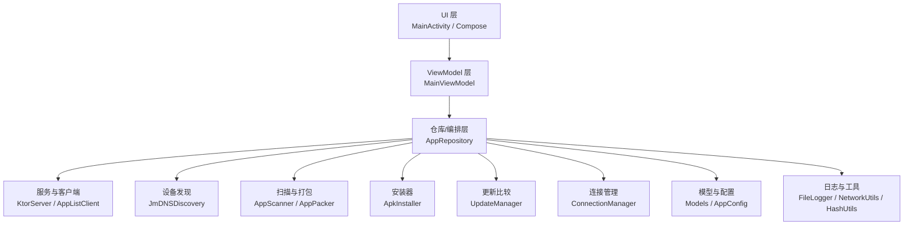
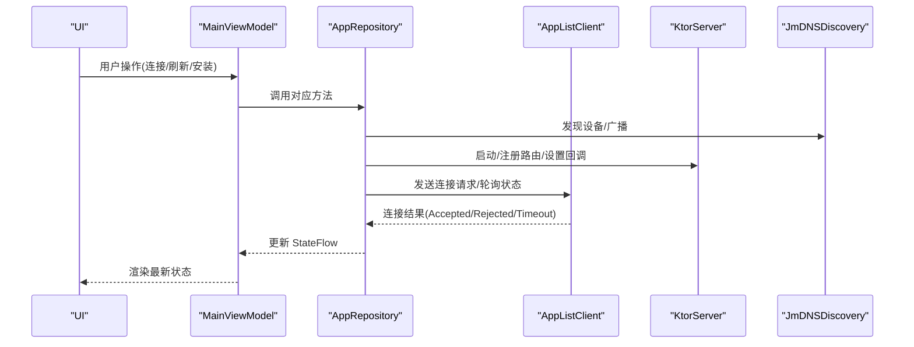
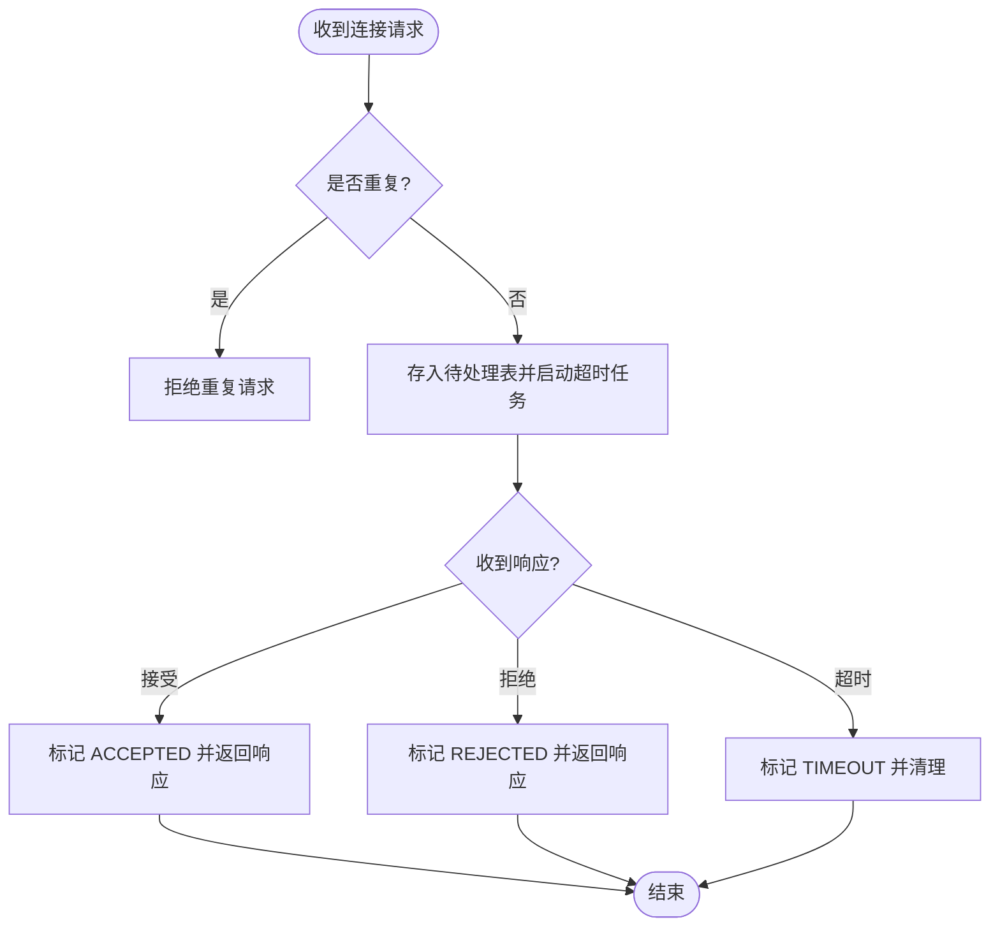
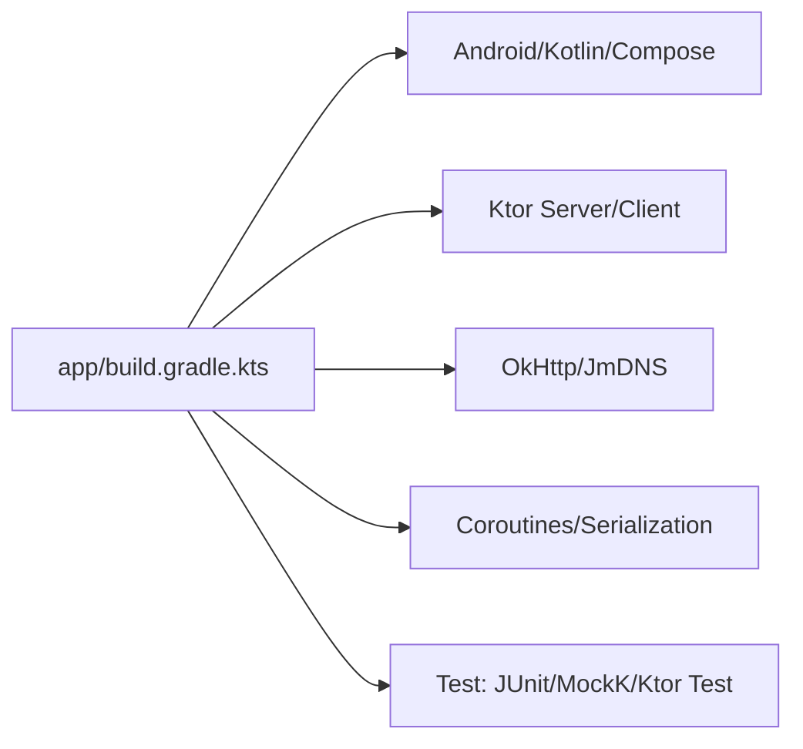

# 开发者指南

<cite>
**本文引用的文件**
- [LanSyncApplication.kt](file://app/src/main/java/com/lansync/app/LanSyncApplication.kt)
- [MainActivity.kt](file://app/src/main/java/com/lansync/app/MainActivity.kt)
- [MainViewModel.kt](file://app/src/main/java/com/lansync/app/ui/viewmodel/MainViewModel.kt)
- [AppRepository.kt](file://app/src/main/java/com/lansync/app/data/repository/AppRepository.kt)
- [ConnectionManager.kt](file://app/src/main/java/com/lansync/app/data/connection/ConnectionManager.kt)
- [Models.kt](file://app/src/main/java/com/lansync/app/data/model/Models.kt)
- [FileLogger.kt](file://app/src/main/java/com/lansync/app/data/FileLogger.kt)
- [AppConfig.kt](file://app/src/main/java/com/lansync/app/data/AppConfig.kt)
- [build.gradle.kts](file://app/build.gradle.kts)
- [settings.gradle.kts](file://settings.gradle.kts)
- [REPORT.md](file://REPORT.md)
</cite>

## 目录
1. [简介](#简介)
2. [项目结构](#项目结构)
3. [核心组件](#核心组件)
4. [架构总览](#架构总览)
5. [详细组件分析](#详细组件分析)
6. [依赖关系分析](#依赖关系分析)
7. [性能与稳定性](#性能与稳定性)
8. [调试与排错](#调试与排错)
9. [扩展点与自定义机制](#扩展点与自定义机制)
10. [开发工作流与规范](#开发工作流与规范)
11. [贡献指南](#贡献指南)
12. [结论](#结论)

## 简介
本指南面向希望参与 LanSync 开发的工程师，目标是帮助新贡献者快速理解代码布局、遵循编码规范、掌握开发工作流，并了解如何扩展功能与定位问题。LanSync 是一个基于局域网的 P2P Android 应用更新同步工具，使用 Kotlin + Jetpack Compose + Ktor Server + JmDNS 实现设备发现、连接配对、应用列表同步、增量更新推荐与下载安装等能力。

## 项目结构
- 单模块应用（:app），采用分层组织：
  - UI 层：Compose 界面与主题，位于 ui 包下
  - ViewModel 层：状态聚合与业务编排入口，位于 ui/viewmodel
  - 数据与基础设施层：data 包下按职责划分子包（cache、client、connection、discovery、installer、model、packer、repository、scanner、server、update）
  - 资源与清单：res 与 AndroidManifest.xml
- 构建配置集中在根 build.gradle.kts 与 app/build.gradle.kts；仓库源在 settings.gradle.kts 中统一声明

图表来源
- [MainActivity.kt:26-106](file://app/src/main/java/com/lansync/app/MainActivity.kt#L26-L106)
- [MainViewModel.kt:47-124](file://app/src/main/java/com/lansync/app/ui/viewmodel/MainViewModel.kt#L47-L124)
- [AppRepository.kt:40-87](file://app/src/main/java/com/lansync/app/data/repository/AppRepository.kt#L40-L87)

章节来源
- [settings.gradle.kts:1-27](file://settings.gradle.kts#L1-L27)
- [build.gradle.kts:1-6](file://app/build.gradle.kts#L1-L6)
- [REPORT.md:46-70](file://REPORT.md#L46-L70)

## 核心组件
- 应用启动与初始化：LanSyncApplication 仅初始化文件日志，确保后续可追踪
- 主界面与导航：MainActivity 使用 Compose Scaffold 组织顶部栏、底部 Tab 与内容区
- 状态编排：MainViewModel 将 Repository 的多路 StateFlow 组合为 UiState 供 UI 消费
- 仓库与协调：AppRepository 负责连接、心跳、设备发现、更新推荐、下载与安装等跨模块编排
- 连接管理：ConnectionManager 维护待处理连接请求、超时与响应状态机
- 数据模型：Models.kt 定义所有网络传输与本地状态的数据类与枚举
- 日志系统：FileLogger 提供异步落盘日志、轮转与清理

章节来源
- [LanSyncApplication.kt:6-11](file://app/src/main/java/com/lansync/app/LanSyncApplication.kt#L6-L11)
- [MainActivity.kt:26-106](file://app/src/main/java/com/lansync/app/MainActivity.kt#L26-L106)
- [MainViewModel.kt:22-124](file://app/src/main/java/com/lansync/app/ui/viewmodel/MainViewModel.kt#L22-L124)
- [AppRepository.kt:40-87](file://app/src/main/java/com/lansync/app/data/repository/AppRepository.kt#L40-L87)
- [ConnectionManager.kt:19-27](file://app/src/main/java/com/lansync/app/data/connection/ConnectionManager.kt#L19-L27)
- [Models.kt:5-138](file://app/src/main/java/com/lansync/app/data/model/Models.kt#L5-L138)
- [FileLogger.kt:19-119](file://app/src/main/java/com/lansync/app/data/FileLogger.kt#L19-L119)

## 架构总览
- 分层清晰：UI → ViewModel → Repository → 各子系统（服务端/客户端/发现/扫描/打包/安装/更新）
- 状态驱动：通过 StateFlow 暴露状态，ViewModel 组合后注入 UI
- 事件驱动：连接请求、心跳、刷新等通过协程与回调驱动
- 可扩展：服务端通过回调注入行为（应用列表提供者、打包器、断开处理器等）

图表来源
- [MainViewModel.kt:84-124](file://app/src/main/java/com/lansync/app/ui/viewmodel/MainViewModel.kt#L84-L124)
- [AppRepository.kt:386-484](file://app/src/main/java/com/lansync/app/data/repository/AppRepository.kt#L386-L484)
- [ConnectionManager.kt:29-87](file://app/src/main/java/com/lansync/app/data/connection/ConnectionManager.kt#L29-L87)

## 详细组件分析

### 应用启动与日志
- 应用启动时初始化日志系统，写入外部存储，支持轮转与清理
- 日志级别包含 DEBUG/INFO/WARN/ERROR，并提供 JSON 便捷输出

章节来源
- [LanSyncApplication.kt:6-11](file://app/src/main/java/com/lansync/app/LanSyncApplication.kt#L6-L11)
- [FileLogger.kt:34-119](file://app/src/main/java/com/lansync/app/data/FileLogger.kt#L34-L119)

### 主界面与状态绑定
- MainActivity 使用 Compose 构建多 Tab 页面，顶部栏与底部导航切换
- MainViewModel 收集 Repository 的多路 StateFlow，合并为 UiState 供 UI 消费
- 关键流程：自动启动服务、首次扫描提示、批量更新与拉取远程应用

章节来源
- [MainActivity.kt:26-106](file://app/src/main/java/com/lansync/app/MainActivity.kt#L26-L106)
- [MainViewModel.kt:60-124](file://app/src/main/java/com/lansync/app/ui/viewmodel/MainViewModel.kt#L60-L124)

### 仓库与连接编排
- AppRepository 是核心协调器，负责：
  - 设备发现与连接生命周期管理
  - 心跳检测与重连策略
  - 端口迁移与状态保持
  - 更新推荐与差异计算
  - 下载与安装流程编排
- 通过多个 MutableStateFlow 暴露状态，ViewModel 进行组合

章节来源
- [AppRepository.kt:40-87](file://app/src/main/java/com/lansync/app/data/repository/AppRepository.kt#L40-L87)
- [AppRepository.kt:134-172](file://app/src/main/java/com/lansync/app/data/repository/AppRepository.kt#L134-L172)
- [AppRepository.kt:386-484](file://app/src/main/java/com/lansync/app/data/repository/AppRepository.kt#L386-L484)

### 连接管理状态机
- ConnectionManager 维护待处理请求、超时与响应状态
- 支持接收请求、响应、查询状态、移除请求与清空
- 超时自动拒绝，保证资源释放

图表来源
- [ConnectionManager.kt:29-87](file://app/src/main/java/com/lansync/app/data/connection/ConnectionManager.kt#L29-L87)
- [ConnectionManager.kt:132-147](file://app/src/main/java/com/lansync/app/data/connection/ConnectionManager.kt#L132-L147)

章节来源
- [ConnectionManager.kt:19-156](file://app/src/main/java/com/lansync/app/data/connection/ConnectionManager.kt#L19-L156)

### 数据模型与配置
- Models.kt 定义了应用信息、设备信息、连接状态、更新信息、同步差异以及网络载荷
- AppConfig 集中管理心跳间隔、重试次数、超时等可调参数

章节来源
- [Models.kt:5-138](file://app/src/main/java/com/lansync/app/data/model/Models.kt#L5-L138)
- [AppConfig.kt:3-17](file://app/src/main/java/com/lansync/app/data/AppConfig.kt#L3-L17)

## 依赖关系分析
- 构建与插件：Android Gradle Plugin、Kotlin、序列化插件
- 运行时依赖：Compose、Coroutines、Ktor、OkHttp、JmDNS、Gson、Play Services Base、DocumentFile
- 测试依赖：JUnit、MockK、Coroutines Test、Ktor Test Host

图表来源
- [build.gradle.kts:1-115](file://app/build.gradle.kts#L1-L115)

章节来源
- [build.gradle.kts:78-115](file://app/build.gradle.kts#L78-L115)
- [settings.gradle.kts:13-23](file://settings.gradle.kts#L13-L23)

## 性能与稳定性
- 心跳与周期同步：通过协程循环与延迟控制频率，避免频繁网络请求
- 重试与节流：应用列表获取带重试与退避，更新推荐计算有节流保护
- 并发安全：使用 SupervisorJob、ConcurrentHashMap、Mutex 等保障并发安全
- 资源管理：日志文件轮转、缓存目录清理、下载进度与安装状态及时清理

章节来源
- [AppRepository.kt:134-172](file://app/src/main/java/com/lansync/app/data/repository/AppRepository.kt#L134-L172)
- [AppRepository.kt:720-759](file://app/src/main/java/com/lansync/app/data/repository/AppRepository.kt#L720-L759)
- [FileLogger.kt:46-76](file://app/src/main/java/com/lansync/app/data/FileLogger.kt#L46-L76)

## 调试与排错
- 日志记录：使用 FileLogger 输出到外部存储，支持级别过滤与异常堆栈
- 常见问题：
  - 连接失败：检查目标设备是否在线、端口是否正确、防火墙是否放行
  - 下载失败：确认 X-MD5 或 expectedMd5 校验一致，检查磁盘空间
  - 安装失败：确认包名与版本匹配，检查系统安装器权限
- 建议：
  - 在关键路径添加日志，便于定位问题
  - 使用模拟器或真机配合 adb logcat 与文件日志联合排查
  - 对网络请求增加超时与重试策略，提升鲁棒性

章节来源
- [FileLogger.kt:90-119](file://app/src/main/java/com/lansync/app/data/FileLogger.kt#L90-L119)
- [REPORT.md:163-166](file://REPORT.md#L163-L166)

## 扩展点与自定义机制
- 服务端回调注入：可通过 setAppListProvider、setPacker、setDisconnectHandler、setRefreshAppListHandler、setDeviceName 定制行为
- 连接策略：可调整心跳间隔、重试次数、超时时间等参数
- 安装器扩展：可替换 ApkInstaller 以支持不同安装方式
- 日志扩展：可在 FileLogger 中添加新的日志级别或输出目标

章节来源
- [AppRepository.kt:624-647](file://app/src/main/java/com/lansync/app/data/repository/AppRepository.kt#L624-L647)
- [AppConfig.kt:3-17](file://app/src/main/java/com/lansync/app/data/AppConfig.kt#L3-L17)

## 开发工作流与规范
- 分支管理：
  - 主分支：main（稳定版本）
  - 功能分支：feature/*（新功能）
  - 修复分支：fix/*（缺陷修复）
  - 发布分支：release/*（发布准备）
- 提交规范：
  - 提交信息格式：类型(范围): 描述
  - 示例：feat(ui): 新增设备列表筛选功能
  - 类型包括：feat、fix、docs、style、refactor、test、chore
- 代码审查：
  - 所有变更需经过至少一位 reviewer 批准
  - 关注：可读性、性能、安全性、测试覆盖
- 编码规范：
  - 遵循 Kotlin 官方风格指南
  - 命名约定：类名 PascalCase，函数/变量 camelCase，常量 UPPER_SNAKE_CASE
  - 注释：公共 API 必须包含文档注释，复杂逻辑添加行内注释
  - 文件组织：按功能分包，单一职责原则

章节来源
- [REPORT.md:253-263](file://REPORT.md#L253-L263)

## 贡献指南
- 如何参与：
  - Fork 项目并在本地创建功能分支
  - 编写代码与单元测试
  - 提交 Pull Request 并等待审查
- 问题报告：
  - 使用 GitHub Issues 报告问题
  - 提供复现步骤、期望行为与实际行为
  - 附上相关日志与截图
- 最佳实践：
  - 小步提交，便于审查
  - 保持代码简洁与可读性
  - 添加必要的测试用例

章节来源
- [REPORT.md:253-263](file://REPORT.md#L253-L263)

## 结论
LanSync 采用清晰的层次化架构与状态驱动设计，具备良好的可扩展性与可维护性。通过遵循本指南中的规范与工作流，新贡献者可以快速上手并为项目做出贡献。建议在后续迭代中逐步完善测试覆盖、优化性能瓶颈并增强安全性。