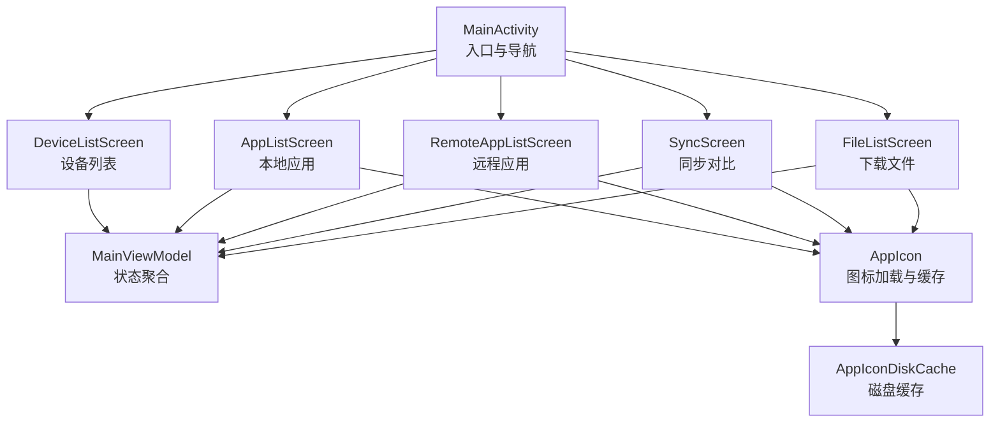
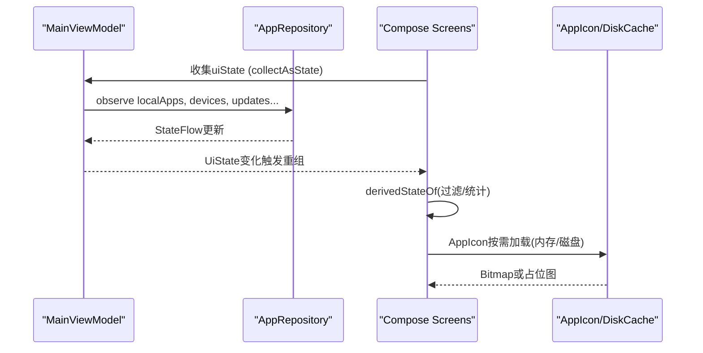
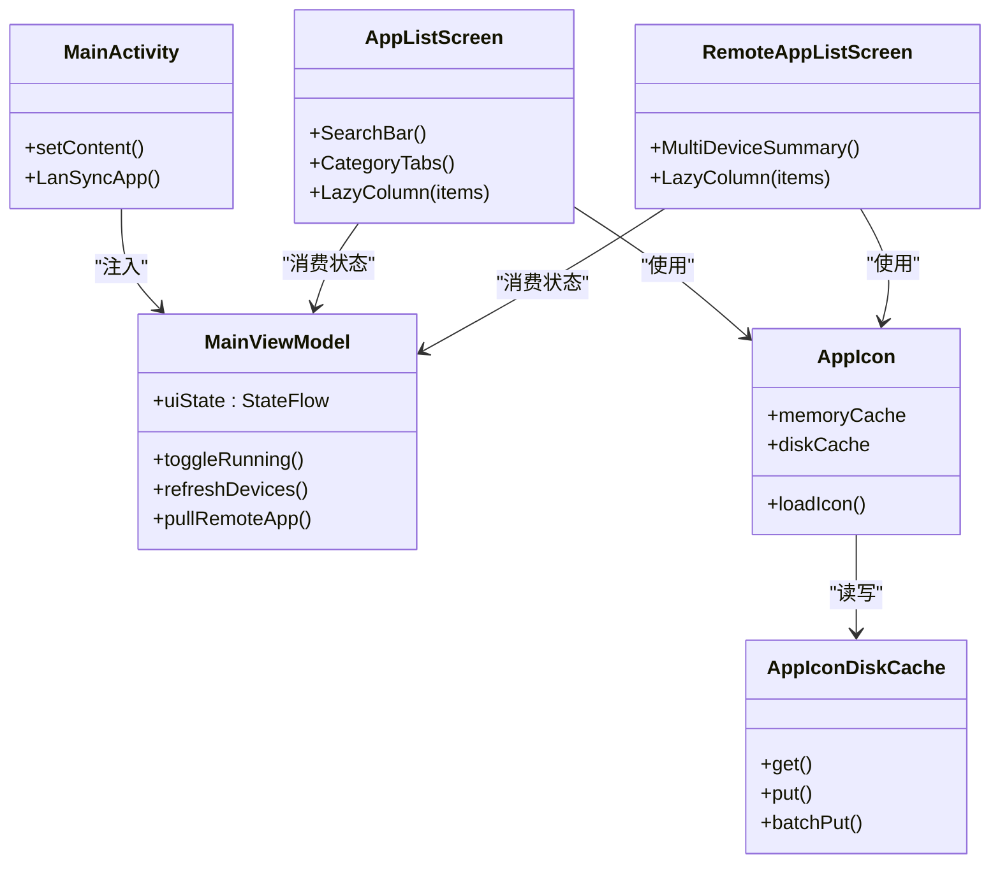

# UI渲染优化

<cite>
**本文引用的文件**
- [MainActivity.kt](file://app/src/main/java/com/lansync/app/MainActivity.kt)
- [AppListScreen.kt](file://app/src/main/java/com/lansync/app/ui/components/AppListScreen.kt)
- [DeviceListScreen.kt](file://app/src/main/java/com/lansync/app/ui/components/DeviceListScreen.kt)
- [FileListScreen.kt](file://app/src/main/java/com/lansync/app/ui/components/FileListScreen.kt)
- [RemoteAppListScreen.kt](file://app/src/main/java/com/lansync/app/ui/components/RemoteAppListScreen.kt)
- [SyncScreen.kt](file://app/src/main/java/com/lansync/app/ui/components/SyncScreen.kt)
- [AppIcon.kt](file://app/src/main/java/com/lansync/app/ui/components/AppIcon.kt)
- [MainViewModel.kt](file://app/src/main/java/com/lansync/app/ui/viewmodel/MainViewModel.kt)
- [AppIconDiskCache.kt](file://app/src/main/java/com/lansync/app/data/cache/AppIconDiskCache.kt)
</cite>

## 目录
1. [简介](#简介)
2. [项目结构](#项目结构)
3. [核心组件](#核心组件)
4. [架构总览](#架构总览)
5. [详细组件分析](#详细组件分析)
6. [依赖关系分析](#依赖关系分析)
7. [性能考量](#性能考量)
8. [故障排查指南](#故障排查指南)
9. [结论](#结论)
10. [附录](#附录)

## 简介
本指南聚焦LanSync应用的UI渲染优化，围绕Jetpack Compose重组优化、懒加载与虚拟化列表、图片与缓存策略、动画与过渡效果、以及性能分析与基准测试方法展开。文档基于仓库中的实际代码实现，提供可操作的优化建议与最佳实践，帮助在大型数据集和复杂交互场景下保持流畅的滚动与稳定的帧率。

## 项目结构
LanSync采用典型的MVVM + Compose分层：
- 入口与导航：MainActivity负责主题、Scaffold布局与底部导航切换各Tab页面。
- UI层：多个Composable屏幕（设备列表、本地应用、远程应用、同步对比、文件管理）使用LazyColumn进行列表渲染。
- 状态与业务：MainViewModel通过StateFlow聚合Repository状态，驱动UI。
- 资源与缓存：AppIcon组件结合内存与磁盘两级缓存，避免重复解码与IO。

**图表来源**
- [MainActivity.kt:26-106](file://app/src/main/java/com/lansync/app/MainActivity.kt#L26-L106)
- [AppListScreen.kt:27-121](file://app/src/main/java/com/lansync/app/ui/components/AppListScreen.kt#L27-L121)
- [DeviceListScreen.kt:20-152](file://app/src/main/java/com/lansync/app/ui/components/DeviceListScreen.kt#L20-L152)
- [RemoteAppListScreen.kt:24-283](file://app/src/main/java/com/lansync/app/ui/components/RemoteAppListScreen.kt#L24-L283)
- [SyncScreen.kt:22-209](file://app/src/main/java/com/lansync/app/ui/components/SyncScreen.kt#L22-L209)
- [FileListScreen.kt:22-131](file://app/src/main/java/com/lansync/app/ui/components/FileListScreen.kt#L22-L131)
- [AppIcon.kt:42-93](file://app/src/main/java/com/lansync/app/ui/components/AppIcon.kt#L42-L93)
- [AppIconDiskCache.kt:9-95](file://app/src/main/java/com/lansync/app/data/cache/AppIconDiskCache.kt#L9-L95)

**章节来源**
- [MainActivity.kt:26-106](file://app/src/main/java/com/lansync/app/MainActivity.kt#L26-L106)

## 核心组件
- 列表与筛选：AppListScreen、RemoteAppListScreen、SyncScreen、FileListScreen大量使用LazyColumn与items，并通过remember+derivedStateOf对搜索与分类结果进行派生计算，减少不必要的重组。
- 设备与连接：DeviceListScreen展示设备状态卡片与连接操作，使用条件渲染与状态驱动的UI分支。
- 图标与缓存：AppIcon组件实现内存LruCache与磁盘缓存，异步加载并回退到默认占位图，降低主线程压力。
- 状态管理：MainViewModel集中管理UI状态，通过StateFlow将数据流推送给UI层，保证单一事实源。

**章节来源**
- [AppListScreen.kt:27-121](file://app/src/main/java/com/lansync/app/ui/components/AppListScreen.kt#L27-L121)
- [RemoteAppListScreen.kt:24-283](file://app/src/main/java/com/lansync/app/ui/components/RemoteAppListScreen.kt#L24-L283)
- [SyncScreen.kt:22-209](file://app/src/main/java/com/lansync/app/ui/components/SyncScreen.kt#L22-L209)
- [FileListScreen.kt:22-131](file://app/src/main/java/com/lansync/app/ui/components/FileListScreen.kt#L22-L131)
- [DeviceListScreen.kt:20-152](file://app/src/main/java/com/lansync/app/ui/components/DeviceListScreen.kt#L20-L152)
- [AppIcon.kt:42-93](file://app/src/main/java/com/lansync/app/ui/components/AppIcon.kt#L42-L93)
- [MainViewModel.kt:22-56](file://app/src/main/java/com/lansync/app/ui/viewmodel/MainViewModel.kt#L22-L56)

## 架构总览
UI层通过ViewModel订阅Repository的状态流，组合出UiState后下发至各屏幕。列表项使用稳定的key与contentType提升复用效率；派生状态用于过滤与统计，避免每次输入都重建列表。

**图表来源**
- [MainViewModel.kt:84-124](file://app/src/main/java/com/lansync/app/ui/viewmodel/MainViewModel.kt#L84-L124)
- [AppListScreen.kt:35-53](file://app/src/main/java/com/lansync/app/ui/components/AppListScreen.kt#L35-L53)
- [RemoteAppListScreen.kt:42-95](file://app/src/main/java/com/lansync/app/ui/components/RemoteAppListScreen.kt#L42-L95)
- [AppIcon.kt:42-93](file://app/src/main/java/com/lansync/app/ui/components/AppIcon.kt#L42-L93)
- [AppIconDiskCache.kt:19-49](file://app/src/main/java/com/lansync/app/data/cache/AppIconDiskCache.kt#L19-L49)

## 详细组件分析

### Jetpack Compose重组优化
- remember与derivedStateOf的正确使用
  - 搜索与分类过滤：在AppListScreen与RemoteAppListScreen中，使用remember配合derivedStateOf对searchQuery与category进行派生计算，仅当依赖变化时重新生成filteredApps，避免全量重组。
  - 计数与汇总：totalCount、userCount、systemCount等通过derivedStateOf从原始列表派生，减少重复遍历。
  - 选择状态：在RemoteAppListScreen中，isAllSelected由filteredApps与selectedPackages派生，确保全选按钮状态正确且高效。
- 不必要的重组避免
  - items的key与contentType：为每个列表项设置稳定key（如packageName或remote_前缀），并提供contentType常量，提升RecyclerView复用效率。
  - 局部状态下沉：搜索词与分类选择位于各自屏幕内部，避免父级状态频繁变更导致子树重绘。
- 状态提升策略
  - 选择状态提升至ViewModel：selectedUpdates与remoteAppSelections在MainViewModel中维护，UI只负责显示与回调，降低UI层复杂度与重组范围。
  - 批量操作在ViewModel执行：批量更新与拉取逻辑集中在ViewModel，UI仅触发事件，减少跨层级状态同步成本。

**章节来源**
- [AppListScreen.kt:32-53](file://app/src/main/java/com/lansync/app/ui/components/AppListScreen.kt#L32-L53)
- [RemoteAppListScreen.kt:38-101](file://app/src/main/java/com/lansync/app/ui/components/RemoteAppListScreen.kt#L38-L101)
- [MainViewModel.kt:225-243](file://app/src/main/java/com/lansync/app/ui/viewmodel/MainViewModel.kt#L225-L243)
- [MainViewModel.kt:343-361](file://app/src/main/java/com/lansync/app/ui/viewmodel/MainViewModel.kt#L343-L361)

### 懒加载实现
- LazyColumn项预加载
  - 当前实现未显式配置预加载参数。建议在大数据集场景下根据设备性能调整预加载数量，以减少滚动时的首帧延迟。
- 图片懒加载
  - AppIcon组件在LaunchedEffect中异步加载图标，优先检查内存缓存，再尝试磁盘缓存，最后从系统包管理器加载并写入磁盘缓存。失败时显示占位图标，避免阻塞UI。
- 分页加载优化
  - 当前列表未实现分页。对于远程应用或设备列表，建议引入分页API与LazyPagingList，按页加载与增量更新，降低内存占用与网络压力。

**章节来源**
- [AppListScreen.kt:106-118](file://app/src/main/java/com/lansync/app/ui/components/AppListScreen.kt#L106-L118)
- [RemoteAppListScreen.kt:227-244](file://app/src/main/java/com/lansync/app/ui/components/RemoteAppListScreen.kt#L227-L244)
- [AppIcon.kt:56-69](file://app/src/main/java/com/lansync/app/ui/components/AppIcon.kt#L56-L69)
- [AppIconDiskCache.kt:19-49](file://app/src/main/java/com/lansync/app/data/cache/AppIconDiskCache.kt#L19-L49)

### 虚拟化列表技术
- 大型数据集的高效渲染
  - 使用LazyColumn与items，并为每项提供稳定key与contentType，确保视图复用与最小化重建。
  - 通过派生状态过滤数据后再传入列表，减少可见区域外的计算开销。
- 滚动性能优化
  - 避免在item内执行昂贵计算；将计算移至remember/derivedStateOf或ViewModel。
  - 控制Card阴影与圆角等绘制成本，必要时降低elevation或简化形状。
- 内存占用控制
  - 图片使用LruCache限制条目数，磁盘缓存压缩PNG并合理采样尺寸，避免大Bitmap驻留内存。
  - 列表项尽量轻量，避免在item中持有长生命周期对象。

**章节来源**
- [AppListScreen.kt:106-118](file://app/src/main/java/com/lansync/app/ui/components/AppListScreen.kt#L106-L118)
- [RemoteAppListScreen.kt:227-244](file://app/src/main/java/com/lansync/app/ui/components/RemoteAppListScreen.kt#L227-L244)
- [AppIcon.kt:32-40](file://app/src/main/java/com/lansync/app/ui/components/AppIcon.kt#L32-L40)
- [AppIconDiskCache.kt:19-49](file://app/src/main/java/com/lansync/app/data/cache/AppIconDiskCache.kt#L19-L49)

### 动画与过渡效果优化
- 动画性能调优
  - 使用AnimatedVisibility控制对话框的显隐，配合淡入淡出与水平滑出，时长较短以降低卡顿风险。
  - 拖拽手势中使用animateTo与snapTo，限制偏移范围，避免过度计算。
- 硬件加速使用
  - 列表项与卡片默认启用硬件加速；如需进一步优化，可在复杂绘制处考虑关闭特定区域的硬件加速。
- 帧率监控
  - 建议使用Compose Inspector与Layout Inspector观察重组与测量耗时；使用Perfetto或Android Studio Profiler监控掉帧与GC。

**章节来源**
- [DownloadProgressDialog.kt:157-189](file://app/src/main/java/com/lansync/app/ui/components/DownloadProgressDialog.kt#L157-L189)

### 具体优化案例与基准测试思路
- 案例一：搜索与分类过滤
  - 现象：输入搜索词时列表快速响应。
  - 原因：使用remember+derivedStateOf派生filteredApps，避免每次输入重建整个列表。
  - 参考路径：[AppListScreen.kt:32-53](file://app/src/main/java/com/lansync/app/ui/components/AppListScreen.kt#L32-L53)、[RemoteAppListScreen.kt:77-91](file://app/src/main/java/com/lansync/app/ui/components/RemoteAppListScreen.kt#L77-L91)
- 案例二：图片加载与缓存
  - 现象：滚动时图标快速显示，无闪烁。
  - 原因：内存LruCache命中率高，磁盘缓存减少重复IO；异步加载不阻塞主线程。
  - 参考路径：[AppIcon.kt:42-93](file://app/src/main/java/com/lansync/app/ui/components/AppIcon.kt#L42-L93)、[AppIconDiskCache.kt:19-49](file://app/src/main/java/com/lansync/app/data/cache/AppIconDiskCache.kt#L19-L49)
- 基准测试建议
  - 使用Android Studio Profiler录制滚动过程，关注Jank与CPU峰值。
  - 针对不同设备与数据规模（如1000条、5000条）对比开启/关闭预加载与缓存的效果。
  - 记录首次渲染时间、滚动平均帧率、内存峰值与GC次数，形成基线报告。

**章节来源**
- [AppListScreen.kt:32-53](file://app/src/main/java/com/lansync/app/ui/components/AppListScreen.kt#L32-L53)
- [RemoteAppListScreen.kt:77-91](file://app/src/main/java/com/lansync/app/ui/components/RemoteAppListScreen.kt#L77-L91)
- [AppIcon.kt:42-93](file://app/src/main/java/com/lansync/app/ui/components/AppIcon.kt#L42-L93)
- [AppIconDiskCache.kt:19-49](file://app/src/main/java/com/lansync/app/data/cache/AppIconDiskCache.kt#L19-L49)

## 依赖关系分析
- UI与状态解耦：屏幕仅消费UiState，不直接访问Repository，降低耦合度。
- 列表项稳定性：通过稳定key与contentType提升复用，减少重建。
- 缓存层次清晰：内存与磁盘两级缓存，职责明确，便于扩展与清理。

**图表来源**
- [MainActivity.kt:37-106](file://app/src/main/java/com/lansync/app/MainActivity.kt#L37-L106)
- [MainViewModel.kt:22-56](file://app/src/main/java/com/lansync/app/ui/viewmodel/MainViewModel.kt#L22-L56)
- [AppListScreen.kt:27-121](file://app/src/main/java/com/lansync/app/ui/components/AppListScreen.kt#L27-L121)
- [RemoteAppListScreen.kt:24-283](file://app/src/main/java/com/lansync/app/ui/components/RemoteAppListScreen.kt#L24-L283)
- [AppIcon.kt:42-93](file://app/src/main/java/com/lansync/app/ui/components/AppIcon.kt#L42-L93)
- [AppIconDiskCache.kt:9-95](file://app/src/main/java/com/lansync/app/data/cache/AppIconDiskCache.kt#L9-L95)

**章节来源**
- [MainActivity.kt:37-106](file://app/src/main/java/com/lansync/app/MainActivity.kt#L37-L106)
- [MainViewModel.kt:22-56](file://app/src/main/java/com/lansync/app/ui/viewmodel/MainViewModel.kt#L22-L56)

## 性能考量
- 重组优化
  - 使用remember与derivedStateOf包裹昂贵计算与派生状态，避免重复执行。
  - 为列表项提供稳定key与contentType，提升复用率。
- 懒加载与分页
  - 图片按需加载，结合内存与磁盘缓存；列表在大数据集场景下考虑分页加载。
- 内存与绘制
  - 控制Bitmap尺寸与压缩格式；减少高开销绘制（如多层阴影）。
- 动画与过渡
  - 短时长动画与简单变换；避免在高频刷新区域使用复杂动画。
- 监控与分析
  - 使用Compose Inspector查看重组与测量；使用Layout Inspector检查布局层级；使用Profiler监控帧率与GC。

[本节为通用指导，不直接分析具体文件]

## 故障排查指南
- 列表卡顿
  - 检查是否在每个item中进行昂贵计算；将计算移至remember/derivedStateOf或ViewModel。
  - 确认items的key稳定且唯一，避免错误重建。
- 图片闪烁或加载慢
  - 验证内存缓存命中率；检查磁盘缓存是否存在与读取是否正常。
  - 确保异步加载在IO线程执行，避免主线程阻塞。
- 动画掉帧
  - 缩短动画时长；减少同时进行的动画数量；避免在滚动过程中启动复杂动画。
- 内存泄漏
  - 检查LaunchedEffect作用域与协程取消；避免在Composable中持有长生命周期引用。

**章节来源**
- [AppIcon.kt:56-69](file://app/src/main/java/com/lansync/app/ui/components/AppIcon.kt#L56-L69)
- [AppIconDiskCache.kt:19-49](file://app/src/main/java/com/lansync/app/data/cache/AppIconDiskCache.kt#L19-L49)
- [DownloadProgressDialog.kt:157-189](file://app/src/main/java/com/lansync/app/ui/components/DownloadProgressDialog.kt#L157-L189)

## 结论
LanSync在UI渲染方面已具备良好的基础：通过remember与derivedStateOf进行派生状态计算、使用LazyColumn与稳定key提升列表性能、结合多级缓存优化图片加载。为进一步优化，建议在大数据集场景引入分页加载、调整LazyColumn预加载参数、持续监控帧率与内存使用，并在动画与绘制层面做精细化调优。

[本节为总结性内容，不直接分析具体文件]

## 附录
- 工具与流程
  - Compose Inspector：定位重组热点与测量耗时。
  - Layout Inspector：检查布局层级与冗余节点。
  - Android Studio Profiler：录制滚动过程，分析CPU、内存与GC。
  - Perfetto：系统级性能追踪，定位掉帧根因。
- 基准测试模板
  - 准备不同规模数据集（1000/5000条）。
  - 记录首次渲染时间、滚动平均帧率、内存峰值与GC次数。
  - 对比不同优化策略（预加载、分页、缓存）的效果。

[本节为通用指导，不直接分析具体文件]