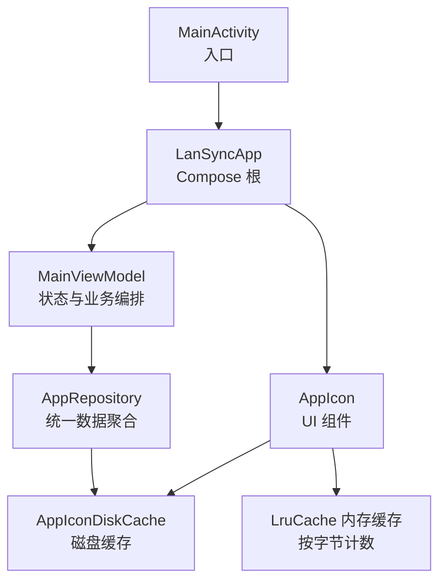
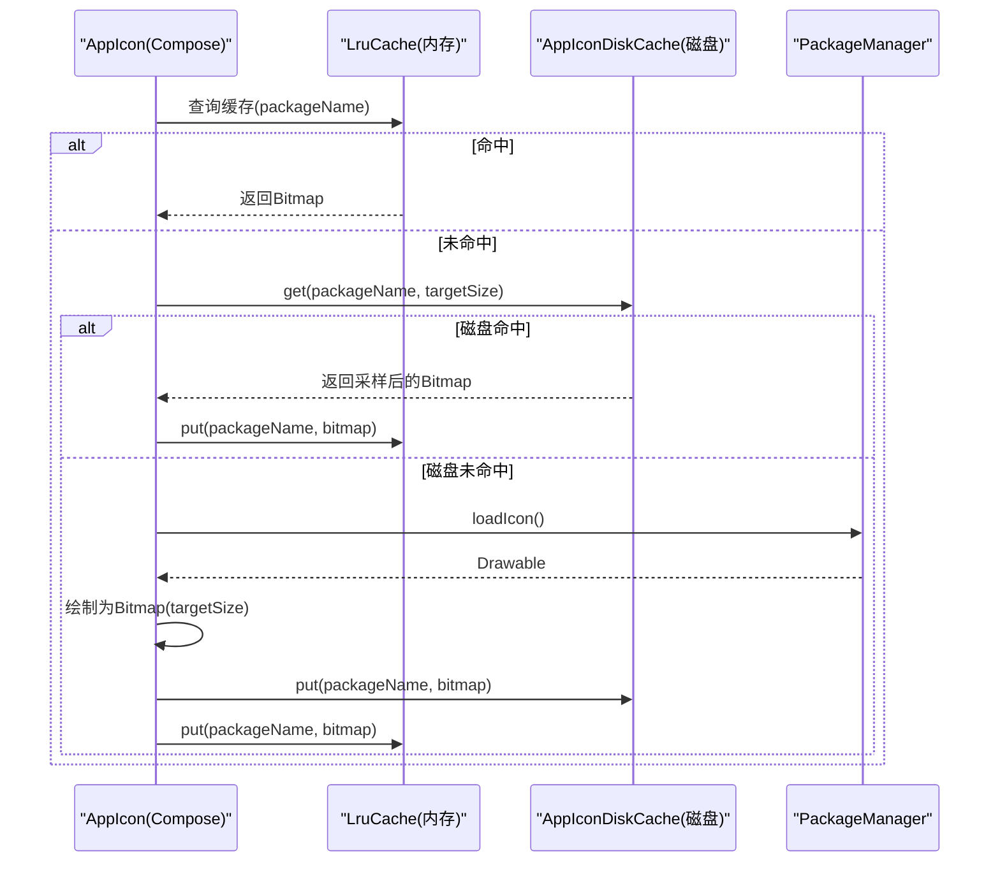
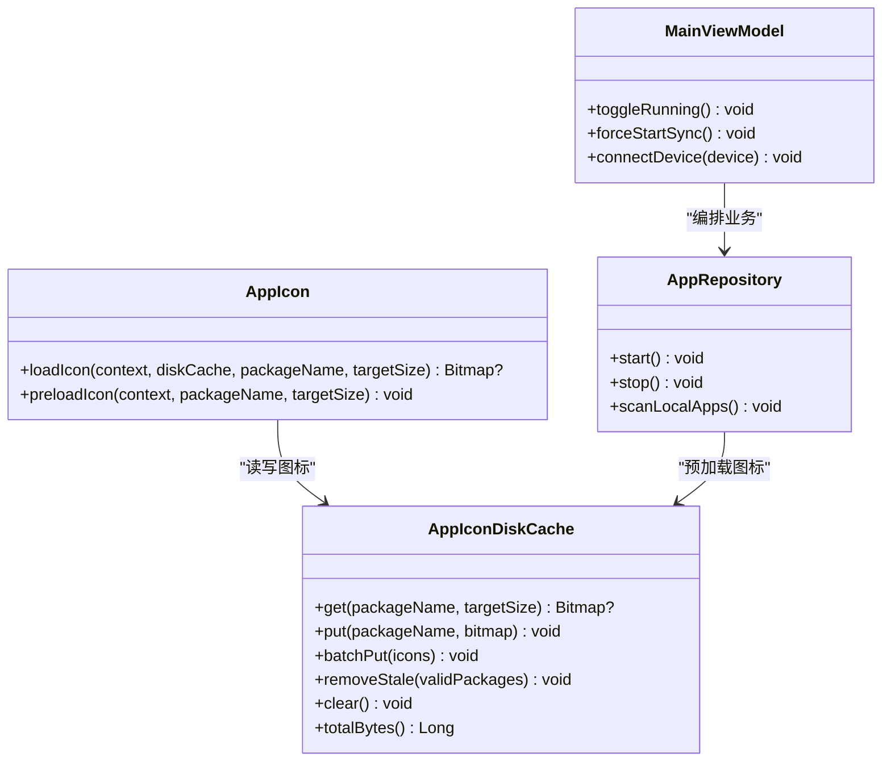

# 内存管理优化

<cite>
**本文引用的文件**
- [AppIconDiskCache.kt](file://app/src/main/java/com/lansync/app/data/cache/AppIconDiskCache.kt)
- [AppIcon.kt](file://app/src/main/java/com/lansync/app/ui/components/AppIcon.kt)
- [MainViewModel.kt](file://app/src/main/java/com/lansync/app/ui/viewmodel/MainViewModel.kt)
- [AppRepository.kt](file://app/src/main/java/com/lansync/app/data/repository/AppRepository.kt)
- [LanSyncApplication.kt](file://app/src/main/java/com/lansync/app/LanSyncApplication.kt)
- [MainActivity.kt](file://app/src/main/java/com/lansync/app/MainActivity.kt)
</cite>

## 目录
1. [简介](#简介)
2. [项目结构](#项目结构)
3. [核心组件](#核心组件)
4. [架构总览](#架构总览)
5. [详细组件分析](#详细组件分析)
6. [依赖关系分析](#依赖关系分析)
7. [性能考量](#性能考量)
8. [故障排查指南](#故障排查指南)
9. [结论](#结论)
10. [附录：监控与基准测试建议](#附录监控与基准测试建议)

## 简介
本指南聚焦 LanSync 应用的内存管理优化，围绕以下目标展开：
- Bitmap 缓存策略：深入解析 AppIconDiskCache 的实现原理、内存占用控制与垃圾回收优化。
- 对象生命周期管理：单例模式使用、资源释放与内存泄漏预防。
- 大对象处理策略：图片压缩、采样解码与内存池化技术。
- 内存监控与分析工具：Android Studio Memory Profiler、LeakCanary 等配置与使用方法。
- 实战案例与性能基准：帮助识别并解决内存瓶颈问题。

## 项目结构
本项目采用分层组织：UI（Compose）通过 ViewModel 调用 Repository，数据层负责网络、扫描、打包、安装与缓存；图标加载涉及 UI 层的内存缓存与 Data 层的磁盘缓存协同工作。

图表来源
- [MainActivity.kt:27-35](file://app/src/main/java/com/lansync/app/MainActivity.kt#L27-L35)
- [MainViewModel.kt:47-63](file://app/src/main/java/com/lansync/app/ui/viewmodel/MainViewModel.kt#L47-L63)
- [AppRepository.kt:40-51](file://app/src/main/java/com/lansync/app/data/repository/AppRepository.kt#L40-L51)
- [AppIconDiskCache.kt:9-17](file://app/src/main/java/com/lansync/app/data/cache/AppIconDiskCache.kt#L9-L17)
- [AppIcon.kt:32-40](file://app/src/main/java/com/lansync/app/ui/components/AppIcon.kt#L32-L40)

章节来源
- [MainActivity.kt:27-35](file://app/src/main/java/com/lansync/app/MainActivity.kt#L27-L35)
- [LanSyncApplication.kt:6-11](file://app/src/main/java/com/lansync/app/LanSyncApplication.kt#L6-L11)

## 核心组件
- AppIconDiskCache：提供应用图标磁盘缓存，支持按需采样解码、批量写入、过期清理与容量统计。
- AppIcon 组件：实现两级缓存（内存 LruCache + 磁盘），在 Compose 中安全地加载与展示图标。
- MainViewModel：协调 UI 状态与 Repository，触发扫描、连接与更新流程。
- AppRepository：封装设备发现、连接、同步、下载与安装等核心能力，并在合适时机触发图标预加载。

章节来源
- [AppIconDiskCache.kt:19-78](file://app/src/main/java/com/lansync/app/data/cache/AppIconDiskCache.kt#L19-L78)
- [AppIcon.kt:42-124](file://app/src/main/java/com/lansync/app/ui/components/AppIcon.kt#L42-L124)
- [MainViewModel.kt:47-82](file://app/src/main/java/com/lansync/app/ui/viewmodel/MainViewModel.kt#L47-L82)
- [AppRepository.kt:40-51](file://app/src/main/java/com/lansync/app/data/repository/AppRepository.kt#L40-L51)

## 架构总览
下图展示了图标从磁盘或系统包管理器加载到 UI 的完整路径，以及内存与磁盘缓存的协作方式。

图表来源
- [AppIcon.kt:52-69](file://app/src/main/java/com/lansync/app/ui/components/AppIcon.kt#L52-L69)
- [AppIcon.kt:95-124](file://app/src/main/java/com/lansync/app/ui/components/AppIcon.kt#L95-L124)
- [AppIconDiskCache.kt:19-49](file://app/src/main/java/com/lansync/app/data/cache/AppIconDiskCache.kt#L19-L49)

## 详细组件分析

### AppIconDiskCache：磁盘缓存与采样解码
- 职责
  - 将应用图标持久化为 PNG 文件，避免重复绘制与解码。
  - 读取时先获取尺寸信息，计算缩放因子并使用 inSampleSize 进行采样解码，降低内存峰值。
  - 提供批量写入、过期清理、清空与容量统计接口。
- 关键点
  - 首次 decode 仅测量尺寸（inJustDecodeBounds=true），再设置 inSampleSize 为最高一位有效位，确保解码后尺寸接近目标大小。
  - 写入时使用 PNG 压缩质量 90，平衡体积与清晰度。
  - 单例模式保证全局唯一实例，避免重复创建上下文与目录。
- 复杂度
  - get/put 时间复杂度 O(1)，空间复杂度取决于文件大小与缓存目录规模。
- 风险与改进
  - 异常路径删除损坏文件，避免脏数据。
  - 可考虑增加最大磁盘容量阈值与 LRU 淘汰策略，防止无限增长。

章节来源
- [AppIconDiskCache.kt:19-49](file://app/src/main/java/com/lansync/app/data/cache/AppIconDiskCache.kt#L19-L49)
- [AppIconDiskCache.kt:51-78](file://app/src/main/java/com/lansync/app/data/cache/AppIconDiskCache.kt#L51-L78)
- [AppIconDiskCache.kt:86-94](file://app/src/main/java/com/lansync/app/data/cache/AppIconDiskCache.kt#L86-L94)

### AppIcon：内存缓存与加载流程
- 职责
  - 在 Compose 中根据 packageName 加载并显示应用图标。
  - 维护 LruCache 内存缓存，按 Bitmap 实际分配字节数估算缓存大小，自动淘汰最久未使用的条目。
  - 结合磁盘缓存，减少 IO 与解码开销。
- 关键点
  - sizeOf 基于 allocationByteCount 计算，使 LruCache 能更精确地控制内存占用。
  - LaunchedEffect 在 IO 线程执行加载，避免阻塞主线程。
  - 目标尺寸动态计算，兼顾高 DPI 屏幕清晰度与内存占用。
- 复杂度
  - 查找与插入均为 O(1)。
- 风险与改进
  - 若列表项频繁重组，注意 remember 的 key 粒度，避免不必要的重建。
  - 可考虑对超大 Bitmap 进行二次压缩后再入盘存，进一步降低磁盘占用。

章节来源
- [AppIcon.kt:32-40](file://app/src/main/java/com/lansync/app/ui/components/AppIcon.kt#L32-L40)
- [AppIcon.kt:42-93](file://app/src/main/java/com/lansync/app/ui/components/AppIcon.kt#L42-L93)
- [AppIcon.kt:95-124](file://app/src/main/java/com/lansync/app/ui/components/AppIcon.kt#L95-L124)
- [AppIcon.kt:126-150](file://app/src/main/java/com/lansync/app/ui/components/AppIcon.kt#L126-L150)

### MainViewModel：状态编排与资源管理
- 职责
  - 收集 Repository 的状态流，驱动 UI 更新。
  - 启动/停止服务、连接设备、批量更新等操作，管理协程作用域与任务生命周期。
- 关键点
  - 使用 viewModelScope 管理协程，随 ViewModel 销毁而取消，避免泄漏。
  - 通过 StateFlow 暴露不可变状态，减少共享可变状态带来的竞争条件。
- 风险与改进
  - 长耗时操作应置于 IO 调度器，避免阻塞主线程。
  - 对并发任务（心跳、同步）使用集中化的 Job 集合管理，便于统一取消。

章节来源
- [MainViewModel.kt:47-82](file://app/src/main/java/com/lansync/app/ui/viewmodel/MainViewModel.kt#L47-L82)
- [MainViewModel.kt:84-124](file://app/src/main/java/com/lansync/app/ui/viewmodel/MainViewModel.kt#L84-L124)

### AppRepository：统一数据层与图标预加载
- 职责
  - 整合设备发现、连接、同步、下载与安装等能力。
  - 在适当时机触发图标预加载，提升首屏体验。
- 关键点
  - 使用 SupervisorJob + IO 调度器构建独立作用域，隔离错误传播。
  - 通过 Flow 组合多个状态源，减少重复订阅与状态不一致。
- 风险与改进
  - 避免在 Repository 中直接持有 UI 相关引用，保持分层清晰。
  - 对网络与 IO 操作增加超时与重试策略，增强鲁棒性。

章节来源
- [AppRepository.kt:40-51](file://app/src/main/java/com/lansync/app/data/repository/AppRepository.kt#L40-L51)
- [AppRepository.kt:271-282](file://app/src/main/java/com/lansync/app/data/repository/AppRepository.kt#L271-L282)

## 依赖关系分析
- 组件耦合
  - AppIcon 依赖 AppIconDiskCache 与 Android LruCache，形成“内存+磁盘”双层缓存。
  - MainViewModel 依赖 AppRepository，后者间接依赖磁盘缓存用于图标预加载。
- 外部依赖
  - Android 框架：Bitmap、BitmapFactory、PackageManager、LruCache。
  - Kotlin 协程：withContext、StateFlow、SupervisorJob。
- 潜在循环依赖
  - 当前未发现循环导入；Repository 直接 import UI 层的 preloadIcon，存在分层倒置风险，建议将预加载逻辑下沉至 data/icon 层。

图表来源
- [AppIcon.kt:95-124](file://app/src/main/java/com/lansync/app/ui/components/AppIcon.kt#L95-L124)
- [AppIconDiskCache.kt:19-78](file://app/src/main/java/com/lansync/app/data/cache/AppIconDiskCache.kt#L19-L78)
- [MainViewModel.kt:47-82](file://app/src/main/java/com/lansync/app/ui/viewmodel/MainViewModel.kt#L47-L82)
- [AppRepository.kt:40-51](file://app/src/main/java/com/lansync/app/data/repository/AppRepository.kt#L40-L51)

章节来源
- [AppIcon.kt:95-124](file://app/src/main/java/com/lansync/app/ui/components/AppIcon.kt#L95-L124)
- [AppIconDiskCache.kt:19-78](file://app/src/main/java/com/lansync/app/data/cache/AppIconDiskCache.kt#L19-L78)
- [MainViewModel.kt:47-82](file://app/src/main/java/com/lansync/app/ui/viewmodel/MainViewModel.kt#L47-L82)
- [AppRepository.kt:40-51](file://app/src/main/java/com/lansync/app/data/repository/AppRepository.kt#L40-L51)

## 性能考量
- 采样解码
  - 通过 inJustDecodeBounds 与 inSampleSize 控制解码尺寸，显著降低内存峰值与解码时间。
- 压缩存储
  - PNG 压缩质量 90 在体积与画质间取得平衡；对于透明背景图标，PNG 是合理选择。
- 内存缓存
  - LruCache 按 allocationByteCount 估算大小，避免简单计数导致的内存失控。
- 异步加载
  - 使用 Dispatchers.IO 执行 IO 与解码，避免阻塞主线程，提升滚动流畅度。
- 预加载
  - 在数据就绪时预加载常用图标，减少首屏卡顿。

[本节为通用性能讨论，不直接分析具体文件]

## 故障排查指南
- 常见问题
  - 图标加载失败：检查磁盘文件是否存在且非空，确认采样参数是否合理。
  - 内存抖动：观察 LruCache 淘汰频率与 Bitmap 分配量，必要时调整目标尺寸或缓存上限。
  - 磁盘膨胀：定期调用 removeStale/clear，限制缓存目录大小。
- 调试步骤
  - 使用 Android Studio Memory Profiler 观察 GC 行为与 Bitmap 分配。
  - 集成 LeakCanary 检测潜在泄漏点（如静态引用 Context）。
  - 在关键路径添加日志，记录 get/put 次数与耗时。

章节来源
- [AppIconDiskCache.kt:19-49](file://app/src/main/java/com/lansync/app/data/cache/AppIconDiskCache.kt#L19-L49)
- [AppIcon.kt:52-69](file://app/src/main/java/com/lansync/app/ui/components/AppIcon.kt#L52-L69)

## 结论
LanSync 的内存管理以“内存+磁盘”双层缓存为核心，配合采样解码与压缩存储，有效降低了大图标的内存占用与 IO 开销。通过 LruCache 的字节级计数与合理的目标尺寸控制，系统在多设备、多应用场景下仍能保持良好性能。后续可进一步优化方向包括：
- 引入磁盘缓存 LRU 与容量上限，避免无限增长。
- 将图标预加载逻辑下沉至 data/icon 层，改善分层依赖。
- 增加内存监控埋点与自动化基准测试，持续验证优化效果。

[本节为总结性内容，不直接分析具体文件]

## 附录：监控与基准测试建议
- Android Studio Memory Profiler
  - 关注 Heap 快照中的 Bitmap 数量与大小分布。
  - 观察 GC 触发频率与停顿时间，评估采样与压缩策略的有效性。
- LeakCanary
  - 配置 Application 初始化时启用，捕获 Activity/Fragment/Service 等可能泄漏的对象。
  - 重点检查静态单例是否持有 Context 引用。
- 基准测试
  - 设计场景：首次启动、滚动应用列表、批量刷新远程应用。
  - 指标：首帧渲染时间、平均 FPS、GC 次数与停顿、内存峰值。
  - 对比：开启/关闭缓存、不同目标尺寸、不同压缩质量的差异。

[本节为通用指导，不直接分析具体文件]