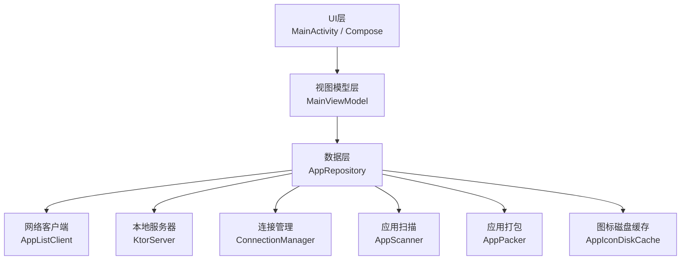
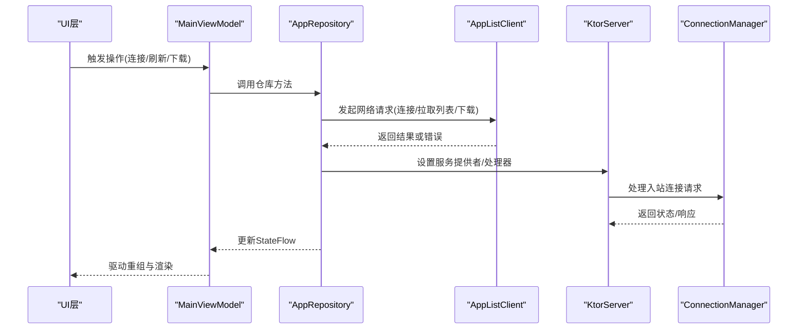
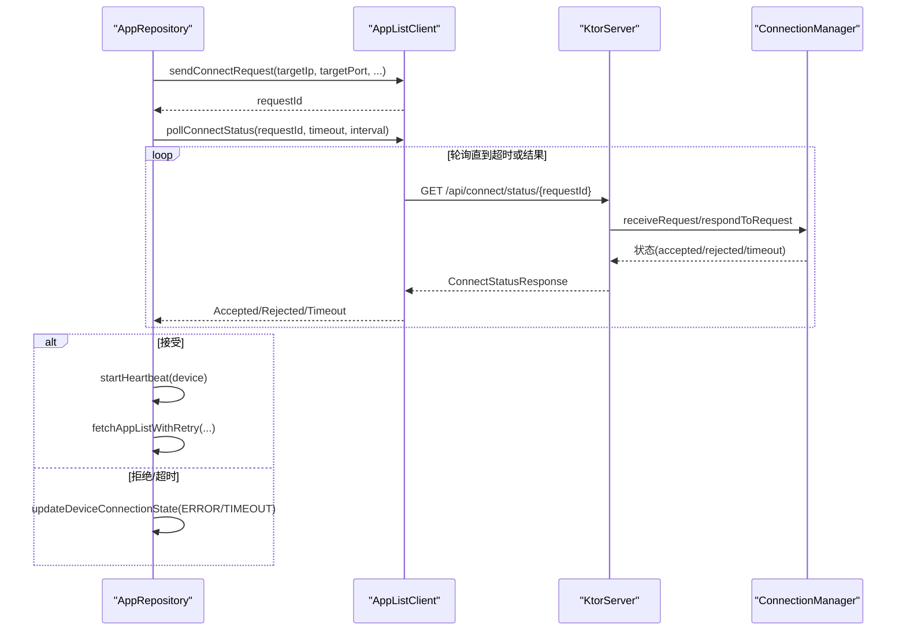
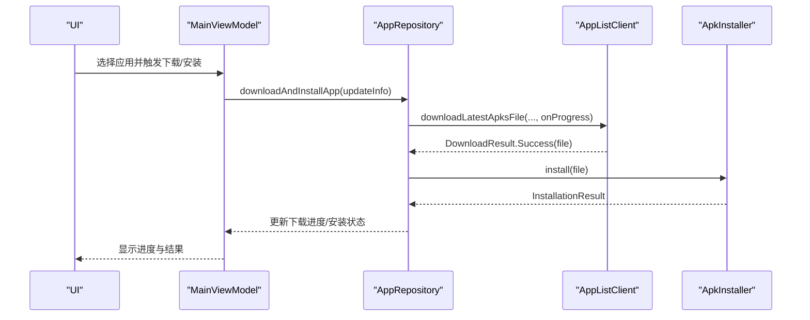
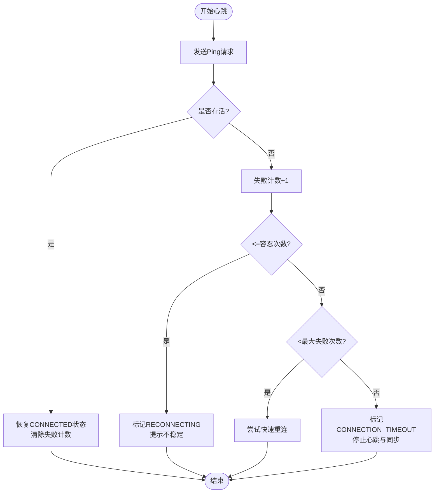
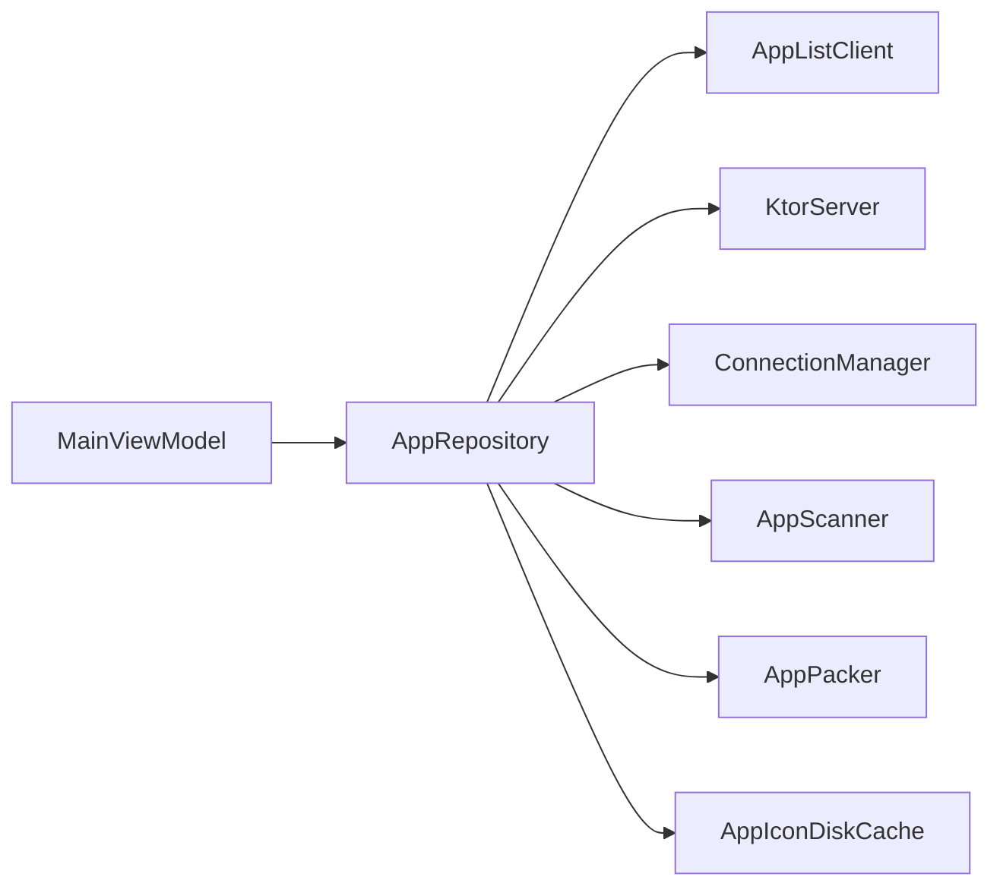

# 性能优化

<cite>
**本文引用的文件**
- [LanSyncApplication.kt](file://app/src/main/java/com/lansync/app/LanSyncApplication.kt)
- [MainActivity.kt](file://app/src/main/java/com/lansync/app/MainActivity.kt)
- [AppConfig.kt](file://app/src/main/java/com/lansync/app/data/AppConfig.kt)
- [ConnectionManager.kt](file://app/src/main/java/com/lansync/app/data/connection/ConnectionManager.kt)
- [KtorServer.kt](file://app/src/main/java/com/lansync/app/data/server/KtorServer.kt)
- [MainViewModel.kt](file://app/src/main/java/com/lansync/app/ui/viewmodel/MainViewModel.kt)
- [AppRepository.kt](file://app/src/main/java/com/lansync/app/data/repository/AppRepository.kt)
- [AppListClient.kt](file://app/src/main/java/com/lansync/app/data/client/AppListClient.kt)
- [AppIconDiskCache.kt](file://app/src/main/java/com/lansync/app/data/cache/AppIconDiskCache.kt)
- [AppScanner.kt](file://app/src/main/java/com/lansync/app/data/scanner/AppScanner.kt)
- [AppPacker.kt](file://app/src/main/java/com/lansync/app/data/packer/AppPacker.kt)
- [AppListScreen.kt](file://app/src/main/java/com/lansync/app/ui/components/AppListScreen.kt)
</cite>

## 目录
1. [简介](#简介)
2. [项目结构](#项目结构)
3. [核心组件](#核心组件)
4. [架构总览](#架构总览)
5. [详细组件分析](#详细组件分析)
6. [依赖关系分析](#依赖关系分析)
7. [性能考量与基准建议](#性能考量与基准建议)
8. [故障排查指南](#故障排查指南)
9. [结论](#结论)
10. [附录](#附录)

## 简介
本指南面向LanSync应用的性能优化，围绕内存管理、网络请求、文件I/O、UI渲染以及性能监控与分析工具使用展开。文档基于仓库中的实际代码实现进行分析，提供可操作的优化策略与可视化流程图，帮助开发者识别并解决性能瓶颈。

## 项目结构
LanSync采用分层架构：
- UI层：Compose界面与状态展示（MainActivity、各Screen）
- 视图模型层：业务编排与状态聚合（MainViewModel）
- 数据层：设备发现、连接管理、服务端、客户端、扫描打包、缓存等（AppRepository及其子模块）
- 基础设施：日志、配置、网络、文件系统

图表来源
- [MainActivity.kt:26-106](file://app/src/main/java/com/lansync/app/MainActivity.kt#L26-L106)
- [MainViewModel.kt:47-124](file://app/src/main/java/com/lansync/app/ui/viewmodel/MainViewModel.kt#L47-L124)
- [AppRepository.kt:40-87](file://app/src/main/java/com/lansync/app/data/repository/AppRepository.kt#L40-L87)
- [AppListClient.kt:30-56](file://app/src/main/java/com/lansync/app/data/client/AppListClient.kt#L30-L56)
- [KtorServer.kt:30-65](file://app/src/main/java/com/lansync/app/data/server/KtorServer.kt#L30-L65)
- [ConnectionManager.kt:19-27](file://app/src/main/java/com/lansync/app/data/connection/ConnectionManager.kt#L19-L27)
- [AppScanner.kt:15-21](file://app/src/main/java/com/lansync/app/data/scanner/AppScanner.kt#L15-L21)
- [AppPacker.kt:14-20](file://app/src/main/java/com/lansync/app/data/packer/AppPacker.kt#L14-L20)
- [AppIconDiskCache.kt:9-17](file://app/src/main/java/com/lansync/app/data/cache/AppIconDiskCache.kt#L9-L17)

章节来源
- [MainActivity.kt:26-106](file://app/src/main/java/com/lansync/app/MainActivity.kt#L26-L106)
- [MainViewModel.kt:47-124](file://app/src/main/java/com/lansync/app/ui/viewmodel/MainViewModel.kt#L47-L124)
- [AppRepository.kt:40-87](file://app/src/main/java/com/lansync/app/data/repository/AppRepository.kt#L40-L87)

## 核心组件
- 应用启动与初始化：在Application中初始化日志系统，确保运行时可观测性。
- 主界面与状态：通过Compose构建多标签页界面，使用StateFlow驱动UI更新。
- 数据仓库：集中管理设备发现、连接、心跳、同步、下载、安装等流程，协调各子系统。
- 网络客户端：OkHttp连接池复用、超时控制、下载进度与MD5校验。
- 本地服务器：Ktor提供Ping、应用列表、连接握手、下载等接口，流式发送大文件。
- 连接管理器：处理入站连接请求、超时、响应与状态流转。
- 扫描与打包：异步扫描已安装应用，支持单包与分包打包为APK/APKS。
- 图标缓存：磁盘缓存应用图标，按目标尺寸缩放减少内存占用。

章节来源
- [LanSyncApplication.kt:6-10](file://app/src/main/java/com/lansync/app/LanSyncApplication.kt#L6-L10)
- [MainActivity.kt:26-106](file://app/src/main/java/com/lansync/app/MainActivity.kt#L26-L106)
- [AppRepository.kt:40-87](file://app/src/main/java/com/lansync/app/data/repository/AppRepository.kt#L40-L87)
- [AppListClient.kt:30-56](file://app/src/main/java/com/lansync/app/data/client/AppListClient.kt#L30-L56)
- [KtorServer.kt:65-90](file://app/src/main/java/com/lansync/app/data/server/KtorServer.kt#L65-L90)
- [ConnectionManager.kt:19-27](file://app/src/main/java/com/lansync/app/data/connection/ConnectionManager.kt#L19-L27)
- [AppScanner.kt:21-47](file://app/src/main/java/com/lansync/app/data/scanner/AppScanner.kt#L21-L47)
- [AppPacker.kt:20-56](file://app/src/main/java/com/lansync/app/data/packer/AppPacker.kt#L20-L56)
- [AppIconDiskCache.kt:19-49](file://app/src/main/java/com/lansync/app/data/cache/AppIconDiskCache.kt#L19-L49)

## 架构总览
下图展示了从UI到数据层的调用链与关键交互点，包括连接建立、应用列表获取、下载与安装流程。

图表来源
- [MainViewModel.kt:84-124](file://app/src/main/java/com/lansync/app/ui/viewmodel/MainViewModel.kt#L84-L124)
- [AppRepository.kt:386-484](file://app/src/main/java/com/lansync/app/data/repository/AppRepository.kt#L386-L484)
- [AppListClient.kt:62-133](file://app/src/main/java/com/lansync/app/data/client/AppListClient.kt#L62-L133)
- [KtorServer.kt:88-175](file://app/src/main/java/com/lansync/app/data/server/KtorServer.kt#L88-L175)
- [ConnectionManager.kt:29-87](file://app/src/main/java/com/lansync/app/data/connection/ConnectionManager.kt#L29-L87)

## 详细组件分析

### 内存管理与对象池化
- 连接池与对象复用
  - 网络层使用OkHttp连接池，复用TCP连接，减少握手开销与内存分配频率。
  - 下载专用客户端独立配置，避免长耗时下载影响常规请求的超时与资源占用。
- 图片解码与内存控制
  - 图标磁盘缓存读取时先进行边界测量，计算采样比例后按需解码，降低Bitmap内存峰值。
- 协程作用域与任务生命周期
  - Repository与ConnectionManager使用SupervisorJob隔离子任务，避免异常扩散导致全局崩溃；及时取消不再需要的Job防止泄漏。
- 临时对象与缓冲
  - 文件读写使用固定大小缓冲区，避免一次性加载大文件到内存。
- 建议与优化点
  - 对高频创建的小对象（如请求体、解析中间对象）考虑复用或池化（例如OkHttp Request.Builder复用需结合具体场景）。
  - 对大量图标批量写入时使用批处理API减少IO次数与锁竞争。
  - 定期清理无用缓存（图标、下载文件），避免长期运行内存膨胀。

章节来源
- [AppListClient.kt:32-50](file://app/src/main/java/com/lansync/app/data/client/AppListClient.kt#L32-L50)
- [AppIconDiskCache.kt:19-49](file://app/src/main/java/com/lansync/app/data/cache/AppIconDiskCache.kt#L19-L49)
- [AppRepository.kt:51-87](file://app/src/main/java/com/lansync/app/data/repository/AppRepository.kt#L51-L87)
- [ConnectionManager.kt:21-27](file://app/src/main/java/com/lansync/app/data/connection/ConnectionManager.kt#L21-L27)
- [AppPacker.kt:58-69](file://app/src/main/java/com/lansync/app/data/packer/AppPacker.kt#L58-L69)
- [KtorServer.kt:293-312](file://app/src/main/java/com/lansync/app/data/server/KtorServer.kt#L293-L312)

### 垃圾回收优化
- 减少短期大对象分配
  - 文件流式读写，避免将大文件整体读入内存。
- 及时释放引用
  - 下载完成后删除临时文件；图标缓存根据有效包名集合清理过期项。
- 避免闭包持有上下文
  - 协程中使用轻量级数据结构传递必要信息，避免捕获大对象。
- 建议与优化点
  - 对频繁GC的场景（如大量图标解码）增加采样率与延迟加载。
  - 使用弱引用或显式置空来解除不必要的强引用。
  - 监控GC日志与堆转储，定位热点分配路径。

章节来源
- [AppListClient.kt:393-481](file://app/src/main/java/com/lansync/app/data/client/AppListClient.kt#L393-L481)
- [AppIconDiskCache.kt:61-72](file://app/src/main/java/com/lansync/app/data/cache/AppIconDiskCache.kt#L61-L72)
- [KtorServer.kt:293-312](file://app/src/main/java/com/lansync/app/data/server/KtorServer.kt#L293-L312)

### 网络请求优化
- 连接复用
  - OkHttp连接池配置最大空闲连接数与存活时间，减少重复建连成本。
- 请求合并与节流
  - 连接状态轮询采用固定间隔与超时控制，避免风暴式请求。
  - 应用列表刷新与更新重算加入节流阈值，降低频繁计算与网络压力。
- 缓存策略
  - 本地应用列表缓存至JSON文件，首次启动后可快速恢复；图标磁盘缓存避免重复解码与网络请求。
- 下载优化
  - 分块流式写入，进度回调与MD5校验保证完整性；独立下载客户端提高稳定性。
- 建议与优化点
  - 对热点接口启用HTTP缓存头（若服务端支持），减少带宽与CPU消耗。
  - 对失败重试采用指数退避与抖动，避免雪崩。
  - 针对弱网环境调整超时与重试策略。

章节来源
- [AppListClient.kt:32-50](file://app/src/main/java/com/lansync/app/data/client/AppListClient.kt#L32-L50)
- [AppListClient.kt:104-172](file://app/src/main/java/com/lansync/app/data/client/AppListClient.kt#L104-L172)
- [AppRepository.kt:761-777](file://app/src/main/java/com/lansync/app/data/repository/AppRepository.kt#L761-L777)
- [AppRepository.kt:720-759](file://app/src/main/java/com/lansync/app/data/repository/AppRepository.kt#L720-L759)
- [AppListClient.kt:358-481](file://app/src/main/java/com/lansync/app/data/client/AppListClient.kt#L358-L481)

### 文件I/O优化
- 异步文件操作
  - 扫描与打包均在IO调度器执行，避免阻塞主线程。
- 批量处理
  - 图标批量写入；下载文件批量删除；应用列表批量更新。
- 磁盘缓存机制
  - 图标磁盘缓存按包名存储PNG，支持尺寸缩放与过期清理；下载目录集中管理，便于统计与清理。
- 建议与优化点
  - 对超大文件传输考虑断点续传与并发分片。
  - 对频繁小文件写入考虑合并批次或使用数据库索引。
  - 监控磁盘空间与IO延迟，必要时降级功能。

章节来源
- [AppScanner.kt:21-47](file://app/src/main/java/com/lansync/app/data/scanner/AppScanner.kt#L21-L47)
- [AppPacker.kt:20-56](file://app/src/main/java/com/lansync/app/data/packer/AppPacker.kt#L20-L56)
- [AppIconDiskCache.kt:51-72](file://app/src/main/java/com/lansync/app/data/cache/AppIconDiskCache.kt#L51-L72)
- [AppListClient.kt:512-555](file://app/src/main/java/com/lansync/app/data/client/AppListClient.kt#L512-L555)

### UI渲染优化
- Compose重组优化
  - 使用derivedStateOf对过滤结果与计数进行派生，减少不必要重组。
  - LazyColumn配合key与contentType提升列表渲染效率。
- 懒加载与虚拟化
  - 列表仅渲染可见项，降低内存与绘制压力。
- 状态分离
  - ViewModel集中管理状态，UI只负责展示与事件转发，避免复杂逻辑在Composable中。
- 建议与优化点
  - 对大型列表使用分页加载与虚拟滚动。
  - 对图片使用占位图与渐进式加载。
  - 避免在重组中执行昂贵计算，尽量前置到ViewModel或Repository。

章节来源
- [AppListScreen.kt:32-53](file://app/src/main/java/com/lansync/app/ui/components/AppListScreen.kt#L32-L53)
- [AppListScreen.kt:106-118](file://app/src/main/java/com/lansync/app/ui/components/AppListScreen.kt#L106-L118)
- [MainViewModel.kt:84-124](file://app/src/main/java/com/lansync/app/ui/viewmodel/MainViewModel.kt#L84-L124)

### 连接与心跳流程（序列图）

图表来源
- [AppRepository.kt:386-484](file://app/src/main/java/com/lansync/app/data/repository/AppRepository.kt#L386-L484)
- [AppListClient.kt:62-133](file://app/src/main/java/com/lansync/app/data/client/AppListClient.kt#L62-L133)
- [KtorServer.kt:88-175](file://app/src/main/java/com/lansync/app/data/server/KtorServer.kt#L88-L175)
- [ConnectionManager.kt:29-87](file://app/src/main/java/com/lansync/app/data/connection/ConnectionManager.kt#L29-L87)

### 下载与安装流程（序列图）

图表来源
- [MainViewModel.kt:276-289](file://app/src/main/java/com/lansync/app/ui/viewmodel/MainViewModel.kt#L276-L289)
- [AppListClient.kt:376-481](file://app/src/main/java/com/lansync/app/data/client/AppListClient.kt#L376-L481)

### 复杂逻辑流程图（心跳与重连）

图表来源
- [AppRepository.kt:179-249](file://app/src/main/java/com/lansync/app/data/repository/AppRepository.kt#L179-L249)

## 依赖关系分析
- 组件耦合
  - MainViewModel依赖AppRepository暴露的状态流，低耦合高内聚。
  - AppRepository组合多个子系统（客户端、服务器、扫描、打包、缓存），职责清晰。
  - KtorServer与ConnectionManager解耦，通过回调与状态流通信。
- 外部依赖
  - OkHttp用于网络请求与下载，Ktor用于本地HTTP服务，Compose用于UI。
- 潜在循环依赖
  - 当前未发现直接循环依赖；注意在扩展时保持单向依赖。
- 接口契约
  - StateFlow作为稳定接口，保证UI与数据层一致性。
  - 网络请求返回明确的结果类型（成功/失败/超时），便于上层处理。

图表来源
- [MainViewModel.kt:47-124](file://app/src/main/java/com/lansync/app/ui/viewmodel/MainViewModel.kt#L47-L124)
- [AppRepository.kt:40-87](file://app/src/main/java/com/lansync/app/data/repository/AppRepository.kt#L40-L87)

章节来源
- [MainViewModel.kt:47-124](file://app/src/main/java/com/lansync/app/ui/viewmodel/MainViewModel.kt#L47-L124)
- [AppRepository.kt:40-87](file://app/src/main/java/com/lansync/app/data/repository/AppRepository.kt#L40-L87)

## 性能考量与基准建议
- 内存基准
  - 观察图标解码前后的内存峰值，验证采样比例是否合理。
  - 监控下载过程中的堆增长，确认流式写入未造成内存泄漏。
- CPU基准
  - 扫描与打包过程的CPU占用，评估是否可并行化或分批处理。
  - 心跳轮询与网络请求的CPU开销，调整间隔与超时。
- 网络基准
  - 连接建立时间与成功率，评估连接池配置是否合适。
  - 下载速度与稳定性，验证MD5校验与重试策略。
- 建议的测试方法
  - 使用Android Studio Profiler进行内存、CPU、网络与电量分析。
  - 使用Perfetto或Systrace抓取系统级时序，定位卡顿与阻塞。
  - 模拟弱网与高负载场景，验证鲁棒性与降级策略。

[本节为通用指导，不直接分析具体文件]

## 故障排查指南
- 常见问题
  - 连接超时：检查网络连通性与超时配置，查看轮询次数与间隔。
  - 下载失败：核对MD5校验与文件大小，确认服务端返回头是否正确。
  - 图标加载缓慢：检查缓存命中与解码参数，必要时增大采样率。
- 日志与诊断
  - 使用FileLogger记录关键路径，定位异常与性能热点。
  - 收集堆转储与CPU快照，分析内存泄漏与热点函数。
- 修复建议
  - 对异常分支增加重试与降级，避免级联失败。
  - 对长时间任务添加取消与超时保护。
  - 对UI重组进行拆分与优化，减少不必要的重建。

章节来源
- [AppListClient.kt:104-172](file://app/src/main/java/com/lansync/app/data/client/AppListClient.kt#L104-L172)
- [AppListClient.kt:393-481](file://app/src/main/java/com/lansync/app/data/client/AppListClient.kt#L393-L481)
- [AppIconDiskCache.kt:19-49](file://app/src/main/java/com/lansync/app/data/cache/AppIconDiskCache.kt#L19-L49)

## 结论
LanSync在网络、文件与UI层面已具备较好的性能基础：连接池复用、流式I/O、Compose懒加载与状态派生。进一步优化应聚焦于对象池化、缓存策略精细化、重试与节流策略调优，以及全面的性能监控与基准测试。通过持续分析与迭代，可在复杂网络与大数据量场景下保持稳定与流畅的用户体验。

[本节为总结，不直接分析具体文件]

## 附录
- 配置参考
  - 心跳间隔、同步间隔、超时与重试参数可通过AppConfig集中管理，便于在不同环境下调优。
- 实用技巧
  - 使用LazyColumn的key与contentType提升列表性能。
  - 对大文件传输使用流式API与进度回调，提升用户体验。
  - 对频繁计算使用derivedStateOf与memoization减少重组。

章节来源
- [AppConfig.kt:3-17](file://app/src/main/java/com/lansync/app/data/AppConfig.kt#L3-L17)
- [AppListScreen.kt:32-53](file://app/src/main/java/com/lansync/app/ui/components/AppListScreen.kt#L32-L53)
- [AppListClient.kt:393-481](file://app/src/main/java/com/lansync/app/data/client/AppListClient.kt#L393-L481)