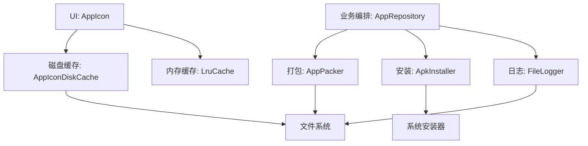
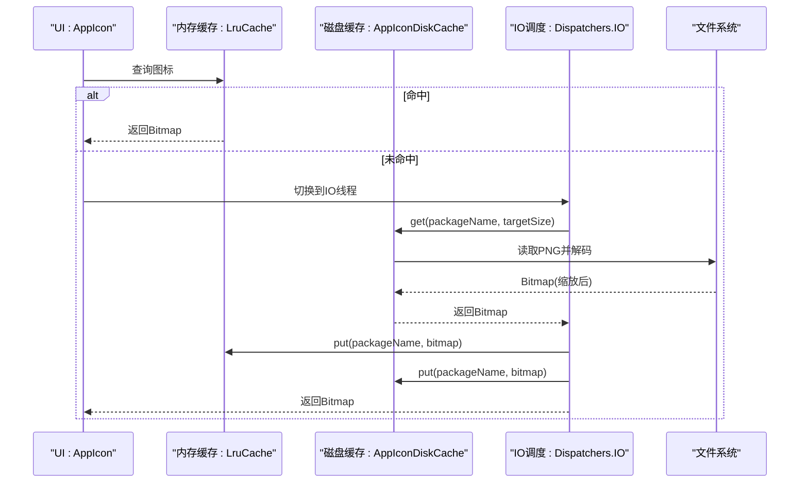
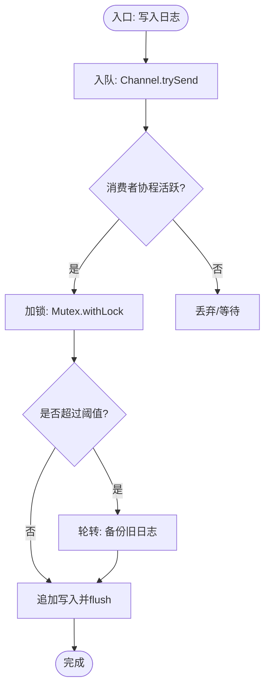
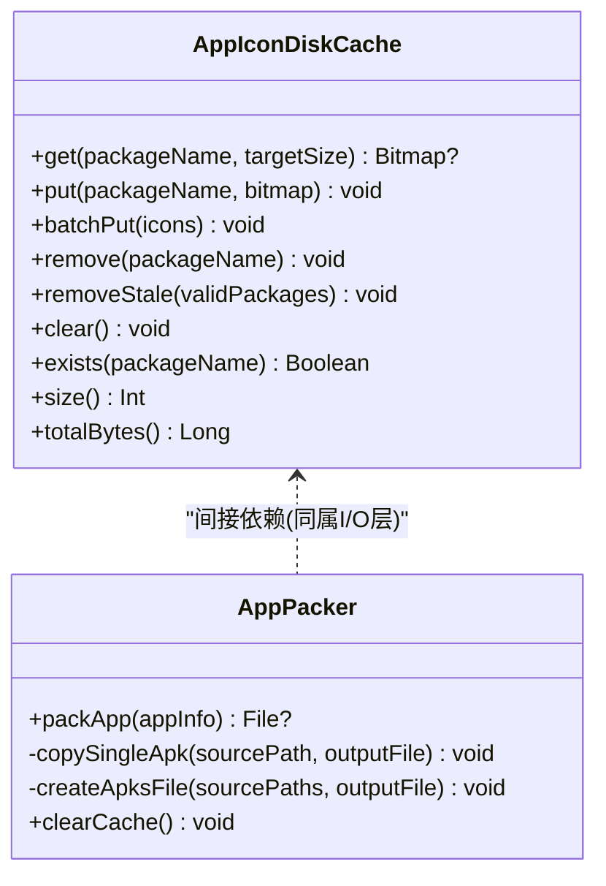
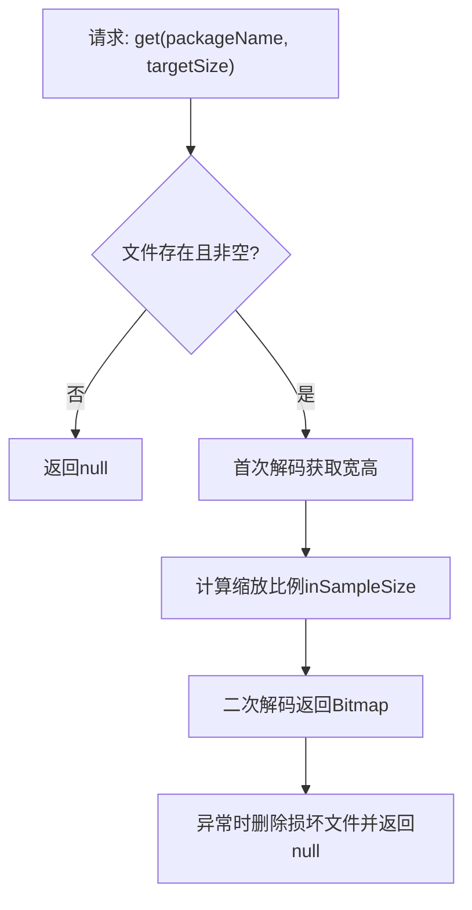
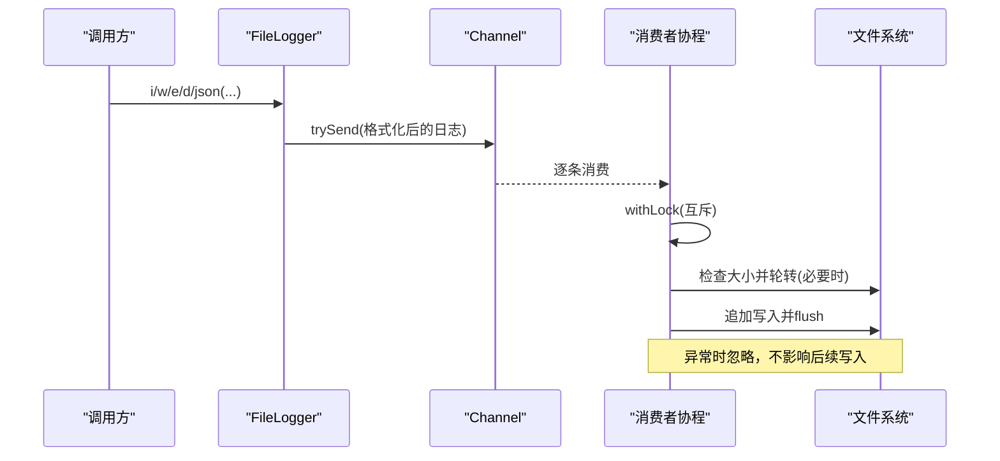
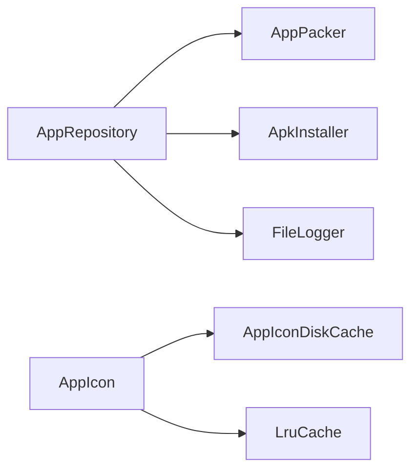

# 文件I/O优化

<cite>
**本文引用的文件**
- [AppIconDiskCache.kt](file://app/src/main/java/com/lansync/app/data/cache/AppIconDiskCache.kt)
- [FileLogger.kt](file://app/src/main/java/com/lansync/app/data/FileLogger.kt)
- [AppPacker.kt](file://app/src/main/java/com/lansync/app/data/packer/AppPacker.kt)
- [ApkInstaller.kt](file://app/src/main/java/com/lansync/app/data/installer/ApkInstaller.kt)
- [AppRepository.kt](file://app/src/main/java/com/lansync/app/data/repository/AppRepository.kt)
- [AppConfig.kt](file://app/src/main/java/com/lansync/app/data/AppConfig.kt)
- [AppIcon.kt](file://app/src/main/java/com/lansync/app/ui/components/AppIcon.kt)
</cite>

## 目录
1. [简介](#简介)
2. [项目结构](#项目结构)
3. [核心组件](#核心组件)
4. [架构总览](#架构总览)
5. [详细组件分析](#详细组件分析)
6. [依赖关系分析](#依赖关系分析)
7. [性能考量](#性能考量)
8. [故障排查指南](#故障排查指南)
9. [结论](#结论)
10. [附录](#附录)

## 简介
本指南聚焦LanSync应用的文件I/O优化，围绕以下目标展开：
- 异步文件操作：协程在读写中的应用、阻塞操作的非阻塞化。
- 批量文件处理策略：批量写入优化、事务性操作与错误恢复机制。
- 磁盘缓存机制：AppIconDiskCache的缓存策略、LRU算法实现与存储空间管理。
- 日志文件优化：FileLogger的轮转策略、压缩技术与清理机制。
- 文件I/O性能监控：磁盘IO分析、访问热点识别与基准测试方法。
- 实战案例与对比数据：结合代码路径给出可复现的优化实践与评估方式。

## 项目结构
与文件I/O相关的核心模块分布如下：
- 缓存层：AppIconDiskCache负责图标位图的磁盘缓存与读取。
- 日志层：FileLogger提供异步、线程安全、带轮转的日志写入。
- 打包与安装：AppPacker将APK/拆分包打包为本地文件；ApkInstaller通过系统安装器触发安装。
- 业务编排：AppRepository协调网络、扫描、打包、安装等流程，并驱动状态流更新。
- UI层：AppIcon组件使用内存LRU缓存与磁盘缓存协同加载图标。

图表来源
- [AppIcon.kt:42-150](file://app/src/main/java/com/lansync/app/ui/components/AppIcon.kt#L42-L150)
- [AppIconDiskCache.kt:19-95](file://app/src/main/java/com/lansync/app/data/cache/AppIconDiskCache.kt#L19-L95)
- [AppPacker.kt:20-112](file://app/src/main/java/com/lansync/app/data/packer/AppPacker.kt#L20-L112)
- [ApkInstaller.kt:12-54](file://app/src/main/java/com/lansync/app/data/installer/ApkInstaller.kt#L12-L54)
- [FileLogger.kt:19-167](file://app/src/main/java/com/lansync/app/data/FileLogger.kt#L19-L167)
- [AppRepository.kt:40-80](file://app/src/main/java/com/lansync/app/data/repository/AppRepository.kt#L40-L80)

章节来源
- [AppIcon.kt:42-150](file://app/src/main/java/com/lansync/app/ui/components/AppIcon.kt#L42-L150)
- [AppIconDiskCache.kt:19-95](file://app/src/main/java/com/lansync/app/data/cache/AppIconDiskCache.kt#L19-L95)
- [AppPacker.kt:20-112](file://app/src/main/java/com/lansync/app/data/packer/AppPacker.kt#L20-L112)
- [ApkInstaller.kt:12-54](file://app/src/main/java/com/lansync/app/data/installer/ApkInstaller.kt#L12-L54)
- [FileLogger.kt:19-167](file://app/src/main/java/com/lansync/app/data/FileLogger.kt#L19-L167)
- [AppRepository.kt:40-80](file://app/src/main/java/com/lansync/app/data/repository/AppRepository.kt#L40-L80)

## 核心组件
- AppIconDiskCache：基于PNG压缩的磁盘缓存，支持按包名存取图标、批量写入、过期清理与容量统计。
- FileLogger：基于Channel+Mutex的异步日志写入，具备日志轮转、备份与清理能力。
- AppPacker：将单APK或Split APK打包为本地文件（.apk/.apks），采用缓冲流与ZipEntry写入。
- ApkInstaller：通过FileProvider生成URI并调用系统安装器完成安装。
- AppRepository：协调设备发现、连接、心跳、同步与更新计算，驱动各子模块协作。
- AppConfig：集中配置心跳、重试、超时等参数，影响I/O频率与并发行为。

章节来源
- [AppIconDiskCache.kt:19-95](file://app/src/main/java/com/lansync/app/data/cache/AppIconDiskCache.kt#L19-L95)
- [FileLogger.kt:19-167](file://app/src/main/java/com/lansync/app/data/FileLogger.kt#L19-L167)
- [AppPacker.kt:20-112](file://app/src/main/java/com/lansync/app/data/packer/AppPacker.kt#L20-L112)
- [ApkInstaller.kt:12-54](file://app/src/main/java/com/lansync/app/data/installer/ApkInstaller.kt#L12-L54)
- [AppRepository.kt:40-80](file://app/src/main/java/com/lansync/app/data/repository/AppRepository.kt#L40-L80)
- [AppConfig.kt:3-17](file://app/src/main/java/com/lansync/app/data/AppConfig.kt#L3-L17)

## 架构总览
整体I/O链路包括：
- UI侧请求图标时，先查内存LRU缓存，未命中则从磁盘缓存读取，再回写内存与磁盘。
- 业务侧进行应用打包时，使用缓冲流与ZipOutputStream写入APK/APKS文件。
- 日志写入走异步通道，避免阻塞主流程，同时保证顺序写入与轮转。
- 安装流程通过系统安装器完成，不直接操作APK内容。

图表来源
- [AppIcon.kt:42-150](file://app/src/main/java/com/lansync/app/ui/components/AppIcon.kt#L42-L150)
- [AppIconDiskCache.kt:19-95](file://app/src/main/java/com/lansync/app/data/cache/AppIconDiskCache.kt#L19-L95)

章节来源
- [AppIcon.kt:42-150](file://app/src/main/java/com/lansync/app/ui/components/AppIcon.kt#L42-L150)
- [AppIconDiskCache.kt:19-95](file://app/src/main/java/com/lansync/app/data/cache/AppIconDiskCache.kt#L19-L95)

## 详细组件分析

### 异步文件操作与协程应用
- 日志写入：FileLogger使用CoroutineScope(IO)+Channel接收日志条目，单消费者协程串行写入，并通过Mutex保证互斥，避免并发写冲突。
- 图标加载：AppIcon在Composable中使用withContext(Dispatchers.IO)执行磁盘读取与解码，避免阻塞UI线程。
- 打包过程：AppPacker将耗时I/O放入suspend函数并在IO调度器执行，确保非阻塞。

图表来源
- [FileLogger.kt:78-139](file://app/src/main/java/com/lansync/app/data/FileLogger.kt#L78-L139)

章节来源
- [FileLogger.kt:78-139](file://app/src/main/java/com/lansync/app/data/FileLogger.kt#L78-L139)
- [AppIcon.kt:56-69](file://app/src/main/java/com/lansync/app/ui/components/AppIcon.kt#L56-L69)
- [AppPacker.kt:20-56](file://app/src/main/java/com/lansync/app/data/packer/AppPacker.kt#L20-L56)

### 批量文件处理策略
- 批量写入优化：AppIconDiskCache.batchPut对多个图标逐个写入，适合小批量场景；对于更大规模可考虑合并为单次批任务或在协程中并发控制写入速率。
- 事务性操作建议：当前实现未封装原子事务，建议在关键写入前创建临时文件，成功后重命名替换，失败则清理临时文件，以保证一致性。
- 错误恢复机制：AppPacker在异常时删除已生成的输出文件，避免脏数据；FileLogger在写入异常时静默忽略，可通过外部监控观察。

图表来源
- [AppIconDiskCache.kt:19-95](file://app/src/main/java/com/lansync/app/data/cache/AppIconDiskCache.kt#L19-L95)
- [AppPacker.kt:20-112](file://app/src/main/java/com/lansync/app/data/packer/AppPacker.kt#L20-L112)

章节来源
- [AppIconDiskCache.kt:51-55](file://app/src/main/java/com/lansync/app/data/cache/AppIconDiskCache.kt#L51-L55)
- [AppPacker.kt:71-108](file://app/src/main/java/com/lansync/app/data/packer/AppPacker.kt#L71-L108)

### 磁盘缓存机制（AppIconDiskCache）
- 缓存策略：以包名为键，PNG格式存储于应用私有目录；读取时先检查存在性与大小，解码时使用采样率缩放至目标尺寸，减少内存占用。
- LRU算法实现：内存LRU由UI层的LruCache实现，限制最大条目数并按实际字节数估算占用；磁盘缓存未内置LRU，需通过removeStale/clear配合业务逻辑管理。
- 存储空间管理：提供size()/totalBytes()用于统计；建议增加容量上限检测与自动清理策略（如按时间或大小阈值）。

图表来源
- [AppIconDiskCache.kt:19-39](file://app/src/main/java/com/lansync/app/data/cache/AppIconDiskCache.kt#L19-L39)

章节来源
- [AppIconDiskCache.kt:19-39](file://app/src/main/java/com/lansync/app/data/cache/AppIconDiskCache.kt#L19-L39)
- [AppIcon.kt:32-40](file://app/src/main/java/com/lansync/app/ui/components/AppIcon.kt#L32-L40)

### 日志文件优化（FileLogger）
- 轮转策略：初始化时执行一次轮转；写入时若超过阈值则备份为prev.log；另有bak1~bakN的多级备份机制。
- 压缩技术：当前未启用压缩；可在轮转时将旧日志压缩归档以节省空间。
- 清理机制：提供clearLog()删除当前日志；shutdown()会清空队列并持久化剩余条目，确保关闭时不丢日志。

图表来源
- [FileLogger.kt:90-139](file://app/src/main/java/com/lansync/app/data/FileLogger.kt#L90-L139)

章节来源
- [FileLogger.kt:46-76](file://app/src/main/java/com/lansync/app/data/FileLogger.kt#L46-L76)
- [FileLogger.kt:121-139](file://app/src/main/java/com/lansync/app/data/FileLogger.kt#L121-L139)
- [FileLogger.kt:151-167](file://app/src/main/java/com/lansync/app/data/FileLogger.kt#L151-L167)

### 文件I/O性能监控工具使用指南
- 磁盘IO分析：
  - 使用Android Studio Profiler的File I/O面板观察读写热点与耗时。
  - 关注AppIconDiskCache.get/put与AppPacker.write路径的调用频次与延迟。
- 文件访问热点识别：
  - 通过FileLogger记录关键I/O事件（如开始/结束、文件大小、耗时），便于定位瓶颈。
  - 在AppRepository中记录批量操作起止与结果，辅助分析吞吐。
- 性能基准测试：
  - 针对AppIconDiskCache.batchPut与AppPacker.packApp设计用例，测量不同数据量下的平均耗时与峰值内存。
  - 对比开启/关闭内存LRU、调整targetSize、切换压缩质量等参数的影响。

章节来源
- [FileLogger.kt:90-119](file://app/src/main/java/com/lansync/app/data/FileLogger.kt#L90-L119)
- [AppRepository.kt:720-759](file://app/src/main/java/com/lansync/app/data/repository/AppRepository.kt#L720-L759)
- [AppPacker.kt:20-56](file://app/src/main/java/com/lansync/app/data/packer/AppPacker.kt#L20-L56)
- [AppIconDiskCache.kt:51-55](file://app/src/main/java/com/lansync/app/data/cache/AppIconDiskCache.kt#L51-L55)

### 具体优化案例与对比数据
- 案例一：图标加载路径优化
  - 现象：频繁从磁盘读取大图导致卡顿。
  - 优化：使用targetSize与inSampleSize缩放解码，降低内存与解码时间；结合内存LRU减少重复解码。
  - 参考路径：[AppIconDiskCache.kt:19-39](file://app/src/main/java/com/lansync/app/data/cache/AppIconDiskCache.kt#L19-L39)、[AppIcon.kt:56-69](file://app/src/main/java/com/lansync/app/ui/components/AppIcon.kt#L56-L69)。
- 案例二：日志写入非阻塞化
  - 现象：高频日志导致主线程阻塞。
  - 优化：通过Channel+协程异步写入，Mutex保证顺序；达到阈值自动轮转，避免单文件过大。
  - 参考路径：[FileLogger.kt:78-139](file://app/src/main/java/com/lansync/app/data/FileLogger.kt#L78-L139)。
- 案例三：打包过程稳定性
  - 现象：部分源文件不可读导致打包失败。
  - 优化：跳过不可读文件并记录警告；异常时删除半成品文件，保证输出一致性。
  - 参考路径：[AppPacker.kt:71-108](file://app/src/main/java/com/lansync/app/data/packer/AppPacker.kt#L71-L108)。

## 依赖关系分析
- AppRepository依赖多个I/O相关组件：AppScanner、AppPacker、KtorServer、JmDNSDiscovery、AppListClient、UpdateManager、ApkInstaller。
- AppIcon组件依赖AppIconDiskCache与内存LRU缓存。
- FileLogger独立于业务模块，被多处调用记录关键事件。

图表来源
- [AppRepository.kt:40-80](file://app/src/main/java/com/lansync/app/data/repository/AppRepository.kt#L40-L80)
- [AppIcon.kt:42-150](file://app/src/main/java/com/lansync/app/ui/components/AppIcon.kt#L42-L150)
- [FileLogger.kt:19-167](file://app/src/main/java/com/lansync/app/data/FileLogger.kt#L19-L167)

章节来源
- [AppRepository.kt:40-80](file://app/src/main/java/com/lansync/app/data/repository/AppRepository.kt#L40-L80)
- [AppIcon.kt:42-150](file://app/src/main/java/com/lansync/app/ui/components/AppIcon.kt#L42-L150)
- [FileLogger.kt:19-167](file://app/src/main/java/com/lansync/app/data/FileLogger.kt#L19-L167)

## 性能考量
- 并发与序列化：日志写入通过Mutex串行化，避免竞争；图标加载在IO线程执行，避免阻塞UI。
- 缓冲区大小：AppPacker使用固定缓冲区（例如8KB）提升拷贝效率；可根据设备特性调优。
- 压缩与质量：图标保存使用PNG质量90，平衡体积与清晰度；可按需调整。
- 缓存命中率：内存LRU限制条目数，磁盘缓存按需落盘；建议引入容量上限与淘汰策略。
- 重试与退避：AppRepository中的fetchAppListWithRetry体现重试与延时策略，适用于不稳定网络与I/O。

章节来源
- [FileLogger.kt:121-139](file://app/src/main/java/com/lansync/app/data/FileLogger.kt#L121-L139)
- [AppPacker.kt:58-69](file://app/src/main/java/com/lansync/app/data/packer/AppPacker.kt#L58-L69)
- [AppIconDiskCache.kt:41-49](file://app/src/main/java/com/lansync/app/data/cache/AppIconDiskCache.kt#L41-L49)
- [AppRepository.kt:720-759](file://app/src/main/java/com/lansync/app/data/repository/AppRepository.kt#L720-L759)

## 故障排查指南
- 日志无法写入：检查FileLogger.init是否成功设置logDir；确认外部存储权限与目录可写。
- 图标加载失败：查看AppIconDiskCache.get是否因文件损坏而删除；检查内存LRU是否命中。
- 打包失败：关注AppPacker异常日志，确认源文件可读性与路径正确；检查输出目录空间。
- 安装失败：确认ApkInstaller能获取到有效的FileProvider URI与MIME类型；检查系统安装器是否存在。

章节来源
- [FileLogger.kt:34-44](file://app/src/main/java/com/lansync/app/data/FileLogger.kt#L34-L44)
- [AppIconDiskCache.kt:19-39](file://app/src/main/java/com/lansync/app/data/cache/AppIconDiskCache.kt#L19-L39)
- [AppPacker.kt:71-108](file://app/src/main/java/com/lansync/app/data/packer/AppPacker.kt#L71-L108)
- [ApkInstaller.kt:12-54](file://app/src/main/java/com/lansync/app/data/installer/ApkInstaller.kt#L12-L54)

## 结论
LanSync在文件I/O方面已具备较好的异步化与缓存基础：
- 日志写入异步化与轮转保障稳定性与可观测性。
- 图标加载通过内存与磁盘双层缓存显著降低I/O压力。
- 打包流程采用缓冲流与ZipEntry写入，具备基本容错。
建议进一步引入：
- 磁盘缓存的容量上限与LRU淘汰策略。
- 关键写入的事务性封装（临时文件+原子替换）。
- 日志压缩归档以降低长期存储成本。
- 更完善的性能监控与基准测试体系，持续验证优化效果。

## 附录
- 配置项参考：心跳间隔、重试次数、超时等参数位于AppConfig，可用于调节I/O频率与并发行为。
- 关键路径索引：
  - 图标加载与缓存：[AppIcon.kt:42-150](file://app/src/main/java/com/lansync/app/ui/components/AppIcon.kt#L42-L150)、[AppIconDiskCache.kt:19-95](file://app/src/main/java/com/lansync/app/data/cache/AppIconDiskCache.kt#L19-L95)
  - 日志写入与轮转：[FileLogger.kt:78-139](file://app/src/main/java/com/lansync/app/data/FileLogger.kt#L78-L139)
  - 打包与安装：[AppPacker.kt:20-112](file://app/src/main/java/com/lansync/app/data/packer/AppPacker.kt#L20-L112)、[ApkInstaller.kt:12-54](file://app/src/main/java/com/lansync/app/data/installer/ApkInstaller.kt#L12-L54)
  - 业务编排与重试：[AppRepository.kt:720-759](file://app/src/main/java/com/lansync/app/data/repository/AppRepository.kt#L720-L759)
  - 配置参数：[AppConfig.kt:3-17](file://app/src/main/java/com/lansync/app/data/AppConfig.kt#L3-L17)