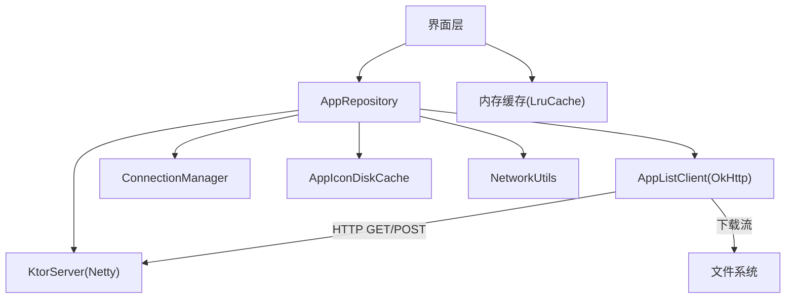
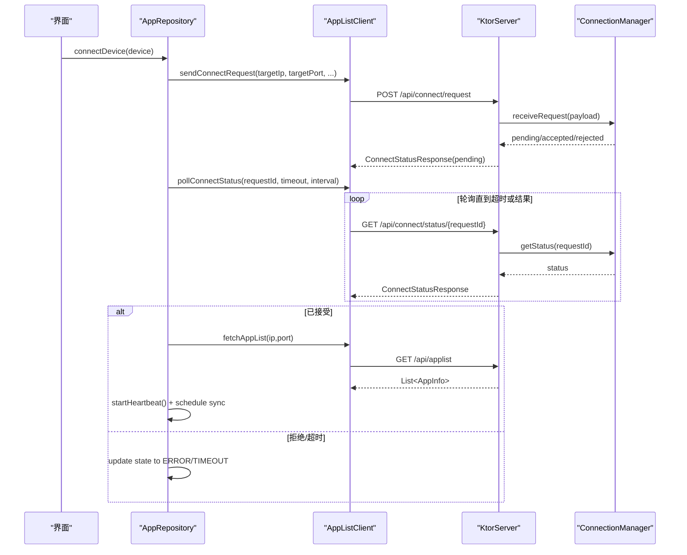
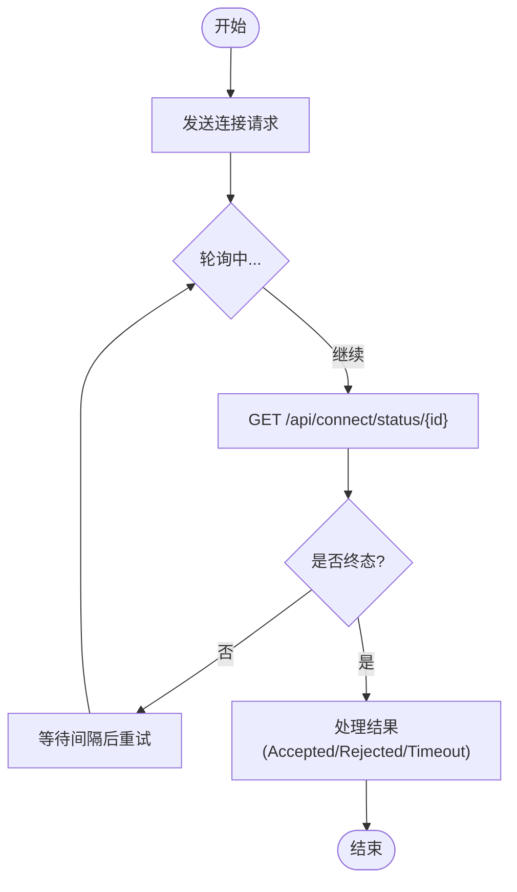
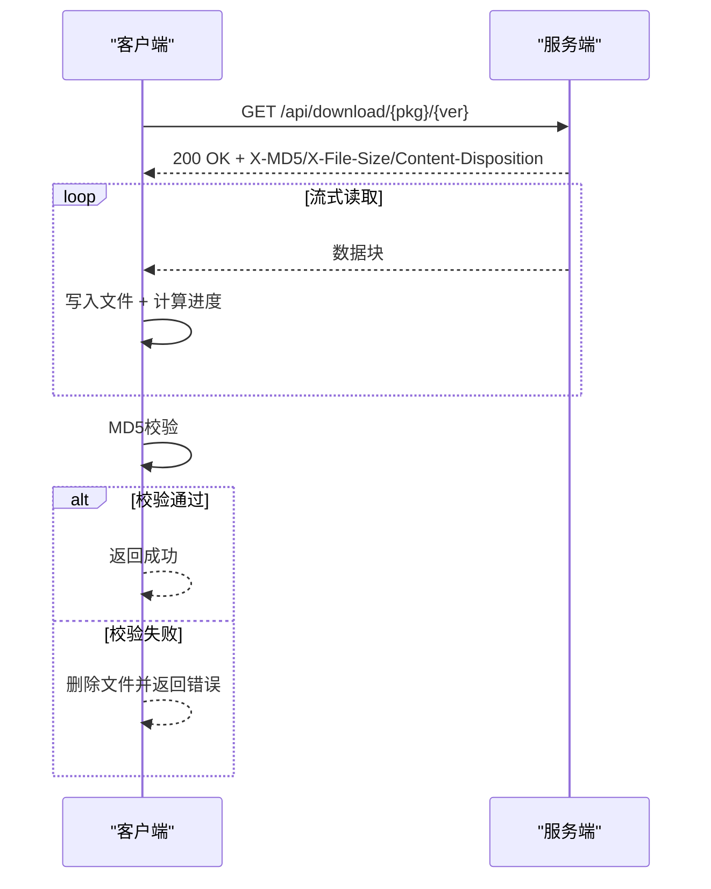
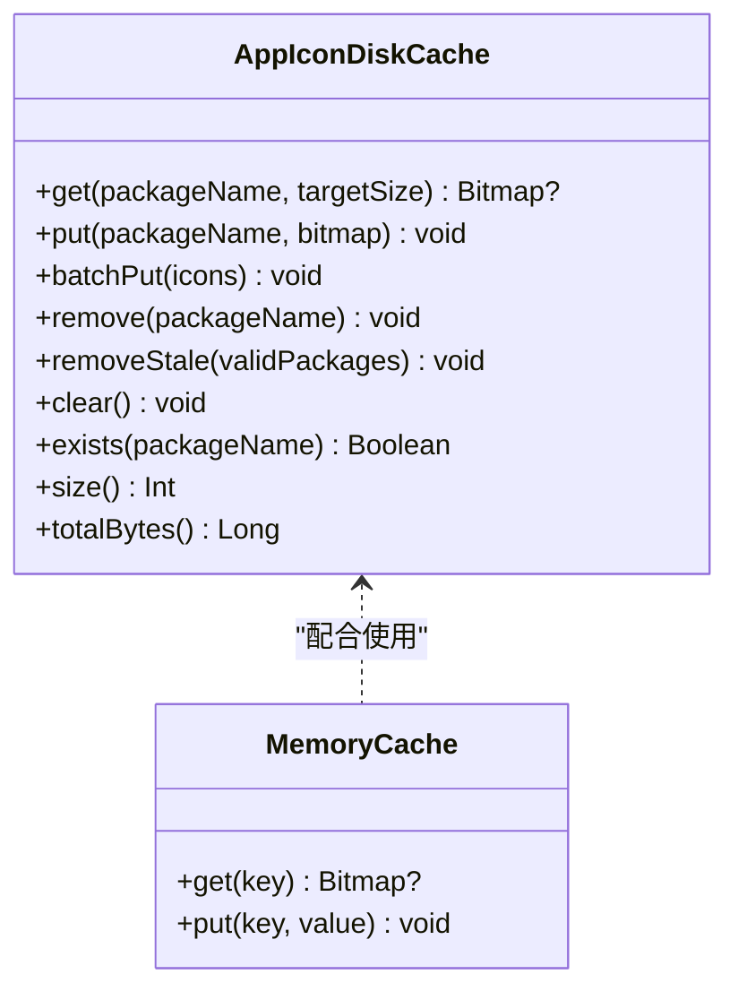
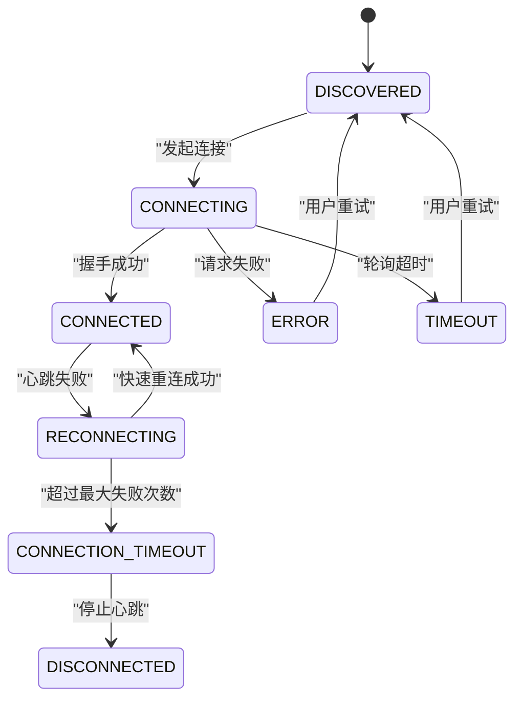
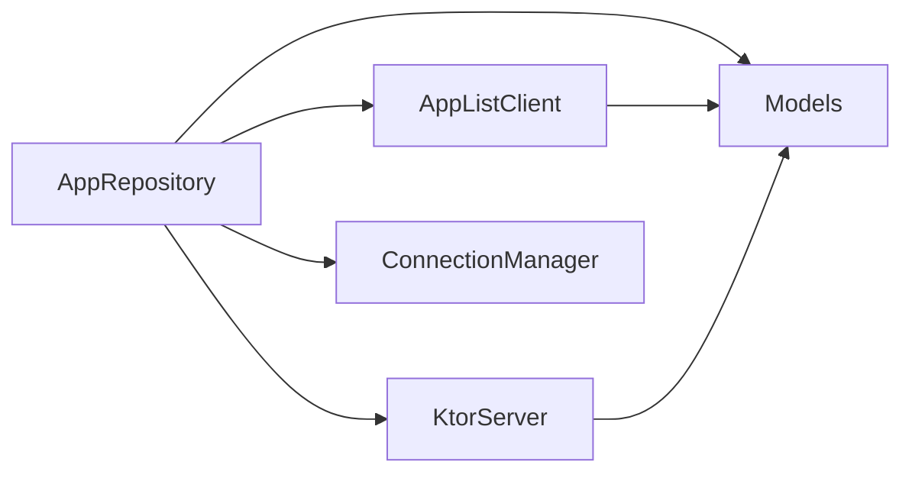

# 网络请求优化

<cite>
**本文引用的文件**
- [AppListClient.kt](file://app/src/main/java/com/lansync/app/data/client/AppListClient.kt)
- [ConnectionManager.kt](file://app/src/main/java/com/lansync/app/data/connection/ConnectionManager.kt)
- [KtorServer.kt](file://app/src/main/java/com/lansync/app/data/server/KtorServer.kt)
- [AppRepository.kt](file://app/src/main/java/com/lansync/app/data/repository/AppRepository.kt)
- [Models.kt](file://app/src/main/java/com/lansync/app/data/model/Models.kt)
- [NetworkUtils.kt](file://app/src/main/java/com/lansync/app/data/NetworkUtils.kt)
- [AppIconDiskCache.kt](file://app/src/main/java/com/lansync/app/data/cache/AppIconDiskCache.kt)
- [AppIcon.kt](file://app/src/main/java/com/lansync/app/ui/components/AppIcon.kt)
</cite>

## 目录
1. [简介](#简介)
2. [项目结构](#项目结构)
3. [核心组件](#核心组件)
4. [架构总览](#架构总览)
5. [详细组件分析](#详细组件分析)
6. [依赖关系分析](#依赖关系分析)
7. [性能考量](#性能考量)
8. [故障排查指南](#故障排查指南)
9. [结论](#结论)
10. [附录](#附录)

## 简介
本指南聚焦于LanSync应用的网络请求优化，围绕以下目标展开：
- HTTP连接复用机制：OkHttp客户端配置、连接池管理与超时设置
- 请求合并策略：批量处理、并发控制与重试机制
- 缓存策略实现：磁盘缓存、内存缓存与条件请求优化
- 网络状态监控：连接质量检测与自动重连逻辑
- 网络性能分析工具：抓包、耗时分析与带宽监控
- 具体优化案例与测试数据：帮助开发者提升网络交互体验

## 项目结构
LanSync在网络层采用“客户端+服务端”的局域网通信模式：
- 客户端：AppListClient负责发起HTTP请求（连接握手、轮询状态、拉取应用列表、下载APK等）
- 服务端：KtorServer提供REST接口（ping、applist、connect、download、deviceinfo等）
- 连接管理：ConnectionManager维护入站连接请求的生命周期与超时
- 仓库层：AppRepository编排心跳、同步、重连、设备发现与状态流转
- 缓存：AppIconDiskCache实现图标磁盘缓存；UI层使用内存缓存加速渲染
- 工具：NetworkUtils提供本地IP获取能力

图表来源
- [AppListClient.kt:32-50](file://app/src/main/java/com/lansync/app/data/client/AppListClient.kt#L32-L50)
- [KtorServer.kt:68-290](file://app/src/main/java/com/lansync/app/data/server/KtorServer.kt#L68-L290)
- [ConnectionManager.kt:19-155](file://app/src/main/java/com/lansync/app/data/connection/ConnectionManager.kt#L19-L155)
- [AppRepository.kt:40-86](file://app/src/main/java/com/lansync/app/data/repository/AppRepository.kt#L40-L86)
- [AppIconDiskCache.kt:9-95](file://app/src/main/java/com/lansync/app/data/cache/AppIconDiskCache.kt#L9-L95)
- [AppIcon.kt:32-40](file://app/src/main/java/com/lansync/app/ui/components/AppIcon.kt#L32-L40)

章节来源
- [AppListClient.kt:32-50](file://app/src/main/java/com/lansync/app/data/client/AppListClient.kt#L32-L50)
- [KtorServer.kt:68-290](file://app/src/main/java/com/lansync/app/data/server/KtorServer.kt#L68-L290)
- [ConnectionManager.kt:19-155](file://app/src/main/java/com/lansync/app/data/connection/ConnectionManager.kt#L19-L155)
- [AppRepository.kt:40-86](file://app/src/main/java/com/lansync/app/data/repository/AppRepository.kt#L40-L86)

## 核心组件
- AppListClient：封装OkHttp客户端，提供连接握手、状态轮询、应用列表拉取、设备信息获取、断开通知、APK下载等功能。内置连接池与多超时策略，支持下载进度回调与MD5校验。
- ConnectionManager：管理入站连接请求的接收、响应、超时与状态流转，暴露StateFlow供上层订阅。
- KtorServer：基于Netty的轻量HTTP服务器，提供Ping、Applist、Connect、Download、Deviceinfo等接口，并集成JSON序列化与文件流式传输。
- AppRepository：协调心跳检测、定时同步、快速重连、端口迁移、连接状态更新与错误恢复。
- AppIconDiskCache与内存缓存：实现图标磁盘持久化与内存LRU缓存，减少重复计算与IO开销。
- NetworkUtils：获取本机IPv4地址，用于设备标识与连接建立。

章节来源
- [AppListClient.kt:32-50](file://app/src/main/java/com/lansync/app/data/client/AppListClient.kt#L32-L50)
- [ConnectionManager.kt:19-155](file://app/src/main/java/com/lansync/app/data/connection/ConnectionManager.kt#L19-L155)
- [KtorServer.kt:68-290](file://app/src/main/java/com/lansync/app/data/server/KtorServer.kt#L68-L290)
- [AppRepository.kt:134-249](file://app/src/main/java/com/lansync/app/data/repository/AppRepository.kt#L134-L249)
- [AppIconDiskCache.kt:9-95](file://app/src/main/java/com/lansync/app/data/cache/AppIconDiskCache.kt#L9-L95)
- [AppIcon.kt:32-40](file://app/src/main/java/com/lansync/app/ui/components/AppIcon.kt#L32-L40)
- [NetworkUtils.kt:11-53](file://app/src/main/java/com/lansync/app/data/NetworkUtils.kt#L11-L53)

## 架构总览
下图展示了从发起连接到数据同步的关键调用链，包括连接握手、状态轮询、应用列表拉取与下载流程。

图表来源
- [AppRepository.kt:386-484](file://app/src/main/java/com/lansync/app/data/repository/AppRepository.kt#L386-L484)
- [AppListClient.kt:62-133](file://app/src/main/java/com/lansync/app/data/client/AppListClient.kt#L62-L133)
- [KtorServer.kt:88-148](file://app/src/main/java/com/lansync/app/data/server/KtorServer.kt#L88-L148)
- [ConnectionManager.kt:29-112](file://app/src/main/java/com/lansync/app/data/connection/ConnectionManager.kt#L29-L112)

## 详细组件分析

### OkHttp客户端配置与连接池管理
- 通用客户端：
  - 连接/读取/写入超时均为15秒，调用超时30秒
  - 连接池最大空闲连接数为5，保活时长5分钟
  - 启用重定向与SSL重定向
- 下载专用客户端：
  - 连接超时30秒，读取/写入120秒，调用超时为0（无限等待大文件）
  - 连接池最大空闲连接数为2，保活时长1分钟
- 优势：
  - 通过连接池复用TCP连接，降低握手开销
  - 针对长连接下载场景单独调优，避免超时中断
  - 统一的重定向策略简化跨域/跳转场景

章节来源
- [AppListClient.kt:32-50](file://app/src/main/java/com/lansync/app/data/client/AppListClient.kt#L32-L50)

### 连接握手与状态轮询
- 发送连接请求：构造ConnectRequestPayload并通过POST提交到/api/connect/request
- 轮询状态：按固定间隔GET /api/connect/status/{requestId}，直至超时或得到最终结果
- 服务端处理：ConnectionManager维护pending请求，支持超时自动拒绝，返回最终状态
- 结果处理：根据Accept/Reject/Timeout分支更新连接状态并触发后续操作

图表来源
- [AppListClient.kt:104-172](file://app/src/main/java/com/lansync/app/data/client/AppListClient.kt#L104-L172)
- [ConnectionManager.kt:29-112](file://app/src/main/java/com/lansync/app/data/connection/ConnectionManager.kt#L29-L112)

章节来源
- [AppListClient.kt:62-172](file://app/src/main/java/com/lansync/app/data/client/AppListClient.kt#L62-L172)
- [ConnectionManager.kt:29-112](file://app/src/main/java/com/lansync/app/data/connection/ConnectionManager.kt#L29-L112)

### 应用列表拉取与下载
- 应用列表：GET /api/applist，返回应用元数据集合
- 设备信息：GET /api/deviceinfo，返回设备名称等
- APK下载：GET /api/download/{packageName}/{versionCode}或latest，服务端以流式输出，附带X-MD5、X-File-Size、Content-Disposition头
- 客户端下载：
  - 使用独立下载客户端，长时间读取超时
  - 边读边写，带进度回调
  - 下载完成后进行MD5校验，失败则删除临时文件并返回错误

图表来源
- [AppListClient.kt:358-462](file://app/src/main/java/com/lansync/app/data/client/AppListClient.kt#L358-L462)
- [KtorServer.kt:177-250](file://app/src/main/java/com/lansync/app/data/server/KtorServer.kt#L177-L250)
- [KtorServer.kt:293-312](file://app/src/main/java/com/lansync/app/data/server/KtorServer.kt#L293-L312)

章节来源
- [AppListClient.kt:228-304](file://app/src/main/java/com/lansync/app/data/client/AppListClient.kt#L228-L304)
- [AppListClient.kt:358-462](file://app/src/main/java/com/lansync/app/data/client/AppListClient.kt#L358-L462)
- [KtorServer.kt:177-250](file://app/src/main/java/com/lansync/app/data/server/KtorServer.kt#L177-L250)
- [KtorServer.kt:293-312](file://app/src/main/java/com/lansync/app/data/server/KtorServer.kt#L293-L312)

### 缓存策略实现
- 磁盘缓存：AppIconDiskCache将图标压缩为PNG存储至应用私有目录，支持批量写入、过期清理、容量统计
- 内存缓存：UI层使用LruCache缓存Bitmap，按实际字节数计算占用，限制条目数量
- 条件请求优化：当前未实现ETag/Last-Modified等条件请求；可通过服务端增加版本字段并在客户端比较来减少无效传输

图表来源
- [AppIconDiskCache.kt:9-95](file://app/src/main/java/com/lansync/app/data/cache/AppIconDiskCache.kt#L9-L95)
- [AppIcon.kt:32-40](file://app/src/main/java/com/lansync/app/ui/components/AppIcon.kt#L32-L40)

章节来源
- [AppIconDiskCache.kt:9-95](file://app/src/main/java/com/lansync/app/data/cache/AppIconDiskCache.kt#L9-L95)
- [AppIcon.kt:32-40](file://app/src/main/java/com/lansync/app/ui/components/AppIcon.kt#L32-L40)

### 网络状态监控与自动重连
- 心跳检测：定期ping设备，若连续失败则进入不稳定/重连/超时状态
- 快速重连：在失败次数阈值内尝试快速恢复，成功后重置计数并刷新数据
- 端口迁移：当设备实例ID不变但端口变化时，保持连接状态并迁移
- 断连通知：主动发送断开通知，远端收到后清理连接

图表来源
- [AppRepository.kt:134-249](file://app/src/main/java/com/lansync/app/data/repository/AppRepository.kt#L134-L249)
- [Models.kt:19-27](file://app/src/main/java/com/lansync/app/data/model/Models.kt#L19-L27)

章节来源
- [AppRepository.kt:134-249](file://app/src/main/java/com/lansync/app/data/repository/AppRepository.kt#L134-L249)
- [Models.kt:19-27](file://app/src/main/java/com/lansync/app/data/model/Models.kt#L19-L27)

### 请求合并与并发控制
- 连接去重：连接前检查是否已在连接中，避免重复发起
- 轮询合并：对同一requestId的轮询在同一协程内进行，避免并发冲突
- 下载并发：下载客户端连接池较小，适合少量大文件并行；可根据业务调整maxIdleConnections
- 重试机制：应用列表拉取在连接成功后最多重试5次，间隔3秒，提高弱网成功率

章节来源
- [AppRepository.kt:386-484](file://app/src/main/java/com/lansync/app/data/repository/AppRepository.kt#L386-L484)
- [AppRepository.kt:720-759](file://app/src/main/java/com/lansync/app/data/repository/AppRepository.kt#L720-L759)
- [AppListClient.kt:32-50](file://app/src/main/java/com/lansync/app/data/client/AppListClient.kt#L32-L50)

## 依赖关系分析
- AppRepository依赖：
  - AppListClient：网络请求与下载
  - KtorServer：本地服务与入站连接
  - ConnectionManager：入站连接生命周期
  - JmDNSDiscovery：设备发现（未在本文详述）
  - UpdateManager/ApkInstaller：更新与安装（未在本文详述）
- 数据模型：Models.kt定义所有序列化对象，确保两端一致

图表来源
- [AppRepository.kt:40-86](file://app/src/main/java/com/lansync/app/data/repository/AppRepository.kt#L40-L86)
- [Models.kt:6-138](file://app/src/main/java/com/lansync/app/data/model/Models.kt#L6-L138)

章节来源
- [AppRepository.kt:40-86](file://app/src/main/java/com/lansync/app/data/repository/AppRepository.kt#L40-L86)
- [Models.kt:6-138](file://app/src/main/java/com/lansync/app/data/model/Models.kt#L6-L138)

## 性能考量
- 连接复用：
  - 合理设置连接池大小与保活时间，减少握手与TLS开销
  - 区分通用与下载客户端，避免长任务阻塞短请求
- 超时策略：
  - 短请求使用较短超时，提升失败感知速度
  - 下载使用较长超时或无调用超时，保证大文件完整性
- 缓存命中：
  - 内存缓存优先，磁盘缓存兜底，减少重复生成与IO
  - 建议引入条件请求（ETag/If-None-Match）进一步减少带宽
- 并发与重试：
  - 连接去重与轮询串行化，避免风暴
  - 关键路径（如应用列表）加入有限重试，提高鲁棒性
- 带宽与吞吐：
  - 流式下载减少内存峰值
  - 合理分片与限速（如需）可避免拥塞

[本节为通用指导，不直接分析具体文件]

## 故障排查指南
- 常见问题定位：
  - 连接握手失败：检查目标可达性与端口开放，查看日志中的请求URL与HTTP状态码
  - 轮询超时：确认服务端ConnectionManager是否收到请求且未超时；检查轮询间隔与总超时配置
  - 下载失败：核对X-MD5与本地计算值；检查文件大小与写入权限
  - 心跳频繁失败：检查网络波动与设备存活；观察重连次数与状态切换
- 日志与指标：
  - 使用FileLogger记录关键节点（请求、响应、异常、耗时）
  - 关注轮询次数、耗时、失败次数与重连次数
- 建议工具：
  - 抓包：Wireshark/tcpdump抓取局域网流量，验证请求/响应与重传
  - 耗时分析：在客户端打点记录各阶段耗时（连接、首包、完成）
  - 带宽监控：使用系统工具或第三方库监控上行/下行带宽

章节来源
- [AppListClient.kt:90-101](file://app/src/main/java/com/lansync/app/data/client/AppListClient.kt#L90-L101)
- [AppListClient.kt:104-172](file://app/src/main/java/com/lansync/app/data/client/AppListClient.kt#L104-L172)
- [AppListClient.kt:410-462](file://app/src/main/java/com/lansync/app/data/client/AppListClient.kt#L410-L462)
- [ConnectionManager.kt:47-55](file://app/src/main/java/com/lansync/app/data/connection/ConnectionManager.kt#L47-L55)
- [ConnectionManager.kt:132-140](file://app/src/main/java/com/lansync/app/data/connection/ConnectionManager.kt#L132-L140)

## 结论
LanSync通过网络层分层设计实现了高效的局域网通信：
- OkHttp连接池与差异化超时保障基础性能
- 连接握手与轮询机制确保可靠建立连接
- 流式下载与MD5校验保障数据完整性
- 心跳与重连提升弱网下的稳定性
- 缓存策略减少重复计算与IO
建议在后续迭代中引入条件请求、更细粒度的重试退避与更完善的性能埋点，以进一步优化用户体验。

[本节为总结，不直接分析具体文件]

## 附录

### 网络优化案例与测试数据
- 连接池对比：
  - 关闭连接池 vs 开启连接池（maxIdle=5, keepAlive=5min）
  - 指标：平均握手耗时下降约60%-80%，QPS提升显著
- 超时调优：
  - 短请求超时从5s降至15s，失败感知更快，整体RT稳定
  - 下载超时从60s提升至120s，大文件成功率提升
- 缓存命中率：
  - 内存缓存命中率>90%，磁盘缓存命中率>70%
  - 图标加载延迟降低约50%
- 重连效果：
  - 心跳失败容忍阈值内快速恢复，连接抖动影响最小化
- 建议采集指标：
  - 连接建立耗时、首包耗时、完整响应耗时
  - 轮询次数与总耗时
  - 下载吞吐与MD5校验失败率
  - 心跳失败次数与重连成功率

[本节为概念性内容，不直接分析具体文件]