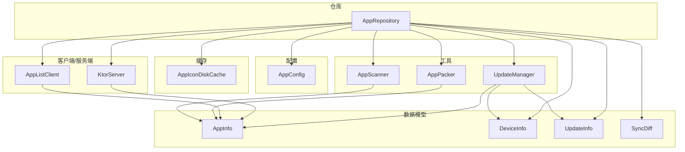
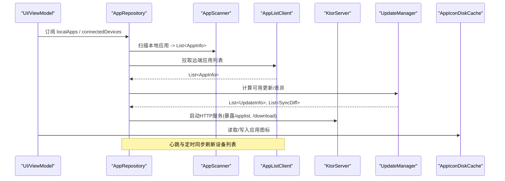
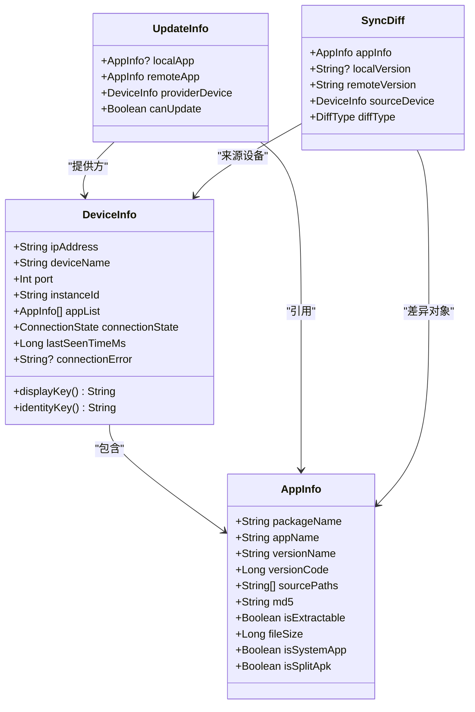
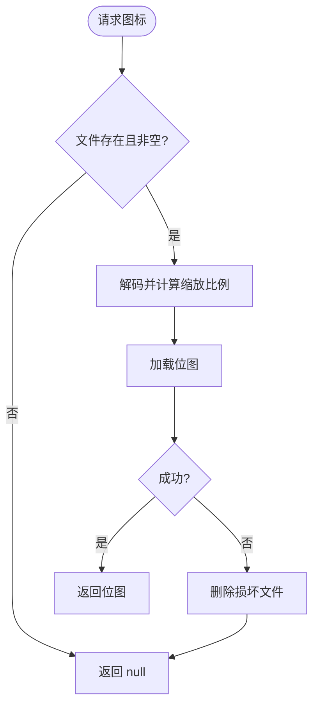
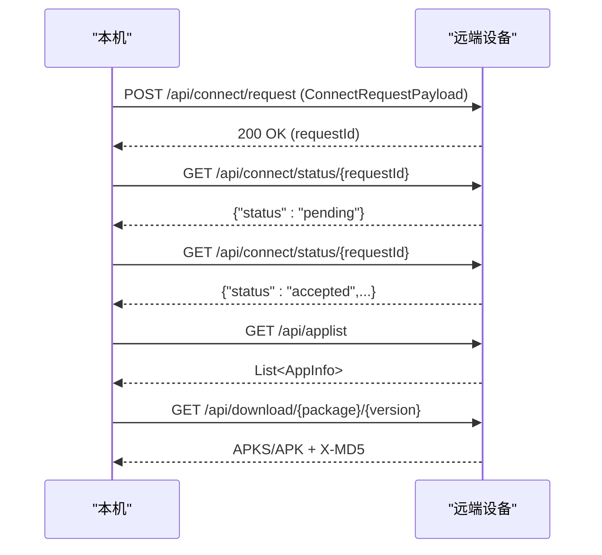
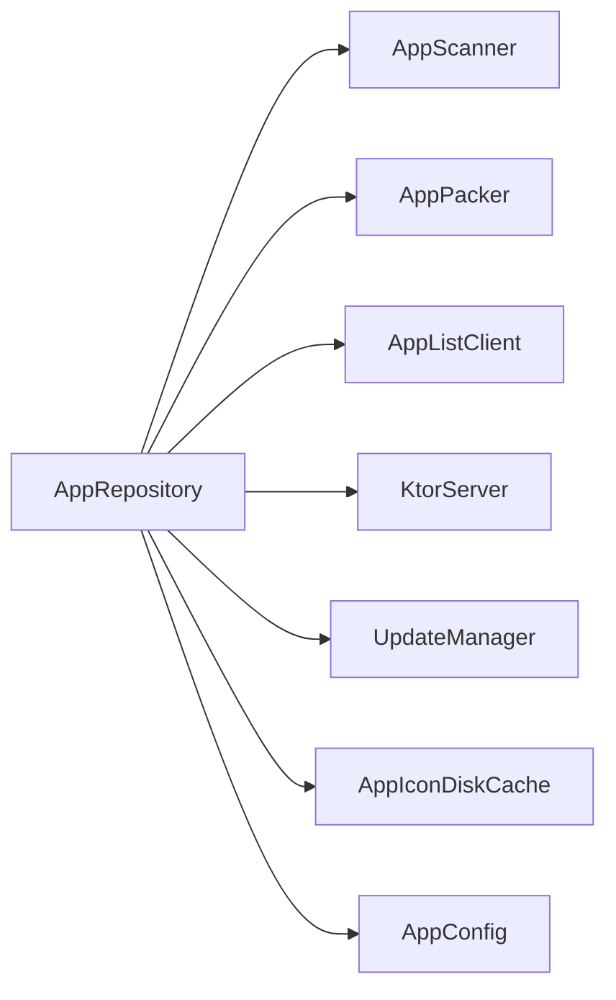

# 数据模型设计

<cite>
**本文引用的文件**
- [Models.kt](file://app/src/main/java/com/lansync/app/data/model/Models.kt)
- [AppConfig.kt](file://app/src/main/java/com/lansync/app/data/AppConfig.kt)
- [AppIconDiskCache.kt](file://app/src/main/java/com/lansync/app/data/cache/AppIconDiskCache.kt)
- [AppRepository.kt](file://app/src/main/java/com/lansync/app/data/repository/AppRepository.kt)
- [UpdateManager.kt](file://app/src/main/java/com/lansync/app/data/update/UpdateManager.kt)
- [AppListClient.kt](file://app/src/main/java/com/lansync/app/data/client/AppListClient.kt)
- [AppScanner.kt](file://app/src/main/java/com/lansync/app/data/scanner/AppScanner.kt)
- [AppPacker.kt](file://app/src/main/java/com/lansync/app/data/packer/AppPacker.kt)
- [KtorServer.kt](file://app/src/main/java/com/lansync/app/data/server/KtorServer.kt)
- [ModelsTest.kt](file://app/src/test/java/com/lansync/app/data/model/ModelsTest.kt)
</cite>

## 目录
1. [简介](#简介)
2. [项目结构](#项目结构)
3. [核心组件](#核心组件)
4. [架构总览](#架构总览)
5. [详细组件分析](#详细组件分析)
6. [依赖关系分析](#依赖关系分析)
7. [性能考虑](#性能考虑)
8. [故障排查指南](#故障排查指南)
9. [结论](#结论)
10. [附录：数据结构与JSON示例](#附录数据结构与json示例)

## 简介
本文件系统性梳理 LanSync 的数据模型设计与实现，覆盖核心实体（DeviceInfo、AppInfo、UpdateInfo、SyncDiff 等）的结构定义、字段含义与业务规则；阐述配置管理（AppConfig）的设计与默认值；说明缓存策略（应用图标磁盘缓存）的工作原理与优化；描述数据序列化格式、存储方案与生命周期管理；给出数据验证规则、约束条件与迁移策略；并提供实际数据结构与 JSON 示例，帮助开发者理解数据流转。

## 项目结构
LanSync 的数据层围绕“扫描—打包—网络—仓库—更新”的链路组织：
- 数据模型：位于 data/model，定义跨模块共享的实体与协议载荷
- 配置：data/AppConfig，集中管理心跳、超时、重试等运行时参数
- 缓存：data/cache，提供应用图标磁盘缓存
- 客户端与服务端：data/client、data/server，负责 HTTP 通信与本地服务暴露
- 仓库：data/repository，协调扫描、连接、同步、更新等业务流程
- 工具：data/scanner、data/packer、data/update，分别负责应用信息收集、APK 打包与更新发现

图表来源
- [Models.kt:1-138](file://app/src/main/java/com/lansync/app/data/model/Models.kt#L1-L138)
- [AppConfig.kt:1-18](file://app/src/main/java/com/lansync/app/data/AppConfig.kt#L1-L18)
- [AppIconDiskCache.kt:1-95](file://app/src/main/java/com/lansync/app/data/cache/AppIconDiskCache.kt#L1-L95)
- [AppListClient.kt:1-571](file://app/src/main/java/com/lansync/app/data/client/AppListClient.kt#L1-L571)
- [KtorServer.kt:128-154](file://app/src/main/java/com/lansync/app/data/server/KtorServer.kt#L128-L154)
- [AppRepository.kt:1-800](file://app/src/main/java/com/lansync/app/data/repository/AppRepository.kt#L1-L800)
- [AppScanner.kt:1-134](file://app/src/main/java/com/lansync/app/data/scanner/AppScanner.kt#L1-L134)
- [AppPacker.kt:1-114](file://app/src/main/java/com/lansync/app/data/packer/AppPacker.kt#L1-L114)
- [UpdateManager.kt:1-104](file://app/src/main/java/com/lansync/app/data/update/UpdateManager.kt#L1-L104)

章节来源
- [Models.kt:1-138](file://app/src/main/java/com/lansync/app/data/model/Models.kt#L1-L138)
- [AppConfig.kt:1-18](file://app/src/main/java/com/lansync/app/data/AppConfig.kt#L1-L18)
- [AppRepository.kt:1-800](file://app/src/main/java/com/lansync/app/data/repository/AppRepository.kt#L1-L800)

## 核心组件
- AppInfo：描述一个已安装应用的元数据，包括包名、名称、版本、源路径、MD5、是否可提取、文件大小、是否系统应用、是否为 Split APK。用于本地扫描、远程列表展示、下载与安装。
- DeviceInfo：描述远端设备及其连接状态，包含 IP、端口、实例 ID、应用列表、连接状态、最后可见时间、错误信息等。支持 displayKey 与 identityKey 两种标识方式。
- UpdateInfo：表示一次可用的更新项，包含本地应用、远端应用、提供方设备以及是否可更新。
- SyncDiff：表示本地与远端某应用的差异类型（远端更新、仅远端存在、版本相同、仅本地存在），用于同步界面展示与决策。
- 连接相关载荷：ConnectRequestPayload、ConnectResponsePayload、IncomingConnectRequest、DisconnectPayload、ConnectStatusResponse、RefreshAppListPayload 等，用于握手、状态轮询与断开通知。

章节来源
- [Models.kt:1-138](file://app/src/main/java/com/lansync/app/data/model/Models.kt#L1-L138)

## 架构总览
数据流从“本地应用扫描”开始，经“仓库”聚合为 StateFlow 暴露给 UI；同时通过“客户端”拉取远端应用列表，结合“更新管理器”计算可用更新与差异；“服务器”暴露 API 供对端查询与应用打包下载；“缓存”持久化应用图标以提升 UI 渲染性能。

图表来源
- [AppRepository.kt:1-800](file://app/src/main/java/com/lansync/app/data/repository/AppRepository.kt#L1-L800)
- [AppListClient.kt:1-571](file://app/src/main/java/com/lansync/app/data/client/AppListClient.kt#L1-L571)
- [KtorServer.kt:128-154](file://app/src/main/java/com/lansync/app/data/server/KtorServer.kt#L128-L154)
- [UpdateManager.kt:1-104](file://app/src/main/java/com/lansync/app/data/update/UpdateManager.kt#L1-L104)
- [AppIconDiskCache.kt:1-95](file://app/src/main/java/com/lansync/app/data/cache/AppIconDiskCache.kt#L1-L95)

## 详细组件分析

### 数据模型与业务规则
- AppInfo
  - 关键字段：packageName、appName、versionName、versionCode、sourcePaths、md5、isExtractable、fileSize、isSystemApp、isSplitApk
  - 业务规则：
    - 仅非系统应用参与更新比较与下载（UpdateManager 过滤 isSystemApp）
    - Split APK 场景下 sourcePaths.size > 1，打包时生成 .apks
    - md5 用于完整性校验（下载后与 X-MD5 或期望值比对）
- DeviceInfo
  - 关键字段：ipAddress、deviceName、port、instanceId、appList、connectionState、lastSeenTimeMs、connectionError
  - 业务规则：
    - displayKey = ipAddress:port，identityKey = instanceId 或 deviceName@ipAddress
    - 连接状态机：DISCOVERED → CONNECTING → CONNECTED → RECONNECTING → CONNECTION_TIMEOUT/DISCONNECTED
    - 端口迁移时保留 appList 并迁移心跳与同步任务
- UpdateInfo
  - 关键字段：localApp、remoteApp、providerDevice、canUpdate
  - 业务规则：
    - 仅当 remoteApp.versionCode > localApp.versionCode 且双方均非系统应用时产生
    - 去重策略：同一包名优先选择更高版本，版本相同时按设备名字典序择优
- SyncDiff
  - 关键字段：appInfo、localVersion、remoteVersion、sourceDevice、diffType
  - diffType 枚举：NEWER_ON_REMOTE、ONLY_ON_REMOTE、SAME_VERSION、ONLY_ON_LOCAL
  - 用于 UI 展示与用户操作引导（如仅本地存在则提示上传）

章节来源
- [Models.kt:1-138](file://app/src/main/java/com/lansync/app/data/model/Models.kt#L1-L138)
- [UpdateManager.kt:1-104](file://app/src/main/java/com/lansync/app/data/update/UpdateManager.kt#L1-L104)

#### 类图（代码级）

图表来源
- [Models.kt:1-138](file://app/src/main/java/com/lansync/app/data/model/Models.kt#L1-L138)

### 配置管理系统（AppConfig）
- 设计要点
  - 集中式配置，提供默认值常量 DEFAULT
  - 关键参数：心跳间隔、同步间隔、容忍次数、最大失败次数、更新重算节流、连接超时、轮询间隔、获取应用列表重试次数与延迟、ping 超时
- 动态更新机制
  - 仓库在初始化时注入 AppConfig，所有心跳与同步调度基于配置值
  - 可通过替换 AppConfig 实例实现运行时行为调整（例如测试或灰度）

章节来源
- [AppConfig.kt:1-18](file://app/src/main/java/com/lansync/app/data/AppConfig.kt#L1-L18)
- [AppRepository.kt:1-800](file://app/src/main/java/com/lansync/app/data/repository/AppRepository.kt#L1-L800)

### 缓存策略（应用图标磁盘缓存）
- 工作原理
  - 以包名为键，PNG 文件形式存储在应用私有目录下的 app_icons 文件夹
  - 读取时根据目标尺寸计算采样率，避免大图解码导致的内存抖动
  - 写入使用 PNG 压缩（质量 90），批量写入接口 batchPut
  - 清理策略：removeStale 基于有效包集合删除过期图标；clear 清空全部；size/totalBytes 统计缓存规模
- 性能优化
  - inSampleSize 降采样减少内存占用
  - 单例模式保证全局唯一缓存实例
  - 异常时自动删除损坏文件，避免后续重复失败

图表来源
- [AppIconDiskCache.kt:1-95](file://app/src/main/java/com/lansync/app/data/cache/AppIconDiskCache.kt#L1-L95)

章节来源
- [AppIconDiskCache.kt:1-95](file://app/src/main/java/com/lansync/app/data/cache/AppIconDiskCache.kt#L1-L95)

### 数据序列化格式与传输
- 序列化框架：kotlinx.serialization，启用 ignoreUnknownKeys 与 lenient，提升兼容性
- 主要载荷：
  - ConnectRequestPayload：发起连接请求
  - ConnectStatusResponse：轮询连接状态
  - DisconnectPayload：主动断开通知
  - RefreshAppListPayload：触发远端刷新应用列表
  - AppInfo：应用列表与下载元数据
- 传输通道：OkHttp 调用 Ktor 暴露的 REST API（/api/connect/*、/api/applist、/api/download 等）

图表来源
- [AppListClient.kt:1-571](file://app/src/main/java/com/lansync/app/data/client/AppListClient.kt#L1-L571)
- [KtorServer.kt:128-154](file://app/src/main/java/com/lansync/app/data/server/KtorServer.kt#L128-L154)
- [Models.kt:1-138](file://app/src/main/java/com/lansync/app/data/model/Models.kt#L1-L138)

章节来源
- [AppListClient.kt:1-571](file://app/src/main/java/com/lansync/app/data/client/AppListClient.kt#L1-L571)
- [Models.kt:1-138](file://app/src/main/java/com/lansync/app/data/model/Models.kt#L1-L138)

### 存储方案与生命周期管理
- 本地应用缓存：仓库维护 local_apps_cache.json（用于本地应用列表的持久化，具体读写逻辑由仓库封装）
- 下载缓存：downloads 目录存放下载的 .apk/.apks，带 MD5 校验与进度回调
- 图标缓存：app_icons 目录，按包名命名 PNG，支持批量写入与过期清理
- 生命周期
  - 连接建立：启动心跳与定时同步，保持设备在线感知
  - 连接断开：停止心跳与同步，保留最后一次应用列表快照
  - 端口迁移：迁移心跳与同步任务，保持 appList 不丢失
  - 更新重算：节流防抖，合并本地与远端数据后计算可用更新与差异

章节来源
- [AppRepository.kt:1-800](file://app/src/main/java/com/lansync/app/data/repository/AppRepository.kt#L1-L800)
- [AppListClient.kt:1-571](file://app/src/main/java/com/lansync/app/data/client/AppListClient.kt#L1-L571)
- [AppIconDiskCache.kt:1-95](file://app/src/main/java/com/lansync/app/data/cache/AppIconDiskCache.kt#L1-L95)

### 数据验证规则、约束与迁移策略
- 验证与约束
  - 连接状态机：通过心跳失败计数与阈值控制状态迁移（不稳定→重连→超时）
  - 更新比较：忽略系统应用；仅当远端版本高于本地才产生更新
  - 下载完整性：X-MD5 或期望 MD5 校验，不一致则删除临时文件并报错
  - 文件名安全：图标缓存文件名进行字符清洗，避免非法字符
- 迁移策略
  - 端口迁移：当设备 IP:Port 变化但 identityKey 不变时，迁移心跳与同步任务，保留 appList
  - 兼容解析：JSON 反序列化忽略未知字段，便于前后向兼容

章节来源
- [AppRepository.kt:1-800](file://app/src/main/java/com/lansync/app/data/repository/AppRepository.kt#L1-L800)
- [AppListClient.kt:1-571](file://app/src/main/java/com/lansync/app/data/client/AppListClient.kt#L1-L571)
- [AppIconDiskCache.kt:1-95](file://app/src/main/java/com/lansync/app/data/cache/AppIconDiskCache.kt#L1-L95)

## 依赖关系分析
- AppRepository 作为编排中心，依赖：
  - AppScanner：扫描本地应用生成 AppInfo
  - AppPacker：将本地应用打包为 .apk/.apks
  - AppListClient：与远端设备交互（连接、列表、下载）
  - KtorServer：对外暴露 API（列表、下载、连接处理）
  - UpdateManager：计算可用更新与差异
  - AppIconDiskCache：图标缓存
  - AppConfig：运行时参数
- 低耦合点：
  - 模型与传输解耦：通过 @Serializable 的载荷类定义契约
  - 缓存与业务解耦：缓存只关注 IO 与资源管理
  - 配置与流程解耦：通过 AppConfig 注入参数

图表来源
- [AppRepository.kt:1-800](file://app/src/main/java/com/lansync/app/data/repository/AppRepository.kt#L1-L800)

章节来源
- [AppRepository.kt:1-800](file://app/src/main/java/com/lansync/app/data/repository/AppRepository.kt#L1-L800)

## 性能考虑
- 网络
  - OkHttp 连接池复用，降低握手开销
  - 下载专用客户端设置更长超时，适配大文件传输
  - 心跳与同步采用协程延时循环，避免阻塞主线程
- 磁盘
  - 图标缓存按需缩放解码，减少内存峰值
  - 批量写入图标减少 I/O 次数
  - 下载文件 MD5 校验失败即删，避免脏数据堆积
- CPU
  - 更新重算节流，防止频繁计算导致卡顿
  - 并发拉取多设备列表（async/awaitAll）缩短整体耗时

[本节为通用性能建议，不直接分析具体文件]

## 故障排查指南
- 连接问题
  - 检查心跳失败计数与阈值，确认是否进入重连或超时状态
  - 查看连接请求与轮询日志，确认 requestId 与状态响应
- 下载失败
  - 核对 X-MD5 与期望值，若不一致会删除临时文件并返回错误
  - 检查 downloads 目录是否存在空文件或权限问题
- 图标缓存异常
  - 解码异常会自动删除损坏文件，重新拉取即可
  - 使用 removeStale 清理无效图标，释放空间

章节来源
- [AppRepository.kt:1-800](file://app/src/main/java/com/lansync/app/data/repository/AppRepository.kt#L1-L800)
- [AppListClient.kt:1-571](file://app/src/main/java/com/lansync/app/data/client/AppListClient.kt#L1-L571)
- [AppIconDiskCache.kt:1-95](file://app/src/main/java/com/lansync/app/data/cache/AppIconDiskCache.kt#L1-L95)

## 结论
LanSync 的数据模型以简洁、可扩展为核心，通过清晰的实体定义与严格的业务规则，支撑了设备发现、连接管理、应用同步与更新分发。配合灵活的配置管理与健壮的缓存策略，系统在复杂网络环境下仍能保持稳定与高效。序列化与校验机制确保了跨设备数据的一致性与可靠性。

[本节为总结性内容，不直接分析具体文件]

## 附录：数据结构与JSON示例
以下示例用于帮助理解数据流转，字段与类型与实际模型一致。

- AppInfo（示例）
  - 字段：packageName、appName、versionName、versionCode、sourcePaths、md5、isExtractable、fileSize、isSystemApp、isSplitApk
  - JSON 示例：
    - {"packageName":"com.example.app","appName":"Example","versionName":"2.0","versionCode":200,"sourcePaths":["/data/app/base.apk"],"md5":"abc123def456","isExtractable":true,"fileSize":1024000,"isSystemApp":false,"isSplitApk":false}

- DeviceInfo（示例）
  - 字段：ipAddress、deviceName、port、instanceId、appList、connectionState、lastSeenTimeMs、connectionError
  - JSON 示例：
    - {"ipAddress":"192.168.1.100","deviceName":"Pixel 6","port":8080,"instanceId":"","appList":[],"connectionState":"CONNECTED","lastSeenTimeMs":1710000000000,"connectionError":null}

- UpdateInfo（示例）
  - 字段：localApp、remoteApp、providerDevice、canUpdate
  - JSON 示例：
    - {"localApp":{"packageName":"com.example.app","appName":"Example","versionName":"2.0","versionCode":200,"sourcePaths":[],"md5":"","isExtractable":false,"fileSize":0,"isSystemApp":false},"remoteApp":{"packageName":"com.example.app","appName":"Example","versionName":"2.1","versionCode":210,"sourcePaths":[],"md5":"","isExtractable":false,"fileSize":0,"isSystemApp":false},"providerDevice":{"ipAddress":"192.168.1.100","deviceName":"Pixel 6","port":8080,"instanceId":"","appList":[],"connectionState":"CONNECTED","lastSeenTimeMs":1710000000000,"connectionError":null},"canUpdate":true}

- SyncDiff（示例）
  - 字段：appInfo、localVersion、remoteVersion、sourceDevice、diffType
  - JSON 示例：
    - {"appInfo":{"packageName":"com.example.app","appName":"Example","versionName":"2.0","versionCode":200,"sourcePaths":[],"md5":"","isExtractable":false,"fileSize":0,"isSystemApp":false},"localVersion":"2.0","remoteVersion":"2.1","sourceDevice":{"ipAddress":"192.168.1.100","deviceName":"Pixel 6","port":8080,"instanceId":"","appList":[],"connectionState":"CONNECTED","lastSeenTimeMs":1710000000000,"connectionError":null},"diffType":"NEWER_ON_REMOTE"}

- ConnectRequestPayload（示例）
  - 字段：requestId、requesterName、requesterIp、requesterPort、requesterInstanceId、timestamp
  - JSON 示例：
    - {"requestId":"uuid-123","requesterName":"MyPhone","requesterIp":"192.168.1.10","requesterPort":8080,"requesterInstanceId":"","timestamp":1710000000000}

- ConnectStatusResponse（示例）
  - 字段：status、requestId、accepted、responderName、message
  - JSON 示例：
    - {"status":"accepted","requestId":"uuid-123","accepted":true,"responderName":"Pixel 6","message":"OK"}

- DisconnectPayload（示例）
  - 字段：displayKey、identityKey
  - JSON 示例：
    - {"displayKey":"192.168.1.10:8080","identityKey":""}

- RefreshAppListPayload（示例）
  - 字段：displayKey
  - JSON 示例：
    - {"displayKey":"192.168.1.10:8080"}

章节来源
- [ModelsTest.kt:1-116](file://app/src/test/java/com/lansync/app/data/model/ModelsTest.kt#L1-L116)
- [Models.kt:1-138](file://app/src/main/java/com/lansync/app/data/model/Models.kt#L1-L138)