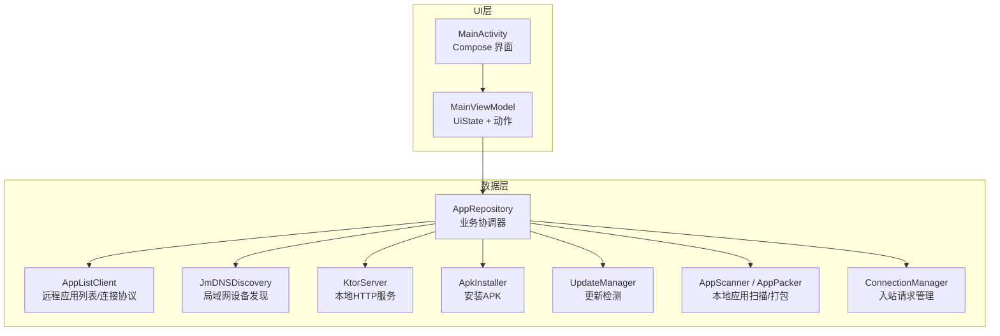
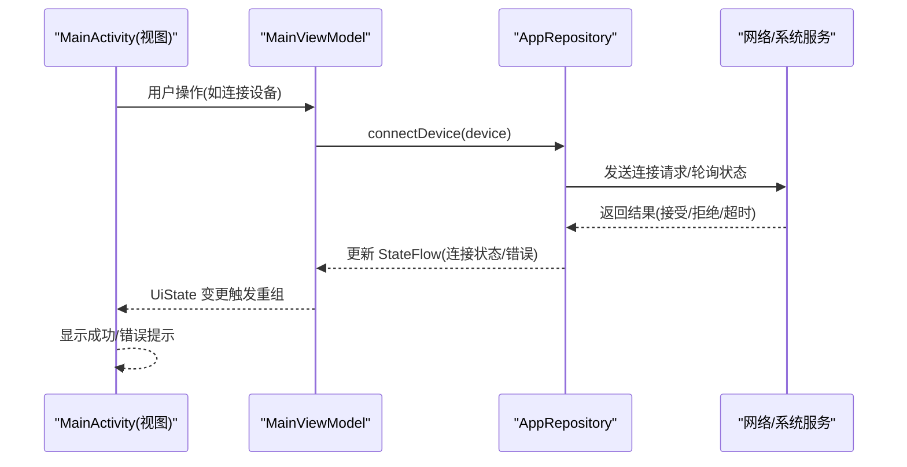
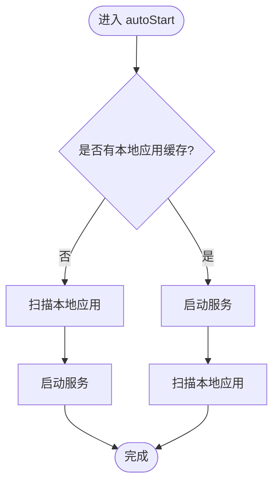
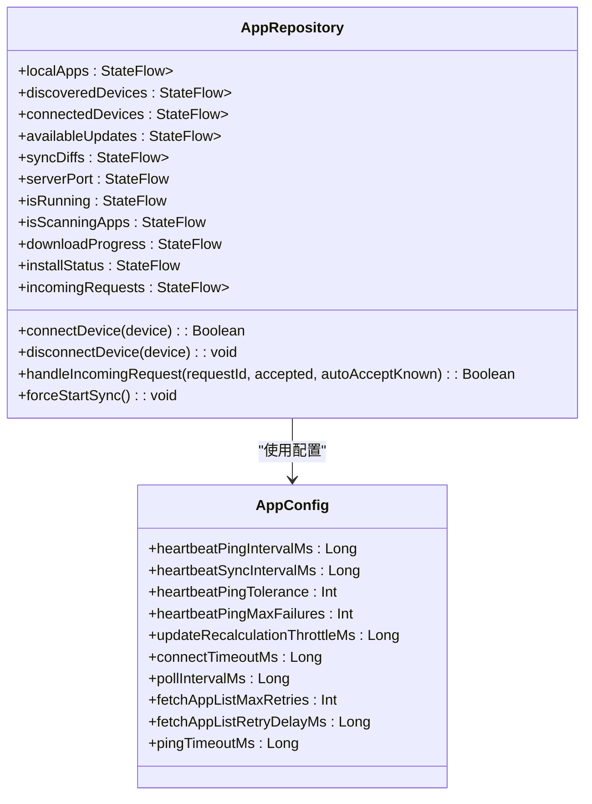
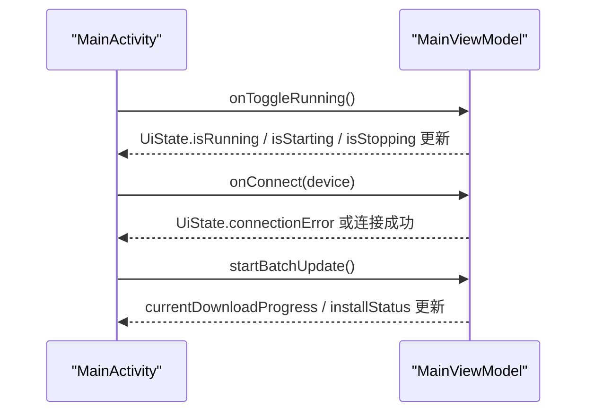
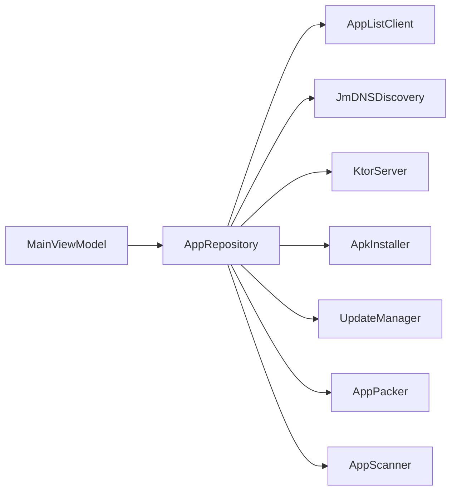

# MVVM架构模式

<cite>
**本文引用的文件**
- [MainViewModel.kt](file://app/src/main/java/com/lansync/app/ui/viewmodel/MainViewModel.kt)
- [AppRepository.kt](file://app/src/main/java/com/lansync/app/data/repository/AppRepository.kt)
- [MainActivity.kt](file://app/src/main/java/com/lansync/app/MainActivity.kt)
- [Models.kt](file://app/src/main/java/com/lansync/app/data/model/Models.kt)
- [AppConfig.kt](file://app/src/main/java/com/lansync/app/data/AppConfig.kt)
- [LanSyncApplication.kt](file://app/src/main/java/com/lansync/app/LanSyncApplication.kt)
</cite>

## 目录
1. [简介](#简介)
2. [项目结构](#项目结构)
3. [核心组件](#核心组件)
4. [架构总览](#架构总览)
5. [详细组件分析](#详细组件分析)
6. [依赖关系分析](#依赖关系分析)
7. [性能考量](#性能考量)
8. [故障排查指南](#故障排查指南)
9. [结论](#结论)
10. [附录](#附录)

## 简介
本文件围绕 LanSync 应用的 MVVM 架构进行深入说明，重点解释 Model-View-ViewModel 三层职责与协作方式：
- ViewModel（MainViewModel）负责 UI 状态管理与用户交互编排，使用 StateFlow 暴露响应式状态。
- Repository（AppRepository）作为业务逻辑协调器，封装设备发现、连接管理、应用列表同步、更新检测、下载与安装等复杂流程，并通过 StateFlow 对外发布状态。
- View（MainActivity 及其 Compose 界面）仅订阅 ViewModel 的 UiState，不直接访问数据层，实现 UI 与业务解耦。

文档同时阐述 StateFlow 在响应式状态管理中的应用、数据流向与状态更新机制、异步操作与错误处理策略，以及协程生命周期管理。

## 项目结构
LanSync 采用分层组织：
- ui: Compose 界面与 ViewModel
- data: 仓库、网络客户端、扫描、打包、安装、服务器、发现、配置、模型等
- app: 入口 Activity 与 Application

图表来源
- [MainActivity.kt:26-106](file://app/src/main/java/com/lansync/app/MainActivity.kt#L26-L106)
- [MainViewModel.kt:47-124](file://app/src/main/java/com/lansync/app/ui/viewmodel/MainViewModel.kt#L47-L124)
- [AppRepository.kt:40-79](file://app/src/main/java/com/lansync/app/data/repository/AppRepository.kt#L40-L79)

章节来源
- [MainActivity.kt:26-106](file://app/src/main/java/com/lansync/app/MainActivity.kt#L26-L106)
- [MainViewModel.kt:47-124](file://app/src/main/java/com/lansync/app/ui/viewmodel/MainViewModel.kt#L47-L124)
- [AppRepository.kt:40-79](file://app/src/main/java/com/lansync/app/data/repository/AppRepository.kt#L40-L79)

## 核心组件
- MainViewModel
  - 维护 UiState（包含本地应用、设备列表、可用更新、同步差异、下载进度、安装状态、连接错误等）。
  - 通过 combine 聚合多个 repository 的 StateFlow，统一映射到 UiState。
  - 提供用户动作方法（启动/停止服务、连接/断开设备、批量更新、拉取远程应用等），内部调用 repository 并处理状态与错误。
  - 使用 viewModelScope 管理协程生命周期，确保与 ViewModel 生命周期绑定。

- AppRepository
  - 暴露多组 StateFlow 表示业务状态（本地应用、已发现设备、已连接设备、可用更新、同步差异、服务端端口、运行状态、扫描中状态、下载进度、安装状态、入站请求等）。
  - 协调设备发现、连接握手、心跳保活、定时同步、更新计算、下载与安装等。
  - 使用 SupervisorJob + IO 调度器的 CoroutineScope 管理后台任务，避免泄漏。
  - 对连接失败、超时、重试、快速重连、端口迁移等场景进行健壮处理。

- MainActivity（UI 层）
  - 通过 collectAsState 订阅 ViewModel 的 UiState，渲染不同 Tab 页面。
  - 将用户操作回调给 ViewModel，保持 UI 无状态或最小状态。

章节来源
- [MainViewModel.kt:22-56](file://app/src/main/java/com/lansync/app/ui/viewmodel/MainViewModel.kt#L22-L56)
- [MainViewModel.kt:84-124](file://app/src/main/java/com/lansync/app/ui/viewmodel/MainViewModel.kt#L84-L124)
- [AppRepository.kt:53-79](file://app/src/main/java/com/lansync/app/data/repository/AppRepository.kt#L53-L79)
- [MainActivity.kt:37-106](file://app/src/main/java/com/lansync/app/MainActivity.kt#L37-L106)

## 架构总览
MVVM 数据流与职责划分如下：
- View 订阅 UiState，展示当前界面状态。
- ViewModel 组合多个 repository 的 StateFlow，转换为 UiState；对用户事件调用 repository 执行操作。
- Repository 聚合底层能力（网络、文件系统、系统服务），以 StateFlow 暴露状态变化，保证单向数据流。

图表来源
- [MainViewModel.kt:162-180](file://app/src/main/java/com/lansync/app/ui/viewmodel/MainViewModel.kt#L162-L180)
- [AppRepository.kt:386-484](file://app/src/main/java/com/lansync/app/data/repository/AppRepository.kt#L386-L484)
- [MainActivity.kt:197-221](file://app/src/main/java/com/lansync/app/MainActivity.kt#L197-L221)

## 详细组件分析

### MainViewModel：UI 状态管理与动作编排
- 状态定义
  - UiState 集中承载所有 UI 所需字段，包括本地应用、设备列表、更新信息、同步差异、选择集、运行状态、下载/安装进度、错误信息等。
- 响应式状态聚合
  - 使用 combine 将 repository 的多组 StateFlow 合并为 UiState 的局部更新，避免重复赋值与过度刷新。
  - 分组观察：一组用于“数据型”状态（本地应用、设备、更新、同步差异、入站请求），另一组用于“控制型”状态（运行、扫描、端口、下载进度、安装状态）。
- 自动启动与初始化
  - 若本地无缓存则触发初始扫描，完成后启动服务；否则直接启动服务并扫描本地应用。
- 用户动作
  - 启动/停止服务：设置 isStarting/isStopping 与 operationMessage，调用 repository.start()/stop()，finally 清理状态。
  - 连接/断开设备：捕获异常并写入 connectionError；支持取消错误提示。
  - 批量更新与拉取：遍历选中项，逐个调用 downloadAndInstallApp，收集错误并汇总提示。
  - 下载文件管理：加载、删除、安装本地下载文件。
- 协程与生命周期
  - 全部异步操作在 viewModelScope.launch 中执行，随 ViewModel 销毁而取消，避免内存泄漏。

图表来源
- [MainViewModel.kt:65-82](file://app/src/main/java/com/lansync/app/ui/viewmodel/MainViewModel.kt#L65-L82)

章节来源
- [MainViewModel.kt:22-56](file://app/src/main/java/com/lansync/app/ui/viewmodel/MainViewModel.kt#L22-L56)
- [MainViewModel.kt:65-124](file://app/src/main/java/com/lansync/app/ui/viewmodel/MainViewModel.kt#L65-L124)
- [MainViewModel.kt:126-180](file://app/src/main/java/com/lansync/app/ui/viewmodel/MainViewModel.kt#L126-L180)
- [MainViewModel.kt:245-282](file://app/src/main/java/com/lansync/app/ui/viewmodel/MainViewModel.kt#L245-L282)
- [MainViewModel.kt:363-410](file://app/src/main/java/com/lansync/app/ui/viewmodel/MainViewModel.kt#L363-L410)

### AppRepository：业务逻辑协调器
- 状态发布
  - 通过 MutableStateFlow 暴露本地应用、设备列表、连接状态、更新、同步差异、端口、运行标志、扫描标志、下载进度、安装状态、入站请求等。
- 设备发现与连接
  - 监听 JmDNSDiscovery 的发现流，维护 enrichedDevices（含连接态与应用列表）。
  - 发起连接请求，轮询状态，根据结果更新连接状态，启动心跳与定时同步。
  - 处理入站连接请求，支持已知设备自动接受、端口迁移、保留应用列表等。
- 心跳与重连
  - 周期性 ping 检查设备存活，按容忍度与最大失败次数切换 RECONNECTING/CONNECTION_TIMEOUT。
  - 快速重连尝试，成功后恢复连接并重新获取应用列表。
- 更新与同步
  - 当本地应用与远程设备应用就绪时，计算可用更新与同步差异，去重后发布。
- 下载与安装
  - 提供下载与安装接口，暴露 DownloadProgress 与 InstallStatus 供 UI 展示。
- 协程与资源管理
  - 使用 SupervisorJob + Dispatchers.IO 的 scope 管理后台任务；心跳与同步任务使用 ConcurrentHashMap 管理 Job，支持取消与清理。

图表来源
- [AppRepository.kt:40-79](file://app/src/main/java/com/lansync/app/data/repository/AppRepository.kt#L40-L79)
- [AppConfig.kt:3-17](file://app/src/main/java/com/lansync/app/data/AppConfig.kt#L3-L17)

章节来源
- [AppRepository.kt:53-79](file://app/src/main/java/com/lansync/app/data/repository/AppRepository.kt#L53-L79)
- [AppRepository.kt:284-384](file://app/src/main/java/com/lansync/app/data/repository/AppRepository.kt#L284-L384)
- [AppRepository.kt:386-484](file://app/src/main/java/com/lansync/app/data/repository/AppRepository.kt#L386-L484)
- [AppRepository.kt:486-554](file://app/src/main/java/com/lansync/app/data/repository/AppRepository.kt#L486-L554)
- [AppRepository.kt:624-647](file://app/src/main/java/com/lansync/app/data/repository/AppRepository.kt#L624-L647)
- [AppRepository.kt:761-796](file://app/src/main/java/com/lansync/app/data/repository/AppRepository.kt#L761-L796)

### MainActivity：UI 层与 ViewModel 的解耦
- 通过 collectAsState 订阅 UiState，渲染顶部栏、底部导航与各 Tab 内容。
- 将用户操作（刷新、连接、断开、批量更新、拉取、安装等）委托给 ViewModel。
- 使用对话框与覆盖层展示下载进度、安装状态、保存状态、入站请求与初始扫描提示。

图表来源
- [MainActivity.kt:37-106](file://app/src/main/java/com/lansync/app/MainActivity.kt#L37-L106)
- [MainActivity.kt:197-329](file://app/src/main/java/com/lansync/app/MainActivity.kt#L197-L329)
- [MainActivity.kt:331-389](file://app/src/main/java/com/lansync/app/MainActivity.kt#L331-L389)

章节来源
- [MainActivity.kt:37-106](file://app/src/main/java/com/lansync/app/MainActivity.kt#L37-L106)
- [MainActivity.kt:197-329](file://app/src/main/java/com/lansync/app/MainActivity.kt#L197-L329)
- [MainActivity.kt:331-389](file://app/src/main/java/com/lansync/app/MainActivity.kt#L331-L389)

## 依赖关系分析
- 耦合与内聚
  - ViewModel 仅依赖 Repository 暴露的 StateFlow 与动作方法，低耦合。
  - Repository 聚合多个子系统（网络、发现、安装、服务器、更新），高内聚地封装业务复杂度。
- 外部依赖
  - JmDNSDiscovery：设备发现
  - KtorServer：本地 HTTP 服务
  - AppListClient：与远端设备的连接协议与数据交换
  - ApkInstaller：安装 APK
  - UpdateManager：比较本地与远程应用版本，生成更新与同步差异
- 潜在循环依赖
  - 当前结构清晰分层，未见循环导入；Repository 依赖各子模块，但不反向依赖 ViewModel。

图表来源
- [MainViewModel.kt:47-56](file://app/src/main/java/com/lansync/app/ui/viewmodel/MainViewModel.kt#L47-L56)
- [AppRepository.kt:40-49](file://app/src/main/java/com/lansync/app/data/repository/AppRepository.kt#L40-L49)

章节来源
- [MainViewModel.kt:47-56](file://app/src/main/java/com/lansync/app/ui/viewmodel/MainViewModel.kt#L47-L56)
- [AppRepository.kt:40-49](file://app/src/main/java/com/lansync/app/data/repository/AppRepository.kt#L40-L49)

## 性能考量
- 响应式状态合并
  - 使用 combine 将多个 StateFlow 合并为 UiState，减少多次赋值与重组开销。
- 节流与防抖
  - 更新计算使用 throttle（updateRecalculationThrottleMs）避免频繁重算。
- 心跳与同步间隔
  - 通过 AppConfig 配置心跳与同步周期，平衡实时性与功耗。
- 重试与快速重连
  - 获取应用列表支持多次重试与延迟，提升弱网环境稳定性。
- 协程作用域
  - Repository 使用独立 CoroutineScope，ViewModel 使用 viewModelScope，确保生命周期安全与资源释放。

[本节为通用指导，无需特定文件引用]

## 故障排查指南
- 连接失败
  - 现象：connectionError 非空
  - 可能原因：目标无响应、对方拒绝、超时
  - 处理：检查网络、确认对方服务开启、查看日志定位具体阶段
- 连接不稳定
  - 现象：RECONNECTING 状态
  - 处理：等待心跳恢复或快速重连；检查网络波动
- 连接超时
  - 现象：CONNECTION_TIMEOUT
  - 处理：检查防火墙/路由；增大超时或降低并发
- 更新为空
  - 现象：availableUpdates 为空
  - 处理：确认本地应用与远程设备应用列表已就绪；检查更新计算节流是否生效
- 下载/安装失败
  - 现象：currentDownloadProgress 或 installStatus 指示失败
  - 处理：查看错误消息；检查存储权限与包名解析是否正确

章节来源
- [MainViewModel.kt:162-180](file://app/src/main/java/com/lansync/app/ui/viewmodel/MainViewModel.kt#L162-L180)
- [AppRepository.kt:179-249](file://app/src/main/java/com/lansync/app/data/repository/AppRepository.kt#L179-L249)
- [AppRepository.kt:720-759](file://app/src/main/java/com/lansync/app/data/repository/AppRepository.kt#L720-L759)

## 结论
LanSync 采用清晰的 MVVM 分层与响应式状态管理：
- ViewModel 专注 UI 状态与用户动作编排，Repository 负责业务协调与复杂流程。
- StateFlow 贯穿数据流，保证单向数据流与可预测的状态更新。
- 通过协程与作用域管理，确保异步操作的可靠性与生命周期安全。
该设计实现了 UI 与业务逻辑的良好解耦，便于扩展与维护。

[本节为总结性内容，无需特定文件引用]

## 附录

### 关键数据模型
- AppInfo：本地应用信息（包名、名称、版本、大小、MD5、是否可提取等）
- DeviceInfo：设备信息（IP、名称、端口、实例ID、应用列表、连接状态、最后可见时间、错误信息）
- UpdateInfo：可用更新（本地应用、远程应用、提供方设备、是否可更新）
- SyncDiff：同步差异（应用、本地版本、远程版本、来源设备、差异类型）
- IncomingConnectRequest：入站连接请求（请求ID、请求方信息、时间戳、状态）

章节来源
- [Models.kt:6-67](file://app/src/main/java/com/lansync/app/data/model/Models.kt#L6-L67)
- [Models.kt:87-101](file://app/src/main/java/com/lansync/app/data/model/Models.kt#L87-L101)

### 配置项
- AppConfig 提供心跳、同步、超时、重试等参数，便于调优性能与稳定性。

章节来源
- [AppConfig.kt:3-17](file://app/src/main/java/com/lansync/app/data/AppConfig.kt#L3-L17)

### 应用初始化
- LanSyncApplication 在进程启动时初始化日志记录器，便于问题追踪。

章节来源
- [LanSyncApplication.kt:6-10](file://app/src/main/java/com/lansync/app/LanSyncApplication.kt#L6-L10)