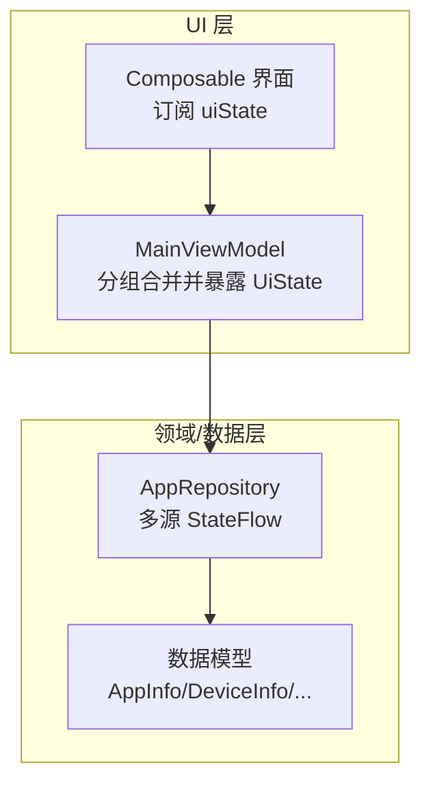
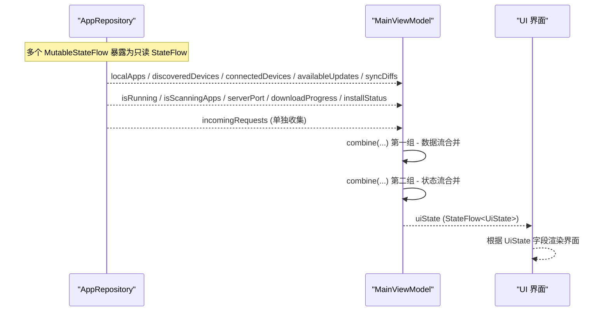
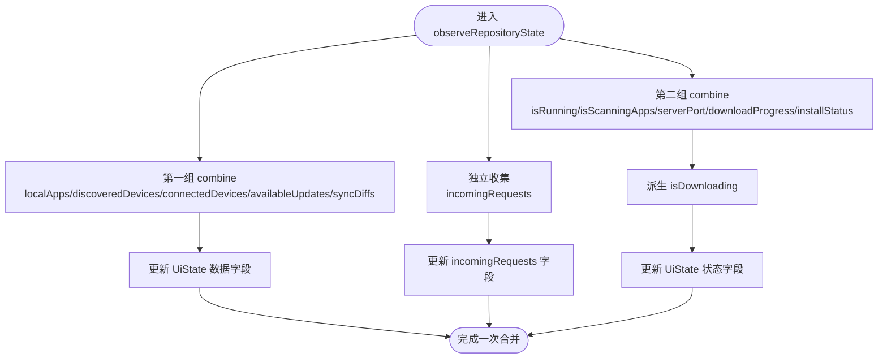
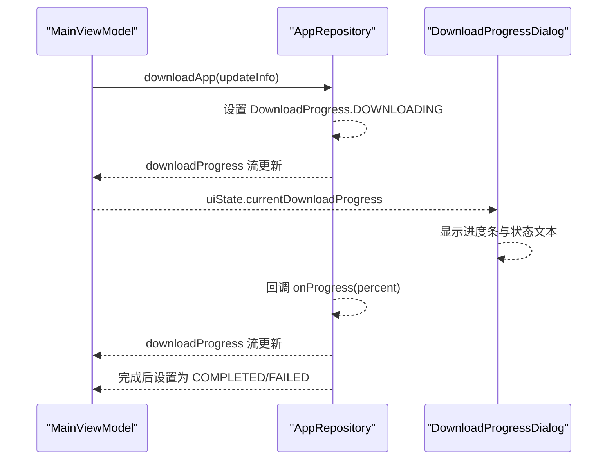
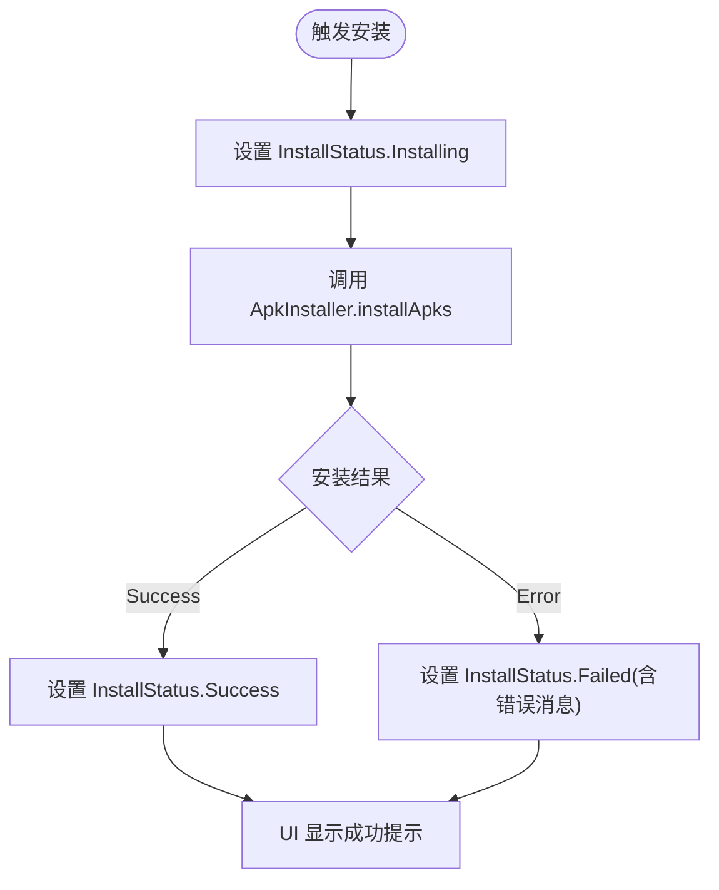
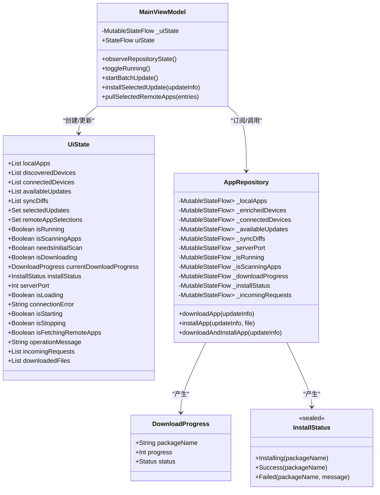
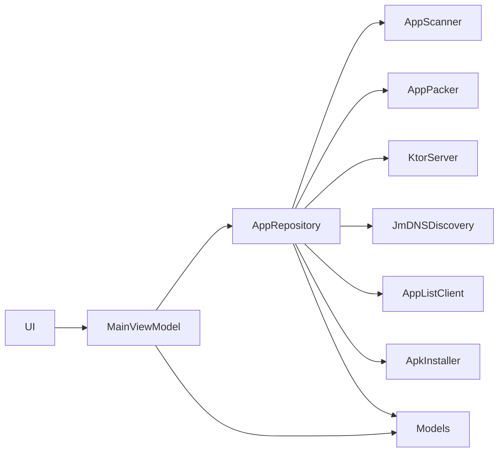

# 状态管理

<cite>
**本文引用的文件**
- [MainViewModel.kt](file://app/src/main/java/com/lansync/app/ui/viewmodel/MainViewModel.kt)
- [AppRepository.kt](file://app/src/main/java/com/lansync/app/data/repository/AppRepository.kt)
- [Models.kt](file://app/src/main/java/com/lansync/app/data/model/Models.kt)
- [DownloadProgressDialog.kt](file://app/src/main/java/com/lansync/app/ui/components/DownloadProgressDialog.kt)
</cite>

## 更新摘要
**所做更改**
- 更新了 observeRepositoryState 方法的分组合并策略，从单一 combine 操作拆分为两个独立的 combine 操作
- 解决了 Kotlin Flow 的 5 参数限制约束问题
- 优化了 incomingRequests 的处理方式，使用单独的 collect 操作
- 增强了状态管理的可维护性和性能

## 目录
1. [简介](#简介)
2. [项目结构](#项目结构)
3. [核心组件](#核心组件)
4. [架构总览](#架构总览)
5. [详细组件分析](#详细组件分析)
6. [依赖关系分析](#依赖关系分析)
7. [性能考量](#性能考量)
8. [故障排查指南](#故障排查指南)
9. [结论](#结论)
10. [附录](#附录)

## 简介
本文件聚焦 LanSync 应用的状态管理，围绕 UiState 数据类、StateFlow 的响应式使用、以及 observeRepositoryState 如何将 Repository 的多源状态组合并同步到 UI。文档还覆盖批量更新、下载进度与安装状态等复杂场景的处理方式，并提供最佳实践建议与可视化图示，帮助读者快速理解与扩展该状态体系。

## 项目结构
LanSync 的状态管理采用"视图模型 + 仓库"的分层模式：
- ViewModel（MainViewModel）负责聚合 UI 状态（UiState），并通过 StateFlow 暴露给 UI 层订阅。
- Repository（AppRepository）封装业务逻辑与外部交互，内部维护多个 MutableStateFlow，对外暴露只读的 StateFlow。
- 数据模型（Models.kt）定义 AppInfo、DeviceInfo、UpdateInfo、SyncDiff、IncomingConnectRequest 等核心数据结构。
- UI 组件通过收集 MainViewModel 的 uiState 进行渲染，并根据下载/安装状态展示相应反馈。



**图表来源**
- [MainViewModel.kt:22-56](file://app/src/main/java/com/lansync/app/ui/viewmodel/MainViewModel.kt#L22-L56)
- [AppRepository.kt:53-79](file://app/src/main/java/com/lansync/app/data/repository/AppRepository.kt#L53-L79)
- [Models.kt:5-67](file://app/src/main/java/com/lansync/app/data/model/Models.kt#L5-L67)

**章节来源**
- [MainViewModel.kt:22-56](file://app/src/main/java/com/lansync/app/ui/viewmodel/MainViewModel.kt#L22-L56)
- [AppRepository.kt:53-79](file://app/src/main/java/com/lansync/app/data/repository/AppRepository.kt#L53-L79)
- [Models.kt:5-67](file://app/src/main/java/com/lansync/app/data/model/Models.kt#L5-L67)

## 核心组件
- UiState：描述当前 UI 所需的全部状态字段，包括本地应用列表、设备发现/连接状态、可用更新、同步差异、选择集合、运行/扫描/下载/安装标志位、服务器端口、错误消息、操作提示、待处理请求、已下载文件等。
- MainViewModel：持有 Repository 实例，初始化时启动 observeRepositoryState 和 autoStart；提供 UI 操作入口（如切换服务、连接设备、批量更新、拉取远程应用等）。
- AppRepository：以多个 MutableStateFlow 维护业务状态，对外暴露 StateFlow；实现设备发现、心跳保活、连接管理、应用列表获取与缓存、更新检测、下载与安装流程等。
- 数据模型：集中定义跨层共享的数据结构与枚举，确保类型安全与一致性。

**章节来源**
- [MainViewModel.kt:22-45](file://app/src/main/java/com/lansync/app/ui/viewmodel/MainViewModel.kt#L22-L45)
- [AppRepository.kt:53-79](file://app/src/main/java/com/lansync/app/data/repository/AppRepository.kt#L53-L79)
- [Models.kt:5-67](file://app/src/main/java/com/lansync/app/data/model/Models.kt#L5-L67)

## 架构总览
下图展示了从 Repository 多源 StateFlow 到 ViewModel 的分组合并与同步，再到 UI 订阅的完整链路。



**图表来源**
- [MainViewModel.kt:84-128](file://app/src/main/java/com/lansync/app/ui/viewmodel/MainViewModel.kt#L84-L128)
- [AppRepository.kt:53-79](file://app/src/main/java/com/lansync/app/data/repository/AppRepository.kt#L53-L79)

**章节来源**
- [MainViewModel.kt:84-128](file://app/src/main/java/com/lansync/app/ui/viewmodel/MainViewModel.kt#L84-L128)
- [AppRepository.kt:53-79](file://app/src/main/java/com/lansync/app/data/repository/AppRepository.kt#L53-L79)

## 详细组件分析

### UiState 数据类设计
UiState 是 UI 层的单一状态载体，所有需要展示的字段均在此声明，便于集中管理与不可变更新。关键字段说明如下：
- 数据列表：localApps、discoveredDevices、connectedDevices、availableUpdates、syncDiffs、incomingRequests、downloadedFiles
- 选择集合：selectedUpdates、remoteAppSelections
- 运行与扫描：isRunning、isScanningApps、needsInitialScan
- 下载与安装：isDownloading、currentDownloadProgress、installStatus
- 服务控制：serverPort、isLoading、isStarting、isStopping、isFetchingRemoteApps
- 错误与提示：connectionError、operationMessage

这些字段全部来源于 Repository 的 StateFlow，并在 observeRepositoryState 中按功能分组合并，避免超过 Kotlin 参数限制，同时保持高内聚低耦合。

**章节来源**
- [MainViewModel.kt:22-45](file://app/src/main/java/com/lansync/app/ui/viewmodel/MainViewModel.kt#L22-L45)
- [MainViewModel.kt:84-128](file://app/src/main/java/com/lansync/app/ui/viewmodel/MainViewModel.kt#L84-L128)

### StateFlow 在响应式状态管理中的应用
- 使用 MutableStateFlow 在 Repository 内部维护可变状态，并通过 asStateFlow 暴露只读接口，保证线程安全与单向数据流。
- 在 ViewModel 中使用 combine 将多个 StateFlow 组合为新的流，按功能分组更新 UiState，避免一次性传入过多参数。
- **更新** 由于 Kotlin Flow 的 5 参数限制，observeRepositoryState 现在采用分组合并策略：
  - 第一组 combine：合并 5 个数据流（localApps、discoveredDevices、connectedDevices、availableUpdates、syncDiffs）
  - 第二组 combine：合并 5 个状态流（isRunning、isScanningApps、serverPort、downloadProgress、installStatus）
  - 独立收集：incomingRequests 使用单独的 collect 操作
- 典型用法：
  - 数据流合并：localApps、discoveredDevices、connectedDevices、availableUpdates、syncDiffs
  - 状态流合并：isRunning、isScanningApps、serverPort、downloadProgress、installStatus
  - 独立流收集：incomingRequests
- 优势：
  - 类型安全：combine 的参数与返回值类型由编译器校验
  - 可测试性：每个 StateFlow 可独立验证
  - 可扩展性：新增状态只需加入对应流并在合适的 combine 中映射
  - 性能优化：分组合并减少单次操作的复杂度

**章节来源**
- [MainViewModel.kt:84-128](file://app/src/main/java/com/lansync/app/ui/viewmodel/MainViewModel.kt#L84-L128)
- [AppRepository.kt:53-79](file://app/src/main/java/com/lansync/app/data/repository/AppRepository.kt#L53-L79)

### 状态更新机制：observeRepositoryState
observeRepositoryState 的核心职责是将 Repository 的多源状态同步到 UiState：

**更新** 现在采用分组合并策略解决 Kotlin Flow 的 5 参数限制：

- **第一组 combine**：将应用列表、设备发现/连接、可用更新、同步差异合并到 UiState 对应字段
  ```kotlin
  combine(
      repository.localApps,
      repository.discoveredDevices, 
      repository.connectedDevices,
      repository.availableUpdates,
      repository.syncDiffs
  ) { localApps, discoveredDevices, connectedDevices, availableUpdates, syncDiffs ->
      _uiState.value = _uiState.value.copy(
          localApps = localApps,
          discoveredDevices = discoveredDevices,
          connectedDevices = connectedDevices,
          availableUpdates = availableUpdates,
          syncDiffs = syncDiffs
      )
  }
  ```

- **独立收集**：incomingRequests 使用单独的 collect 操作，避免与其他流混合
  ```kotlin
  repository.incomingRequests.collect { incomingRequests ->
      _uiState.value = _uiState.value.copy(incomingRequests = incomingRequests)
  }
  ```

- **第二组 combine**：将运行/扫描标志、服务器端口、下载进度、安装状态合并到 UiState，并派生 isDownloading（当下载状态为 DOWNLOADING 时为 true）
  ```kotlin
  combine(
      repository.isRunning,
      repository.isScanningApps,
      repository.serverPort,
      repository.downloadProgress,
      repository.installStatus
  ) { isRunning, isScanningApps, serverPort, downloadProgress, installStatus ->
      _uiState.value = _uiState.value.copy(
          isRunning = isRunning,
          isScanningApps = isScanningApps,
          serverPort = serverPort,
          currentDownloadProgress = downloadProgress,
          isDownloading = downloadProgress?.status == AppRepository.DownloadProgress.Status.DOWNLOADING,
          installStatus = installStatus
      )
  }
  ```

- 使用 viewModelScope.launch 启动协程，确保生命周期安全
- 通过 copy 更新 UiState，保证不可变性与最小化变更



**图表来源**
- [MainViewModel.kt:84-128](file://app/src/main/java/com/lansync/app/ui/viewmodel/MainViewModel.kt#L84-L128)

**章节来源**
- [MainViewModel.kt:84-128](file://app/src/main/java/com/lansync/app/ui/viewmodel/MainViewModel.kt#L84-L128)

### 复杂状态场景处理

#### 批量更新状态
- 入口：startBatchUpdate
- 流程：
  - 读取 selectedUpdates 与 availableUpdates，筛选目标应用
  - 逐个调用 repository.downloadAndInstallApp，记录失败项
  - 汇总结果并设置 operationMessage 显示统计信息
- 关键点：
  - 使用 _lastDownloadedUpdateInfo 暂存最近下载的更新信息，便于后续安装或重试
  - 错误收集与用户提示分离，避免中断整个批处理

**章节来源**
- [MainViewModel.kt:245-278](file://app/src/main/java/com/lansync/app/ui/viewmodel/MainViewModel.kt#L245-L278)
- [AppRepository.kt:1113-1122](file://app/src/main/java/com/lansync/app/data/repository/AppRepository.kt#L1113-L1122)

#### 下载进度状态
- 来源：repository.downloadProgress（DownloadProgress）
- 行为：
  - 开始下载时设置 DOWNLOADING，progress 实时更新
  - 成功时设置为 COMPLETED，失败时设置为 FAILED
  - ViewModel 中根据 status 派生 isDownloading
- UI 展示：
  - DownloadProgressDialog 根据 progress.status 显示不同阶段（下载中、安装中、完成、失败）



**图表来源**
- [AppRepository.kt:1029-1075](file://app/src/main/java/com/lansync/app/data/repository/AppRepository.kt#L1029-L1075)
- [MainViewModel.kt:110-128](file://app/src/main/java/com/lansync/app/ui/viewmodel/MainViewModel.kt#L110-L128)
- [DownloadProgressDialog.kt:110-133](file://app/src/main/java/com/lansync/app/ui/components/DownloadProgressDialog.kt#L110-L133)

**章节来源**
- [AppRepository.kt:1029-1075](file://app/src/main/java/com/lansync/app/data/repository/AppRepository.kt#L1029-L1075)
- [MainViewModel.kt:110-128](file://app/src/main/java/com/lansync/app/ui/viewmodel/MainViewModel.kt#L110-L128)
- [DownloadProgressDialog.kt:110-133](file://app/src/main/java/com/lansync/app/ui/components/DownloadProgressDialog.kt#L110-L133)

#### 安装状态管理
- 来源：repository.installStatus（InstallStatus）
- 行为：
  - 开始安装时设置为 Installing
  - 成功时设置为 Success
  - 失败时设置为 Failed，并携带错误消息
- UI 展示：
  - InstallStatusSnackbar 根据状态显示安装中、成功或失败提示，支持自动消失与手动关闭



**图表来源**
- [AppRepository.kt:1094-1111](file://app/src/main/java/com/lansync/app/data/repository/AppRepository.kt#L1094-L1111)
- [DownloadProgressDialog.kt:137-217](file://app/src/main/java/com/lansync/app/ui/components/DownloadProgressDialog.kt#L137-L217)

**章节来源**
- [AppRepository.kt:1094-1111](file://app/src/main/java/com/lansync/app/data/repository/AppRepository.kt#L1094-L1111)
- [DownloadProgressDialog.kt:137-217](file://app/src/main/java/com/lansync/app/ui/components/DownloadProgressDialog.kt#L137-L217)

### 代码级类图（状态相关）


**图表来源**
- [MainViewModel.kt:22-56](file://app/src/main/java/com/lansync/app/ui/viewmodel/MainViewModel.kt#L22-L56)
- [AppRepository.kt:53-79](file://app/src/main/java/com/lansync/app/data/repository/AppRepository.kt#L53-L79)
- [AppRepository.kt:1155-1167](file://app/src/main/java/com/lansync/app/data/repository/AppRepository.kt#L1155-L1167)

**章节来源**
- [MainViewModel.kt:22-56](file://app/src/main/java/com/lansync/app/ui/viewmodel/MainViewModel.kt#L22-L56)
- [AppRepository.kt:53-79](file://app/src/main/java/com/lansync/app/data/repository/AppRepository.kt#L53-L79)
- [AppRepository.kt:1155-1167](file://app/src/main/java/com/lansync/app/data/repository/AppRepository.kt#L1155-L1167)

## 依赖关系分析
- ViewModel 依赖 Repository 暴露的 StateFlow，形成单向数据流
- Repository 内部依赖多个子系统（扫描器、打包器、服务器、发现器、客户端、安装器），但通过 StateFlow 抽象出稳定接口
- 数据模型被 Repository 与 ViewModel 共同引用，保证类型一致
- UI 仅依赖 ViewModel 的 uiState，不直接访问 Repository，降低耦合度



**图表来源**
- [AppRepository.kt:40-49](file://app/src/main/java/com/lansync/app/data/repository/AppRepository.kt#L40-L49)
- [Models.kt:5-67](file://app/src/main/java/com/lansync/app/data/model/Models.kt#L5-L67)

**章节来源**
- [AppRepository.kt:40-49](file://app/src/main/java/com/lansync/app/data/repository/AppRepository.kt#L40-L49)
- [Models.kt:5-67](file://app/src/main/java/com/lansync/app/data/model/Models.kt#L5-L67)

## 性能考量
- **更新** 使用 combine 分组合并，避免单次合并过多参数导致的可读性与维护性问题，解决 Kotlin Flow 的 5 参数限制
- 下载进度更新频率较高，建议在 UI 层做节流或去抖，避免频繁重组
- 批量操作应异步执行，避免阻塞主线程；错误收集与提示分离，提升用户体验
- 设备心跳与同步任务需合理设置间隔与超时，防止资源浪费
- 图标预加载与缓存减少重复 IO，提升列表渲染性能
- **优化** 将 incomingRequests 使用独立的 collect 操作，减少不必要的流组合开销

## 故障排查指南
- 连接错误：
  - 检查 connectDevice 是否返回 false 或抛出异常，查看 connectionError 字段
  - 确认服务端端口与服务是否启动成功（serverPort > 0）
- 下载失败：
  - 查看 currentDownloadProgress.status 是否为 FAILED，并检查错误消息
  - 确认网络连通性与远端设备可用性
- 安装失败：
  - 检查 installStatus 是否为 Failed，并查看错误消息
  - 确认下载文件是否存在（getDownloadedFile 返回非空）
- 批量更新结果：
  - 查看 operationMessage 中的统计信息与失败详情，定位问题应用
- **新增** 状态合并问题：
  - 检查 observeRepositoryState 中的分组合并是否正确
  - 确认 incomingRequests 的独立收集是否正常工作

**章节来源**
- [MainViewModel.kt:162-184](file://app/src/main/java/com/lansync/app/ui/viewmodel/MainViewModel.kt#L162-L184)
- [AppRepository.kt:1029-1075](file://app/src/main/java/com/lansync/app/data/repository/AppRepository.kt#L1029-L1075)
- [AppRepository.kt:1094-1111](file://app/src/main/java/com/lansync/app/data/repository/AppRepository.kt#L1094-L1111)

## 结论
LanSync 的状态管理以 UiState 为中心，结合 StateFlow 的响应式能力，实现了清晰、可维护且可扩展的状态流。**更新** 通过 observeRepositoryState 的分组合并策略，有效解决了 Kotlin Flow 的 5 参数限制问题，将原本单一的六流合并操作拆分为两个五流合并和一个独立收集操作，提升了代码的可读性和可维护性。这种设计妥善处理了批量更新、下载进度与安装状态等复杂场景，遵循单向数据流与不可变更新原则，有助于提升稳定性与可测试性。

## 附录

### 状态订阅、更新与组合的最佳实践
- 订阅：
  - 在 Composable 中收集 vm.uiState，避免在 init 中重复订阅
  - 使用 LaunchedEffect 监听关键状态变化（如 installStatus）
- 更新：
  - 使用 copy 更新 UiState，确保不可变性与最小化变更
  - 将耗时操作放入 viewModelScope 或 Repository 的协程中
- 组合：
  - **更新** 使用 combine 将相关 StateFlow 分组合并，每组不超过 5 个流，提高可读性与可维护性
  - 对于超过 5 个流的场景，考虑拆分多个 combine 操作或使用独立的 collect 操作
  - 派生状态（如 isDownloading）应在 ViewModel 中计算，避免在 UI 层重复逻辑

**章节来源**
- [MainViewModel.kt:84-128](file://app/src/main/java/com/lansync/app/ui/viewmodel/MainViewModel.kt#L84-L128)
- [AppRepository.kt:53-79](file://app/src/main/java/com/lansync/app/data/repository/AppRepository.kt#L53-L79)