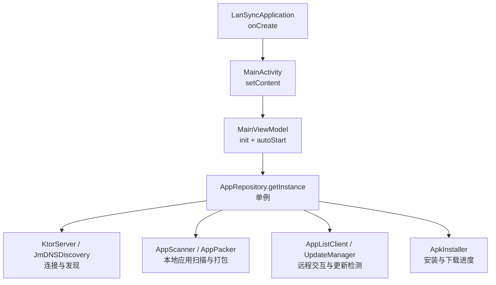
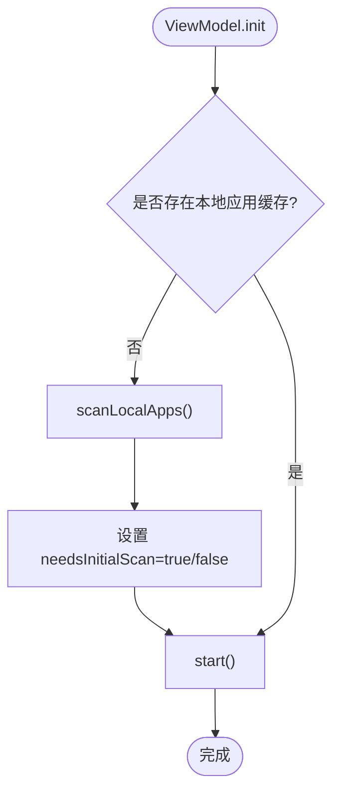
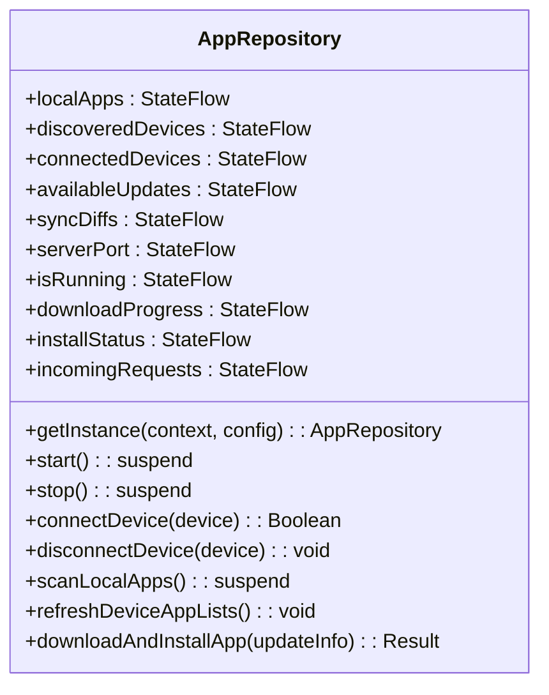
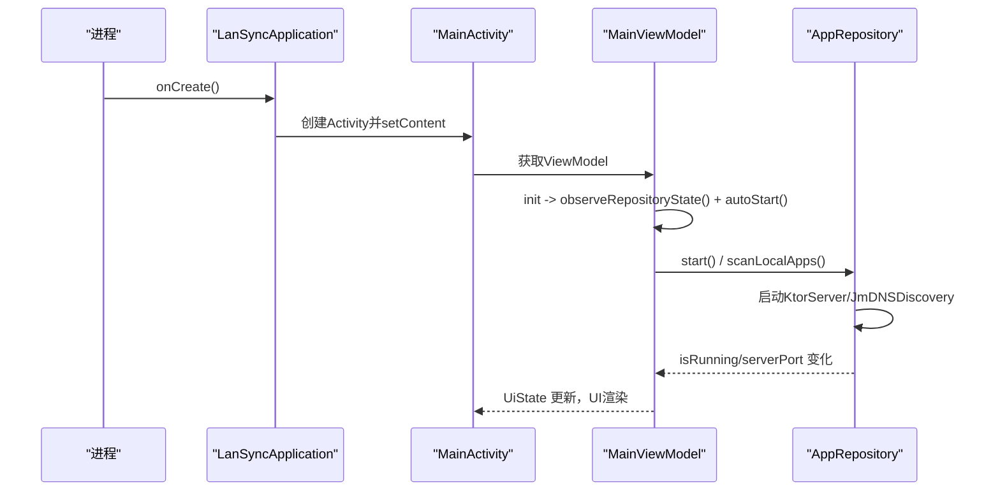
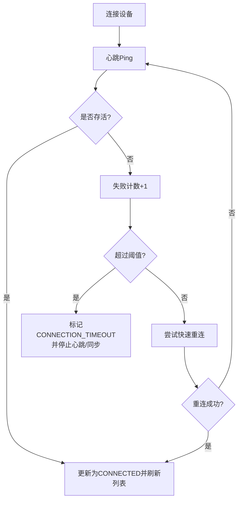
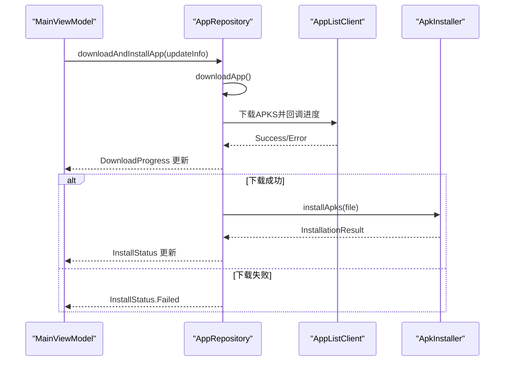
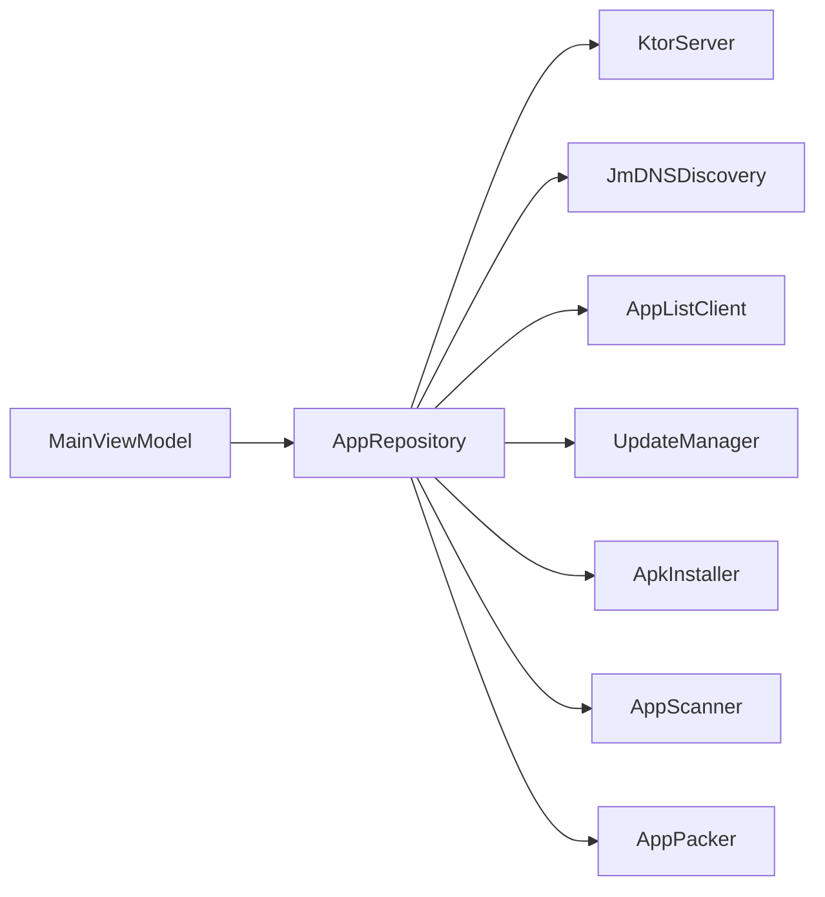

# 生命周期管理

<cite>
**本文引用的文件**
- [MainViewModel.kt](file://app/src/main/java/com/lansync/app/ui/viewmodel/MainViewModel.kt)
- [AppRepository.kt](file://app/src/main/java/com/lansync/app/data/repository/AppRepository.kt)
- [MainActivity.kt](file://app/src/main/java/com/lansync/app/MainActivity.kt)
- [LanSyncApplication.kt](file://app/src/main/java/com/lansync/app/LanSyncApplication.kt)
</cite>

## 目录
1. [简介](#简介)
2. [项目结构](#项目结构)
3. [核心组件](#核心组件)
4. [架构总览](#架构总览)
5. [详细组件分析](#详细组件分析)
6. [依赖关系分析](#依赖关系分析)
7. [性能考量](#性能考量)
8. [故障排查指南](#故障排查指南)
9. [结论](#结论)
10. [附录：最佳实践与边界处理](#附录：最佳实践与边界处理)

## 简介
本文件聚焦 LanSync 应用的生命周期管理，围绕以下关键点展开：
- AndroidViewModel 的 init 块初始化与自动启动机制
- viewModelScope 协程作用域在异步任务、取消和资源管理中的使用
- 应用启动流程：autoStart 的执行逻辑、初始扫描与服务启动的协调
- Repository 单例模式实现与全局状态管理
- 生命周期相关最佳实践：资源清理、任务取消、内存泄漏防护
- 配置变更、进程重启等边界情况的处理方式

## 项目结构
从生命周期视角看，关键路径如下：
- 应用进程启动：LanSyncApplication.onCreate 初始化日志
- Activity 入口：MainActivity 创建 Compose UI，并通过 viewModel() 获取 MainViewModel
- ViewModel 层：MainViewModel 在 init 中订阅 Repository 状态并触发 autoStart
- 数据层：AppRepository 提供单例访问，封装网络、服务、发现、安装等能力，并通过 StateFlow 暴露状态



图表来源
- [LanSyncApplication.kt:6-10](file://app/src/main/java/com/lansync/app/LanSyncApplication.kt#L6-L10)
- [MainActivity.kt:26-35](file://app/src/main/java/com/lansync/app/MainActivity.kt#L26-L35)
- [MainViewModel.kt:47-82](file://app/src/main/java/com/lansync/app/ui/viewmodel/MainViewModel.kt#L47-L82)
- [AppRepository.kt:40-51](file://app/src/main/java/com/lansync/app/data/repository/AppRepository.kt#L40-L51)

章节来源
- [LanSyncApplication.kt:6-10](file://app/src/main/java/com/lansync/app/LanSyncApplication.kt#L6-L10)
- [MainActivity.kt:26-35](file://app/src/main/java/com/lansync/app/MainActivity.kt#L26-L35)

## 核心组件
- MainViewModel：负责 UI 状态聚合、用户操作转发、基于 viewModelScope 的异步编排
- AppRepository：单例化的业务中枢，维护设备连接、心跳、同步、下载、安装等状态，通过 StateFlow 暴露
- MainActivity：Compose 界面入口，消费 MainViewModel 的状态流
- LanSyncApplication：应用级初始化（如日志）

章节来源
- [MainViewModel.kt:47-124](file://app/src/main/java/com/lansync/app/ui/viewmodel/MainViewModel.kt#L47-L124)
- [AppRepository.kt:40-80](file://app/src/main/java/com/lansync/app/data/repository/AppRepository.kt#L40-L80)
- [MainActivity.kt:26-35](file://app/src/main/java/com/lansync/app/MainActivity.kt#L26-L35)
- [LanSyncApplication.kt:6-10](file://app/src/main/java/com/lansync/app/LanSyncApplication.kt#L6-L10)

## 架构总览
下图展示了从应用启动到 ViewModel 自动启动、再到 Repository 启动服务与发现设备的完整时序。

```mermaid
sequenceDiagram
participant App as "LanSyncApplication"
participant Act as "MainActivity"
participant VM as "MainViewModel"
participant Repo as "AppRepository"
participant Srv as "KtorServer"
participant Disc as "JmDNSDiscovery"
App->>Act : 进程启动后创建Activity
Act->>VM : 通过viewModel()获取实例
VM->>VM : init { observeRepositoryState(); autoStart() }
alt 无本地缓存
VM->>Repo : scanLocalApps()
Repo-->>VM : 更新UI状态(扫描中/完成)
VM->>Repo : start()
else 有本地缓存
VM->>Repo : start()
VM->>Repo : scanLocalApps()
end
Repo->>Srv : 设置回调并start()
Repo->>Disc : startDiscovery(port)
Repo-->>VM : isRunning/serverPort 变化
```

图表来源
- [MainViewModel.kt:60-82](file://app/src/main/java/com/lansync/app/ui/viewmodel/MainViewModel.kt#L60-L82)
- [AppRepository.kt:965-987](file://app/src/main/java/com/lansync/app/data/repository/AppRepository.kt#L965-L987)

## 详细组件分析

### AndroidViewModel 生命周期与自动启动
- 生命周期特性
  - AndroidViewModel 持有 Application 引用，适合进行需要 Application 上下文的初始化
  - init 块在 ViewModel 构造时执行，用于建立状态订阅和触发自动启动
- 自动启动逻辑
  - 若不存在本地应用缓存，则先执行一次本地应用扫描，再启动服务；否则直接启动服务并并行扫描
  - 所有耗时操作均通过 viewModelScope.launch 启动，确保随 ViewModel 销毁而取消



图表来源
- [MainViewModel.kt:60-82](file://app/src/main/java/com/lansync/app/ui/viewmodel/MainViewModel.kt#L60-L82)

章节来源
- [MainViewModel.kt:47-82](file://app/src/main/java/com/lansync/app/ui/viewmodel/MainViewModel.kt#L47-L82)

### viewModelScope 的使用与资源管理
- 作用域绑定
  - 所有协程通过 viewModelScope.launch 启动，生命周期与 ViewModel 一致，避免内存泄漏
- 典型用法
  - 状态订阅：combine 多个 StateFlow 合并为 UiState
  - 用户操作：连接设备、刷新列表、批量更新等
  - 错误处理：try/finally 保证 UI 状态复位（如 isStarting/isStopping）
- 资源管理建议
  - 长任务应检查 isActive 或在 finally 中清理
  - 对并发任务使用 SupervisorJob 或独立 Job 集合以便统一取消

章节来源
- [MainViewModel.kt:84-124](file://app/src/main/java/com/lansync/app/ui/viewmodel/MainViewModel.kt#L84-L124)
- [MainViewModel.kt:126-156](file://app/src/main/java/com/lansync/app/ui/viewmodel/MainViewModel.kt#L126-L156)

### Repository 单例模式与全局状态
- 单例实现
  - 通过 companion object 的 getInstance(context, config) 返回唯一实例，内部使用 @Volatile 变量与 synchronized 保证线程安全
- 全局状态
  - 使用 MutableStateFlow 暴露本地应用列表、设备发现/连接状态、可用更新、同步差异、下载进度、安装状态、传入请求等
  - 通过 combine 在 Repository 内部组合状态，驱动 UI 更新
- 生命周期职责
  - start()/stop() 负责服务器与发现服务的启停
  - 心跳与同步调度使用独立的 Job 集合管理，支持按设备维度取消



图表来源
- [AppRepository.kt:40-80](file://app/src/main/java/com/lansync/app/data/repository/AppRepository.kt#L40-L80)
- [AppRepository.kt:1169-1179](file://app/src/main/java/com/lansync/app/data/repository/AppRepository.kt#L1169-L1179)

章节来源
- [AppRepository.kt:40-80](file://app/src/main/java/com/lansync/app/data/repository/AppRepository.kt#L40-L80)
- [AppRepository.kt:1169-1179](file://app/src/main/java/com/lansync/app/data/repository/AppRepository.kt#L1169-L1179)

### 应用启动流程详解
- 应用进程启动
  - LanSyncApplication.onCreate 初始化日志系统
- Activity 与 ViewModel
  - MainActivity.setContent 构建 UI，并通过 viewModel() 获取 MainViewModel
- ViewModel 自动启动
  - 根据是否有本地缓存决定先扫描还是直接启动服务
  - 启动服务后，Repository 会启动 KtorServer 与 JmDNSDiscovery，并设置回调以处理连接、刷新等事件
- 状态同步
  - Repository 将运行状态、端口、扫描状态等通过 StateFlow 暴露，ViewModel 将其映射到 UiState，UI 实时响应



图表来源
- [LanSyncApplication.kt:6-10](file://app/src/main/java/com/lansync/app/LanSyncApplication.kt#L6-L10)
- [MainActivity.kt:26-35](file://app/src/main/java/com/lansync/app/MainActivity.kt#L26-L35)
- [MainViewModel.kt:60-82](file://app/src/main/java/com/lansync/app/ui/viewmodel/MainViewModel.kt#L60-L82)
- [AppRepository.kt:965-987](file://app/src/main/java/com/lansync/app/data/repository/AppRepository.kt#L965-L987)

章节来源
- [LanSyncApplication.kt:6-10](file://app/src/main/java/com/lansync/app/LanSyncApplication.kt#L6-L10)
- [MainActivity.kt:26-35](file://app/src/main/java/com/lansync/app/MainActivity.kt#L26-L35)
- [MainViewModel.kt:60-82](file://app/src/main/java/com/lansync/app/ui/viewmodel/MainViewModel.kt#L60-L82)
- [AppRepository.kt:965-987](file://app/src/main/java/com/lansync/app/data/repository/AppRepository.kt#L965-L987)

### 连接与心跳的生命周期管理
- 连接建立
  - connectDevice 发送连接请求并轮询结果，成功后加入已连接列表，启动心跳与定时同步
- 心跳与重连
  - 周期性 ping，失败计数达到阈值进入重连或超时断开
  - 快速重连尝试恢复连接，成功则继续拉取应用列表
- 断开处理
  - 主动断开或远端通知断开时，停止心跳与同步，保留应用列表快照，更新设备状态



图表来源
- [AppRepository.kt:134-172](file://app/src/main/java/com/lansync/app/data/repository/AppRepository.kt#L134-L172)
- [AppRepository.kt:179-249](file://app/src/main/java/com/lansync/app/data/repository/AppRepository.kt#L179-L249)
- [AppRepository.kt:251-282](file://app/src/main/java/com/lansync/app/data/repository/AppRepository.kt#L251-L282)

章节来源
- [AppRepository.kt:134-172](file://app/src/main/java/com/lansync/app/data/repository/AppRepository.kt#L134-L172)
- [AppRepository.kt:179-249](file://app/src/main/java/com/lansync/app/data/repository/AppRepository.kt#L179-L249)
- [AppRepository.kt:251-282](file://app/src/main/java/com/lansync/app/data/repository/AppRepository.kt#L251-L282)

### 下载与安装的生命周期
- 下载
  - downloadApp 更新 DownloadProgress 状态，回调进度，完成后标记 COMPLETED
- 安装
  - installApp 调用 ApkInstaller，更新 InstallStatus 为 Installing/Success/Failure
- 一键流程
  - downloadAndInstallApp 串联下载与安装，异常时回退到失败状态



图表来源
- [AppRepository.kt:1029-1122](file://app/src/main/java/com/lansync/app/data/repository/AppRepository.kt#L1029-L1122)

章节来源
- [AppRepository.kt:1029-1122](file://app/src/main/java/com/lansync/app/data/repository/AppRepository.kt#L1029-L1122)

## 依赖关系分析
- 组件耦合
  - MainViewModel 依赖 AppRepository 提供的 StateFlow 与业务方法
  - AppRepository 依赖 KtorServer、JmDNSDiscovery、AppListClient、UpdateManager、ApkInstaller、AppScanner、AppPacker
- 外部集成点
  - 网络通信：AppListClient 负责与远端设备交互
  - 服务监听：KtorServer 提供本地 HTTP 接口
  - 设备发现：JmDNSDiscovery 广播与发现局域网设备
  - 安装器：ApkInstaller 处理 APK/APKS 安装
- 循环依赖
  - 未发现循环依赖；各模块职责清晰，通过 Repository 聚合



图表来源
- [MainViewModel.kt:47-56](file://app/src/main/java/com/lansync/app/ui/viewmodel/MainViewModel.kt#L47-L56)
- [AppRepository.kt:40-51](file://app/src/main/java/com/lansync/app/data/repository/AppRepository.kt#L40-L51)

章节来源
- [MainViewModel.kt:47-56](file://app/src/main/java/com/lansync/app/ui/viewmodel/MainViewModel.kt#L47-L56)
- [AppRepository.kt:40-51](file://app/src/main/java/com/lansync/app/data/repository/AppRepository.kt#L40-L51)

## 性能考量
- 协程与调度
  - 使用 Dispatchers.IO 执行 IO 密集任务（扫描、网络、文件），避免阻塞主线程
  - 心跳与同步使用 while(isActive) 循环，配合 delay 控制频率
- 状态更新
  - 使用 StateFlow 与 combine 减少重复计算，仅在数据变化时更新 UI
- 缓存与预加载
  - 本地应用列表持久化缓存，新应用图标批量预加载，提升首屏体验
- 资源释放
  - stop() 中集中取消所有心跳与同步任务，关闭服务与发现，清空状态，防止内存泄漏

[本节为通用指导，不直接分析具体文件]

## 故障排查指南
- 常见问题定位
  - 连接失败：查看 connectDevice 的错误日志与状态流转，确认目标设备可访问与端口正确
  - 心跳不稳定：关注失败计数与重连逻辑，必要时调整阈值
  - 下载/安装失败：检查 DownloadProgress 与 InstallStatus，确认文件存在与权限
- 日志与调试
  - FileLogger 贯穿各模块，便于追踪关键路径
  - 建议在关键分支添加断点或日志输出，验证状态机转换

章节来源
- [AppRepository.kt:386-484](file://app/src/main/java/com/lansync/app/data/repository/AppRepository.kt#L386-L484)
- [AppRepository.kt:1029-1122](file://app/src/main/java/com/lansync/app/data/repository/AppRepository.kt#L1029-L1122)

## 结论
- MainViewModel 通过 init 块完成状态订阅与自动启动，结合 viewModelScope 确保生命周期安全
- AppRepository 作为单例中枢，统一管理设备连接、心跳、同步、下载与安装，并通过 StateFlow 暴露状态
- 启动流程清晰：应用初始化 -> Activity 构建 -> ViewModel 自动启动 -> Repository 启动服务与发现
- 通过合理的协程管理与资源释放，有效避免内存泄漏与资源泄露，提升稳定性

[本节为总结性内容，不直接分析具体文件]

## 附录：最佳实践与边界处理

### 生命周期相关的最佳实践
- 资源清理
  - 在 stop() 中集中取消所有后台任务，关闭服务与发现，清空状态
  - 在 finally 块中重置 UI 状态（如 isStarting/isStopping）
- 任务取消
  - 使用 viewModelScope 启动的任务随 ViewModel 销毁自动取消
  - Repository 内使用 Job 集合管理心跳与同步，支持按设备维度取消
- 内存泄漏防护
  - 避免在 Repository 中持有 Activity/Fragment 引用
  - 使用 ApplicationContext 而非 Context，防止泄漏
  - 及时移除监听与回调，避免悬挂引用

章节来源
- [AppRepository.kt:990-1023](file://app/src/main/java/com/lansync/app/data/repository/AppRepository.kt#L990-L1023)
- [MainViewModel.kt:126-156](file://app/src/main/java/com/lansync/app/ui/viewmodel/MainViewModel.kt#L126-L156)

### 配置变更与进程重启的处理
- 配置变更
  - ViewModel 由框架重建，但 Repository 为单例，状态保持；UI 通过 StateFlow 重新订阅即可恢复显示
- 进程重启
  - 本地应用列表持久化缓存，重启后可快速恢复
  - 服务与发现需重新启动；可通过 autoStart 逻辑判断是否需要重新扫描与启动

章节来源
- [AppRepository.kt:920-946](file://app/src/main/java/com/lansync/app/data/repository/AppRepository.kt#L920-L946)
- [MainViewModel.kt:60-82](file://app/src/main/java/com/lansync/app/ui/viewmodel/MainViewModel.kt#L60-L82)