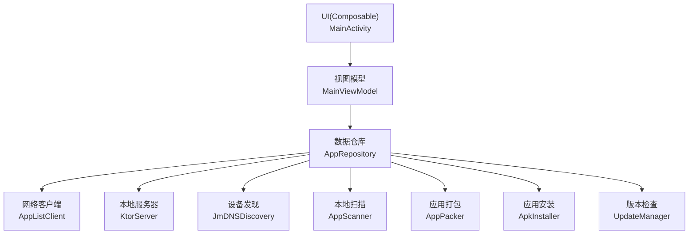
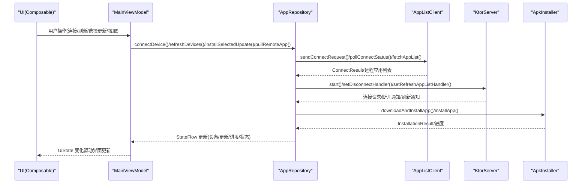
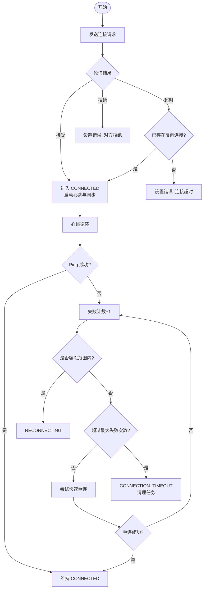
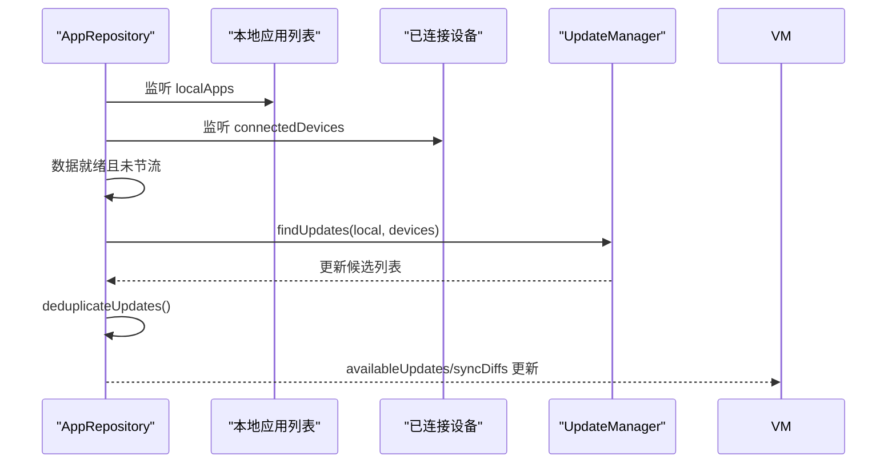
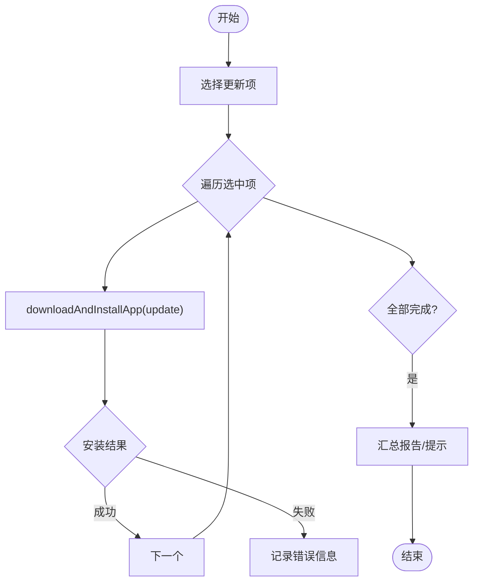
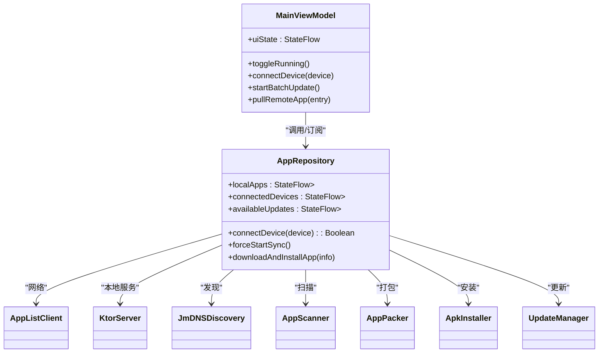

# 组件通信

<cite>
**本文引用的文件**
- [MainViewModel.kt](file://app/src/main/java/com/lansync/app/ui/viewmodel/MainViewModel.kt)
- [AppRepository.kt](file://app/src/main/java/com/lansync/app/data/repository/AppRepository.kt)
- [MainActivity.kt](file://app/src/main/java/com/lansync/app/MainActivity.kt)
- [LanSyncApplication.kt](file://app/src/main/java/com/lansync/app/LanSyncApplication.kt)
- [Models.kt](file://app/src/main/java/com/lansync/app/data/model/Models.kt)
- [AppConfig.kt](file://app/src/main/java/com/lansync/app/data/AppConfig.kt)
</cite>

## 目录
1. [简介](#简介)
2. [项目结构](#项目结构)
3. [核心组件](#核心组件)
4. [架构总览](#架构总览)
5. [详细组件分析](#详细组件分析)
6. [依赖关系分析](#依赖关系分析)
7. [性能考量](#性能考量)
8. [故障排查指南](#故障排查指南)
9. [结论](#结论)
10. [附录](#附录)

## 简介
本文件聚焦于 LanSync 应用中“组件通信”的设计与实现，重点阐述 MainViewModel 与 AppRepository 之间的单向数据流、事件驱动架构以及复杂业务流程编排（批量更新、设备连接管理等）。文档通过架构图、时序图与流程图，结合具体代码路径引用，帮助读者理解：
- ViewModel 如何通过 Repository 暴露的接口协调业务逻辑（设备管理、应用同步、文件操作等）
- 事件如何从 UI 触发，经 ViewModel 转发到 Repository，再由底层服务（网络、安装器、扫描器等）异步执行并回传状态
- 错误状态如何传播至 UI，保证可观测性与可恢复性
- 批量更新、设备连接管理等复杂流程的编排方式与最佳实践

## 项目结构
LanSync 采用分层架构：UI 层（Compose + MainActivity）、视图模型层（MainViewModel）、数据仓库层（AppRepository），以及一系列领域能力模块（发现、连接、服务器、打包、安装、更新、扫描等）。数据在 UI -> ViewModel -> Repository 之间单向流动，状态以 StateFlow 形式向上推送。

图表来源
- [MainActivity.kt:39-106](file://app/src/main/java/com/lansync/app/MainActivity.kt#L39-L106)
- [MainViewModel.kt:47-124](file://app/src/main/java/com/lansync/app/ui/viewmodel/MainViewModel.kt#L47-L124)
- [AppRepository.kt:40-79](file://app/src/main/java/com/lansync/app/data/repository/AppRepository.kt#L40-L79)

章节来源
- [MainActivity.kt:39-106](file://app/src/main/java/com/lansync/app/MainActivity.kt#L39-L106)
- [MainViewModel.kt:47-124](file://app/src/main/java/com/lansync/app/ui/viewmodel/MainViewModel.kt#L47-L124)
- [AppRepository.kt:40-79](file://app/src/main/java/com/lansync/app/data/repository/AppRepository.kt#L40-L79)

## 核心组件
- MainViewModel：持有 UiState，订阅 Repository 的状态流，将用户操作转换为对 Repository 的方法调用，并在 try/finally 中设置启动/停止等临时 UI 状态。
- AppRepository：封装所有领域能力（设备发现、连接、心跳、同步、更新计算、下载与安装、文件管理等），通过多个 StateFlow 暴露状态，内部使用协程与 SupervisorJob 管理并发任务。
- Models：定义跨层共享的数据结构（如 DeviceInfo、ConnectionState、UpdateInfo、SyncDiff、IncomingConnectRequest 等）。
- AppConfig：集中配置心跳间隔、重试次数、超时等参数，便于统一调优。

章节来源
- [MainViewModel.kt:22-45](file://app/src/main/java/com/lansync/app/ui/viewmodel/MainViewModel.kt#L22-L45)
- [AppRepository.kt:40-79](file://app/src/main/java/com/lansync/app/data/repository/AppRepository.kt#L40-L79)
- [Models.kt:19-67](file://app/src/main/java/com/lansync/app/data/model/Models.kt#L19-L67)
- [AppConfig.kt:3-13](file://app/src/main/java/com/lansync/app/data/AppConfig.kt#L3-L13)

## 架构总览
下图展示了从 UI 到 Repository 的单向数据流与事件处理链路，包括设备连接、远程应用拉取、批量更新等关键路径。

图表来源
- [MainViewModel.kt:126-180](file://app/src/main/java/com/lansync/app/ui/viewmodel/MainViewModel.kt#L126-L180)
- [AppRepository.kt:386-484](file://app/src/main/java/com/lansync/app/data/repository/AppRepository.kt#L386-L484)
- [AppRepository.kt:624-647](file://app/src/main/java/com/lansync/app/data/repository/AppRepository.kt#L624-L647)
- [AppRepository.kt:720-759](file://app/src/main/java/com/lansync/app/data/repository/AppRepository.kt#L720-L759)

## 详细组件分析

### MainViewModel 与 AppRepository 的通信模式
- 单向数据流：UiState 由 ViewModel 维护，但实际数据来源于 Repository 暴露的多个 StateFlow。ViewModel 通过 combine 聚合这些流，按功能分组更新 UiState，避免超过 Kotlin 参数限制。
- 事件驱动：用户交互触发 ViewModel 方法，方法内通过 viewModelScope.launch 发起异步调用，调用 Repository 的对应方法；Repository 内部完成网络、安装、扫描等操作后，通过 StateFlow 回推状态，最终反映到 UI。
- 错误传播：连接失败、异常等错误被捕获并写入 UiState.connectionError，UI 展示后可由 dismissConnectionError 清除。
- 生命周期与资源：Repository 内部使用 SupervisorJob + IO 调度器，确保子任务失败不影响整体；心跳、同步任务按设备维度独立管理，支持取消与迁移。

章节来源
- [MainViewModel.kt:84-124](file://app/src/main/java/com/lansync/app/ui/viewmodel/MainViewModel.kt#L84-L124)
- [MainViewModel.kt:126-180](file://app/src/main/java/com/lansync/app/ui/viewmodel/MainViewModel.kt#L126-L180)
- [AppRepository.kt:51-79](file://app/src/main/java/com/lansync/app/data/repository/AppRepository.kt#L51-L79)

### 设备管理与连接流程
- 连接发起：ViewModel.connectDevice 调用 Repository.connectDevice，后者发送连接请求、轮询结果，成功后进入 CONNECTED 状态，启动心跳与定时同步。
- 心跳与重连：Repository 为每个设备维护心跳 Job，周期性 ping；失败计数达到阈值时进入 RECONNECTING，超过最大失败次数则标记 CONNECTION_TIMEOUT 并清理任务。
- 端口迁移：当设备实例 ID 或显示键变化时，自动迁移连接状态与应用列表，保持用户体验连续性。
- 断开处理：支持远端主动断开的通知，清理心跳与同步任务，保留应用列表以便离线查看。

图表来源
- [AppRepository.kt:386-484](file://app/src/main/java/com/lansync/app/data/repository/AppRepository.kt#L386-L484)
- [AppRepository.kt:179-249](file://app/src/main/java/com/lansync/app/data/repository/AppRepository.kt#L179-L249)
- [AppRepository.kt:251-269](file://app/src/main/java/com/lansync/app/data/repository/AppRepository.kt#L251-L269)

章节来源
- [AppRepository.kt:386-484](file://app/src/main/java/com/lansync/app/data/repository/AppRepository.kt#L386-L484)
- [AppRepository.kt:179-249](file://app/src/main/java/com/lansync/app/data/repository/AppRepository.kt#L179-L249)
- [AppRepository.kt:251-269](file://app/src/main/java/com/lansync/app/data/repository/AppRepository.kt#L251-L269)

### 应用同步与更新计算
- 自动计算：当本地应用列表与已连接设备的远程应用列表就绪时，Repository 自动计算可用更新与同步差异，并通过 StateFlow 暴露给 ViewModel。
- 去重与节流：更新计算具备节流机制，避免频繁重算；同时支持去重，确保同一包名只出现一次更新项。
- 同步差异：根据本地与远程版本对比生成 SyncDiff，供 UI 展示差异类型（仅远程、仅本地、新版本等）。

图表来源
- [AppRepository.kt:761-796](file://app/src/main/java/com/lansync/app/data/repository/AppRepository.kt#L761-L796)

章节来源
- [AppRepository.kt:761-796](file://app/src/main/java/com/lansync/app/data/repository/AppRepository.kt#L761-L796)

### 批量更新与文件操作
- 批量更新：ViewModel.startBatchUpdate 遍历选中更新项，逐个调用 Repository.downloadAndInstallApp，收集错误并汇总提示；支持单个安装与上次下载的安装。
- 文件操作：提供下载文件列表加载、删除、安装等功能；安装前从文件名解析包名，确保与安装器一致。

图表来源
- [MainViewModel.kt:245-274](file://app/src/main/java/com/lansync/app/ui/viewmodel/MainViewModel.kt#L245-L274)
- [MainViewModel.kt:276-313](file://app/src/main/java/com/lansync/app/ui/viewmodel/MainViewModel.kt#L276-L313)

章节来源
- [MainViewModel.kt:245-274](file://app/src/main/java/com/lansync/app/ui/viewmodel/MainViewModel.kt#L245-L274)
- [MainViewModel.kt:276-313](file://app/src/main/java/com/lansync/app/ui/viewmodel/MainViewModel.kt#L276-L313)

### 事件驱动架构与回调处理
- 用户操作响应：UI 通过 Compose 状态绑定 ViewModel 方法，例如点击刷新、连接、安装等，均由 ViewModel 统一入口处理。
- 异步回调：Repository 内部使用协程与 Flow 进行异步处理，完成后通过 StateFlow 推送状态，ViewModel 合并后更新 UiState。
- 错误状态传播：连接错误、安装失败等错误写入 UiState 或 InstallStatus，UI 展示后可由用户操作清除。

章节来源
- [MainViewModel.kt:126-180](file://app/src/main/java/com/lansync/app/ui/viewmodel/MainViewModel.kt#L126-L180)
- [AppRepository.kt:486-554](file://app/src/main/java/com/lansync/app/data/repository/AppRepository.kt#L486-L554)

### 复杂业务流程编排
- 设备连接管理：包含请求发送、轮询、状态迁移、心跳、定时同步、快速重连、端口迁移、远端断开处理等，形成闭环。
- 批量更新编排：顺序执行下载与安装，收集错误并汇总，支持部分失败场景下的继续执行与最终报告。
- 自动启动与扫描：应用启动时根据本地缓存决定是否执行初始扫描，随后启动服务与扫描本地应用。

章节来源
- [AppRepository.kt:284-384](file://app/src/main/java/com/lansync/app/data/repository/AppRepository.kt#L284-L384)
- [MainViewModel.kt:60-82](file://app/src/main/java/com/lansync/app/ui/viewmodel/MainViewModel.kt#L60-L82)

## 依赖关系分析
- MainViewModel 依赖 AppRepository 提供的 StateFlow 与业务方法，不直接访问网络或文件系统。
- AppRepository 组合了多个领域组件：AppListClient（网络）、KtorServer（本地服务）、JmDNSDiscovery（设备发现）、AppScanner（本地扫描）、AppPacker（打包）、ApkInstaller（安装）、UpdateManager（更新检测）。
- 配置 AppConfig 控制心跳、重试、超时等行为，便于统一调优。

图表来源
- [MainViewModel.kt:47-124](file://app/src/main/java/com/lansync/app/ui/viewmodel/MainViewModel.kt#L47-L124)
- [AppRepository.kt:40-79](file://app/src/main/java/com/lansync/app/data/repository/AppRepository.kt#L40-L79)

章节来源
- [MainViewModel.kt:47-124](file://app/src/main/java/com/lansync/app/ui/viewmodel/MainViewModel.kt#L47-L124)
- [AppRepository.kt:40-79](file://app/src/main/java/com/lansync/app/data/repository/AppRepository.kt#L40-L79)

## 性能考量
- 状态合并优化：ViewModel 使用 combine 按功能分组合并多个 StateFlow，减少 UI 更新频率与复杂度。
- 节流与去重：更新计算具备节流与去重，避免频繁重算与重复条目。
- 并发与隔离：Repository 使用 SupervisorJob 与协程作用域，设备级心跳与同步任务独立管理，失败互不影响。
- 重试与容错：网络请求与列表获取具备重试与延迟策略，提升稳定性。
- 配置可调：心跳间隔、重试次数、超时等均可通过 AppConfig 调整，适配不同网络环境。

[本节为通用指导，无需特定文件引用]

## 故障排查指南
- 连接失败：检查 connectionError 与日志，确认目标设备是否响应；必要时尝试强制启动服务与刷新设备列表。
- 心跳不稳定：观察心跳失败计数与重连状态，调整 AppConfig 中的容忍度与最大失败次数。
- 批量更新部分失败：查看汇总错误信息，定位具体包名与错误原因；可单独重试失败项。
- 端口迁移：当设备实例或端口变化时，确认连接状态迁移是否正确，应用列表是否保留。

章节来源
- [MainViewModel.kt:162-180](file://app/src/main/java/com/lansync/app/ui/viewmodel/MainViewModel.kt#L162-L180)
- [AppRepository.kt:179-249](file://app/src/main/java/com/lansync/app/data/repository/AppRepository.kt#L179-L249)
- [AppRepository.kt:284-384](file://app/src/main/java/com/lansync/app/data/repository/AppRepository.kt#L284-L384)

## 结论
LanSync 通过 MainViewModel 与 AppRepository 的清晰分工与单向数据流，实现了高内聚、低耦合的组件通信。ViewModel 专注 UI 状态与用户操作，Repository 负责领域逻辑与外部集成，配合 StateFlow 与协程实现异步、可观测的事件驱动架构。该设计有效支撑了设备连接管理、应用同步、批量更新与文件操作等复杂业务流程，具备良好的可维护性与扩展性。

[本节为总结，无需特定文件引用]

## 附录
- 关键数据模型参考：DeviceInfo、ConnectionState、UpdateInfo、SyncDiff、IncomingConnectRequest 等，用于跨层传递与状态表达。
- 配置项参考：心跳间隔、同步间隔、重试次数、超时等，可通过 AppConfig.DEFAULT 或自定义配置调整。

章节来源
- [Models.kt:19-67](file://app/src/main/java/com/lansync/app/data/model/Models.kt#L19-L67)
- [AppConfig.kt:3-13](file://app/src/main/java/com/lansync/app/data/AppConfig.kt#L3-L13)