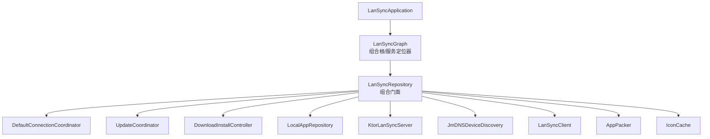
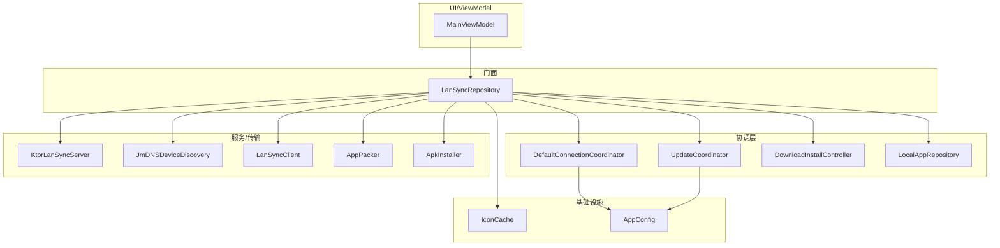
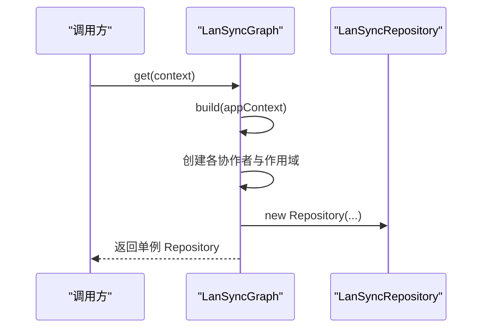
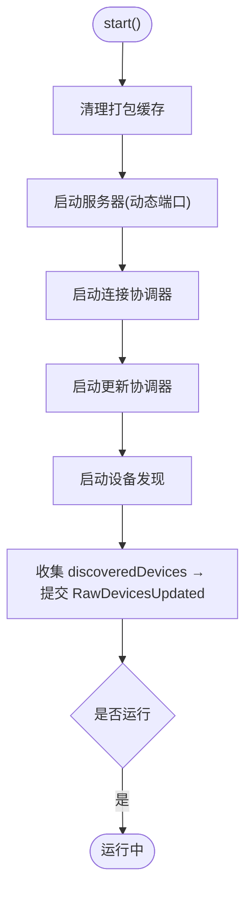
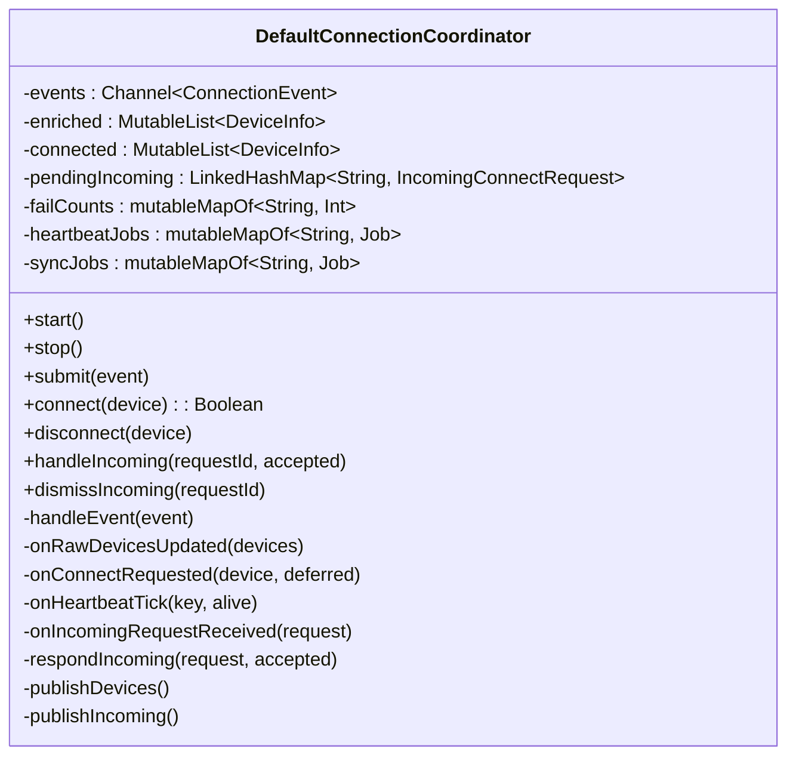
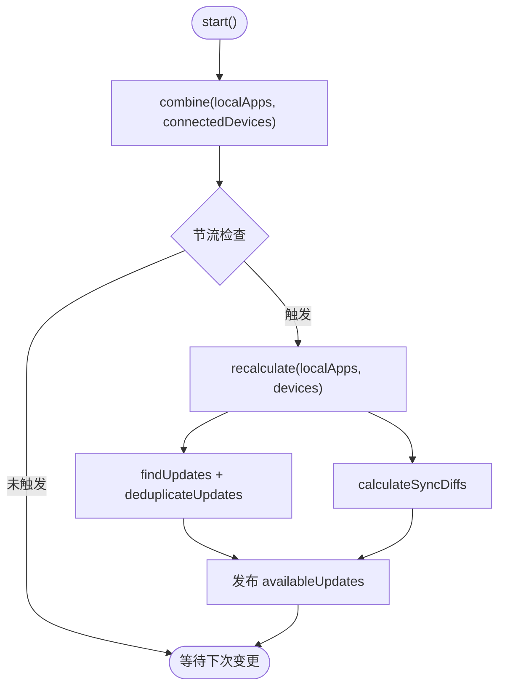
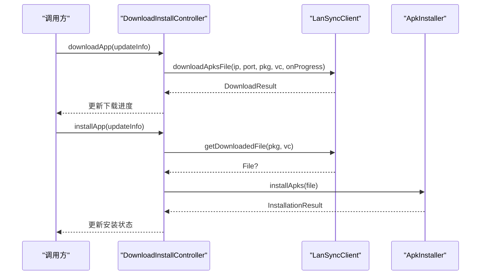
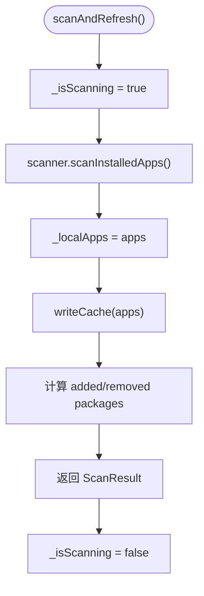
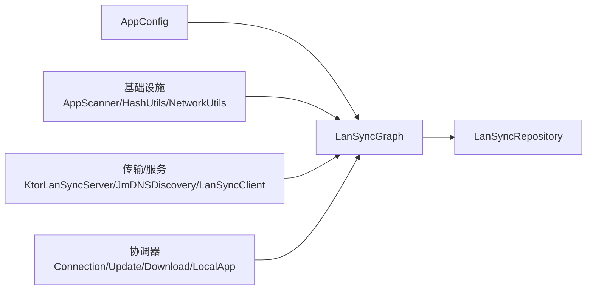

# 依赖注入架构

<cite>
**本文引用的文件**
- [LanSyncApplication.kt](file://app/src/main/java/com/lansync/app/LanSyncApplication.kt)
- [LanSyncGraph.kt](file://app/src/main/java/com/lansync/app/data/repository/LanSyncGraph.kt)
- [LanSyncRepository.kt](file://app/src/main/java/com/lansync/app/data/repository/LanSyncRepository.kt)
- [DefaultConnectionCoordinator.kt](file://app/src/main/java/com/lansync/app/data/connection/DefaultConnectionCoordinator.kt)
- [UpdateCoordinator.kt](file://app/src/main/java/com/lansync/app/data/sync/UpdateCoordinator.kt)
- [DownloadInstallController.kt](file://app/src/main/java/com/lansync/app/data/transfer/DownloadInstallController.kt)
- [LocalAppRepository.kt](file://app/src/main/java/com/lansync/app/data/localapps/LocalAppRepository.kt)
- [ARCHITECTURE.md](file://docs/ARCHITECTURE.md)
- [SPEC.md](file://docs/SPEC.md)
</cite>

## 目录
1. [简介](#简介)
2. [项目结构](#项目结构)
3. [核心组件](#核心组件)
4. [架构总览](#架构总览)
5. [详细组件分析](#详细组件分析)
6. [依赖关系分析](#依赖关系分析)
7. [性能与并发特性](#性能与并发特性)
8. [故障排查指南](#故障排查指南)
9. [结论](#结论)
10. [附录](#附录)

## 简介
本仓库采用“手写组合根 + 门面”的依赖注入模式，作为 Hilt 全面落地前的过渡方案。通过单一对象图构建器集中装配各模块，并以薄门面统一对外暴露能力，实现职责拆分、状态收敛与可测试性提升。目标架构文档明确了分层、契约与 DI 选型（Hilt），当前代码已按目标拆分为多个协调器与仓库，并通过组合根完成装配。

## 项目结构
- 应用入口：初始化日志等基础设施。
- 组合根：集中创建并持有单例对象图，打破构造环，提供全局访问点。
- 门面：聚合各协作者，仅做委托与生命周期编排，不含业务逻辑。
- 领域协调器：连接、更新、下载/安装、本机应用扫描等职责独立。
- 传输与服务：HTTP 服务器、客户端、设备发现、打包与安装等。

图表来源
- [LanSyncGraph.kt:42-127](file://app/src/main/java/com/lansync/app/data/repository/LanSyncGraph.kt#L42-L127)
- [LanSyncRepository.kt:38-49](file://app/src/main/java/com/lansync/app/data/repository/LanSyncRepository.kt#L38-L49)

章节来源
- [LanSyncApplication.kt:6-10](file://app/src/main/java/com/lansync/app/LanSyncApplication.kt#L6-L10)
- [LanSyncGraph.kt:35-127](file://app/src/main/java/com/lansync/app/data/repository/LanSyncGraph.kt#L35-L127)
- [LanSyncRepository.kt:27-49](file://app/src/main/java/com/lansync/app/data/repository/LanSyncRepository.kt#L27-L49)

## 核心组件
- 组合根（LanSyncGraph）：负责构建对象图、处理循环依赖、提供单例访问。
- 门面（LanSyncRepository）：聚合各协作者，暴露统一 API；start/stop 由前台服务驱动。
- 连接协调器（DefaultConnectionCoordinator）：基于 Actor 模型，单协程串行消费事件，所有可变状态在单一作用域内读写。
- 更新协调器（UpdateCoordinator）：组合本地应用与已连接设备列表，节流计算可用更新与同步差异。
- 下载/安装控制器（DownloadInstallController）：封装下载进度与安装状态，校验以 X-MD5 为唯一依据。
- 本机应用仓库（LocalAppRepository）：缓存骨架展示 + 后台静默刷新，暴露新增/移除包名供上层决策。

章节来源
- [LanSyncGraph.kt:42-127](file://app/src/main/java/com/lansync/app/data/repository/LanSyncGraph.kt#L42-L127)
- [LanSyncRepository.kt:27-158](file://app/src/main/java/com/lansync/app/data/repository/LanSyncRepository.kt#L27-L158)
- [DefaultConnectionCoordinator.kt:21-57](file://app/src/main/java/com/lansync/app/data/connection/DefaultConnectionCoordinator.kt#L21-L57)
- [UpdateCoordinator.kt:16-34](file://app/src/main/java/com/lansync/app/data/sync/UpdateCoordinator.kt#L16-L34)
- [DownloadInstallController.kt:12-22](file://app/src/main/java/com/lansync/app/data/transfer/DownloadInstallController.kt#L12-L22)
- [LocalAppRepository.kt:12-30](file://app/src/main/java/com/lansync/app/data/localapps/LocalAppRepository.kt#L12-L30)

## 架构总览
目标架构强调分层与单向依赖：UI → ViewModel → 协调层 → 服务/传输层 → 基础设施层。当前实现已通过组合根将各协作者解耦装配，门面仅做委托与生命周期编排，避免业务逻辑散落。

图表来源
- [LanSyncGraph.kt:52-127](file://app/src/main/java/com/lansync/app/data/repository/LanSyncGraph.kt#L52-L127)
- [LanSyncRepository.kt:38-49](file://app/src/main/java/com/lansync/app/data/repository/LanSyncRepository.kt#L38-L49)

章节来源
- [ARCHITECTURE.md:24-51](file://docs/ARCHITECTURE.md#L24-L51)

## 详细组件分析

### 组合根（LanSyncGraph）
- 职责：构建并持有单例对象图；使用 late-bind 引用打破 server ↔ coordinator ↔ pairingStore 的构造环；提供 get(context) 获取全局实例。
- 关键点：
  - 创建配置、作用域、各协作者（本地应用、图标缓存、打包、客户端、传输、配对历史、发现）。
  - 通过 lambda 延迟解析 localIdentityProvider，避免构造期循环引用。
  - 组装 ServerApiDelegate，将路由处理器与服务器生命周期解耦。
  - 返回 LanSyncRepository 作为门面入口。

图表来源
- [LanSyncGraph.kt:42-127](file://app/src/main/java/com/lansync/app/data/repository/LanSyncGraph.kt#L42-L127)

章节来源
- [LanSyncGraph.kt:35-127](file://app/src/main/java/com/lansync/app/data/repository/LanSyncGraph.kt#L35-L127)

### 门面（LanSyncRepository）
- 职责：聚合各协作者，暴露统一 API；start/stop 管理生命周期；转发 StateFlow 给 UI。
- 关键点：
  - 启动流程：清理打包缓存 → 启动服务器 → 启动协调器 → 启动发现 → 收集 discoveredDevices 推入连接协调器。
  - 停止流程：有序取消任务 → 停止协调器 → 停止发现 → 停止服务器。
  - 直接转发 localApps、discovered/connected devices、incomingRequests、availableUpdates、syncDiffs、下载/安装状态。
  - 扫描后通知已连接设备刷新应用列表。

图表来源
- [LanSyncRepository.kt:69-84](file://app/src/main/java/com/lansync/app/data/repository/LanSyncRepository.kt#L69-L84)

章节来源
- [LanSyncRepository.kt:27-158](file://app/src/main/java/com/lansync/app/data/repository/LanSyncRepository.kt#L27-L158)

### 连接协调器（DefaultConnectionCoordinator）
- 职责：三设备列表维护、连接编排、心跳循环、端口迁移、配对请求处理。
- 并发模型：Actor 模型，Channel 接收事件，单一协程串行消费；所有可变状态仅在 handleEvent 中读写。
- 关键行为：
  - 端口迁移：同 instanceId 但 displayKey 变化时保留连接态与应用列表，迁移心跳/同步任务。
  - 陈旧清理：不在 mDNS 且非连接态的设备从 enriched 移除。
  - 反向连接接受策略：命中配对历史自动接受；陌生设备保持 PENDING 弹窗；拒绝即时回 rejected。
  - 心跳三档：不稳定→尝试重连→超时断开。

图表来源
- [DefaultConnectionCoordinator.kt:30-57](file://app/src/main/java/com/lansync/app/data/connection/DefaultConnectionCoordinator.kt#L30-L57)
- [DefaultConnectionCoordinator.kt:95-111](file://app/src/main/java/com/lansync/app/data/connection/DefaultConnectionCoordinator.kt#L95-L111)
- [DefaultConnectionCoordinator.kt:113-176](file://app/src/main/java/com/lansync/app/data/connection/DefaultConnectionCoordinator.kt#L113-L176)
- [DefaultConnectionCoordinator.kt:257-304](file://app/src/main/java/com/lansync/app/data/connection/DefaultConnectionCoordinator.kt#L257-L304)
- [DefaultConnectionCoordinator.kt:324-375](file://app/src/main/java/com/lansync/app/data/connection/DefaultConnectionCoordinator.kt#L324-L375)

章节来源
- [DefaultConnectionCoordinator.kt:21-507](file://app/src/main/java/com/lansync/app/data/connection/DefaultConnectionCoordinator.kt#L21-L507)

### 更新协调器（UpdateCoordinator）
- 职责：组合本地应用与已连接设备列表，节流计算可用更新与同步差异。
- 并发特性：节流时间戳为 collect 协程内的局部状态，消除跨协程竞态。
- 输出：availableUpdates、syncDiffs。

图表来源
- [UpdateCoordinator.kt:45-56](file://app/src/main/java/com/lansync/app/data/sync/UpdateCoordinator.kt#L45-L56)
- [UpdateCoordinator.kt:72-80](file://app/src/main/java/com/lansync/app/data/sync/UpdateCoordinator.kt#L72-L80)

章节来源
- [UpdateCoordinator.kt:16-82](file://app/src/main/java/com/lansync/app/data/sync/UpdateCoordinator.kt#L16-L82)

### 下载/安装控制器（DownloadInstallController）
- 职责：下载进度与安装状态管理；下载校验以 X-MD5 为唯一依据；包名解析统一走工具类。
- 关键点：
  - 下载：回调进度，完成后标记完成或失败。
  - 安装：根据包名与版本码定位文件，执行安装并更新状态。
  - 一键操作：downloadAndInstallApp 串联下载与安装。

图表来源
- [DownloadInstallController.kt:30-48](file://app/src/main/java/com/lansync/app/data/transfer/DownloadInstallController.kt#L30-L48)
- [DownloadInstallController.kt:50-68](file://app/src/main/java/com/lansync/app/data/transfer/DownloadInstallController.kt#L50-L68)

章节来源
- [DownloadInstallController.kt:12-111](file://app/src/main/java/com/lansync/app/data/transfer/DownloadInstallController.kt#L12-L111)

### 本机应用仓库（LocalAppRepository）
- 职责：扫描触发、缓存读写、状态暴露；启动即加载缓存骨架，后台静默刷新。
- 关键点：
  - hasCache：判断是否存在有效缓存。
  - loadCacheSkeleton：快速填充本地应用列表。
  - scanAndRefresh：扫描并写入缓存，返回新增/移除包名供上层决策。

图表来源
- [LocalAppRepository.kt:55-75](file://app/src/main/java/com/lansync/app/data/localapps/LocalAppRepository.kt#L55-L75)

章节来源
- [LocalAppRepository.kt:12-104](file://app/src/main/java/com/lansync/app/data/localapps/LocalAppRepository.kt#L12-L104)

## 依赖关系分析
- 组合根依赖方向：配置 → 基础设施 → 传输/服务 → 协调器 → 门面。
- 门面仅依赖各协作者接口，不感知具体实现细节。
- 协调器之间无直接耦合，通过门面进行协作（如扫描后通知已连接设备刷新）。

图表来源
- [LanSyncGraph.kt:52-127](file://app/src/main/java/com/lansync/app/data/repository/LanSyncGraph.kt#L52-L127)

章节来源
- [LanSyncGraph.kt:35-127](file://app/src/main/java/com/lansync/app/data/repository/LanSyncGraph.kt#L35-L127)

## 性能与并发特性
- Actor 模型：连接协调器使用 Channel 与单协程串行消费事件，避免多线程竞争。
- 节流机制：更新协调器在单一 collect 协程内维护节流时间戳，减少重复计算。
- 作用域管理：组合根创建统一 CoroutineScope，便于测试替换调度器与统一生命周期管理。
- 状态收敛：所有可变状态在限定作用域内读写，消除 ConcurrentHashMap 与 StateFlow 交错导致的竞态。

章节来源
- [DefaultConnectionCoordinator.kt:21-57](file://app/src/main/java/com/lansync/app/data/connection/DefaultConnectionCoordinator.kt#L21-L57)
- [UpdateCoordinator.kt:16-34](file://app/src/main/java/com/lansync/app/data/sync/UpdateCoordinator.kt#L16-L34)
- [LanSyncGraph.kt:52-66](file://app/src/main/java/com/lansync/app/data/repository/LanSyncGraph.kt#L52-L66)

## 故障排查指南
- 连接异常：查看连接协调器日志，确认心跳失败次数与状态迁移是否符合预期。
- 下载失败：检查 X-MD5 响应头与本地文件完整性，确认下载路径与权限。
- 扫描问题：验证缓存文件是否损坏，必要时删除重建；关注扫描异常日志。
- 服务状态：通过门面 isRunning 与 serverPort 观察服务启停状态。

章节来源
- [DefaultConnectionCoordinator.kt:257-304](file://app/src/main/java/com/lansync/app/data/connection/DefaultConnectionCoordinator.kt#L257-L304)
- [DownloadInstallController.kt:30-48](file://app/src/main/java/com/lansync/app/data/transfer/DownloadInstallController.kt#L30-L48)
- [LocalAppRepository.kt:77-91](file://app/src/main/java/com/lansync/app/data/localapps/LocalAppRepository.kt#L77-L91)
- [LanSyncRepository.kt:51-54](file://app/src/main/java/com/lansync/app/data/repository/LanSyncRepository.kt#L51-L54)

## 结论
本项目通过组合根与门面实现了清晰的依赖注入与职责分离，结合 Actor 模型与节流机制提升了并发安全性与性能。目标架构文档明确了后续向 Hilt 迁移的方向与规范，当前实现已为重构打下坚实基础。

## 附录
- 目标架构与协议参考：
  - 分层与 DI 选型见目标架构文档。
  - 线上协议冻结字段与行为见协议规范。

章节来源
- [ARCHITECTURE.md:144-175](file://docs/ARCHITECTURE.md#L144-L175)
- [SPEC.md:32-73](file://docs/SPEC.md#L32-L73)