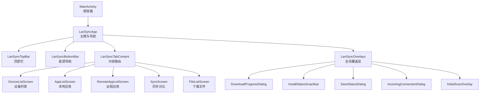
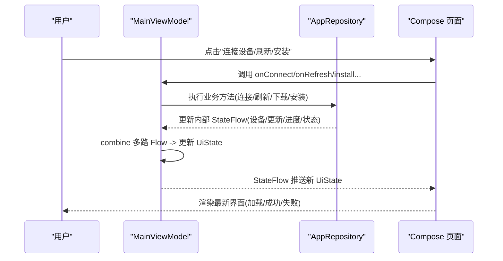
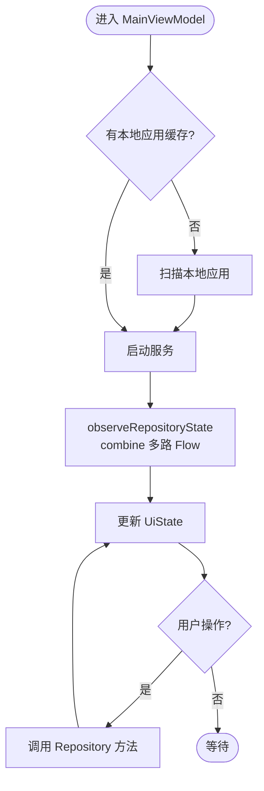
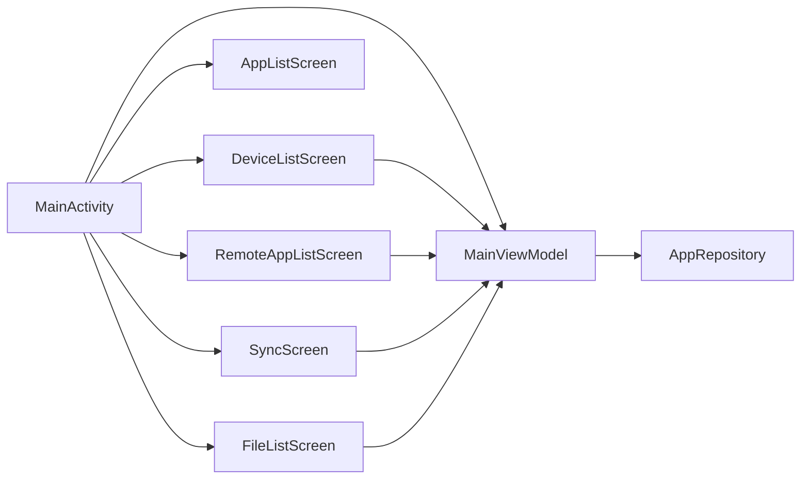
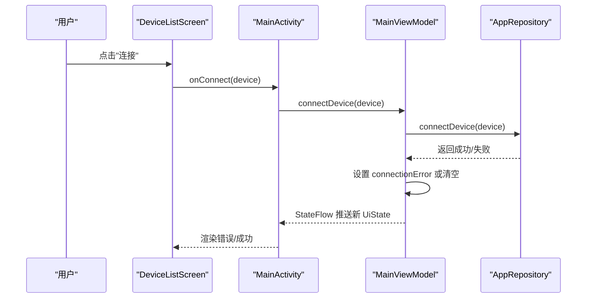
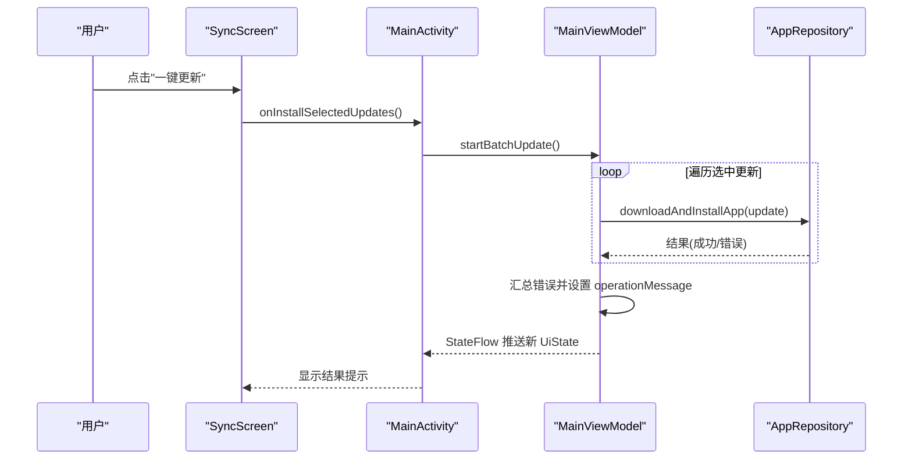
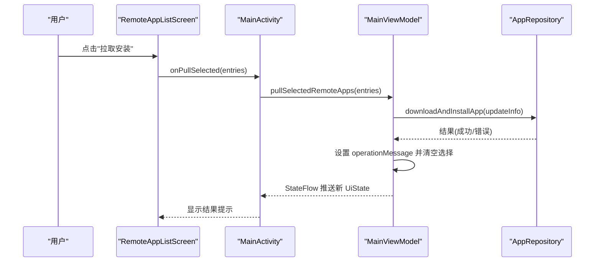

# UI层设计

<cite>
**本文引用的文件**
- [MainActivity.kt](file://app/src/main/java/com/lansync/app/MainActivity.kt)
- [MainViewModel.kt](file://app/src/main/java/com/lansync/app/ui/viewmodel/MainViewModel.kt)
- [DeviceListScreen.kt](file://app/src/main/java/com/lansync/app/ui/components/DeviceListScreen.kt)
- [AppListScreen.kt](file://app/src/main/java/com/lansync/app/ui/components/AppListScreen.kt)
- [RemoteAppListScreen.kt](file://app/src/main/java/com/lansync/app/ui/components/RemoteAppListScreen.kt)
- [SyncScreen.kt](file://app/src/main/java/com/lansync/app/ui/components/SyncScreen.kt)
- [FileListScreen.kt](file://app/src/main/java/com/lansync/app/ui/components/FileListScreen.kt)
- [Theme.kt](file://app/src/main/java/com/lansync/app/ui/theme/Theme.kt)
- [Typography.kt](file://app/src/main/java/com/lansync/app/ui/theme/Typography.kt)
- [LanSyncApplication.kt](file://app/src/main/java/com/lansync/app/LanSyncApplication.kt)
</cite>

## 更新摘要
**所做更改**
- 更新了MainActivity.kt中LanSyncTopBar函数的Material Design 3 API使用说明
- 增强了顶部栏组件的实验性API支持说明
- 完善了Material Design 3集成架构描述

## 目录
1. [简介](#简介)
2. [项目结构](#项目结构)
3. [核心组件](#核心组件)
4. [架构总览](#架构总览)
5. [详细组件分析](#详细组件分析)
6. [依赖关系分析](#依赖关系分析)
7. [性能考量](#性能考量)
8. [故障排查指南](#故障排查指南)
9. [结论](#结论)
10. [附录](#附录)

## 简介
本设计文档聚焦于 LanSync 应用的 UI 层，基于 Jetpack Compose 的声明式 UI 架构，系统阐述组件层次、状态管理模式与主题系统。重点说明 MainViewModel 如何集中管理 UI 状态并与业务逻辑层交互，解释 StateFlow 在响应式数据流中的作用；同时梳理设备列表、本地应用列表、远程应用列表、同步界面等 Compose 组件的职责划分与实现模式。文档还说明了 UI 层如何通过依赖注入获取业务服务、如何处理用户交互事件和数据更新，并提供组件间通信与状态提升策略的具体示例路径。

## 项目结构
UI 层位于 app/src/main/java/com/lansync/app/ui 下，采用"按功能模块组织"的结构：
- components：页面级与可复用 UI 组件（设备列表、应用列表、同步、文件管理等）
- theme：主题与排版定义
- viewmodel：主视图模型，负责状态管理与业务调用

入口 Activity 使用 setContent 挂载主题与根 Composable，并通过 BottomNavigation 切换多个 Tab 页面。各 Tab 页面通过 ViewModel 暴露的 uiState 进行单向数据绑定，用户操作回调到 ViewModel，再由 ViewModel 驱动业务层 AppRepository 的状态变更，最终通过 StateFlow 回推到 UI。



**图表来源**
- [MainActivity.kt:37-106](file://app/src/main/java/com/lansync/app/MainActivity.kt#L37-L106)
- [DeviceListScreen.kt:20-152](file://app/src/main/java/com/lansync/app/ui/components/DeviceListScreen.kt#L20-L152)
- [AppListScreen.kt:27-121](file://app/src/main/java/com/lansync/app/ui/components/AppListScreen.kt#L27-L121)
- [RemoteAppListScreen.kt:24-283](file://app/src/main/java/com/lansync/app/ui/components/RemoteAppListScreen.kt#L24-L283)
- [SyncScreen.kt:22-209](file://app/src/main/java/com/lansync/app/ui/components/SyncScreen.kt#L22-L209)
- [FileListScreen.kt:22-131](file://app/src/main/java/com/lansync/app/ui/components/FileListScreen.kt#L22-L131)

**章节来源**
- [MainActivity.kt:26-106](file://app/src/main/java/com/lansync/app/MainActivity.kt#L26-L106)

## 核心组件
- MainViewModel：集中持有 UiState，组合仓库的多路 StateFlow，统一处理启动/停止、连接/断开、刷新、批量更新、拉取安装等操作，并维护临时选择状态（如 selectedUpdates、remoteAppSelections）。
- MainActivity：作为根容器，提供主题、导航、Tab 路由与全局覆盖层；将 uiState 与用户回调传递给各页面组件。
- 页面组件：
  - DeviceListScreen：展示设备发现与连接状态，支持启停服务、强制同步、错误提示。
  - AppListScreen：本地应用搜索、分类筛选、列表展示。
  - RemoteAppListScreen：聚合多设备远程应用，支持搜索、分类、全选/取消、批量拉取。
  - SyncScreen：按设备维度展示可更新与版本差异，支持选择与一键更新。
  - FileListScreen：已下载文件列表，支持多选、删除、保存至 SAF、安装。
- 主题系统：LanSyncTheme 封装深色/浅色与动态色，Typography 定义字体样式。

**章节来源**
- [MainViewModel.kt:22-45](file://app/src/main/java/com/lansync/app/ui/viewmodel/MainViewModel.kt#L22-L45)
- [MainViewModel.kt:47-124](file://app/src/main/java/com/lansync/app/ui/viewmodel/MainViewModel.kt#L47-L124)
- [MainActivity.kt:37-106](file://app/src/main/java/com/lansync/app/MainActivity.kt#L37-L106)
- [DeviceListScreen.kt:20-152](file://app/src/main/java/com/lansync/app/ui/components/DeviceListScreen.kt#L20-L152)
- [AppListScreen.kt:27-121](file://app/src/main/java/com/lansync/app/ui/components/AppListScreen.kt#L27-L121)
- [RemoteAppListScreen.kt:24-283](file://app/src/main/java/com/lansync/app/ui/components/RemoteAppListScreen.kt#L24-L283)
- [SyncScreen.kt:22-209](file://app/src/main/java/com/lansync/app/ui/components/SyncScreen.kt#L22-L209)
- [FileListScreen.kt:22-131](file://app/src/main/java/com/lansync/app/ui/components/FileListScreen.kt#L22-L131)
- [Theme.kt:40-74](file://app/src/main/java/com/lansync/app/ui/theme/Theme.kt#L40-L74)
- [Typography.kt:9-31](file://app/src/main/java/com/lansync/app/ui/theme/Typography.kt#L9-L31)

## 架构总览
UI 层遵循"单向数据流 + 状态提升"的模式：
- 数据源：AppRepository 暴露多个 StateFlow（本地应用、设备列表、可用更新、同步差异、下载进度、安装状态、服务器端口等）。
- 状态汇聚：MainViewModel 使用 combine 将多路 Flow 合并为单一 UiState，供 UI 订阅。
- 视图渲染：MainActivity 收集 uiState 并分发给各页面组件。
- 用户交互：页面组件仅接收 props 与回调，不直接持有业务状态；所有操作回调到 ViewModel，由 ViewModel 调用 Repository 并更新状态。



**图表来源**
- [MainViewModel.kt:84-124](file://app/src/main/java/com/lansync/app/ui/viewmodel/MainViewModel.kt#L84-L124)
- [MainActivity.kt:37-106](file://app/src/main/java/com/lansync/app/MainActivity.kt#L37-L106)

**章节来源**
- [MainViewModel.kt:84-124](file://app/src/main/java/com/lansync/app/ui/viewmodel/MainViewModel.kt#L84-L124)
- [MainActivity.kt:37-106](file://app/src/main/java/com/lansync/app/MainActivity.kt#L37-L106)

## 详细组件分析

### MainViewModel 与状态管理
- 状态模型：UiState 集中包含本地应用、设备列表、可用更新、同步差异、选择集合、运行状态、下载/安装进度、服务器端口、消息提示、传入请求等。
- 状态汇聚：init 中 observeRepositoryState 使用 combine 分组监听仓库的多路 StateFlow，将变化映射到 UiState。
- 自动启动：autoStart 根据是否有本地应用缓存决定是否执行初始扫描并启动服务。
- 用户操作：toggleRunning、connectDevice、disconnectDevice、refreshDevices、批量更新、拉取安装、下载文件管理等，均通过 viewModelScope 异步执行，并在 try/finally 中清理中间态（如 isStarting/isStopping/operationMessage）。
- 选择状态提升：selectedUpdates 与 remoteAppSelections 在 ViewModel 中维护，避免在 UI 层分散状态。



**图表来源**
- [MainViewModel.kt:60-82](file://app/src/main/java/com/lansync/app/ui/viewmodel/MainViewModel.kt#L60-L82)
- [MainViewModel.kt:84-124](file://app/src/main/java/com/lansync/app/ui/viewmodel/MainViewModel.kt#L84-L124)
- [MainViewModel.kt:126-156](file://app/src/main/java/com/lansync/app/ui/viewmodel/MainViewModel.kt#L126-L156)

**章节来源**
- [MainViewModel.kt:22-45](file://app/src/main/java/com/lansync/app/ui/viewmodel/MainViewModel.kt#L22-L45)
- [MainViewModel.kt:60-124](file://app/src/main/java/com/lansync/app/ui/viewmodel/MainViewModel.kt#L60-L124)
- [MainViewModel.kt:126-156](file://app/src/main/java/com/lansync/app/ui/viewmodel/MainViewModel.kt#L126-L156)
- [MainViewModel.kt:225-274](file://app/src/main/java/com/lansync/app/ui/viewmodel/MainViewModel.kt#L225-L274)
- [MainViewModel.kt:343-411](file://app/src/main/java/com/lansync/app/ui/viewmodel/MainViewModel.kt#L343-L411)

### Material Design 3 集成与顶部栏组件

**更新** 增强了Material Design 3 API的使用，通过@OptIn注解启用实验性功能

LanSyncTopBar 组件现在使用了 @OptIn(ExperimentalMaterial3Api::class) 注解来启用实验性的 Material Design 3 API，同时保持与稳定 API 的兼容性。该组件实现了现代化的顶部栏设计，包括：

- **标题区域**：显示应用名称和扫描状态指示器
- **动态操作按钮**：根据当前选中的标签页显示不同的操作按钮
- **Material 3 设计规范**：遵循最新的 Material Design 3 设计语言

```kotlin
@OptIn(ExperimentalMaterial3Api::class)
@Composable
private fun LanSyncTopBar(
    isScanningApps: Boolean,
    selectedTab: Int,
    onRefreshDevices: () -> Unit,
    onLoadDownloadedFiles: () -> Unit
) {
    TopAppBar(
        title = {
            Row(verticalAlignment = Alignment.CenterVertically) {
                Text(text = "LanSync", fontWeight = FontWeight.Bold)
                if (isScanningApps) {
                    Spacer(Modifier.width(8.dp))
                    CircularProgressIndicator(
                        modifier = Modifier.size(18.dp),
                        strokeWidth = 2.dp,
                        color = MaterialTheme.colorScheme.onSurfaceVariant
                    )
                    Spacer(Modifier.width(4.dp))
                    Text("扫描中...", style = MaterialTheme.typography.labelSmall, color = MaterialTheme.colorScheme.onSurfaceVariant)
                }
            }
        },
        actions = {
            when (selectedTab) {
                2, 3 -> {
                    IconButton(onClick = onRefreshDevices) {
                        Icon(Icons.Default.Refresh, contentDescription = "刷新")
                    }
                }
                4 -> {
                    IconButton(onClick = onLoadDownloadedFiles) {
                        Icon(Icons.Default.Refresh, contentDescription = "刷新文件")
                    }
                }
            }
        }
    )
}
```

**章节来源**
- [MainActivity.kt:108-147](file://app/src/main/java/com/lansync/app/MainActivity.kt#L108-L147)

### 设备列表界面（DeviceListScreen）
- 职责：展示设备发现与连接状态，显示服务运行状态与端口，支持启停服务、强制同步、刷新设备、连接/断开设备、错误提示。
- 状态来源：从父组件传入 devices、isRunning、serverPort、isStarting/isStopping、operationMessage、connectionError。
- 交互模式：按钮点击回调到 ViewModel 的方法（onToggleRunning、onForceStartSync、onConnect、onDisconnect、onRefresh、onDismissError），UI 不持有业务状态。
- 空态与加载：当无设备时展示引导信息；连接中/重连中显示进度指示。

**章节来源**
- [DeviceListScreen.kt:20-152](file://app/src/main/java/com/lansync/app/ui/components/DeviceListScreen.kt#L20-L152)
- [DeviceListScreen.kt:154-240](file://app/src/main/java/com/lansync/app/ui/components/DeviceListScreen.kt#L154-L240)
- [DeviceListScreen.kt:242-423](file://app/src/main/java/com/lansync/app/ui/components/DeviceListScreen.kt#L242-L423)
- [MainActivity.kt:197-221](file://app/src/main/java/com/lansync/app/MainActivity.kt#L197-L221)

### 本地应用列表界面（AppListScreen）
- 职责：展示本地已安装应用，支持搜索与分类（全部/用户/系统），统计计数，空态提示。
- 状态来源：localApps 列表，搜索词与分类为组件内 remember 状态。
- 过滤逻辑：使用 derivedStateOf 计算 filteredApps，避免不必要的重组。
- 列表项：AppItem 展示图标、名称、版本、大小、是否可提取、是否分包等。

**章节来源**
- [AppListScreen.kt:27-121](file://app/src/main/java/com/lansync/app/ui/components/AppListScreen.kt#L27-L121)
- [AppListScreen.kt:123-200](file://app/src/main/java/com/lansync/app/ui/components/AppListScreen.kt#L123-L200)
- [AppListScreen.kt:201-288](file://app/src/main/java/com/lansync/app/ui/components/AppListScreen.kt#L201-L288)

### 远程应用列表界面（RemoteAppListScreen）
- 职责：聚合多设备远程应用，去重取最高版本，支持搜索、分类、全选/取消、批量拉取安装。
- 状态来源：connectedDevices 与 selectedPackages；组件内维护 searchQuery、category、hasTriggeredInitialRefresh。
- 自动刷新：LaunchedEffect 检测首次进入且存在已连接但应用列表为空的情况，触发 onRefresh。
- 列表项：RemoteAppItem 展示应用信息、来源设备、大小、是否可提取，支持单选与拉取。

**章节来源**
- [RemoteAppListScreen.kt:24-283](file://app/src/main/java/com/lansync/app/ui/components/RemoteAppListScreen.kt#L24-L283)
- [RemoteAppListScreen.kt:285-355](file://app/src/main/java/com/lansync/app/ui/components/RemoteAppListScreen.kt#L285-L355)
- [RemoteAppListScreen.kt:357-482](file://app/src/main/java/com/lansync/app/ui/components/RemoteAppListScreen.kt#L357-L482)
- [MainActivity.kt:248-286](file://app/src/main/java/com/lansync/app/MainActivity.kt#L248-L286)

### 同步界面（SyncScreen）
- 职责：按设备维度展示可更新与版本差异，支持选择与一键更新。
- 状态来源：connectedDevices、syncDiffs、availableUpdates、selectedUpdates；组件内维护 selectedDevice、searchQuery。
- 过滤逻辑：derivedStateOf 按设备与搜索词过滤更新与差异。
- 批量操作：底部悬浮条显示已选数量与"一键更新"，回调到 ViewModel 的 startBatchUpdate。

**章节来源**
- [SyncScreen.kt:22-209](file://app/src/main/java/com/lansync/app/ui/components/SyncScreen.kt#L22-L209)
- [SyncScreen.kt:211-235](file://app/src/main/java/com/lansync/app/ui/components/SyncScreen.kt#L211-L235)
- [SyncScreen.kt:237-265](file://app/src/main/java/com/lansync/app/ui/components/SyncScreen.kt#L237-L265)
- [SyncScreen.kt:267-329](file://app/src/main/java/com/lansync/app/ui/components/SyncScreen.kt#L267-L329)
- [MainActivity.kt:288-307](file://app/src/main/java/com/lansync/app/MainActivity.kt#L288-L307)

### 文件列表界面（FileListScreen）
- 职责：展示已下载文件，支持多选、删除、保存到 SAF、安装。
- 状态来源：files 列表；组件内维护 selectedFiles、showDeleteConfirm。
- 生命周期：LaunchedEffect(Unit) 在进入时触发 onRefresh。
- 交互：全选/取消全选、删除确认对话框、保存至 SAF、安装。

**章节来源**
- [FileListScreen.kt:22-131](file://app/src/main/java/com/lansync/app/ui/components/FileListScreen.kt#L22-L131)
- [FileListScreen.kt:162-296](file://app/src/main/java/com/lansync/app/ui/components/FileListScreen.kt#L162-L296)
- [MainActivity.kt:309-329](file://app/src/main/java/com/lansync/app/MainActivity.kt#L309-L329)

### 主题系统
- LanSyncTheme：根据系统深色模式与动态色能力选择颜色方案，设置状态栏与导航栏颜色及外观，应用 MaterialTheme 与 Typography。
- Typography：定义 bodyLarge、titleLarge、labelSmall 等文本样式。

**章节来源**
- [Theme.kt:40-74](file://app/src/main/java/com/lansync/app/ui/theme/Theme.kt#L40-L74)
- [Typography.kt:9-31](file://app/src/main/java/com/lansync/app/ui/theme/Typography.kt#L9-L31)

## 依赖关系分析
- 组件耦合：
  - MainActivity 与 MainViewModel：通过 viewModel() 获取实例，传递 uiState 与回调。
  - 各页面组件与 MainViewModel：仅通过 props 与回调解耦，不直接访问业务层。
  - MainViewModel 与 AppRepository：集中调用，屏蔽业务细节。
- 外部依赖：
  - AndroidX Compose/Material3：UI 构建与主题。
  - Kotlin Coroutines/Flow：异步与响应式数据流。
  - Android 系统 API：Activity 结果、窗口配置等。



**图表来源**
- [MainActivity.kt:37-106](file://app/src/main/java/com/lansync/app/MainActivity.kt#L37-L106)
- [MainViewModel.kt:47-124](file://app/src/main/java/com/lansync/app/ui/viewmodel/MainViewModel.kt#L47-L124)

**章节来源**
- [MainActivity.kt:37-106](file://app/src/main/java/com/lansync/app/MainActivity.kt#L37-L106)
- [MainViewModel.kt:47-124](file://app/src/main/java/com/lansync/app/ui/viewmodel/MainViewModel.kt#L47-L124)

## 性能考量
- 列表优化：使用 LazyColumn 与 items(key=...) 提高滚动性能与稳定性。
- 派生状态：多处使用 derivedStateOf 减少不必要的重组（如搜索过滤、分类统计）。
- 状态合并：MainViewModel 使用 combine 分组监听多路 Flow，避免超过参数限制并降低复杂度。
- 懒加载与条件渲染：仅在需要时显示加载指示或空态，减少无用绘制。
- 图片与图标：AppIcon 复用与尺寸控制，避免大图缩放开销。

## 故障排查指南
- 连接错误：DeviceListScreen 显示 connectionError，可通过 dismissConnectionError 清除；检查网络与服务状态。
- 服务启停：isStarting/isStopping 期间禁用交互并显示 operationMessage；确保 finally 块清理状态。
- 下载与安装：DownloadProgressDialog 与 InstallStatusSnackbar 反馈进度与结果；必要时调用 clearDownloadProgress/clearInstallStatus。
- 远程应用为空：RemoteAppListScreen 自动触发刷新；若仍为空，检查设备连接状态与权限。
- 初始扫描：needsInitialScan 时显示 InitialScanOverlay；完成后隐藏。

**章节来源**
- [DeviceListScreen.kt:56-90](file://app/src/main/java/com/lansync/app/ui/components/DeviceListScreen.kt#L56-L90)
- [DeviceListScreen.kt:154-240](file://app/src/main/java/com/lansync/app/ui/components/DeviceListScreen.kt#L154-L240)
- [RemoteAppListScreen.kt:65-75](file://app/src/main/java/com/lansync/app/ui/components/RemoteAppListScreen.kt#L65-L75)
- [MainActivity.kt:331-389](file://app/src/main/java/com/lansync/app/MainActivity.kt#L331-L389)

## 结论
LanSync 的 UI 层以 MainViewModel 为核心，结合 StateFlow 与 Compose 的声明式特性，实现了清晰的状态管理与单向数据流。各页面组件职责明确、低耦合，通过回调与 ViewModel 交互；主题系统提供一致的视觉体验。通过引入 Material Design 3 的实验性功能，应用获得了更现代化的用户界面体验。该架构具备良好的可扩展性与可维护性，适合后续功能扩展与团队协作。

## 附录

### 组件间通信与状态提升示例
- 设备连接流程：
  - 用户在 DeviceListScreen 点击"连接"，触发 onConnect(device)。
  - MainActivity 将回调转发给 MainViewModel.connectDevice(device)。
  - ViewModel 调用 repository.connectDevice，捕获异常并设置 connectionError。
  - 状态通过 StateFlow 回推，UI 重新渲染错误提示或成功状态。



**图表来源**
- [DeviceListScreen.kt:141-148](file://app/src/main/java/com/lansync/app/ui/components/DeviceListScreen.kt#L141-L148)
- [MainActivity.kt:197-221](file://app/src/main/java/com/lansync/app/MainActivity.kt#L197-L221)
- [MainViewModel.kt:162-180](file://app/src/main/java/com/lansync/app/ui/viewmodel/MainViewModel.kt#L162-L180)

- 批量更新流程：
  - 用户在 SyncScreen 勾选多个更新，点击"一键更新"。
  - MainActivity 调用 MainViewModel.startBatchUpdate。
  - ViewModel 遍历 selectedUpdates，逐个调用 downloadAndInstallApp，收集错误并设置 operationMessage。
  - UI 显示结果提示。



**图表来源**
- [SyncScreen.kt:172-206](file://app/src/main/java/com/lansync/app/ui/components/SyncScreen.kt#L172-L206)
- [MainActivity.kt:288-307](file://app/src/main/java/com/lansync/app/MainActivity.kt#L288-L307)
- [MainViewModel.kt:245-274](file://app/src/main/java/com/lansync/app/ui/viewmodel/MainViewModel.kt#L245-L274)

- 远程应用拉取流程：
  - 用户在 RemoteAppListScreen 选择应用，点击"拉取安装"。
  - MainActivity 调用 MainViewModel.pullSelectedRemoteApps(entries)。
  - ViewModel 构造 UpdateInfo 并调用 downloadAndInstallApp，收集错误并设置 operationMessage。
  - UI 显示结果提示并清空选择。



**图表来源**
- [RemoteAppListScreen.kt:246-280](file://app/src/main/java/com/lansync/app/ui/components/RemoteAppListScreen.kt#L246-L280)
- [MainActivity.kt:248-286](file://app/src/main/java/com/lansync/app/MainActivity.kt#L248-L286)
- [MainViewModel.kt:363-397](file://app/src/main/java/com/lansync/app/ui/viewmodel/MainViewModel.kt#L363-L397)