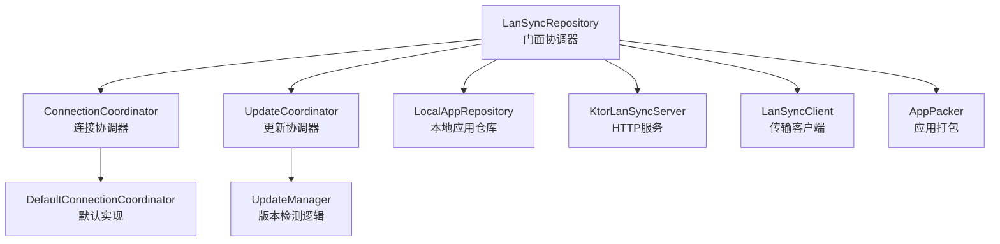
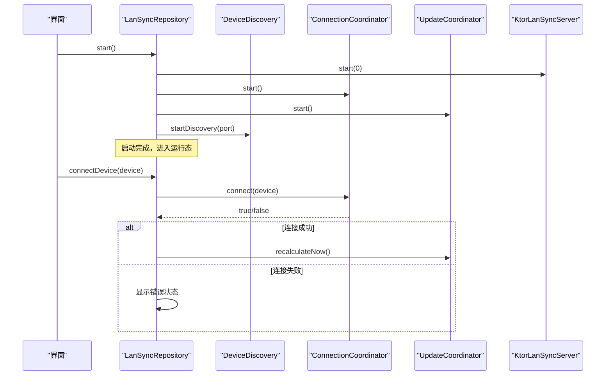
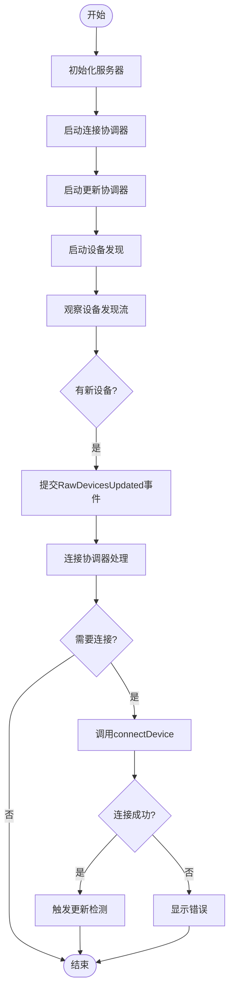
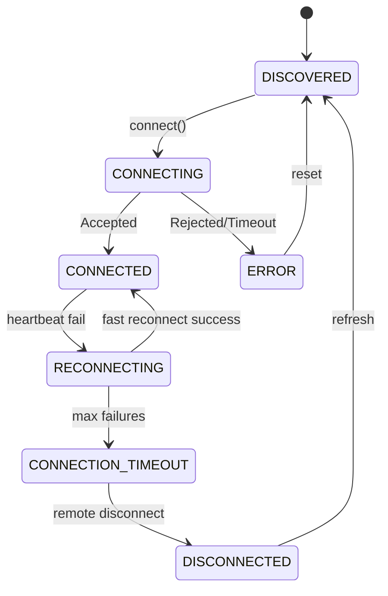
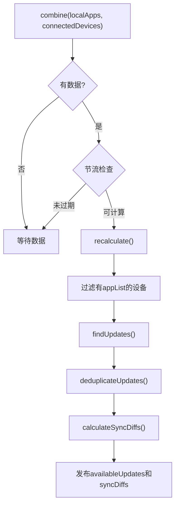
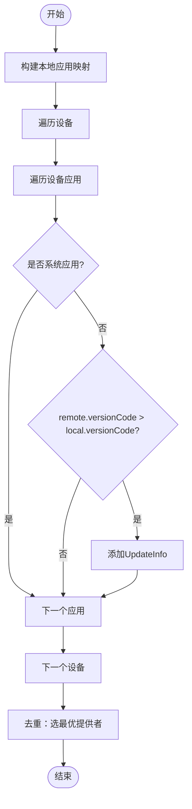
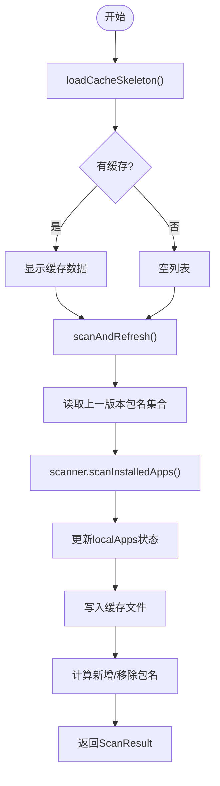
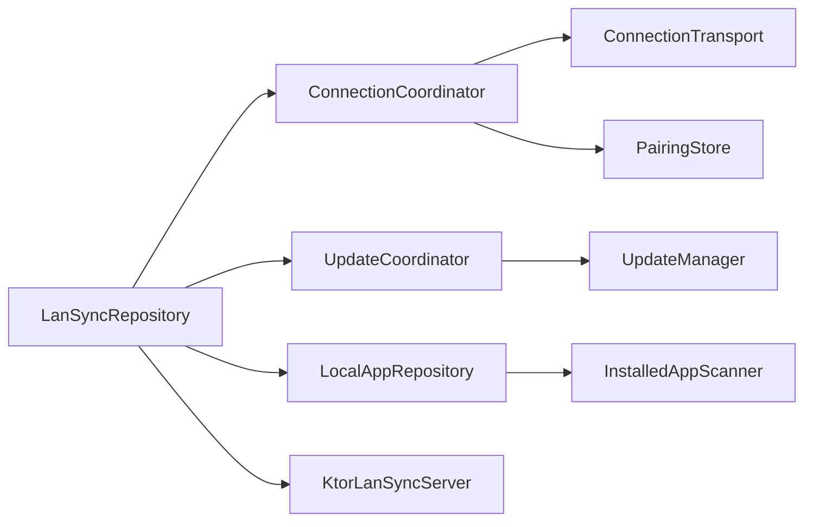

# 业务逻辑层

<cite>
**本文引用的文件**
- [LanSyncRepository.kt](file://app/src/main/java/com/lansync/app/data/repository/LanSyncRepository.kt)
- [ConnectionCoordinator.kt](file://app/src/main/java/com/lansync/app/data/connection/ConnectionCoordinator.kt)
- [DefaultConnectionCoordinator.kt](file://app/src/main/java/com/lansync/app/data/connection/DefaultConnectionCoordinator.kt)
- [UpdateCoordinator.kt](file://app/src/main/java/com/lansync/app/data/sync/UpdateCoordinator.kt)
- [UpdateManager.kt](file://app/src/main/java/com/lansync/app/data/sync/UpdateManager.kt)
- [LocalAppRepository.kt](file://app/src/main/java/com/lansync/app/data/localapps/LocalAppRepository.kt)
- [KtorLanSyncServer.kt](file://app/src/main/java/com/lansync/app/data/server/KtorLanSyncServer.kt)
- [Models.kt](file://app/src/main/java/com/lansync/app/data/model/Models.kt)
- [AppConfig.kt](file://app/src/main/java/com/lansync/app/data/AppConfig.kt)
</cite>

## 更新摘要
**变更内容**
- 移除了1,180+行的单体AppRepository，重构为模块化架构
- 新增LanSyncRepository门面模式作为组合协调器
- 引入ConnectionCoordinator接口和DefaultConnectionCoordinator实现处理连接管理
- 分离UpdateCoordinator和UpdateManager职责，实现纯逻辑版本检测
- 重构LocalAppRepository，分离扫描、缓存和状态管理职责
- 采用Actor模型确保并发安全，消除竞态条件

## 目录
1. [简介](#简介)
2. [项目结构](#项目结构)
3. [核心组件](#核心组件)
4. [架构总览](#架构总览)
5. [详细组件分析](#详细组件分析)
6. [依赖关系分析](#依赖关系分析)
7. [性能考量](#性能考量)
8. [故障排查指南](#故障排查指南)
9. [结论](#结论)
10. [附录：使用示例与最佳实践](#附录使用示例与最佳实践)

## 简介
本设计文档聚焦LanSync应用重构后的业务逻辑层，围绕新的模块化架构展开。通过LanSyncRepository门面模式整合设备发现、网络通信、应用管理等子系统，采用Actor模型确保并发安全。重点说明以下业务规则与实现：
- 连接状态机管理（心跳检测、自动重连、端口迁移）
- 应用同步策略（定时刷新、增量差异计算）
- 版本比较算法（跨设备版本对比与去重）
- UpdateCoordinator的节流更新机制
- ConnectionCoordinator的连接生命周期管理
- 协程在异步任务中的应用（心跳、重连、批量操作）

## 项目结构
业务逻辑层位于data包下，按职责划分模块：
- repository：LanSyncRepository门面，组合各子模块能力，对外暴露统一接口
- connection：ConnectionCoordinator接口及DefaultConnectionCoordinator实现，处理连接状态机
- sync：UpdateCoordinator协调器和UpdateManager纯逻辑类，负责版本检测和差异计算
- localapps：LocalAppRepository，管理本机应用扫描、缓存和状态
- server：KtorLanSyncServer，提供HTTP API服务
- model：数据模型定义
- config：配置项管理

**图表来源**
- [LanSyncRepository.kt:38-49](file://app/src/main/java/com/lansync/app/data/repository/LanSyncRepository.kt#L38-L49)
- [ConnectionCoordinator.kt:19-50](file://app/src/main/java/com/lansync/app/data/connection/ConnectionCoordinator.kt#L19-L50)
- [DefaultConnectionCoordinator.kt:30-37](file://app/src/main/java/com/lansync/app/data/connection/DefaultConnectionCoordinator.kt#L30-L37)
- [UpdateCoordinator.kt:27-34](file://app/src/main/java/com/lansync/app/data/sync/UpdateCoordinator.kt#L27-L34)
- [UpdateManager.kt:20-20](file://app/src/main/java/com/lansync/app/data/sync/UpdateManager.kt#L20-L20)
- [LocalAppRepository.kt:26-30](file://app/src/main/java/com/lansync/app/data/localapps/LocalAppRepository.kt#L26-L30)

**章节来源**
- [LanSyncRepository.kt:38-49](file://app/src/main/java/com/lansync/app/data/repository/LanSyncRepository.kt#L38-L49)
- [ConnectionCoordinator.kt:19-50](file://app/src/main/java/com/lansync/app/data/connection/ConnectionCoordinator.kt#L19-L50)
- [DefaultConnectionCoordinator.kt:30-37](file://app/src/main/java/com/lansync/app/data/connection/DefaultConnectionCoordinator.kt#L30-L37)
- [UpdateCoordinator.kt:27-34](file://app/src/main/java/com/lansync/app/data/sync/UpdateCoordinator.kt#L27-L34)
- [UpdateManager.kt:20-20](file://app/src/main/java/com/lansync/app/data/sync/UpdateManager.kt#L20-L20)
- [LocalAppRepository.kt:26-30](file://app/src/main/java/com/lansync/app/data/localapps/LocalAppRepository.kt#L26-L30)

## 核心组件
- **LanSyncRepository**：组合门面，聚合各子模块能力，只做委托和生命周期编排，不含业务逻辑
- **ConnectionCoordinator**：连接协调器接口，定义连接状态机、心跳、端口迁移等契约
- **DefaultConnectionCoordinator**：Actor模型实现，单一协程串行处理所有事件，确保并发安全
- **UpdateCoordinator**：更新协调器，组合localApps和connectedDevices流，节流触发版本检测
- **UpdateManager**：纯逻辑类，实现版本比较、去重和差异计算的冻结规则
- **LocalAppRepository**：本机应用仓库，管理扫描、缓存和状态，支持骨架加载
- **KtorLanSyncServer**：HTTP服务器，提供应用列表、下载、连接握手等API

**章节来源**
- [LanSyncRepository.kt:27-49](file://app/src/main/java/com/lansync/app/data/repository/LanSyncRepository.kt#L27-L49)
- [ConnectionCoordinator.kt:7-18](file://app/src/main/java/com/lansync/app/data/connection/ConnectionCoordinator.kt#L7-L18)
- [DefaultConnectionCoordinator.kt:21-29](file://app/src/main/java/com/lansync/app/data/connection/DefaultConnectionCoordinator.kt#L21-L29)
- [UpdateCoordinator.kt:16-26](file://app/src/main/java/com/lansync/app/data/sync/UpdateCoordinator.kt#L16-L26)
- [UpdateManager.kt:8-19](file://app/src/main/java/com/lansync/app/data/sync/UpdateManager.kt#L8-L19)
- [LocalAppRepository.kt:12-25](file://app/src/main/java/com/lansync/app/data/localapps/LocalAppRepository.kt#L12-L25)

## 架构总览
新架构采用门面模式+Actor模型的组合设计：
- **门面层**：LanSyncRepository作为唯一入口，组合各子模块，屏蔽内部复杂性
- **协调层**：ConnectionCoordinator和UpdateCoordinator分别处理连接和更新流程
- **执行层**：DefaultConnectionCoordinator使用Actor模型确保状态一致性
- **逻辑层**：UpdateManager提供纯函数式的版本比较逻辑
- **数据层**：LocalAppRepository管理本地应用数据和缓存

**图表来源**
- [LanSyncRepository.kt:69-84](file://app/src/main/java/com/lansync/app/data/repository/LanSyncRepository.kt#L69-L84)
- [DefaultConnectionCoordinator.kt:82-86](file://app/src/main/java/com/lansync/app/data/connection/DefaultConnectionCoordinator.kt#L82-L86)
- [UpdateCoordinator.kt:64-70](file://app/src/main/java/com/lansync/app/data/sync/UpdateCoordinator.kt#L64-L70)

## 详细组件分析

### LanSyncRepository：组合门面
职责与模式
- 采用组合门面模式，聚合各子模块能力，只做委托和生命周期编排
- 严格约束≤300行，不含业务逻辑，所有复杂逻辑下沉到专门组件
- 通过StateFlow暴露各子模块的状态，供UI订阅

关键业务流程
- 启动流程：初始化服务器、启动连接协调器、更新协调器、设备发现
- 设备发现：监听discoveredDevices流，转换为ConnectionEvent提交给协调器
- 应用扫描：调用LocalAppRepository扫描，预加载图标，通知已连接设备刷新
- 连接管理：委托ConnectionCoordinator处理连接请求和断开
- 更新检测：委托UpdateCoordinator进行版本比较和差异计算

**图表来源**
- [LanSyncRepository.kt:69-84](file://app/src/main/java/com/lansync/app/data/repository/LanSyncRepository.kt#L69-L84)
- [LanSyncRepository.kt:77-81](file://app/src/main/java/com/lansync/app/data/repository/LanSyncRepository.kt#L77-L81)
- [LanSyncRepository.kt:121-124](file://app/src/main/java/com/lansync/app/data/repository/LanSyncRepository.kt#L121-L124)

**章节来源**
- [LanSyncRepository.kt:27-49](file://app/src/main/java/com/lansync/app/data/repository/LanSyncRepository.kt#L27-L49)
- [LanSyncRepository.kt:69-100](file://app/src/main/java/com/lansync/app/data/repository/LanSyncRepository.kt#L69-L100)
- [LanSyncRepository.kt:102-148](file://app/src/main/java/com/lansync/app/data/repository/LanSyncRepository.kt#L102-L148)

### ConnectionCoordinator：连接状态机
职责与模式
- 定义连接状态机的契约，包括设备列表维护、连接建立、心跳管理
- 采用Actor模型确保所有状态变更经单一协程串行处理
- 实现端口迁移、陈旧清理、反向连接接受等SPEC要求

关键行为
- 设备发现处理：合并raw设备和enriched设备，处理端口迁移
- 连接建立：发送连接请求、轮询状态、处理接受/拒绝/超时
- 心跳管理：三档状态转换（CONNECTED→RECONNECTING→CONNECTION_TIMEOUT）
- 反向连接：配对历史自动接受，陌生设备PENDING等待用户决策

**图表来源**
- [DefaultConnectionCoordinator.kt:113-176](file://app/src/main/java/com/lansync/app/data/connection/DefaultConnectionCoordinator.kt#L113-L176)
- [DefaultConnectionCoordinator.kt:178-255](file://app/src/main/java/com/lansync/app/data/connection/DefaultConnectionCoordinator.kt#L178-L255)
- [DefaultConnectionCoordinator.kt:257-304](file://app/src/main/java/com/lansync/app/data/connection/DefaultConnectionCoordinator.kt#L257-L304)

**章节来源**
- [ConnectionCoordinator.kt:7-18](file://app/src/main/java/com/lansync/app/data/connection/ConnectionCoordinator.kt#L7-L18)
- [DefaultConnectionCoordinator.kt:21-29](file://app/src/main/java/com/lansync/app/data/connection/DefaultConnectionCoordinator.kt#L21-L29)
- [DefaultConnectionCoordinator.kt:95-111](file://app/src/main/java/com/lansync/app/data/connection/DefaultConnectionCoordinator.kt#L95-L111)

### UpdateCoordinator：更新协调器
职责与模式
- 组合localApps和connectedDevices流，节流触发版本检测
- 协调UpdateManager进行版本比较和差异计算
- 提供recalculateNow方法绕过节流用于手动刷新

关键行为
- 流组合：combine(localApps, connectedDevices)监听数据变化
- 节流控制：基于AppConfig.updateRecalculationThrottleMs防止频繁计算
- 版本检测：调用UpdateManager.findUpdates和deduplicateUpdates
- 差异计算：调用UpdateManager.calculateSyncDiffs生成四类差异

**图表来源**
- [UpdateCoordinator.kt:45-57](file://app/src/main/java/com/lansync/app/data/sync/UpdateCoordinator.kt#L45-L57)
- [UpdateCoordinator.kt:72-80](file://app/src/main/java/com/lansync/app/data/sync/UpdateCoordinator.kt#L72-L80)

**章节来源**
- [UpdateCoordinator.kt:16-26](file://app/src/main/java/com/lansync/app/data/sync/UpdateCoordinator.kt#L16-L26)
- [UpdateCoordinator.kt:45-80](file://app/src/main/java/com/lansync/app/data/sync/UpdateCoordinator.kt#L45-L80)

### UpdateManager：版本检测逻辑
职责与模式
- 纯逻辑类，无网络依赖，完全可JVM单测
- 实现冻结的版本比较规则，与旧实现逐条一致
- 对已填充appList的设备列表做纯比较

算法要点
- findUpdates：跳过系统应用，仅remote.versionCode > local.versionCode视为可更新
- deduplicateUpdates：按packageName分组，选择最高versionCode或deviceName字典序更小者
- calculateSyncDiffs：生成NEWER_ON_REMOTE、ONLY_ON_REMOTE、SAME_VERSION、ONLY_ON_LOCAL四类差异

**图表来源**
- [UpdateManager.kt:22-37](file://app/src/main/java/com/lansync/app/data/sync/UpdateManager.kt#L22-L37)
- [UpdateManager.kt:39-56](file://app/src/main/java/com/lansync/app/data/sync/UpdateManager.kt#L39-L56)
- [UpdateManager.kt:58-103](file://app/src/main/java/com/lansync/app/data/sync/UpdateManager.kt#L58-L103)

**章节来源**
- [UpdateManager.kt:8-19](file://app/src/main/java/com/lansync/app/data/sync/UpdateManager.kt#L8-L19)
- [UpdateManager.kt:22-103](file://app/src/main/java/com/lansync/app/data/sync/UpdateManager.kt#L22-L103)

### LocalAppRepository：本机应用仓库
职责与模式
- 管理本机应用扫描、缓存和状态
- 支持骨架加载策略，启动时快速展示缓存数据
- 返回ScanResult包含新增和移除的包名，供上层处理图标预加载

关键行为
- 骨架加载：loadCacheSkeleton从缓存文件读取并填充localApps
- 扫描刷新：scanAndRefresh执行完整扫描，更新缓存并返回差异
- 缓存管理：JSON格式持久化，忽略未知键保证向后兼容
- 状态管理：isScanning状态流，扫描失败保留现有数据

**图表来源**
- [LocalAppRepository.kt:41-49](file://app/src/main/java/com/lansync/app/data/localapps/LocalAppRepository.kt#L41-L49)
- [LocalAppRepository.kt:51-75](file://app/src/main/java/com/lansync/app/data/localapps/LocalAppRepository.kt#L51-L75)

**章节来源**
- [LocalAppRepository.kt:12-25](file://app/src/main/java/com/lansync/app/data/localapps/LocalAppRepository.kt#L12-L25)
- [LocalAppRepository.kt:41-75](file://app/src/main/java/com/lansync/app/data/localapps/LocalAppRepository.kt#L41-L75)

### KtorLanSyncServer：HTTP服务
职责
- 提供Ping、应用列表、连接握手、下载、断开通知、刷新应用列表等API
- 与PairingStore协作处理连接请求，向连接协调器回传事件

关键点
- 内容协商：JSON序列化配置宽松，忽略未知键
- 下载接口：支持按包名或指定版本下载，返回MD5与文件大小头
- 安全限制：系统/受保护应用禁止提取与传输

**章节来源**
- [KtorLanSyncServer.kt:30-63](file://app/src/main/java/com/lansync/app/data/server/KtorLanSyncServer.kt#L30-L63)
- [KtorLanSyncServer.kt:65-291](file://app/src/main/java/com/lansync/app/data/server/KtorLanSyncServer.kt#L65-L291)

## 依赖关系分析
- LanSyncRepository依赖ConnectionCoordinator、UpdateCoordinator、LocalAppRepository、KtorLanSyncServer等子模块
- DefaultConnectionCoordinator依赖ConnectionTransport、PairingStore、PairingHistoryStore处理具体连接逻辑
- UpdateCoordinator依赖UpdateManager进行版本比较，组合localApps和connectedDevices流
- UpdateManager是纯逻辑类，无外部依赖，只处理AppInfo和DeviceInfo数据
- LocalAppRepository依赖InstalledAppScanner和文件系统处理应用扫描和缓存

**图表来源**
- [LanSyncRepository.kt:38-49](file://app/src/main/java/com/lansync/app/data/repository/LanSyncRepository.kt#L38-L49)
- [DefaultConnectionCoordinator.kt:30-37](file://app/src/main/java/com/lansync/app/data/connection/DefaultConnectionCoordinator.kt#L30-L37)
- [UpdateCoordinator.kt:27-34](file://app/src/main/java/com/lansync/app/data/sync/UpdateCoordinator.kt#L27-L34)
- [LocalAppRepository.kt:26-30](file://app/src/main/java/com/lansync/app/data/localapps/LocalAppRepository.kt#L26-L30)

**章节来源**
- [LanSyncRepository.kt:38-49](file://app/src/main/java/com/lansync/app/data/repository/LanSyncRepository.kt#L38-L49)
- [DefaultConnectionCoordinator.kt:30-37](file://app/src/main/java/com/lansync/app/data/connection/DefaultConnectionCoordinator.kt#L30-L37)
- [UpdateCoordinator.kt:27-34](file://app/src/main/java/com/lansync/app/data/sync/UpdateCoordinator.kt#L27-L34)
- [LocalAppRepository.kt:26-30](file://app/src/main/java/com/lansync/app/data/localapps/LocalAppRepository.kt#L26-L30)

## 性能考量
- **Actor模型**：DefaultConnectionCoordinator使用单一协程串行处理所有事件，消除竞态条件
- **节流机制**：UpdateCoordinator基于时间戳节流，避免频繁版本检测
- **骨架加载**：LocalAppRepository启动时快速加载缓存，后台静默刷新
- **并发优化**：连接协调器内部使用Channel.UNLIMITED接收事件，不阻塞调用方
- **内存管理**：及时取消Job，清理心跳和同步任务，防止内存泄漏

## 故障排查指南
常见问题与定位
- **连接超时**：检查heartbeatPingMaxFailures配置，查看RECONNECTING和CONNECTION_TIMEOUT状态转换
- **端口迁移**：确认identityKey匹配逻辑，检查displayKey变化时的连接迁移
- **更新检测延迟**：调整updateRecalculationThrottleMs参数，或使用recalculateNow强制刷新
- **缓存损坏**：LocalAppRepository会自动删除损坏的缓存文件，重新扫描
- **Actor阻塞**：检查ConnectionEvent队列是否过大，可能导致事件处理延迟

**章节来源**
- [DefaultConnectionCoordinator.kt:257-304](file://app/src/main/java/com/lansync/app/data/connection/DefaultConnectionCoordinator.kt#L257-L304)
- [DefaultConnectionCoordinator.kt:113-176](file://app/src/main/java/com/lansync/app/data/connection/DefaultConnectionCoordinator.kt#L113-L176)
- [UpdateCoordinator.kt:45-57](file://app/src/main/java/com/lansync/app/data/sync/UpdateCoordinator.kt#L45-L57)
- [LocalAppRepository.kt:77-83](file://app/src/main/java/com/lansync/app/data/localapps/LocalAppRepository.kt#L77-L83)

## 结论
新架构通过门面模式+Actor模型的成功重构，将原本1,180+行的单体AppRepository分解为职责清晰的模块化组件。LanSyncRepository作为门面提供简洁的API，ConnectionCoordinator使用Actor模型确保并发安全，UpdateCoordinator实现高效的节流更新机制。整体设计遵循高内聚低耦合原则，提升了代码的可测试性、可维护性和可扩展性。

## 附录：使用示例与最佳实践

典型调用流程
- **启动服务**
  - 调用start()初始化服务器、连接协调器、更新协调器和设备发现
  - 订阅serverPort、isRunning等StateFlow监控服务状态
- **设备连接**
  - 调用connectDevice(device)发起连接，内部委托ConnectionCoordinator处理
  - 订阅connectedDevices获取连接状态变化
- **应用扫描**
  - 调用scanLocalApps()扫描本地应用，自动预加载图标并通知已连接设备
  - 订阅localApps和isScanning监控扫描进度
- **更新检测**
  - 订阅availableUpdates和syncDiffs获取更新推荐和差异信息
  - 调用downloadAndInstallApp(updateInfo)执行下载和安装

最佳实践
- **合理配置**：根据网络环境调整AppConfig参数，平衡实时性与功耗
- **状态管理**：使用StateFlow订阅状态变化，避免轮询开销
- **资源清理**：在应用退出时调用stop()，确保所有协程正确释放
- **错误处理**：关注连接状态变化，及时处理超时和断连情况
- **性能优化**：利用节流机制避免频繁计算，合理使用骨架加载提升启动速度

**章节来源**
- [LanSyncRepository.kt:69-100](file://app/src/main/java/com/lansync/app/data/repository/LanSyncRepository.kt#L69-L100)
- [LanSyncRepository.kt:121-148](file://app/src/main/java/com/lansync/app/data/repository/LanSyncRepository.kt#L121-L148)
- [DefaultConnectionCoordinator.kt:82-86](file://app/src/main/java/com/lansync/app/data/connection/DefaultConnectionCoordinator.kt#L82-L86)
- [UpdateCoordinator.kt:64-70](file://app/src/main/java/com/lansync/app/data/sync/UpdateCoordinator.kt#L64-L70)