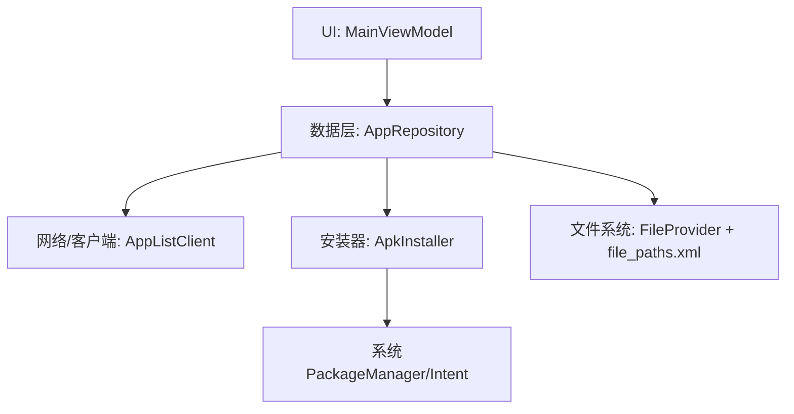
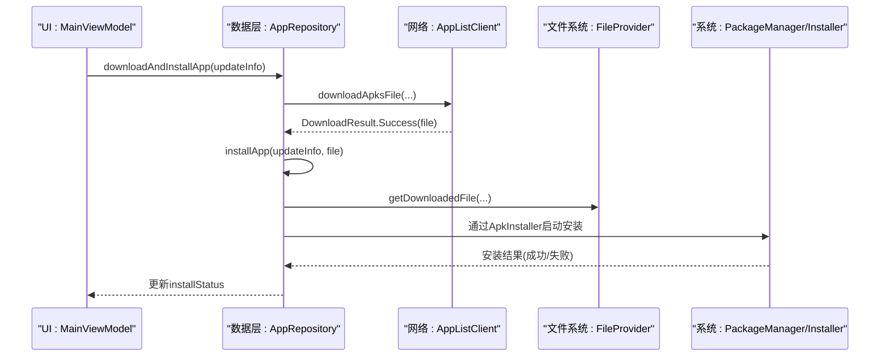
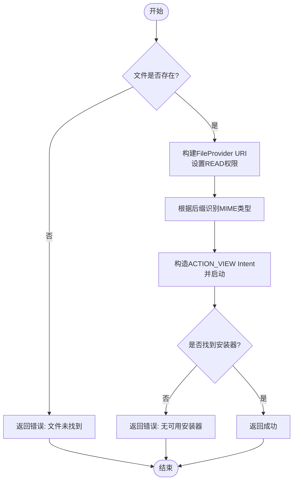
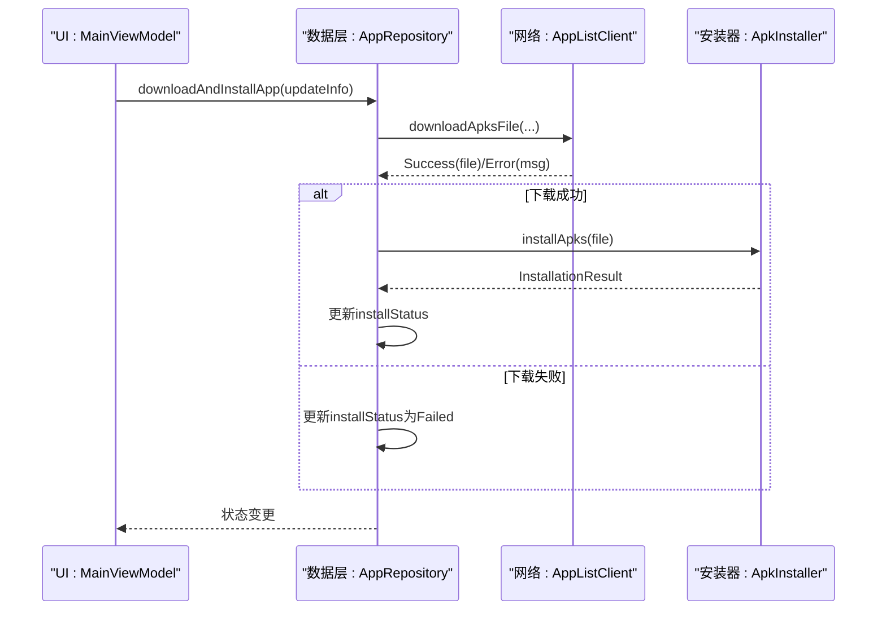
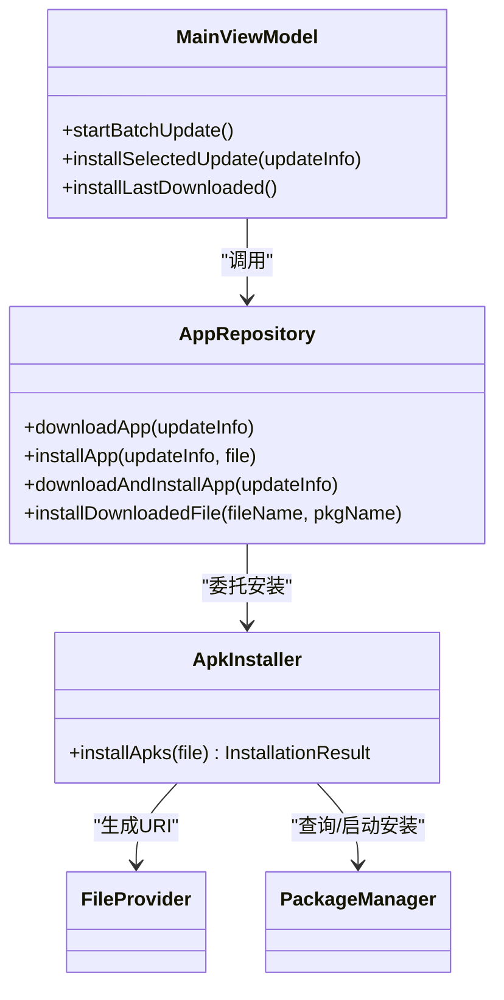

# APK安装器

<cite>
**本文引用的文件**
- [ApkInstaller.kt](file://app/src/main/java/com/lansync/app/data/installer/ApkInstaller.kt)
- [AppRepository.kt](file://app/src/main/java/com/lansync/app/data/repository/AppRepository.kt)
- [MainViewModel.kt](file://app/src/main/java/com/lansync/app/ui/viewmodel/MainViewModel.kt)
- [AndroidManifest.xml](file://app/src/main/AndroidManifest.xml)
- [file_paths.xml](file://app/src/main/res/xml/file_paths.xml)
</cite>

## 目录
1. [简介](#简介)
2. [项目结构](#项目结构)
3. [核心组件](#核心组件)
4. [架构总览](#架构总览)
5. [详细组件分析](#详细组件分析)
6. [依赖关系分析](#依赖关系分析)
7. [性能与兼容性考虑](#性能与兼容性考虑)
8. [故障排查指南](#故障排查指南)
9. [结论](#结论)
10. [附录：使用示例与最佳实践](#附录使用示例与最佳实践)

## 简介
本文件围绕LanSync应用中的APK安装器（ApkInstaller）进行系统化文档化，重点说明APK文件的安装流程管理、权限检查、安装会话创建、安装状态监听、错误处理等核心能力；解释如何处理不同Android版本的安装API差异、用户权限请求、安装进度回调等技术实现；并描述安装过程中的安全验证、冲突检测、回滚机制等重要特性。同时提供具体代码路径指引，帮助开发者快速定位实现并进行扩展。

## 项目结构
与APK安装相关的核心位置如下：
- 安装器实现：data/installer/ApkInstaller.kt
- 下载与安装编排：data/repository/AppRepository.kt
- UI层调用入口：ui/viewmodel/MainViewModel.kt
- 系统配置：AndroidManifest.xml（权限、FileProvider声明）、res/xml/file_paths.xml（可共享路径）

图表来源
- [MainViewModel.kt:245-289](file://app/src/main/java/com/lansync/app/ui/viewmodel/MainViewModel.kt#L245-L289)
- [AppRepository.kt:1029-1151](file://app/src/main/java/com/lansync/app/data/repository/AppRepository.kt#L1029-L1151)
- [ApkInstaller.kt:12-45](file://app/src/main/java/com/lansync/app/data/installer/ApkInstaller.kt#L12-L45)
- [AndroidManifest.xml:48-56](file://app/src/main/AndroidManifest.xml#L48-L56)
- [file_paths.xml:1-6](file://app/src/main/res/xml/file_paths.xml#L1-L6)

章节来源
- [AndroidManifest.xml:1-60](file://app/src/main/AndroidManifest.xml#L1-L60)
- [file_paths.xml:1-6](file://app/src/main/res/xml/file_paths.xml#L1-L6)

## 核心组件
- ApkInstaller：封装APK安装的核心逻辑，包括文件校验、MIME类型判断、通过ACTION_VIEW启动系统安装器、异常捕获与结果返回。
- AppRepository：负责下载APK、组装安装参数、协调安装流程、维护下载进度与安装状态流。
- MainViewModel：暴露给UI的接口，触发批量更新、单包安装、拉取远程应用并安装等操作。
- AndroidManifest与file_paths.xml：声明必要的权限与FileProvider共享路径，确保跨进程安全访问APK文件。

章节来源
- [ApkInstaller.kt:10-60](file://app/src/main/java/com/lansync/app/data/installer/ApkInstaller.kt#L10-L60)
- [AppRepository.kt:1029-1151](file://app/src/main/java/com/lansync/app/data/repository/AppRepository.kt#L1029-L1151)
- [MainViewModel.kt:245-289](file://app/src/main/java/com/lansync/app/ui/viewmodel/MainViewModel.kt#L245-L289)
- [AndroidManifest.xml:4-12, 48-56:4-12](file://app/src/main/AndroidManifest.xml#L4-L12)

## 架构总览
APK安装的整体流程由UI层发起，经Repository完成下载与状态管理，最终交由ApkInstaller调用系统安装器完成安装。

图表来源
- [MainViewModel.kt:245-289](file://app/src/main/java/com/lansync/app/ui/viewmodel/MainViewModel.kt#L245-L289)
- [AppRepository.kt:1029-1151](file://app/src/main/java/com/lansync/app/data/repository/AppRepository.kt#L1029-L1151)
- [ApkInstaller.kt:12-45](file://app/src/main/java/com/lansync/app/data/installer/ApkInstaller.kt#L12-L45)

## 详细组件分析

### ApkInstaller：安装器核心
职责
- 校验APK文件存在性与基本信息
- 生成安全的FileProvider URI并设置读取权限
- 根据后缀识别MIME类型（.apk/.apks）
- 通过ACTION_VIEW启动系统安装器
- 统一返回InstallationResult（Success/Error）

关键流程
- 文件不存在时直接返回错误
- 构造URI并查询是否有可用的安装Activity
- 若无可用安装器则返回错误
- 启动安装后返回成功（实际安装结果由系统决定）

图表来源
- [ApkInstaller.kt:12-45](file://app/src/main/java/com/lansync/app/data/installer/ApkInstaller.kt#L12-L45)

章节来源
- [ApkInstaller.kt:10-60](file://app/src/main/java/com/lansync/app/data/installer/ApkInstaller.kt#L10-L60)

### AppRepository：下载与安装编排
职责
- 下载APK并实时更新下载进度
- 校验下载结果并触发安装
- 维护installStatus流，供UI展示安装状态
- 支持从本地已下载文件列表直接安装

关键流程
- downloadApp：发起下载，更新DownloadProgress，处理成功/失败
- installApp：获取已下载文件，调用ApkInstaller安装，更新InstallStatus
- downloadAndInstallApp：串联下载与安装，统一错误处理
- installDownloadedFile：按文件名查找文件并安装

图表来源
- [AppRepository.kt:1029-1151](file://app/src/main/java/com/lansync/app/data/repository/AppRepository.kt#L1029-L1151)
- [ApkInstaller.kt:12-45](file://app/src/main/java/com/lansync/app/data/installer/ApkInstaller.kt#L12-L45)

章节来源
- [AppRepository.kt:1029-1151](file://app/src/main/java/com/lansync/app/data/repository/AppRepository.kt#L1029-L1151)

### MainViewModel：UI侧调用入口
职责
- 触发批量更新与单个应用安装
- 记录最近一次下载信息以便后续安装
- 清理安装状态与下载进度

关键方法
- startBatchUpdate：遍历选中项，逐个下载并安装，收集失败项
- installSelectedUpdate/installLastDownloaded：触发安装
- clearInstallStatus/clearDownloadProgress：重置状态

章节来源
- [MainViewModel.kt:245-289](file://app/src/main/java/com/lansync/app/ui/viewmodel/MainViewModel.kt#L245-L289)
- [MainViewModel.kt:276-313](file://app/src/main/java/com/lansync/app/ui/viewmodel/MainViewModel.kt#L276-L313)

### 权限与配置
- 权限声明：INTERNET、网络与WiFi相关权限、位置权限（用于局域网发现）、QUERY_ALL_PACKAGES（用于应用列表扫描）
- FileProvider：在Manifest中声明authorities与grantUriPermissions，并在file_paths.xml中定义可共享的缓存与下载目录

章节来源
- [AndroidManifest.xml:4-12, 48-56:4-12](file://app/src/main/AndroidManifest.xml#L4-L12)
- [file_paths.xml:1-6](file://app/src/main/res/xml/file_paths.xml#L1-L6)

## 依赖关系分析
- MainViewModel依赖AppRepository以执行下载与安装操作
- AppRepository依赖ApkInstaller执行系统安装流程
- ApkInstaller依赖系统PackageManager与Intent机制
- 所有文件访问通过FileProvider与file_paths.xml进行安全共享

图表来源
- [MainViewModel.kt:245-289](file://app/src/main/java/com/lansync/app/ui/viewmodel/MainViewModel.kt#L245-L289)
- [AppRepository.kt:1029-1151](file://app/src/main/java/com/lansync/app/data/repository/AppRepository.kt#L1029-L1151)
- [ApkInstaller.kt:12-45](file://app/src/main/java/com/lansync/app/data/installer/ApkInstaller.kt#L12-L45)

章节来源
- [MainViewModel.kt:245-289](file://app/src/main/java/com/lansync/app/ui/viewmodel/MainViewModel.kt#L245-L289)
- [AppRepository.kt:1029-1151](file://app/src/main/java/com/lansync/app/data/repository/AppRepository.kt#L1029-L1151)
- [ApkInstaller.kt:12-45](file://app/src/main/java/com/lansync/app/data/installer/ApkInstaller.kt#L12-L45)

## 性能与兼容性考虑
- 下载阶段：使用StateFlow实时推送进度，避免频繁UI刷新；下载完成后立即进入安装，减少中间态
- 安装阶段：通过ACTION_VIEW将安装交给系统，避免在不同Android版本上直接调用安装API带来的兼容性问题
- 文件共享：使用FileProvider与限定路径，提升安全性并满足Android 7+的文件共享限制
- 并发控制：批量更新时逐条处理，收集错误并汇总反馈，避免阻塞主流程
- 资源释放：安装完成后及时清理状态与进度，防止内存泄漏或状态污染

[本节为通用指导，不直接分析具体文件]

## 故障排查指南
常见问题与定位要点
- 文件未找到：检查download是否成功、getDownloadedFile是否能正确返回文件路径
- 无可用安装器：确认设备具备系统安装器或第三方安装器，且Intent可被解析
- 权限问题：确认FileProvider已正确声明，file_paths.xml包含对应目录
- 下载失败：检查网络权限、目标设备服务可用性、MD5校验是否通过
- 安装失败：系统可能因签名冲突、权限不足、未知来源限制等原因拒绝安装，需结合系统提示与日志进一步定位

章节来源
- [ApkInstaller.kt:12-45](file://app/src/main/java/com/lansync/app/data/installer/ApkInstaller.kt#L12-L45)
- [AppRepository.kt:1029-1151](file://app/src/main/java/com/lansync/app/data/repository/AppRepository.kt#L1029-L1151)
- [AndroidManifest.xml:48-56](file://app/src/main/AndroidManifest.xml#L48-L56)
- [file_paths.xml:1-6](file://app/src/main/res/xml/file_paths.xml#L1-L6)

## 结论
本项目采用“下载-安装”分离的架构：Repository负责下载与状态管理，ApkInstaller专注于调用系统安装器，从而规避多版本Android的安装API差异与权限复杂性。通过FileProvider安全共享文件、统一的InstallationResult与InstallStatus流，实现了可观测、可追踪、可扩展的安装流程。对于更复杂的场景（如Split APK、后台静默安装），可在当前基础上扩展ApkInstaller与Repository，增加会话管理与回滚策略。

[本节为总结性内容，不直接分析具体文件]

## 附录：使用示例与最佳实践

- 触发单个应用安装
  - 入口：MainViewModel.installSelectedUpdate / installLastDownloaded
  - 参考路径：[MainViewModel.kt:276-289](file://app/src/main/java/com/lansync/app/ui/viewmodel/MainViewModel.kt#L276-L289)

- 批量更新安装
  - 入口：MainViewModel.startBatchUpdate
  - 参考路径：[MainViewModel.kt:245-274](file://app/src/main/java/com/lansync/app/ui/viewmodel/MainViewModel.kt#L245-L274)

- 下载并安装
  - 入口：AppRepository.downloadAndInstallApp
  - 参考路径：[AppRepository.kt:1113-1122](file://app/src/main/java/com/lansync/app/data/repository/AppRepository.kt#L1113-L1122)

- 从本地已下载文件安装
  - 入口：AppRepository.installDownloadedFile
  - 参考路径：[AppRepository.kt:1137-1151](file://app/src/main/java/com/lansync/app/data/repository/AppRepository.kt#L1137-L1151)

- 安装器核心实现
  - 入口：ApkInstaller.installApks
  - 参考路径：[ApkInstaller.kt:12-45](file://app/src/main/java/com/lansync/app/data/installer/ApkInstaller.kt#L12-L45)

- 权限与文件共享配置
  - Manifest权限与FileProvider声明：[AndroidManifest.xml:4-12, 48-56:4-12](file://app/src/main/AndroidManifest.xml#L4-L12)
  - 可共享路径：[file_paths.xml:1-6](file://app/src/main/res/xml/file_paths.xml#L1-L6)

- 安装状态与进度监听
  - 下载进度：AppRepository.DownloadProgress（DOWNLOADING/VERIFYING/COMPLETED/FAILED）
  - 安装状态：AppRepository.InstallStatus（Installing/Success/Failed）
  - 参考路径：[AppRepository.kt:1155-1167](file://app/src/main/java/com/lansync/app/data/repository/AppRepository.kt#L1155-L1167)

- 常见异常处理建议
  - 文件不存在：在安装前校验文件存在性，必要时提示重新下载
  - 无安装器：提示用户安装系统或第三方安装器
  - 权限拒绝：引导用户授予必要权限或开启“允许安装未知来源”
  - 下载失败：重试机制与错误码映射，便于用户理解原因

[本节为使用指引，不直接分析具体文件]