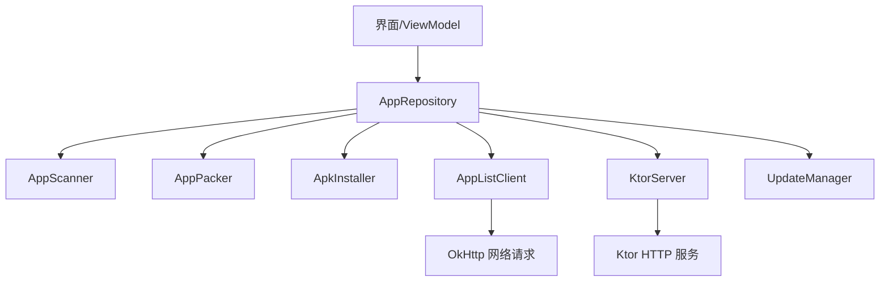
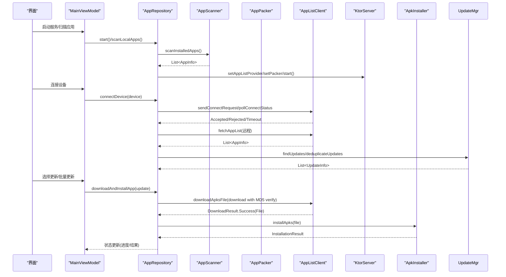
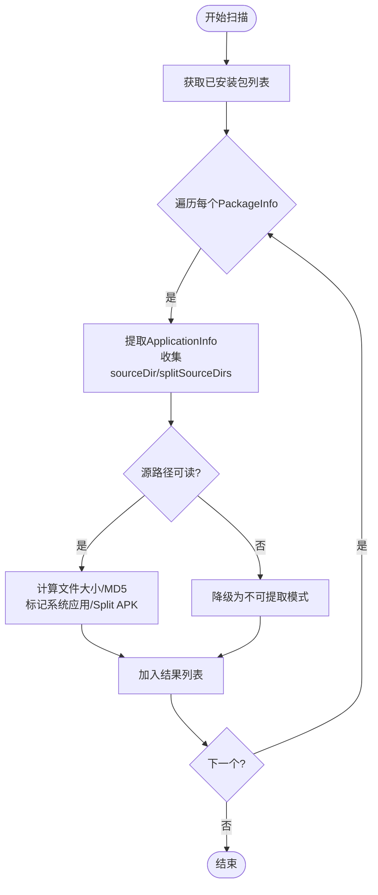
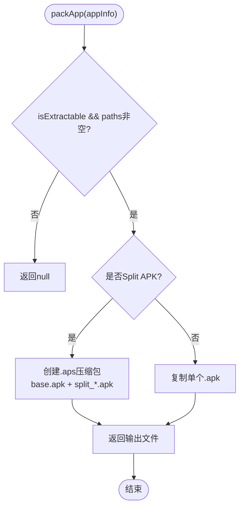
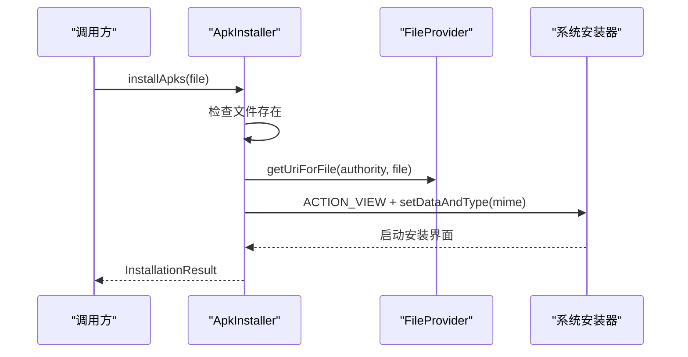
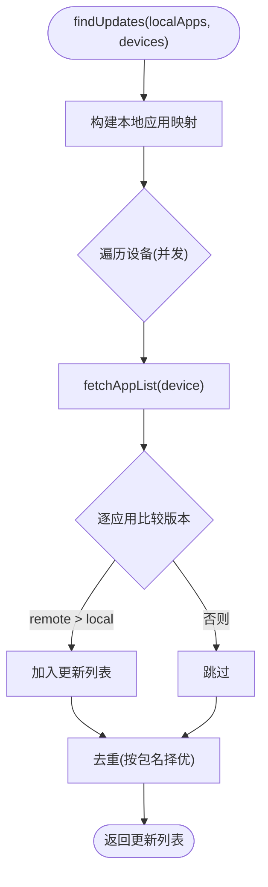
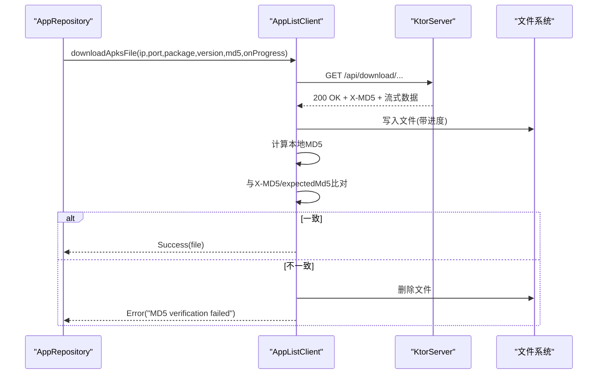
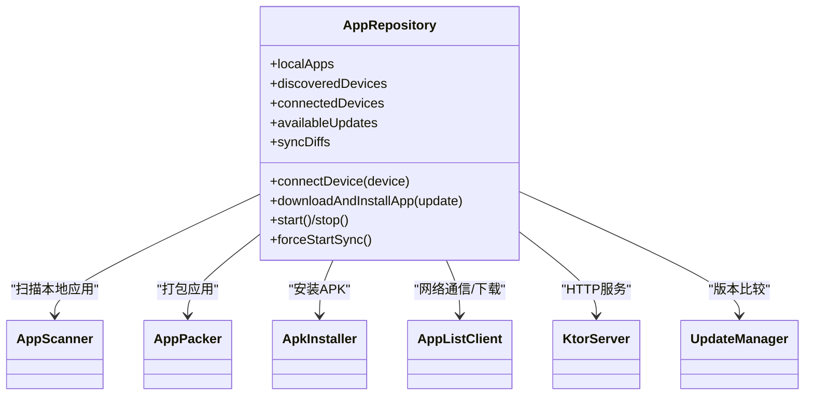
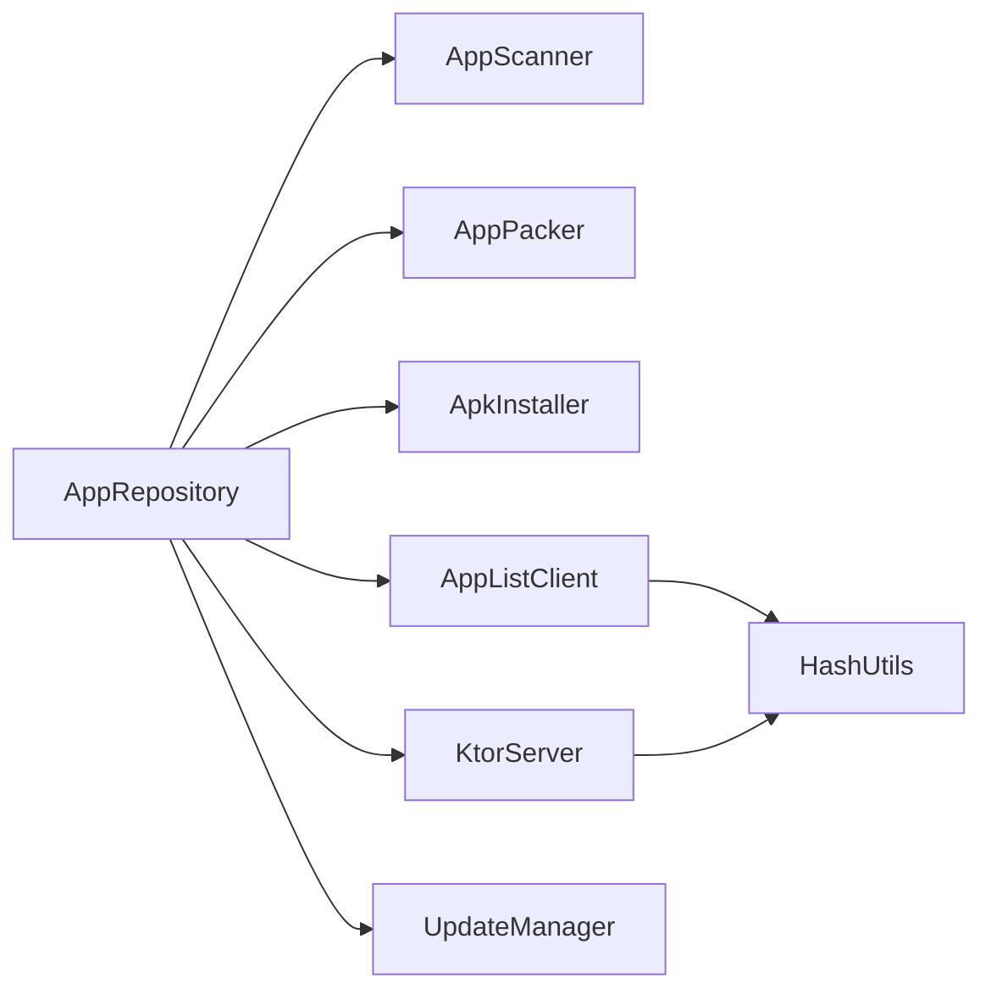

# 应用同步

<cite>
**本文引用的文件**
- [AppScanner.kt](file://app/src/main/java/com/lansync/app/data/scanner/AppScanner.kt)
- [AppPacker.kt](file://app/src/main/java/com/lansync/app/data/packer/AppPacker.kt)
- [ApkInstaller.kt](file://app/src/main/java/com/lansync/app/data/installer/ApkInstaller.kt)
- [Models.kt](file://app/src/main/java/com/lansync/app/data/model/Models.kt)
- [UpdateManager.kt](file://app/src/main/java/com/lansync/app/data/update/UpdateManager.kt)
- [AppListClient.kt](file://app/src/main/java/com/lansync/app/data/client/AppListClient.kt)
- [HashUtils.kt](file://app/src/main/java/com/lansync/app/data/HashUtils.kt)
- [AppRepository.kt](file://app/src/main/java/com/lansync/app/data/repository/AppRepository.kt)
- [KtorServer.kt](file://app/src/main/java/com/lansync/app/data/server/KtorServer.kt)
- [MainViewModel.kt](file://app/src/main/java/com/lansync/app/ui/viewmodel/MainViewModel.kt)
- [AppConfig.kt](file://app/src/main/java/com/lansync/app/data/AppConfig.kt)
</cite>

## 目录
1. [简介](#简介)
2. [项目结构](#项目结构)
3. [核心组件](#核心组件)
4. [架构总览](#架构总览)
5. [详细组件分析](#详细组件分析)
6. [依赖关系分析](#依赖关系分析)
7. [性能考量](#性能考量)
8. [故障排查指南](#故障排查指南)
9. [结论](#结论)
10. [附录：使用示例与异常处理](#附录使用示例与异常处理)

## 简介
本模块实现设备间的应用同步能力，涵盖本地应用扫描、APK打包/解包、远程设备发现与连接、版本比对、下载与安装等完整链路。重点包括：
- AppScanner：扫描本地已安装应用并提取关键元数据（包名、版本、源路径、MD5、是否可提取等）。
- AppPacker：将单包或Split APK打包为.apk/.apks，支持压缩与完整性校验。
- ApkInstaller：调用系统安装器完成安装，处理权限与MIME类型。
- UpdateManager + AppRepository：基于远程设备列表进行版本比较，生成更新项并触发下载与安装流程。
- AppListClient + KtorServer：提供HTTP接口用于应用列表查询、连接协商、文件下载等。

## 项目结构
- data层：封装扫描、打包、安装、网络客户端、服务器、配置、模型等能力。
- ui层：通过ViewModel聚合状态，驱动界面操作（启动/停止服务、连接设备、批量更新、拉取远程应用等）。
- 关键入口：AppRepository协调各子模块；MainViewModel暴露UI操作；KtorServer对外暴露REST API。

图表来源
- [AppRepository.kt:40-79](file://app/src/main/java/com/lansync/app/data/repository/AppRepository.kt#L40-L79)
- [AppListClient.kt:30-56](file://app/src/main/java/com/lansync/app/data/client/AppListClient.kt#L30-L56)
- [KtorServer.kt:30-86](file://app/src/main/java/com/lansync/app/data/server/KtorServer.kt#L30-L86)

章节来源
- [AppRepository.kt:40-79](file://app/src/main/java/com/lansync/app/data/repository/AppRepository.kt#L40-L79)
- [MainViewModel.kt:47-82](file://app/src/main/java/com/lansync/app/ui/viewmodel/MainViewModel.kt#L47-L82)

## 核心组件
- AppScanner：负责枚举系统已安装应用，提取包名、名称、版本、源路径、文件大小、MD5、是否系统应用、是否为Split APK等，并返回统一的数据模型。
- AppPacker：根据应用信息生成单个.apk或包含base与split的.apks文件，写入缓存目录，便于后续传输与安装。
- ApkInstaller：通过FileProvider构造URI，选择合适MIME类型，调用系统安装器执行安装。
- UpdateManager：对比本地与远程设备的应用版本，筛选出可更新的条目并进行去重。
- AppListClient：封装HTTP客户端，提供连接协商、应用列表获取、设备心跳、文件下载与完整性校验等功能。
- KtorServer：提供/api/applist、/api/download、/api/connect/*等接口，配合ConnectionManager完成握手与状态管理。
- AppRepository：编排上述组件，维护设备连接、心跳、定时同步、更新计算与下载/安装流程。

章节来源
- [AppScanner.kt:15-133](file://app/src/main/java/com/lansync/app/data/scanner/AppScanner.kt#L15-L133)
- [AppPacker.kt:14-113](file://app/src/main/java/com/lansync/app/data/packer/AppPacker.kt#L14-L113)
- [ApkInstaller.kt:10-60](file://app/src/main/java/com/lansync/app/data/installer/ApkInstaller.kt#L10-L60)
- [UpdateManager.kt:12-103](file://app/src/main/java/com/lansync/app/data/update/UpdateManager.kt#L12-L103)
- [AppListClient.kt:30-571](file://app/src/main/java/com/lansync/app/data/client/AppListClient.kt#L30-L571)
- [KtorServer.kt:30-200](file://app/src/main/java/com/lansync/app/data/server/KtorServer.kt#L30-L200)
- [AppRepository.kt:40-79](file://app/src/main/java/com/lansync/app/data/repository/AppRepository.kt#L40-L79)

## 架构总览
整体流程分为“扫描—连接—比较—下载—安装”五个阶段：
1. 扫描本地应用：AppScanner读取PackageManager，构建AppInfo列表。
2. 设备发现与连接：KtorServer暴露API，AppListClient发起连接请求与轮询，建立双向通信。
3. 版本比较：UpdateManager对比本地与远程设备的应用版本，生成UpdateInfo集合。
4. 下载：AppListClient从远端下载.apk/.apks，结合X-MD5与本地计算校验完整性。
5. 安装：ApkInstaller通过系统安装器完成安装，返回结果供上层处理。

图表来源
- [AppRepository.kt:386-484](file://app/src/main/java/com/lansync/app/data/repository/AppRepository.kt#L386-L484)
- [AppListClient.kt:62-133](file://app/src/main/java/com/lansync/app/data/client/AppListClient.kt#L62-L133)
- [AppListClient.kt:228-254](file://app/src/main/java/com/lansync/app/data/client/AppListClient.kt#L228-L254)
- [UpdateManager.kt:14-103](file://app/src/main/java/com/lansync/app/data/update/UpdateManager.kt#L14-L103)
- [AppListClient.kt:358-462](file://app/src/main/java/com/lansync/app/data/client/AppListClient.kt#L358-L462)
- [ApkInstaller.kt:12-45](file://app/src/main/java/com/lansync/app/data/installer/ApkInstaller.kt#L12-L45)

## 详细组件分析

### AppScanner：应用扫描机制
- 功能要点
  - 使用PackageManager获取已安装包列表，兼容不同Android版本。
  - 对每个PackageInfo提取ApplicationInfo，尝试读取sourceDir与splitSourceDirs，构建sourcePaths。
  - 计算总文件大小与MD5（多文件合并哈希），标记是否系统应用、是否Split APK。
  - 若无法访问源路径或抛出安全异常，降级为不可提取模式，仅保留基础元数据。
- 复杂度与性能
  - 遍历所有已安装包，时间复杂度O(N)，N为应用数量。
  - 文件I/O与MD5计算在IO线程执行，避免阻塞主线程。
- 错误处理
  - 捕获SecurityException与通用异常，降级为不可提取模式，确保扫描不中断。
  - 记录过滤掉的数量，便于诊断。

图表来源
- [AppScanner.kt:21-47](file://app/src/main/java/com/lansync/app/data/scanner/AppScanner.kt#L21-L47)
- [AppScanner.kt:49-133](file://app/src/main/java/com/lansync/app/data/scanner/AppScanner.kt#L49-L133)

章节来源
- [AppScanner.kt:15-133](file://app/src/main/java/com/lansync/app/data/scanner/AppScanner.kt#L15-L133)

### AppPacker：APK打包与完整性验证
- 功能要点
  - 单包应用：直接复制源.apk到缓存目录。
  - Split APK：创建.apks压缩包，首项命名为base.apk，其余按顺序命名split_*.apk。
  - 写入过程中同时计算MD5摘要，便于后续校验。
  - 提供清理缓存方法。
- 完整性验证
  - 打包时累计MD5，但实际下载侧以服务端X-MD5与本地计算双重校验为主。
- 错误处理
  - 捕获SecurityException与IO异常，记录日志并删除失败产物。

图表来源
- [AppPacker.kt:20-56](file://app/src/main/java/com/lansync/app/data/packer/AppPacker.kt#L20-L56)
- [AppPacker.kt:58-108](file://app/src/main/java/com/lansync/app/data/packer/AppPacker.kt#L58-L108)

章节来源
- [AppPacker.kt:14-113](file://app/src/main/java/com/lansync/app/data/packer/AppPacker.kt#L14-L113)
- [HashUtils.kt:6-54](file://app/src/main/java/com/lansync/app/data/HashUtils.kt#L6-L54)

### ApkInstaller：安装管理器与权限处理
- 功能要点
  - 检查文件存在性，使用FileProvider生成URI。
  - 根据扩展名设置MIME类型（.apks为application/zip，.apk为package-archive）。
  - 添加读权限标志与新任务栈标志，调用系统安装器。
  - 若无可用安装器则返回错误。
- 权限与安全
  - 通过FLAG_GRANT_READ_URI_PERMISSION授予临时读取权限。
  - 依赖系统安装器处理签名校验与用户授权。

图表来源
- [ApkInstaller.kt:12-54](file://app/src/main/java/com/lansync/app/data/installer/ApkInstaller.kt#L12-L54)

章节来源
- [ApkInstaller.kt:10-60](file://app/src/main/java/com/lansync/app/data/installer/ApkInstaller.kt#L10-L60)

### UpdateManager：版本比较与去重
- 功能要点
  - 并行获取远程设备应用列表并与本地映射对比，筛选remote.versionCode > local.versionCode的更新项。
  - 忽略系统应用。
  - 对同一包名的多个更新进行去重，优先选择更高版本，版本相同则按设备名排序选择更优提供者。
- 复杂度
  - 对每个设备并发抓取列表，总体复杂度O(D*R)，D为设备数，R为远程应用数。

图表来源
- [UpdateManager.kt:14-103](file://app/src/main/java/com/lansync/app/data/update/UpdateManager.kt#L14-L103)

章节来源
- [UpdateManager.kt:12-103](file://app/src/main/java/com/lansync/app/data/update/UpdateManager.kt#L12-L103)

### AppListClient：网络客户端与下载校验
- 功能要点
  - 连接协商：发送请求、轮询状态、响应接受/拒绝。
  - 应用列表获取：GET /api/applist。
  - 心跳检测：GET /api/ping。
  - 文件下载：GET /api/download/{packageName}/{versionCode}或latest，带X-MD5头，本地计算MD5校验一致性。
  - 下载进度回调与文件管理（列出、删除、按文件名查找）。
- 错误处理
  - HTTP错误、空体、MD5不一致均返回错误结果，并删除不完整文件。

图表来源
- [AppListClient.kt:358-462](file://app/src/main/java/com/lansync/app/data/client/AppListClient.kt#L358-L462)
- [KtorServer.kt:177-200](file://app/src/main/java/com/lansync/app/data/server/KtorServer.kt#L177-L200)

章节来源
- [AppListClient.kt:30-571](file://app/src/main/java/com/lansync/app/data/client/AppListClient.kt#L30-L571)

### AppRepository：同步编排与状态管理
- 功能要点
  - 初始化并组合各子模块（Scanner、Packer、Server、Client、Installer、UpdateManager）。
  - 设备发现与连接：发送连接请求、轮询状态、建立心跳与定时同步。
  - 自动更新计算：当本地与应用列表就绪时，触发版本比较与差异计算。
  - 下载与安装：封装下载进度与安装状态，向UI暴露StateFlow。
- 连接生命周期
  - CONNECTING -> CONNECTED -> RECONNECTING -> CONNECTION_TIMEOUT -> DISCONNECTED。
  - 支持端口迁移与快速重连。

图表来源
- [AppRepository.kt:40-79](file://app/src/main/java/com/lansync/app/data/repository/AppRepository.kt#L40-L79)
- [AppRepository.kt:134-249](file://app/src/main/java/com/lansync/app/data/repository/AppRepository.kt#L134-L249)
- [AppRepository.kt:386-484](file://app/src/main/java/com/lansync/app/data/repository/AppRepository.kt#L386-L484)

章节来源
- [AppRepository.kt:40-79](file://app/src/main/java/com/lansync/app/data/repository/AppRepository.kt#L40-L79)
- [AppRepository.kt:134-249](file://app/src/main/java/com/lansync/app/data/repository/AppRepository.kt#L134-L249)
- [AppRepository.kt:386-484](file://app/src/main/java/com/lansync/app/data/repository/AppRepository.kt#L386-L484)

## 依赖关系分析
- 组件耦合
  - AppRepository作为中枢，耦合Scanner、Packer、Installer、Client、Server、UpdateManager。
  - AppListClient依赖OkHttp与JSON序列化；KtorServer依赖Ktor框架与ConnectionManager。
  - HashUtils被Scanner与Client共同使用，保证MD5计算一致性。
- 外部依赖
  - Android PackageManager、FileProvider、系统安装器。
  - OkHttp与Ktor网络栈。
- 潜在循环依赖
  - 当前设计无循环依赖；Repository单向依赖其他模块。

图表来源
- [AppRepository.kt:40-79](file://app/src/main/java/com/lansync/app/data/repository/AppRepository.kt#L40-L79)
- [AppListClient.kt:30-56](file://app/src/main/java/com/lansync/app/data/client/AppListClient.kt#L30-L56)
- [KtorServer.kt:30-86](file://app/src/main/java/com/lansync/app/data/server/KtorServer.kt#L30-L86)
- [HashUtils.kt:6-54](file://app/src/main/java/com/lansync/app/data/HashUtils.kt#L6-L54)

章节来源
- [AppRepository.kt:40-79](file://app/src/main/java/com/lansync/app/data/repository/AppRepository.kt#L40-L79)

## 性能考量
- 并发与线程
  - 扫描、打包、下载、网络请求均在IO线程执行，避免阻塞UI。
  - 设备列表获取采用并发任务，提升多设备场景效率。
- I/O优化
  - 使用缓冲读写（8KB/64KB）减少系统调用次数。
  - 分块写入与进度回调，降低大文件内存占用。
- 网络优化
  - 连接池复用，合理设置超时与重试策略。
  - 心跳与定时同步间隔可配置，平衡实时性与资源消耗。
- 存储优化
  - 打包与下载文件存放于缓存目录，提供清理接口。

[本节为通用指导，无需特定文件引用]

## 故障排查指南
- 扫描失败或结果为空
  - 检查是否有系统保护应用导致不可提取；查看日志中过滤数量。
  - 参考：[AppScanner.kt:49-133](file://app/src/main/java/com/lansync/app/data/scanner/AppScanner.kt#L49-L133)
- 打包失败
  - 确认源路径可读；检查SecurityException与IO异常日志；清理缓存后重试。
  - 参考：[AppPacker.kt:20-56](file://app/src/main/java/com/lansync/app/data/packer/AppPacker.kt#L20-L56)
- 下载失败或MD5不一致
  - 检查服务端X-MD5与本地计算值；确认网络稳定与目标文件存在。
  - 参考：[AppListClient.kt:358-462](file://app/src/main/java/com/lansync/app/data/client/AppListClient.kt#L358-L462)
- 安装失败
  - 确认系统安装器可用；检查MIME类型与URI权限；查看安装器返回的错误信息。
  - 参考：[ApkInstaller.kt:12-54](file://app/src/main/java/com/lansync/app/data/installer/ApkInstaller.kt#L12-L54)
- 连接超时或被拒绝
  - 检查目标设备是否在线、端口是否正确；查看轮询日志与拒绝原因。
  - 参考：[AppListClient.kt:62-133](file://app/src/main/java/com/lansync/app/data/client/AppListClient.kt#L62-L133)

章节来源
- [AppScanner.kt:49-133](file://app/src/main/java/com/lansync/app/data/scanner/AppScanner.kt#L49-L133)
- [AppPacker.kt:20-56](file://app/src/main/java/com/lansync/app/data/packer/AppPacker.kt#L20-L56)
- [AppListClient.kt:358-462](file://app/src/main/java/com/lansync/app/data/client/AppListClient.kt#L358-L462)
- [ApkInstaller.kt:12-54](file://app/src/main/java/com/lansync/app/data/installer/ApkInstaller.kt#L12-L54)
- [AppListClient.kt:62-133](file://app/src/main/java/com/lansync/app/data/client/AppListClient.kt#L62-L133)

## 结论
该同步模块通过清晰的职责划分与模块化设计，实现了从本地扫描到远程设备版本比较、下载与安装的完整链路。AppScanner确保元数据准确，AppPacker保障文件打包与完整性，ApkInstaller简化安装流程，UpdateManager与AppRepository协同完成高效同步。结合KtorServer与AppListClient提供的HTTP能力，系统在局域网环境下具备高可用性与易扩展性。

[本节为总结，无需特定文件引用]

## 附录：使用示例与异常处理

### 典型同步流程示例
- 启动服务与初始扫描
  - 调用MainViewModel.autoStart，若无本地缓存则触发扫描；随后启动服务。
  - 参考：[MainViewModel.kt:60-82](file://app/src/main/java/com/lansync/app/ui/viewmodel/MainViewModel.kt#L60-L82)
- 连接远程设备
  - 调用connectDevice，内部发送连接请求并轮询状态，成功后建立心跳与定时同步。
  - 参考：[AppRepository.kt:386-484](file://app/src/main/java/com/lansync/app/data/repository/AppRepository.kt#L386-L484)
- 获取远程应用列表
  - 通过AppListClient.fetchAppList获取远程设备应用信息。
  - 参考：[AppListClient.kt:228-254](file://app/src/main/java/com/lansync/app/data/client/AppListClient.kt#L228-L254)
- 版本比较与更新提示
  - UpdateManager.findUpdates生成更新项，AppRepository.recalculateUpdates去重并更新UI状态。
  - 参考：[UpdateManager.kt:14-103](file://app/src/main/java/com/lansync/app/data/update/UpdateManager.kt#L14-L103)
- 下载与安装
  - 调用downloadAndInstallApp，内部执行下载（含MD5校验）与安装。
  - 参考：[AppListClient.kt:358-462](file://app/src/main/java/com/lansync/app/data/client/AppListClient.kt#L358-L462)
  - 参考：[ApkInstaller.kt:12-54](file://app/src/main/java/com/lansync/app/data/installer/ApkInstaller.kt#L12-L54)

### 常见异常处理
- 连接超时
  - 轮询超时返回Timeout，UI显示错误消息；支持快速重连。
  - 参考：[AppListClient.kt:104-133](file://app/src/main/java/com/lansync/app/data/client/AppListClient.kt#L104-L133)
- 下载MD5不一致
  - 删除不完整文件并返回错误；建议重试或检查网络。
  - 参考：[AppListClient.kt:445-453](file://app/src/main/java/com/lansync/app/data/client/AppListClient.kt#L445-L453)
- 安装器不可用
  - 返回错误；提示用户安装第三方安装器或检查系统设置。
  - 参考：[ApkInstaller.kt:32-44](file://app/src/main/java/com/lansync/app/data/installer/ApkInstaller.kt#L32-L44)
- 系统/受保护应用不可提取
  - 服务端返回禁止；UI提示无法传输。
  - 参考：[KtorServer.kt:177-189](file://app/src/main/java/com/lansync/app/data/server/KtorServer.kt#L177-L189)

章节来源
- [MainViewModel.kt:60-82](file://app/src/main/java/com/lansync/app/ui/viewmodel/MainViewModel.kt#L60-L82)
- [AppRepository.kt:386-484](file://app/src/main/java/com/lansync/app/data/repository/AppRepository.kt#L386-L484)
- [AppListClient.kt:228-254](file://app/src/main/java/com/lansync/app/data/client/AppListClient.kt#L228-L254)
- [UpdateManager.kt:14-103](file://app/src/main/java/com/lansync/app/data/update/UpdateManager.kt#L14-L103)
- [AppListClient.kt:358-462](file://app/src/main/java/com/lansync/app/data/client/AppListClient.kt#L358-L462)
- [ApkInstaller.kt:12-54](file://app/src/main/java/com/lansync/app/data/installer/ApkInstaller.kt#L12-L54)
- [KtorServer.kt:177-189](file://app/src/main/java/com/lansync/app/data/server/KtorServer.kt#L177-L189)