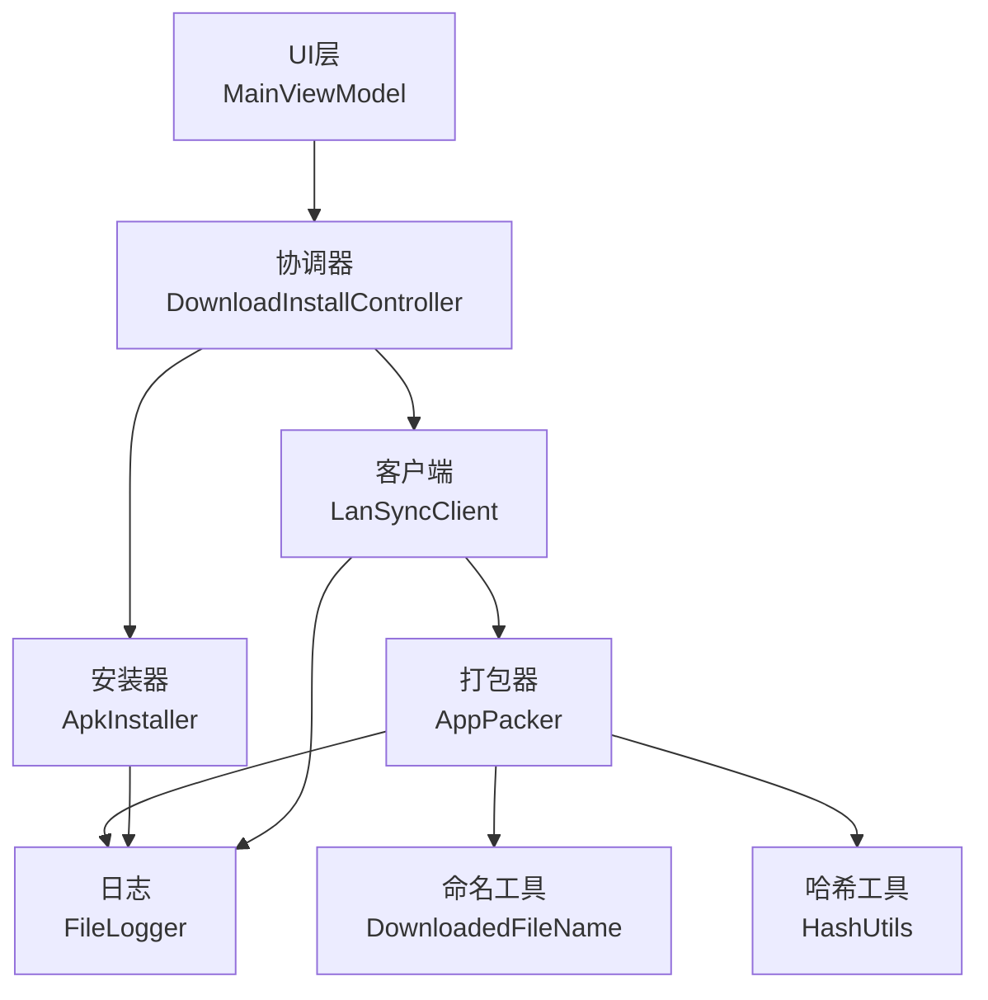
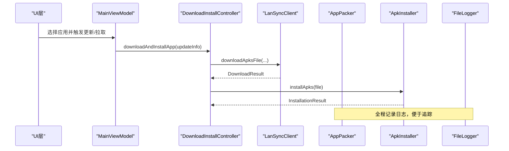
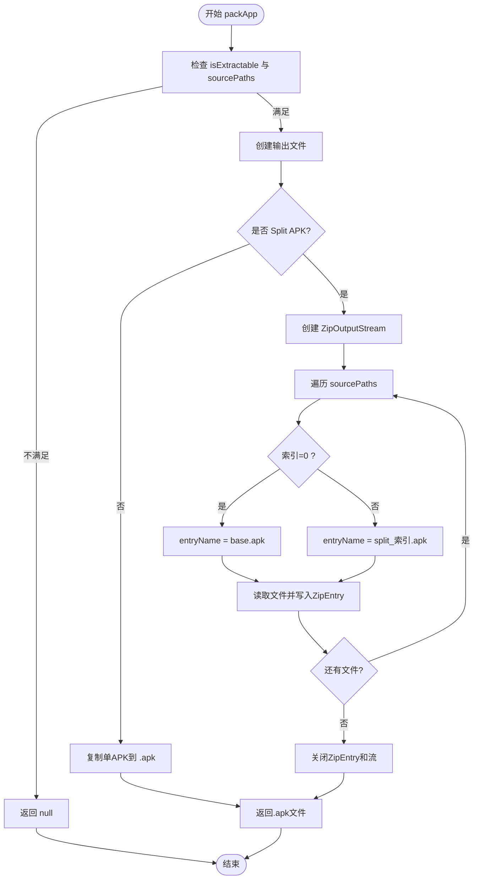
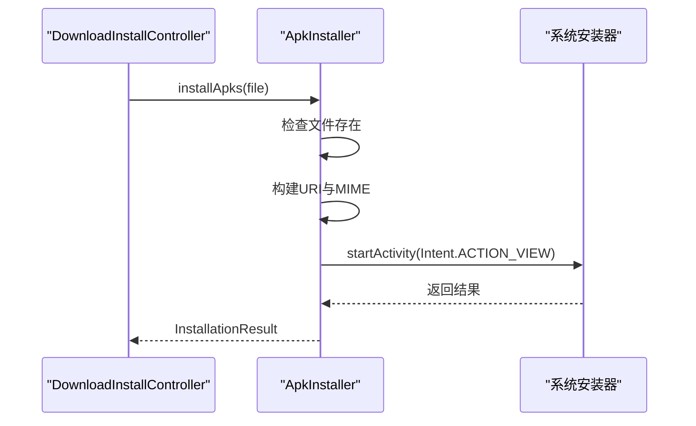
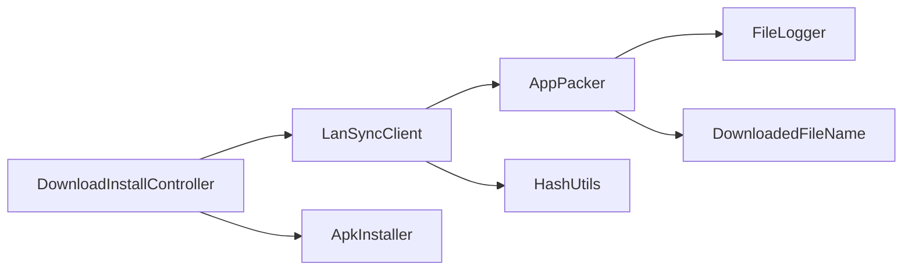

# 应用打包器

<cite>
**本文引用的文件**
- [AppPacker.kt](file://app/src/main/java/com/lansync/app/data/transfer/AppPacker.kt)
- [DownloadedFileName.kt](file://app/src/main/java/com/lansync/app/data/transfer/DownloadedFileName.kt)
- [LanSyncClient.kt](file://app/src/main/java/com/lansync/app/data/transfer/LanSyncClient.kt)
- [DownloadInstallController.kt](file://app/src/main/java/com/lansync/app/data/transfer/DownloadInstallController.kt)
- [ApkInstaller.kt](file://app/src/main/java/com/lansync/app/data/installer/ApkInstaller.kt)
- [HashUtils.kt](file://app/src/main/java/com/lansync/app/data/HashUtils.kt)
- [Models.kt](file://app/src/main/java/com/lansync/app/data/model/Models.kt)
- [FileLogger.kt](file://app/src/main/java/com/lansync/app/data/FileLogger.kt)
- [MainViewModel.kt](file://app/src/main/java/com/lansync/app/ui/viewmodel/MainViewModel.kt)
</cite>

## 更新摘要
**变更内容**
- AppPacker 从 `data/packer/AppPacker.kt` 迁移到 `data/transfer/AppPacker.kt`
- 重构了包结构，将打包功能整合到传输模块中
- 移除了113行的旧实现，采用更简洁的新实现（85行）
- 新增 DownloadedFileName 工具类统一文件命名逻辑
- 改进的输出目录构造注入，支持JVM单元测试
- 移除死代码，优化哈希处理逻辑

## 目录
1. [简介](#简介)
2. [项目结构](#项目结构)
3. [核心组件](#核心组件)
4. [架构总览](#架构总览)
5. [详细组件分析](#详细组件分析)
6. [依赖关系分析](#依赖关系分析)
7. [性能与内存管理](#性能与内存管理)
8. [故障排查指南](#故障排查指南)
9. [结论](#结论)
10. [附录：使用示例](#附录使用示例)

## 简介
本文件面向LanSync中的"应用打包器"模块，聚焦APK文件的打包与解包能力，覆盖以下关键点：
- 单文件APK复制与多文件Split APK的压缩打包（生成.apks）
- 文件完整性校验（MD5）
- 解压流程管理与错误处理
- Split APK格式、文件路径映射与命名约定
- 打包过程中的进度跟踪、日志记录与内存管理
- 安装入口与异常场景处理
- 结合UI与仓库层的使用示例

**更新** 应用打包器已重构并迁移至 `data/transfer` 包，采用新的实现方式，提供更清晰的职责分离和更好的可测试性。

## 项目结构
围绕打包与安装的核心代码分布在数据层与UI/仓库层之间：
- 数据传输层
  - AppPacker：负责将本地应用的源文件打包为单个.apk或Split APK集合.apks
  - DownloadedFileName：统一的文件命名与包名解析工具
  - LanSyncClient：HTTP客户端，负责下载和传输
  - DownloadInstallController：下载/安装协调器
- 安装层
  - ApkInstaller：通过系统安装器打开并安装.apk/.apks
- 工具层
  - HashUtils：提供MD5哈希计算，用于完整性校验
  - FileLogger：异步落盘日志，支持日志轮转
  - Models：定义AppInfo等数据结构，包含isSplitApk、sourcePaths等关键信息
- UI与仓库层
  - MainViewModel：协调下载、安装等操作，维护UI状态

**图表来源**
- [AppPacker.kt:24-85](file://app/src/main/java/com/lansync/app/data/transfer/AppPacker.kt#L24-L85)
- [DownloadedFileName.kt:11-64](file://app/src/main/java/com/lansync/app/data/transfer/DownloadedFileName.kt#L11-L64)
- [LanSyncClient.kt:66-448](file://app/src/main/java/com/lansync/app/data/transfer/LanSyncClient.kt#L66-L448)
- [DownloadInstallController.kt:19-111](file://app/src/main/java/com/lansync/app/data/transfer/DownloadInstallController.kt#L19-L111)
- [ApkInstaller.kt:10-61](file://app/src/main/java/com/lansync/app/data/installer/ApkInstaller.kt#L10-L61)

**章节来源**
- [AppPacker.kt:24-85](file://app/src/main/java/com/lansync/app/data/transfer/AppPacker.kt#L24-L85)
- [DownloadedFileName.kt:11-64](file://app/src/main/java/com/lansync/app/data/transfer/DownloadedFileName.kt#L11-L64)
- [LanSyncClient.kt:66-448](file://app/src/main/java/com/lansync/app/data/transfer/LanSyncClient.kt#L66-L448)
- [DownloadInstallController.kt:19-111](file://app/src/main/java/com/lansync/app/data/transfer/DownloadInstallController.kt#L19-L111)
- [ApkInstaller.kt:10-61](file://app/src/main/java/com/lansync/app/data/installer/ApkInstaller.kt#L10-L61)

## 核心组件
- AppPacker
  - 功能：根据AppInfo判断是否可提取与是否为Split APK，分别执行单APK复制或生成.apks压缩包；输出到缓存目录；失败时清理临时产物
  - 关键行为：
    - 单APK：直接复制源文件到目标.apk
    - Split APK：按顺序写入ZipEntry，首项命名为base.apk，后续为split_序号.apk
    - 线程模型：在IO调度器中执行，避免阻塞主线程
    - 输出目录构造注入：支持JVM单元测试
- DownloadedFileName
  - 功能：统一的文件命名与包名解析工具
  - 关键方法：serverArtifactName、defaultDownloadName、parsePackageName、resolveDownloadedFile
- LanSyncClient
  - 功能：HTTP客户端，负责配对、查询、通知、下载等功能
  - 关键特性：新MD5语义（决策D1），X-MD5作为唯一权威校验
- DownloadInstallController
  - 功能：下载/安装协调器，封装下载和安装的完整流程
  - 关键方法：downloadApp、installApp、downloadAndInstallApp
- ApkInstaller
  - 功能：通过系统安装器打开.apk或.apks；根据扩展名设置MIME类型；无可用安装器时返回错误
- HashUtils
  - 功能：对文件或路径列表计算MD5；支持批量路径聚合哈希
- FileLogger
  - 功能：异步队列+互斥写文件；日志轮转与备份；提供d/i/w/e/json等接口
- Models
  - 关键字段：AppInfo包含packageName、versionCode、sourcePaths、md5、isExtractable、isSplitApk等

**章节来源**
- [AppPacker.kt:24-85](file://app/src/main/java/com/lansync/app/data/transfer/AppPacker.kt#L24-L85)
- [DownloadedFileName.kt:11-64](file://app/src/main/java/com/lansync/app/data/transfer/DownloadedFileName.kt#L11-L64)
- [LanSyncClient.kt:66-448](file://app/src/main/java/com/lansync/app/data/transfer/LanSyncClient.kt#L66-L448)
- [DownloadInstallController.kt:19-111](file://app/src/main/java/com/lansync/app/data/transfer/DownloadInstallController.kt#L19-L111)
- [ApkInstaller.kt:10-61](file://app/src/main/java/com/lansync/app/data/installer/ApkInstaller.kt#L10-L61)
- [HashUtils.kt:6-54](file://app/src/main/java/com/lansync/app/data/HashUtils.kt#L6-L54)
- [FileLogger.kt:19-167](file://app/src/main/java/com/lansync/app/data/FileLogger.kt#L19-L167)
- [Models.kt:5-17](file://app/src/main/java/com/lansync/app/data/model/Models.kt#L5-L17)

## 架构总览
打包与安装的端到端流程如下：
- 触发点：
  - 用户操作：通过UI选择应用，触发下载与安装
  - 网络请求：服务端收到下载请求后触发打包并返回文件
- 处理链：
  - DownloadInstallController协调下载与安装
  - LanSyncClient负责网络通信和文件下载
  - AppPacker根据AppInfo决定打包策略（单APK或Split APK）
  - ApkInstaller通过系统安装器完成安装
  - Logger记录全过程，便于问题定位

**图表来源**
- [MainViewModel.kt:47-413](file://app/src/main/java/com/lansync/app/ui/viewmodel/MainViewModel.kt#L47-L413)
- [DownloadInstallController.kt:70-77](file://app/src/main/java/com/lansync/app/data/transfer/DownloadInstallController.kt#L70-L77)
- [LanSyncClient.kt:278-301](file://app/src/main/java/com/lansync/app/data/transfer/LanSyncClient.kt#L278-L301)
- [AppPacker.kt:31-50](file://app/src/main/java/com/lansync/app/data/transfer/AppPacker.kt#L31-L50)
- [ApkInstaller.kt:12-45](file://app/src/main/java/com/lansync/app/data/installer/ApkInstaller.kt#L12-L45)
- [FileLogger.kt:90-104](file://app/src/main/java/com/lansync/app/data/FileLogger.kt#L90-L104)

## 详细组件分析

### AppPacker：重构后的打包逻辑与Split APK处理
**更新** 应用打包器已重构并迁移至 `data/transfer` 包，采用更简洁的实现方式

- 输入：AppInfo（包含sourcePaths、isSplitApk、isExtractable、versionCode等）
- 输出：File（.apk或.apks），失败返回null
- 关键流程：
  - 校验isExtractable与sourcePaths非空
  - 单APK：复制源文件至目标.apk
  - Split APK：创建ZipOutputStream，逐文件写入ZipEntry；首项base.apk，后续split_序号.apk
  - 异常处理：捕获异常，记录日志并删除失败产物
  - 缓存清理：clearCache方法递归删除缓存目录内容
- 重构改进：
  - 输出目录构造注入，支持JVM单元测试
  - 移除死代码（不再计算MD5，由服务端实时计算）
  - 命名统一走DownloadedFileName.serverArtifactName

**图表来源**
- [AppPacker.kt:31-74](file://app/src/main/java/com/lansync/app/data/transfer/AppPacker.kt#L31-L74)

**章节来源**
- [AppPacker.kt:31-74](file://app/src/main/java/com/lansync/app/data/transfer/AppPacker.kt#L31-L74)

### DownloadedFileName：统一的文件命名工具
**新增** 新的文件命名工具类，消除重复实现

- 功能：统一的文件命名与包名解析工具
- 关键方法：
  - serverArtifactName：生成服务端打包产物名称
  - defaultDownloadName：生成客户端下载兜底名称
  - parsePackageName：从文件名反推包名
  - resolveDownloadedFile：按包名+版本精确匹配已下载文件
- 特点：纯函数、无Android依赖，可独立单测

**章节来源**
- [DownloadedFileName.kt:11-64](file://app/src/main/java/com/lansync/app/data/transfer/DownloadedFileName.kt#L11-L64)

### LanSyncClient：增强的HTTP客户端
**更新** 实现了新的MD5语义（决策D1）

- 功能：HTTP客户端，负责配对、查询、通知、下载等功能
- 关键特性：
  - 新MD5语义：下载校验以响应头X-MD5为唯一权威
  - 无Android Context依赖：下载目录与OkHttpClient均构造注入
  - 文件命名/包名解析统一走DownloadedFileName
  - 错误文案不回显e.message，异常细节只进FileLogger
- 关键方法：
  - sendConnectRequest：发送配对请求
  - pollConnectStatus：轮询配对状态
  - downloadApksFile：下载APK文件
  - getDownloadedFiles：获取已下载文件列表

**章节来源**
- [LanSyncClient.kt:66-448](file://app/src/main/java/com/lansync/app/data/transfer/LanSyncClient.kt#L66-L448)

### DownloadInstallController：下载/安装协调器
**新增** 独立的协调器类，封装完整的下载安装流程

- 功能：下载/安装协调器，旧AppRepository中相关职责的重写
- 关键方法：
  - downloadApp：下载指定应用
  - installApp：安装指定应用
  - downloadAndInstallApp：下载并安装应用
  - getDownloadedFiles：获取已下载文件列表
- 状态管理：维护下载进度和安装状态的StateFlow

**章节来源**
- [DownloadInstallController.kt:19-111](file://app/src/main/java/com/lansync/app/data/transfer/DownloadInstallController.kt#L19-L111)

### ApkInstaller：安装流程与MIME类型
- 输入：File（.apk或.apks）
- 输出：InstallationResult（Success或Error）
- 关键流程：
  - 检查文件存在性
  - 通过FileProvider获取URI，设置MIME类型（.apks为application/zip，.apk为package-archive）
  - 启动系统安装器Intent；若无可用安装器则返回错误
  - 异常捕获并记录日志

**图表来源**
- [DownloadInstallController.kt:60-68](file://app/src/main/java/com/lansync/app/data/transfer/DownloadInstallController.kt#L60-L68)
- [ApkInstaller.kt:12-54](file://app/src/main/java/com/lansync/app/data/installer/ApkInstaller.kt#L12-L54)

**章节来源**
- [ApkInstaller.kt:12-54](file://app/src/main/java/com/lansync/app/data/installer/ApkInstaller.kt#L12-L54)

### HashUtils：完整性校验
- 功能：对文件或路径列表计算MD5
- 特点：
  - 单文件：读取文件流并更新摘要
  - 多路径：聚合多个文件的摘要，便于整体校验
  - 异常保护：捕获异常并返回null或忽略错误路径

**章节来源**
- [HashUtils.kt:6-54](file://app/src/main/java/com/lansync/app/data/HashUtils.kt#L6-L54)

### Models：数据结构
- AppInfo关键字段：
  - packageName、appName、versionName、versionCode
  - sourcePaths：源文件路径列表（可能为空或包含多个Split APK）
  - md5：完整性哈希
  - isExtractable：是否允许打包
  - fileSize：文件大小
  - isSystemApp、isSplitApk：标识系统应用与分包类型

**章节来源**
- [Models.kt:5-17](file://app/src/main/java/com/lansync/app/data/model/Models.kt#L5-L17)

## 依赖关系分析
**更新** 重构后的依赖关系更加清晰

- 组件耦合：
  - DownloadInstallController依赖LanSyncClient与ApkInstaller，形成下载-安装的流水线
  - AppPacker依赖FileLogger与DownloadedFileName进行日志与命名
  - LanSyncClient依赖HashUtils进行完整性校验
- 外部依赖：
  - Android系统API：ZipOutputStream、MessageDigest、FileProvider、PackageManager
  - Kotlin协程：withContext、Dispatchers.IO、StateFlow
  - OkHttp：HTTP客户端库
- 潜在循环依赖：未发现明显循环依赖

**图表来源**
- [DownloadInstallController.kt:19-111](file://app/src/main/java/com/lansync/app/data/transfer/DownloadInstallController.kt#L19-L111)
- [LanSyncClient.kt:66-448](file://app/src/main/java/com/lansync/app/data/transfer/LanSyncClient.kt#L66-L448)
- [AppPacker.kt:24-85](file://app/src/main/java/com/lansync/app/data/transfer/AppPacker.kt#L24-L85)
- [ApkInstaller.kt:10-61](file://app/src/main/java/com/lansync/app/data/installer/ApkInstaller.kt#L10-L61)

**章节来源**
- [DownloadInstallController.kt:19-111](file://app/src/main/java/com/lansync/app/data/transfer/DownloadInstallController.kt#L19-L111)
- [LanSyncClient.kt:66-448](file://app/src/main/java/com/lansync/app/data/transfer/LanSyncClient.kt#L66-L448)
- [AppPacker.kt:24-85](file://app/src/main/java/com/lansync/app/data/transfer/AppPacker.kt#L24-L85)
- [ApkInstaller.kt:10-61](file://app/src/main/java/com/lansync/app/data/installer/ApkInstaller.kt#L10-L61)

## 性能与内存管理
- I/O缓冲：
  - 读写采用固定大小缓冲区（如8192字节），降低大文件处理的内存占用
- 并发与调度：
  - 使用Dispatchers.IO执行I/O密集型任务，避免阻塞主线程
  - FileLogger使用Channel与互斥锁保证安全写入与日志轮转
- 资源释放：
  - 使用use块确保InputStream/OutputStream/ZipOutputStream正确关闭
- 压缩算法：
  - 当前实现基于ZipOutputStream，未显式指定压缩级别；如需优化体积或速度，可在创建ZipEntry时调整压缩参数
- 内存峰值控制：
  - 流式读取与写入，避免一次性加载整个文件到内存
  - 对于Split APK打包，逐文件写入ZipEntry，控制内存增长

## 故障排查指南
- 常见错误与处理：
  - 文件不可读：AppPacker在读取前检查canRead()，跳过不可读文件并记录警告
  - 权限不足：捕获SecurityException并记录日志
  - 无可用安装器：ApkInstaller检测到无安装器时返回错误
  - 下载失败：DownloadInstallController在下载阶段设置失败状态并记录错误
- 日志定位：
  - 使用FileLogger的i/w/e方法查看关键步骤日志
  - 日志文件位于应用外部存储目录，支持自动轮转与备份
- 调试建议：
  - 检查AppInfo的isExtractable与sourcePaths是否正确
  - 确认Split APK的sourcePaths顺序与数量
  - 验证.apks文件名与base.apk/split_*.apk命名是否符合预期
  - 检查X-MD5响应头是否正确传递

**章节来源**
- [AppPacker.kt:31-74](file://app/src/main/java/com/lansync/app/data/transfer/AppPacker.kt#L31-L74)
- [ApkInstaller.kt:12-54](file://app/src/main/java/com/lansync/app/data/installer/ApkInstaller.kt#L12-L54)
- [FileLogger.kt:90-104](file://app/src/main/java/com/lansync/app/data/FileLogger.kt#L90-L104)

## 结论
本模块实现了完整的APK打包与安装能力，支持单APK与Split APK两种模式，具备完整性校验、错误处理与日志记录机制。通过重构，应用打包器已迁移至 `data/transfer` 包，采用更简洁的实现方式和更好的职责分离。新增的DownloadedFileName工具类统一了文件命名逻辑，DownloadInstallController提供了更清晰的下载/安装协调功能。未来可考虑引入更灵活的压缩策略与进度回调，以提升用户体验与性能。

## 附录：使用示例
以下为典型使用场景的步骤说明（不包含具体代码片段）：

- 打包单个APK
  - 准备AppInfo，确保isExtractable为true且sourcePaths包含单个APK路径
  - 调用AppPacker.packApp(appInfo)，返回.apk文件路径
  - 使用ApkInstaller.installApks(file)进行安装
  - 参考路径：[AppPacker.kt:31-50](file://app/src/main/java/com/lansync/app/data/transfer/AppPacker.kt#L31-L50)、[ApkInstaller.kt:12-45](file://app/src/main/java/com/lansync/app/data/installer/ApkInstaller.kt#L12-L45)

- 打包Split APK
  - 准备AppInfo，isSplitApk为true且sourcePaths包含多个APK文件
  - 调用AppPacker.packApp(appInfo)，返回.apks文件路径
  - 使用ApkInstaller.installApks(file)进行安装
  - 参考路径：[AppPacker.kt:41-42](file://app/src/main/java/com/lansync/app/data/transfer/AppPacker.kt#L41-L42)、[ApkInstaller.kt:12-45](file://app/src/main/java/com/lansync/app/data/installer/ApkInstaller.kt#L12-L45)

- 通过网络请求触发打包
  - 客户端发起GET /api/download/{packageName}
  - 服务端查找应用并调用AppPacker打包
  - 成功则返回ZIP文件流，失败返回错误文本
  - 参考路径：[LanSyncClient.kt:278-301](file://app/src/main/java/com/lansync/app/data/transfer/LanSyncClient.kt#L278-L301)

- 完整性校验
  - 使用HashUtils.md5(paths)对多个源文件路径计算聚合MD5
  - 用于对比下载前后或传输前后的文件一致性
  - 参考路径：[HashUtils.kt:6-54](file://app/src/main/java/com/lansync/app/data/HashUtils.kt#L6-L54)

- 批量更新与拉取
  - 通过MainViewModel.startBatchUpdate或pullSelectedRemoteApps触发
  - DownloadInstallController协调下载与安装，更新UI状态
  - 参考路径：[DownloadInstallController.kt:70-77](file://app/src/main/java/com/lansync/app/data/transfer/DownloadInstallController.kt#L70-L77)

- 文件命名与解析
  - 使用DownloadedFileName.serverArtifactName生成服务端产物名称
  - 使用DownloadedFileName.parsePackageName从文件名解析包名
  - 参考路径：[DownloadedFileName.kt:19-49](file://app/src/main/java/com/lansync/app/data/transfer/DownloadedFileName.kt#L19-L49)

**章节来源**
- [AppPacker.kt:31-50](file://app/src/main/java/com/lansync/app/data/transfer/AppPacker.kt#L31-L50)
- [ApkInstaller.kt:12-45](file://app/src/main/java/com/lansync/app/data/installer/ApkInstaller.kt#L12-L45)
- [LanSyncClient.kt:278-301](file://app/src/main/java/com/lansync/app/data/transfer/LanSyncClient.kt#L278-L301)
- [HashUtils.kt:6-54](file://app/src/main/java/com/lansync/app/data/HashUtils.kt#L6-L54)
- [DownloadInstallController.kt:70-77](file://app/src/main/java/com/lansync/app/data/transfer/DownloadInstallController.kt#L70-L77)
- [DownloadedFileName.kt:19-49](file://app/src/main/java/com/lansync/app/data/transfer/DownloadedFileName.kt#L19-L49)