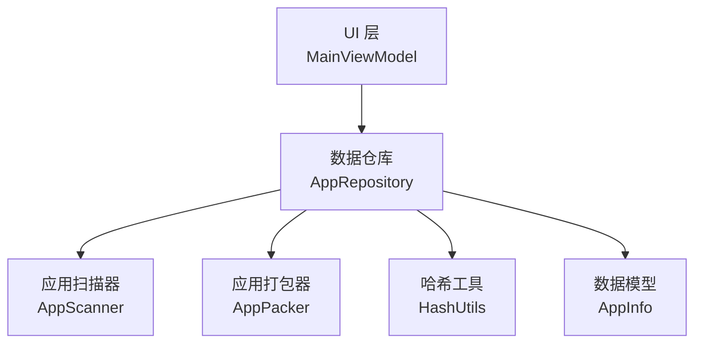
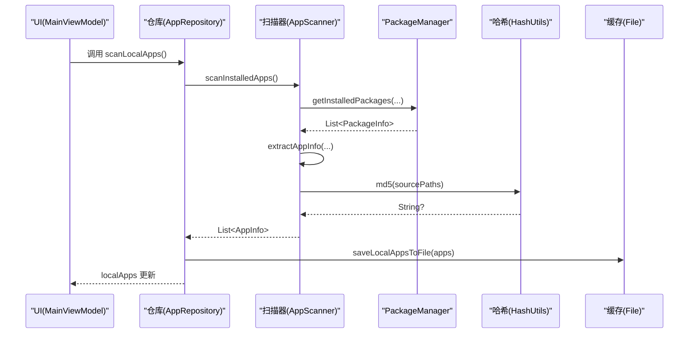
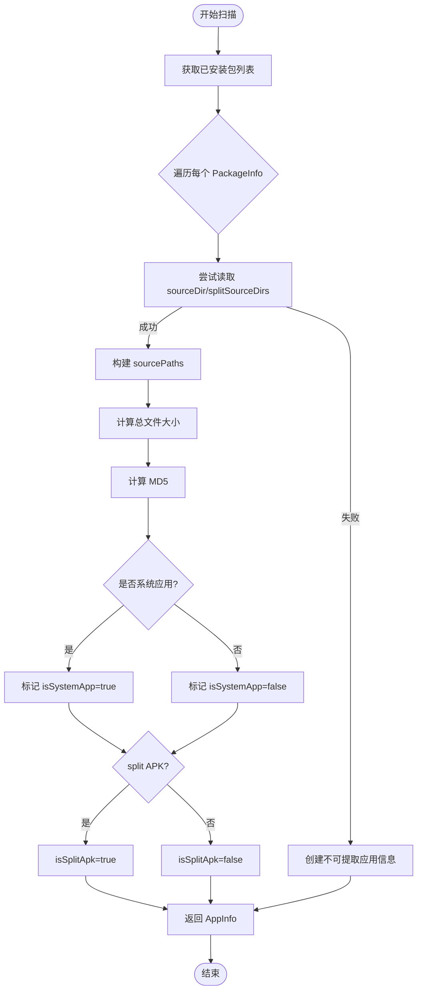
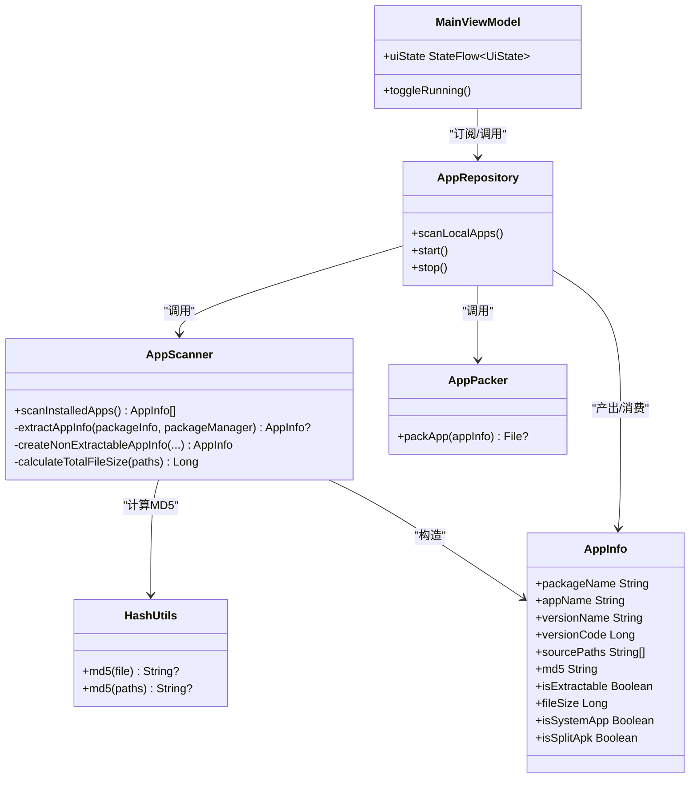

# 应用扫描器

<cite>
**本文引用的文件**
- [AppScanner.kt](file://app/src/main/java/com/lansync/app/data/scanner/AppScanner.kt)
- [Models.kt](file://app/src/main/java/com/lansync/app/data/model/Models.kt)
- [HashUtils.kt](file://app/src/main/java/com/lansync/app/data/HashUtils.kt)
- [AppPacker.kt](file://app/src/main/java/com/lansync/app/data/packer/AppPacker.kt)
- [AppRepository.kt](file://app/src/main/java/com/lansync/app/data/repository/AppRepository.kt)
- [MainViewModel.kt](file://app/src/main/java/com/lansync/app/ui/viewmodel/MainViewModel.kt)
</cite>

## 目录
1. [简介](#简介)
2. [项目结构](#项目结构)
3. [核心组件](#核心组件)
4. [架构总览](#架构总览)
5. [详细组件分析](#详细组件分析)
6. [依赖关系分析](#依赖关系分析)
7. [性能考虑](#性能考虑)
8. [故障排查指南](#故障排查指南)
9. [结论](#结论)
10. [附录：使用示例与最佳实践](#附录使用示例与最佳实践)

## 简介
本文件为 LanSync 项目中“应用扫描器”的详细技术文档，聚焦于如何扫描本地已安装的应用程序。内容涵盖：
- 使用 PackageManager 获取应用列表并兼容不同 Android 版本
- 提取应用信息（包名、应用名、版本号、文件大小等）
- 处理可提取与不可提取的应用程序
- Split APK 的支持机制
- MD5 哈希计算、系统应用识别、文件路径处理
- 结合仓库层与 UI 层的调用流程与异常处理

## 项目结构
应用扫描相关代码位于 data 层，由 Repository 层统一编排，UI 层通过 ViewModel 触发扫描流程。关键文件如下：
- scanner: AppScanner.kt 负责底层扫描逻辑
- model: Models.kt 定义 AppInfo 等数据模型
- packer: AppPacker.kt 负责打包单个或 split APK
- repository: AppRepository.kt 协调扫描、缓存、网络同步
- ui/viewmodel: MainViewModel.kt 暴露 UI 状态与操作入口

图表来源
- [AppRepository.kt:40-80](file://app/src/main/java/com/lansync/app/data/repository/AppRepository.kt#L40-L80)
- [AppScanner.kt:15-47](file://app/src/main/java/com/lansync/app/data/scanner/AppScanner.kt#L15-L47)
- [AppPacker.kt:14-56](file://app/src/main/java/com/lansync/app/data/packer/AppPacker.kt#L14-L56)
- [HashUtils.kt:6-24](file://app/src/main/java/com/lansync/app/data/HashUtils.kt#L6-L24)
- [Models.kt:5-17](file://app/src/main/java/com/lansync/app/data/model/Models.kt#L5-L17)

章节来源
- [AppRepository.kt:40-80](file://app/src/main/java/com/lansync/app/data/repository/AppRepository.kt#L40-L80)
- [MainViewModel.kt:60-82](file://app/src/main/java/com/lansync/app/ui/viewmodel/MainViewModel.kt#L60-L82)

## 核心组件
- AppScanner：封装对 PackageManager 的调用，遍历已安装包，提取应用信息，处理 split APK，计算 MD5 与文件大小，识别系统应用。
- AppInfo：描述一个应用的元数据，包括是否可提取、是否为 split APK、MD5、文件大小、系统应用标记等。
- HashUtils：提供单文件或路径列表的 MD5 计算，支持流式读取与异常保护。
- AppPacker：将单个 APK 或 split APK 打包为 .apk 或 .apks 文件，供下载与传输。
- AppRepository：协调扫描、缓存、设备连接与更新检测；对外暴露 scanLocalApps()。
- MainViewModel：在应用启动时自动执行初始扫描，并将扫描结果暴露给 UI。

章节来源
- [AppScanner.kt:15-133](file://app/src/main/java/com/lansync/app/data/scanner/AppScanner.kt#L15-L133)
- [Models.kt:5-17](file://app/src/main/java/com/lansync/app/data/model/Models.kt#L5-L17)
- [HashUtils.kt:6-54](file://app/src/main/java/com/lansync/app/data/HashUtils.kt#L6-L54)
- [AppPacker.kt:14-114](file://app/src/main/java/com/lansync/app/data/packer/AppPacker.kt#L14-L114)
- [AppRepository.kt:854-896](file://app/src/main/java/com/lansync/app/data/repository/AppRepository.kt#L854-L896)
- [MainViewModel.kt:60-82](file://app/src/main/java/com/lansync/app/ui/viewmodel/MainViewModel.kt#L60-L82)

## 架构总览
应用扫描的整体流程从 UI 层发起，经 Repository 调度到 AppScanner 完成底层扫描，再回写至 StateFlow 供 UI 消费。同时，扫描结果会被持久化缓存，并在有新应用或应用移除时清理图标缓存并通知远端设备刷新。

图表来源
- [AppRepository.kt:854-896](file://app/src/main/java/com/lansync/app/data/repository/AppRepository.kt#L854-L896)
- [AppScanner.kt:21-47](file://app/src/main/java/com/lansync/app/data/scanner/AppScanner.kt#L21-L47)
- [HashUtils.kt:16-24](file://app/src/main/java/com/lansync/app/data/HashUtils.kt#L16-L24)

## 详细组件分析

### AppScanner：应用扫描核心
职责
- 使用 PackageManager.getInstalledPackages 获取所有已安装包，兼容 Android TIRAMISU 及更早版本。
- 遍历 PackageInfo/ApplicationInfo，尝试读取 sourceDir 与 splitSourceDirs，构建 sourcePaths。
- 若无法读取源文件路径或抛出安全异常，则降级为不可提取应用信息。
- 计算应用总大小、MD5，判断是否系统应用与是否 split APK。

兼容性
- 针对 Android 13+ 使用带标志的 getInstalledPackages 调用，避免权限问题。

可提取与不可提取应用
- 可提取：能访问 sourceDir/splitSourceDirs，可计算 MD5 与文件大小。
- 不可提取：无法访问源文件路径或发生 SecurityException，返回空 sourcePaths、md5 为空串、文件大小为 0。

Split APK 支持
- 收集 base.apk 与各 split 模块路径，sourcePaths.size > 1 即视为 split APK。
- 后续打包器会按 split 模式生成 .apks。

系统应用识别
- 通过 ApplicationInfo.flags 与 FLAG_SYSTEM 位判断 isSystemApp。

文件路径处理
- 仅添加可读路径，忽略不可读路径；计算大小时捕获异常并计为 0。

图表来源
- [AppScanner.kt:21-133](file://app/src/main/java/com/lansync/app/data/scanner/AppScanner.kt#L21-L133)

章节来源
- [AppScanner.kt:21-133](file://app/src/main/java/com/lansync/app/data/scanner/AppScanner.kt#L21-L133)

### AppInfo：应用数据模型
字段说明
- packageName：包名
- appName：应用显示名称
- versionName/versionCode：版本名与版本码
- sourcePaths：源文件路径列表（base 与 split）
- md5：基于 sourcePaths 计算的 MD5
- isExtractable：是否可提取（能否访问源文件）
- fileSize：源文件总大小
- isSystemApp：是否系统应用
- isSplitApk：是否为 split APK

用途
- 作为扫描结果的核心载体，贯穿打包、下载、安装、对比更新等流程。

章节来源
- [Models.kt:5-17](file://app/src/main/java/com/lansync/app/data/model/Models.kt#L5-L17)

### HashUtils：MD5 计算
能力
- 单文件 MD5：hashFile 流式读取，避免大文件内存占用。
- 多路径 MD5：对多个源文件路径依次更新摘要，最终拼接为十六进制字符串。
- 异常保护：任何 IO 或算法异常均返回 null 或记录日志，保证扫描稳定性。

注意
- 当 sourcePaths 为空或不可读时，md5 可能为空串或 null，上层需做判空处理。

章节来源
- [HashUtils.kt:6-54](file://app/src/main/java/com/lansync/app/data/HashUtils.kt#L6-L54)

### AppPacker：打包单个或 split APK
行为
- 若 isExtractable=false 或 sourcePaths 为空，直接跳过并返回 null。
- 若 isSplitApk=true，将所有源文件写入 .apks（base.apk + split_*.apk）。
- 否则复制单个 .apk 文件。
- 过程中记录日志，异常时删除临时文件并返回 null。

与扫描的关系
- 依赖 AppScanner 提供的 sourcePaths 与 isSplitApk 标记，确保正确打包。

章节来源
- [AppPacker.kt:14-114](file://app/src/main/java/com/lansync/app/data/packer/AppPacker.kt#L14-L114)

### AppRepository：扫描编排与缓存
职责
- 提供 scanLocalApps() 方法，封装扫描、缓存、图标预加载与远端通知。
- 维护本地应用列表 StateFlow，供 UI 订阅。
- 在扫描完成后保存 JSON 缓存，并在应用新增/移除时清理图标缓存。
- 通知已连接设备刷新应用列表，保持两端一致。

扫描流程要点
- 先尝试从缓存加载，再调用 AppScanner 进行真实扫描。
- 将扫描结果写入缓存，并触发图标预加载与远端刷新通知。

章节来源
- [AppRepository.kt:854-896](file://app/src/main/java/com/lansync/app/data/repository/AppRepository.kt#L854-L896)
- [AppRepository.kt:920-946](file://app/src/main/java/com/lansync/app/data/repository/AppRepository.kt#L920-L946)

### MainViewModel：UI 入口与自动扫描
行为
- 应用启动时检查是否存在本地应用缓存，若无则触发初始扫描。
- 无论是否有缓存，都会启动服务并执行扫描。
- 将仓库的状态（本地应用列表、扫描中标志等）映射到 UI 状态。

章节来源
- [MainViewModel.kt:60-82](file://app/src/main/java/com/lansync/app/ui/viewmodel/MainViewModel.kt#L60-L82)
- [MainViewModel.kt:84-124](file://app/src/main/java/com/lansync/app/ui/viewmodel/MainViewModel.kt#L84-L124)

## 依赖关系分析
- AppScanner 依赖 PackageManager 与 HashUtils，输出 AppInfo。
- AppRepository 组合 AppScanner、AppPacker、文件系统缓存与网络客户端，对外暴露统一 API。
- MainViewModel 依赖 AppRepository 暴露的 StateFlow，驱动界面更新。

图表来源
- [AppScanner.kt:15-133](file://app/src/main/java/com/lansync/app/data/scanner/AppScanner.kt#L15-L133)
- [HashUtils.kt:6-54](file://app/src/main/java/com/lansync/app/data/HashUtils.kt#L6-L54)
- [Models.kt:5-17](file://app/src/main/java/com/lansync/app/data/model/Models.kt#L5-L17)
- [AppRepository.kt:40-80](file://app/src/main/java/com/lansync/app/data/repository/AppRepository.kt#L40-L80)
- [AppPacker.kt:14-114](file://app/src/main/java/com/lansync/app/data/packer/AppPacker.kt#L14-L114)
- [MainViewModel.kt:47-124](file://app/src/main/java/com/lansync/app/ui/viewmodel/MainViewModel.kt#L47-L124)

## 性能考虑
- 扫描在 IO 线程执行，避免阻塞主线程。
- 文件读取采用固定缓冲大小流式处理，降低内存峰值。
- 多路径 MD5 计算顺序累加摘要，减少重复对象创建。
- 扫描结果持久化缓存，减少重复扫描开销；仅在新增/移除应用时清理图标缓存。
- 对不可读路径与安全异常进行容错，避免整体扫描失败。

[本节为通用性能建议，不直接分析具体文件]

## 故障排查指南
常见问题与定位
- 扫描结果为空或部分应用缺失
  - 检查 PackageManager.getInstalledPackages 返回值与日志统计（总数 vs 过滤后数量）。
  - 确认 sourceDir/splitSourceDirs 是否可读；不可读将降级为不可提取应用。
- MD5 为空或错误
  - 检查 HashUtils.md5(paths) 是否因异常返回 null；确认路径存在且可读。
- 无法打包 split APK
  - 确认 isSplitApk=true 且 sourcePaths.size>1；查看 AppPacker 日志中的 SecurityException 或 IO 异常。
- 系统应用误判
  - 核对 ApplicationInfo.flags 与 FLAG_SYSTEM 的判断逻辑。
- 缓存不一致
  - 检查 AppRepository 的缓存读写逻辑与图标缓存清理时机。

章节来源
- [AppScanner.kt:32-47](file://app/src/main/java/com/lansync/app/data/scanner/AppScanner.kt#L32-L47)
- [HashUtils.kt:16-24](file://app/src/main/java/com/lansync/app/data/HashUtils.kt#L16-L24)
- [AppPacker.kt:31-56](file://app/src/main/java/com/lansync/app/data/packer/AppPacker.kt#L31-L56)
- [AppRepository.kt:854-896](file://app/src/main/java/com/lansync/app/data/repository/AppRepository.kt#L854-L896)

## 结论
本项目的应用扫描器以 AppScanner 为核心，结合 HashUtils 与 AppPacker，实现了对本地已安装应用的全面扫描与后续打包能力。通过 AppRepository 的统一编排与 MainViewModel 的 UI 集成，提供了稳定、可扩展的扫描体验，并妥善处理了不同 Android 版本的兼容性与 split APK 场景。

[本节为总结性内容，不直接分析具体文件]

## 附录：使用示例与最佳实践
以下示例展示如何在应用中触发扫描、处理结果与异常情况。为避免泄露实现细节，仅提供调用路径与步骤说明。

- 触发本地应用扫描
  - 在 ViewModel 中调用仓库的扫描接口，等待扫描完成并更新 UI 状态。
  - 参考调用链：MainViewModel -> AppRepository.scanLocalApps() -> AppScanner.scanInstalledApps()
  - 参考路径
    - [MainViewModel.kt:60-82](file://app/src/main/java/com/lansync/app/ui/viewmodel/MainViewModel.kt#L60-L82)
    - [AppRepository.kt:854-896](file://app/src/main/java/com/lansync/app/data/repository/AppRepository.kt#L854-L896)
    - [AppScanner.kt:21-47](file://app/src/main/java/com/lansync/app/data/scanner/AppScanner.kt#L21-L47)

- 处理可提取与不可提取应用
  - 根据 AppInfo.isExtractable 分支处理：可提取应用可进行打包与传输；不可提取应用仅保留基本信息。
  - 参考路径
    - [AppScanner.kt:49-122](file://app/src/main/java/com/lansync/app/data/scanner/AppScanner.kt#L49-L122)
    - [Models.kt:5-17](file://app/src/main/java/com/lansync/app/data/model/Models.kt#L5-L17)

- 处理 split APK
  - 当 AppInfo.isSplitApk=true 时，使用打包器生成 .apks；否则生成 .apk。
  - 参考路径
    - [AppPacker.kt:31-56](file://app/src/main/java/com/lansync/app/data/packer/AppPacker.kt#L31-L56)

- 计算与应用 MD5
  - 使用 HashUtils.md5(paths) 计算多路径 MD5；若返回 null，记录日志并降级处理。
  - 参考路径
    - [HashUtils.kt:16-24](file://app/src/main/java/com/lansync/app/data/HashUtils.kt#L16-L24)

- 系统应用识别
  - 依据 ApplicationInfo.flags 判断 isSystemApp，用于过滤或特殊处理。
  - 参考路径
    - [AppScanner.kt:74-86](file://app/src/main/java/com/lansync/app/data/scanner/AppScanner.kt#L74-L86)

- 文件路径处理与异常防护
  - 仅添加可读路径；计算大小时捕获异常并计为 0；打包时捕获 SecurityException 并记录日志。
  - 参考路径
    - [AppScanner.kt:52-66](file://app/src/main/java/com/lansync/app/data/scanner/AppScanner.kt#L52-L66)
    - [AppScanner.kt:124-132](file://app/src/main/java/com/lansync/app/data/scanner/AppScanner.kt#L124-L132)
    - [AppPacker.kt:71-108](file://app/src/main/java/com/lansync/app/data/packer/AppPacker.kt#L71-L108)

- 缓存与一致性
  - 扫描后将结果写入缓存；新增/移除应用时清理图标缓存；通知远端设备刷新。
  - 参考路径
    - [AppRepository.kt:854-896](file://app/src/main/java/com/lansync/app/data/repository/AppRepository.kt#L854-L896)
    - [AppRepository.kt:920-946](file://app/src/main/java/com/lansync/app/data/repository/AppRepository.kt#L920-L946)

[本节为使用指导，不直接分析具体文件]