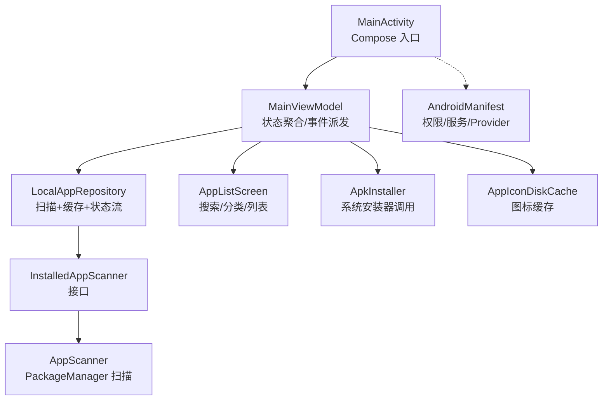
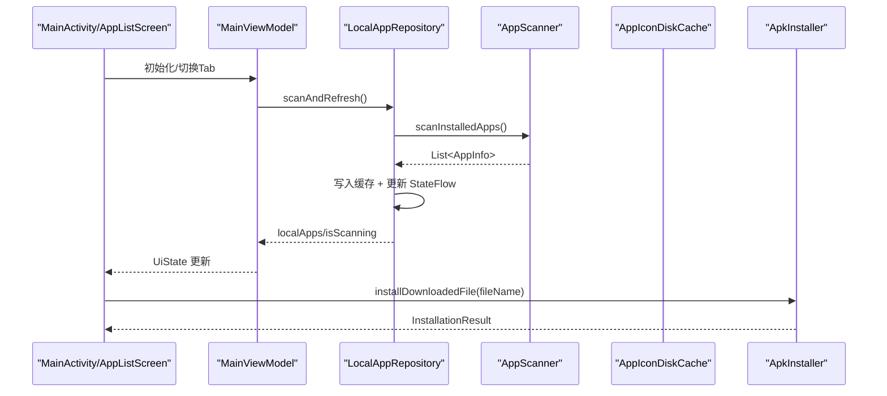
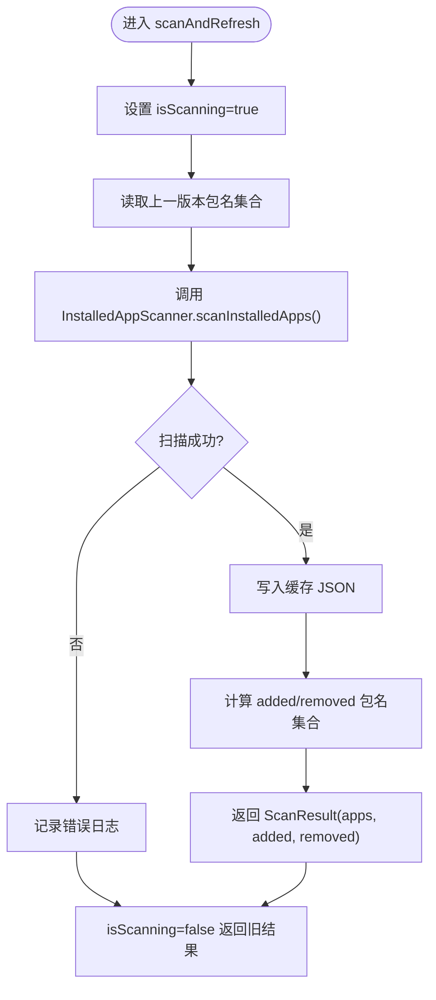
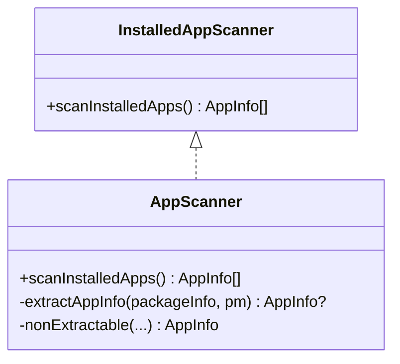
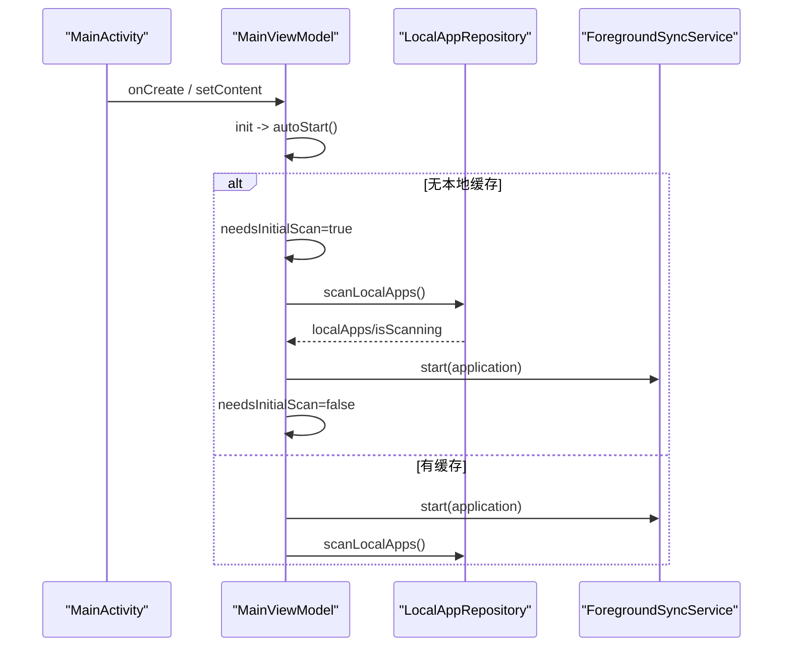
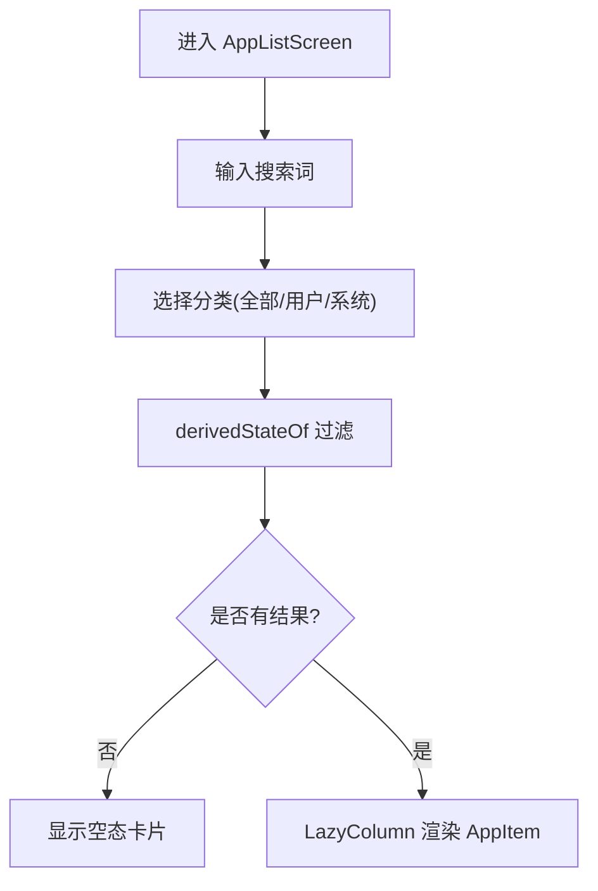
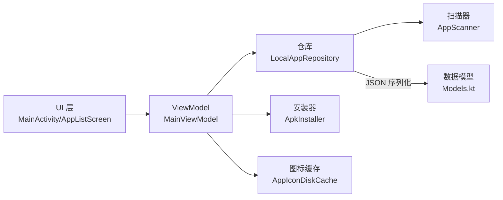

# 本地应用管理

<cite>
**本文引用的文件**
- [LanSyncApplication.kt](file://app/src/main/java/com/lansync/app/LanSyncApplication.kt)
- [MainActivity.kt](file://app/src/main/java/com/lansync/app/MainActivity.kt)
- [MainViewModel.kt](file://app/src/main/java/com/lansync/app/ui/viewmodel/MainViewModel.kt)
- [AppListScreen.kt](file://app/src/main/java/com/lansync/app/ui/components/AppListScreen.kt)
- [LocalAppRepository.kt](file://app/src/main/java/com/lansync/app/data/localapps/LocalAppRepository.kt)
- [InstalledAppScanner.kt](file://app/src/main/java/com/lansync/app/data/localapps/InstalledAppScanner.kt)
- [AppScanner.kt](file://app/src/main/java/com/lansync/app/data/localapps/AppScanner.kt)
- [Models.kt](file://app/src/main/java/com/lansync/app/data/model/Models.kt)
- [AppConfig.kt](file://app/src/main/java/com/lansync/app/data/AppConfig.kt)
- [AppIconDiskCache.kt](file://app/src/main/java/com/lansync/app/data/cache/AppIconDiskCache.kt)
- [ApkInstaller.kt](file://app/src/main/java/com/lansync/app/data/installer/ApkInstaller.kt)
- [AndroidManifest.xml](file://app/src/main/AndroidManifest.xml)
- [ARCHITECTURE.md](file://docs/ARCHITECTURE.md)
- [SPEC.md](file://docs/SPEC.md)
- [REPORT.md](file://REPORT.md)
</cite>

## 目录
1. [简介](#简介)
2. [项目结构](#项目结构)
3. [核心组件](#核心组件)
4. [架构总览](#架构总览)
5. [详细组件分析](#详细组件分析)
6. [依赖关系分析](#依赖关系分析)
7. [性能考量](#性能考量)
8. [故障排查指南](#故障排查指南)
9. [结论](#结论)
10. [附录](#附录)

## 简介
本文件聚焦“本地应用管理”能力：扫描本机已安装应用、缓存与展示、图标缓存、以及与应用列表相关的下载与安装流程。该能力由数据层仓库、扫描器、UI 视图模型与界面组件协同完成，并通过前台服务维持网络与服务发现的生命周期（与本地应用管理共同构成完整体验）。

## 项目结构
围绕本地应用管理的代码主要分布在以下包：
- data/localapps：本地应用仓库与扫描实现
- ui/components：本地应用列表 UI
- ui/viewmodel：状态聚合与用户操作派发
- data/cache：图标磁盘缓存
- data/installer：安装包安装入口
- AndroidManifest：权限与前台服务声明

图表来源
- [MainActivity.kt:27-106](file://app/src/main/java/com/lansync/app/MainActivity.kt#L27-L106)
- [MainViewModel.kt:51-134](file://app/src/main/java/com/lansync/app/ui/viewmodel/MainViewModel.kt#L51-L134)
- [LocalAppRepository.kt:26-98](file://app/src/main/java/com/lansync/app/data/localapps/LocalAppRepository.kt#L26-L98)
- [InstalledAppScanner.kt:11-14](file://app/src/main/java/com/lansync/app/data/localapps/InstalledAppScanner.kt#L11-L14)
- [AppScanner.kt:25-92](file://app/src/main/java/com/lansync/app/data/localapps/AppScanner.kt#L25-L92)
- [AppListScreen.kt:27-121](file://app/src/main/java/com/lansync/app/ui/components/AppListScreen.kt#L27-L121)
- [ApkInstaller.kt:10-61](file://app/src/main/java/com/lansync/app/data/installer/ApkInstaller.kt#L10-L61)
- [AndroidManifest.xml:31-68](file://app/src/main/AndroidManifest.xml#L31-L68)

章节来源
- [MainActivity.kt:27-106](file://app/src/main/java/com/lansync/app/MainActivity.kt#L27-L106)
- [AndroidManifest.xml:31-68](file://app/src/main/AndroidManifest.xml#L31-L68)

## 核心组件
- LocalAppRepository：负责本地应用扫描触发、缓存读写、状态流暴露；启动时优先加载缓存骨架，后台静默刷新，避免脏展示。
- InstalledAppScanner/AppScanner：封装 PackageManager 枚举与 AppInfo 构建；对不可读/受保护应用降级为不可提取项。
- MainViewModel：订阅仓库状态流并合并为 UiState；处理用户操作（连接、刷新、下载、安装、批量更新等）。
- AppListScreen：提供搜索、分类（全部/用户/系统）、空态与列表渲染。
- AppIconDiskCache：三级缓存中的磁盘层，按包名持久化 PNG 图标。
- ApkInstaller：通过 FileProvider 与 ACTION_VIEW 调用系统或第三方安装器。

章节来源
- [LocalAppRepository.kt:26-98](file://app/src/main/java/com/lansync/app/data/localapps/LocalAppRepository.kt#L26-L98)
- [AppScanner.kt:25-92](file://app/src/main/java/com/lansync/app/data/localapps/AppScanner.kt#L25-L92)
- [MainViewModel.kt:51-134](file://app/src/main/java/com/lansync/app/ui/viewmodel/MainViewModel.kt#L51-L134)
- [AppListScreen.kt:27-121](file://app/src/main/java/com/lansync/app/ui/components/AppListScreen.kt#L27-L121)
- [AppIconDiskCache.kt:9-95](file://app/src/main/java/com/lansync/app/data/cache/AppIconDiskCache.kt#L9-L95)
- [ApkInstaller.kt:10-61](file://app/src/main/java/com/lansync/app/data/installer/ApkInstaller.kt#L10-L61)

## 架构总览
本地应用管理遵循分层与单向依赖：UI → ViewModel → Repository → Scanner → 系统 API；同时与安装器、图标缓存协作。

图表来源
- [MainViewModel.kt:68-88](file://app/src/main/java/com/lansync/app/ui/viewmodel/MainViewModel.kt#L68-L88)
- [LocalAppRepository.kt:55-75](file://app/src/main/java/com/lansync/app/data/localapps/LocalAppRepository.kt#L55-L75)
- [AppScanner.kt:27-39](file://app/src/main/java/com/lansync/app/data/localapps/AppScanner.kt#L27-L39)
- [ApkInstaller.kt:12-45](file://app/src/main/java/com/lansync/app/data/installer/ApkInstaller.kt#L12-L45)

## 详细组件分析

### LocalAppRepository（本地应用仓库）
- 职责：扫描触发、缓存读写、状态流暴露；启动策略为先加载缓存骨架再后台刷新。
- 关键行为：
  - hasCache/loadCacheSkeleton：快速填充 UI，提升首屏体验。
  - scanAndRefresh：记录上一版包名集合，计算新增/移除集合，供上层做图标预加载/清理。
  - 异常安全：扫描失败不清空现有列表，仅记录日志。
- 复杂度：扫描为 O(N)（N 为已安装应用数），缓存读写为 I/O 操作。

图表来源
- [LocalAppRepository.kt:55-75](file://app/src/main/java/com/lansync/app/data/localapps/LocalAppRepository.kt#L55-L75)

章节来源
- [LocalAppRepository.kt:26-98](file://app/src/main/java/com/lansync/app/data/localapps/LocalAppRepository.kt#L26-L98)

### AppScanner（本机应用扫描）
- 职责：基于 PackageManager 枚举应用，构建 AppInfo；对不可读/受保护应用降级为不可提取。
- 关键行为：
  - 区分单 APK 与 Split APK（sourcePaths 数量）。
  - md5 为空时的合法态：保持 isExtractable=true（决策 D2）。
  - 统计文件大小、是否系统应用等元信息。
- 复杂度：O(N) 遍历 + 每个包的 MD5 计算（I/O 密集）。

图表来源
- [InstalledAppScanner.kt:11-14](file://app/src/main/java/com/lansync/app/data/localapps/InstalledAppScanner.kt#L11-L14)
- [AppScanner.kt:25-92](file://app/src/main/java/com/lansync/app/data/localapps/AppScanner.kt#L25-L92)

章节来源
- [AppScanner.kt:25-92](file://app/src/main/java/com/lansync/app/data/localapps/AppScanner.kt#L25-L92)

### MainViewModel（状态聚合与操作派发）
- 职责：组合多个领域 StateFlow 为单一 UiState；处理用户操作（连接、刷新、下载、安装、批量更新等）。
- 关键行为：
  - autoStart：无缓存则显示初始扫描遮罩并扫描后启动前台服务；有缓存则并行启动服务与后台扫描。
  - observeRepositoryState：分组 combine 多路 Flow，避免 Kotlin 5-flow 重载限制。
  - 批量更新/拉取：收集错误并汇总提示。
- 复杂度：combine 为常量级；下载/安装等异步任务复杂度取决于 I/O。

图表来源
- [MainViewModel.kt:68-88](file://app/src/main/java/com/lansync/app/ui/viewmodel/MainViewModel.kt#L68-L88)
- [AndroidManifest.xml:61-68](file://app/src/main/AndroidManifest.xml#L61-L68)

章节来源
- [MainViewModel.kt:51-134](file://app/src/main/java/com/lansync/app/ui/viewmodel/MainViewModel.kt#L51-L134)

### AppListScreen（本地应用列表 UI）
- 职责：搜索、分类（全部/用户/系统）、空态与 LazyColumn 列表渲染。
- 关键行为：
  - derivedStateOf 过滤，避免不必要重组。
  - 根据 isSystemApp 与 isSplitApk 展示标签。
  - 空态文案根据筛选条件变化。

图表来源
- [AppListScreen.kt:27-121](file://app/src/main/java/com/lansync/app/ui/components/AppListScreen.kt#L27-L121)

章节来源
- [AppListScreen.kt:27-121](file://app/src/main/java/com/lansync/app/ui/components/AppListScreen.kt#L27-L121)

### AppIconDiskCache（图标磁盘缓存）
- 职责：按包名持久化 PNG 图标，支持批量写入、过期清理、尺寸缩放读取。
- 关键行为：
  - get：先检测存在性，解码时按目标尺寸采样以减少内存占用。
  - removeStale：依据有效包名集合清理无用图标。
  - clear：一键清空。

章节来源
- [AppIconDiskCache.kt:9-95](file://app/src/main/java/com/lansync/app/data/cache/AppIconDiskCache.kt#L9-L95)

### ApkInstaller（安装入口）
- 职责：通过 FileProvider 生成 URI，使用 ACTION_VIEW 调用系统或第三方安装器。
- 关键行为：
  - 校验文件存在性与 MIME 类型（.apks→zip，.apk→package-archive）。
  - 捕获异常并返回结构化结果。

章节来源
- [ApkInstaller.kt:10-61](file://app/src/main/java/com/lansync/app/data/installer/ApkInstaller.kt#L10-L61)

## 依赖关系分析
- 依赖方向：UI → ViewModel → Repository → Scanner → 系统 API；安装与图标缓存作为横向工具被复用。
- 外部依赖：
  - Android 框架：PackageManager、FileProvider、Intent、前台服务等。
  - 配置：AppConfig 提供心跳/超时等参数（虽主要用于连接层，但体现配置集中化思想）。
- 潜在耦合点：
  - ViewModel 直接持有 Repository 引用（当前通过 LanSyncGraph 获取），便于测试替换。
  - 扫描逻辑与 UI 解耦，通过 StateFlow 传递，降低耦合度。

图表来源
- [MainViewModel.kt:51-134](file://app/src/main/java/com/lansync/app/ui/viewmodel/MainViewModel.kt#L51-L134)
- [LocalAppRepository.kt:26-98](file://app/src/main/java/com/lansync/app/data/localapps/LocalAppRepository.kt#L26-L98)
- [AppScanner.kt:25-92](file://app/src/main/java/com/lansync/app/data/localapps/AppScanner.kt#L25-L92)
- [Models.kt:6-17](file://app/src/main/java/com/lansync/app/data/model/Models.kt#L6-L17)

章节来源
- [MainViewModel.kt:51-134](file://app/src/main/java/com/lansync/app/ui/viewmodel/MainViewModel.kt#L51-L134)
- [LocalAppRepository.kt:26-98](file://app/src/main/java/com/lansync/app/data/localapps/LocalAppRepository.kt#L26-L98)
- [AppScanner.kt:25-92](file://app/src/main/java/com/lansync/app/data/localapps/AppScanner.kt#L25-L92)
- [Models.kt:6-17](file://app/src/main/java/com/lansync/app/data/model/Models.kt#L6-L17)

## 性能考量
- 扫描性能：O(N) 遍历 + I/O 密集型 MD5 计算；建议在 IO 调度器执行，避免阻塞主线程。
- 缓存命中：首次冷启动通过缓存骨架快速展示，后台静默刷新减少等待时间。
- 图标缓存：按需采样解码，批量写入与过期清理降低内存与存储压力。
- 列表渲染：使用 LazyColumn 与 derivedStateOf 减少重组与绘制开销。

[本节为通用指导，无需特定文件引用]

## 故障排查指南
- 扫描失败：检查权限（QUERY_ALL_PACKAGES）、应用可读性（sourceDir/splitSourceDirs 可访问）、异常日志。
- 缓存损坏：LocalAppRepository 在读取失败时会删除损坏缓存并返回空列表，重新扫描即可恢复。
- 安装失败：确认文件存在、MIME 类型正确、设备具备安装器；查看安装器返回的错误信息。
- 图标缺失：检查磁盘缓存目录是否存在、文件是否被清理；必要时调用 clear/removeStale 重建。

章节来源
- [LocalAppRepository.kt:77-91](file://app/src/main/java/com/lansync/app/data/localapps/LocalAppRepository.kt#L77-L91)
- [ApkInstaller.kt:12-45](file://app/src/main/java/com/lansync/app/data/installer/ApkInstaller.kt#L12-L45)
- [AppIconDiskCache.kt:57-72](file://app/src/main/java/com/lansync/app/data/cache/AppIconDiskCache.kt#L57-L72)

## 结论
本地应用管理以清晰的层次与职责划分实现了高效稳定的应用扫描、缓存与展示，并通过前台服务保障整体生命周期。未来可在图标预加载时机、缓存健壮性与安装反馈方面继续优化，以提升用户体验与可维护性。

[本节为总结，无需特定文件引用]

## 附录
- 协议与设计参考：
  - 目标架构与重构原则见 ARCHITECTURE.md。
  - 线上协议冻结契约见 SPEC.md。
  - 现状问题与重构建议见 REPORT.md。

章节来源
- [ARCHITECTURE.md:1-380](file://docs/ARCHITECTURE.md#L1-L380)
- [SPEC.md:1-616](file://docs/SPEC.md#L1-L616)
- [REPORT.md:1-298](file://REPORT.md#L1-L298)