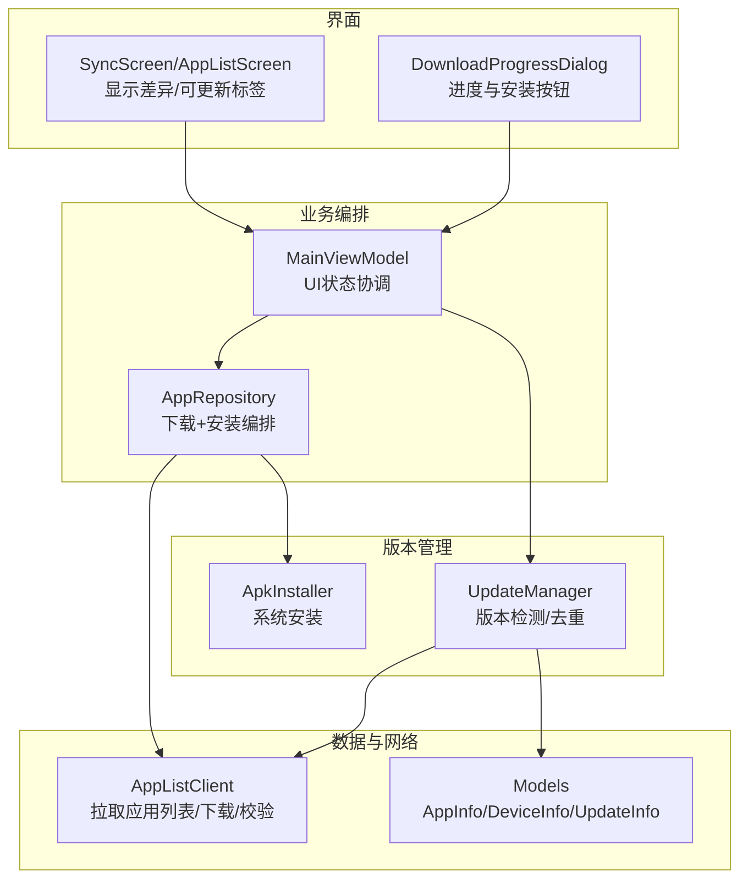
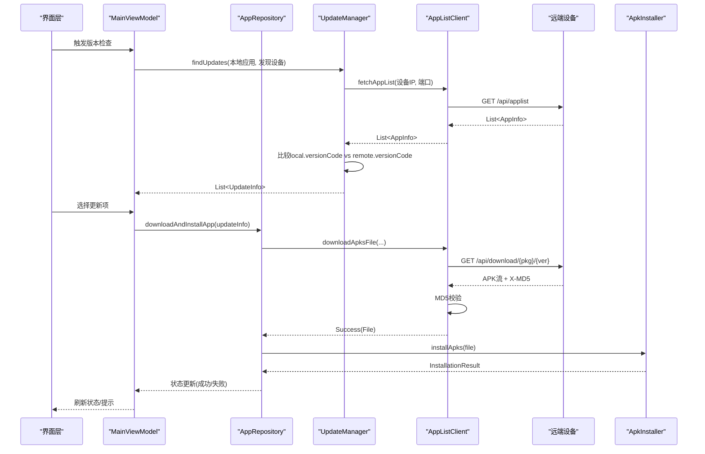
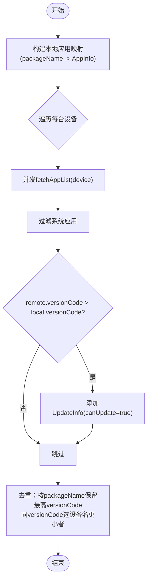
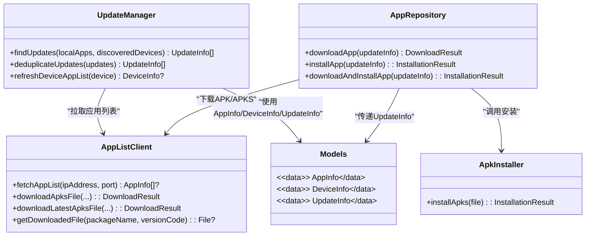
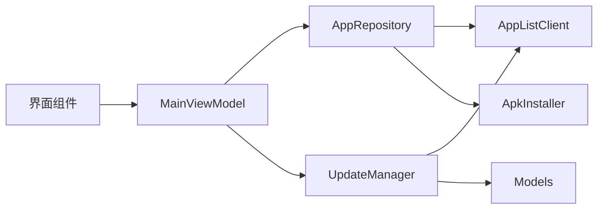

# 版本管理

<cite>
**本文引用的文件**
- [UpdateManager.kt](file://app/src/main/java/com/lansync/app/data/update/UpdateManager.kt)
- [Models.kt](file://app/src/main/java/com/lansync/app/data/model/Models.kt)
- [AppListClient.kt](file://app/src/main/java/com/lansync/app/data/client/AppListClient.kt)
- [ApkInstaller.kt](file://app/src/main/java/com/lansync/app/data/installer/ApkInstaller.kt)
- [AppRepository.kt](file://app/src/main/java/com/lansync/app/data/repository/AppRepository.kt)
- [MainViewModel.kt](file://app/src/main/java/com/lansync/app/ui/viewmodel/MainViewModel.kt)
- [SyncScreen.kt](file://app/src/main/java/com/lansync/app/ui/components/SyncScreen.kt)
- [AppListScreen.kt](file://app/src/main/java/com/lansync/app/ui/components/AppListScreen.kt)
- [DownloadProgressDialog.kt](file://app/src/main/java/com/lansync/app/ui/components/DownloadProgressDialog.kt)
- [AppConfig.kt](file://app/src/main/java/com/lansync/app/data/AppConfig.kt)
</cite>

## 目录
1. [简介](#简介)
2. [项目结构](#项目结构)
3. [核心组件](#核心组件)
4. [架构总览](#架构总览)
5. [详细组件分析](#详细组件分析)
6. [依赖关系分析](#依赖关系分析)
7. [性能考虑](#性能考虑)
8. [故障排查指南](#故障排查指南)
9. [结论](#结论)
10. [附录：使用示例](#附录使用示例)

## 简介
本章节聚焦于LanSync应用的版本管理模块，重点说明UpdateManager的版本检测逻辑、本地与远程应用版本比较策略、批量更新与冲突解决机制，以及UpdateInfo数据模型的设计。同时提供端到端的使用示例，展示如何进行版本检查与执行更新操作。

## 项目结构
版本管理相关代码主要分布在以下位置：
- 版本检测与去重：UpdateManager
- 数据模型：Models（AppInfo、DeviceInfo、UpdateInfo等）
- 网络与下载：AppListClient（获取远端应用列表、下载APK/APKS并校验MD5）
- 安装器：ApkInstaller（调用系统安装器）
- 业务编排：AppRepository（组合下载与安装流程）
- UI层：MainViewModel、各屏幕组件（展示差异、进度、触发安装）

图表来源
- [UpdateManager.kt:12-103](file://app/src/main/java/com/lansync/app/data/update/UpdateManager.kt#L12-L103)
- [AppListClient.kt:228-462](file://app/src/main/java/com/lansync/app/data/client/AppListClient.kt#L228-L462)
- [Models.kt:6-67](file://app/src/main/java/com/lansync/app/data/model/Models.kt#L6-L67)
- [AppRepository.kt:1054-1122](file://app/src/main/java/com/lansync/app/data/repository/AppRepository.kt#L1054-L1122)
- [MainViewModel.kt:306-341](file://app/src/main/java/com/lansync/app/ui/viewmodel/MainViewModel.kt#L306-L341)

章节来源
- [UpdateManager.kt:12-103](file://app/src/main/java/com/lansync/app/data/update/UpdateManager.kt#L12-L103)
- [Models.kt:6-67](file://app/src/main/java/com/lansync/app/data/model/Models.kt#L6-L67)
- [AppListClient.kt:228-462](file://app/src/main/java/com/lansync/app/data/client/AppListClient.kt#L228-L462)

## 核心组件
- UpdateManager：负责从多台设备并行拉取应用列表，与本地已安装应用进行版本比对，生成待更新列表；并提供去重策略以解决多设备同包名冲突。
- AppListClient：封装HTTP请求，获取远端应用列表、下载APK/APKS并进行MD5校验，支持进度回调。
- ApkInstaller：通过系统安装器安装APK/APKS。
- AppRepository：编排“下载→安装”的完整流程，维护下载进度与安装状态。
- Models：定义AppInfo、DeviceInfo、UpdateInfo等数据结构，承载版本信息、文件大小、来源设备等。

章节来源
- [UpdateManager.kt:12-103](file://app/src/main/java/com/lansync/app/data/update/UpdateManager.kt#L12-L103)
- [AppListClient.kt:228-462](file://app/src/main/java/com/lansync/app/data/client/AppListClient.kt#L228-L462)
- [ApkInstaller.kt:10-59](file://app/src/main/java/com/lansync/app/data/installer/ApkInstaller.kt#L10-L59)
- [AppRepository.kt:1054-1122](file://app/src/main/java/com/lansync/app/data/repository/AppRepository.kt#L1054-L1122)
- [Models.kt:6-67](file://app/src/main/java/com/lansync/app/data/model/Models.kt#L6-L67)

## 架构总览
版本管理的整体流程如下：
- 版本检测：UpdateManager并发访问多台设备，拉取远端应用列表并与本地应用按包名匹配，基于versionCode判断是否需要更新。
- 去重与冲突解决：当同一包名可从多个设备提供更新时，选择最高versionCode；若versionCode相同，则选择设备名称字典序更小的设备作为提供者。
- 下载与校验：AppListClient下载APK/APKS，并通过服务端返回的X-MD5或期望MD5进行完整性校验。
- 安装：AppRepository协调下载结果并调用ApkInstaller完成安装。

图表来源
- [UpdateManager.kt:14-69](file://app/src/main/java/com/lansync/app/data/update/UpdateManager.kt#L14-L69)
- [AppListClient.kt:228-254](file://app/src/main/java/com/lansync/app/data/client/AppListClient.kt#L228-L254)
- [AppListClient.kt:358-462](file://app/src/main/java/com/lansync/app/data/client/AppListClient.kt#L358-L462)
- [AppRepository.kt:1113-1122](file://app/src/main/java/com/lansync/app/data/repository/AppRepository.kt#L1113-L1122)
- [ApkInstaller.kt:12-45](file://app/src/main/java/com/lansync/app/data/installer/ApkInstaller.kt#L12-L45)

## 详细组件分析

### UpdateManager：版本检测与去重
- 版本检测逻辑
  - 将本地应用按包名建立索引，对每个发现设备进行并发请求获取远端应用列表。
  - 过滤系统应用，仅比较用户应用。
  - 比较规则：当remoteApp.versionCode > localApp.versionCode时，认为需要更新，构造UpdateInfo并标记canUpdate为true。
- 去重与冲突解决
  - 当同一包名存在多个候选更新时，优先选择versionCode更高的更新。
  - 若versionCode相同，选择providerDevice.deviceName字典序更小的设备，保证确定性。
- 并发与I/O
  - 使用协程在IO调度器上并发拉取多设备列表，提升检测效率。

图表来源
- [UpdateManager.kt:14-69](file://app/src/main/java/com/lansync/app/data/update/UpdateManager.kt#L14-L69)
- [UpdateManager.kt:81-102](file://app/src/main/java/com/lansync/app/data/update/UpdateManager.kt#L81-L102)

章节来源
- [UpdateManager.kt:14-69](file://app/src/main/java/com/lansync/app/data/update/UpdateManager.kt#L14-L69)
- [UpdateManager.kt:81-102](file://app/src/main/java/com/lansync/app/data/update/UpdateManager.kt#L81-L102)

### UpdateInfo数据模型设计
- 字段说明
  - localApp：本地已安装应用信息（可为空，表示全新安装场景）。
  - remoteApp：远端提供的最新版本应用信息，包含版本号、大小、MD5等。
  - providerDevice：提供更新的设备信息，用于冲突解决与来源追踪。
  - canUpdate：是否允许更新（当前实现中为true，由比较逻辑决定）。
- 设计要点
  - 将“本地-远端-来源设备”三元组抽象为一次更新候选，便于后续下载与安装流程统一处理。
  - 结合AppInfo中的fileSize、md5等字段，可在UI中展示文件大小与完整性校验信息。

章节来源
- [Models.kt:47-52](file://app/src/main/java/com/lansync/app/data/model/Models.kt#L47-L52)
- [Models.kt:6-17](file://app/src/main/java/com/lansync/app/data/model/Models.kt#L6-L17)

### 版本比较算法与语义化版本
- 当前实现
  - 使用Long类型的versionCode进行数值比较，直接判断remote.versionCode是否大于local.versionCode。
  - 未实现字符串形式的语义化版本解析（如“1.2.3-beta”），也不包含兼容性检查（如API级别、Android版本要求）。
- 扩展建议
  - 如需支持语义化版本，可增加解析器将versionName拆分为major/minor/patch/pre-release/build，并按优先级排序。
  - 增加兼容性检查：读取目标设备的Android API级别与应用声明的最小/目标SDK，决定是否允许更新。
  - 在UpdateInfo中新增字段（如compatibilityStatus、requiresReboot）以表达兼容性结果。

章节来源
- [UpdateManager.kt:57-66](file://app/src/main/java/com/lansync/app/data/update/UpdateManager.kt#L57-L66)
- [Models.kt:6-17](file://app/src/main/java/com/lansync/app/data/model/Models.kt#L6-L17)

### 批量更新策略
- 并发检测
  - 对多台设备并行拉取应用列表，减少总体等待时间。
- 去重策略
  - 同一包名可能从多个设备提供更新，去重时优先选择更高versionCode；若相同，选择设备名字典序更小的设备，确保唯一且确定。
- 批量下载与安装
  - UI层可选择多个UpdateInfo进行批量下载，AppRepository维护下载进度与安装状态，逐个或并发执行下载与安装。

章节来源
- [UpdateManager.kt:23-34](file://app/src/main/java/com/lansync/app/data/update/UpdateManager.kt#L23-L34)
- [UpdateManager.kt:81-102](file://app/src/main/java/com/lansync/app/data/update/UpdateManager.kt#L81-L102)
- [AppRepository.kt:1054-1122](file://app/src/main/java/com/lansync/app/data/repository/AppRepository.kt#L1054-L1122)

### 冲突解决机制
- 冲突来源：同一包名从不同设备提供更新。
- 解决规则：
  - 优先选择versionCode更高的更新。
  - 若versionCode相同，选择deviceName字典序更小的设备，避免随机性。
- 该机制保证最终每个包名只有一个更新候选，简化后续下载与安装流程。

章节来源
- [UpdateManager.kt:81-102](file://app/src/main/java/com/lansync/app/data/update/UpdateManager.kt#L81-L102)

### 下载与安装流程
- 下载
  - AppListClient通过HTTP获取APK/APKS，支持指定版本或最新版本的下载接口。
  - 下载过程中计算实际MD5并与服务端X-MD5或期望MD5对比，不一致则删除文件并返回错误。
  - 支持进度回调，便于UI展示百分比。
- 安装
  - AppRepository根据下载结果调用ApkInstaller，使用FileProvider生成URI并启动系统安装器。
  - 安装结果通过状态对象反馈给UI层。

图表来源
- [UpdateManager.kt:12-103](file://app/src/main/java/com/lansync/app/data/update/UpdateManager.kt#L12-L103)
- [AppListClient.kt:228-462](file://app/src/main/java/com/lansync/app/data/client/AppListClient.kt#L228-L462)
- [ApkInstaller.kt:10-59](file://app/src/main/java/com/lansync/app/data/installer/ApkInstaller.kt#L10-L59)
- [AppRepository.kt:1054-1122](file://app/src/main/java/com/lansync/app/data/repository/AppRepository.kt#L1054-L1122)
- [Models.kt:6-67](file://app/src/main/java/com/lansync/app/data/model/Models.kt#L6-L67)

章节来源
- [AppListClient.kt:358-462](file://app/src/main/java/com/lansync/app/data/client/AppListClient.kt#L358-L462)
- [ApkInstaller.kt:12-45](file://app/src/main/java/com/lansync/app/data/installer/ApkInstaller.kt#L12-L45)
- [AppRepository.kt:1077-1122](file://app/src/main/java/com/lansync/app/data/repository/AppRepository.kt#L1077-L1122)

## 依赖关系分析
- UpdateManager依赖AppListClient进行网络通信，依赖Models进行数据建模。
- AppRepository依赖AppListClient与ApkInstaller，编排下载与安装。
- UI层通过MainViewModel与AppRepository交互，展示差异与进度。

图表来源
- [UpdateManager.kt:12-103](file://app/src/main/java/com/lansync/app/data/update/UpdateManager.kt#L12-L103)
- [AppRepository.kt:1054-1122](file://app/src/main/java/com/lansync/app/data/repository/AppRepository.kt#L1054-L1122)
- [MainViewModel.kt:306-341](file://app/src/main/java/com/lansync/app/ui/viewmodel/MainViewModel.kt#L306-L341)

章节来源
- [UpdateManager.kt:12-103](file://app/src/main/java/com/lansync/app/data/update/UpdateManager.kt#L12-L103)
- [AppRepository.kt:1054-1122](file://app/src/main/java/com/lansync/app/data/repository/AppRepository.kt#L1054-L1122)
- [MainViewModel.kt:306-341](file://app/src/main/java/com/lansync/app/ui/viewmodel/MainViewModel.kt#L306-L341)

## 性能考虑
- 并发拉取：UpdateManager对多台设备并发请求，显著降低整体检测耗时。
- 连接池与超时：AppListClient配置了合理的连接池与超时参数，兼顾吞吐与稳定性。
- 下载进度：下载过程支持进度回调，便于UI及时响应。
- 去重优化：去重逻辑基于HashMap，时间复杂度近似O(n)，适合批量更新场景。

[本节为通用性能讨论，不直接分析具体文件]

## 故障排查指南
- 无法检测到更新
  - 检查远端设备是否在线，确认AppListClient.fetchAppList能正常返回应用列表。
  - 确认本地应用是否为系统应用（会被过滤），以及versionCode比较是否正确。
- 下载失败或MD5校验失败
  - 查看下载日志，确认服务端返回的X-MD5与期望MD5一致。
  - 若校验失败，文件会被删除，需重新下载。
- 安装失败
  - 确认系统安装器可用，FileProvider权限正确。
  - 检查APK/APKS文件是否存在且非空。

章节来源
- [AppListClient.kt:228-254](file://app/src/main/java/com/lansync/app/data/client/AppListClient.kt#L228-L254)
- [AppListClient.kt:358-462](file://app/src/main/java/com/lansync/app/data/client/AppListClient.kt#L358-L462)
- [ApkInstaller.kt:12-45](file://app/src/main/java/com/lansync/app/data/installer/ApkInstaller.kt#L12-L45)

## 结论
LanSync的版本管理模块以UpdateManager为核心，采用并发检测与去重策略，结合AppListClient的网络能力与ApkInstaller的安装能力，实现了跨设备的版本检查与更新流程。当前版本比较基于versionCode数值比较，尚未实现语义化版本解析与兼容性检查，但具备良好的扩展空间。通过UI层的差异展示与进度反馈，用户可直观地进行批量更新操作。

[本节为总结性内容，不直接分析具体文件]

## 附录：使用示例
以下为典型使用流程的步骤说明（不涉及具体代码片段）：
- 步骤1：准备本地应用列表与已发现设备列表。
- 步骤2：调用UpdateManager.findUpdates进行版本检测，得到UpdateInfo列表。
- 步骤3：如需去重，调用UpdateManager.deduplicateUpdates处理重复候选。
- 步骤4：在UI中展示差异（例如“远程版本号更高”、“可更新”标签），并允许用户选择更新项。
- 步骤5：对选中的UpdateInfo调用AppRepository.downloadAndInstallApp进行下载与安装。
- 步骤6：监听下载进度与安装状态，在UI中展示百分比与结果。

章节来源
- [UpdateManager.kt:14-69](file://app/src/main/java/com/lansync/app/data/update/UpdateManager.kt#L14-L69)
- [UpdateManager.kt:81-102](file://app/src/main/java/com/lansync/app/data/update/UpdateManager.kt#L81-L102)
- [AppRepository.kt:1113-1122](file://app/src/main/java/com/lansync/app/data/repository/AppRepository.kt#L1113-L1122)
- [SyncScreen.kt:292-329](file://app/src/main/java/com/lansync/app/ui/components/SyncScreen.kt#L292-L329)
- [AppListScreen.kt:351-373](file://app/src/main/java/com/lansync/app/ui/components/AppListScreen.kt#L351-L373)
- [DownloadProgressDialog.kt:86-112](file://app/src/main/java/com/lansync/app/ui/components/DownloadProgressDialog.kt#L86-L112)