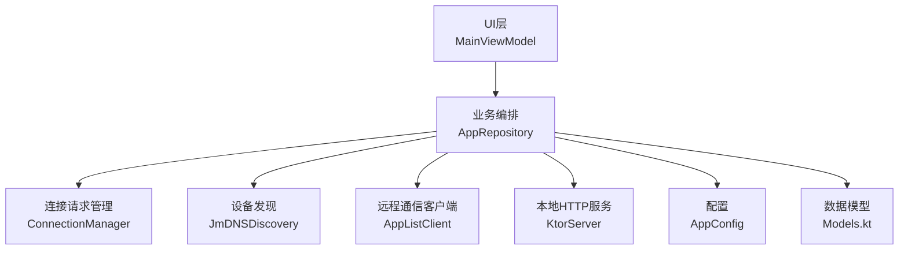
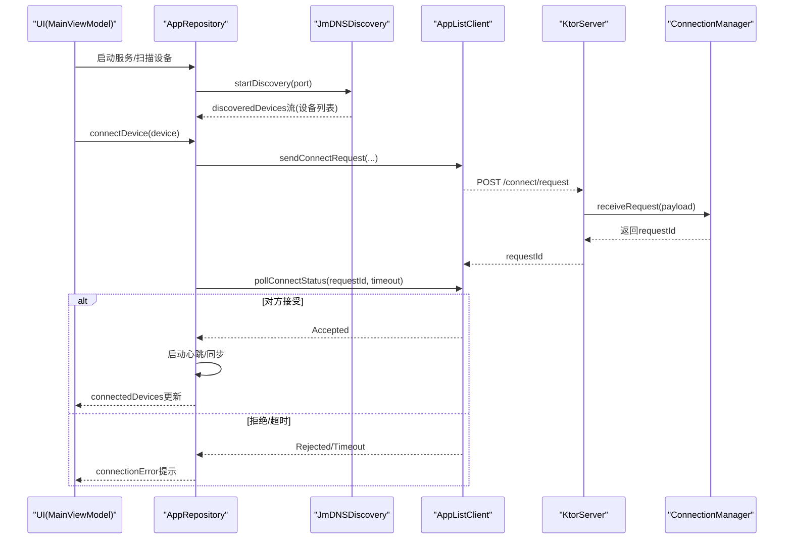
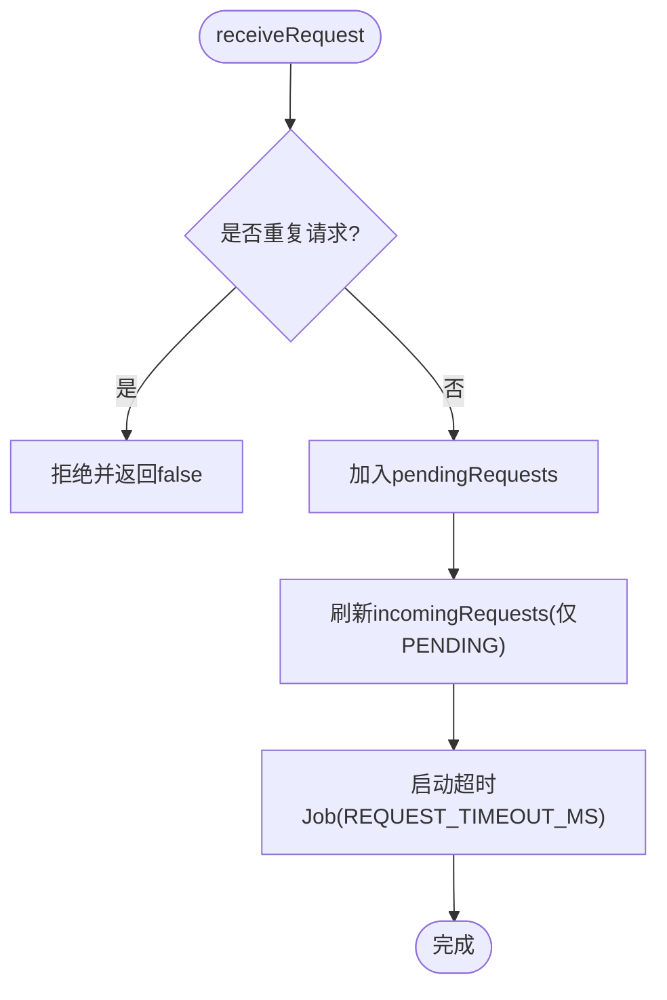
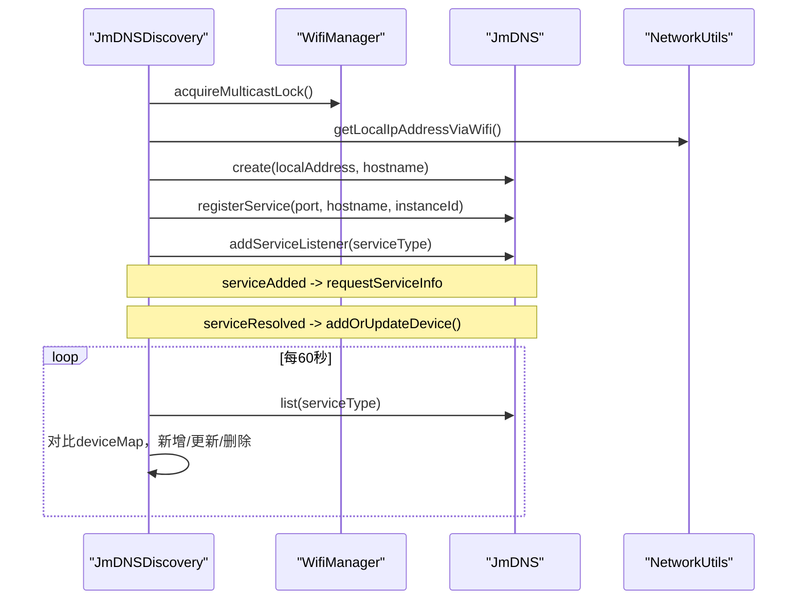
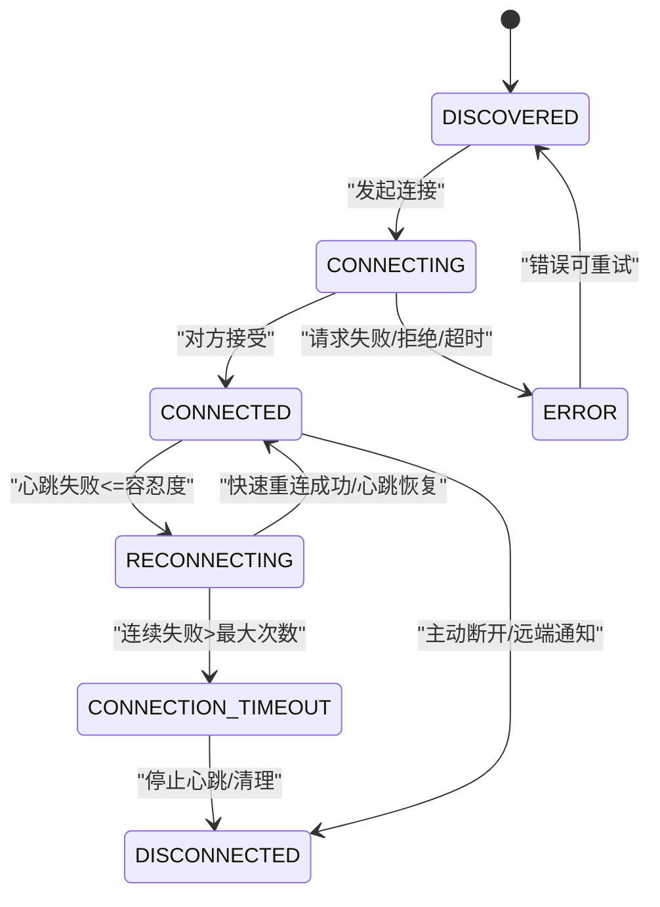
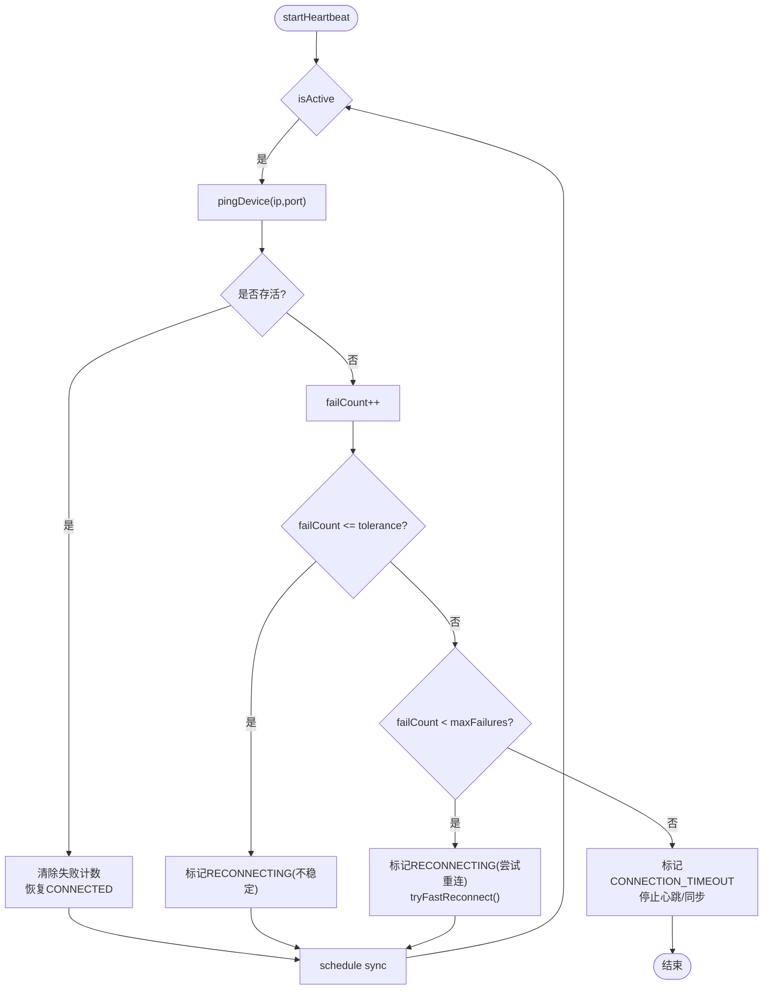
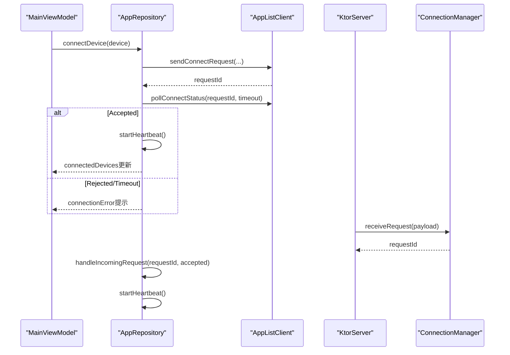
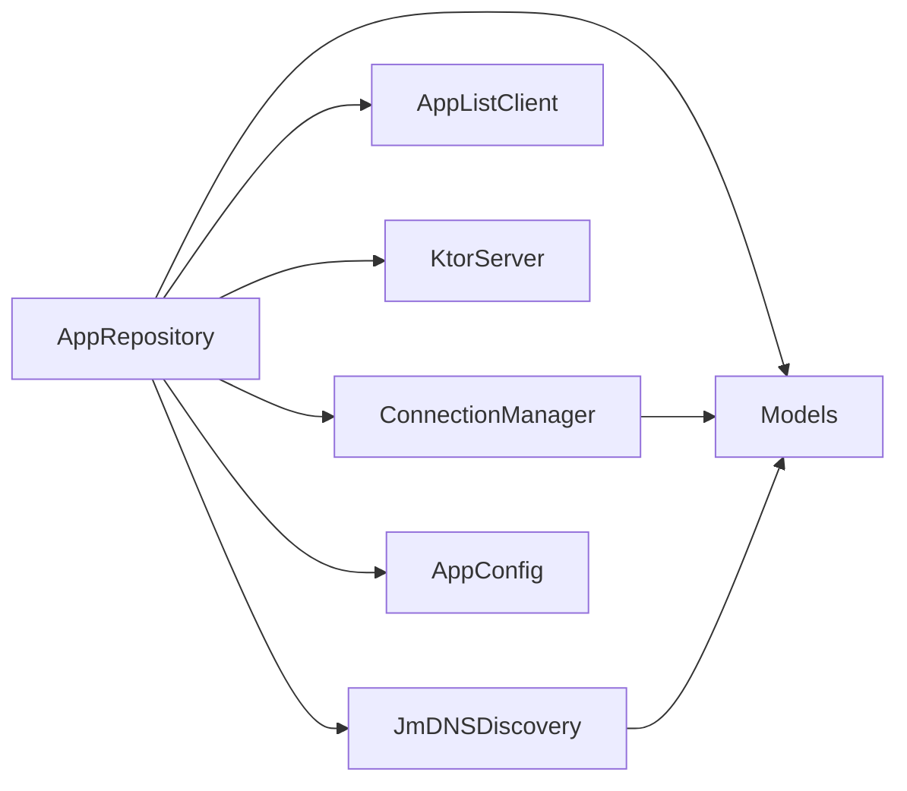

# 设备管理

<cite>
**本文引用的文件**
- [ConnectionManager.kt](file://app/src/main/java/com/lansync/app/data/connection/ConnectionManager.kt)
- [JmDNSDiscovery.kt](file://app/src/main/java/com/lansync/app/data/discovery/JmDNSDiscovery.kt)
- [Models.kt](file://app/src/main/java/com/lansync/app/data/model/Models.kt)
- [AppRepository.kt](file://app/src/main/java/com/lansync/app/data/repository/AppRepository.kt)
- [MainViewModel.kt](file://app/src/main/java/com/lansync/app/ui/viewmodel/MainViewModel.kt)
- [AppConfig.kt](file://app/src/main/java/com/lansync/app/data/AppConfig.kt)
- [ConnectionManagerTest.kt](file://app/src/test/java/com/lansync/app/data/connection/ConnectionManagerTest.kt)
</cite>

## 目录
1. [简介](#简介)
2. [项目结构](#项目结构)
3. [核心组件](#核心组件)
4. [架构总览](#架构总览)
5. [详细组件分析](#详细组件分析)
6. [依赖关系分析](#依赖关系分析)
7. [性能考量](#性能考量)
8. [故障排查指南](#故障排查指南)
9. [结论](#结论)
10. [附录：使用示例与最佳实践](#附录使用示例与最佳实践)

## 简介
本章节面向LanSync应用的“设备管理模块”，聚焦以下目标：
- ConnectionManager的连接生命周期管理（连接建立、状态维护、断线重连）
- JmDNSDiscovery的mDNS设备发现机制（零配置网络自动发现局域网内其他设备）
- 设备状态机设计（DISCOVERED、CONNECTING、CONNECTED、RECONNECTING、DISCONNECTED、CONNECTION_TIMEOUT等状态的转换逻辑）
- 心跳检测机制（心跳间隔、失败计数、超时处理）
- 具体使用示例（如何处理设备连接事件和状态变化）

## 项目结构
设备管理相关代码主要分布在以下包中：
- data/connection：连接请求管理与超时控制
- data/discovery：基于JmDNS的设备发现
- data/model：数据模型与连接状态枚举
- data/repository：设备连接编排、心跳调度、状态聚合
- ui/viewmodel：UI层对连接事件的消费与展示

图表来源
- [AppRepository.kt:40-87](file://app/src/main/java/com/lansync/app/data/repository/AppRepository.kt#L40-L87)
- [ConnectionManager.kt:19-27](file://app/src/main/java/com/lansync/app/data/connection/ConnectionManager.kt#L19-L27)
- [JmDNSDiscovery.kt:23-43](file://app/src/main/java/com/lansync/app/data/discovery/JmDNSDiscovery.kt#L23-L43)
- [Models.kt:19-27](file://app/src/main/java/com/lansync/app/data/model/Models.kt#L19-L27)
- [AppConfig.kt:3-14](file://app/src/main/java/com/lansync/app/data/AppConfig.kt#L3-L14)

章节来源
- [AppRepository.kt:40-87](file://app/src/main/java/com/lansync/app/data/repository/AppRepository.kt#L40-L87)
- [MainViewModel.kt:22-45](file://app/src/main/java/com/lansync/app/ui/viewmodel/MainViewModel.kt#L22-L45)

## 核心组件
- ConnectionManager：负责接收并管理来自远端的连接请求，提供超时控制、状态查询与清理能力。
- JmDNSDiscovery：基于JmDNS实现mDNS服务注册与监听，自动发现局域网内的LanSync设备。
- AppRepository：设备连接的编排中心，协调发现、连接、心跳、同步、断开等流程，维护设备状态机。
- Models：定义设备信息、连接状态枚举、连接请求/响应载荷等数据结构。
- MainViewModel：将仓库暴露的状态流组合为UI状态，供界面订阅与交互。

章节来源
- [ConnectionManager.kt:19-155](file://app/src/main/java/com/lansync/app/data/connection/ConnectionManager.kt#L19-L155)
- [JmDNSDiscovery.kt:23-275](file://app/src/main/java/com/lansync/app/data/discovery/JmDNSDiscovery.kt#L23-L275)
- [AppRepository.kt:40-87](file://app/src/main/java/com/lansync/app/data/repository/AppRepository.kt#L40-L87)
- [Models.kt:19-27](file://app/src/main/java/com/lansync/app/data/model/Models.kt#L19-L27)
- [MainViewModel.kt:22-45](file://app/src/main/java/com/lansync/app/ui/viewmodel/MainViewModel.kt#L22-L45)

## 架构总览
设备管理采用分层协作模式：
- 发现层：JmDNSDiscovery通过mDNS广播与服务监听，产出设备列表。
- 连接层：AppRepository根据设备列表发起或接受连接，调用AppListClient进行握手与状态轮询；ConnectionManager在本地服务器侧管理入站请求与超时。
- 健康层：AppRepository为每个已连接设备启动心跳任务，按配置周期探测存活，驱动状态机迁移与快速重连。
- 数据层：Models承载设备、应用清单、连接请求/响应等数据。
- 表现层：MainViewModel聚合仓库状态流，向UI呈现设备发现、连接、更新等信息。

图表来源
- [AppRepository.kt:386-484](file://app/src/main/java/com/lansync/app/data/repository/AppRepository.kt#L386-L484)
- [ConnectionManager.kt:29-87](file://app/src/main/java/com/lansync/app/data/connection/ConnectionManager.kt#L29-L87)
- [JmDNSDiscovery.kt:60-86](file://app/src/main/java/com/lansync/app/data/discovery/JmDNSDiscovery.kt#L60-L86)

## 详细组件分析

### ConnectionManager：连接请求与超时管理
职责
- 接收远端连接请求，去重并加入待处理队列
- 为每个请求设置超时定时器，超时后自动标记为超时
- 支持接受/拒绝请求，生成响应载荷
- 暴露待处理请求列表（仅PENDING），便于UI展示与用户决策

关键流程
- 接收请求：校验重复，写入pendingRequests，刷新incomingRequests流，启动超时Job
- 响应请求：取消对应超时Job，更新请求状态，生成响应载荷
- 超时处理：将PENDING转为TIMEOUT，刷新列表
- 清理：移除指定请求或清空全部

图表来源
- [ConnectionManager.kt:29-55](file://app/src/main/java/com/lansync/app/data/connection/ConnectionManager.kt#L29-L55)
- [ConnectionManager.kt:132-147](file://app/src/main/java/com/lansync/app/data/connection/ConnectionManager.kt#L132-L147)

章节来源
- [ConnectionManager.kt:29-155](file://app/src/main/java/com/lansync/app/data/connection/ConnectionManager.kt#L29-L155)
- [ConnectionManagerTest.kt:32-148](file://app/src/test/java/com/lansync/app/data/connection/ConnectionManagerTest.kt#L32-L148)

### JmDNSDiscovery：mDNS设备发现
职责
- 获取或生成持久化实例ID，用于区分不同设备实例
- 申请多播锁，创建JmDNS实例，注册本机服务
- 监听服务添加/移除/解析事件，维护设备集合
- 定时刷新服务列表，清理过期设备

mDNS机制要点
- 服务类型：_lansync._tcp.local.
- 服务名：包含设备名与实例ID，避免同设备多实例冲突
- TXT记录：deviceName、instanceId
- 多播锁：确保能收发组播数据包
- 刷新策略：周期性列出服务，对比当前设备映射，增量更新/删除

图表来源
- [JmDNSDiscovery.kt:60-134](file://app/src/main/java/com/lansync/app/data/discovery/JmDNSDiscovery.kt#L60-L134)
- [JmDNSDiscovery.kt:200-262](file://app/src/main/java/com/lansync/app/data/discovery/JmDNSDiscovery.kt#L200-L262)

章节来源
- [JmDNSDiscovery.kt:23-275](file://app/src/main/java/com/lansync/app/data/discovery/JmDNSDiscovery.kt#L23-L275)

### 设备状态机：连接生命周期
状态定义
- DISCOVERED：通过mDNS发现但尚未连接
- CONNECTING：正在发起连接请求
- CONNECTED：已成功连接并可通信
- RECONNECTING：心跳不稳定或尝试快速重连
- DISCONNECTED：主动断开或远端通知断开
- CONNECTION_TIMEOUT：心跳连续失败达到阈值，判定离线

状态转换规则（由AppRepository驱动）
- DISCOVERED → CONNECTING：调用connectDevice时
- CONNECTING → CONNECTED：pollConnectStatus返回Accepted
- CONNECTING → ERROR：发送请求失败或远端拒绝/超时
- CONNECTED → RECONNECTING：心跳失败次数≤容忍度
- RECONNECTING → CONNECTED：快速重连成功或心跳恢复
- RECONNECTING → CONNECTION_TIMEOUT：连续失败超过最大次数
- 任意状态 → DISCONNECTED：主动断开或远端通知断开

图表来源
- [Models.kt:19-27](file://app/src/main/java/com/lansync/app/data/model/Models.kt#L19-L27)
- [AppRepository.kt:386-484](file://app/src/main/java/com/lansync/app/data/repository/AppRepository.kt#L386-L484)
- [AppRepository.kt:590-622](file://app/src/main/java/com/lansync/app/data/repository/AppRepository.kt#L590-L622)
- [AppRepository.kt:179-249](file://app/src/main/java/com/lansync/app/data/repository/AppRepository.kt#L179-L249)

章节来源
- [Models.kt:19-27](file://app/src/main/java/com/lansync/app/data/model/Models.kt#L19-L27)
- [AppRepository.kt:386-484](file://app/src/main/java/com/lansync/app/data/repository/AppRepository.kt#L386-L484)
- [AppRepository.kt:590-622](file://app/src/main/java/com/lansync/app/data/repository/AppRepository.kt#L590-L622)
- [AppRepository.kt:179-249](file://app/src/main/java/com/lansync/app/data/repository/AppRepository.kt#L179-L249)

### 心跳检测机制
心跳职责
- 周期性ping远端设备，确认存活
- 根据失败次数切换状态（RECONNECTING/CONNECTION_TIMEOUT）
- 触发快速重连尝试，成功后恢复CONNECTED
- 定期拉取远端应用清单，保持数据新鲜

关键参数（来自配置）
- heartbeatPingIntervalMs：心跳间隔
- heartbeatSyncIntervalMs：同步应用清单间隔
- heartbeatPingTolerance：允许的不稳定次数阈值
- heartbeatPingMaxFailures：最大失败次数，超过则判定超时

实现要点
- 每个已连接设备独立协程执行心跳循环
- 失败计数保存在ConcurrentHashMap，键为displayKey
- 快速重连通过fetchDeviceInfo探测端口可达性
- 超时后停止心跳与同步任务，清理失败计数

图表来源
- [AppRepository.kt:134-172](file://app/src/main/java/com/lansync/app/data/repository/AppRepository.kt#L134-L172)
- [AppRepository.kt:179-249](file://app/src/main/java/com/lansync/app/data/repository/AppRepository.kt#L179-L249)
- [AppConfig.kt:3-14](file://app/src/main/java/com/lansync/app/data/AppConfig.kt#L3-L14)

章节来源
- [AppRepository.kt:134-249](file://app/src/main/java/com/lansync/app/data/repository/AppRepository.kt#L134-L249)
- [AppConfig.kt:3-14](file://app/src/main/java/com/lansync/app/data/AppConfig.kt#L3-L14)

### 连接建立与入站请求处理
发起连接
- 更新设备状态为CONNECTING
- 通过AppListClient发送连接请求，获得requestId
- 轮询连接状态直至接受/拒绝/超时
- 成功后启动心跳与后台应用清单拉取

入站请求
- KtorServer收到POST /connect/request后，交由ConnectionManager.receiveRequest处理
- AppRepository监听incomingRequests流，根据用户选择或已知设备自动接受
- 接受后创建连接设备对象，启动心跳与数据同步

图表来源
- [AppRepository.kt:386-484](file://app/src/main/java/com/lansync/app/data/repository/AppRepository.kt#L386-L484)
- [AppRepository.kt:486-554](file://app/src/main/java/com/lansync/app/data/repository/AppRepository.kt#L486-L554)
- [ConnectionManager.kt:29-87](file://app/src/main/java/com/lansync/app/data/connection/ConnectionManager.kt#L29-L87)

章节来源
- [AppRepository.kt:386-554](file://app/src/main/java/com/lansync/app/data/repository/AppRepository.kt#L386-L554)
- [ConnectionManager.kt:29-87](file://app/src/main/java/com/lansync/app/data/connection/ConnectionManager.kt#L29-L87)

## 依赖关系分析
- AppRepository依赖JmDNSDiscovery获取设备列表，依赖AppListClient进行网络通信，依赖KtorServer暴露本地接口，依赖ConnectionManager管理入站请求。
- ConnectionManager依赖kotlinx.coroutines进行超时控制，依赖FileLogger输出日志。
- JmDNSDiscovery依赖Android系统API（WifiManager）与JmDNS库。
- Models被多个组件共享，保证数据结构一致性。

图表来源
- [AppRepository.kt:40-87](file://app/src/main/java/com/lansync/app/data/repository/AppRepository.kt#L40-L87)
- [ConnectionManager.kt:19-27](file://app/src/main/java/com/lansync/app/data/connection/ConnectionManager.kt#L19-L27)
- [JmDNSDiscovery.kt:23-43](file://app/src/main/java/com/lansync/app/data/discovery/JmDNSDiscovery.kt#L23-L43)
- [Models.kt:19-27](file://app/src/main/java/com/lansync/app/data/model/Models.kt#L19-L27)

章节来源
- [AppRepository.kt:40-87](file://app/src/main/java/com/lansync/app/data/repository/AppRepository.kt#L40-L87)

## 性能考量
- 心跳间隔与同步间隔可调，建议根据网络质量调整以平衡实时性与资源消耗。
- 多播锁持有时间应尽可能短，避免影响系统网络栈。
- 设备列表刷新周期较长（60秒），适合局域网环境，减少广播风暴。
- 快速重连仅在心跳失败时触发，避免频繁握手造成拥塞。
- 应用清单拉取带重试与退避，降低瞬时失败对用户体验的影响。

[本节为通用指导，不直接分析具体文件]

## 故障排查指南
常见问题与定位
- 无法发现设备：检查多播锁是否成功获取、防火墙是否放行UDP 5353、设备是否在相同子网。
- 连接请求无响应：确认远端服务已启动且端口开放，检查网络连通性与请求超时配置。
- 频繁断线：观察心跳失败计数与容忍度，必要时增大容忍度或缩短间隔。
- 端口迁移：当设备IP不变但端口变化时，仓库会迁移连接并保持应用清单。

日志关键字
- “Request received”、“Request responded”、“Heartbeat ping error”、“Fast reconnect successful/failed”、“Port migration detected”

章节来源
- [ConnectionManager.kt:29-155](file://app/src/main/java/com/lansync/app/data/connection/ConnectionManager.kt#L29-L155)
- [AppRepository.kt:179-249](file://app/src/main/java/com/lansync/app/data/repository/AppRepository.kt#L179-L249)
- [JmDNSDiscovery.kt:88-117](file://app/src/main/java/com/lansync/app/data/discovery/JmDNSDiscovery.kt#L88-L117)

## 结论
LanSync的设备管理模块通过JmDNSDiscovery实现零配置设备发现，结合AppRepository的心跳与健康检查，构建了稳健的连接生命周期管理。ConnectionManager专注于入站请求与超时控制，配合UI层的状态流，提供了清晰的用户体验。整体设计解耦良好，易于扩展与维护。

[本节为总结，不直接分析具体文件]

## 附录：使用示例与最佳实践

- 启动服务与发现设备
  - 在MainViewModel中调用toggleRunning或forceStartSync，内部会启动KtorServer与JmDNSDiscovery，discoveredDevices流将推送新设备。
  - 参考路径：[MainViewModel.kt:65-82](file://app/src/main/java/com/lansync/app/ui/viewmodel/MainViewModel.kt#L65-L82)、[AppRepository.kt:624-647](file://app/src/main/java/com/lansync/app/data/repository/AppRepository.kt#L624-L647)

- 发起连接
  - 调用connectDevice(device)，若成功将进入CONNECTED并启动心跳；若失败会在connectionError中提示。
  - 参考路径：[MainViewModel.kt:162-180](file://app/src/main/java/com/lansync/app/ui/viewmodel/MainViewModel.kt#L162-L180)、[AppRepository.kt:386-484](file://app/src/main/java/com/lansync/app/data/repository/AppRepository.kt#L386-L484)

- 处理入站连接请求
  - 监听incomingRequests流，对用户展示接受/拒绝选项；调用acceptIncomingRequest/rejectIncomingRequest。
  - 参考路径：[MainViewModel.kt:190-200](file://app/src/main/java/com/lansync/app/ui/viewmodel/MainViewModel.kt#L190-L200)、[AppRepository.kt:486-554](file://app/src/main/java/com/lansync/app/data/repository/AppRepository.kt#L486-L554)

- 断开连接
  - 调用disconnectDevice(device)，会发送断开通知并更新状态为DISCONNECTED。
  - 参考路径：[MainViewModel.kt:186-188](file://app/src/main/java/com/lansync/app/ui/viewmodel/MainViewModel.kt#L186-L188)、[AppRepository.kt:590-622](file://app/src/main/java/com/lansync/app/data/repository/AppRepository.kt#L590-L622)

- 心跳与重连
  - 心跳失败会先标记RECONNECTING，尝试快速重连；超过阈值则标记CONNECTION_TIMEOUT并停止心跳。
  - 参考路径：[AppRepository.kt:179-249](file://app/src/main/java/com/lansync/app/data/repository/AppRepository.kt#L179-L249)

- 配置调优
  - 通过AppConfig调整心跳间隔、容忍度、最大失败次数、轮询间隔等，以适应不同网络环境。
  - 参考路径：[AppConfig.kt:3-14](file://app/src/main/java/com/lansync/app/data/AppConfig.kt#L3-L14)

章节来源
- [MainViewModel.kt:65-200](file://app/src/main/java/com/lansync/app/ui/viewmodel/MainViewModel.kt#L65-L200)
- [AppRepository.kt:386-622](file://app/src/main/java/com/lansync/app/data/repository/AppRepository.kt#L386-L622)
- [AppConfig.kt:3-14](file://app/src/main/java/com/lansync/app/data/AppConfig.kt#L3-L14)