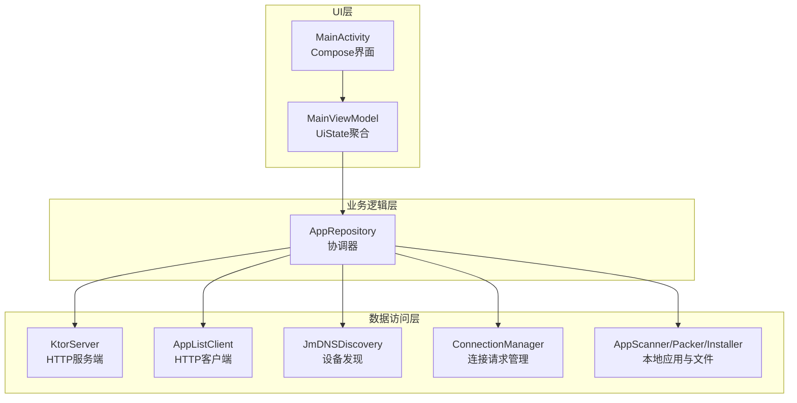
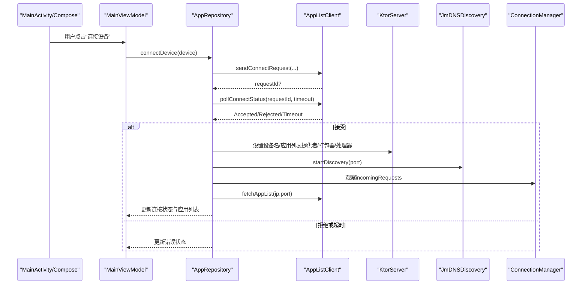
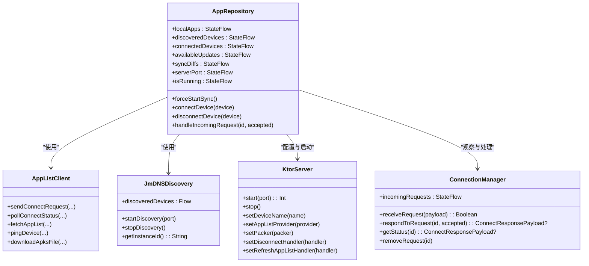
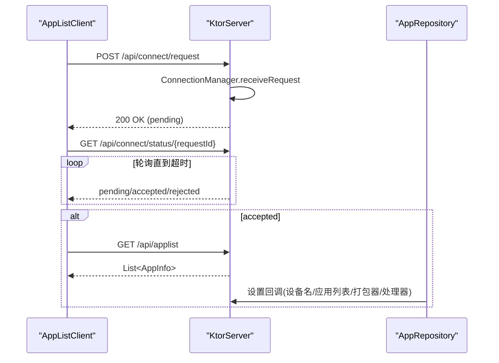
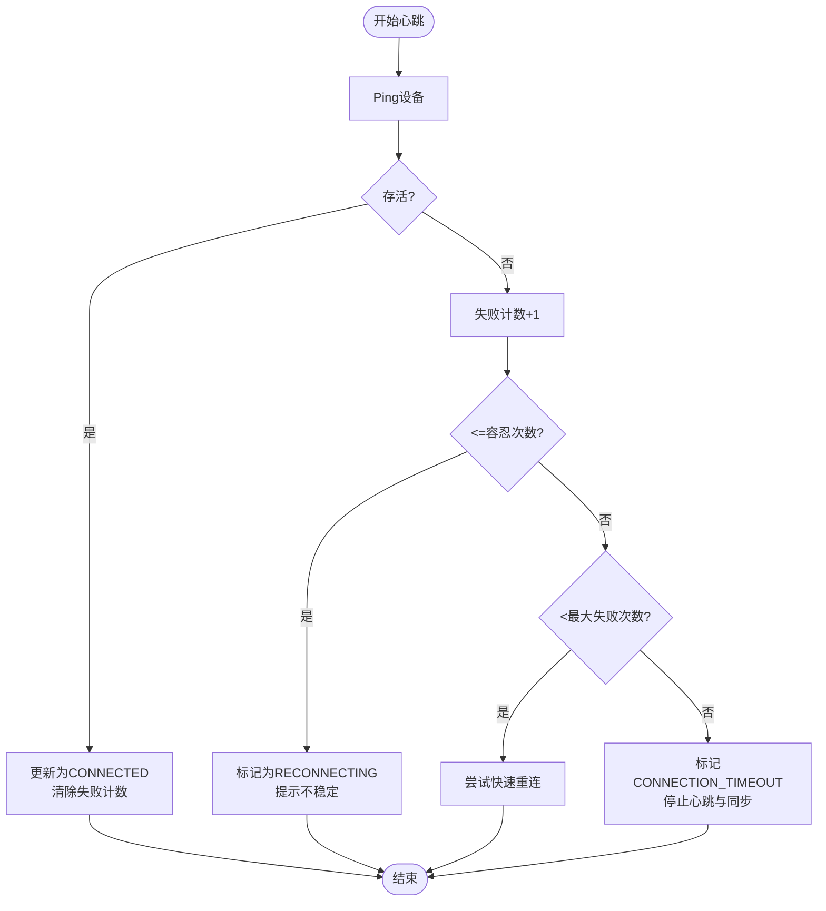
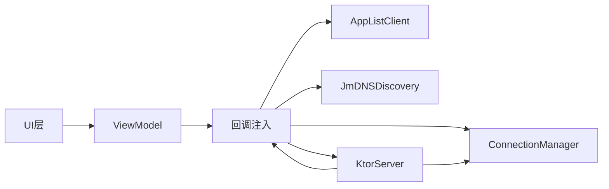

# 分层架构设计

<cite>
**本文引用的文件**
- [MainActivity.kt](file://app/src/main/java/com/lansync/app/MainActivity.kt)
- [MainViewModel.kt](file://app/src/main/java/com/lansync/app/ui/viewmodel/MainViewModel.kt)
- [AppRepository.kt](file://app/src/main/java/com/lansync/app/data/repository/AppRepository.kt)
- [AppListClient.kt](file://app/src/main/java/com/lansync/app/data/client/AppListClient.kt)
- [JmDNSDiscovery.kt](file://app/src/main/java/com/lansync/app/data/discovery/JmDNSDiscovery.kt)
- [KtorServer.kt](file://app/src/main/java/com/lansync/app/data/server/KtorServer.kt)
- [ConnectionManager.kt](file://app/src/main/java/com/lansync/app/data/connection/ConnectionManager.kt)
- [Models.kt](file://app/src/main/java/com/lansync/app/data/model/Models.kt)
- [LanSyncApplication.kt](file://app/src/main/java/com/lansync/app/LanSyncApplication.kt)
</cite>

## 目录
1. [简介](#简介)
2. [项目结构](#项目结构)
3. [核心组件](#核心组件)
4. [架构总览](#架构总览)
5. [详细组件分析](#详细组件分析)
6. [依赖关系分析](#依赖关系分析)
7. [性能与可测试性](#性能与可测试性)
8. [故障排查指南](#故障排查指南)
9. [结论](#结论)

## 简介
本设计文档面向LanSync应用的分层架构，明确UI层、业务逻辑层、数据访问层的职责边界与协作方式。重点说明：
- 各层职责与解耦点（通过接口/回调抽象）
- AppRepository作为核心协调器如何整合设备发现、网络通信、本地扫描、更新与安装等能力
- 客户端-服务器架构的设计考虑（Ktor服务端与OkHttp客户端）
- 网络层、存储层、设备发现层的独立性与可测试性
- 通过架构图表展示组件交互与数据流

## 项目结构
LanSync采用典型的三层架构：
- UI层：基于Compose的界面与状态展示，使用MainViewModel聚合UI状态并响应交互
- 业务逻辑层：AppRepository负责跨域协调（设备发现、连接管理、心跳、同步、更新计算、下载与安装）
- 数据访问层：封装具体实现（网络请求、本地服务、文件系统、系统API），对外暴露稳定接口

图表来源
- [MainActivity.kt:26-106](file://app/src/main/java/com/lansync/app/MainActivity.kt#L26-L106)
- [MainViewModel.kt:22-63](file://app/src/main/java/com/lansync/app/ui/viewmodel/MainViewModel.kt#L22-L63)
- [AppRepository.kt:40-87](file://app/src/main/java/com/lansync/app/data/repository/AppRepository.kt#L40-L87)
- [KtorServer.kt:65-290](file://app/src/main/java/com/lansync/app/data/server/KtorServer.kt#L65-L290)
- [AppListClient.kt:30-57](file://app/src/main/java/com/lansync/app/data/client/AppListClient.kt#L30-L57)
- [JmDNSDiscovery.kt:23-43](file://app/src/main/java/com/lansync/app/data/discovery/JmDNSDiscovery.kt#L23-L43)
- [ConnectionManager.kt:19-27](file://app/src/main/java/com/lansync/app/data/connection/ConnectionManager.kt#L19-L27)

章节来源
- [MainActivity.kt:26-106](file://app/src/main/java/com/lansync/app/MainActivity.kt#L26-L106)
- [MainViewModel.kt:22-63](file://app/src/main/java/com/lansync/app/ui/viewmodel/MainViewModel.kt#L22-L63)
- [AppRepository.kt:40-87](file://app/src/main/java/com/lansync/app/data/repository/AppRepository.kt#L40-L87)

## 核心组件
- MainActivity：入口与Compose页面编排，绑定Tab与Overlay，调用ViewModel方法
- MainViewModel：聚合UiState，订阅Repository的StateFlow，处理用户操作（启动/停止、连接、刷新、批量更新、拉取远程应用、文件管理等）
- AppRepository：核心协调器，维护本地应用列表、设备发现、连接生命周期、心跳与重连、更新差异计算、下载与安装流程
- KtorServer：内置HTTP服务器，提供ping、applist、connect、download、disconnect、refresh-applist、deviceinfo等端点
- AppListClient：HTTP客户端，发起连接请求、轮询状态、获取应用列表、设备信息、Ping、断开通知、下载APKS/APK
- JmDNSDiscovery：基于JmDNS的设备发现，注册本机服务并监听远端设备，输出设备流
- ConnectionManager：管理入站连接请求的生命周期（接收、超时、响应、清理）

章节来源
- [MainActivity.kt:26-106](file://app/src/main/java/com/lansync/app/MainActivity.kt#L26-L106)
- [MainViewModel.kt:47-124](file://app/src/main/java/com/lansync/app/ui/viewmodel/MainViewModel.kt#L47-L124)
- [AppRepository.kt:40-87](file://app/src/main/java/com/lansync/app/data/repository/AppRepository.kt#L40-L87)
- [KtorServer.kt:65-290](file://app/src/main/java/com/lansync/app/data/server/KtorServer.kt#L65-L290)
- [AppListClient.kt:30-57](file://app/src/main/java/com/lansync/app/data/client/AppListClient.kt#L30-L57)
- [JmDNSDiscovery.kt:23-43](file://app/src/main/java/com/lansync/app/data/discovery/JmDNSDiscovery.kt#L23-L43)
- [ConnectionManager.kt:19-27](file://app/src/main/java/com/lansync/app/data/connection/ConnectionManager.kt#L19-L27)

## 架构总览
LanSync采用“UI -> ViewModel -> Repository -> 数据访问层”的分层模式。UI仅负责展示与事件转发；ViewModel聚合状态并驱动业务流程；Repository协调多数据源；数据访问层屏蔽底层细节。

图表来源
- [MainViewModel.kt:162-180](file://app/src/main/java/com/lansync/app/ui/viewmodel/MainViewModel.kt#L162-L180)
- [AppRepository.kt:386-484](file://app/src/main/java/com/lansync/app/data/repository/AppRepository.kt#L386-L484)
- [AppListClient.kt:62-133](file://app/src/main/java/com/lansync/app/data/client/AppListClient.kt#L62-L133)
- [KtorServer.kt:65-290](file://app/src/main/java/com/lansync/app/data/server/KtorServer.kt#L65-L290)
- [JmDNSDiscovery.kt:60-86](file://app/src/main/java/com/lansync/app/data/discovery/JmDNSDiscovery.kt#L60-L86)
- [ConnectionManager.kt:29-56](file://app/src/main/java/com/lansync/app/data/connection/ConnectionManager.kt#L29-L56)

## 详细组件分析

### UI层（MainActivity + Compose）
- 职责：渲染界面、收集用户输入、调用ViewModel方法、显示进度与提示
- 关键流程：
  - 初始化主题与根组件
  - 根据选中Tab切换内容区域（设备、本地应用、远程应用、同步、文件）
  - 弹出覆盖层（下载进度、安装状态、保存对话框、传入连接请求、初始扫描）
- 与ViewModel交互：通过viewModel()注入MainViewModel，调用toggleRunning/connectDevice/refreshDevices等

章节来源
- [MainActivity.kt:26-106](file://app/src/main/java/com/lansync/app/MainActivity.kt#L26-L106)
- [MainActivity.kt:187-329](file://app/src/main/java/com/lansync/app/MainActivity.kt#L187-L329)
- [MainActivity.kt:331-389](file://app/src/main/java/com/lansync/app/MainActivity.kt#L331-L389)

### 业务逻辑层（MainViewModel）
- 职责：聚合UiState、订阅Repository的StateFlow、组织用户操作到Repository调用、处理错误与状态反馈
- 关键流程：
  - 自动启动：若无本地应用缓存则触发初始扫描后启动服务
  - 连接设备：调用repository.connectDevice，捕获异常并设置connectionError
  - 批量更新：遍历选择项，逐个下载并安装，汇总错误消息
  - 拉取远程应用：构造UpdateInfo并调用downloadAndInstallApp
- 与Repository交互：通过StateFlow组合多个状态流，统一映射到UiState

章节来源
- [MainViewModel.kt:22-63](file://app/src/main/java/com/lansync/app/ui/viewmodel/MainViewModel.kt#L22-L63)
- [MainViewModel.kt:65-124](file://app/src/main/java/com/lansync/app/ui/viewmodel/MainViewModel.kt#L65-L124)
- [MainViewModel.kt:126-223](file://app/src/main/java/com/lansync/app/ui/viewmodel/MainViewModel.kt#L126-L223)
- [MainViewModel.kt:245-410](file://app/src/main/java/com/lansync/app/ui/viewmodel/MainViewModel.kt#L245-L410)

### 数据访问层（Repository + 子模块）
- AppRepository（协调器）
  - 职责：统一管理本地应用扫描、设备发现、连接生命周期、心跳与重连、更新差异计算、下载与安装、服务端配置与回调
  - 关键流程：
    - 启动：设置KtorServer回调（设备名、应用列表提供者、打包器、断开与刷新回调），启动服务与发现
    - 连接：发送连接请求、轮询状态、成功后启动心跳与定时同步、拉取应用列表
    - 心跳：周期性Ping，按失败次数更新连接状态（不稳定/重连/超时），支持快速重连
    - 端口迁移：当设备实例ID不变但端口变化时，迁移连接并保持应用列表
    - 更新计算：结合本地应用与已连接设备的远程应用列表，去重后生成可用更新与同步差异
- AppListClient（网络客户端）
  - 职责：封装HTTP请求（连接、状态轮询、应用列表、设备信息、Ping、断开通知、刷新应用列表、下载文件）
  - 特性：连接池、超时控制、MD5校验、进度回调、下载目录管理
- JmDNSDiscovery（设备发现）
  - 职责：注册本机服务、监听远端设备、维护设备集合、输出设备流
  - 特性：持久化instanceId、忽略本地设备、定期刷新、清理过期设备
- KtorServer（网络服务端）
  - 职责：提供REST API（ping、applist、connect、download、disconnect、refresh-applist、deviceinfo）
  - 特性：JSON序列化、路由处理、文件流式传输、MD5头、Content-Disposition
- ConnectionManager（连接请求管理）
  - 职责：接收连接请求、超时处理、响应状态、维护待处理请求列表
  - 特性：并发安全Map、超时Job、状态流转（PENDING/ACCEPTED/REJECTED/TIMEOUT）

图表来源
- [AppRepository.kt:40-87](file://app/src/main/java/com/lansync/app/data/repository/AppRepository.kt#L40-L87)
- [AppListClient.kt:30-57](file://app/src/main/java/com/lansync/app/data/client/AppListClient.kt#L30-L57)
- [JmDNSDiscovery.kt:23-43](file://app/src/main/java/com/lansync/app/data/discovery/JmDNSDiscovery.kt#L23-L43)
- [KtorServer.kt:30-63](file://app/src/main/java/com/lansync/app/data/server/KtorServer.kt#L30-L63)
- [ConnectionManager.kt:19-27](file://app/src/main/java/com/lansync/app/data/connection/ConnectionManager.kt#L19-L27)

章节来源
- [AppRepository.kt:386-484](file://app/src/main/java/com/lansync/app/data/repository/AppRepository.kt#L386-L484)
- [AppRepository.kt:624-647](file://app/src/main/java/com/lansync/app/data/repository/AppRepository.kt#L624-L647)
- [AppRepository.kt:779-796](file://app/src/main/java/com/lansync/app/data/repository/AppRepository.kt#L779-L796)
- [AppListClient.kt:62-133](file://app/src/main/java/com/lansync/app/data/client/AppListClient.kt#L62-L133)
- [JmDNSDiscovery.kt:60-86](file://app/src/main/java/com/lansync/app/data/discovery/JmDNSDiscovery.kt#L60-L86)
- [KtorServer.kt:65-290](file://app/src/main/java/com/lansync/app/data/server/KtorServer.kt#L65-L290)
- [ConnectionManager.kt:29-56](file://app/src/main/java/com/lansync/app/data/connection/ConnectionManager.kt#L29-L56)

### 客户端-服务器架构设计
- 客户端（AppListClient）：
  - 使用OkHttp进行HTTP请求，包含连接池、超时、重试与进度回调
  - 连接流程：发送连接请求 -> 轮询状态 -> 接受后拉取应用列表
  - 下载流程：从服务端下载APKS/APK，带MD5校验与进度上报
- 服务器（KtorServer）：
  - 提供REST API，处理连接请求、应用列表、下载、断开与刷新
  - 通过回调注入应用列表与打包逻辑，解耦业务与网络
  - 文件传输：流式输出，附带X-MD5与Content-Disposition头

图表来源
- [AppListClient.kt:62-133](file://app/src/main/java/com/lansync/app/data/client/AppListClient.kt#L62-L133)
- [KtorServer.kt:88-175](file://app/src/main/java/com/lansync/app/data/server/KtorServer.kt#L88-L175)
- [AppRepository.kt:624-647](file://app/src/main/java/com/lansync/app/data/repository/AppRepository.kt#L624-L647)

章节来源
- [AppListClient.kt:62-133](file://app/src/main/java/com/lansync/app/data/client/AppListClient.kt#L62-L133)
- [KtorServer.kt:88-175](file://app/src/main/java/com/lansync/app/data/server/KtorServer.kt#L88-L175)

### 复杂逻辑流程图（心跳与重连）

图表来源
- [AppRepository.kt:179-249](file://app/src/main/java/com/lansync/app/data/repository/AppRepository.kt#L179-L249)

章节来源
- [AppRepository.kt:179-249](file://app/src/main/java/com/lansync/app/data/repository/AppRepository.kt#L179-L249)

## 依赖关系分析
- UI层依赖ViewModel，不直接访问Repository
- ViewModel依赖Repository，通过StateFlow订阅状态
- Repository依赖多个数据访问组件（网络、发现、服务端、本地工具）
- 数据访问层内部解耦：
  - KtorServer通过回调注入业务逻辑（应用列表、打包、断开与刷新处理）
  - AppListClient仅关注HTTP协议与数据传输
  - JmDNSDiscovery仅关注设备发现与设备流
  - ConnectionManager仅管理连接请求状态

图表来源
- [MainViewModel.kt:47-124](file://app/src/main/java/com/lansync/app/ui/viewmodel/MainViewModel.kt#L47-L124)
- [AppRepository.kt:40-87](file://app/src/main/java/com/lansync/app/data/repository/AppRepository.kt#L40-L87)
- [KtorServer.kt:30-63](file://app/src/main/java/com/lansync/app/data/server/KtorServer.kt#L30-L63)
- [ConnectionManager.kt:19-27](file://app/src/main/java/com/lansync/app/data/connection/ConnectionManager.kt#L19-L27)

章节来源
- [MainViewModel.kt:47-124](file://app/src/main/java/com/lansync/app/ui/viewmodel/MainViewModel.kt#L47-L124)
- [AppRepository.kt:40-87](file://app/src/main/java/com/lansync/app/data/repository/AppRepository.kt#L40-L87)
- [KtorServer.kt:30-63](file://app/src/main/java/com/lansync/app/data/server/KtorServer.kt#L30-L63)
- [ConnectionManager.kt:19-27](file://app/src/main/java/com/lansync/app/data/connection/ConnectionManager.kt#L19-L27)

## 性能与可测试性
- 性能
  - 连接池：OkHttp连接池复用连接，减少握手开销
  - 超时控制：区分常规请求与下载请求的超时策略，避免阻塞
  - 心跳与重连：按容忍次数与最大失败次数分级处理，提升稳定性
  - 流式传输：服务端以流方式发送文件，降低内存占用
  - 节流：更新计算与刷新频率限制，避免频繁重算
- 可测试性
  - 接口抽象：KtorServer通过回调注入业务逻辑，便于单元测试替换
  - 状态流：Repository暴露StateFlow，便于在测试中验证状态变化
  - 独立模块：网络、发现、服务端、连接管理各自独立，可单独Mock与测试
  - 日志：FileLogger贯穿各层，便于定位问题与验证行为

[本节为通用指导，无需特定文件引用]

## 故障排查指南
- 连接失败
  - 检查目标设备是否在线（Ping）
  - 查看连接请求是否被拒绝或超时
  - 确认服务端是否已启动并正确配置回调
- 设备离线
  - 观察心跳失败次数与连接状态（不稳定/重连/超时）
  - 检查端口迁移场景，确保identityKey一致
- 下载失败
  - 核对MD5校验结果与文件大小
  - 检查服务端返回的X-MD5与Content-Disposition
- 应用列表为空
  - 确认本地应用扫描是否完成
  - 检查服务端applist端点是否正常返回

章节来源
- [AppRepository.kt:179-249](file://app/src/main/java/com/lansync/app/data/repository/AppRepository.kt#L179-L249)
- [AppListClient.kt:393-462](file://app/src/main/java/com/lansync/app/data/client/AppListClient.kt#L393-L462)
- [KtorServer.kt:177-250](file://app/src/main/java/com/lansync/app/data/server/KtorServer.kt#L177-L250)

## 结论
LanSync采用清晰的分层架构，UI层专注展示，ViewModel聚合状态与交互，Repository协调多数据源，数据访问层封装具体实现。通过回调与StateFlow实现层间解耦，支持高内聚、低耦合与良好可测试性。客户端-服务器架构通过标准HTTP接口与流式传输保障高效稳定的设备间通信。整体设计兼顾稳定性、可扩展性与可维护性。