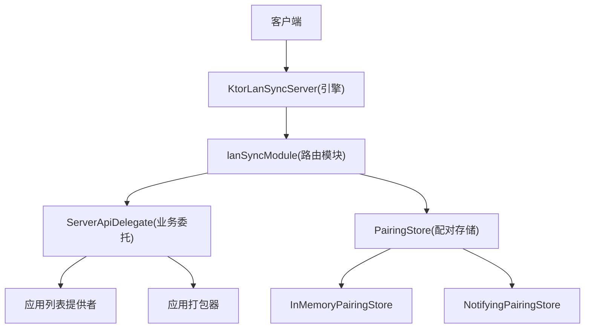
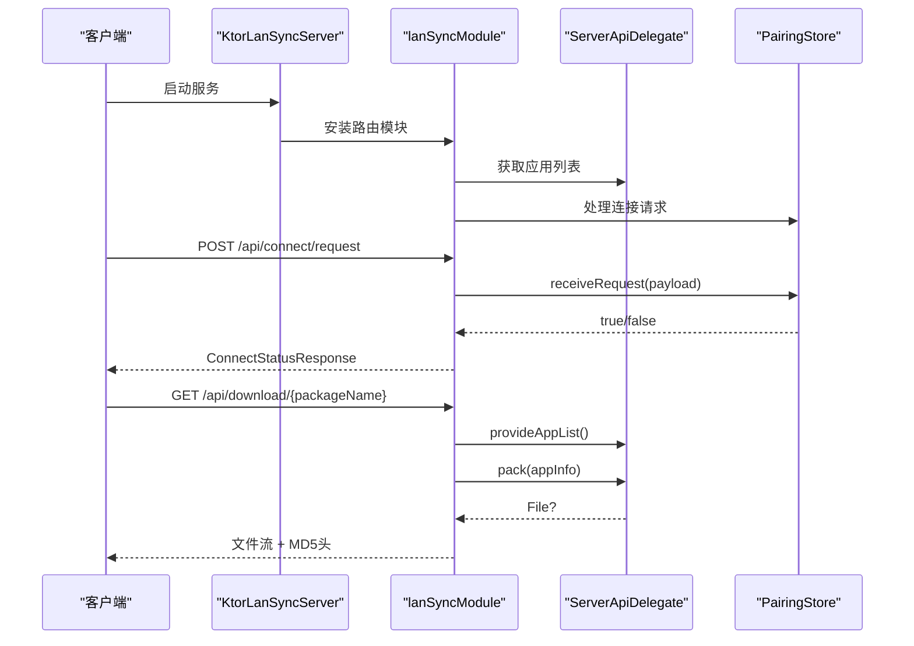
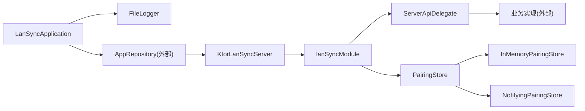
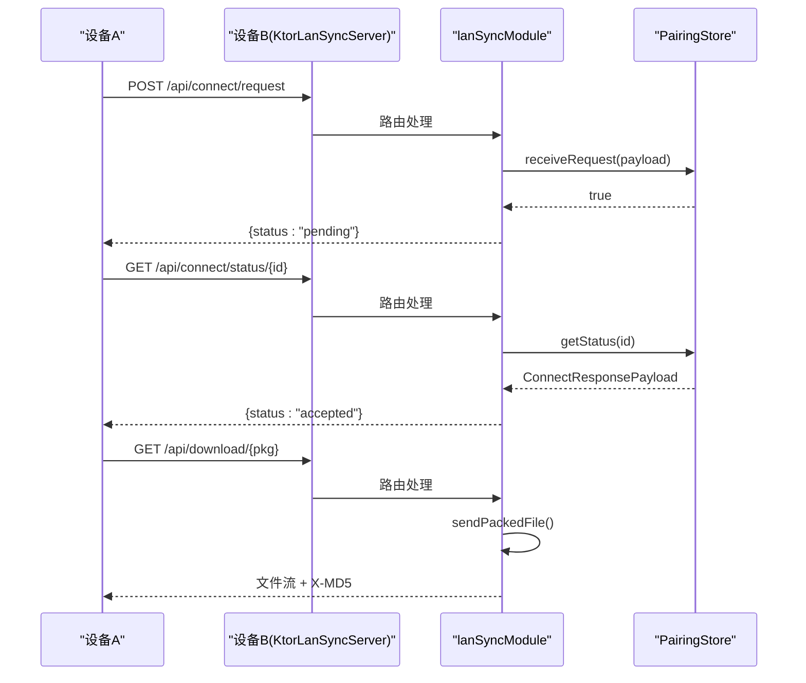

# HTTP服务器

<cite>
**本文引用的文件**
- [KtorLanSyncServer.kt](file://app/src/main/java/com/lansync/app/data/server/KtorLanSyncServer.kt)
- [LanSyncRouting.kt](file://app/src/main/java/com/lansync/app/data/server/LanSyncRouting.kt)
- [ServerContracts.kt](file://app/src/main/java/com/lansync/app/data/server/ServerContracts.kt)
- [InMemoryPairingStore.kt](file://app/src/main/java/com/lansync/app/data/server/InMemoryPairingStore.kt)
- [NotifyingPairingStore.kt](file://app/src/main/java/com/lansync/app/data/server/NotifyingPairingStore.kt)
- [Models.kt](file://app/src/main/java/com/lansync/app/data/model/Models.kt)
- [FileLogger.kt](file://app/src/main/java/com/lansync/app/data/FileLogger.kt)
- [HashUtils.kt](file://app/src/main/java/com/lansync/app/data/HashUtils.kt)
- [LanSyncApplication.kt](file://app/src/main/java/com/lansync/app/LanSyncApplication.kt)
</cite>

## 更新摘要
**所做更改**
- 将HTTP服务器实现从旧的KtorServer重构为模块化的KtorLanSyncServer架构
- 移除了329行的旧实现，采用接口契约和依赖注入模式
- 新增ServerApiDelegate、PairingStore等核心接口定义
- 重新设计了路由模块，支持独立测试和更好的可维护性
- 更新了所有相关组件的引用和架构图

## 目录
1. [简介](#简介)
2. [项目结构](#项目结构)
3. [核心组件](#核心组件)
4. [架构总览](#架构总览)
5. [详细组件分析](#详细组件分析)
6. [依赖关系分析](#依赖关系分析)
7. [性能考量](#性能考量)
8. [故障排查指南](#故障排查指南)
9. [结论](#结论)
10. [附录：API使用示例与集成指南](#附录api使用示例与集成指南)

## 简介
本文件为 LanSync 应用内基于 Ktor 的 HTTP 服务器实现提供完整技术文档。经过重构后，服务器采用了更加模块化和接口化的架构设计，通过 KtorLanSyncServer 作为核心入口，配合 ServerApiDelegate 和 PairingStore 接口契约，实现了路由处理与业务逻辑的完全解耦。内容涵盖新的模块化架构、接口契约设计、各 API 端点实现（设备发现、应用列表、连接握手、文件下载等）、请求处理流程与响应格式规范、安全与访问控制策略、错误处理与日志记录，以及 API 使用示例和集成指南。

## 项目结构
重构后的HTTP服务器采用分层架构设计，位于 data/server 包中：
- **服务器引擎层**：KtorLanSyncServer 负责 Netty 引擎的生命周期管理
- **路由模块层**：LanSyncRouting 提供独立的 Ktor 路由模块，支持独立测试
- **接口契约层**：ServerContracts 定义了服务器接口、委托接口和配对存储接口
- **存储实现层**：InMemoryPairingStore 和 NotifyingPairingStore 提供配对状态管理
- **业务数据层**：通过 ServerApiDelegate 注入应用列表、打包器等业务能力

**图表来源**
- [KtorLanSyncServer.kt:16-44](file://app/src/main/java/com/lansync/app/data/server/KtorLanSyncServer.kt#L16-L44)
- [LanSyncRouting.kt:49-253](file://app/src/main/java/com/lansync/app/data/server/LanSyncRouting.kt#L49-L253)
- [ServerContracts.kt:15-67](file://app/src/main/java/com/lansync/app/data/server/ServerContracts.kt#L15-L67)

**章节来源**
- [KtorLanSyncServer.kt:16-44](file://app/src/main/java/com/lansync/app/data/server/KtorLanSyncServer.kt#L16-L44)
- [ServerContracts.kt:15-67](file://app/src/main/java/com/lansync/app/data/server/ServerContracts.kt#L15-L67)

## 核心组件
重构后的核心组件包括：

- **KtorLanSyncServer**：基于 Netty 的嵌入式 HTTP 服务器实现，负责引擎启停和端口管理，通过构造注入依赖
- **ServerApiDelegate**：业务委托接口，提供应用列表、打包、断开连接回调等业务能力
- **PairingStore**：配对协议状态存储接口，管理连接请求的状态机
- **InMemoryPairingStore**：内存实现的配对存储，支持超时处理和状态转换
- **NotifyingPairingStore**：装饰器模式的配对存储，在接收请求时触发回调
- **LanSyncRouting**：独立的 Ktor 路由模块，包含所有 API 端点的处理逻辑

**章节来源**
- [KtorLanSyncServer.kt:16-44](file://app/src/main/java/com/lansync/app/data/server/KtorLanSyncServer.kt#L16-L44)
- [ServerContracts.kt:31-67](file://app/src/main/java/com/lansync/app/data/server/ServerContracts.kt#L31-L67)
- [InMemoryPairingStore.kt:24-119](file://app/src/main/java/com/lansync/app/data/server/InMemoryPairingStore.kt#L24-L119)
- [NotifyingPairingStore.kt:15-41](file://app/src/main/java/com/lansync/app/data/server/NotifyingPairingStore.kt#L15-L41)

## 架构总览
新的架构通过接口契约实现了高度的模块化和可测试性。KtorLanSyncServer 仅负责引擎生命周期，所有路由逻辑集中在 lanSyncModule 中，通过依赖注入获取业务能力和状态存储。

**图表来源**
- [KtorLanSyncServer.kt:24-33](file://app/src/main/java/com/lansync/app/data/server/KtorLanSyncServer.kt#L24-L33)
- [LanSyncRouting.kt:71-91](file://app/src/main/java/com/lansync/app/data/server/LanSyncRouting.kt#L71-L91)
- [LanSyncRouting.kt:163-188](file://app/src/main/java/com/lansync/app/data/server/LanSyncRouting.kt#L163-L188)

## 详细组件分析

### KtorLanSyncServer：服务器引擎
**更新** 重构后的服务器引擎专注于生命周期管理，通过构造注入依赖，消除了旧实现中的可变回调。

- **依赖注入**：通过构造函数注入 ServerApiDelegate 和 PairingStore，取代了旧的 setXxx 回调机制
- **引擎管理**：使用 embeddedServer 创建 Netty 引擎，支持 port=0 的动态端口分配
- **生命周期**：提供 start、stop、isRunning、getPort 标准接口方法
- **端口管理**：通过 resolvedConnectors().first().port 获取实际分配的端口

**章节来源**
- [KtorLanSyncServer.kt:16-44](file://app/src/main/java/com/lansync/app/data/server/KtorLanSyncServer.kt#L16-L44)

### LanSyncRouting：路由模块
**更新** 路由逻辑被重构为独立的 Application.lanSyncModule 扩展函数，支持独立测试。

- **JSON配置**：使用 LanSyncJson 配置序列化选项，确保与 SPEC.md 的一致性
- **中间件**：安装 ContentNegotiation 插件，配置 JSON 序列化
- **路由处理**：实现所有10个API端点，遵循 SPEC.md §3 的定义
- **错误处理**：统一的错误响应格式，使用 LanSyncErrorDto 替代纯文本错误
- **文件下载**：流式传输支持，自动计算MD5并设置响应头

**章节来源**
- [LanSyncRouting.kt:32-49](file://app/src/main/java/com/lansync/app/data/server/LanSyncRouting.kt#L32-L49)
- [LanSyncRouting.kt:52-253](file://app/src/main/java/com/lansync/app/data/server/LanSyncRouting.kt#L52-L253)

### ServerContracts：接口契约
**更新** 新增了完整的接口契约定义，实现了关注点分离。

- **LanSyncServer**：服务器生命周期接口，定义标准的启动、停止、状态查询方法
- **ServerApiDelegate**：业务委托接口，抽象出应用列表、打包、回调等业务能力
- **PairingStore**：配对存储接口，定义连接请求的状态管理机制

**章节来源**
- [ServerContracts.kt:15-67](file://app/src/main/java/com/lansync/app/data/server/ServerContracts.kt#L15-L67)

### InMemoryPairingStore：内存存储实现
**更新** 重写了配对状态管理，专注于协议状态机，移除了UI相关的StateFlow。

- **状态管理**：使用 ConcurrentHashMap 管理待处理的连接请求
- **超时处理**：15秒自动超时机制，符合 SPEC.md §7.2 的要求
- **状态转换**：支持 PENDING → ACCEPTED/REJECTED/TIMEOUT 的状态转换
- **并发安全**：线程安全的请求登记和状态查询

**章节来源**
- [InMemoryPairingStore.kt:24-119](file://app/src/main/java/com/lansync/app/data/server/InMemoryPairingStore.kt#L24-L119)

### NotifyingPairingStore：通知装饰器
**新增** 装饰器模式的实现，用于在接收请求时触发回调。

- **装饰器模式**：包装现有的 PairingStore 实现，在不修改原有逻辑的情况下添加功能
- **回调机制**：在成功登记请求后调用 onNewRequest 回调
- **Phase 4 支持**：为后续的连接协调器集成预留扩展点

**章节来源**
- [NotifyingPairingStore.kt:15-41](file://app/src/main/java/com/lansync/app/data/server/NotifyingPairingStore.kt#L15-L41)

### 数据模型：Models
**更新** 数据模型保持不变，继续提供统一的数据契约。

- **应用信息**：AppInfo 包含应用的元数据和提取状态
- **连接协议**：ConnectRequestPayload、ConnectResponsePayload 等定义连接握手协议
- **设备信息**：DeviceInfo、DeviceInfoResponse 等设备标识和状态信息

**章节来源**
- [Models.kt:5-138](file://app/src/main/java/com/lansync/app/data/model/Models.kt#L5-L138)

## 依赖关系分析
**更新** 重构后的依赖关系更加清晰，通过接口契约实现了松耦合。

**图表来源**
- [LanSyncApplication.kt:6-11](file://app/src/main/java/com/lansync/app/LanSyncApplication.kt#L6-L11)
- [KtorLanSyncServer.kt:16-19](file://app/src/main/java/com/lansync/app/data/server/KtorLanSyncServer.kt#L16-L19)
- [ServerContracts.kt:31-67](file://app/src/main/java/com/lansync/app/data/server/ServerContracts.kt#L31-L67)

**章节来源**
- [LanSyncApplication.kt:6-11](file://app/src/main/java/com/lansync/app/LanSyncApplication.kt#L6-L11)
- [ServerContracts.kt:31-67](file://app/src/main/java/com/lansync/app/data/server/ServerContracts.kt#L31-L67)

## 性能考量
重构后的架构在性能方面有以下优化：

- **模块化路由**：独立的路由模块支持更好的缓存和编译优化
- **接口抽象**：通过接口契约减少运行时依赖查找开销
- **内存管理**：InMemoryPairingStore 使用高效的并发数据结构
- **流式传输**：文件下载保持流式处理，避免大文件内存占用
- **异步处理**：超时处理使用协程，不阻塞主线程

## 故障排查指南
**更新** 重构后的错误处理更加统一和结构化。

- **常见错误**
  - 连接请求冲突：重复 requestId 会返回 409 Conflict
  - 应用不可提取：系统应用返回 403 Forbidden
  - 打包失败：返回 500 Internal Server Error
  - 请求解析错误：返回 400 Bad Request

- **日志定位**
  - 所有关键操作都通过 FileLogger 记录详细日志
  - 错误响应包含结构化的错误码和消息
  - 支持调试级别的详细日志输出

**章节来源**
- [LanSyncRouting.kt:71-91](file://app/src/main/java/com/lansync/app/data/server/LanSyncRouting.kt#L71-L91)
- [LanSyncRouting.kt:163-188](file://app/src/main/java/com/lansync/app/data/server/LanSyncRouting.kt#L163-L188)
- [LanSyncRouting.kt:261-299](file://app/src/main/java/com/lansync/app/data/server/LanSyncRouting.kt#L261-L299)

## 结论
重构后的 HTTP 服务器通过接口契约和模块化设计，实现了更高的可维护性和可测试性。新的架构消除了旧实现中的紧耦合问题，提供了清晰的职责分离和扩展点。通过 KtorLanSyncServer、ServerApiDelegate 和 PairingStore 等核心组件的配合，实现了稳定可靠的局域网应用同步服务。

## 附录：API使用示例与集成指南

### 基础约定
- **内容类型**：JSON（除文件下载外）
- **字符编码**：UTF-8
- **认证与安全**：当前未启用鉴权，建议在网关或网络层增加访问控制

### 端点清单与行为
所有端点均遵循 SPEC.md 定义，通过新的模块化架构实现：

- **GET /api/ping**：健康检查，返回 `{"status":"pong"}`
- **GET /api/applist**：获取本地应用列表，返回 AppInfo 数组
- **POST /api/connect/request**：发起连接请求，返回 pending 或 conflict
- **GET /api/connect/status/{requestId}**：轮询连接状态，返回 accepted/rejected/pending
- **POST /api/connect/response/{requestId}**：响应连接请求，接受或拒绝
- **GET /api/download/{packageName}**：下载最新版本应用，返回文件流
- **GET /api/download/{packageName}/{versionCode}**：按版本精确下载
- **POST /api/disconnect**：通知断开连接
- **POST /api/refresh-applist**：通知刷新应用列表
- **GET /api/deviceinfo**：获取设备信息

### 典型交互序列

**图表来源**
- [LanSyncRouting.kt:71-91](file://app/src/main/java/com/lansync/app/data/server/LanSyncRouting.kt#L71-L91)
- [LanSyncRouting.kt:94-120](file://app/src/main/java/com/lansync/app/data/server/LanSyncRouting.kt#L94-L120)
- [LanSyncRouting.kt:163-188](file://app/src/main/java/com/lansync/app/data/server/LanSyncRouting.kt#L163-L188)

### 集成要点
**更新** 新的集成方式更加简洁和类型安全：

- **服务器启动**：通过构造注入 ServerApiDelegate 和 PairingStore
- **依赖注入**：推荐使用 Hilt 或其他 DI 框架进行依赖管理
- **测试支持**：可使用 ktor-server-test-host 直接测试路由模块
- **扩展点**：通过实现 ServerApiDelegate 接口添加自定义业务逻辑

**章节来源**
- [KtorLanSyncServer.kt:16-19](file://app/src/main/java/com/lansync/app/data/server/KtorLanSyncServer.kt#L16-L19)
- [LanSyncRouting.kt:49-50](file://app/src/main/java/com/lansync/app/data/server/LanSyncRouting.kt#L49-L50)
- [ServerContracts.kt:31-46](file://app/src/main/java/com/lansync/app/data/server/ServerContracts.kt#L31-L46)