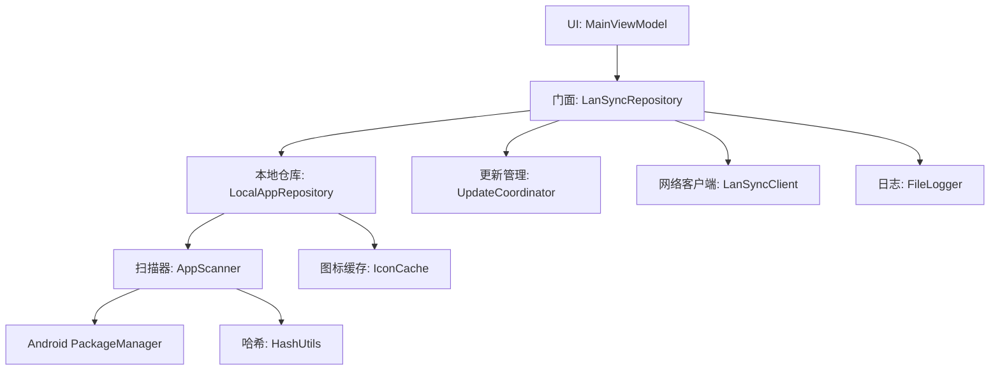
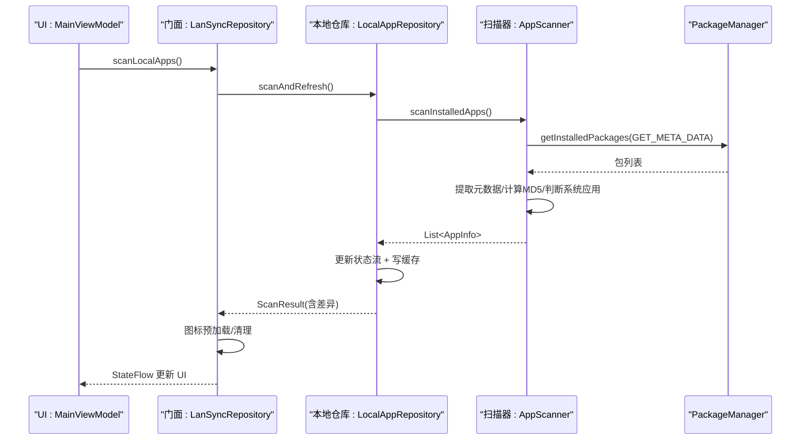
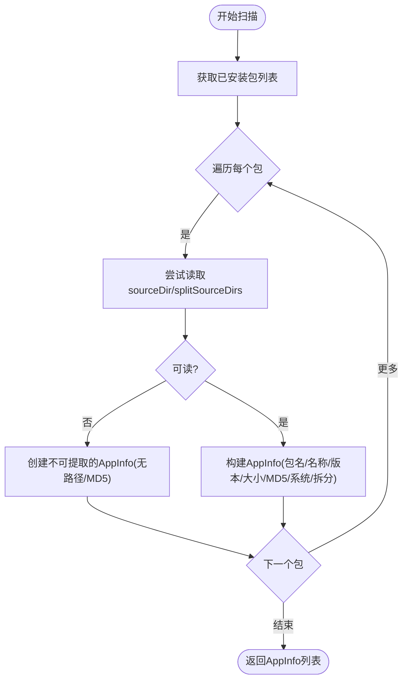
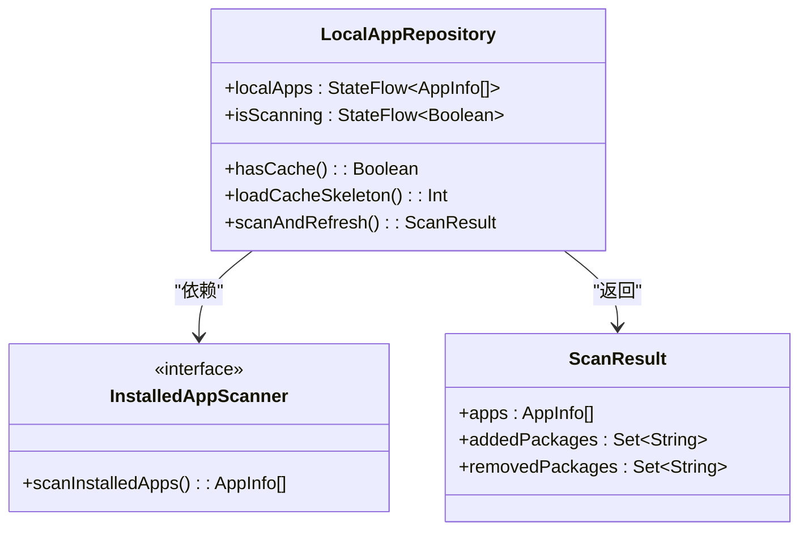
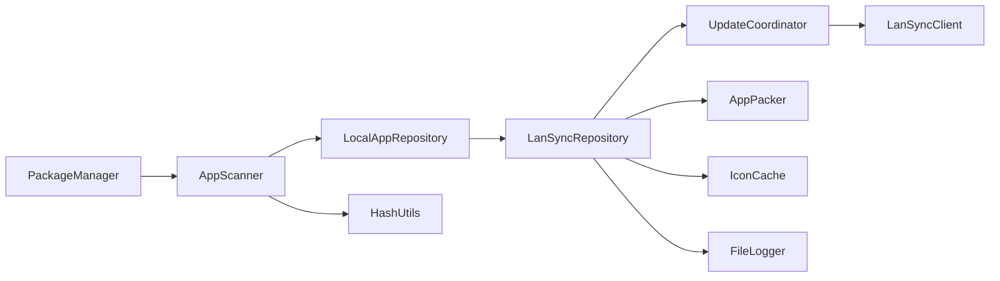

# 应用扫描器

<cite>
**本文引用的文件**
- [AppScanner.kt](file://app/src/main/java/com/lansync/app/data/localapps/AppScanner.kt)
- [InstalledAppScanner.kt](file://app/src/main/java/com/lansync/app/data/localapps/InstalledAppScanner.kt)
- [LocalAppRepository.kt](file://app/src/main/java/com/lansync/app/data/localapps/LocalAppRepository.kt)
- [LanSyncGraph.kt](file://app/src/main/java/com/lansync/app/data/repository/LanSyncGraph.kt)
- [LanSyncRepository.kt](file://app/src/main/java/com/lansync/app/data/repository/LanSyncRepository.kt)
- [Models.kt](file://app/src/main/java/com/lansync/app/data/model/Models.kt)
- [MainViewModel.kt](file://app/src/main/java/com/lansync/app/ui/viewmodel/MainViewModel.kt)
- [AppPacker.kt](file://app/src/main/java/com/lansync/app/data/packer/AppPacker.kt)
- [UpdateManager.kt](file://app/src/main/java/com/lansync/app/data/update/UpdateManager.kt)
- [AppIconDiskCache.kt](file://app/src/main/java/com/lansync/app/data/cache/AppIconDiskCache.kt)
- [FileLogger.kt](file://app/src/main/java/com/lansync/app/data/FileLogger.kt)
- [HashUtils.kt](file://app/src/main/java/com/lansync/app/data/HashUtils.kt)
</cite>

## 更新摘要
**所做更改**
- 更新了项目结构部分，反映应用扫描器从 `data/scanner` 移动到 `data/localapps`
- 新增了接口抽象层（InstalledAppScanner）的说明
- 更新了依赖注入和组件关系图
- 增强了架构设计说明，突出解耦和可测试性改进
- 更新了使用示例以反映新的调用方式

## 目录
1. [简介](#简介)
2. [项目结构](#项目结构)
3. [核心组件](#核心组件)
4. [架构总览](#架构总览)
5. [详细组件分析](#详细组件分析)
6. [依赖关系分析](#依赖关系分析)
7. [性能考量](#性能考量)
8. [故障排查指南](#故障排查指南)
9. [结论](#结论)
10. [附录：配置与使用示例](#附录：配置与使用示例)

## 简介
本文件聚焦 LanSync 应用的"应用扫描器"能力，系统性说明 Android 包管理器集成、已安装应用的扫描与过滤机制、应用信息提取（包名、版本代码、图标与应用名称）、权限检查与系统限制处理、扫描性能优化（异步与增量更新）、异常处理与错误恢复、扫描配置选项与自定义过滤器实现，以及具体使用示例和性能基准测试方法。

**更新** 应用扫描器已从旧的 `data/scanner.AppScanner` 重构并迁移到 `data/localapps.AppScanner`，引入了接口抽象层以提高可测试性和解耦度。

## 项目结构
围绕"应用扫描器"的关键模块分布如下：
- **扫描层**：`AppScanner` 负责调用 PackageManager 获取已安装包并提取元数据，通过 `InstalledAppScanner` 接口抽象
- **仓库层**：`LocalAppRepository` 管理本地应用缓存、状态管理和扫描结果处理
- **组合根**：`LanSyncGraph` 负责依赖注入和组件组装
- **门面层**：`LanSyncRepository` 提供统一的业务接口
- UI 层：`MainViewModel` 暴露 UI 状态并驱动扫描流程
- 辅助工具：HashUtils、FileLogger、AppIconDiskCache、AppPacker、UpdateManager



**图表来源**
- [LanSyncGraph.kt:56-59](file://app/src/main/java/com/lansync/app/data/repository/LanSyncGraph.kt#L56-L59)
- [LanSyncRepository.kt:106-111](file://app/src/main/java/com/lansync/app/data/repository/LanSyncRepository.kt#L106-L111)
- [LocalAppRepository.kt:26-30](file://app/src/main/java/com/lansync/app/data/localapps/LocalAppRepository.kt#L26-L30)

**章节来源**
- [LanSyncGraph.kt:52-127](file://app/src/main/java/com/lansync/app/data/repository/LanSyncGraph.kt#L52-L127)
- [LanSyncRepository.kt:38-49](file://app/src/main/java/com/lansync/app/data/repository/LanSyncRepository.kt#L38-L49)
- [LocalAppRepository.kt:26-30](file://app/src/main/java/com/lansync/app/data/localapps/LocalAppRepository.kt#L26-L30)

## 核心组件
- **AppScanner**：封装对 PackageManager 的调用，遍历已安装包，提取可访问的源路径、应用名、版本信息，计算文件大小与 MD5，区分系统应用与 Split APK，并在不可提取时降级为只读元数据。**新增**：实现了 `InstalledAppScanner` 接口，支持依赖注入和单元测试。
- **InstalledAppScanner**：本机已安装应用扫描抽象接口，使 `LocalAppRepository` 可被 Fake 实现替换进行单元测试。
- **LocalAppRepository**：管理本地应用缓存、状态流、扫描触发和结果处理，提供骨架加载策略避免启动时的脏展示。
- **LanSyncRepository**：组合门面类，协调各子模块并提供统一 API，替代了旧的巨型 `AppRepository`。
- **LanSyncGraph**：依赖注入容器，负责构建和配置所有组件实例。
- **MainViewModel**：将 Repository 的状态组合为 UiState，驱动启动、扫描、连接、批量更新等操作。
- **UpdateCoordinator**：并发拉取远端应用列表并与本地对比，生成更新建议与差异集。
- **AppPacker**：将单 APK 或 Split APK 打包为 .apk/.apks，供网络传输。
- **LanSyncClient**：通过 HTTP 与远端设备交互，包括连接握手、应用列表拉取、下载与校验。
- **IconCache**：持久化应用图标到磁盘，支持批量写入与清理。
- **HashUtils**：文件级 MD5 计算，用于完整性校验。
- **FileLogger**：异步落盘日志，便于问题定位。

**章节来源**
- [AppScanner.kt:25-97](file://app/src/main/java/com/lansync/app/data/localapps/AppScanner.kt#L25-L97)
- [InstalledAppScanner.kt:11-14](file://app/src/main/java/com/lansync/app/data/localapps/InstalledAppScanner.kt#L11-L14)
- [LocalAppRepository.kt:26-104](file://app/src/main/java/com/lansync/app/data/localapps/LocalAppRepository.kt#L26-L104)
- [LanSyncRepository.kt:38-158](file://app/src/main/java/com/lansync/app/data/repository/LanSyncRepository.kt#L38-L158)
- [LanSyncGraph.kt:52-127](file://app/src/main/java/com/lansync/app/data/repository/LanSyncGraph.kt#L52-L127)

## 架构总览
应用扫描器在整体架构中的职责边界如下：
- **输入**：Android 系统的 PackageManager 提供的已安装包集合
- **处理**：逐包提取元数据、判断可提取性、计算哈希与大小、标记系统应用与 Split APK
- **输出**：AppInfo 列表，供仓库层进行缓存、展示、与远端设备对比更新
- **协同**：与 LocalAppRepository 配合实现增量更新、与 UpdateCoordinator 协作进行远端应用列表同步



**图表来源**
- [MainViewModel.kt:74-87](file://app/src/main/java/com/lansync/app/ui/viewmodel/MainViewModel.kt#L74-L87)
- [LanSyncRepository.kt:106-111](file://app/src/main/java/com/lansync/app/data/repository/LanSyncRepository.kt#L106-L111)
- [LocalAppRepository.kt:55-75](file://app/src/main/java/com/lansync/app/data/localapps/LocalAppRepository.kt#L55-L75)
- [AppScanner.kt:27-39](file://app/src/main/java/com/lansync/app/data/localapps/AppScanner.kt#L27-L39)

## 详细组件分析

### 应用扫描器（AppScanner）
- **包管理器集成**
  - 使用 PackageManager.getInstalledPackages(GET_META_DATA) 获取已安装包列表，兼容高版本 API 标志位。
  - 遍历 PackageInfo/ApplicationInfo，尝试读取 sourceDir 与 splitSourceDirs，仅当可读时才纳入可提取范围。
- **应用信息提取**
  - 包名、应用名（loadLabel）、版本名、版本代码（longVersionCode）。
  - 计算总文件大小与 MD5（基于所有可读取源路径），标记是否为系统应用与是否 Split APK。
- **过滤机制**
  - 若无法读取源路径或抛出安全异常，则降级为不可提取模式，保留基本元数据但不包含源路径与 MD5。
  - 当前未显式按用户/系统应用过滤，过滤逻辑由 UI 层根据 isSystemApp 字段进行筛选。
- **异常处理**
  - 捕获 SecurityException 与通用异常，确保单个包失败不影响整体扫描。
  - 统计过滤数量并记录日志。



**图表来源**
- [AppScanner.kt:27-39](file://app/src/main/java/com/lansync/app/data/localapps/AppScanner.kt#L27-L39)
- [AppScanner.kt:41-92](file://app/src/main/java/com/lansync/app/data/localapps/AppScanner.kt#L41-L92)

**章节来源**
- [AppScanner.kt:25-97](file://app/src/main/java/com/lansync/app/data/localapps/AppScanner.kt#L25-L97)

### 接口抽象层（InstalledAppScanner）
**新增** 引入接口抽象层以提高可测试性和解耦度：
- 定义了 `scanInstalledApps()` 方法契约
- 使 `LocalAppRepository` 可被 Fake 实现替换进行单元测试
- 保持与旧 `data.scanner.AppScanner.scanInstalledApps` 的兼容性

**章节来源**
- [InstalledAppScanner.kt:5-14](file://app/src/main/java/com/lansync/app/data/localapps/InstalledAppScanner.kt#L5-L14)

### 本地应用仓库（LocalAppRepository）
- **扫描编排**
  - 调用 InstalledAppScanner.scanInstalledApps() 获取本地应用列表。
  - 将结果保存到本地缓存文件，并维护 StateFlow 暴露给 UI。
  - 增量更新：对比前后包名集合，移除不再存在的图标缓存。
- **启动策略**
  - 先 loadCacheSkeleton() 用缓存骨架填充（启动即展示）
  - 再由调用方后台 scanAndRefresh() 静默校验刷新
  - 避免陈旧缓存导致的短暂脏展示与「install not found」
- **状态管理**
  - localApps: StateFlow<List<AppInfo>> 应用列表状态
  - isScanning: StateFlow<Boolean> 扫描状态
  - hasCache(): 检查缓存是否存在且非空



**图表来源**
- [LocalAppRepository.kt:26-30](file://app/src/main/java/com/lansync/app/data/localapps/LocalAppRepository.kt#L26-L30)
- [LocalAppRepository.kt:94-98](file://app/src/main/java/com/lansync/app/data/localapps/LocalAppRepository.kt#L94-L98)

**章节来源**
- [LocalAppRepository.kt:26-104](file://app/src/main/java/com/lansync/app/data/localapps/LocalAppRepository.kt#L26-L104)

### 组合门面（LanSyncRepository）
- **职责简化**
  - 只做「组合 + 委托 + 生命周期编排」，不含业务逻辑
  - 替代了旧的 1181 行上帝类 `AppRepository`，硬性约束 ≤300 行
- **扫描集成**
  - scanLocalApps() 方法委托给 LocalAppRepository
  - 自动处理图标预加载和清理
  - 通知已连接设备刷新应用列表
- **状态转发**
  - 直接转发各协作者的 StateFlow（零业务逻辑）
  - localApps, isScanningApps, discoveredDevices, connectedDevices 等

**章节来源**
- [LanSyncRepository.kt:27-37](file://app/src/main/java/com/lansync/app/data/repository/LanSyncRepository.kt#L27-L37)
- [LanSyncRepository.kt:102-118](file://app/src/main/java/com/lansync/app/data/repository/LanSyncRepository.kt#L102-L118)

### 依赖注入（LanSyncGraph）
**新增** 引入依赖注入容器：
- 构建并持有单例 LanSyncRepository 对象图
- 配置 LocalAppRepository 与 AppScanner 的依赖关系
- 打破循环依赖，使用 late-bind 引用
- 统一管理所有组件的生命周期

**章节来源**
- [LanSyncGraph.kt:35-41](file://app/src/main/java/com/lansync/app/data/repository/LanSyncGraph.kt#L35-L41)
- [LanSyncGraph.kt:52-127](file://app/src/main/java/com/lansync/app/data/repository/LanSyncGraph.kt#L52-L127)

### UI 层（MainViewModel）
- **自动启动与初始扫描**
  - 若无本地缓存则执行首次扫描，再启动服务；否则直接启动服务并后台扫描。
- **状态组合**
  - 将 Repository 的多路 StateFlow 组合为 UiState，驱动界面显示。
- **操作入口**
  - 提供连接、断开、刷新、批量更新、拉取远端应用等方法。

**章节来源**
- [MainViewModel.kt:73-87](file://app/src/main/java/com/lansync/app/ui/viewmodel/MainViewModel.kt#L73-L87)
- [MainViewModel.kt:90-134](file://app/src/main/java/com/lansync/app/ui/viewmodel/MainViewModel.kt#L90-L134)

### 更新管理与差异计算（UpdateCoordinator）
- 并发拉取远端应用列表并与本地对比，跳过系统应用，仅当远端版本更高时视为可更新。
- 去重策略：按包名取最高 versionCode；平级时选择设备名更小的作为推荐来源。
- 差异集：NEWER_ON_REMOTE / ONLY_ON_REMOTE / SAME_VERSION / ONLY_ON_LOCAL。

**章节来源**
- [UpdateManager.kt:12-35](file://app/src/main/java/com/lansync/app/data/update/UpdateManager.kt#L12-L35)
- [UpdateManager.kt:37-69](file://app/src/main/java/com/lansync/app/data/update/UpdateManager.kt#L37-L69)
- [UpdateManager.kt:81-102](file://app/src/main/java/com/lansync/app/data/update/UpdateManager.kt#L81-L102)

### 打包与下载（AppPacker 与 LanSyncClient）
- **AppPacker**
  - 单 APK：复制源文件为 .apk。
  - Split APK：将 base.apk 与 split_N.apk 压缩为 .apks，内部条目命名固定，便于远端识别。
- **LanSyncClient**
  - 提供连接握手、应用列表拉取、设备信息获取、Ping、断开通知、刷新通知。
  - 下载支持进度回调与 MD5 校验（优先使用服务器响应头 X-MD5，否则回退到 expectedMd5）。

**章节来源**
- [AppPacker.kt:14-56](file://app/src/main/java/com/lansync/app/data/packer/AppPacker.kt#L14-L56)
- [AppPacker.kt:58-108](file://app/src/main/java/com/lansync/app/data/packer/AppPacker.kt#L58-L108)
- [AppListClient.kt:62-133](file://app/src/main/java/com/lansync/app/data/client/AppListClient.kt#L62-L133)
- [AppListClient.kt:358-462](file://app/src/main/java/com/lansync/app/data/client/AppListClient.kt#L358-L462)

### 图标缓存（IconCache）
- 将应用图标以 PNG 形式持久化到 filesDir/app_icons。
- 支持批量写入、清理过期图标、尺寸缩放读取以减少内存占用。

**章节来源**
- [AppIconDiskCache.kt:9-79](file://app/src/main/java/com/lansync/app/data/cache/AppIconDiskCache.kt#L9-L79)

### 日志与哈希（FileLogger 与 HashUtils）
- **FileLogger**：异步队列写入日志文件，支持轮转与备份，便于问题定位。
- **HashUtils**：文件级 MD5 计算，用于应用完整性校验与打包产物一致性验证。

**章节来源**
- [FileLogger.kt:19-167](file://app/src/main/java/com/lansync/app/data/FileLogger.kt#L19-L167)
- [HashUtils.kt:6-54](file://app/src/main/java/com/lansync/app/data/HashUtils.kt#L6-L54)

## 依赖关系分析
- **组件耦合**
  - **LanSyncRepository** 高度聚合，协调扫描、连接、更新、下载、缓存等多个子模块，属于门面类。
  - **AppScanner** 低耦合，仅依赖 PackageManager 与基础工具，通过接口抽象提高可测试性。
  - **LocalAppRepository** 依赖 InstalledAppScanner 接口而非具体实现，支持依赖注入。
  - **UpdateCoordinator** 依赖 UpdateManager 进行远端数据获取。
- **外部依赖**
  - Android PackageManager：系统级应用枚举与元数据读取。
  - OkHttp：HTTP 请求与下载。
  - Kotlinx Serialization：JSON 编解码。
  - Coroutines：协程调度与并发控制。



**图表来源**
- [AppScanner.kt:27-39](file://app/src/main/java/com/lansync/app/data/localapps/AppScanner.kt#L27-L39)
- [LocalAppRepository.kt:26-30](file://app/src/main/java/com/lansync/app/data/localapps/LocalAppRepository.kt#L26-L30)
- [LanSyncRepository.kt:38-49](file://app/src/main/java/com/lansync/app/data/repository/LanSyncRepository.kt#L38-L49)

**章节来源**
- [LanSyncRepository.kt:38-49](file://app/src/main/java/com/lansync/app/data/repository/LanSyncRepository.kt#L38-L49)
- [AppScanner.kt:27-39](file://app/src/main/java/com/lansync/app/data/localapps/AppScanner.kt#L27-L39)
- [LocalAppRepository.kt:26-30](file://app/src/main/java/com/lansync/app/data/localapps/LocalAppRepository.kt#L26-L30)

## 性能考量
- **异步扫描**
  - AppScanner 在 IO 调度器中执行，避免阻塞主线程。
  - UpdateCoordinator 使用 async/awaitAll 并发拉取多设备应用列表，提升对比效率。
- **增量更新**
  - LocalAppRepository 在扫描后对比前后包名集合，移除失效图标缓存，减少无效 I/O。
  - 自动更新计算带节流（默认 5s），避免频繁重算。
- **网络与下载**
  - LanSyncClient 使用连接池与超时控制，下载过程支持进度回调与 MD5 校验。
- **缓存**
  - 本地应用列表与图标均做持久化缓存，缩短冷启动时间。
  - **新增** 骨架加载策略：启动时先加载缓存骨架，避免空白界面。
- **建议**
  - 针对大型设备上的大量应用，可考虑分页或按需加载。
  - 对 Split APK 的打包与传输可结合断点续传与并行分片以提升吞吐。

## 故障排查指南
- **常见问题定位**
  - 扫描结果为空或部分包被过滤：检查源路径可读性与权限，查看日志中"packages were filtered out during extraction"。
  - 连接超时或握手失败：检查网络连通性、端口开放与服务端状态，关注心跳失败计数与快速重连逻辑。
  - 下载失败或 MD5 不一致：确认服务器 X-MD5 与预期值一致，检查下载目录与文件完整性。
- **日志与调试**
  - 使用 FileLogger 输出的日志文件定位问题，关注关键步骤的耗时与异常堆栈。
  - 对 LanSyncRepository 的连接状态变化、心跳与同步任务进行追踪。

**章节来源**
- [AppScanner.kt:68-72](file://app/src/main/java/com/lansync/app/data/localapps/AppScanner.kt#L68-L72)
- [LocalAppRepository.kt:69-74](file://app/src/main/java/com/lansync/app/data/localapps/LocalAppRepository.kt#L69-L74)
- [AppListClient.kt:393-462](file://app/src/main/java/com/lansync/app/data/client/AppListClient.kt#L393-L462)
- [FileLogger.kt:19-167](file://app/src/main/java/com/lansync/app/data/FileLogger.kt#L19-L167)

## 结论
LanSync 的应用扫描器经过重构后，通过引入接口抽象层（InstalledAppScanner）和依赖注入（LanSyncGraph），显著提高了代码的可测试性和解耦度。新的架构以 AppScanner 为核心，结合 LocalAppRepository 的编排能力，实现了高效的本地应用扫描、缓存与增量更新，并通过 UpdateCoordinator 与 LanSyncClient 完成跨设备应用对比与更新分发。系统在异步与并发方面做了充分优化，具备完善的异常处理与日志记录能力。后续可进一步收敛 Repository 的职责边界、增强鉴权与隐私保护，并完善自动化测试覆盖。

## 附录：配置与使用示例

### 扫描配置选项
- **AppConfig** 提供心跳间隔、同步间隔、重试次数、超时等参数，可按场景调优：
  - heartbeatPingIntervalMs：心跳 ping 间隔
  - heartbeatSyncIntervalMs：周期同步间隔
  - heartbeatPingTolerance：不稳定容忍次数
  - heartbeatPingMaxFailures：最大失败次数
  - updateRecalculationThrottleMs：更新计算节流时间
  - fetchAppListMaxRetries / fetchAppListRetryDelayMs：应用列表拉取重试策略
  - pingTimeoutMs：ping 超时

**章节来源**
- [AppConfig.kt:3-18](file://app/src/main/java/com/lansync/app/data/AppConfig.kt#L3-L18)

### 自定义过滤器实现
- 当前扫描器未内置用户/系统应用过滤，建议在 UI 层根据 AppInfo.isSystemApp 进行筛选：
  - 用户应用：!isSystemApp
  - 系统应用：isSystemApp
- 如需更细粒度过滤（如隐藏特定包名），可在 UI 层增加条件判断。

**章节来源**
- [AppListScreen.kt:35-49](file://app/src/main/java/com/lansync/app/ui/components/AppListScreen.kt#L35-L49)

### 使用示例
- **启动与初始扫描**
  - 若无本地缓存，先执行 scanLocalApps()，再 start()；否则直接 start() 并后台扫描。
- **连接与刷新**
  - connectDevice(device) 发起连接，成功后后台拉取远端应用列表。
  - refreshConnectedDevice(device) 手动刷新指定设备的 appList。
- **批量更新**
  - 选择多个更新项后，startBatchUpdate() 依次下载并安装，收集错误并提示。

**章节来源**
- [MainViewModel.kt:73-87](file://app/src/main/java/com/lansync/app/ui/viewmodel/MainViewModel.kt#L73-L87)
- [MainViewModel.kt:162-180](file://app/src/main/java/com/lansync/app/ui/viewmodel/MainViewModel.kt#L162-L180)
- [MainViewModel.kt:245-274](file://app/src/main/java/com/lansync/app/ui/viewmodel/MainViewModel.kt#L245-L274)

### 性能基准测试方法
- **扫描耗时**
  - 记录 scanInstalledApps() 的执行时间，统计不同设备规模下的平均耗时与方差。
- **更新计算耗时**
  - 记录 findUpdates() 的耗时，评估并发拉取与对比的效率。
- **下载与校验**
  - 记录 downloadApksFile() 的耗时与吞吐，验证 MD5 校验对整体时延的影响。
- **指标建议**
  - 采集 CPU 使用率、I/O 等待、网络带宽占用，结合 FileLogger 的时间戳进行分析。

### 依赖注入配置示例
**新增** 依赖注入的使用方式：

```kotlin
// 在应用初始化时获取全局实例
val repository = LanSyncGraph.get(applicationContext)

// 通过门面类访问功能
repository.scanLocalApps()
repository.connectDevice(device)
repository.start()
```

**章节来源**
- [LanSyncGraph.kt:47-50](file://app/src/main/java/com/lansync/app/data/repository/LanSyncGraph.kt#L47-L50)
- [MainViewModel.kt:57](file://app/src/main/java/com/lansync/app/ui/viewmodel/MainViewModel.kt#L57)