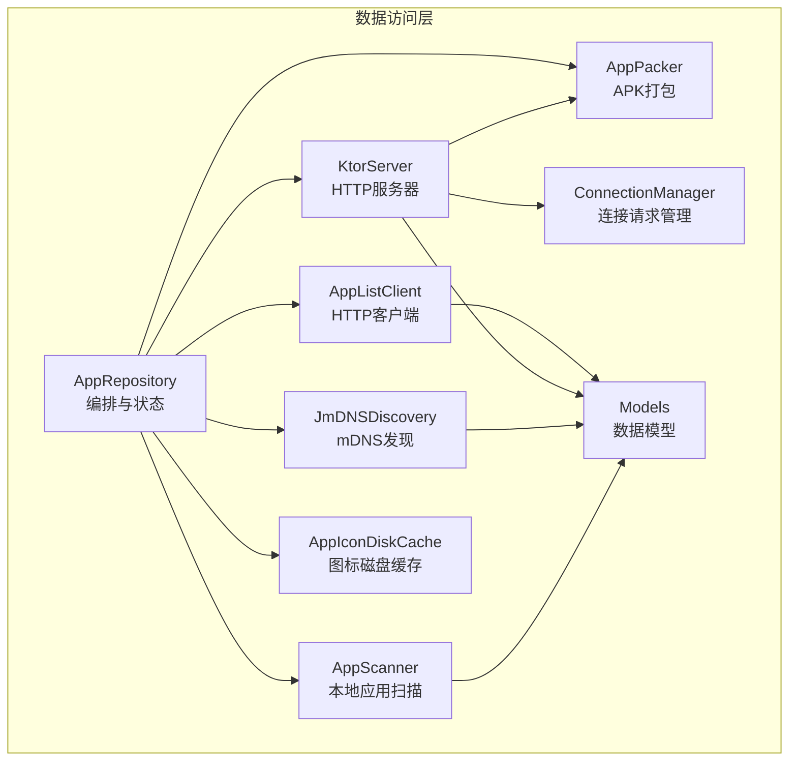
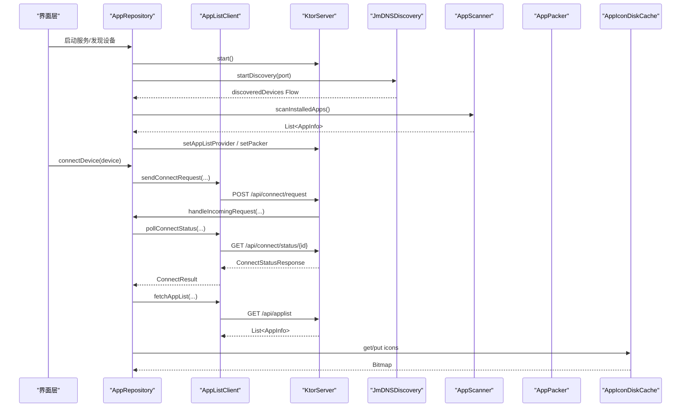
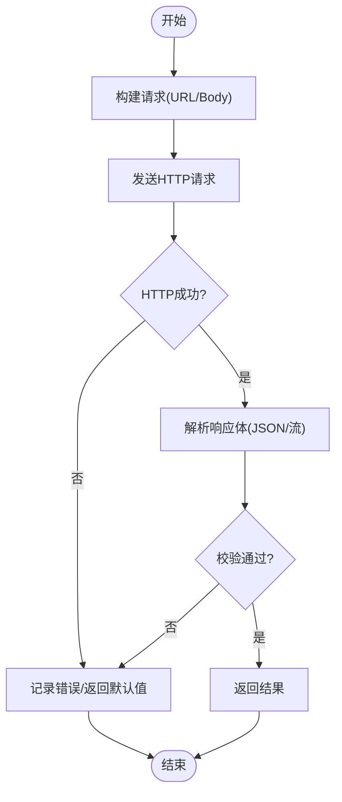
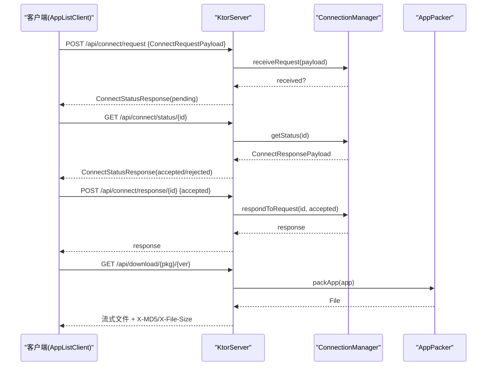
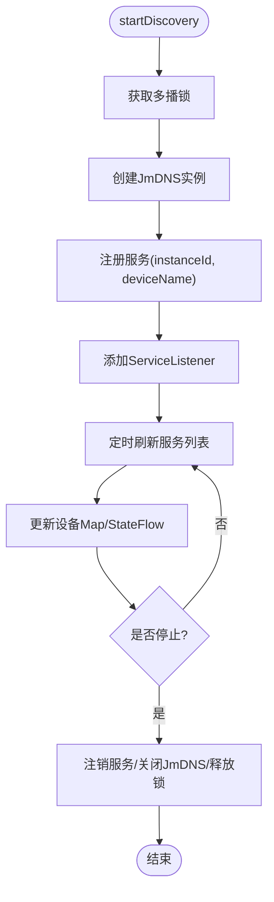
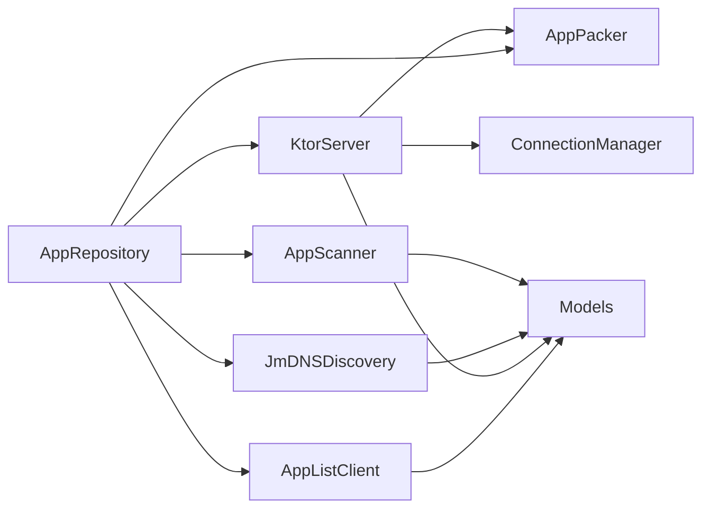

# 数据访问层

<cite>
**本文引用的文件**
- [AppListClient.kt](file://app/src/main/java/com/lansync/app/data/client/AppListClient.kt)
- [KtorServer.kt](file://app/src/main/java/com/lansync/app/data/server/KtorServer.kt)
- [JmDNSDiscovery.kt](file://app/src/main/java/com/lansync/app/data/discovery/JmDNSDiscovery.kt)
- [AppScanner.kt](file://app/src/main/java/com/lansync/app/data/scanner/AppScanner.kt)
- [AppIconDiskCache.kt](file://app/src/main/java/com/lansync/app/data/cache/AppIconDiskCache.kt)
- [Models.kt](file://app/src/main/java/com/lansync/app/data/model/Models.kt)
- [ConnectionManager.kt](file://app/src/main/java/com/lansync/app/data/connection/ConnectionManager.kt)
- [AppPacker.kt](file://app/src/main/java/com/lansync/app/data/packer/AppPacker.kt)
- [AppRepository.kt](file://app/src/main/java/com/lansync/app/data/repository/AppRepository.kt)
</cite>

## 目录
1. [简介](#简介)
2. [项目结构](#项目结构)
3. [核心组件](#核心组件)
4. [架构总览](#架构总览)
5. [详细组件分析](#详细组件分析)
6. [依赖关系分析](#依赖关系分析)
7. [性能考量](#性能考量)
8. [故障排查指南](#故障排查指南)
9. [结论](#结论)
10. [附录：API调用示例与最佳实践](#附录api调用示例与最佳实践)

## 简介
本设计文档聚焦LanSync应用的数据访问层，围绕统一的数据源抽象、网络客户端、本地存储、设备发现与应用扫描等模块展开。重点说明：
- AppListClient的网络请求封装与错误处理机制
- KtorServer的HTTP API设计与路由配置
- JmDNSDiscovery的mDNS协议实现与设备发现流程
- AppScanner的应用扫描机制
- 缓存策略（AppIconDiskCache）与磁盘优化
- 数据序列化/反序列化处理与一致性保证
- 具体API调用示例与错误处理最佳实践

## 项目结构
数据访问层位于 app/src/main/java/com/lansync/app/data 下，按职责划分：
- client：网络客户端（AppListClient）
- server：HTTP服务（KtorServer）
- discovery：设备发现（JmDNSDiscovery）
- scanner：应用扫描（AppScanner）
- cache：缓存（AppIconDiskCache）
- connection：连接管理（ConnectionManager）
- packer：打包器（AppPacker）
- model：数据模型（Models.kt）
- repository：业务编排（AppRepository）

图表来源
- [AppRepository.kt:40-80](file://app/src/main/java/com/lansync/app/data/repository/AppRepository.kt#L40-L80)
- [AppListClient.kt:30-56](file://app/src/main/java/com/lansync/app/data/client/AppListClient.kt#L30-L56)
- [KtorServer.kt:30-65](file://app/src/main/java/com/lansync/app/data/server/KtorServer.kt#L30-L65)
- [JmDNSDiscovery.kt:23-43](file://app/src/main/java/com/lansync/app/data/discovery/JmDNSDiscovery.kt#L23-L43)
- [AppScanner.kt:15-21](file://app/src/main/java/com/lansync/app/data/scanner/AppScanner.kt#L15-L21)
- [AppPacker.kt:14-20](file://app/src/main/java/com/lansync/app/data/packer/AppPacker.kt#L14-L20)
- [AppIconDiskCache.kt:9-17](file://app/src/main/java/com/lansync/app/data/cache/AppIconDiskCache.kt#L9-L17)
- [ConnectionManager.kt:19-27](file://app/src/main/java/com/lansync/app/data/connection/ConnectionManager.kt#L19-L27)
- [Models.kt:5-17](file://app/src/main/java/com/lansync/app/data/model/Models.kt#L5-L17)

章节来源
- [AppRepository.kt:40-80](file://app/src/main/java/com/lansync/app/data/repository/AppRepository.kt#L40-L80)

## 核心组件
- AppListClient：基于OkHttp封装HTTP请求，提供应用列表获取、设备信息查询、连接握手轮询、断开通知、刷新通知、APK下载等功能；内置JSON序列化与MD5校验。
- KtorServer：基于Ktor Netty的HTTP服务器，暴露ping、applist、connect相关、download、disconnect、refresh-applist、deviceinfo等路由；负责将请求转发到ConnectionManager与AppPacker。
- JmDNSDiscovery：基于JmDNS实现mDNS广播与监听，注册本机服务、发现远端设备、维护设备列表流。
- AppScanner：通过PackageManager扫描已安装应用，提取可提取应用的源路径、版本信息与MD5，过滤系统/受保护应用。
- AppIconDiskCache：基于PNG压缩的磁盘缓存，支持按需缩放读取、批量写入、过期清理与统计。
- ConnectionManager：维护待处理的连接请求、超时控制、状态流转与对外StateFlow暴露。
- AppPacker：将单包或Split APK打包为.apk/.apks文件，供下载接口使用。
- Models：统一的序列化数据模型，贯穿网络传输与本地状态。

章节来源
- [AppListClient.kt:30-56](file://app/src/main/java/com/lansync/app/data/client/AppListClient.kt#L30-L56)
- [KtorServer.kt:65-291](file://app/src/main/java/com/lansync/app/data/server/KtorServer.kt#L65-L291)
- [JmDNSDiscovery.kt:60-117](file://app/src/main/java/com/lansync/app/data/discovery/JmDNSDiscovery.kt#L60-L117)
- [AppScanner.kt:21-47](file://app/src/main/java/com/lansync/app/data/scanner/AppScanner.kt#L21-L47)
- [AppIconDiskCache.kt:19-79](file://app/src/main/java/com/lansync/app/data/cache/AppIconDiskCache.kt#L19-L79)
- [ConnectionManager.kt:29-147](file://app/src/main/java/com/lansync/app/data/connection/ConnectionManager.kt#L29-L147)
- [AppPacker.kt:20-56](file://app/src/main/java/com/lansync/app/data/packer/AppPacker.kt#L20-L56)
- [Models.kt:5-138](file://app/src/main/java/com/lansync/app/data/model/Models.kt#L5-L138)

## 架构总览
数据访问层以AppRepository为编排中心，协调网络、发现、扫描、打包与缓存等能力，并通过StateFlow向UI暴露状态。KtorServer作为服务端暴露REST接口；AppListClient作为客户端发起请求；JmDNSDiscovery负责局域网设备发现；AppScanner提供本地应用清单；AppPacker提供下载内容；AppIconDiskCache加速图标加载。

图表来源
- [AppRepository.kt:386-484](file://app/src/main/java/com/lansync/app/data/repository/AppRepository.kt#L386-L484)
- [AppListClient.kt:62-193](file://app/src/main/java/com/lansync/app/data/client/AppListClient.kt#L62-L193)
- [KtorServer.kt:88-175](file://app/src/main/java/com/lansync/app/data/server/KtorServer.kt#L88-L175)
- [JmDNSDiscovery.kt:60-117](file://app/src/main/java/com/lansync/app/data/discovery/JmDNSDiscovery.kt#L60-L117)
- [AppScanner.kt:21-47](file://app/src/main/java/com/lansync/app/data/scanner/AppScanner.kt#L21-L47)
- [AppPacker.kt:20-56](file://app/src/main/java/com/lansync/app/data/packer/AppPacker.kt#L20-L56)
- [AppIconDiskCache.kt:19-49](file://app/src/main/java/com/lansync/app/data/cache/AppIconDiskCache.kt#L19-L49)

## 详细组件分析

### AppListClient：网络请求封装与错误处理
- HTTP客户端配置：
  - 通用请求使用短超时与连接池；下载使用长超时与独立连接池，避免阻塞。
  - JSON解析启用宽松模式并忽略未知键，提升兼容性。
- 主要能力：
  - 连接握手：发送连接请求、轮询状态、发送响应。
  - 设备通信：获取应用列表、设备信息、心跳ping、断开通知、刷新应用列表通知。
  - 文件下载：带进度回调、Content-Disposition文件名解析、X-MD5/X-File-Size头校验、本地MD5验证。
- 错误处理：
  - 网络异常、HTTP非成功码、空体、解析失败均记录日志并返回安全默认值。
  - 下载失败时删除不完整文件，确保一致性。
- 并发与线程：
  - 所有IO操作在Dispatchers.IO执行，避免阻塞主线程。

图表来源
- [AppListClient.kt:62-193](file://app/src/main/java/com/lansync/app/data/client/AppListClient.kt#L62-L193)
- [AppListClient.kt:358-462](file://app/src/main/java/com/lansync/app/data/client/AppListClient.kt#L358-L462)

章节来源
- [AppListClient.kt:30-56](file://app/src/main/java/com/lansync/app/data/client/AppListClient.kt#L30-L56)
- [AppListClient.kt:62-193](file://app/src/main/java/com/lansync/app/data/client/AppListClient.kt#L62-L193)
- [AppListClient.kt:228-356](file://app/src/main/java/com/lansync/app/data/client/AppListClient.kt#L228-L356)
- [AppListClient.kt:358-462](file://app/src/main/java/com/lansync/app/data/client/AppListClient.kt#L358-L462)

### KtorServer：HTTP API设计与路由配置
- 路由概览：
  - GET /api/ping：健康检查
  - GET /api/applist：返回本地应用列表
  - POST /api/connect/request：接收连接请求，交由ConnectionManager处理
  - GET /api/connect/status/{requestId}：查询连接状态
  - POST /api/connect/response/{requestId}：对连接请求作出接受/拒绝响应
  - GET /api/download/{packageName}[/{versionCode}]：打包并流式返回APK/APKS，附带X-MD5/X-File-Size
  - POST /api/disconnect：远端断开通知
  - POST /api/refresh-applist：远端刷新应用列表通知
  - GET /api/deviceinfo：返回设备名称等信息
- 关键实现：
  - 使用Ktor ContentNegotiation进行JSON编解码，配置宽松模式。
  - 下载接口根据后缀选择MIME类型，设置Content-Disposition，流式输出。
  - 连接相关路由与ConnectionManager协作，维护请求生命周期与超时。

图表来源
- [KtorServer.kt:65-291](file://app/src/main/java/com/lansync/app/data/server/KtorServer.kt#L65-L291)
- [ConnectionManager.kt:29-147](file://app/src/main/java/com/lansync/app/data/connection/ConnectionManager.kt#L29-L147)
- [AppPacker.kt:20-56](file://app/src/main/java/com/lansync/app/data/packer/AppPacker.kt#L20-L56)

章节来源
- [KtorServer.kt:65-291](file://app/src/main/java/com/lansync/app/data/server/KtorServer.kt#L65-L291)

### JmDNSDiscovery：mDNS协议实现与设备发现流程
- 功能要点：
  - 启动时获取多播锁、创建JmDNS实例、注册本机服务（包含instanceId与deviceName）。
  - 监听服务添加/移除/解析事件，维护设备Map与StateFlow<List<DeviceInfo>>。
  - 定期刷新服务列表，清理过时设备。
  - 持久化instanceId，避免重启后重复发现自身。
- 设备去重与过滤：
  - 忽略无instanceId的服务与自身实例。
  - 优先IPv4地址，兼容回退策略。
- 资源释放：
  - 停止时注销服务、关闭JmDNS、释放多播锁、清空状态。

图表来源
- [JmDNSDiscovery.kt:60-117](file://app/src/main/java/com/lansync/app/data/discovery/JmDNSDiscovery.kt#L60-L117)
- [JmDNSDiscovery.kt:119-262](file://app/src/main/java/com/lansync/app/data/discovery/JmDNSDiscovery.kt#L119-L262)

章节来源
- [JmDNSDiscovery.kt:23-43](file://app/src/main/java/com/lansync/app/data/discovery/JmDNSDiscovery.kt#L23-L43)
- [JmDNSDiscovery.kt:60-117](file://app/src/main/java/com/lansync/app/data/discovery/JmDNSDiscovery.kt#L60-L117)
- [JmDNSDiscovery.kt:119-262](file://app/src/main/java/com/lansync/app/data/discovery/JmDNSDiscovery.kt#L119-L262)

### AppScanner：应用扫描机制
- 扫描流程：
  - 使用PackageManager获取已安装包，兼容高版本Flags。
  - 遍历PackageInfo，尝试读取sourceDir与splitSourceDirs，计算总大小与MD5。
  - 标记系统/受保护应用不可提取，保留基础元数据。
- 输出：
  - List<AppInfo>，包含包名、名称、版本、源路径、MD5、是否可提取、文件大小、是否Split APK等。

章节来源
- [AppScanner.kt:21-47](file://app/src/main/java/com/lansync/app/data/scanner/AppScanner.kt#L21-L47)
- [AppScanner.kt:49-132](file://app/src/main/java/com/lansync/app/data/scanner/AppScanner.kt#L49-L132)

### 缓存策略：AppIconDiskCache
- 策略要点：
  - 按包名映射PNG文件，首次读取先测量尺寸并按目标尺寸缩放，减少内存占用。
  - 批量写入与过期清理，支持统计缓存大小与字节数。
  - 单例模式，线程安全初始化。
- 适用场景：
  - 应用图标快速展示，降低网络与CPU开销。

章节来源
- [AppIconDiskCache.kt:9-95](file://app/src/main/java/com/lansync/app/data/cache/AppIconDiskCache.kt#L9-L95)

### 数据序列化与一致性
- 序列化：
  - 统一使用kotlinx.serialization，JSON配置宽松模式，忽略未知字段，提高前后端演进兼容性。
- 一致性保证：
  - 下载文件通过X-MD5与本地MD5双重校验，不一致则删除并重试。
  - 连接请求防重入：ConnectionManager拒绝重复requestId。
  - 设备发现去重：基于instanceId与displayKey维护唯一性。
  - 状态同步：AppRepository通过StateFlow保持UI与数据一致。

章节来源
- [AppListClient.kt:52-56](file://app/src/main/java/com/lansync/app/data/client/AppListClient.kt#L52-L56)
- [AppListClient.kt:417-453](file://app/src/main/java/com/lansync/app/data/client/AppListClient.kt#L417-L453)
- [ConnectionManager.kt:29-56](file://app/src/main/java/com/lansync/app/data/connection/ConnectionManager.kt#L29-L56)
- [JmDNSDiscovery.kt:136-182](file://app/src/main/java/com/lansync/app/data/discovery/JmDNSDiscovery.kt#L136-L182)
- [AppRepository.kt:53-79](file://app/src/main/java/com/lansync/app/data/repository/AppRepository.kt#L53-L79)

## 依赖关系分析
- AppRepository依赖：
  - AppScanner、AppPacker、KtorServer、JmDNSDiscovery、AppListClient、UpdateManager、ApkInstaller。
- KtorServer依赖：
  - ConnectionManager、AppPacker、Models。
- AppListClient依赖：
  - Models、NetworkUtils、HashUtils、FileLogger。
- JmDNSDiscovery依赖：
  - NetworkUtils、Models、FileLogger。
- AppScanner依赖：
  - Models、HashUtils、FileLogger。
- AppIconDiskCache无外部业务依赖，仅Android文件系统。

图表来源
- [AppRepository.kt:40-80](file://app/src/main/java/com/lansync/app/data/repository/AppRepository.kt#L40-L80)
- [KtorServer.kt:30-65](file://app/src/main/java/com/lansync/app/data/server/KtorServer.kt#L30-L65)
- [AppListClient.kt:30-56](file://app/src/main/java/com/lansync/app/data/client/AppListClient.kt#L30-L56)
- [JmDNSDiscovery.kt:23-43](file://app/src/main/java/com/lansync/app/data/discovery/JmDNSDiscovery.kt#L23-L43)
- [AppScanner.kt:15-21](file://app/src/main/java/com/lansync/app/data/scanner/AppScanner.kt#L15-L21)
- [Models.kt:5-138](file://app/src/main/java/com/lansync/app/data/model/Models.kt#L5-L138)

章节来源
- [AppRepository.kt:40-80](file://app/src/main/java/com/lansync/app/data/repository/AppRepository.kt#L40-L80)
- [KtorServer.kt:30-65](file://app/src/main/java/com/lansync/app/data/server/KtorServer.kt#L30-L65)
- [AppListClient.kt:30-56](file://app/src/main/java/com/lansync/app/data/client/AppListClient.kt#L30-L56)
- [JmDNSDiscovery.kt:23-43](file://app/src/main/java/com/lansync/app/data/discovery/JmDNSDiscovery.kt#L23-L43)
- [AppScanner.kt:15-21](file://app/src/main/java/com/lansync/app/data/scanner/AppScanner.kt#L15-L21)
- [Models.kt:5-138](file://app/src/main/java/com/lansync/app/data/model/Models.kt#L5-L138)

## 性能考量
- 网络层：
  - 连接池复用，区分通用与下载客户端，合理设置超时，避免阻塞。
  - 下载采用流式读写与大缓冲区，减少内存峰值。
- 发现层：
  - mDNS定期刷新，避免频繁广播；设备Map去重，减少无效更新。
- 扫描层：
  - 仅在IO线程扫描，避免卡顿；Split APK合并计算大小与MD5。
- 缓存层：
  - 图片按需缩放解码，降低内存占用；批量写入减少I/O次数。
- 状态层：
  - StateFlow集中管理，避免重复计算；心跳与同步任务解耦，按配置节流。

[本节为通用指导，不直接分析具体文件]

## 故障排查指南
- 连接握手失败：
  - 检查KtorServer是否启动且端口可用；确认ConnectionManager未为空；查看请求是否被重复拒绝。
  - 参考：[KtorServer.kt:88-116](file://app/src/main/java/com/lansync/app/data/server/KtorServer.kt#L88-L116)、[ConnectionManager.kt:29-56](file://app/src/main/java/com/lansync/app/data/connection/ConnectionManager.kt#L29-L56)
- 下载失败或MD5不一致：
  - 检查X-MD5头与expectedMd5参数；确认服务端打包成功；查看本地文件是否为空或被删除。
  - 参考：[AppListClient.kt:417-453](file://app/src/main/java/com/lansync/app/data/client/AppListClient.kt#L417-L453)
- 设备未发现：
  - 检查多播锁是否获取成功；确认服务注册成功；查看刷新逻辑是否运行。
  - 参考：[JmDNSDiscovery.kt:88-95](file://app/src/main/java/com/lansync/app/data/discovery/JmDNSDiscovery.kt#L88-L95)、[JmDNSDiscovery.kt:230-262](file://app/src/main/java/com/lansync/app/data/discovery/JmDNSDiscovery.kt#L230-L262)
- 应用列表为空：
  - 检查KtorServer的applist路由是否正确返回；确认AppScanner是否过滤过多；查看重试逻辑。
  - 参考：[KtorServer.kt:82-86](file://app/src/main/java/com/lansync/app/data/server/KtorServer.kt#L82-L86)、[AppRepository.kt:720-759](file://app/src/main/java/com/lansync/app/data/repository/AppRepository.kt#L720-L759)

章节来源
- [KtorServer.kt:88-116](file://app/src/main/java/com/lansync/app/data/server/KtorServer.kt#L88-L116)
- [ConnectionManager.kt:29-56](file://app/src/main/java/com/lansync/app/data/connection/ConnectionManager.kt#L29-L56)
- [AppListClient.kt:417-453](file://app/src/main/java/com/lansync/app/data/client/AppListClient.kt#L417-L453)
- [JmDNSDiscovery.kt:88-95](file://app/src/main/java/com/lansync/app/data/discovery/JmDNSDiscovery.kt#L88-L95)
- [JmDNSDiscovery.kt:230-262](file://app/src/main/java/com/lansync/app/data/discovery/JmDNSDiscovery.kt#L230-L262)
- [KtorServer.kt:82-86](file://app/src/main/java/com/lansync/app/data/server/KtorServer.kt#L82-L86)
- [AppRepository.kt:720-759](file://app/src/main/java/com/lansync/app/data/repository/AppRepository.kt#L720-L759)

## 结论
LanSync的数据访问层通过清晰的职责划分与统一的状态管理，实现了可靠的局域网应用共享与同步。网络层具备健壮的错误处理与一致性校验；设备发现基于mDNS稳定高效；应用扫描与打包满足跨设备传输需求；缓存策略显著优化了UI性能。整体架构具备良好的可扩展性与可维护性。

[本节为总结，不直接分析具体文件]

## 附录：API调用示例与最佳实践

- 连接握手（发起方）
  - 步骤：
    - 调用sendConnectRequest(targetIp, targetPort, localDeviceName, localPort, localInstanceId)
    - 轮询pollConnectStatus(targetIp, targetPort, requestId, timeoutMs, pollIntervalMs)
    - 根据ConnectResult分支处理（Accepted/Rejected/Timeout）
  - 参考路径：
    - [AppListClient.kt:62-102](file://app/src/main/java/com/lansync/app/data/client/AppListClient.kt#L62-L102)
    - [AppListClient.kt:104-193](file://app/src/main/java/com/lansync/app/data/client/AppListClient.kt#L104-L193)

- 连接握手（接收方）
  - 步骤：
    - KtorServer路由POST /api/connect/request接收请求，交由ConnectionManager.receiveRequest
    - 通过handleIncomingRequest(requestId, accepted)响应
  - 参考路径：
    - [KtorServer.kt:88-116](file://app/src/main/java/com/lansync/app/data/server/KtorServer.kt#L88-L116)
    - [ConnectionManager.kt:29-56](file://app/src/main/java/com/lansync/app/data/connection/ConnectionManager.kt#L29-L56)
    - [AppRepository.kt:486-554](file://app/src/main/java/com/lansync/app/data/repository/AppRepository.kt#L486-L554)

- 获取应用列表
  - 调用fetchAppList(ipAddress, port)，返回List<AppInfo>
  - 参考路径：
    - [AppListClient.kt:228-254](file://app/src/main/java/com/lansync/app/data/client/AppListClient.kt#L228-L254)
    - [KtorServer.kt:82-86](file://app/src/main/java/com/lansync/app/data/server/KtorServer.kt#L82-L86)

- 下载APK/APKS
  - 调用downloadApksFile或downloadLatestApksFile，传入expectedMd5与onProgress回调
  - 服务端返回X-MD5与X-File-Size，客户端校验MD5
  - 参考路径：
    - [AppListClient.kt:358-462](file://app/src/main/java/com/lansync/app/data/client/AppListClient.kt#L358-L462)
    - [KtorServer.kt:177-250](file://app/src/main/java/com/lansync/app/data/server/KtorServer.kt#L177-L250)
    - [KtorServer.kt:293-312](file://app/src/main/java/com/lansync/app/data/server/KtorServer.kt#L293-L312)

- 断开与刷新通知
  - 调用sendDisconnectNotification与sendRefreshAppListNotification
  - 参考路径：
    - [AppListClient.kt:306-356](file://app/src/main/java/com/lansync/app/data/client/AppListClient.kt#L306-L356)
    - [KtorServer.kt:252-284](file://app/src/main/java/com/lansync/app/data/server/KtorServer.kt#L252-L284)

- 错误处理最佳实践
  - 网络异常捕获并记录日志，返回安全默认值
  - 下载失败删除不完整文件，避免脏数据
  - 连接请求防重入，超时自动拒绝
  - 设备发现去重与清理，避免状态漂移

章节来源
- [AppListClient.kt:62-193](file://app/src/main/java/com/lansync/app/data/client/AppListClient.kt#L62-L193)
- [AppListClient.kt:358-462](file://app/src/main/java/com/lansync/app/data/client/AppListClient.kt#L358-L462)
- [KtorServer.kt:88-116](file://app/src/main/java/com/lansync/app/data/server/KtorServer.kt#L88-L116)
- [KtorServer.kt:177-250](file://app/src/main/java/com/lansync/app/data/server/KtorServer.kt#L177-L250)
- [KtorServer.kt:252-284](file://app/src/main/java/com/lansync/app/data/server/KtorServer.kt#L252-L284)
- [ConnectionManager.kt:29-56](file://app/src/main/java/com/lansync/app/data/connection/ConnectionManager.kt#L29-L56)
- [AppRepository.kt:486-554](file://app/src/main/java/com/lansync/app/data/repository/AppRepository.kt#L486-L554)