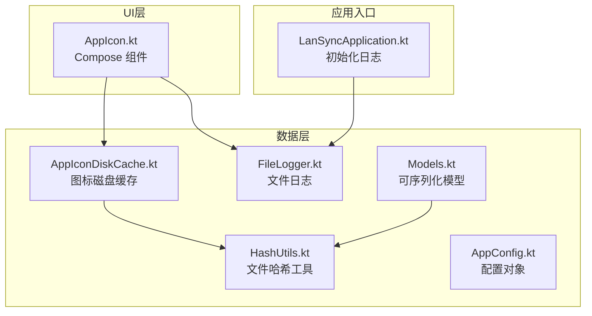
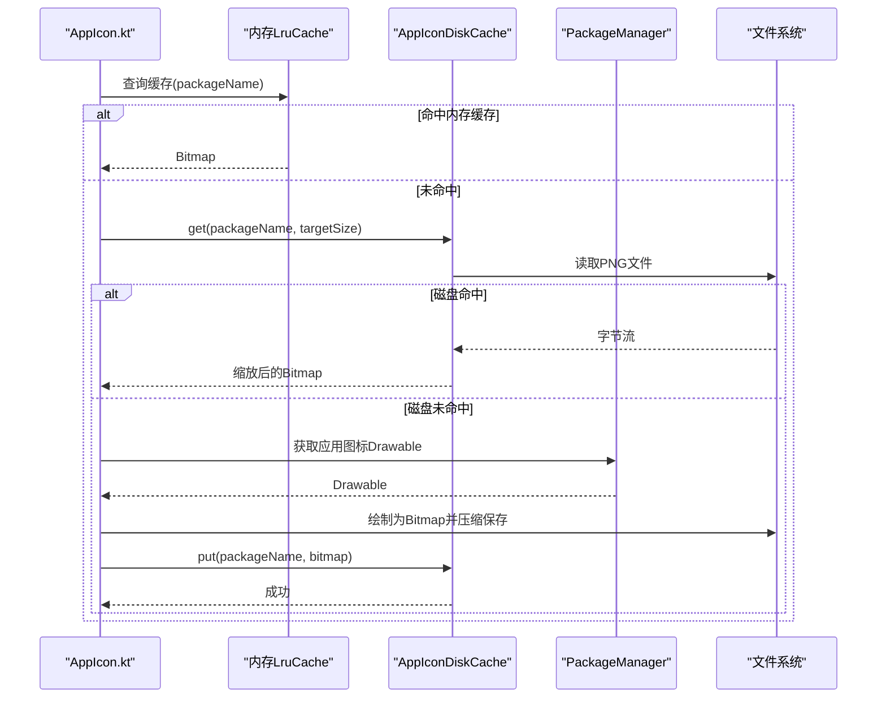
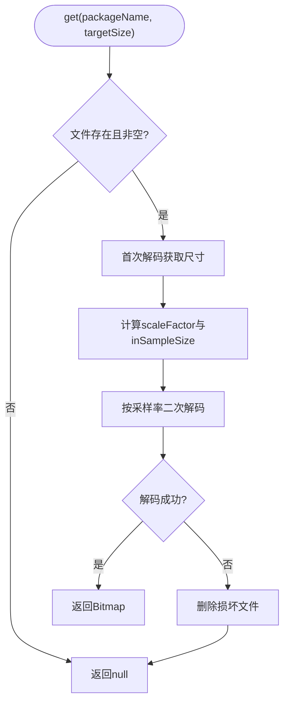
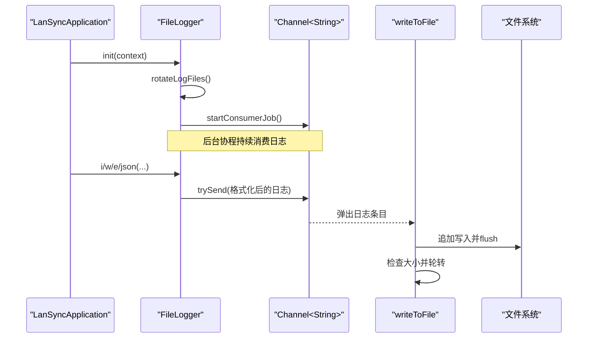
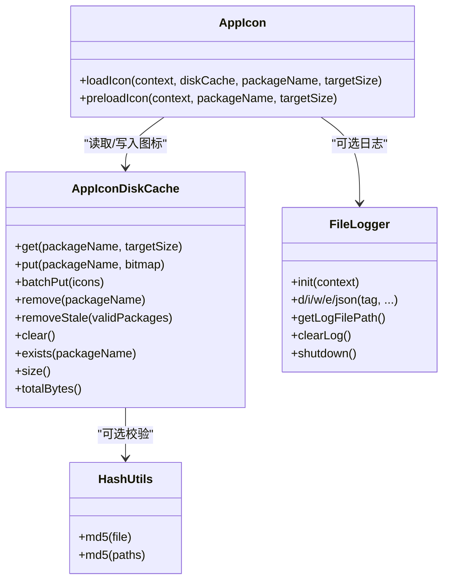

# 本地存储

<cite>
**本文引用的文件**
- [AppIconDiskCache.kt](file://app/src/main/java/com/lansync/app/data/cache/AppIconDiskCache.kt)
- [FileLogger.kt](file://app/src/main/java/com/lansync/app/data/FileLogger.kt)
- [AppConfig.kt](file://app/src/main/java/com/lansync/app/data/AppConfig.kt)
- [HashUtils.kt](file://app/src/main/java/com/lansync/app/data/HashUtils.kt)
- [Models.kt](file://app/src/main/java/com/lansync/app/data/model/Models.kt)
- [AppIcon.kt](file://app/src/main/java/com/lansync/app/ui/components/AppIcon.kt)
- [LanSyncApplication.kt](file://app/src/main/java/com/lansync/app/LanSyncApplication.kt)
</cite>

## 目录
1. [简介](#简介)
2. [项目结构](#项目结构)
3. [核心组件](#核心组件)
4. [架构总览](#架构总览)
5. [详细组件分析](#详细组件分析)
6. [依赖关系分析](#依赖关系分析)
7. [性能考量](#性能考量)
8. [故障排查指南](#故障排查指南)
9. [结论](#结论)
10. [附录](#附录)

## 简介
本文件聚焦于 LanSync 应用的本地存储模块，重点说明：
- AppIconDiskCache 的磁盘缓存实现（策略、路径管理、清理机制）
- 文件日志系统（日志级别、文件轮转、性能优化）
- 缓存数据的序列化与反序列化过程
- 存储空间管理与内存优化策略
- 缓存失效机制与数据一致性保证
- 存储配置选项与性能调优建议
- 使用示例与监控方法

## 项目结构
本地存储相关代码主要位于 data 层与 UI 层的交互中：
- 数据层提供磁盘缓存与日志能力
- UI 层通过 Compose 组件消费缓存并触发预加载
- 应用启动时初始化日志系统

图表来源
- [AppIcon.kt:42-150](file://app/src/main/java/com/lansync/app/ui/components/AppIcon.kt#L42-L150)
- [AppIconDiskCache.kt:9-95](file://app/src/main/java/com/lansync/app/data/cache/AppIconDiskCache.kt#L9-L95)
- [FileLogger.kt:19-167](file://app/src/main/java/com/lansync/app/data/FileLogger.kt#L19-L167)
- [HashUtils.kt:6-54](file://app/src/main/java/com/lansync/app/data/HashUtils.kt#L6-L54)
- [Models.kt:5-138](file://app/src/main/java/com/lansync/app/data/model/Models.kt#L5-L138)
- [AppConfig.kt:3-18](file://app/src/main/java/com/lansync/app/data/AppConfig.kt#L3-L18)
- [LanSyncApplication.kt:6-12](file://app/src/main/java/com/lansync/app/LanSyncApplication.kt#L6-L12)

章节来源
- [AppIcon.kt:42-150](file://app/src/main/java/com/lansync/app/ui/components/AppIcon.kt#L42-L150)
- [AppIconDiskCache.kt:9-95](file://app/src/main/java/com/lansync/app/data/cache/AppIconDiskCache.kt#L9-L95)
- [FileLogger.kt:19-167](file://app/src/main/java/com/lansync/app/data/FileLogger.kt#L19-L167)
- [LanSyncApplication.kt:6-12](file://app/src/main/java/com/lansync/app/LanSyncApplication.kt#L6-L12)

## 核心组件
- AppIconDiskCache：基于 Android 应用私有目录的 PNG 图片磁盘缓存，支持读取、写入、批量写入、删除、过期清理、统计等。
- FileLogger：基于协程 Channel 的异步文件日志，支持多级别日志、文件轮转、备份保留、安全关闭。
- HashUtils：对文件或路径列表计算 MD5 的工具，用于完整性校验或差异检测。
- Models：使用 kotlinx.serialization 标注的数据类，便于网络传输与持久化时的序列化和反序列化。
- AppConfig：集中化的配置项，当前未直接用于存储模块，但可作为扩展点。

章节来源
- [AppIconDiskCache.kt:9-95](file://app/src/main/java/com/lansync/app/data/cache/AppIconDiskCache.kt#L9-L95)
- [FileLogger.kt:19-167](file://app/src/main/java/com/lansync/app/data/FileLogger.kt#L19-L167)
- [HashUtils.kt:6-54](file://app/src/main/java/com/lansync/app/data/HashUtils.kt#L6-L54)
- [Models.kt:5-138](file://app/src/main/java/com/lansync/app/data/model/Models.kt#L5-L138)
- [AppConfig.kt:3-18](file://app/src/main/java/com/lansync/app/data/AppConfig.kt#L3-L18)

## 架构总览
本地存储模块采用“UI 层 + 数据层”的分层设计：
- UI 层通过 Compose 组件请求图标，优先命中内存 LruCache，再回退到磁盘缓存；若均不存在则从系统包管理器绘制并落盘。
- 数据层提供线程安全的单例磁盘缓存和异步日志通道，确保高并发下的稳定性与性能。
- 应用启动时初始化日志系统，统一输出调试信息。

图表来源
- [AppIcon.kt:42-150](file://app/src/main/java/com/lansync/app/ui/components/AppIcon.kt#L42-L150)
- [AppIconDiskCache.kt:19-49](file://app/src/main/java/com/lansync/app/data/cache/AppIconDiskCache.kt#L19-L49)

## 详细组件分析

### AppIconDiskCache：磁盘缓存实现
- 缓存策略
  - 键：应用包名经安全化处理后的文件名（仅允许字母、数字、下划线、点、连字符），后缀 .png
  - 值：PNG 压缩的位图，压缩质量固定为 90
  - 读取流程：先检查文件存在且非空，再使用 BitmapFactory 分两次解码：首次只获取尺寸，计算采样率 inSampleSize 为最接近目标尺寸的 2 的幂次，第二次按采样率解码以节省内存
- 存储路径管理
  - 路径：context.filesDir + "/app_icons"，属于应用私有目录，随应用卸载而清理
  - 自动创建目录，避免首次写入失败
- 清理机制
  - remove：删除指定包名的缓存文件
  - removeStale：根据有效包名集合，删除不在集合中的缓存文件，实现“过期清理”
  - clear：清空整个缓存目录
- 统计接口
  - size：缓存文件数量
  - totalBytes：缓存总字节数
- 线程安全
  - 通过 companion object 的单例模式，使用 @Volatile 与 synchronized 双重检查锁定，保证全局唯一实例
- 错误处理
  - 读取异常时删除损坏文件，返回 null
  - 写入异常被吞掉，避免影响主流程

图表来源
- [AppIconDiskCache.kt:19-49](file://app/src/main/java/com/lansync/app/data/cache/AppIconDiskCache.kt#L19-L49)

章节来源
- [AppIconDiskCache.kt:9-95](file://app/src/main/java/com/lansync/app/data/cache/AppIconDiskCache.kt#L9-L95)

### 文件日志系统：FileLogger
- 日志级别
  - DEBUG、INFO、WARN、ERROR、JSON（用于结构化数据截断输出）
- 文件轮转与备份
  - 初始化时执行一次轮转：将现有日志重命名为 .bak1，并创建新日志文件
  - 写入时若当前日志超过阈值（默认 5MB），将其重命名为 .prev.log 作为历史备份
  - 启动时维护最多 3 个 .bak1..bak3 的备份，超出则丢弃最旧备份
- 性能优化
  - 使用协程 Channel（无界）+ IO 调度器进行异步写入
  - 写操作使用 Mutex 串行化，避免并发写冲突
  - 使用 ThreadLocal 的 SimpleDateFormat 减少格式化开销
  - 日志内容截断（JSON 最大 500 字符）防止大对象拖慢 I/O
- 生命周期管理
  - init：在 Application.onCreate 中初始化，设置日志目录并开始消费者任务
  - shutdown：关闭通道并等待剩余日志写入完成，确保不丢日志

图表来源
- [LanSyncApplication.kt:6-12](file://app/src/main/java/com/lansync/app/LanSyncApplication.kt#L6-L12)
- [FileLogger.kt:34-167](file://app/src/main/java/com/lansync/app/data/FileLogger.kt#L34-L167)

章节来源
- [FileLogger.kt:19-167](file://app/src/main/java/com/lansync/app/data/FileLogger.kt#L19-L167)
- [LanSyncApplication.kt:6-12](file://app/src/main/java/com/lansync/app/LanSyncApplication.kt#L6-L12)

### 缓存数据的序列化与反序列化
- 模型定义
  - 使用 kotlinx.serialization 注解的数据类（如 AppInfo、DeviceInfo、ConnectRequestPayload 等），便于在网络传输与持久化时进行 JSON 编解码
- 与存储的关系
  - 当前磁盘缓存针对的是 PNG 位图，不涉及这些模型的序列化
  - 若未来需要持久化设备列表或连接状态，可直接使用上述可序列化模型进行 JSON 存储
- 哈希辅助
  - HashUtils 提供 md5(file) 与 md5(paths)，可用于校验缓存文件完整性或生成版本标识

章节来源
- [Models.kt:5-138](file://app/src/main/java/com/lansync/app/data/model/Models.kt#L5-L138)
- [HashUtils.kt:6-54](file://app/src/main/java/com/lansync/app/data/HashUtils.kt#L6-L54)

### 存储空间管理与内存优化策略
- 磁盘空间
  - 缓存目录位于应用私有目录，随应用卸载清理
  - 提供 removeStale 与 clear 接口，可按需释放空间
  - 可通过 totalBytes 监控占用
- 内存优化
  - 内存缓存：UI 层使用 LruCache 限制条目数（默认 120），并按 Bitmap 实际分配字节估算大小
  - 磁盘读取：先获取尺寸再按 inSampleSize 解码，避免大图导致 OOM
  - 压缩：PNG 质量 90，平衡体积与质量
- 预加载
  - 提供 preloadIcon 函数，提前将常用图标绘制并写入磁盘与内存缓存，提升首屏体验

章节来源
- [AppIcon.kt:32-150](file://app/src/main/java/com/lansync/app/ui/components/AppIcon.kt#L32-L150)
- [AppIconDiskCache.kt:19-78](file://app/src/main/java/com/lansync/app/data/cache/AppIconDiskCache.kt#L19-L78)

### 缓存失效机制与数据一致性保证
- 失效机制
  - 显式删除：remove(packageName)
  - 批量过期：removeStale(validPackages) 删除不在有效集合中的缓存
  - 全量清理：clear()
- 一致性保证
  - 读取异常时删除损坏文件，避免脏数据
  - 文件名安全化，避免非法字符导致的访问问题
  - 日志记录关键路径与错误，便于定位不一致问题

章节来源
- [AppIconDiskCache.kt:57-84](file://app/src/main/java/com/lansync/app/data/cache/AppIconDiskCache.kt#L57-L84)

### 存储配置选项与性能调优建议
- 当前配置
  - 磁盘缓存：固定 PNG 质量 90，固定 inSampleSize 策略
  - 日志：最大 5MB 单文件，最多 3 个 .bak 备份，写入前轮转
  - 内存缓存：LruCache 容量 120 条
- 调优建议
  - 根据设备屏幕密度调整 targetSize，避免过大位图
  - 若图标数量巨大，可增加 LruCache 上限或引入分级缓存（热/温/冷）
  - 日志频率过高时可降低 INFO/DEBUG 级别或增加日志文件大小阈值
  - 批量写入 batchPut 适用于启动阶段预热，减少多次 I/O

章节来源
- [AppIconDiskCache.kt:41-55](file://app/src/main/java/com/lansync/app/data/cache/AppIconDiskCache.kt#L41-L55)
- [FileLogger.kt:21-24](file://app/src/main/java/com/lansync/app/data/FileLogger.kt#L21-L24)
- [AppIcon.kt:32-40](file://app/src/main/java/com/lansync/app/ui/components/AppIcon.kt#L32-L40)

## 依赖关系分析
- UI 层依赖磁盘缓存与内存缓存
- 磁盘缓存依赖文件系统与 Android 图形库
- 日志系统依赖协程与文件系统
- 哈希工具可被其他模块复用，用于完整性校验

图表来源
- [AppIcon.kt:42-150](file://app/src/main/java/com/lansync/app/ui/components/AppIcon.kt#L42-L150)
- [AppIconDiskCache.kt:9-95](file://app/src/main/java/com/lansync/app/data/cache/AppIconDiskCache.kt#L9-L95)
- [FileLogger.kt:19-167](file://app/src/main/java/com/lansync/app/data/FileLogger.kt#L19-L167)
- [HashUtils.kt:6-54](file://app/src/main/java/com/lansync/app/data/HashUtils.kt#L6-L54)

章节来源
- [AppIcon.kt:42-150](file://app/src/main/java/com/lansync/app/ui/components/AppIcon.kt#L42-L150)
- [AppIconDiskCache.kt:9-95](file://app/src/main/java/com/lansync/app/data/cache/AppIconDiskCache.kt#L9-L95)
- [FileLogger.kt:19-167](file://app/src/main/java/com/lansync/app/data/FileLogger.kt#L19-L167)
- [HashUtils.kt:6-54](file://app/src/main/java/com/lansync/app/data/HashUtils.kt#L6-L54)

## 性能考量
- 磁盘 I/O
  - 使用 FileOutputStream 一次性写入 PNG，减少碎片化
  - 读取时先获取尺寸再解码，显著降低内存峰值
- 内存使用
  - LruCache 限制内存缓存条目，避免 OOM
  - 按需缩放解码，避免大图占满堆
- 并发与吞吐
  - 日志写入通过 Channel + Mutex 保证顺序与一致性
  - 单例缓存避免重复初始化与资源竞争
- 存储增长控制
  - 日志文件轮转与备份数量限制
  - 缓存过期清理接口，防止无限增长

[本节为通用性能讨论，不直接分析具体文件]

## 故障排查指南
- 常见问题
  - 图标无法显示：检查磁盘文件是否存在且非空；读取异常会删除损坏文件
  - 日志缺失：确认已调用 FileLogger.init；检查日志目录权限与空间
  - 存储空间不足：使用 totalBytes 监控；必要时调用 removeStale 或 clear
- 诊断步骤
  - 查看日志文件路径：FileLogger.getLogFilePath()
  - 清理日志：FileLogger.clearLog()
  - 验证缓存：AppIconDiskCache.exists() 与 size()/totalBytes()
  - 校验文件：HashUtils.md5(file) 对比预期哈希

章节来源
- [FileLogger.kt:141-167](file://app/src/main/java/com/lansync/app/data/FileLogger.kt#L141-L167)
- [AppIconDiskCache.kt:70-78](file://app/src/main/java/com/lansync/app/data/cache/AppIconDiskCache.kt#L70-L78)
- [HashUtils.kt:8-24](file://app/src/main/java/com/lansync/app/data/HashUtils.kt#L8-L24)

## 结论
LanSync 的本地存储模块通过 AppIconDiskCache 实现了高效、稳定的图标磁盘缓存，结合 UI 层的内存缓存与预加载策略，显著提升了界面响应速度与用户体验。FileLogger 提供了可靠的异步日志能力，支持文件轮转与备份，便于问题定位。整体设计简洁清晰，具备可扩展性，可在后续迭代中引入更细粒度的配置与监控能力。

[本节为总结性内容，不直接分析具体文件]

## 附录

### 使用示例
- 初始化日志
  - 在 Application.onCreate 中调用 FileLogger.init(context)
- 获取/写入图标缓存
  - 通过 AppIconDiskCache.getInstance(context) 获取单例
  - 读取：diskCache.get(packageName, targetSize)
  - 写入：diskCache.put(packageName, bitmap)
  - 批量写入：diskCache.batchPut(mapOf(...))
- 清理与统计
  - 删除单个：diskCache.remove(packageName)
  - 过期清理：diskCache.removeStale(validPackages)
  - 清空：diskCache.clear()
  - 统计：diskCache.size(), diskCache.totalBytes()
- 预加载
  - 调用 preloadIcon(context, packageName, targetSize) 提前准备常用图标

章节来源
- [LanSyncApplication.kt:6-12](file://app/src/main/java/com/lansync/app/LanSyncApplication.kt#L6-L12)
- [AppIconDiskCache.kt:19-78](file://app/src/main/java/com/lansync/app/data/cache/AppIconDiskCache.kt#L19-L78)
- [AppIcon.kt:126-150](file://app/src/main/java/com/lansync/app/ui/components/AppIcon.kt#L126-L150)

### 监控方法
- 日志监控
  - 获取日志路径：FileLogger.getLogFilePath()
  - 定期清理：FileLogger.clearLog()
  - 应用退出时：FileLogger.shutdown() 确保日志落盘
- 缓存监控
  - 使用 diskCache.size() 与 diskCache.totalBytes() 监控缓存规模
  - 结合 removeStale 定期清理无效缓存

章节来源
- [FileLogger.kt:141-167](file://app/src/main/java/com/lansync/app/data/FileLogger.kt#L141-L167)
- [AppIconDiskCache.kt:70-78](file://app/src/main/java/com/lansync/app/data/cache/AppIconDiskCache.kt#L70-L78)