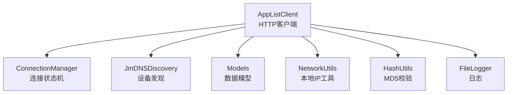
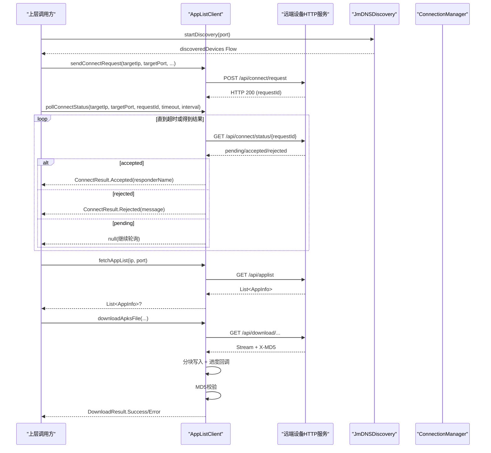
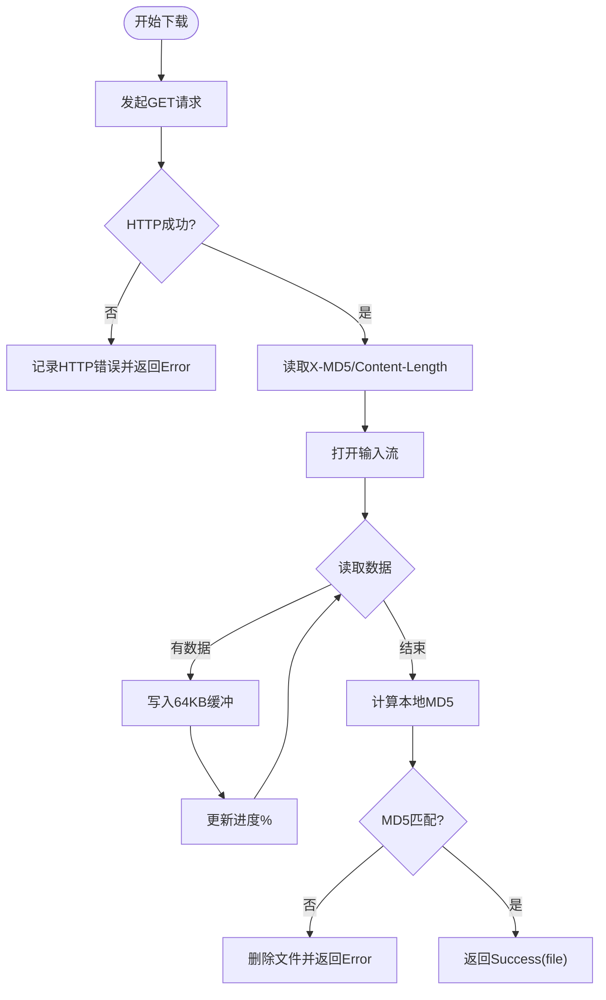
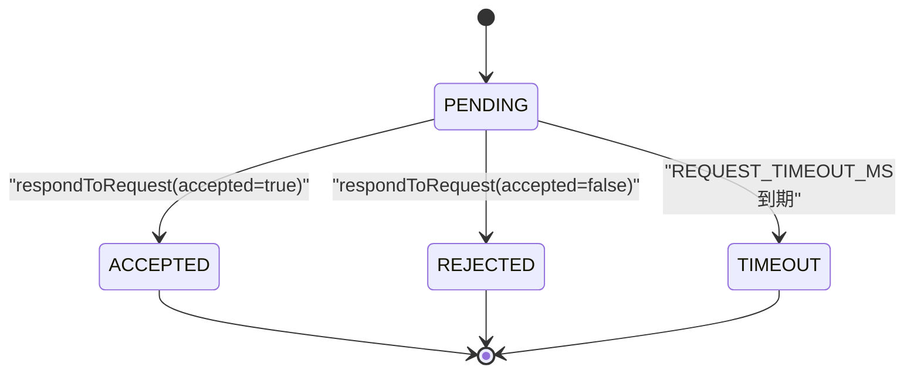
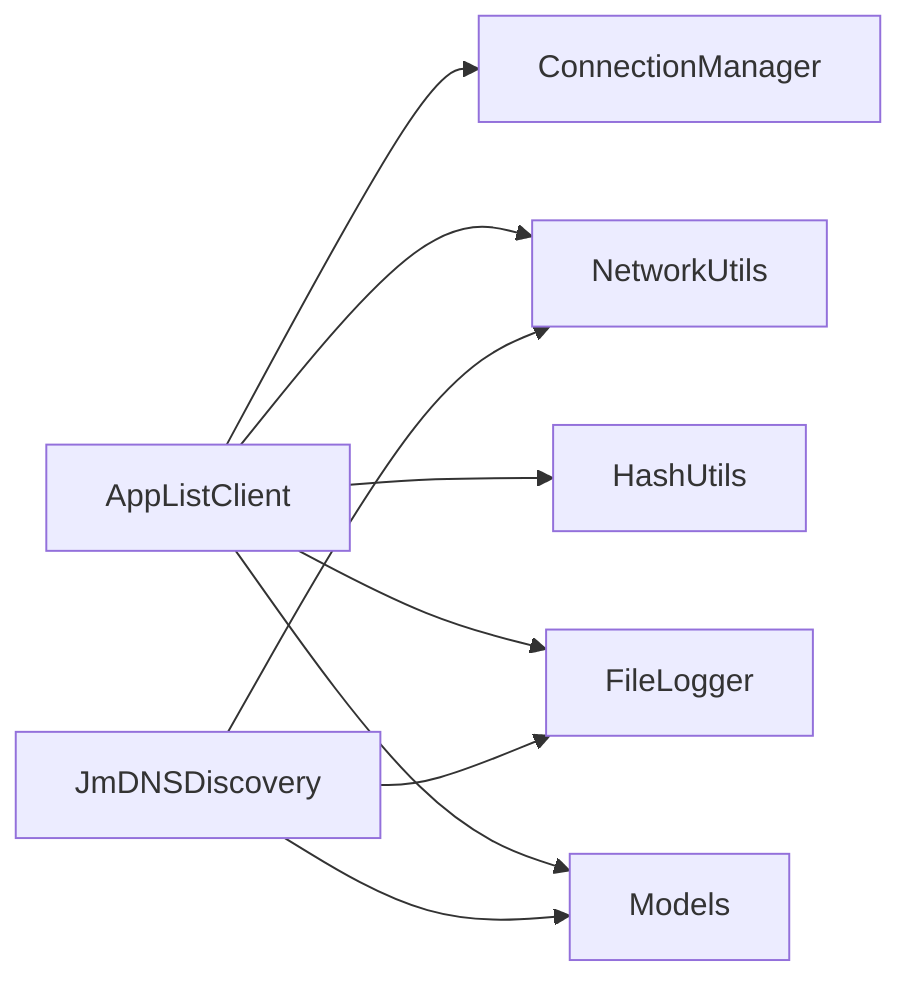

# 网络客户端

<cite>
**本文引用的文件**
- [AppListClient.kt](file://app/src/main/java/com/lansync/app/data/client/AppListClient.kt)
- [ConnectionManager.kt](file://app/src/main/java/com/lansync/app/data/connection/ConnectionManager.kt)
- [JmDNSDiscovery.kt](file://app/src/main/java/com/lansync/app/data/discovery/JmDNSDiscovery.kt)
- [Models.kt](file://app/src/main/java/com/lansync/app/data/model/Models.kt)
- [NetworkUtils.kt](file://app/src/main/java/com/lansync/app/data/NetworkUtils.kt)
- [HashUtils.kt](file://app/src/main/java/com/lansync/app/data/HashUtils.kt)
- [FileLogger.kt](file://app/src/main/java/com/lansync/app/data/FileLogger.kt)
</cite>

## 目录
1. [简介](#简介)
2. [项目结构](#项目结构)
3. [核心组件](#核心组件)
4. [架构总览](#架构总览)
5. [详细组件分析](#详细组件分析)
6. [依赖关系分析](#依赖关系分析)
7. [性能考量](#性能考量)
8. [故障排查指南](#故障排查指南)
9. [结论](#结论)
10. [附录：API调用示例与最佳实践](#附录api调用示例与最佳实践)

## 简介
本文件聚焦于LanSync应用的网络客户端实现，重点说明AppListClient的HTTP客户端配置、连接池管理、设备发现、应用列表获取、文件下载、连接状态轮询、超时与重试策略、APK分块下载与进度跟踪、以及错误处理机制（网络异常、超时、MD5校验失败）。同时提供可操作的API调用示例与最佳实践。

## 项目结构
围绕网络通信的关键模块包括：
- AppListClient：封装所有HTTP请求（连接握手、应用列表、设备信息、Ping、断开通知、刷新应用列表、APK下载）
- ConnectionManager：维护待处理连接请求的状态机、超时与响应
- JmDNSDiscovery：基于mDNS的设备发现与服务注册
- Models：网络请求/响应的数据模型
- NetworkUtils：本地IP地址获取等网络工具
- HashUtils：文件MD5计算，用于下载完整性校验
- FileLogger：统一日志输出，便于问题定位

图表来源
- [AppListClient.kt:30-56](file://app/src/main/java/com/lansync/app/data/client/AppListClient.kt#L30-L56)
- [ConnectionManager.kt:19-155](file://app/src/main/java/com/lansync/app/data/connection/ConnectionManager.kt#L19-L155)
- [JmDNSDiscovery.kt:23-275](file://app/src/main/java/com/lansync/app/data/discovery/JmDNSDiscovery.kt#L23-L275)
- [Models.kt:5-138](file://app/src/main/java/com/lansync/app/data/model/Models.kt#L5-L138)
- [NetworkUtils.kt:9-56](file://app/src/main/java/com/lansync/app/data/NetworkUtils.kt#L9-L56)
- [HashUtils.kt:6-54](file://app/src/main/java/com/lansync/app/data/HashUtils.kt#L6-L54)
- [FileLogger.kt:19-167](file://app/src/main/java/com/lansync/app/data/FileLogger.kt#L19-L167)

章节来源
- [AppListClient.kt:30-56](file://app/src/main/java/com/lansync/app/data/client/AppListClient.kt#L30-L56)
- [ConnectionManager.kt:19-155](file://app/src/main/java/com/lansync/app/data/connection/ConnectionManager.kt#L19-L155)
- [JmDNSDiscovery.kt:23-275](file://app/src/main/java/com/lansync/app/data/discovery/JmDNSDiscovery.kt#L23-L275)
- [Models.kt:5-138](file://app/src/main/java/com/lansync/app/data/model/Models.kt#L5-L138)
- [NetworkUtils.kt:9-56](file://app/src/main/java/com/lansync/app/data/NetworkUtils.kt#L9-L56)
- [HashUtils.kt:6-54](file://app/src/main/java/com/lansync/app/data/HashUtils.kt#L6-L54)
- [FileLogger.kt:19-167](file://app/src/main/java/com/lansync/app/data/FileLogger.kt#L19-L167)

## 核心组件
- AppListClient：负责HTTP通信，包含两个OkHttpClient实例（通用与下载专用），JSON序列化器，下载目录管理，以及完整的网络能力（连接握手、状态轮询、应用列表、设备信息、Ping、断开通知、刷新应用列表、APK下载与校验）。
- ConnectionManager：维护待处理连接请求的并发Map、超时任务、状态流，支持接收请求、响应、查询状态、清理与超时处理。
- JmDNSDiscovery：通过JmDNS注册服务、监听服务变化、周期性刷新设备列表，过滤自身实例并暴露设备发现结果。
- Models：定义AppInfo、DeviceInfo、连接相关Payload/Response等数据结构。
- NetworkUtils：获取本机IPv4地址，支持WiFi优先与接口回退。
- HashUtils：单文件或路径列表的MD5计算。
- FileLogger：异步队列+互斥写入的文件日志系统，支持日志轮转与备份。

章节来源
- [AppListClient.kt:30-56](file://app/src/main/java/com/lansync/app/data/client/AppListClient.kt#L30-L56)
- [ConnectionManager.kt:19-155](file://app/src/main/java/com/lansync/app/data/connection/ConnectionManager.kt#L19-L155)
- [JmDNSDiscovery.kt:23-275](file://app/src/main/java/com/lansync/app/data/discovery/JmDNSDiscovery.kt#L23-L275)
- [Models.kt:5-138](file://app/src/main/java/com/lansync/app/data/model/Models.kt#L5-L138)
- [NetworkUtils.kt:9-56](file://app/src/main/java/com/lansync/app/data/NetworkUtils.kt#L9-L56)
- [HashUtils.kt:6-54](file://app/src/main/java/com/lansync/app/data/HashUtils.kt#L6-L54)
- [FileLogger.kt:19-167](file://app/src/main/java/com/lansync/app/data/FileLogger.kt#L19-L167)

## 架构总览
整体流程由“设备发现 -> 连接握手 -> 应用列表/文件操作”构成。AppListClient作为HTTP客户端统一对外暴露能力；ConnectionManager在本地维护连接请求生命周期；JmDNSDiscovery负责局域网设备发现。

图表来源
- [AppListClient.kt:62-133](file://app/src/main/java/com/lansync/app/data/client/AppListClient.kt#L62-L133)
- [AppListClient.kt:228-254](file://app/src/main/java/com/lansync/app/data/client/AppListClient.kt#L228-L254)
- [AppListClient.kt:358-462](file://app/src/main/java/com/lansync/app/data/client/AppListClient.kt#L358-L462)
- [JmDNSDiscovery.kt:60-117](file://app/src/main/java/com/lansync/app/data/discovery/JmDNSDiscovery.kt#L60-L117)
- [ConnectionManager.kt:29-112](file://app/src/main/java/com/lansync/app/data/connection/ConnectionManager.kt#L29-L112)

## 详细组件分析

### AppListClient：HTTP客户端与连接池管理
- OkHttpClient配置
  - 通用client：连接/读写超时15秒，调用超时30秒，连接池最大空闲连接5，KeepAlive 5分钟，允许重定向与SSL重定向。
  - 下载专用downloadClient：连接超时30秒，读写超时120秒，调用超时0（无限），连接池最大空闲连接2，KeepAlive 1分钟。
- JSON序列化：使用kotlinx.serialization，开启宽松模式与忽略未知字段，便于兼容不同版本服务端。
- 下载目录：应用缓存目录下的downloads子目录，懒初始化并自动创建。
- 核心方法
  - 连接握手：发送连接请求、轮询连接状态、发送连接响应、断开通知、刷新应用列表通知。
  - 设备探测：ping设备可用性。
  - 数据获取：拉取应用列表、设备信息。
  - 文件下载：按包名/版本号或最新版本下载APKS/APK，带进度回调与MD5校验。
- 连接状态轮询机制
  - 轮询循环：在超时时间内以固定间隔发起GET请求，解析pending/accepted/rejected三种状态。
  - 超时与重试：若HTTP非成功或空体，等待pollIntervalMs后继续；异常时记录警告并延迟后重试；达到timeoutMs返回Timeout。
  - 解析：将服务端返回的ConnectStatusResponse映射为ConnectResult.Accepted/Rejected/Timeout。
- APK分块下载与进度跟踪
  - 读取Content-Length或X-File-Size确定总大小。
  - 使用64KB缓冲分块写入目标文件，累计已读字节计算百分比，触发onProgress回调。
  - 校验：优先使用响应头X-MD5，否则回退到传入expectedMd5；计算本地文件MD5并与期望值比较，不一致则删除文件并返回错误。
- 错误处理
  - 网络异常：捕获异常并记录错误日志，返回null或布尔失败。
  - HTTP错误：记录HTTP状态码与部分响应体，返回错误结果。
  - 文件为空或缺失：检测文件大小并返回错误。
  - MD5校验失败：记录差异并删除文件，返回错误。
- 下载文件管理
  - 根据包名与版本号生成文件名，支持.apks与.apk两种后缀。
  - 提供列出、查找、删除下载文件的能力。

图表来源
- [AppListClient.kt:393-462](file://app/src/main/java/com/lansync/app/data/client/AppListClient.kt#L393-L462)
- [AppListClient.kt:464-481](file://app/src/main/java/com/lansync/app/data/client/AppListClient.kt#L464-L481)
- [HashUtils.kt:8-14](file://app/src/main/java/com/lansync/app/data/HashUtils.kt#L8-L14)

章节来源
- [AppListClient.kt:30-56](file://app/src/main/java/com/lansync/app/data/client/AppListClient.kt#L30-L56)
- [AppListClient.kt:62-133](file://app/src/main/java/com/lansync/app/data/client/AppListClient.kt#L62-L133)
- [AppListClient.kt:228-254](file://app/src/main/java/com/lansync/app/data/client/AppListClient.kt#L228-L254)
- [AppListClient.kt:283-304](file://app/src/main/java/com/lansync/app/data/client/AppListClient.kt#L283-L304)
- [AppListClient.kt:306-356](file://app/src/main/java/com/lansync/app/data/client/AppListClient.kt#L306-L356)
- [AppListClient.kt:358-462](file://app/src/main/java/com/lansync/app/data/client/AppListClient.kt#L358-L462)
- [AppListClient.kt:464-481](file://app/src/main/java/com/lansync/app/data/client/AppListClient.kt#L464-L481)
- [HashUtils.kt:8-14](file://app/src/main/java/com/lansync/app/data/HashUtils.kt#L8-L14)

### ConnectionManager：连接请求状态机与超时
- 职责
  - 接收连接请求，去重并加入待处理集合。
  - 为每个请求启动超时任务，超时后自动标记为TIMEOUT。
  - 响应请求时更新状态并返回响应负载。
  - 提供状态查询与清理能力。
- 关键常量
  - REQUEST_TIMEOUT_MS：请求超时时间（默认15秒）。
  - CONNECT_TIMEOUT_MS：连接轮询超时（默认30秒）。
  - POLL_INTERVAL_MS：轮询间隔（默认500毫秒）。
- 状态流转
  - PENDING -> ACCEPTED/REJECTED/TIMEOUT
  - 超时后不可逆地进入TIMEOUT。

图表来源
- [ConnectionManager.kt:29-112](file://app/src/main/java/com/lansync/app/data/connection/ConnectionManager.kt#L29-L112)
- [ConnectionManager.kt:132-140](file://app/src/main/java/com/lansync/app/data/connection/ConnectionManager.kt#L132-L140)
- [ConnectionManager.kt:149-154](file://app/src/main/java/com/lansync/app/data/connection/ConnectionManager.kt#L149-L154)

章节来源
- [ConnectionManager.kt:29-112](file://app/src/main/java/com/lansync/app/data/connection/ConnectionManager.kt#L29-L112)
- [ConnectionManager.kt:132-154](file://app/src/main/java/com/lansync/app/data/connection/ConnectionManager.kt#L132-L154)

### JmDNSDiscovery：设备发现与服务注册
- 功能
  - 获取并持久化设备实例ID。
  - 申请多播锁，创建JmDNS实例，注册服务（携带deviceName与instanceId）。
  - 监听服务添加/移除/解析事件，维护设备映射表。
  - 周期性刷新服务列表，剔除过期设备。
- 关键点
  - 过滤自身实例（相同instanceId）。
  - 仅保留IPv4地址。
  - 从TXT属性或服务名提取设备名称。
  - 暴露discoveredDevices Flow供UI订阅。

章节来源
- [JmDNSDiscovery.kt:45-56](file://app/src/main/java/com/lansync/app/data/discovery/JmDNSDiscovery.kt#L45-L56)
- [JmDNSDiscovery.kt:60-117](file://app/src/main/java/com/lansync/app/data/discovery/JmDNSDiscovery.kt#L60-L117)
- [JmDNSDiscovery.kt:119-134](file://app/src/main/java/com/lansync/app/data/discovery/JmDNSDiscovery.kt#L119-L134)
- [JmDNSDiscovery.kt:136-182](file://app/src/main/java/com/lansync/app/data/discovery/JmDNSDiscovery.kt#L136-L182)
- [JmDNSDiscovery.kt:200-262](file://app/src/main/java/com/lansync/app/data/discovery/JmDNSDiscovery.kt#L200-L262)

### Models：数据模型
- AppInfo：应用元数据（包名、名称、版本、源路径、MD5、是否可提取、大小、是否系统应用、是否Split APK）。
- DeviceInfo：设备信息（IP、名称、端口、实例ID、应用列表、连接状态、最后可见时间、连接错误）。
- 连接相关Payload/Response：ConnectRequestPayload、ConnectResponsePayload、IncomingConnectRequest、DisconnectPayload、ConnectStatusResponse、ConnectResponseBody、RefreshAppListPayload。
- 其他：UpdateInfo、RemoteAppEntry、SyncDiff等用于同步与更新场景。

章节来源
- [Models.kt:5-138](file://app/src/main/java/com/lansync/app/data/model/Models.kt#L5-L138)

### 工具类：NetworkUtils与HashUtils
- NetworkUtils
  - getLocalIpAddress：遍历网络接口，返回首个非环回IPv4地址。
  - getLocalIpAddressViaWifi：优先从WiFi连接信息获取，回退到接口枚举。
- HashUtils
  - md5(File)：对单个文件计算MD5。
  - md5(List<String>)：对多个文件路径顺序累加计算MD5。

章节来源
- [NetworkUtils.kt:9-56](file://app/src/main/java/com/lansync/app/data/NetworkUtils.kt#L9-L56)
- [HashUtils.kt:6-54](file://app/src/main/java/com/lansync/app/data/HashUtils.kt#L6-L54)

## 依赖关系分析
- AppListClient依赖
  - ConnectionManager：提供连接超时与轮询间隔常量。
  - NetworkUtils：获取本地IP。
  - HashUtils：下载完成后进行MD5校验。
  - FileLogger：全链路日志记录。
  - Models：序列化/反序列化的数据载体。
- ConnectionManager依赖
  - FileLogger：记录请求接收、响应、超时等事件。
  - Models：请求/响应负载与状态。
- JmDNSDiscovery依赖
  - NetworkUtils：获取本地IP。
  - FileLogger：记录发现过程。
  - Models：设备信息。

图表来源
- [AppListClient.kt:30-56](file://app/src/main/java/com/lansync/app/data/client/AppListClient.kt#L30-L56)
- [ConnectionManager.kt:19-155](file://app/src/main/java/com/lansync/app/data/connection/ConnectionManager.kt#L19-L155)
- [JmDNSDiscovery.kt:23-275](file://app/src/main/java/com/lansync/app/data/discovery/JmDNSDiscovery.kt#L23-L275)
- [Models.kt:5-138](file://app/src/main/java/com/lansync/app/data/model/Models.kt#L5-L138)
- [NetworkUtils.kt:9-56](file://app/src/main/java/com/lansync/app/data/NetworkUtils.kt#L9-L56)
- [HashUtils.kt:6-54](file://app/src/main/java/com/lansync/app/data/HashUtils.kt#L6-L54)
- [FileLogger.kt:19-167](file://app/src/main/java/com/lansync/app/data/FileLogger.kt#L19-L167)

章节来源
- [AppListClient.kt:30-56](file://app/src/main/java/com/lansync/app/data/client/AppListClient.kt#L30-L56)
- [ConnectionManager.kt:19-155](file://app/src/main/java/com/lansync/app/data/connection/ConnectionManager.kt#L19-L155)
- [JmDNSDiscovery.kt:23-275](file://app/src/main/java/com/lansync/app/data/discovery/JmDNSDiscovery.kt#L23-L275)
- [Models.kt:5-138](file://app/src/main/java/com/lansync/app/data/model/Models.kt#L5-L138)
- [NetworkUtils.kt:9-56](file://app/src/main/java/com/lansync/app/data/NetworkUtils.kt#L9-L56)
- [HashUtils.kt:6-54](file://app/src/main/java/com/lansync/app/data/HashUtils.kt#L6-L54)
- [FileLogger.kt:19-167](file://app/src/main/java/com/lansync/app/data/FileLogger.kt#L19-L167)

## 性能考量
- 连接池优化
  - 通用请求使用较大的连接池（最大空闲5，KeepAlive 5分钟），适合频繁短连接。
  - 下载使用较小连接池（最大空闲2，KeepAlive 1分钟），避免占用过多资源。
- 超时设置
  - 通用请求15秒超时，下载读写120秒，确保大文件传输稳定性。
  - Ping使用独立client并动态设置较短超时，快速判断设备可达性。
- I/O缓冲
  - 下载采用64KB缓冲，平衡内存与吞吐。
- 进度回调
  - 仅在已知总长度且存在回调时计算百分比，减少不必要的计算。
- 日志开销
  - 使用异步通道与互斥写入，避免阻塞主流程；日志文件自动轮转，防止磁盘占满。

[本节为通用性能建议，不直接分析具体文件]

## 故障排查指南
- 连接握手失败
  - 检查sendConnectRequest是否返回requestId；查看FileLogger中“Failed to send connect request”的错误堆栈。
  - 确认目标IP/端口可达，必要时使用pingDevice验证。
- 轮询无响应
  - 关注“POLL START/POLL RESULT/POLL TIMEOUT”日志，确认超时与轮询间隔是否符合预期。
  - 检查ConnectionManager是否收到请求并正确响应；确认服务端/api/connect/status接口可用。
- 应用列表为空
  - 检查fetchAppList返回是否为null；查看HTTP状态码与响应体；确认服务端/api/applist是否正常。
- 下载失败
  - 若HTTP错误：记录HTTP状态码与响应体片段；检查服务端/api/download接口。
  - 若文件为空：检查destination是否存在且长度大于0。
  - 若MD5不匹配：对比X-MD5与expectedMd5，确认服务端计算的MD5与客户端一致。
- 设备发现异常
  - 检查多播锁是否成功获取；查看JmDNS日志；确认服务注册与监听正常。
  - 确认设备实例ID未重复；过滤逻辑是否正确。

章节来源
- [AppListClient.kt:62-133](file://app/src/main/java/com/lansync/app/data/client/AppListClient.kt#L62-L133)
- [AppListClient.kt:228-254](file://app/src/main/java/com/lansync/app/data/client/AppListClient.kt#L228-L254)
- [AppListClient.kt:283-304](file://app/src/main/java/com/lansync/app/data/client/AppListClient.kt#L283-L304)
- [AppListClient.kt:358-462](file://app/src/main/java/com/lansync/app/data/client/AppListClient.kt#L358-L462)
- [JmDNSDiscovery.kt:60-117](file://app/src/main/java/com/lansync/app/data/discovery/JmDNSDiscovery.kt#L60-L117)
- [FileLogger.kt:90-119](file://app/src/main/java/com/lansync/app/data/FileLogger.kt#L90-L119)

## 结论
AppListClient提供了完整、健壮的网络客户端能力，涵盖设备发现后的连接握手、状态轮询、应用列表获取与APK下载。通过合理的OkHttpClient配置、连接池管理、超时与重试策略、分块下载与进度反馈、以及严格的MD5校验，确保了在网络环境不稳定情况下的可靠性与用户体验。配合ConnectionManager与JmDNSDiscovery，形成了端到端的局域网同步方案。

[本节为总结性内容，不直接分析具体文件]

## 附录：API调用示例与最佳实践

- 设备发现
  - 调用startDiscovery(port)启动mDNS服务注册与监听；订阅discoveredDevices Flow获取设备列表。
  - 最佳实践：确保多播权限与WiFi连接；在应用退出时调用stopDiscovery释放资源。
- 连接握手
  - 调用sendConnectRequest(targetIp, targetPort, localDeviceName, localPort, localInstanceId)发起连接请求。
  - 使用pollConnectStatus(targetIp, targetPort, requestId, timeoutMs=30000, pollIntervalMs=500)轮询连接状态。
  - 最佳实践：合理设置超时与轮询间隔；在UI层显示“等待对方接受”提示。
- 应用列表与设备信息
  - 调用fetchAppList(ipAddress, port)获取远程应用列表。
  - 调用fetchDeviceInfo(ipAddress, port)获取设备基本信息。
  - 最佳实践：在网络不可用时降级展示本地缓存；对空响应做容错处理。
- 设备可达性检测
  - 调用pingDevice(ipAddress, port, timeoutMs=3000)快速判断设备在线。
  - 最佳实践：在批量操作中先进行Ping过滤，减少无效请求。
- 断开与刷新通知
  - 调用sendDisconnectNotification(targetIp, targetPort, localDisplayKey, localIdentityKey)通知远端断开。
  - 调用sendRefreshAppListNotification(targetIp, targetPort, localDisplayKey)触发远端刷新应用列表。
  - 最佳实践：在应用后台或退出时主动发送断开通知，保持两端状态一致。
- APK下载
  - 调用downloadApksFile(ipAddress, port, packageName, versionCode, expectedMd5, onProgress)指定版本下载。
  - 调用downloadLatestApksFile(ipAddress, port, packageName, expectedMd5, onProgress)下载最新版本。
  - 最佳实践：
    - 使用独立的下载协程，避免阻塞UI。
    - 提供onProgress回调更新进度条。
    - 下载完成后通过getDownloadedFile(packageName, versionCode)获取文件路径。
    - 定期清理无用下载文件，避免存储膨胀。
- 错误处理与重试
  - 对网络异常与HTTP错误进行捕获与记录；对超时与MD5失败进行明确提示。
  - 对于临时性错误（如网络抖动），可在上层实现指数退避重试。
- 日志与调试
  - 启用FileLogger并查看lansync_debug.log定位问题。
  - 关注关键日志标签：POLL START/RESULT/TIMEOUT、HTTP错误、MD5 MISMATCH等。

章节来源
- [JmDNSDiscovery.kt:60-117](file://app/src/main/java/com/lansync/app/data/discovery/JmDNSDiscovery.kt#L60-L117)
- [AppListClient.kt:62-133](file://app/src/main/java/com/lansync/app/data/client/AppListClient.kt#L62-L133)
- [AppListClient.kt:228-254](file://app/src/main/java/com/lansync/app/data/client/AppListClient.kt#L228-L254)
- [AppListClient.kt:283-304](file://app/src/main/java/com/lansync/app/data/client/AppListClient.kt#L283-L304)
- [AppListClient.kt:306-356](file://app/src/main/java/com/lansync/app/data/client/AppListClient.kt#L306-L356)
- [AppListClient.kt:358-462](file://app/src/main/java/com/lansync/app/data/client/AppListClient.kt#L358-L462)
- [FileLogger.kt:90-119](file://app/src/main/java/com/lansync/app/data/FileLogger.kt#L90-L119)