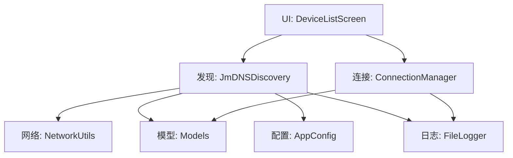
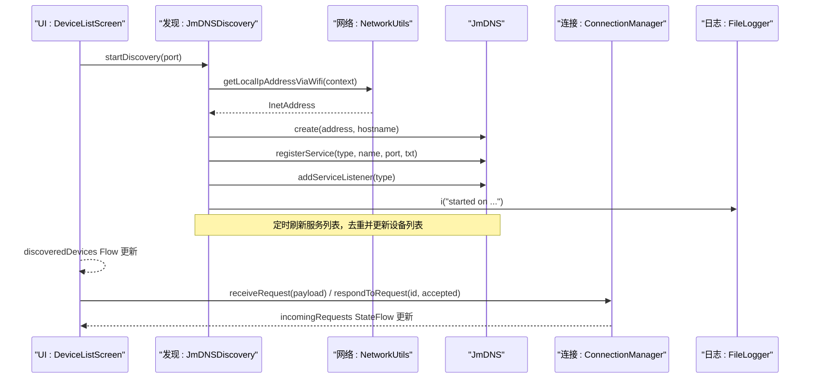
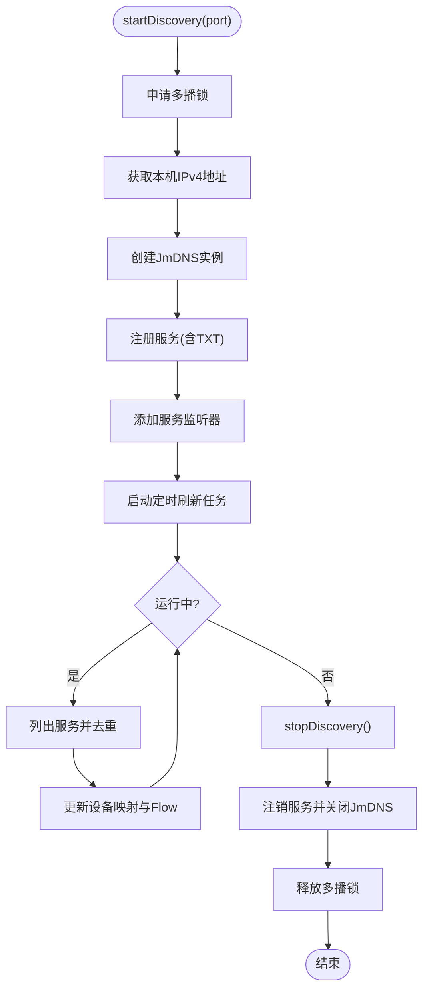
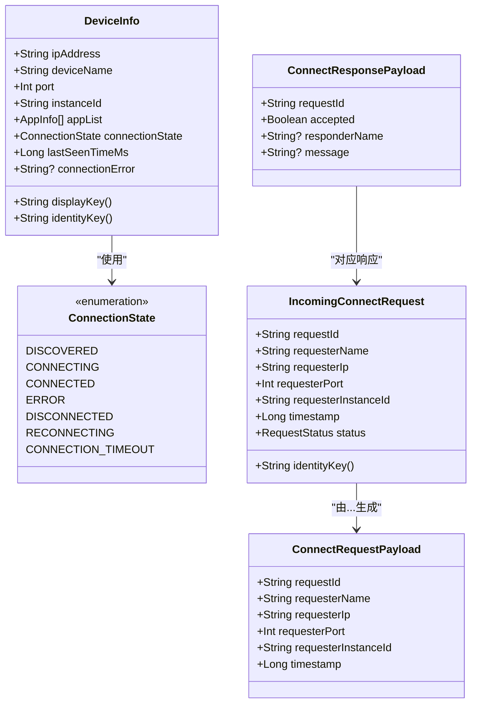
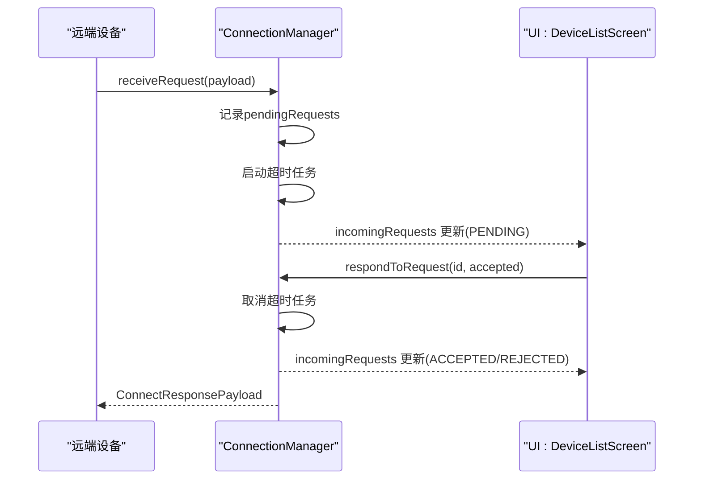
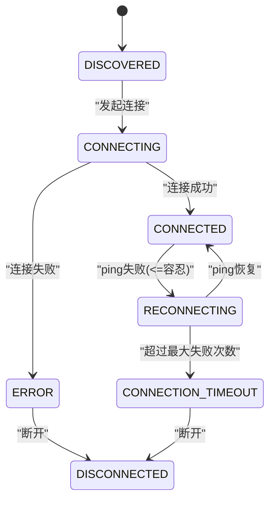
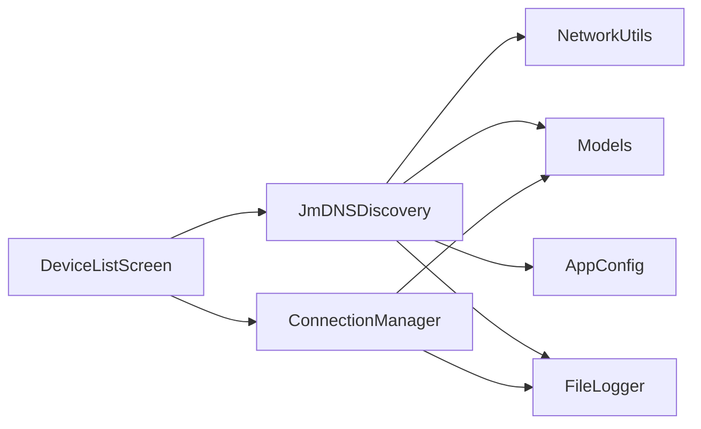

# 设备发现

<cite>
**本文引用的文件**
- [JmDNSDiscovery.kt](file://app/src/main/java/com/lansync/app/data/discovery/JmDNSDiscovery.kt)
- [Models.kt](file://app/src/main/java/com/lansync/app/data/model/Models.kt)
- [ConnectionManager.kt](file://app/src/main/java/com/lansync/app/data/connection/ConnectionManager.kt)
- [AppConfig.kt](file://app/src/main/java/com/lansync/app/data/AppConfig.kt)
- [NetworkUtils.kt](file://app/src/main/java/com/lansync/app/data/NetworkUtils.kt)
- [DeviceListScreen.kt](file://app/src/main/java/com/lansync/app/ui/components/DeviceListScreen.kt)
- [FileLogger.kt](file://app/src/main/java/com/lansync/app/data/FileLogger.kt)
- [REPORT.md](file://REPORT.md)
</cite>

## 目录
1. [简介](#简介)
2. [项目结构](#项目结构)
3. [核心组件](#核心组件)
4. [架构总览](#架构总览)
5. [详细组件分析](#详细组件分析)
6. [依赖关系分析](#依赖关系分析)
7. [性能考量](#性能考量)
8. [故障排除指南](#故障排除指南)
9. [结论](#结论)
10. [附录：配置与使用示例](#附录配置与使用示例)

## 简介
本模块实现基于 mDNS（通过 JmDNS）的局域网设备发现能力，使 LanSync 应用能够在同一 Wi-Fi 网络中自动注册并发现彼此。其核心流程包括：
- 服务注册：将本机以自定义服务类型广播到局域网
- 服务发现：监听并解析其他设备的 mDNS 服务信息
- 心跳检测：对已连接设备进行周期性 ping，维护连接健康状态
- 生命周期管理：启动、停止、刷新、清理资源，保证多播锁与 JmDNS 实例正确释放
- 数据模型：定义设备信息、连接状态及序列化协议，用于跨设备通信

该机制适用于 Android 设备间快速建立本地同步通道，无需中心服务器或公网可达性。

## 项目结构
围绕设备发现的关键代码位于 data 层与 UI 展示层：
- discovery：封装 JmDNS 的多播注册、监听、刷新与去重逻辑
- model：定义设备信息、连接状态、请求/响应载荷等数据结构
- connection：管理入站连接请求、超时与状态查询
- network：获取本机 IP、处理网络接口回退
- ui.components：设备列表展示、连接状态可视化
- config：心跳与重试等运行时参数
- logging：统一日志输出，便于定位问题

图表来源
- [JmDNSDiscovery.kt:23-86](file://app/src/main/java/com/lansync/app/data/discovery/JmDNSDiscovery.kt#L23-L86)
- [NetworkUtils.kt:31-53](file://app/src/main/java/com/lansync/app/data/NetworkUtils.kt#L31-L53)
- [Models.kt:19-45](file://app/src/main/java/com/lansync/app/data/model/Models.kt#L19-L45)
- [ConnectionManager.kt:19-56](file://app/src/main/java/com/lansync/app/data/connection/ConnectionManager.kt#L19-L56)
- [AppConfig.kt:3-14](file://app/src/main/java/com/lansync/app/data/AppConfig.kt#L3-L14)
- [FileLogger.kt:90-104](file://app/src/main/java/com/lansync/app/data/FileLogger.kt#L90-L104)

章节来源
- [JmDNSDiscovery.kt:23-117](file://app/src/main/java/com/lansync/app/data/discovery/JmDNSDiscovery.kt#L23-L117)
- [Models.kt:19-45](file://app/src/main/java/com/lansync/app/data/model/Models.kt#L19-L45)
- [ConnectionManager.kt:19-56](file://app/src/main/java/com/lansync/app/data/connection/ConnectionManager.kt#L19-L56)
- [NetworkUtils.kt:31-53](file://app/src/main/java/com/lansync/app/data/NetworkUtils.kt#L31-L53)
- [AppConfig.kt:3-14](file://app/src/main/java/com/lansync/app/data/AppConfig.kt#L3-L14)
- [DeviceListScreen.kt:21-152](file://app/src/main/java/com/lansync/app/ui/components/DeviceListScreen.kt#L21-L152)

## 核心组件
- JmDNSDiscovery：负责 mDNS 服务注册、监听、刷新与设备去重；维护本地设备映射与流式设备列表；持有并释放多播锁与 JmDNS 实例。
- Models：定义设备信息、连接状态枚举、连接请求/响应载荷、设备信息响应等可序列化数据结构。
- ConnectionManager：管理入站连接请求的生命周期（接收、响应、超时、查询），提供待处理请求列表。
- AppConfig：集中配置心跳间隔、容忍次数、最大失败次数、连接超时、轮询间隔等。
- NetworkUtils：获取本机 IPv4 地址，优先从 Wi-Fi 获取，回退到网络接口遍历。
- DeviceListScreen：UI 层展示设备发现状态、连接按钮与错误提示。
- FileLogger：异步写入调试日志，支持日志轮转与备份。

章节来源
- [JmDNSDiscovery.kt:23-275](file://app/src/main/java/com/lansync/app/data/discovery/JmDNSDiscovery.kt#L23-L275)
- [Models.kt:5-138](file://app/src/main/java/com/lansync/app/data/model/Models.kt#L5-L138)
- [ConnectionManager.kt:19-156](file://app/src/main/java/com/lansync/app/data/connection/ConnectionManager.kt#L19-L156)
- [AppConfig.kt:3-18](file://app/src/main/java/com/lansync/app/data/AppConfig.kt#L3-L18)
- [NetworkUtils.kt:9-56](file://app/src/main/java/com/lansync/app/data/NetworkUtils.kt#L9-L56)
- [DeviceListScreen.kt:21-423](file://app/src/main/java/com/lansync/app/ui/components/DeviceListScreen.kt#L21-L423)
- [FileLogger.kt:19-167](file://app/src/main/java/com/lansync/app/data/FileLogger.kt#L19-L167)

## 架构总览
下图展示了设备发现的核心交互：UI 触发发现，JmDNSDiscovery 完成服务注册与监听，设备信息通过 Flow 推送至 UI；连接管理器处理入站请求与超时；网络工具提供本机地址；配置控制心跳与重试策略。

图表来源
- [JmDNSDiscovery.kt:60-86](file://app/src/main/java/com/lansync/app/data/discovery/JmDNSDiscovery.kt#L60-L86)
- [JmDNSDiscovery.kt:119-134](file://app/src/main/java/com/lansync/app/data/discovery/JmDNSDiscovery.kt#L119-L134)
- [JmDNSDiscovery.kt:200-262](file://app/src/main/java/com/lansync/app/data/discovery/JmDNSDiscovery.kt#L200-L262)
- [NetworkUtils.kt:31-53](file://app/src/main/java/com/lansync/app/data/NetworkUtils.kt#L31-L53)
- [ConnectionManager.kt:29-87](file://app/src/main/java/com/lansync/app/data/connection/ConnectionManager.kt#L29-L87)
- [FileLogger.kt:90-104](file://app/src/main/java/com/lansync/app/data/FileLogger.kt#L90-L104)

## 详细组件分析

### JmDNSDiscovery：mDNS 设备发现
- 服务注册
  - 使用固定服务类型与名称前缀，结合主机名与持久化实例 ID 生成唯一服务名
  - 在 TXT 字段中携带 deviceName 与 instanceId，便于识别与去重
- 监听与解析
  - 注册 ServiceListener，处理 serviceAdded/serviceResolved/serviceRemoved
  - 对新增服务请求详细信息，解析出 IPv4 地址与端口
- 刷新与去重
  - 定时扫描当前服务列表，对比本地设备映射，移除过期设备
  - 使用 DeviceKey(ip, port) 作为键，避免重复条目
- 资源管理
  - 启动时申请多播锁，停止时释放；关闭 JmDNS 并注销服务
  - 使用协程 Job 管理刷新任务，确保生命周期可控

图表来源
- [JmDNSDiscovery.kt:60-117](file://app/src/main/java/com/lansync/app/data/discovery/JmDNSDiscovery.kt#L60-L117)
- [JmDNSDiscovery.kt:119-182](file://app/src/main/java/com/lansync/app/data/discovery/JmDNSDiscovery.kt#L119-L182)
- [JmDNSDiscovery.kt:200-262](file://app/src/main/java/com/lansync/app/data/discovery/JmDNSDiscovery.kt#L200-L262)

章节来源
- [JmDNSDiscovery.kt:23-275](file://app/src/main/java/com/lansync/app/data/discovery/JmDNSDiscovery.kt#L23-L275)

### Models：设备信息与序列化格式
- 设备信息
  - DeviceInfo：包含 IP、设备名、端口、实例 ID、应用列表、连接状态、最后可见时间、连接错误等
  - ConnectionState：DISCOVERED、CONNECTING、CONNECTED、ERROR、DISCONNECTED、RECONNECTING、CONNECTION_TIMEOUT
- 连接协议
  - ConnectRequestPayload/ConnectResponsePayload：发起与响应连接的请求/响应体
  - IncomingConnectRequest：入站连接请求的状态机（PENDING/ACCEPTED/REJECTED/TIMEOUT）
  - DisconnectPayload/ConnectStatusResponse/DeviceInfoResponse/GenericStatusResponse/RefreshAppListPayload：辅助状态与刷新消息
- 序列化
  - 关键载荷均标注为可序列化，便于在网络层进行 JSON 编解码

图表来源
- [Models.kt:19-45](file://app/src/main/java/com/lansync/app/data/model/Models.kt#L19-L45)
- [Models.kt:69-138](file://app/src/main/java/com/lansync/app/data/model/Models.kt#L69-L138)

章节来源
- [Models.kt:5-138](file://app/src/main/java/com/lansync/app/data/model/Models.kt#L5-L138)

### ConnectionManager：连接请求与超时管理
- 入站请求
  - 接收 ConnectRequestPayload，构造 IncomingConnectRequest 并加入待处理表
  - 启动超时任务，超时后自动标记为 TIMEOUT
- 响应与查询
  - respondToRequest 更新请求状态并返回 ConnectResponsePayload
  - getStatus 根据状态返回相应响应
- 清理
  - removeRequest/clearAll 取消超时任务并清理内存

图表来源
- [ConnectionManager.kt:29-87](file://app/src/main/java/com/lansync/app/data/connection/ConnectionManager.kt#L29-L87)
- [ConnectionManager.kt:132-147](file://app/src/main/java/com/lansync/app/data/connection/ConnectionManager.kt#L132-L147)

章节来源
- [ConnectionManager.kt:19-156](file://app/src/main/java/com/lansync/app/data/connection/ConnectionManager.kt#L19-L156)

### 心跳检测与连接状态维护
- 心跳参数
  - heartbeatPingIntervalMs：ping 间隔
  - heartbeatSyncIntervalMs：同步间隔
  - heartbeatPingTolerance：允许的不稳定次数
  - heartbeatPingMaxFailures：最大失败次数，超过则进入超时
  - connectTimeoutMs：连接超时
  - pollIntervalMs：轮询间隔
  - pingTimeoutMs：单次 ping 超时
- 状态流转（基于仓库中的心跳处理逻辑）
  - 成功 ping：恢复 CONNECTED，清除错误
  - 不稳定：进入 RECONNECTING，显示重试进度
  - 多次失败：进入 CONNECTION_TIMEOUT，提示超时

图表来源
- [AppConfig.kt:3-14](file://app/src/main/java/com/lansync/app/data/AppConfig.kt#L3-L14)
- [Repository(AppRepository).kt:189-238](file://app/src/main/java/com/lansync/app/data/repository/AppRepository.kt#L189-L238)

章节来源
- [AppConfig.kt:3-14](file://app/src/main/java/com/lansync/app/data/AppConfig.kt#L3-L14)
- [AppRepository.kt:189-238](file://app/src/main/java/com/lansync/app/data/repository/AppRepository.kt#L189-L238)

### 多播通信配置与网络要求
- 多播锁
  - 启动时申请 WifiManager.MulticastLock，停止时释放，避免系统休眠导致丢包
- 本机地址
  - 优先从 Wi-Fi 获取 IPv4，若不可用则回退到网络接口遍历
- 权限与清单
  - 需要 INTERNET、CHANGE_WIFI_MULTICAST_STATE 等权限；报告文档指出还涉及定位相关权限与明文 HTTP 配置

章节来源
- [JmDNSDiscovery.kt:88-95](file://app/src/main/java/com/lansync/app/data/discovery/JmDNSDiscovery.kt#L88-L95)
- [NetworkUtils.kt:31-53](file://app/src/main/java/com/lansync/app/data/NetworkUtils.kt#L31-L53)
- [REPORT.md:36-45](file://REPORT.md#L36-L45)

## 依赖关系分析
- JmDNSDiscovery 依赖：
  - NetworkUtils：获取本机地址
  - Models：设备信息、连接状态
  - AppConfig：心跳与重试参数
  - FileLogger：日志记录
- ConnectionManager 依赖：
  - Models：连接请求/响应载荷
  - FileLogger：日志记录
- UI 层依赖：
  - DeviceListScreen 消费 Discovery 的 Flow 与 ConnectionManager 的 StateFlow

图表来源
- [JmDNSDiscovery.kt:23-86](file://app/src/main/java/com/lansync/app/data/discovery/JmDNSDiscovery.kt#L23-L86)
- [ConnectionManager.kt:19-56](file://app/src/main/java/com/lansync/app/data/connection/ConnectionManager.kt#L19-L56)
- [DeviceListScreen.kt:21-152](file://app/src/main/java/com/lansync/app/ui/components/DeviceListScreen.kt#L21-L152)

## 性能考量
- 刷新频率
  - 默认每 60 秒刷新一次服务列表，避免频繁网络开销
- 去重与增量更新
  - 使用 DeviceKey 去重，仅当设备名变化或首次出现时更新 Flow，减少 UI 重绘
- 多播锁
  - 持有期间防止系统休眠影响 mDNS 收发，但需确保及时释放以避免耗电
- 心跳与重试
  - 通过容忍次数与最大失败次数平衡稳定性与及时性，避免误判抖动
- 日志轮转
  - 限制日志大小与备份数量，避免存储占用过大

[本节为通用指导，不直接分析具体文件]

## 故障排除指南
- 无法发现设备
  - 检查是否在同一 Wi-Fi 子网且未启用 AP 隔离
  - 确认已申请并成功获取多播锁
  - 查看日志中“Multicast lock acquired”与“JmDNS discovery started”
- 设备反复断开
  - 调整心跳容忍次数与最大失败次数
  - 检查网络质量与防火墙拦截
- 连接超时
  - 增大 connectTimeoutMs 或 pingTimeoutMs
  - 检查远端服务端口是否开放
- 日志位置
  - 应用外部存储目录下 lansync_debug.log，支持轮转与备份

章节来源
- [JmDNSDiscovery.kt:88-117](file://app/src/main/java/com/lansync/app/data/discovery/JmDNSDiscovery.kt#L88-L117)
- [FileLogger.kt:34-44](file://app/src/main/java/com/lansync/app/data/FileLogger.kt#L34-L44)
- [FileLogger.kt:121-141](file://app/src/main/java/com/lansync/app/data/FileLogger.kt#L121-L141)
- [AppConfig.kt:3-14](file://app/src/main/java/com/lansync/app/data/AppConfig.kt#L3-L14)

## 结论
本模块通过 JmDNS 实现了可靠的局域网设备发现与服务注册，配合心跳检测与连接状态管理，提供了稳定的设备间通信基础。其设计清晰、职责单一，易于扩展与维护。建议在复杂网络环境下合理调优心跳与刷新参数，并结合日志进行问题定位。

[本节为总结，不直接分析具体文件]

## 附录：配置与使用示例

- 配置选项（来自 AppConfig）
  - heartbeatPingIntervalMs：心跳 ping 间隔
  - heartbeatSyncIntervalMs：心跳同步间隔
  - heartbeatPingTolerance：不稳定容忍次数
  - heartbeatPingMaxFailures：最大失败次数
  - updateRecalculationThrottleMs：更新重算节流
  - connectTimeoutMs：连接超时
  - pollIntervalMs：轮询间隔
  - fetchAppListMaxRetries/fetchAppListRetryDelayMs：应用列表拉取重试
  - pingTimeoutMs：单次 ping 超时

- 使用示例（概念性步骤）
  - 启动发现：调用 startDiscovery(port)，内部会申请多播锁、创建 JmDNS、注册服务并开始监听
  - 订阅设备列表：观察 discoveredDevices Flow，UI 实时渲染设备卡片
  - 处理连接请求：通过 ConnectionManager.receiveRequest 接收入站请求，respondToRequest 接受或拒绝
  - 停止发现：调用 stopDiscovery，释放资源并清空状态

- 最佳实践
  - 确保设备处于同一局域网且无 AP 隔离
  - 合理设置心跳与刷新频率，避免过多网络开销
  - 使用实例 ID 进行设备去重，避免同机多实例冲突
  - 记录并分析日志，定位多播锁、网络接口与权限问题

章节来源
- [AppConfig.kt:3-14](file://app/src/main/java/com/lansync/app/data/AppConfig.kt#L3-L14)
- [JmDNSDiscovery.kt:60-117](file://app/src/main/java/com/lansync/app/data/discovery/JmDNSDiscovery.kt#L60-L117)
- [ConnectionManager.kt:29-87](file://app/src/main/java/com/lansync/app/data/connection/ConnectionManager.kt#L29-L87)
- [DeviceListScreen.kt:21-152](file://app/src/main/java/com/lansync/app/ui/components/DeviceListScreen.kt#L21-L152)