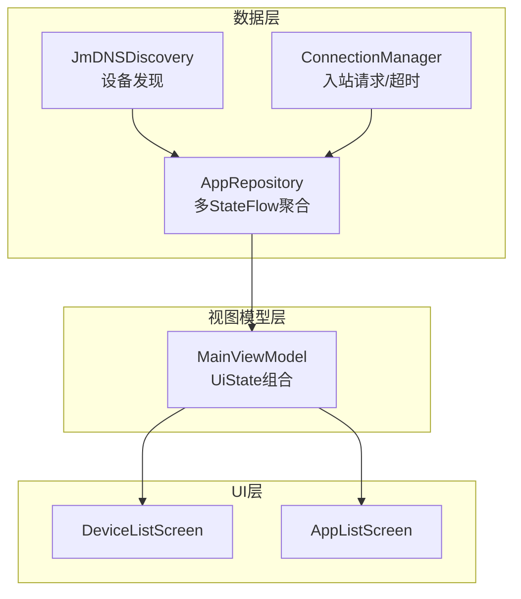
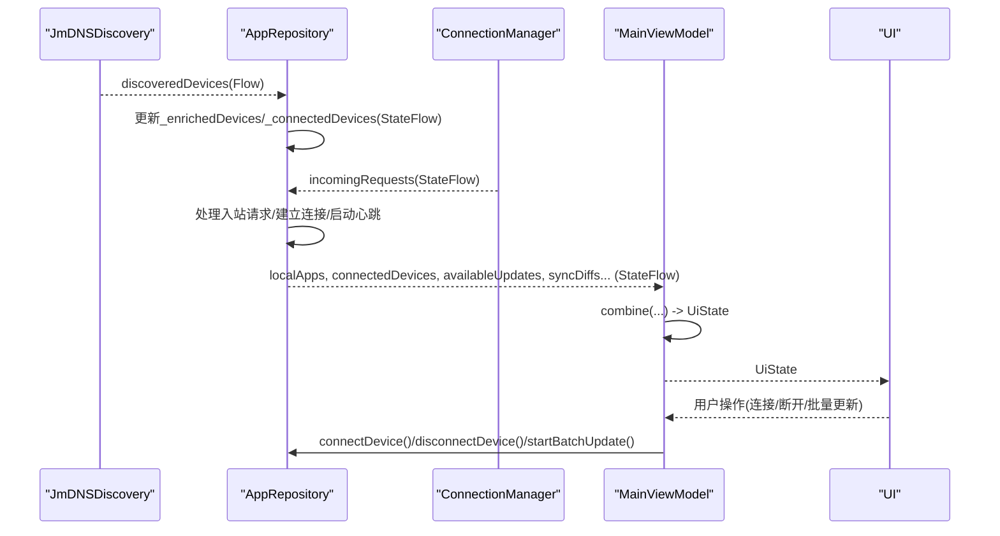
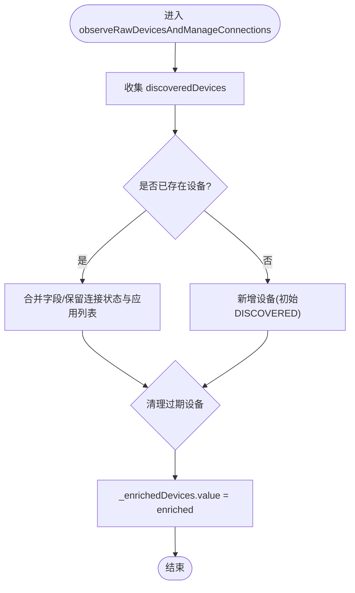
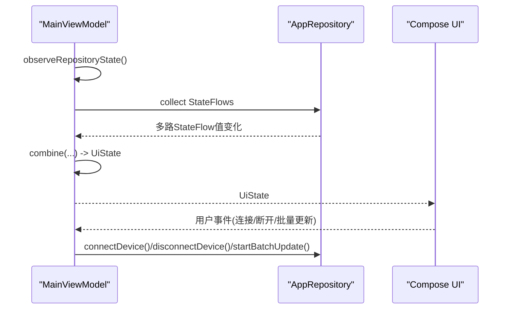
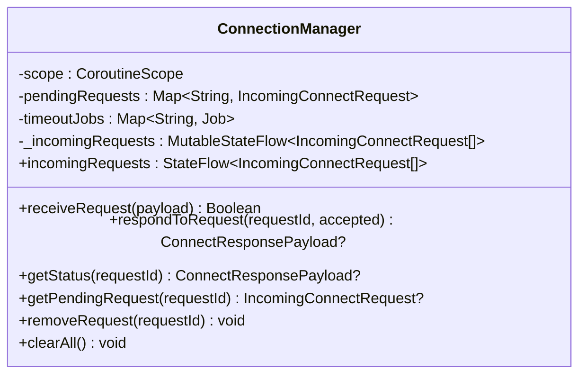
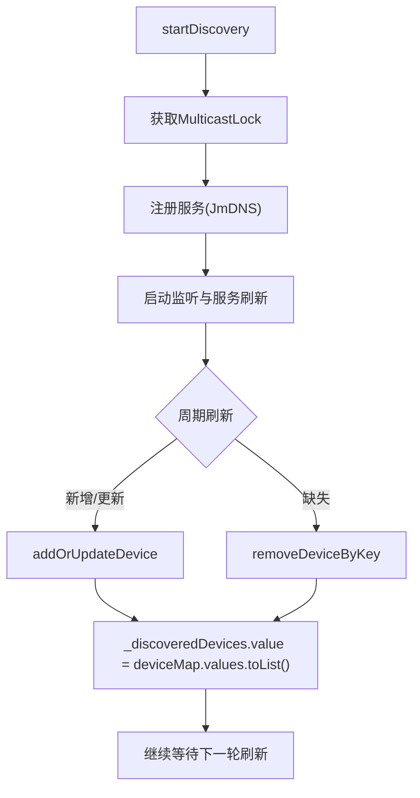
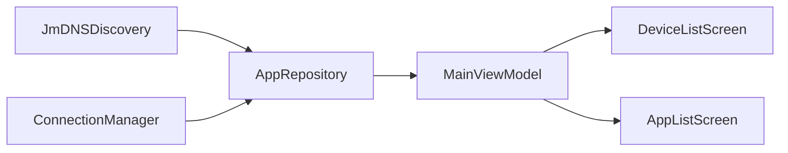

# 响应式编程架构

<cite>
**本文引用的文件**
- [AppRepository.kt](file://app/src/main/java/com/lansync/app/data/repository/AppRepository.kt)
- [MainViewModel.kt](file://app/src/main/java/com/lansync/app/ui/viewmodel/MainViewModel.kt)
- [ConnectionManager.kt](file://app/src/main/java/com/lansync/app/data/connection/ConnectionManager.kt)
- [JmDNSDiscovery.kt](file://app/src/main/java/com/lansync/app/data/discovery/JmDNSDiscovery.kt)
- [Models.kt](file://app/src/main/java/com/lansync/app/data/model/Models.kt)
- [AppConfig.kt](file://app/src/main/java/com/lansync/app/data/AppConfig.kt)
- [AppListScreen.kt](file://app/src/main/java/com/lansync/app/ui/components/AppListScreen.kt)
- [DeviceListScreen.kt](file://app/src/main/java/com/lansync/app/ui/components/DeviceListScreen.kt)
</cite>

## 目录
1. [简介](#简介)
2. [项目结构](#项目结构)
3. [核心组件](#核心组件)
4. [架构总览](#架构总览)
5. [详细组件分析](#详细组件分析)
6. [依赖关系分析](#依赖关系分析)
7. [性能与背压](#性能与背压)
8. [故障排查指南](#故障排查指南)
9. [结论](#结论)
10. [附录：订阅与更新示例路径](#附录订阅与更新示例路径)

## 简介
本文件系统性梳理 LanSync 应用的响应式编程架构，重点围绕 Kotlin Coroutines 与 StateFlow 的数据流设计。文档解释 MutableStateFlow 到 StateFlow 的转换模式、在 AppRepository 中管理多个 StateFlow 实例的策略、combine 操作符在设备发现、连接状态与应用列表组合处理中的使用方式，以及协程作用域（SupervisorJob）与并发控制机制。同时提供 UI 层订阅与更新 StateFlow 的具体代码路径，并给出背压与内存泄漏的处理建议。

## 项目结构
LanSync 采用分层组织：数据层负责网络发现、连接管理、应用扫描与安装；仓库层聚合数据源并以 StateFlow 暴露统一状态；视图模型层将仓库状态组合为 UI 状态；UI 层通过 Compose 消费状态。

图表来源
- [JmDNSDiscovery.kt:23-34](file://app/src/main/java/com/lansync/app/data/discovery/JmDNSDiscovery.kt#L23-L34)
- [ConnectionManager.kt:19-27](file://app/src/main/java/com/lansync/app/data/connection/ConnectionManager.kt#L19-L27)
- [AppRepository.kt:40-79](file://app/src/main/java/com/lansync/app/data/repository/AppRepository.kt#L40-L79)
- [MainViewModel.kt:22-56](file://app/src/main/java/com/lansync/app/ui/viewmodel/MainViewModel.kt#L22-L56)

章节来源
- [AppRepository.kt:40-79](file://app/src/main/java/com/lansync/app/data/repository/AppRepository.kt#L40-L79)
- [MainViewModel.kt:22-56](file://app/src/main/java/com/lansync/app/ui/viewmodel/MainViewModel.kt#L22-L56)

## 核心组件
- AppRepository：集中管理多个 MutableStateFlow，并通过 asStateFlow 暴露只读 StateFlow；协调设备发现、连接、心跳、同步、更新计算等。
- MainViewModel：将仓库的多路 StateFlow 通过 combine 合并为单一 UiState，供 UI 消费。
- ConnectionManager：维护入站连接请求、超时与状态流转，以 StateFlow 暴露待处理请求列表。
- JmDNSDiscovery：基于 mDNS 的设备发现，周期性刷新并输出设备列表 Flow。
- Models：定义 AppInfo、DeviceInfo、UpdateInfo、SyncDiff、连接状态等数据模型。
- AppConfig：配置心跳间隔、重试次数、节流阈值等参数。

章节来源
- [AppRepository.kt:40-79](file://app/src/main/java/com/lansync/app/data/repository/AppRepository.kt#L40-L79)
- [MainViewModel.kt:84-124](file://app/src/main/java/com/lansync/app/ui/viewmodel/MainViewModel.kt#L84-L124)
- [ConnectionManager.kt:19-27](file://app/src/main/java/com/lansync/app/data/connection/ConnectionManager.kt#L19-L27)
- [JmDNSDiscovery.kt:23-34](file://app/src/main/java/com/lansync/app/data/discovery/JmDNSDiscovery.kt#L23-L34)
- [Models.kt:5-67](file://app/src/main/java/com/lansync/app/data/model/Models.kt#L5-L67)
- [AppConfig.kt:3-13](file://app/src/main/java/com/lansync/app/data/AppConfig.kt#L3-L13)

## 架构总览
整体数据流遵循“数据源 -> 仓库 -> 视图模型 -> UI”的单向流：
- 设备发现：JmDNSDiscovery 产出设备列表 Flow，AppRepository 监听并转换为内部 _enrichedDevices/_connectedDevices 等 StateFlow。
- 连接管理：ConnectionManager 暴露 incomingRequests StateFlow，AppRepository 收集并处理入站请求，驱动连接建立与心跳。
- 应用列表与更新：AppRepository 结合本地应用列表与远程设备应用列表，计算可用更新与同步差异。
- UI 消费：MainViewModel 使用 combine 将仓库的多路 StateFlow 合并为 UiState，UI 直接观察 UiState。

图表来源
- [JmDNSDiscovery.kt:23-34](file://app/src/main/java/com/lansync/app/data/discovery/JmDNSDiscovery.kt#L23-L34)
- [AppRepository.kt:289-375](file://app/src/main/java/com/lansync/app/data/repository/AppRepository.kt#L289-L375)
- [ConnectionManager.kt:29-56](file://app/src/main/java/com/lansync/app/data/connection/ConnectionManager.kt#L29-L56)
- [MainViewModel.kt:84-124](file://app/src/main/java/com/lansync/app/ui/viewmodel/MainViewModel.kt#L84-L124)

## 详细组件分析

### AppRepository：多 StateFlow 管理与 combine 使用
- 多 StateFlow 实例：
  - 本地应用列表：_localApps
  - 原始发现设备：_rawDiscoveredDevices
  - 增强设备列表：_enrichedDevices
  - 已连接设备：_connectedDevices
  - 可用更新：_availableUpdates
  - 同步差异：_syncDiffs
  - 服务器端口：_serverPort
  - 运行状态：_isRunning
  - 扫描状态：_isScanningApps
  - 下载进度：_downloadProgress
  - 安装状态：_installStatus
  - 入站请求：_incomingRequests
- 对外暴露只读 StateFlow：通过 asStateFlow 将 MutableStateFlow 暴露为不可变 StateFlow，避免外部直接修改。
- 协程作用域：使用 SupervisorJob + Dispatchers.IO 创建独立 scope，保证子任务失败不影响其他任务。
- 设备发现与连接管理：
  - 监听 jmdnsDiscovery.discoveredDevices，更新 _enrichedDevices 与 _connectedDevices，处理端口迁移与去重。
  - 监听 ktorServer.connectionManager.incomingRequests，处理入站请求，建立连接并启动心跳与定时同步。
- 心跳与重连：
  - startHeartbeat 启动 ping 循环，根据失败次数切换 RECONNECTING/CONNECTION_TIMEOUT 状态，支持快速重连 tryFastReconnect。
  - startSyncSchedule 定时拉取远程应用列表并增强设备信息。
- 更新与差异计算：
  - autoCheckUpdatesWhenDataReady 使用 combine(_localApps, _connectedDevices) 触发 recalculateUpdates 与 calculateSyncDiffs，带节流控制 updateRecalculationThrottleMs。
- 背压与并发控制：
  - 所有后台任务在 IO 调度器执行，避免阻塞主线程。
  - 使用 ConcurrentHashMap 管理心跳/同步 Job，按 displayKey 隔离，取消旧任务再启动新任务，防止重复与泄漏。

图表来源
- [AppRepository.kt:289-375](file://app/src/main/java/com/lansync/app/data/repository/AppRepository.kt#L289-L375)

章节来源
- [AppRepository.kt:40-79](file://app/src/main/java/com/lansync/app/data/repository/AppRepository.kt#L40-L79)
- [AppRepository.kt:289-375](file://app/src/main/java/com/lansync/app/data/repository/AppRepository.kt#L289-L375)
- [AppRepository.kt:761-777](file://app/src/main/java/com/lansync/app/data/repository/AppRepository.kt#L761-L777)

### MainViewModel：UiState 组合与 UI 订阅
- UiState：聚合本地应用、发现设备、已连接设备、可用更新、同步差异、选择集、运行状态、下载/安装状态、入站请求等。
- 组合策略：
  - 第一组 combine：localApps, discoveredDevices, connectedDevices, availableUpdates, syncDiffs, incomingRequests -> 更新 UiState 对应字段。
  - 第二组 combine：isRunning, isScanningApps, serverPort, downloadProgress, installStatus -> 更新 UI 运行与进度相关字段。
- 自动启动：若本地无缓存则先扫描本地应用，再启动服务；否则直接启动服务与扫描。
- 用户操作：连接/断开设备、接受/拒绝入站请求、批量更新、拉取远程应用等，均委托给 AppRepository。

图表来源
- [MainViewModel.kt:84-124](file://app/src/main/java/com/lansync/app/ui/viewmodel/MainViewModel.kt#L84-L124)
- [MainViewModel.kt:126-180](file://app/src/main/java/com/lansync/app/ui/viewmodel/MainViewModel.kt#L126-L180)

章节来源
- [MainViewModel.kt:22-56](file://app/src/main/java/com/lansync/app/ui/viewmodel/MainViewModel.kt#L22-L56)
- [MainViewModel.kt:84-124](file://app/src/main/java/com/lansync/app/ui/viewmodel/MainViewModel.kt#L84-L124)
- [MainViewModel.kt:126-180](file://app/src/main/java/com/lansync/app/ui/viewmodel/MainViewModel.kt#L126-L180)

### ConnectionManager：入站请求与超时管理
- 入站请求：receiveRequest 创建 IncomingConnectRequest，加入 pendingRequests，设置超时 Job，刷新 incomingRequests StateFlow。
- 响应处理：respondToRequest 更新请求状态（ACCEPTED/REJECTED），返回 ConnectResponsePayload，并刷新 StateFlow。
- 超时处理：handleTimeout 将 PENDING 转为 TIMEOUT，移除超时 Job。
- 清理：removeRequest/clearAll 取消 Job 并清空 Map，确保资源释放。

图表来源
- [ConnectionManager.kt:19-27](file://app/src/main/java/com/lansync/app/data/connection/ConnectionManager.kt#L19-L27)
- [ConnectionManager.kt:29-87](file://app/src/main/java/com/lansync/app/data/connection/ConnectionManager.kt#L29-L87)
- [ConnectionManager.kt:118-147](file://app/src/main/java/com/lansync/app/data/connection/ConnectionManager.kt#L118-L147)

章节来源
- [ConnectionManager.kt:19-27](file://app/src/main/java/com/lansync/app/data/connection/ConnectionManager.kt#L19-L27)
- [ConnectionManager.kt:29-87](file://app/src/main/java/com/lansync/app/data/connection/ConnectionManager.kt#L29-L87)
- [ConnectionManager.kt:118-147](file://app/src/main/java/com/lansync/app/data/connection/ConnectionManager.kt#L118-L147)

### JmDNSDiscovery：设备发现与刷新
- 生命周期：startDiscovery 获取 MulticastLock、注册服务、启动监听；stopDiscovery 注销服务、关闭 JmDNS、释放锁。
- 设备映射：deviceMap 以 IP+端口为键，避免重复；addOrUpdateDevice 更新或新增设备，removeDeviceByKey 删除设备。
- 刷新机制：startListening 内启动周期刷新任务，定期 list 服务并对比 key 集合，清理过期设备。

图表来源
- [JmDNSDiscovery.kt:60-86](file://app/src/main/java/com/lansync/app/data/discovery/JmDNSDiscovery.kt#L60-L86)
- [JmDNSDiscovery.kt:119-134](file://app/src/main/java/com/lansync/app/data/discovery/JmDNSDiscovery.kt#L119-L134)
- [JmDNSDiscovery.kt:136-188](file://app/src/main/java/com/lansync/app/data/discovery/JmDNSDiscovery.kt#L136-L188)
- [JmDNSDiscovery.kt:200-262](file://app/src/main/java/com/lansync/app/data/discovery/JmDNSDiscovery.kt#L200-L262)

章节来源
- [JmDNSDiscovery.kt:60-86](file://app/src/main/java/com/lansync/app/data/discovery/JmDNSDiscovery.kt#L60-L86)
- [JmDNSDiscovery.kt:200-262](file://app/src/main/java/com/lansync/app/data/discovery/JmDNSDiscovery.kt#L200-L262)

### 数据模型与配置
- 数据模型：
  - AppInfo：应用基本信息、版本、大小、系统/分包标记等。
  - DeviceInfo：设备标识、连接状态、最近可见时间、错误信息等。
  - UpdateInfo/SyncDiff：用于更新与同步差异展示。
  - IncomingConnectRequest：入站请求及状态。
- 配置项：心跳间隔、同步间隔、容忍度、最大失败次数、更新重算节流、连接超时、轮询间隔、重试次数与延迟、Ping 超时等。

章节来源
- [Models.kt:5-67](file://app/src/main/java/com/lansync/app/data/model/Models.kt#L5-L67)
- [AppConfig.kt:3-13](file://app/src/main/java/com/lansync/app/data/AppConfig.kt#L3-L13)

## 依赖关系分析
- AppRepository 依赖：
  - JmDNSDiscovery：设备发现 Flow。
  - KtorServer.ConnectionManager：入站请求 StateFlow。
  - AppListClient：远程应用列表与连接状态查询。
  - UpdateManager：更新检测与去重。
  - ApkInstaller：安装结果。
  - AppScanner/AppPacker：本地应用扫描与打包。
- MainViewModel 依赖：
  - AppRepository：所有 StateFlow 源。
- UI 依赖：
  - DeviceListScreen/AppListScreen：消费 UiState 并渲染。

图表来源
- [AppRepository.kt:40-79](file://app/src/main/java/com/lansync/app/data/repository/AppRepository.kt#L40-L79)
- [MainViewModel.kt:84-124](file://app/src/main/java/com/lansync/app/ui/viewmodel/MainViewModel.kt#L84-L124)

章节来源
- [AppRepository.kt:40-79](file://app/src/main/java/com/lansync/app/data/repository/AppRepository.kt#L40-L79)
- [MainViewModel.kt:84-124](file://app/src/main/java/com/lansync/app/ui/viewmodel/MainViewModel.kt#L84-L124)

## 性能与背压
- 背压处理：
  - StateFlow 天然具备背压能力，仅发射最新值，UI 侧不会因高频更新而堆积。
  - 在 AppRepository 中对更新重算进行节流（updateRecalculationThrottleMs），避免频繁计算导致 CPU 占用过高。
- 并发控制：
  - 使用 SupervisorJob 隔离各子任务，单个任务异常不会影响其他任务。
  - 心跳与同步任务按 displayKey 管理，取消旧任务再启动新任务，避免重复与泄漏。
- 调度器：
  - 所有 I/O 密集型操作在 Dispatchers.IO 执行，避免阻塞主线程。
- 内存管理：
  - 及时取消 Job（stopHeartbeat、stopSyncJob、clearAll）。
  - 清理 Map（heartbeatFailCounts、connectingDevices、pendingRequests）防止内存增长。
  - 在 stopDiscovery 中释放 MulticastLock，避免资源泄露。

[本节为通用指导，不直接分析具体文件]

## 故障排查指南
- 连接失败/超时：
  - 检查 AppRepository.connectDevice 的连接流程与错误分支，确认发送请求与轮询状态是否正常。
  - 查看 ConnectionManager 的超时处理逻辑，确认 REQUEST_TIMEOUT_MS 与 CONNECT_TIMEOUT_MS 配置是否合理。
- 设备丢失/端口迁移：
  - 关注 AppRepository.observeRawDevicesAndManageConnections 中的端口迁移处理与 stale 设备清理逻辑。
- 更新未生效：
  - 检查 autoCheckUpdatesWhenDataReady 的节流与条件判断，确认本地与远程应用列表均已就绪。
- 入站请求未显示：
  - 确认 ConnectionManager.refreshIncomingList 是否正确过滤 PENDING 状态并按时间排序。
- 日志定位：
  - 使用 FileLogger 输出的关键节点日志（如连接开始/成功/失败、心跳失败计数、设备发现/移除等）辅助定位问题。

章节来源
- [AppRepository.kt:386-484](file://app/src/main/java/com/lansync/app/data/repository/AppRepository.kt#L386-L484)
- [ConnectionManager.kt:132-147](file://app/src/main/java/com/lansync/app/data/connection/ConnectionManager.kt#L132-L147)
- [AppRepository.kt:289-375](file://app/src/main/java/com/lansync/app/data/repository/AppRepository.kt#L289-L375)
- [AppRepository.kt:761-777](file://app/src/main/java/com/lansync/app/data/repository/AppRepository.kt#L761-L777)

## 结论
LanSync 的响应式架构以 StateFlow 为核心，通过 AppRepository 统一管理多路数据流，MainViewModel 使用 combine 将分散的状态整合为 UiState，UI 层以声明式方式消费状态。该设计具备良好的可维护性与扩展性，配合 SupervisorJob 与合理的并发控制，能够稳定处理设备发现、连接管理与应用列表同步等复杂场景。通过节流与背压机制，系统在高频更新下仍能保持良好性能。

[本节为总结性内容，不直接分析具体文件]

## 附录：订阅与更新示例路径
- 订阅仓库多路 StateFlow 并组合为 UiState：
  - [MainViewModel.kt:84-124](file://app/src/main/java/com/lansync/app/ui/viewmodel/MainViewModel.kt#L84-L124)
- 订阅设备发现 Flow 并更新增强设备列表：
  - [AppRepository.kt:289-375](file://app/src/main/java/com/lansync/app/data/repository/AppRepository.kt#L289-L375)
- 订阅入站请求 StateFlow 并处理：
  - [AppRepository.kt:377-384](file://app/src/main/java/com/lansync/app/data/repository/AppRepository.kt#L377-L384)
- 使用 combine 组合本地应用与已连接设备以计算更新：
  - [AppRepository.kt:761-777](file://app/src/main/java/com/lansync/app/data/repository/AppRepository.kt#L761-L777)
- UI 层消费 UiState 的界面组件：
  - [DeviceListScreen.kt:21-152](file://app/src/main/java/com/lansync/app/ui/components/DeviceListScreen.kt#L21-L152)
  - [AppListScreen.kt:27-121](file://app/src/main/java/com/lansync/app/ui/components/AppListScreen.kt#L27-L121)

[本节提供代码路径参考，不包含具体代码内容]