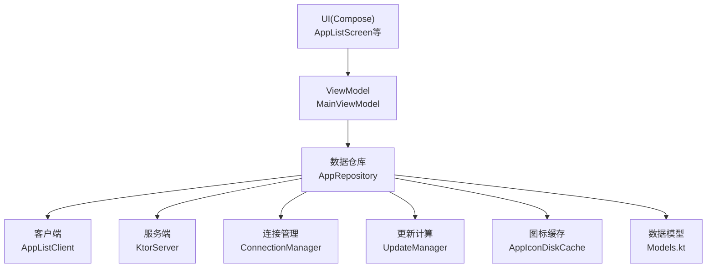
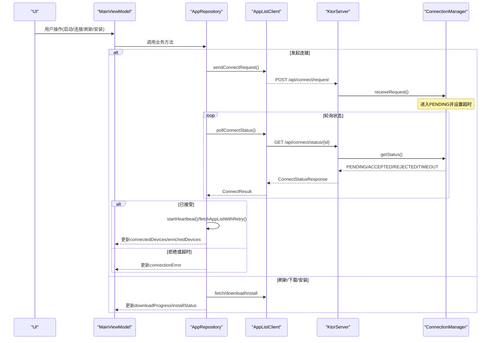
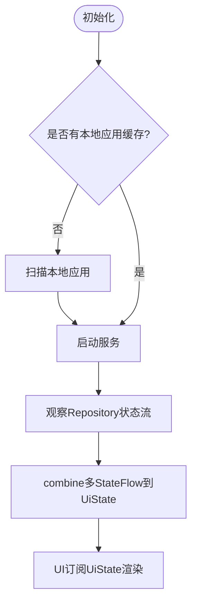
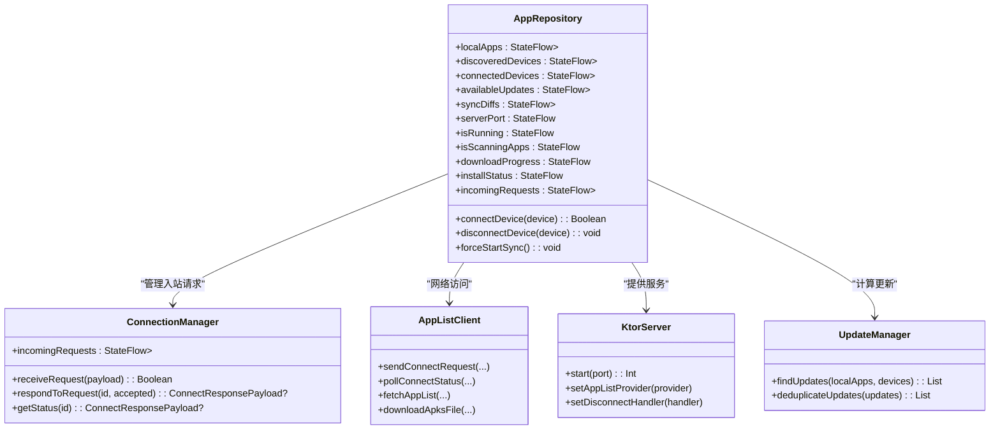
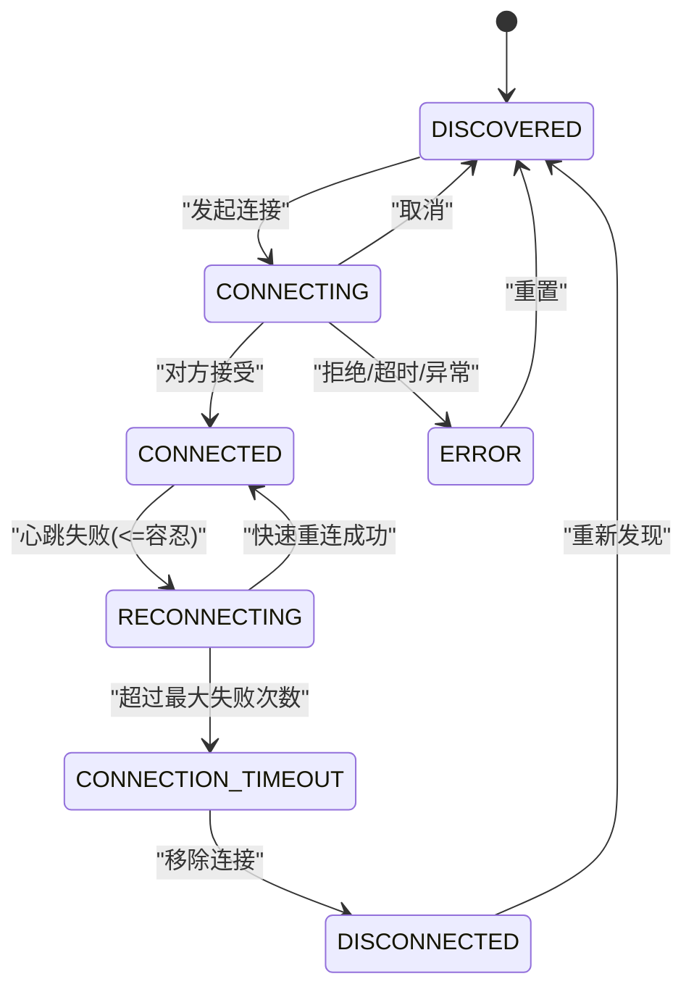
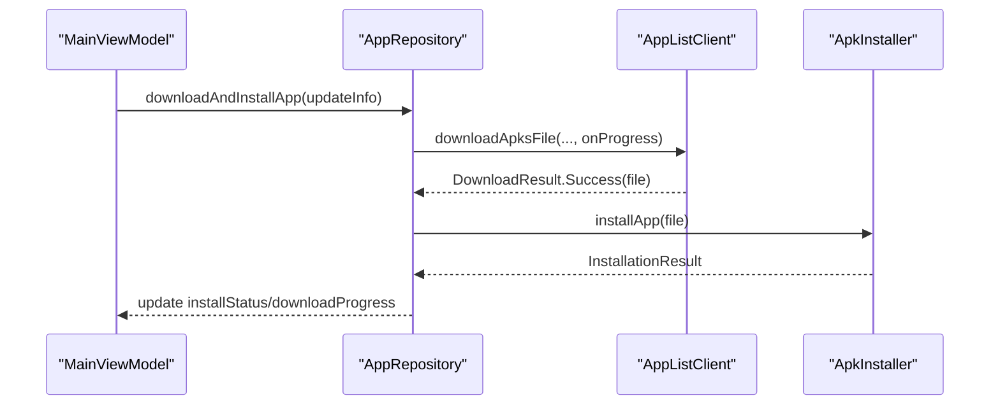
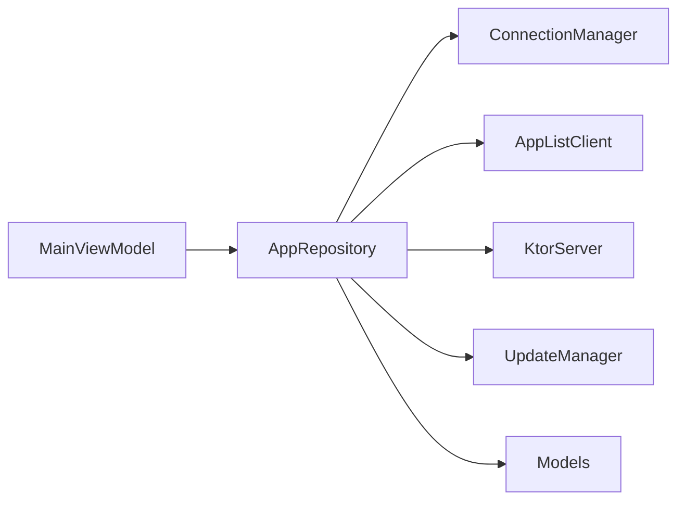

# 数据流管理

<cite>
**本文引用的文件**
- [MainViewModel.kt](file://app/src/main/java/com/lansync/app/ui/viewmodel/MainViewModel.kt)
- [AppRepository.kt](file://app/src/main/java/com/lansync/app/data/repository/AppRepository.kt)
- [Models.kt](file://app/src/main/java/com/lansync/app/data/model/Models.kt)
- [ConnectionManager.kt](file://app/src/main/java/com/lansync/app/data/connection/ConnectionManager.kt)
- [AppListClient.kt](file://app/src/main/java/com/lansync/app/data/client/AppListClient.kt)
- [KtorServer.kt](file://app/src/main/java/com/lansync/app/data/server/KtorServer.kt)
- [UpdateManager.kt](file://app/src/main/java/com/lansync/app/data/update/UpdateManager.kt)
- [AppIconDiskCache.kt](file://app/src/main/java/com/lansync/app/data/cache/AppIconDiskCache.kt)
- [AppListScreen.kt](file://app/src/main/java/com/lansync/app/ui/components/AppListScreen.kt)
</cite>

## 目录
1. [简介](#简介)
2. [项目结构](#项目结构)
3. [核心组件](#核心组件)
4. [架构总览](#架构总览)
5. [详细组件分析](#详细组件分析)
6. [依赖关系分析](#依赖关系分析)
7. [性能考量](#性能考量)
8. [故障排查指南](#故障排查指南)
9. [结论](#结论)
10. [附录](#附录)

## 简介
本文件围绕 LanSync 应用的数据流管理，系统性阐述基于 StateFlow 的响应式数据流设计。重点包括：
- 单向数据流与状态同步机制
- 数据流的组合、转换与过滤
- 并发更新处理与一致性保证
- 本地缓存与远程数据的同步策略
- 错误处理与重试机制
- 数据流图与状态转换图，覆盖复杂业务场景

## 项目结构
LanSync 采用分层组织：UI（Compose）通过 ViewModel 暴露 StateFlow；数据层由 Repository 聚合多来源数据并对外发布 StateFlow；网络与服务端分别由 Client 与 Server 提供；连接管理与更新计算作为独立模块。

图表来源
- [MainViewModel.kt:22-56](file://app/src/main/java/com/lansync/app/ui/viewmodel/MainViewModel.kt#L22-L56)
- [AppRepository.kt:40-79](file://app/src/main/java/com/lansync/app/data/repository/AppRepository.kt#L40-L79)
- [AppListClient.kt:30-56](file://app/src/main/java/com/lansync/app/data/client/AppListClient.kt#L30-L56)
- [KtorServer.kt:30-63](file://app/src/main/java/com/lansync/app/data/server/KtorServer.kt#L30-L63)
- [ConnectionManager.kt:19-27](file://app/src/main/java/com/lansync/app/data/connection/ConnectionManager.kt#L19-L27)
- [UpdateManager.kt:12-35](file://app/src/main/java/com/lansync/app/data/update/UpdateManager.kt#L12-L35)
- [AppIconDiskCache.kt:9-17](file://app/src/main/java/com/lansync/app/data/cache/AppIconDiskCache.kt#L9-L17)
- [Models.kt:5-67](file://app/src/main/java/com/lansync/app/data/model/Models.kt#L5-L67)

章节来源
- [MainViewModel.kt:22-56](file://app/src/main/java/com/lansync/app/ui/viewmodel/MainViewModel.kt#L22-L56)
- [AppRepository.kt:40-79](file://app/src/main/java/com/lansync/app/data/repository/AppRepository.kt#L40-L79)

## 核心组件
- MainViewModel：将多个 Repository 的 StateFlow 组合为单一 UiState，驱动 UI 单向更新。
- AppRepository：统一协调扫描、发现、连接、心跳、下载、安装、更新计算等，维护多组 StateFlow。
- ConnectionManager：维护待处理连接请求、超时、状态流转，并通过 StateFlow 暴露给上层。
- AppListClient：封装 HTTP 通信、设备探测、应用列表获取、APK 下载与校验。
- KtorServer：提供局域网服务接口，接收连接请求、下发应用包、处理断开通知。
- UpdateManager：对比本地与远端应用版本，生成可更新列表并去重。
- AppIconDiskCache：本地磁盘缓存应用图标，支持批量写入与清理。
- Models：定义跨层共享的数据结构与枚举。

章节来源
- [MainViewModel.kt:84-124](file://app/src/main/java/com/lansync/app/ui/viewmodel/MainViewModel.kt#L84-L124)
- [AppRepository.kt:53-79](file://app/src/main/java/com/lansync/app/data/repository/AppRepository.kt#L53-L79)
- [ConnectionManager.kt:23-27](file://app/src/main/java/com/lansync/app/data/connection/ConnectionManager.kt#L23-L27)
- [AppListClient.kt:228-254](file://app/src/main/java/com/lansync/app/data/client/AppListClient.kt#L228-L254)
- [KtorServer.kt:77-284](file://app/src/main/java/com/lansync/app/data/server/KtorServer.kt#L77-L284)
- [UpdateManager.kt:14-35](file://app/src/main/java/com/lansync/app/data/update/UpdateManager.kt#L14-L35)
- [AppIconDiskCache.kt:19-49](file://app/src/main/java/com/lansync/app/data/cache/AppIconDiskCache.kt#L19-L49)
- [Models.kt:19-67](file://app/src/main/java/com/lansync/app/data/model/Models.kt#L19-L67)

## 架构总览
整体遵循“单向数据流”原则：
- UI 仅订阅 ViewModel 的 StateFlow，不直接修改数据。
- ViewModel 调用 Repository 的业务方法，触发底层操作。
- Repository 维护多组 StateFlow，通过 combine 组合后回写 ViewModel 的 UiState。
- 网络与服务端交互在 Repository 中集中编排，确保一致性与可观测性。

图表来源
- [AppListClient.kt:62-133](file://app/src/main/java/com/lansync/app/data/client/AppListClient.kt#L62-L133)
- [KtorServer.kt:88-175](file://app/src/main/java/com/lansync/app/data/server/KtorServer.kt#L88-L175)
- [ConnectionManager.kt:29-87](file://app/src/main/java/com/lansync/app/data/connection/ConnectionManager.kt#L29-L87)
- [AppRepository.kt:386-484](file://app/src/main/java/com/lansync/app/data/repository/AppRepository.kt#L386-L484)

## 详细组件分析

### ViewModel 与 StateFlow 组合
- 使用 combine 将 Repository 的多条 StateFlow 合并为 UiState，实现按功能分组避免参数过多限制。
- 自动启动流程：首次无缓存时执行初始扫描并启动服务；否则直接启动服务并扫描本地应用。
- 操作反馈：通过 isStarting/isStopping/operationMessage 等字段提供用户可见的进度与提示。

图表来源
- [MainViewModel.kt:60-82](file://app/src/main/java/com/lansync/app/ui/viewmodel/MainViewModel.kt#L60-L82)
- [MainViewModel.kt:84-124](file://app/src/main/java/com/lansync/app/ui/viewmodel/MainViewModel.kt#L84-L124)

章节来源
- [MainViewModel.kt:60-124](file://app/src/main/java/com/lansync/app/ui/viewmodel/MainViewModel.kt#L60-L124)

### Repository 数据流与状态同步
- 维护多组 StateFlow：本地应用、发现设备、连接设备、可用更新、同步差异、服务器端口、运行状态、扫描状态、下载进度、安装状态、入站请求。
- 设备发现与连接：监听 JmDNS 发现结果，维护 enrichedDevices；连接成功后启动心跳与定时同步。
- 心跳与重连：失败计数阈值控制不稳定/重连/超时状态，并在恢复时快速重连。
- 更新计算：当本地应用与连接设备数据就绪时，异步计算可用更新与同步差异，并进行节流。

图表来源
- [AppRepository.kt:40-79](file://app/src/main/java/com/lansync/app/data/repository/AppRepository.kt#L40-L79)
- [ConnectionManager.kt:19-27](file://app/src/main/java/com/lansync/app/data/connection/ConnectionManager.kt#L19-L27)
- [AppListClient.kt:62-133](file://app/src/main/java/com/lansync/app/data/client/AppListClient.kt#L62-L133)
- [KtorServer.kt:65-63](file://app/src/main/java/com/lansync/app/data/server/KtorServer.kt#L65-L63)
- [UpdateManager.kt:14-35](file://app/src/main/java/com/lansync/app/data/update/UpdateManager.kt#L14-L35)

章节来源
- [AppRepository.kt:284-375](file://app/src/main/java/com/lansync/app/data/repository/AppRepository.kt#L284-L375)
- [AppRepository.kt:386-484](file://app/src/main/java/com/lansync/app/data/repository/AppRepository.kt#L386-L484)
- [AppRepository.kt:761-777](file://app/src/main/java/com/lansync/app/data/repository/AppRepository.kt#L761-L777)

### 连接状态机
设备连接生命周期包含多种状态，配合心跳与重连逻辑，保障稳定性。

图表来源
- [Models.kt:19-27](file://app/src/main/java/com/lansync/app/data/model/Models.kt#L19-L27)
- [AppRepository.kt:179-249](file://app/src/main/java/com/lansync/app/data/repository/AppRepository.kt#L179-L249)

章节来源
- [Models.kt:19-27](file://app/src/main/java/com/lansync/app/data/model/Models.kt#L19-L27)
- [AppRepository.kt:179-249](file://app/src/main/java/com/lansync/app/data/repository/AppRepository.kt#L179-L249)

### 下载与安装流程
- 下载：通过 AppListClient 从远端拉取 APK/APKS，带 MD5 校验与进度回调。
- 安装：通过 ApkInstaller 完成安装，状态通过 installStatus 暴露给 UI。
- 批量更新：支持多选批量下载与安装，汇总错误信息并展示。

图表来源
- [AppListClient.kt:358-462](file://app/src/main/java/com/lansync/app/data/client/AppListClient.kt#L358-L462)
- [MainViewModel.kt:245-281](file://app/src/main/java/com/lansync/app/ui/viewmodel/MainViewModel.kt#L245-L281)

章节来源
- [AppListClient.kt:358-462](file://app/src/main/java/com/lansync/app/data/client/AppListClient.kt#L358-L462)
- [MainViewModel.kt:245-281](file://app/src/main/java/com/lansync/app/ui/viewmodel/MainViewModel.kt#L245-L281)

### 图标缓存策略
- 本地磁盘缓存 PNG 图标，读取时根据目标尺寸进行采样缩放，减少内存占用。
- 支持批量写入、清理过期图标、统计大小与字节数。
- 与 UI 结合，提升列表滚动性能与加载体验。

章节来源
- [AppIconDiskCache.kt:19-79](file://app/src/main/java/com/lansync/app/data/cache/AppIconDiskCache.kt#L19-L79)

### UI 数据绑定与过滤
- Compose 界面通过 derivedStateOf 对本地应用进行查询与分类过滤，保持响应式与高效重组。
- 更新项展示包含版本变化、来源设备、文件大小等信息，并提供选择与安装操作。

章节来源
- [AppListScreen.kt:35-49](file://app/src/main/java/com/lansync/app/ui/components/AppListScreen.kt#L35-L49)
- [AppListScreen.kt:291-426](file://app/src/main/java/com/lansync/app/ui/components/AppListScreen.kt#L291-L426)

## 依赖关系分析
- ViewModel 依赖 Repository 暴露的 StateFlow，解耦 UI 与数据源。
- Repository 依赖 ConnectionManager、AppListClient、KtorServer、UpdateManager，形成清晰的分层协作。
- 数据模型集中定义，确保跨层一致性。

图表来源
- [MainViewModel.kt:47-56](file://app/src/main/java/com/lansync/app/ui/viewmodel/MainViewModel.kt#L47-L56)
- [AppRepository.kt:40-79](file://app/src/main/java/com/lansync/app/data/repository/AppRepository.kt#L40-L79)

章节来源
- [MainViewModel.kt:47-56](file://app/src/main/java/com/lansync/app/ui/viewmodel/MainViewModel.kt#L47-L56)
- [AppRepository.kt:40-79](file://app/src/main/java/com/lansync/app/data/repository/AppRepository.kt#L40-L79)

## 性能考量
- 使用 StateFlow 与 combine 实现声明式数据流，避免频繁手动刷新。
- 心跳与同步任务以协程调度，具备超时与失败计数，避免无效请求。
- 下载过程分块写入并实时上报进度，支持大文件传输。
- 图标缓存降低内存与 IO 压力，提高 UI 流畅度。
- 更新计算加入节流，防止高频触发导致资源浪费。

[本节为通用指导，无需特定文件引用]

## 故障排查指南
- 连接问题：检查 connect request 是否返回 requestId，轮询状态是否超时或被拒绝；查看 connectionError 与日志。
- 心跳异常：关注失败计数与状态迁移（不稳定/重连/超时），必要时重启服务或设备。
- 下载失败：确认 MD5 校验是否通过，检查网络与远端可用性；查看 DownloadResult.Error 消息。
- 安装失败：查看 installStatus 与 ApkInstaller 返回的错误信息，确认权限与安装包完整性。
- 入站请求：确认 ConnectionManager 中的 pendingRequests 与超时处理是否正确。

章节来源
- [AppRepository.kt:386-484](file://app/src/main/java/com/lansync/app/data/repository/AppRepository.kt#L386-L484)
- [AppRepository.kt:179-249](file://app/src/main/java/com/lansync/app/data/repository/AppRepository.kt#L179-L249)
- [AppListClient.kt:393-462](file://app/src/main/java/com/lansync/app/data/client/AppListClient.kt#L393-L462)
- [ConnectionManager.kt:29-87](file://app/src/main/java/com/lansync/app/data/connection/ConnectionManager.kt#L29-L87)

## 结论
LanSync 通过 StateFlow 构建了清晰的单向数据流，结合 Repository 的集中编排，实现了设备发现、连接管理、数据同步、更新计算与下载安装的完整闭环。心跳与重连机制增强了鲁棒性，缓存策略提升了性能，错误处理与重试保障了用户体验。该设计易于扩展与维护，适合在局域网环境下进行高效的应用分发与管理。

[本节为总结，无需特定文件引用]

## 附录
- 关键数据模型参考：
  - AppInfo、DeviceInfo、UpdateInfo、SyncDiff、ConnectionState、IncomingConnectRequest 等定义位于 Models.kt。
- 主要 API 路径参考：
  - /api/ping、/api/applist、/api/connect/request、/api/connect/status/{requestId}、/api/connect/response/{requestId}、/api/download/{packageName}[/{versionCode}]、/api/disconnect、/api/refresh-applist、/api/deviceinfo。

章节来源
- [Models.kt:5-138](file://app/src/main/java/com/lansync/app/data/model/Models.kt#L5-L138)
- [KtorServer.kt:77-284](file://app/src/main/java/com/lansync/app/data/server/KtorServer.kt#L77-L284)