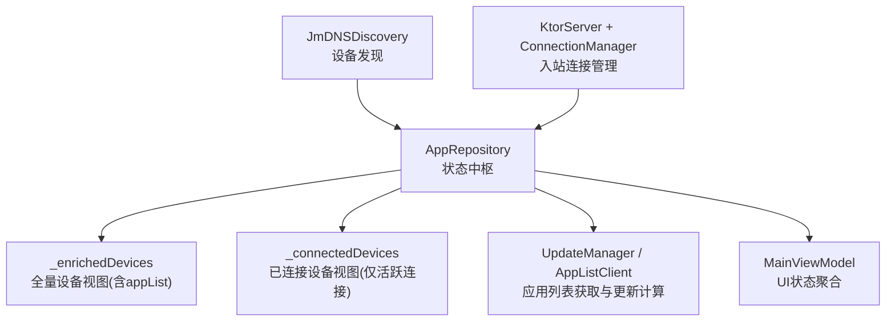
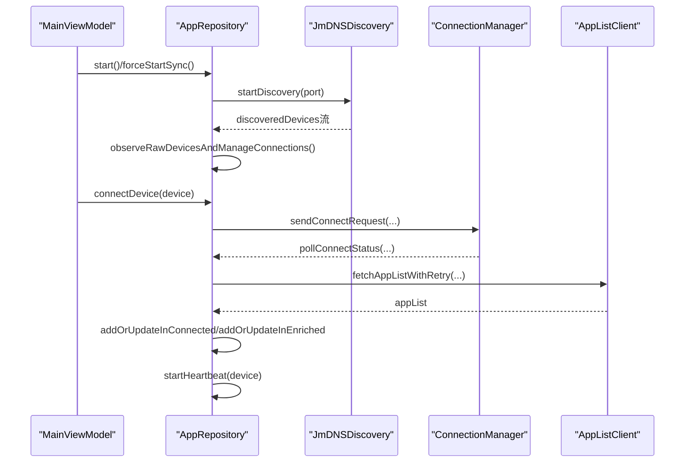
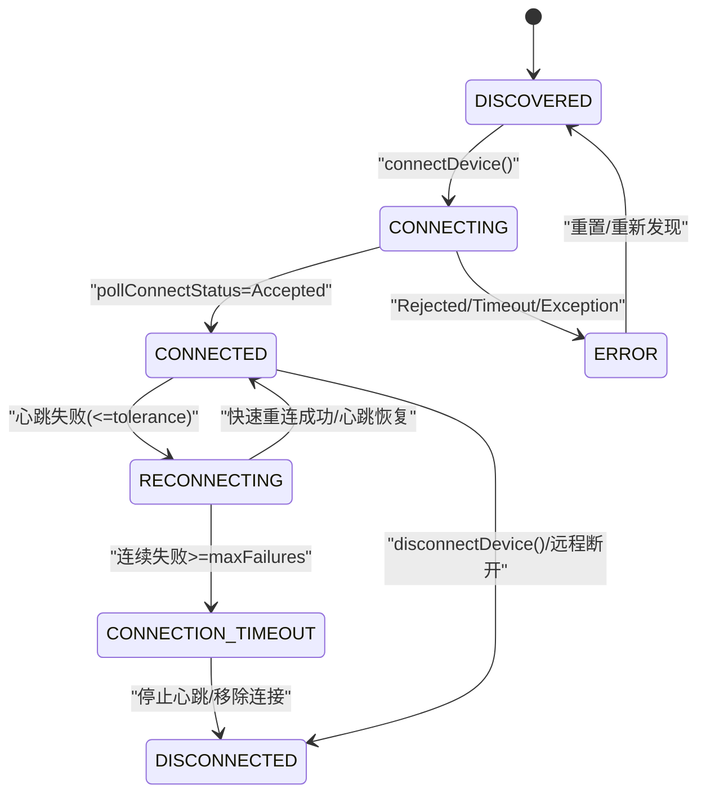
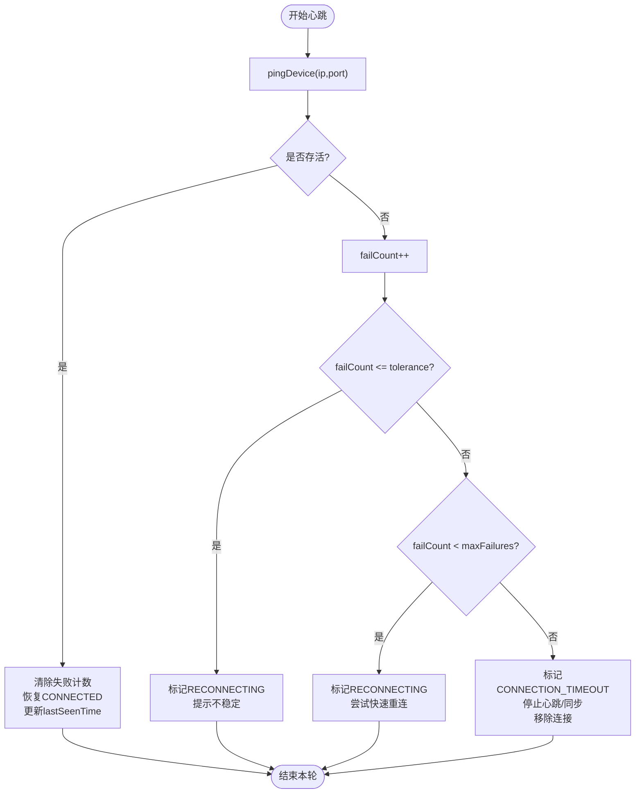
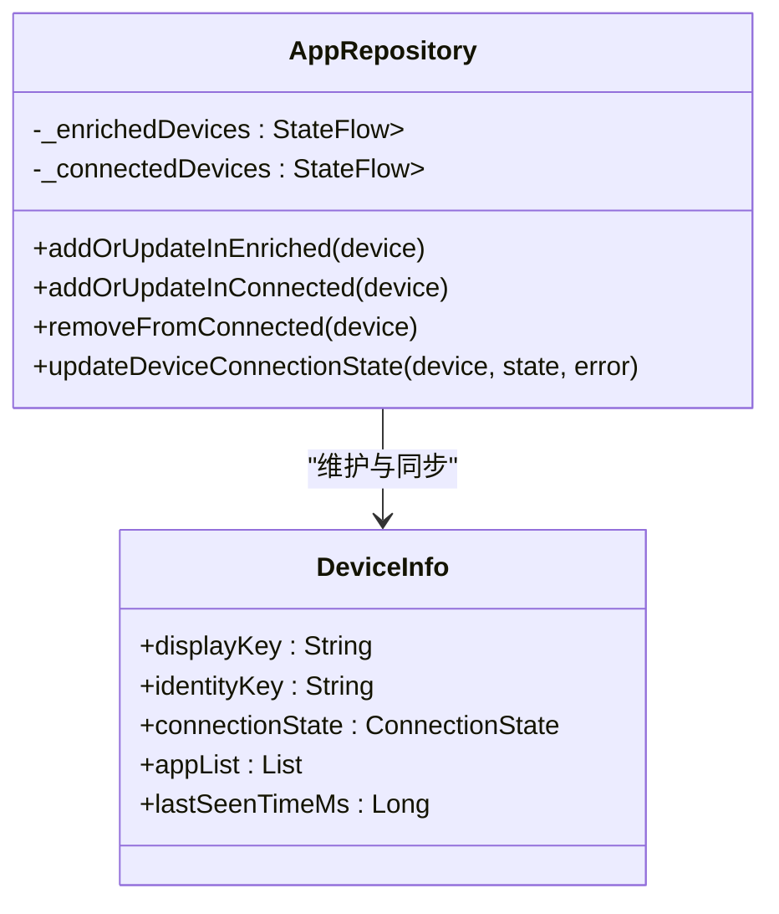
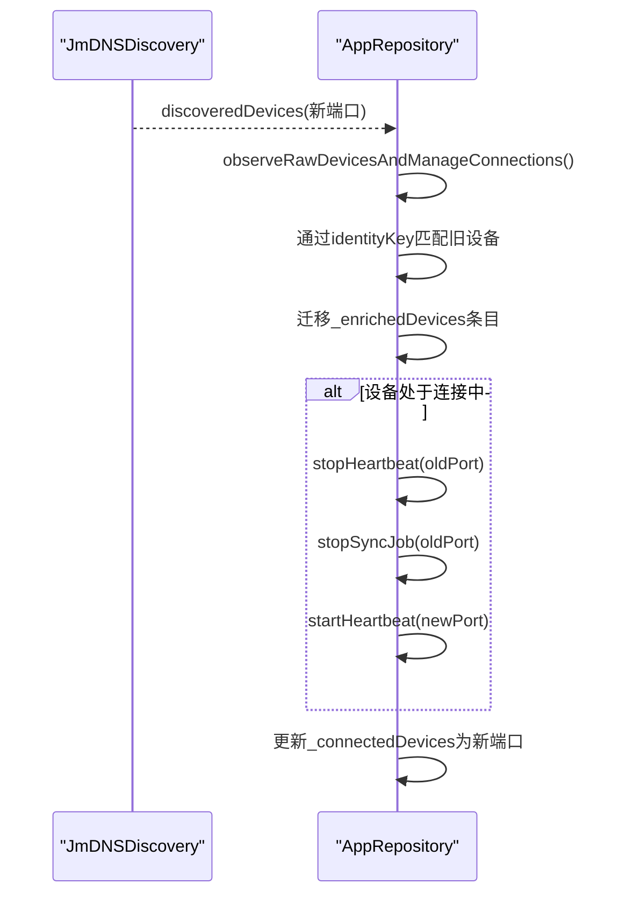
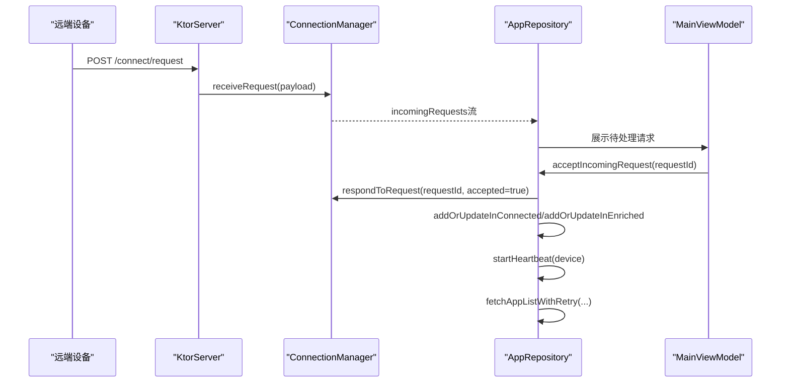
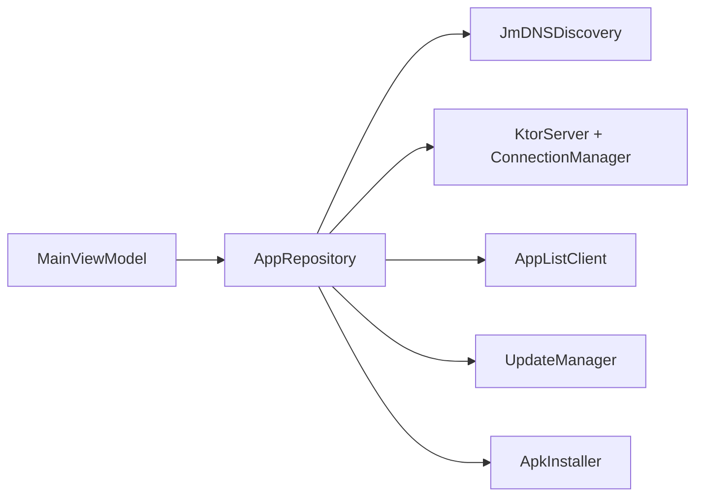

# 状态同步机制

<cite>
**本文引用的文件**
- [AppRepository.kt](file://app/src/main/java/com/lansync/app/data/repository/AppRepository.kt)
- [Models.kt](file://app/src/main/java/com/lansync/app/data/model/Models.kt)
- [ConnectionManager.kt](file://app/src/main/java/com/lansync/app/data/connection/ConnectionManager.kt)
- [JmDNSDiscovery.kt](file://app/src/main/java/com/lansync/app/data/discovery/JmDNSDiscovery.kt)
- [MainViewModel.kt](file://app/src/main/java/com/lansync/app/ui/viewmodel/MainViewModel.kt)
- [AppConfig.kt](file://app/src/main/java/com/lansync/app/data/AppConfig.kt)
</cite>

## 目录
1. [简介](#简介)
2. [项目结构](#项目结构)
3. [核心组件](#核心组件)
4. [架构总览](#架构总览)
5. [详细组件分析](#详细组件分析)
6. [依赖关系分析](#依赖关系分析)
7. [性能考量](#性能考量)
8. [故障排查指南](#故障排查指南)
9. [结论](#结论)
10. [附录：状态转换图与关键流程](#附录状态转换图与关键流程)

## 简介
本文件聚焦于LanSync应用的状态同步机制，围绕设备连接生命周期、心跳检测、多级缓存以及端口迁移等关键主题展开。重点说明以下目标：
- 设备连接状态在 DISCOVERED、CONNECTING、CONNECTED、RECONNECTING、DISCONNECTED、CONNECTION_TIMEOUT 之间的转换逻辑
- 心跳检测如何维护设备在线状态（失败计数、重试策略、超时处理）
- 设备信息的多级缓存策略：_enrichedDevices 与 _connectedDevices 的区别及同步机制
- 端口迁移时的状态保持与数据一致性保证
- 提供状态转换图与具体实现代码路径引用

## 项目结构
LanSync的状态同步由多个模块协作完成：
- 发现层：通过 JmDNSDiscovery 广播与监听局域网服务，产出原始设备列表
- 仓库层：AppRepository 作为中枢，协调连接、心跳、缓存、更新计算与UI状态
- 连接管理：ConnectionManager 负责入站连接请求的接收、响应与超时处理
- UI层：MainViewModel 聚合仓库暴露的StateFlow，驱动界面展示与用户操作

图表来源
- [JmDNSDiscovery.kt:60-117](file://app/src/main/java/com/lansync/app/data/discovery/JmDNSDiscovery.kt#L60-L117)
- [AppRepository.kt:289-375](file://app/src/main/java/com/lansync/app/data/repository/AppRepository.kt#L289-L375)
- [ConnectionManager.kt:29-147](file://app/src/main/java/com/lansync/app/data/connection/ConnectionManager.kt#L29-L147)
- [MainViewModel.kt:84-124](file://app/src/main/java/com/lansync/app/ui/viewmodel/MainViewModel.kt#L84-L124)

章节来源
- [JmDNSDiscovery.kt:60-117](file://app/src/main/java/com/lansync/app/data/discovery/JmDNSDiscovery.kt#L60-L117)
- [AppRepository.kt:289-375](file://app/src/main/java/com/lansync/app/data/repository/AppRepository.kt#L289-L375)
- [ConnectionManager.kt:29-147](file://app/src/main/java/com/lansync/app/data/connection/ConnectionManager.kt#L29-L147)
- [MainViewModel.kt:84-124](file://app/src/main/java/com/lansync/app/ui/viewmodel/MainViewModel.kt#L84-L124)

## 核心组件
- AppRepository：状态同步的核心，负责：
  - 观察原始设备并维护_enrichedDevices
  - 管理_connectedDevices（仅包含已建立连接的活跃设备）
  - 启动/停止心跳与定时同步任务
  - 处理设备连接、断开、端口迁移、远程刷新通知
  - 计算可用更新与差异集
- JmDNSDiscovery：基于mDNS的设备发现，维护_discoveredDevices流
- ConnectionManager：处理入站连接请求的生命周期（PENDING/ACCEPTED/REJECTED/TIMEOUT），并提供超时清理
- MainViewModel：组合仓库的StateFlow，映射到UiState供UI消费
- AppConfig：定义心跳间隔、容忍度、最大失败次数、超时与重试等参数

章节来源
- [AppRepository.kt:40-87](file://app/src/main/java/com/lansync/app/data/repository/AppRepository.kt#L40-L87)
- [JmDNSDiscovery.kt:23-43](file://app/src/main/java/com/lansync/app/data/discovery/JmDNSDiscovery.kt#L23-L43)
- [ConnectionManager.kt:19-27](file://app/src/main/java/com/lansync/app/data/connection/ConnectionManager.kt#L19-L27)
- [MainViewModel.kt:22-45](file://app/src/main/java/com/lansync/app/ui/viewmodel/MainViewModel.kt#L22-L45)
- [AppConfig.kt:3-13](file://app/src/main/java/com/lansync/app/data/AppConfig.kt#L3-L13)

## 架构总览
LanSync采用“发现-连接-心跳-缓存-同步”的分层架构：
- 发现层：周期性扫描局域网服务，产出原始设备列表
- 连接层：发起或接受连接，进入CONNECTING并最终到达CONNECTED
- 心跳层：定期ping设备，根据失败次数推进状态至RECONNECTING或CONNECTION_TIMEOUT
- 缓存层：_enrichedDevices保存所有已知设备的完整信息；_connectedDevices仅保存已连接设备
- 同步层：定时拉取远端应用列表，计算更新差异，推送给UI

图表来源
- [AppRepository.kt:386-484](file://app/src/main/java/com/lansync/app/data/repository/AppRepository.kt#L386-L484)
- [AppRepository.kt:720-759](file://app/src/main/java/com/lansync/app/data/repository/AppRepository.kt#L720-L759)
- [ConnectionManager.kt:29-147](file://app/src/main/java/com/lansync/app/data/connection/ConnectionManager.kt#L29-L147)
- [JmDNSDiscovery.kt:60-117](file://app/src/main/java/com/lansync/app/data/discovery/JmDNSDiscovery.kt#L60-L117)

## 详细组件分析

### 设备连接状态机与转换逻辑
- 初始发现：DISCOVERED（来自JmDNSDiscovery）
- 发起连接：CONNECTING（调用sendConnectRequest后）
- 连接成功：CONNECTED（pollConnectStatus返回Accepted）
- 心跳失败：
  - 短期不稳定：RECONNECTING（failCount <= heartbeatPingTolerance）
  - 持续失败：RECONNECTING（failCount < heartbeatPingMaxFailures，尝试快速重连）
  - 最终超时：CONNECTION_TIMEOUT（failCount >= heartbeatPingMaxFailures）
- 主动断开：DISCONNECTED（disconnectDevice或远程通知）
- 错误分支：ERROR（网络异常、对方拒绝、发送请求失败等）

图表来源
- [Models.kt:19-27](file://app/src/main/java/com/lansync/app/data/model/Models.kt#L19-L27)
- [AppRepository.kt:179-249](file://app/src/main/java/com/lansync/app/data/repository/AppRepository.kt#L179-L249)
- [AppRepository.kt:386-484](file://app/src/main/java/com/lansync/app/data/repository/AppRepository.kt#L386-L484)
- [AppRepository.kt:590-622](file://app/src/main/java/com/lansync/app/data/repository/AppRepository.kt#L590-L622)

章节来源
- [Models.kt:19-27](file://app/src/main/java/com/lansync/app/data/model/Models.kt#L19-L27)
- [AppRepository.kt:179-249](file://app/src/main/java/com/lansync/app/data/repository/AppRepository.kt#L179-L249)
- [AppRepository.kt:386-484](file://app/src/main/java/com/lansync/app/data/repository/AppRepository.kt#L386-L484)
- [AppRepository.kt:590-622](file://app/src/main/java/com/lansync/app/data/repository/AppRepository.kt#L590-L622)

### 心跳检测机制（失败计数、重试策略、超时处理）
- 心跳循环：每heartbeatPingIntervalMs执行一次ping
- 成功：清除失败计数，恢复CONNECTED，更新lastSeenTime
- 失败：
  - failCount <= heartbeatPingTolerance：标记为RECONNECTING，提示不稳定
  - heartbeatPingTolerance < failCount < heartbeatPingMaxFailures：继续RECONNECTING，触发快速重连
  - failCount >= heartbeatPingMaxFailures：标记为CONNECTION_TIMEOUT，停止心跳与同步任务，从_connectedDevices移除
- 快速重连：尝试fetchDeviceInfo，成功后恢复CONNECTED并继续后台拉取应用列表

图表来源
- [AppRepository.kt:134-172](file://app/src/main/java/com/lansync/app/data/repository/AppRepository.kt#L134-L172)
- [AppRepository.kt:179-249](file://app/src/main/java/com/lansync/app/data/repository/AppRepository.kt#L179-L249)
- [AppRepository.kt:251-269](file://app/src/main/java/com/lansync/app/data/repository/AppRepository.kt#L251-L269)
- [AppConfig.kt:3-13](file://app/src/main/java/com/lansync/app/data/AppConfig.kt#L3-L13)

章节来源
- [AppRepository.kt:134-172](file://app/src/main/java/com/lansync/app/data/repository/AppRepository.kt#L134-L172)
- [AppRepository.kt:179-249](file://app/src/main/java/com/lansync/app/data/repository/AppRepository.kt#L179-L249)
- [AppRepository.kt:251-269](file://app/src/main/java/com/lansync/app/data/repository/AppRepository.kt#L251-L269)
- [AppConfig.kt:3-13](file://app/src/main/java/com/lansync/app/data/AppConfig.kt#L3-L13)

### 多级缓存策略：_enrichedDevices 与 _connectedDevices
- _enrichedDevices（全量设备视图）：
  - 包含所有已知设备（无论是否连接）
  - 携带完整信息：deviceName、ipAddress、port、instanceId、appList、connectionState、lastSeenTimeMs
  - 用于UI展示“发现设备列表”，支持离线查看历史应用列表
- _connectedDevices（活跃连接视图）：
  - 仅包含当前处于CONNECTED或RECONNECTING状态的连接设备
  - 用于显示“已连接设备”，进行实时同步与下载等操作
- 同步机制：
  - 连接成功时：同时写入两个列表，确保一致
  - 心跳恢复/失败：按状态更新两列表
  - 端口迁移：保持appList与连接状态，迁移心跳任务到新端口
  - 断开/超时：从_connectedDevices移除，保留_enrichedDevices中的历史状态

图表来源
- [AppRepository.kt:53-79](file://app/src/main/java/com/lansync/app/data/repository/AppRepository.kt#L53-L79)
- [AppRepository.kt:681-705](file://app/src/main/java/com/lansync/app/data/repository/AppRepository.kt#L681-L705)
- [Models.kt:29-45](file://app/src/main/java/com/lansync/app/data/model/Models.kt#L29-L45)

章节来源
- [AppRepository.kt:53-79](file://app/src/main/java/com/lansync/app/data/repository/AppRepository.kt#L53-L79)
- [AppRepository.kt:681-705](file://app/src/main/java/com/lansync/app/data/repository/AppRepository.kt#L681-L705)
- [Models.kt:29-45](file://app/src/main/java/com/lansync/app/data/model/Models.kt#L29-L45)

### 端口迁移时的状态保持与数据一致性
当设备实例的IP或端口发生变化（例如重启导致端口变化），系统通过identityKey匹配旧设备与新设备，进行迁移：
- 检测到端口变化：记录日志并迁移_enrichedDevices中的条目
- 若该设备处于CONNECTED或RECONNECTING：
  - 停止旧端口的心跳与同步任务
  - 在新端口上重启心跳与同步任务
  - 保持appList与连接状态不变
- 迁移完成后，确保_connectedDevices与_enrichedDevices保持一致

图表来源
- [AppRepository.kt:289-375](file://app/src/main/java/com/lansync/app/data/repository/AppRepository.kt#L289-L375)
- [AppRepository.kt:566-584](file://app/src/main/java/com/lansync/app/data/repository/AppRepository.kt#L566-L584)

章节来源
- [AppRepository.kt:289-375](file://app/src/main/java/com/lansync/app/data/repository/AppRepository.kt#L289-L375)
- [AppRepository.kt:566-584](file://app/src/main/java/com/lansync/app/data/repository/AppRepository.kt#L566-L584)

### 入站连接与自动接受策略
- 收到入站请求：ConnectionManager记录pendingRequests并设置超时
- UI侧可接受/拒绝/忽略请求
- 自动接受：若请求方为已知设备（通过instanceId或name+ip匹配），则自动接受并建立连接
- 连接建立后：
  - 将设备加入_connectedDevices与_enrichedDevices
  - 启动心跳与定时同步
  - 后台拉取应用列表（带重试）

图表来源
- [ConnectionManager.kt:29-147](file://app/src/main/java/com/lansync/app/data/connection/ConnectionManager.kt#L29-L147)
- [AppRepository.kt:486-554](file://app/src/main/java/com/lansync/app/data/repository/AppRepository.kt#L486-L554)
- [AppRepository.kt:720-759](file://app/src/main/java/com/lansync/app/data/repository/AppRepository.kt#L720-L759)

章节来源
- [ConnectionManager.kt:29-147](file://app/src/main/java/com/lansync/app/data/connection/ConnectionManager.kt#L29-L147)
- [AppRepository.kt:486-554](file://app/src/main/java/com/lansync/app/data/repository/AppRepository.kt#L486-L554)
- [AppRepository.kt:720-759](file://app/src/main/java/com/lansync/app/data/repository/AppRepository.kt#L720-L759)

## 依赖关系分析
- AppRepository依赖：
  - JmDNSDiscovery：设备发现
  - KtorServer + ConnectionManager：入站连接管理
  - AppListClient：远端应用列表获取、下载、ping
  - UpdateManager：更新计算
  - ApkInstaller：安装APK
- MainViewModel依赖：
  - AppRepository：聚合StateFlow
- 外部依赖：
  - mDNS协议（JmDNS库）
  - HTTP/REST接口（Ktor服务器）

图表来源
- [MainViewModel.kt:47-56](file://app/src/main/java/com/lansync/app/ui/viewmodel/MainViewModel.kt#L47-L56)
- [AppRepository.kt:40-49](file://app/src/main/java/com/lansync/app/data/repository/AppRepository.kt#L40-L49)

章节来源
- [MainViewModel.kt:47-56](file://app/src/main/java/com/lansync/app/ui/viewmodel/MainViewModel.kt#L47-L56)
- [AppRepository.kt:40-49](file://app/src/main/java/com/lansync/app/data/repository/AppRepository.kt#L40-L49)

## 性能考量
- 心跳间隔与容忍度：可通过AppConfig调整，避免频繁ping导致网络拥塞
- 失败阈值：合理设置heartbeatPingMaxFailures以平衡及时性与稳定性
- 应用列表拉取重试：fetchAppListWithRetry限制最大重试次数与延迟，防止无限重试
- 图标预加载：新包名出现时批量预加载图标，减少首次渲染开销
- 节流更新：updateRecalculationThrottleMs限制更新计算频率，降低CPU占用

[本节为通用指导，不直接分析具体文件]

## 故障排查指南
- 连接失败：
  - 检查sendConnectRequest是否返回null（目标无响应）
  - 检查pollConnectStatus是否超时或被拒绝
  - 查看日志中的“=== CONNECT FAIL ===”或“=== CONNECT TIMEOUT ===”
- 心跳异常：
  - 检查心跳间隔与容忍度配置
  - 关注连续失败次数与快速重连结果
  - 确认设备是否在同一局域网且防火墙允许通信
- 端口迁移问题：
  - 确认identityKey匹配逻辑是否正确
  - 检查心跳任务是否在旧端口被正确停止并在新的端口重启
- 应用列表为空：
  - 检查fetchAppListWithRetry的重试次数与日志
  - 确认远端设备是否提供了应用列表

章节来源
- [AppRepository.kt:386-484](file://app/src/main/java/com/lansync/app/data/repository/AppRepository.kt#L386-L484)
- [AppRepository.kt:179-249](file://app/src/main/java/com/lansync/app/data/repository/AppRepository.kt#L179-L249)
- [AppRepository.kt:720-759](file://app/src/main/java/com/lansync/app/data/repository/AppRepository.kt#L720-L759)

## 结论
LanSync的状态同步机制通过分层设计与严格的时序控制，实现了可靠的设备发现、连接管理、心跳维护与数据缓存。其关键点包括：
- 明确的状态机与转换条件，确保连接生命周期可控
- 心跳检测结合失败计数与快速重连，提升稳定性
- 多级缓存策略兼顾用户体验与数据一致性
- 端口迁移无缝保持状态与应用列表，保障连续性
- 配置化参数便于调优与适配不同网络环境

[本节为总结性内容，不直接分析具体文件]

## 附录：状态转换图与关键流程

### 状态转换图（代码级映射）

图表来源
- [Models.kt:19-27](file://app/src/main/java/com/lansync/app/data/model/Models.kt#L19-L27)
- [AppRepository.kt:179-249](file://app/src/main/java/com/lansync/app/data/repository/AppRepository.kt#L179-L249)
- [AppRepository.kt:386-484](file://app/src/main/java/com/lansync/app/data/repository/AppRepository.kt#L386-L484)
- [AppRepository.kt:590-622](file://app/src/main/java/com/lansync/app/data/repository/AppRepository.kt#L590-L622)

### 关键流程示例（代码路径）
- 发起连接流程：
  - [AppRepository.kt:386-484](file://app/src/main/java/com/lansync/app/data/repository/AppRepository.kt#L386-L484)
- 心跳检测流程：
  - [AppRepository.kt:134-172](file://app/src/main/java/com/lansync/app/data/repository/AppRepository.kt#L134-L172)
  - [AppRepository.kt:179-249](file://app/src/main/java/com/lansync/app/data/repository/AppRepository.kt#L179-L249)
  - [AppRepository.kt:251-269](file://app/src/main/java/com/lansync/app/data/repository/AppRepository.kt#L251-L269)
- 端口迁移流程：
  - [AppRepository.kt:289-375](file://app/src/main/java/com/lansync/app/data/repository/AppRepository.kt#L289-L375)
  - [AppRepository.kt:566-584](file://app/src/main/java/com/lansync/app/data/repository/AppRepository.kt#L566-L584)
- 入站连接处理：
  - [ConnectionManager.kt:29-147](file://app/src/main/java/com/lansync/app/data/connection/ConnectionManager.kt#L29-L147)
  - [AppRepository.kt:486-554](file://app/src/main/java/com/lansync/app/data/repository/AppRepository.kt#L486-L554)