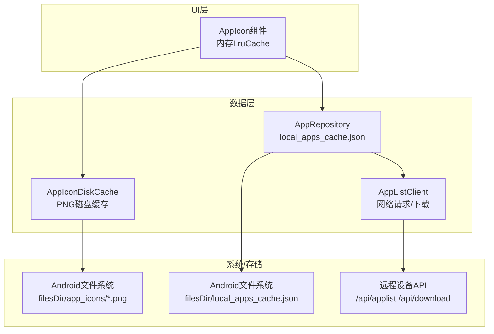
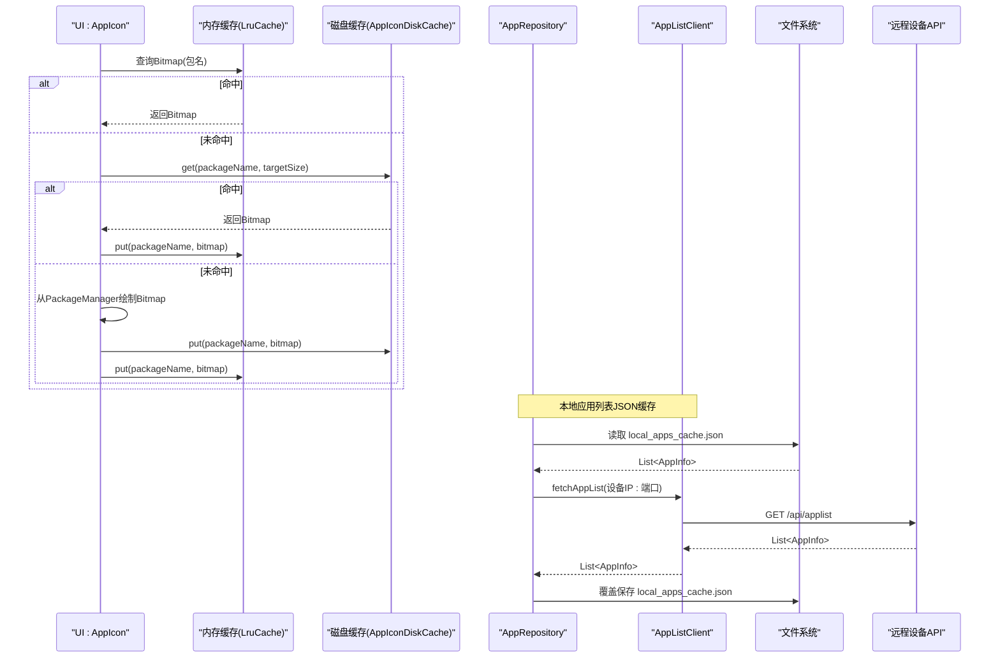
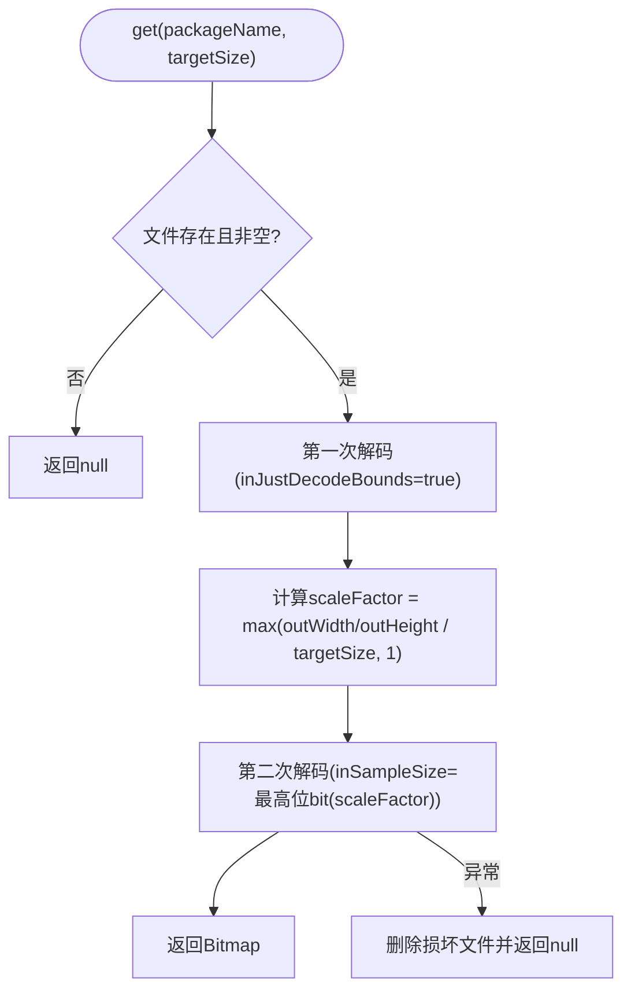
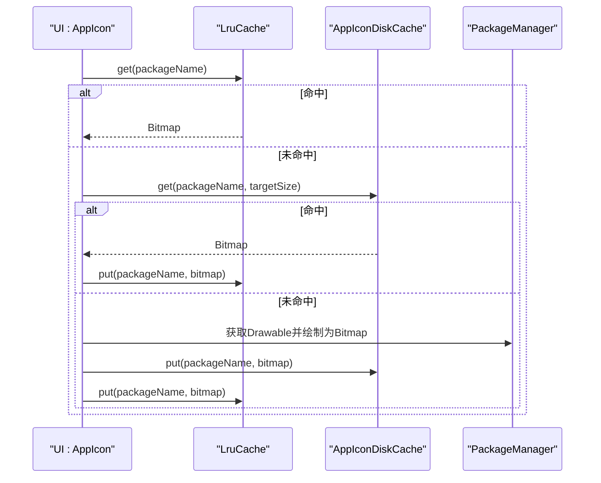
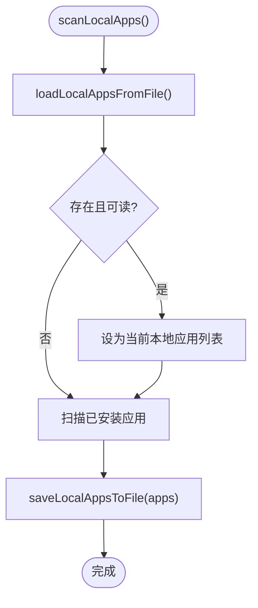
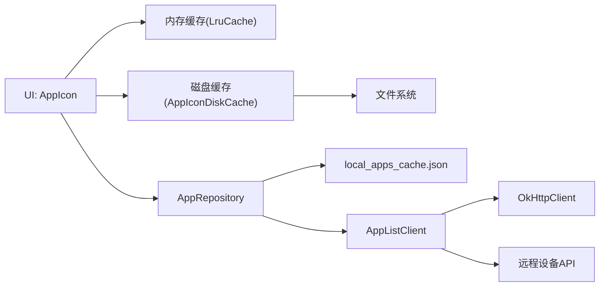

# 缓存策略设计

<cite>
**本文引用的文件**
- [AppIconDiskCache.kt](file://app/src/main/java/com/lansync/app/data/cache/AppIconDiskCache.kt)
- [AppIcon.kt](file://app/src/main/java/com/lansync/app/ui/components/AppIcon.kt)
- [AppRepository.kt](file://app/src/main/java/com/lansync/app/data/repository/AppRepository.kt)
- [AppListClient.kt](file://app/src/main/java/com/lansync/app/data/client/AppListClient.kt)
- [Models.kt](file://app/src/main/java/com/lansync/app/data/model/Models.kt)
- [AppConfig.kt](file://app/src/main/java/com/lansync/app/data/AppConfig.kt)
- [REPORT.md](file://REPORT.md)
</cite>

## 目录
1. [简介](#简介)
2. [项目结构](#项目结构)
3. [核心组件](#核心组件)
4. [架构总览](#架构总览)
5. [详细组件分析](#详细组件分析)
6. [依赖关系分析](#依赖关系分析)
7. [性能考量](#性能考量)
8. [故障排查指南](#故障排查指南)
9. [结论](#结论)
10. [附录](#附录)

## 简介
本文件聚焦LanSync应用的缓存策略设计，围绕多级缓存（内存、磁盘、网络）的层次结构与协作机制展开。重点解析：
- AppIconDiskCache的实现原理：缓存键生成、读取与写入流程、存储空间管理、失效清理。
- 本地应用列表JSON文件缓存机制：序列化配置、版本兼容性与读写路径。
- 缓存失效策略：手动刷新、自动更新、冲突解决。
- 性能优化建议：缓存预热、批量操作、内存使用监控与I/O优化。
- 提供关键流程图与可复用的测试思路，帮助定位与评估缓存行为。

## 项目结构
与缓存相关的代码主要分布在以下模块：
- 数据层缓存：AppIconDiskCache负责图标磁盘缓存；AppRepository负责本地应用列表JSON缓存与设备端数据同步。
- UI层缓存：AppIcon组件维护内存级Bitmap缓存，并触发磁盘缓存加载与预取。
- 网络层：AppListClient封装HTTP请求与下载，间接影响缓存命中与更新时机。
- 模型与配置：Models定义可序列化的数据结构；AppConfig提供心跳、重试等参数，间接影响缓存刷新频率。

图表来源
- [AppIcon.kt:32-69](file://app/src/main/java/com/lansync/app/ui/components/AppIcon.kt#L32-L69)
- [AppIconDiskCache.kt:11-84](file://app/src/main/java/com/lansync/app/data/cache/AppIconDiskCache.kt#L11-L84)
- [AppRepository.kt:66-68, 854-946:66-68](file://app/src/main/java/com/lansync/app/data/repository/AppRepository.kt#L66-L68)
- [AppListClient.kt:32-56](file://app/src/main/java/com/lansync/app/data/client/AppListClient.kt#L32-L56)

章节来源
- [AppIcon.kt:32-69](file://app/src/main/java/com/lansync/app/ui/components/AppIcon.kt#L32-L69)
- [AppIconDiskCache.kt:11-84](file://app/src/main/java/com/lansync/app/data/cache/AppIconDiskCache.kt#L11-L84)
- [AppRepository.kt:66-68, 854-946:66-68](file://app/src/main/java/com/lansync/app/data/repository/AppRepository.kt#L66-L68)
- [AppListClient.kt:32-56](file://app/src/main/java/com/lansync/app/data/client/AppListClient.kt#L32-L56)

## 核心组件
- 内存缓存（UI层）：基于LruCache的Bitmap缓存，按实际字节数估算占用，限制最大条目数，避免OOM。
- 磁盘缓存（数据层）：AppIconDiskCache以包名为键，将PNG文件持久化到filesDir/app_icons，支持批量写入、过期清理、容量统计。
- 本地JSON缓存（数据层）：AppRepository将本地应用列表序列化为JSON文件，启动时优先加载，扫描后覆盖保存。
- 网络缓存（间接）：通过心跳与定时同步拉取远端应用列表，结合重试与节流控制，减少无效网络访问。

章节来源
- [AppIcon.kt:32-69](file://app/src/main/java/com/lansync/app/ui/components/AppIcon.kt#L32-L69)
- [AppIconDiskCache.kt:19-84](file://app/src/main/java/com/lansync/app/data/cache/AppIconDiskCache.kt#L19-L84)
- [AppRepository.kt:66-68, 854-946:66-68](file://app/src/main/java/com/lansync/app/data/repository/AppRepository.kt#L66-L68)
- [AppListClient.kt:228-254](file://app/src/main/java/com/lansync/app/data/client/AppListClient.kt#L228-L254)

## 架构总览
下图展示从UI渲染到磁盘/网络的多级缓存协作流程，以及本地JSON缓存的读写路径。

图表来源
- [AppIcon.kt:42-69](file://app/src/main/java/com/lansync/app/ui/components/AppIcon.kt#L42-L69)
- [AppIconDiskCache.kt:19-49](file://app/src/main/java/com/lansync/app/data/cache/AppIconDiskCache.kt#L19-L49)
- [AppRepository.kt:854-946](file://app/src/main/java/com/lansync/app/data/repository/AppRepository.kt#L854-L946)
- [AppListClient.kt:228-254](file://app/src/main/java/com/lansync/app/data/client/AppListClient.kt#L228-L254)

## 详细组件分析

### AppIconDiskCache：磁盘缓存实现
- 缓存键生成：以包名为基础，经安全化处理（仅保留字母数字及有限符号），拼接为PNG文件名，确保跨平台兼容与文件系统安全。
- 读取流程：先检查文件存在与大小，再采用两次解码策略——首次获取尺寸计算缩放因子，第二次按inSampleSize解码目标尺寸，降低内存峰值。
- 写入流程：将Bitmap压缩为PNG（质量90）写入文件；提供批量写入接口用于批量图标落盘。
- 空间管理：提供删除单个、批量清理过期（依据有效包名集合）、清空全部、统计数量与总字节数等方法。
- 单例模式：通过伴生对象提供线程安全的实例获取。

图表来源
- [AppIconDiskCache.kt:19-39](file://app/src/main/java/com/lansync/app/data/cache/AppIconDiskCache.kt#L19-L39)
- [AppIconDiskCache.kt:80-84](file://app/src/main/java/com/lansync/app/data/cache/AppIconDiskCache.kt#L80-L84)

章节来源
- [AppIconDiskCache.kt:11-84](file://app/src/main/java/com/lansync/app/data/cache/AppIconDiskCache.kt#L11-L84)

### 内存缓存（UI层）：LruCache与预取
- LruCache配置：最大条目数固定，sizeOf按Bitmap实际分配字节估算，单位KB，避免过度占用内存。
- 加载顺序：先查内存，未命中则查磁盘，仍无则从系统PackageManager绘制并回写磁盘与内存。
- 预取能力：提供preloadIcon方法，在后台提前将常用图标绘制并写入内存与磁盘，提升首屏体验。

图表来源
- [AppIcon.kt:32-69](file://app/src/main/java/com/lansync/app/ui/components/AppIcon.kt#L32-L69)
- [AppIcon.kt:95-124](file://app/src/main/java/com/lansync/app/ui/components/AppIcon.kt#L95-L124)
- [AppIconDiskCache.kt:19-49](file://app/src/main/java/com/lansync/app/data/cache/AppIconDiskCache.kt#L19-L49)

章节来源
- [AppIcon.kt:32-69](file://app/src/main/java/com/lansync/app/ui/components/AppIcon.kt#L32-L69)
- [AppIcon.kt:95-124](file://app/src/main/java/com/lansync/app/ui/components/AppIcon.kt#L95-L124)

### 本地应用列表JSON缓存机制
- 存储位置：应用filesDir下的local_apps_cache.json。
- 序列化配置：使用kotlinx.serialization，开启忽略未知字段与宽松解析，保证向前/向后兼容。
- 读写流程：
  - 启动或扫描前尝试加载JSON，若存在则作为初始数据。
  - 扫描完成后覆盖保存最新列表。
  - 读取失败时删除损坏文件并返回空列表，避免脏数据。
- 版本兼容性：通过ignoreUnknownKeys与isLenient容忍新增/变更字段，保障不同版本间的数据互通。

图表来源
- [AppRepository.kt:854-946](file://app/src/main/java/com/lansync/app/data/repository/AppRepository.kt#L854-L946)

章节来源
- [AppRepository.kt:66-68, 854-946:66-68](file://app/src/main/java/com/lansync/app/data/repository/AppRepository.kt#L66-L68)
- [Models.kt:5-17](file://app/src/main/java/com/lansync/app/data/model/Models.kt#L5-L17)

### 网络层与缓存联动
- 心跳与定时同步：通过心跳检测设备存活，并按配置间隔触发应用列表刷新，减少重复网络请求。
- 重试与节流：连接建立后多次重试拉取远端应用列表；更新重算有节流时间窗，避免频繁计算。
- 下载校验：下载APK/APKS时使用MD5校验，失败则删除临时文件，确保缓存一致性。

章节来源
- [AppRepository.kt:134-172, 720-759, 761-796:134-172](file://app/src/main/java/com/lansync/app/data/repository/AppRepository.kt#L134-L172)
- [AppListClient.kt:32-56, 393-462:32-56](file://app/src/main/java/com/lansync/app/data/client/AppListClient.kt#L32-L56)

## 依赖关系分析
- UI层依赖内存缓存与磁盘缓存，形成两级加速。
- 数据层AppRepository协调本地JSON缓存与网络层AppListClient，驱动设备端数据同步。
- 网络层AppListClient对OkHttpClient进行连接池与超时配置，影响缓存命中率与响应速度。
- 配置项AppConfig影响心跳、同步、重试等行为，间接决定缓存更新频率。

图表来源
- [AppIcon.kt:32-69](file://app/src/main/java/com/lansync/app/ui/components/AppIcon.kt#L32-L69)
- [AppIconDiskCache.kt:11-84](file://app/src/main/java/com/lansync/app/data/cache/AppIconDiskCache.kt#L11-L84)
- [AppRepository.kt:66-68, 854-946:66-68](file://app/src/main/java/com/lansync/app/data/repository/AppRepository.kt#L66-L68)
- [AppListClient.kt:32-56](file://app/src/main/java/com/lansync/app/data/client/AppListClient.kt#L32-L56)

章节来源
- [AppIcon.kt:32-69](file://app/src/main/java/com/lansync/app/ui/components/AppIcon.kt#L32-L69)
- [AppIconDiskCache.kt:11-84](file://app/src/main/java/com/lansync/app/data/cache/AppIconDiskCache.kt#L11-L84)
- [AppRepository.kt:66-68, 854-946:66-68](file://app/src/main/java/com/lansync/app/data/repository/AppRepository.kt#L66-L68)
- [AppListClient.kt:32-56](file://app/src/main/java/com/lansync/app/data/client/AppListClient.kt#L32-L56)

## 性能考量
- 内存使用监控：
  - LruCache按Bitmap实际字节估算占用，限制最大条目数，防止OOM。
  - 可通过定期统计内存缓存命中率与磁盘缓存大小/字节数，评估缓存有效性。
- I/O优化：
  - 磁盘读取采用两次解码策略，显著降低内存峰值。
  - 批量写入icons减少文件句柄切换与锁竞争。
- 网络优化：
  - OkHttpClient连接池复用连接，降低握手开销。
  - 心跳与定时同步配合重试与节流，避免风暴式请求。
- 缓存预热：
  - 使用preloadIcon在后台预先加载常用图标至内存与磁盘，提升首屏渲染速度。
- 建议指标（可在测试中验证）：
  - 内存缓存命中率（目标>80%）。
  - 磁盘缓存命中率（目标>60%）。
  - 平均图标加载耗时（目标<50ms）。
  - JSON缓存读写耗时（目标<10ms）。
  - 网络请求成功率与平均延迟（目标>95%，<500ms）。

[本节为通用性能指导，不直接分析具体文件]

## 故障排查指南
- 图标加载失败：
  - 检查磁盘文件是否存在与大小是否为0；若读取异常会删除损坏文件。
  - 确认目标尺寸与缩放因子计算是否合理。
- JSON缓存损坏：
  - 读取异常时会删除损坏文件并返回空列表，需重新扫描生成。
- 网络连接问题：
  - 心跳失败计数达到阈值会标记超时；快速重连失败会记录日志。
  - 下载失败时MD5校验不通过会删除临时文件，需重试。
- 缓存不一致：
  - 卸载应用后应清理对应图标缓存；移除包名集合可用于批量清理过期图标。

章节来源
- [AppIconDiskCache.kt:19-39, 61-78:19-39](file://app/src/main/java/com/lansync/app/data/cache/AppIconDiskCache.kt#L19-L39)
- [AppRepository.kt:929-946](file://app/src/main/java/com/lansync/app/data/repository/AppRepository.kt#L929-L946)
- [AppListClient.kt:393-462](file://app/src/main/java/com/lansync/app/data/client/AppListClient.kt#L393-L462)

## 结论
LanSync采用“内存+磁盘+网络”的多级缓存架构，兼顾性能与可靠性：
- 内存缓存快速响应UI渲染需求，磁盘缓存提供持久化与跨进程共享能力，网络层通过心跳与重试保障数据新鲜度。
- AppIconDiskCache以包名为键，采用安全化命名与双次解码策略，提供完善的清理与统计能力。
- 本地JSON缓存通过宽松序列化配置保障版本兼容，并在扫描后及时覆盖更新。
- 通过预热、批量操作与连接池等手段，整体性能得到显著提升。
- 建议在后续迭代中引入更细粒度的过期策略（如TTL）与容量上限控制，进一步优化资源占用。

[本节为总结性内容，不直接分析具体文件]

## 附录
- 本地持久化/缓存清单（来自仓库文档）：
  - filesDir/local_apps_cache.json：最近一次应用的AppInfo列表，每次扫描覆盖。
  - filesDir/app_icons/*.png：图标磁盘缓存，随应用卸载清理。
  - cacheDir/downloads/*：已下载.apk/.apks，用户手动删除。
  - SharedPreferences("lansync_device")：device_instance_id（UUID），永久。
- 序列化要点：
  - JSON均启用ignoreUnknownKeys与isLenient，保证版本演进兼容。
  - sourcePaths为本机绝对路径，不应视为安全数据跨设备信任。

章节来源
- [REPORT.md:184-198](file://REPORT.md#L184-L198)