# 错误处理与恢复

<cite>
**本文引用的文件**
- [ConnectionManager.kt](file://app/src/main/java/com/lansync/app/data/connection/ConnectionManager.kt)
- [AppListClient.kt](file://app/src/main/java/com/lansync/app/data/client/AppListClient.kt)
- [KtorServer.kt](file://app/src/main/java/com/lansync/app/data/server/KtorServer.kt)
- [AppRepository.kt](file://app/src/main/java/com/lansync/app/data/repository/AppRepository.kt)
- [MainViewModel.kt](file://app/src/main/java/com/lansync/app/ui/viewmodel/MainViewModel.kt)
- [FileLogger.kt](file://app/src/main/java/com/lansync/app/data/FileLogger.kt)
- [Models.kt](file://app/src/main/java/com/lansync/app/data/model/Models.kt)
- [UpdateManager.kt](file://app/src/main/java/com/lansync/app/data/update/UpdateManager.kt)
- [ApkInstaller.kt](file://app/src/main/java/com/lansync/app/data/installer/ApkInstaller.kt)
</cite>

## 目录
1. [简介](#简介)
2. [项目结构](#项目结构)
3. [核心组件](#核心组件)
4. [架构总览](#架构总览)
5. [详细组件分析](#详细组件分析)
6. [依赖关系分析](#依赖关系分析)
7. [性能考量](#性能考量)
8. [故障排查指南](#故障排查指南)
9. [结论](#结论)
10. [附录：常见错误场景流程图](#附录：常见错误场景流程图)

## 简介
本文件系统性梳理 LanSync 应用的错误处理与恢复机制，覆盖网络请求的超时、重试与降级策略；设备连接异常的快速重连、优雅断开与状态回滚；异步操作的错误传播与用户界面反馈；日志记录系统的设计与调试信息收集；以及幂等性与数据一致性保护的最佳实践。文档以代码级为依据，提供可视化图表与可定位的文件路径，便于快速定位问题与优化。

## 项目结构
LanSync 的错误处理贯穿“客户端网络层（AppListClient）—服务端路由（KtorServer）—连接管理（ConnectionManager）—业务编排（AppRepository）—UI 状态（MainViewModel）—日志（FileLogger）”全链路。关键职责划分如下：
- AppListClient：封装 OkHttp 调用，统一超时、重试、下载校验与错误分类。
- KtorServer：定义 REST API，集中处理连接请求、状态轮询、应用包下载、断连通知等，并对异常进行结构化响应。
- ConnectionManager：维护待处理连接请求、超时任务、入站请求列表，支持自动超时拒绝。
- AppRepository：协调心跳检测、快速重连、同步调度、端口迁移、远程刷新、批量更新等，并对外暴露 StateFlow 状态。
- MainViewModel：将 Repository 的状态流组合为 UI 状态，捕获异常并展示给用户。
- FileLogger：线程安全、带轮转与备份的异步日志系统，支持多级别输出与 JSON 片段记录。
- Models：统一的连接状态枚举、设备与应用模型、连接请求/响应载荷等。

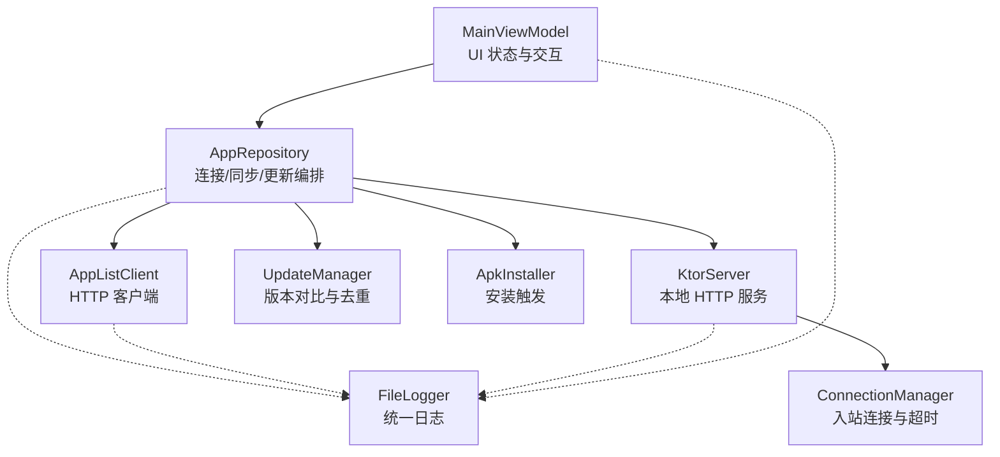

**图示来源**
- [AppRepository.kt:40-86](file://app/src/main/java/com/lansync/app/data/repository/AppRepository.kt#L40-L86)
- [AppListClient.kt:30-56](file://app/src/main/java/com/lansync/app/data/client/AppListClient.kt#L30-L56)
- [KtorServer.kt:30-63](file://app/src/main/java/com/lansync/app/data/server/KtorServer.kt#L30-L63)
- [ConnectionManager.kt:19-27](file://app/src/main/java/com/lansync/app/data/connection/ConnectionManager.kt#L19-L27)
- [UpdateManager.kt:12-35](file://app/src/main/java/com/lansync/app/data/update/UpdateManager.kt#L12-L35)
- [ApkInstaller.kt:10-45](file://app/src/main/java/com/lansync/app/data/installer/ApkInstaller.kt#L10-L45)
- [FileLogger.kt:19-44](file://app/src/main/java/com/lansync/app/data/FileLogger.kt#L19-L44)

**章节来源**
- [AppRepository.kt:40-86](file://app/src/main/java/com/lansync/app/data/repository/AppRepository.kt#L40-L86)
- [AppListClient.kt:30-56](file://app/src/main/java/com/lansync/app/data/client/AppListClient.kt#L30-L56)
- [KtorServer.kt:30-63](file://app/src/main/java/com/lansync/app/data/server/KtorServer.kt#L30-L63)
- [ConnectionManager.kt:19-27](file://app/src/main/java/com/lansync/app/data/connection/ConnectionManager.kt#L19-L27)
- [UpdateManager.kt:12-35](file://app/src/main/java/com/lansync/app/data/update/UpdateManager.kt#L12-L35)
- [ApkInstaller.kt:10-45](file://app/src/main/java/com/lansync/app/data/installer/ApkInstaller.kt#L10-L45)
- [FileLogger.kt:19-44](file://app/src/main/java/com/lansync/app/data/FileLogger.kt#L19-L44)

## 核心组件
- 网络请求错误处理策略
  - 超时控制：OkHttp 全局设置连接/读取/写入/调用超时；心跳 ping 使用短超时；连接状态轮询采用外部超时与间隔重试。
  - 重试机制：连接建立失败时通过轮询等待对方响应；应用列表获取在连接成功后最多重试若干次；下载过程具备 MD5 校验与失败返回。
  - 降级方案：无法拉取远端应用列表时保留已缓存列表；连接不稳定时进入 RECONNECTING；最终超时标记 CONNECTION_TIMEOUT。
- 设备连接异常处理流程
  - 快速重连：心跳连续失败达到阈值后尝试快速重连，成功则恢复 CONNECTED 并继续后台同步。
  - 优雅断开：主动断开时发送断连通知，保留应用列表并回退到 DISCONNECTED。
  - 状态回滚：端口迁移或远端主动断开会清理旧心跳/同步任务，迁移状态并保留应用列表。
- 异步操作错误传播与 UI 反馈
  - ViewModel 捕获 Repository 抛出的异常，设置 connectionError 或 operationMessage，并提供清除方法。
  - 批量更新/拉取会汇总失败项并以消息形式提示，不中断其他任务。
- 日志记录系统
  - 分级输出（DEBUG/INFO/WARN/ERROR），JSON 片段截断，异步写入，文件轮转与备份，支持关闭时落盘剩余条目。

**章节来源**
- [AppListClient.kt:30-56](file://app/src/main/java/com/lansync/app/data/client/AppListClient.kt#L30-L56)
- [AppListClient.kt:104-133](file://app/src/main/java/com/lansync/app/data/client/AppListClient.kt#L104-L133)
- [AppRepository.kt:179-269](file://app/src/main/java/com/lansync/app/data/repository/AppRepository.kt#L179-L269)
- [AppRepository.kt:590-622](file://app/src/main/java/com/lansync/app/data/repository/AppRepository.kt#L590-L622)
- [MainViewModel.kt:162-184](file://app/src/main/java/com/lansync/app/ui/viewmodel/MainViewModel.kt#L162-L184)
- [FileLogger.kt:90-119](file://app/src/main/java/com/lansync/app/data/FileLogger.kt#L90-L119)

## 架构总览
下图展示了从发起连接到建立心跳、同步应用列表、下载更新的完整错误处理与恢复路径。

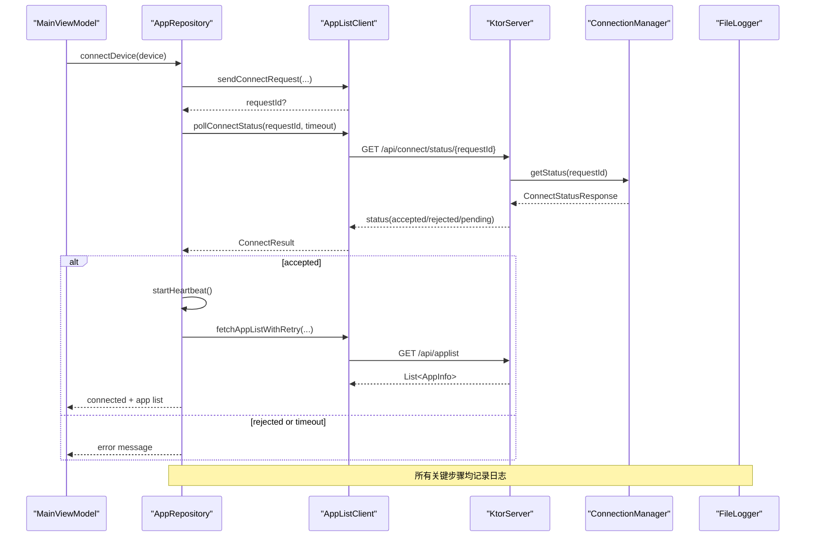

**图示来源**
- [AppRepository.kt:386-484](file://app/src/main/java/com/lansync/app/data/repository/AppRepository.kt#L386-L484)
- [AppListClient.kt:62-133](file://app/src/main/java/com/lansync/app/data/client/AppListClient.kt#L62-L133)
- [KtorServer.kt:88-148](file://app/src/main/java/com/lansync/app/data/server/KtorServer.kt#L88-L148)
- [ConnectionManager.kt:29-112](file://app/src/main/java/com/lansync/app/data/connection/ConnectionManager.kt#L29-L112)
- [FileLogger.kt:90-119](file://app/src/main/java/com/lansync/app/data/FileLogger.kt#L90-L119)

## 详细组件分析

### 网络连接与超时重试（AppListClient）
- 超时策略
  - 通用客户端：连接/读取/写入 15s，调用 30s；下载专用客户端：连接 30s，读写 120s，无调用超时。
  - 心跳 ping：动态构建短超时客户端，避免阻塞。
- 连接状态轮询
  - 基于外部超时与固定间隔轮询，解析 pending/accepted/rejected，未就绪则延迟重试直至超时。
- 下载与完整性校验
  - 支持指定版本或最新版本下载，写入缓存目录，计算实际 MD5 并与服务器头或期望值比对，不一致则删除文件并返回错误。
- 错误分类
  - 使用 sealed class 区分成功与错误，上层根据类型决定重试或提示。

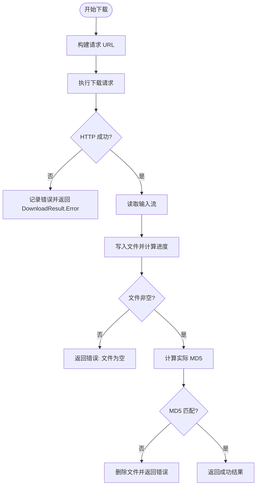

**图示来源**
- [AppListClient.kt:358-462](file://app/src/main/java/com/lansync/app/data/client/AppListClient.kt#L358-L462)

**章节来源**
- [AppListClient.kt:30-56](file://app/src/main/java/com/lansync/app/data/client/AppListClient.kt#L30-L56)
- [AppListClient.kt:104-133](file://app/src/main/java/com/lansync/app/data/client/AppListClient.kt#L104-L133)
- [AppListClient.kt:358-462](file://app/src/main/java/com/lansync/app/data/client/AppListClient.kt#L358-L462)

### 入站连接与超时拒绝（ConnectionManager）
- 接收请求
  - 生成唯一 ID，存入待处理 Map，启动超时任务，更新入站列表。
- 响应请求
  - 取消对应超时任务，更新状态（接受/拒绝），返回响应负载。
- 超时处理
  - 到达 REQUEST_TIMEOUT_MS 仍未处理，自动标记 TIMEOUT 并刷新列表。
- 清理
  - 移除请求时取消超时任务并从 Map 中删除。

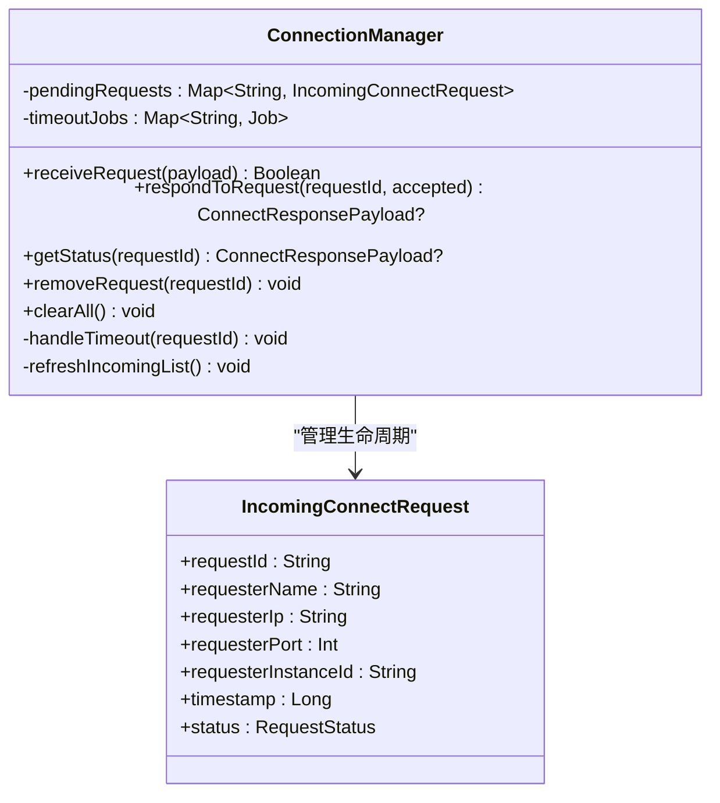

**图示来源**
- [ConnectionManager.kt:19-147](file://app/src/main/java/com/lansync/app/data/connection/ConnectionManager.kt#L19-L147)
- [Models.kt:87-101](file://app/src/main/java/com/lansync/app/data/model/Models.kt#L87-L101)

**章节来源**
- [ConnectionManager.kt:29-147](file://app/src/main/java/com/lansync/app/data/connection/ConnectionManager.kt#L29-L147)
- [Models.kt:87-101](file://app/src/main/java/com/lansync/app/data/model/Models.kt#L87-L101)

### 心跳检测与快速重连（AppRepository）
- 心跳循环
  - 周期性 ping 目标设备，成功则恢复 CONNECTED 并清空失败计数；失败则逐步升级状态至 RECONNECTING 并最终 CONNECTION_TIMEOUT。
- 快速重连
  - 达到重连阈值后尝试直接拉取设备信息，成功即恢复连接并继续后台同步。
- 同步调度
  - 独立协程周期刷新设备应用列表，异常被捕获并记录。

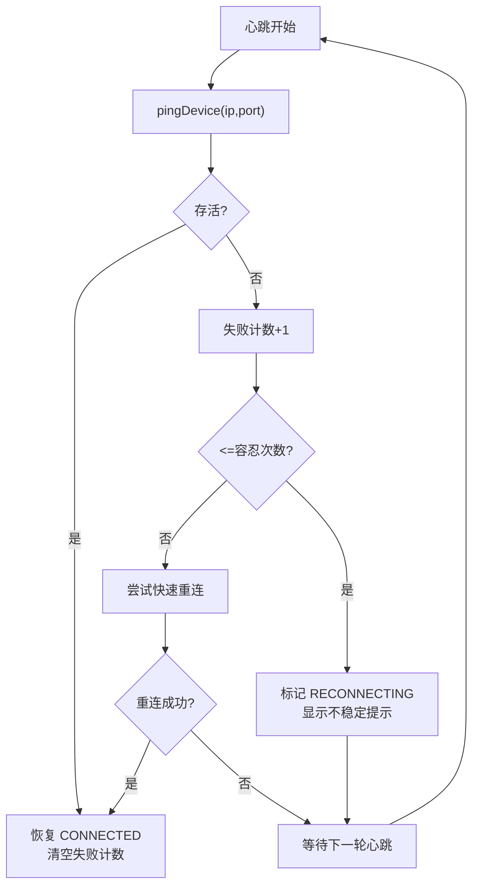

**图示来源**
- [AppRepository.kt:134-172](file://app/src/main/java/com/lansync/app/data/repository/AppRepository.kt#L134-L172)
- [AppRepository.kt:179-269](file://app/src/main/java/com/lansync/app/data/repository/AppRepository.kt#L179-L269)

**章节来源**
- [AppRepository.kt:134-172](file://app/src/main/java/com/lansync/app/data/repository/AppRepository.kt#L134-L172)
- [AppRepository.kt:179-269](file://app/src/main/java/com/lansync/app/data/repository/AppRepository.kt#L179-L269)

### 优雅断开与状态回滚（AppRepository）
- 优雅断开
  - 发送断连通知给远端，保留应用列表，将连接状态置为 DISCONNECTED。
- 端口迁移与状态回滚
  - 当发现设备端口变化但 identityKey 一致时，迁移连接状态与列表，重启心跳与同步任务，确保连续性。
- 远端主动断开
  - 收到远端断连回调后，停止心跳与同步，清理失败计数，保持应用列表以便后续重连。

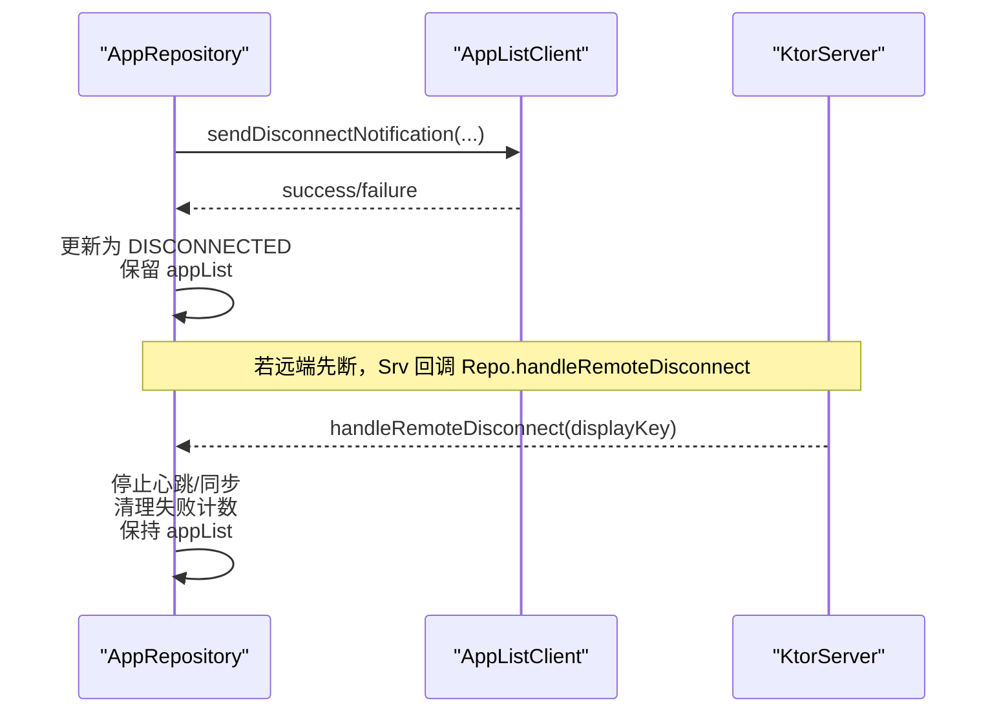

**图示来源**
- [AppRepository.kt:590-622](file://app/src/main/java/com/lansync/app/data/repository/AppRepository.kt#L590-L622)
- [AppRepository.kt:94-132](file://app/src/main/java/com/lansync/app/data/repository/AppRepository.kt#L94-L132)
- [KtorServer.kt:252-265](file://app/src/main/java/com/lansync/app/data/server/KtorServer.kt#L252-L265)

**章节来源**
- [AppRepository.kt:94-132](file://app/src/main/java/com/lansync/app/data/repository/AppRepository.kt#L94-L132)
- [AppRepository.kt:590-622](file://app/src/main/java/com/lansync/app/data/repository/AppRepository.kt#L590-L622)
- [KtorServer.kt:252-265](file://app/src/main/java/com/lansync/app/data/server/KtorServer.kt#L252-L265)

### 异步错误传播与 UI 反馈（MainViewModel）
- 连接错误
  - 捕获 Repository 异常，设置 connectionError，并提供清除接口。
- 批量更新/拉取
  - 逐个执行下载与安装，收集失败项，完成后以 operationMessage 汇总提示，不影响整体流程。
- 状态流组合
  - 将 Repository 的多路 StateFlow 合并为 UiState，保证 UI 与后端状态一致。

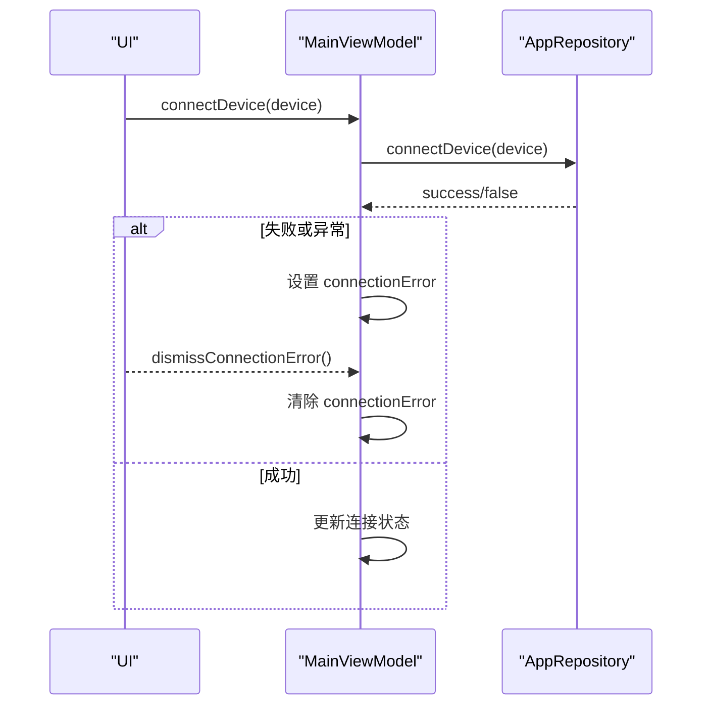

**图示来源**
- [MainViewModel.kt:162-184](file://app/src/main/java/com/lansync/app/ui/viewmodel/MainViewModel.kt#L162-L184)
- [MainViewModel.kt:245-274](file://app/src/main/java/com/lansync/app/ui/viewmodel/MainViewModel.kt#L245-L274)
- [MainViewModel.kt:363-397](file://app/src/main/java/com/lansync/app/ui/viewmodel/MainViewModel.kt#L363-L397)

**章节来源**
- [MainViewModel.kt:162-184](file://app/src/main/java/com/lansync/app/ui/viewmodel/MainViewModel.kt#L162-L184)
- [MainViewModel.kt:245-274](file://app/src/main/java/com/lansync/app/ui/viewmodel/MainViewModel.kt#L245-L274)
- [MainViewModel.kt:363-397](file://app/src/main/java/com/lansync/app/ui/viewmodel/MainViewModel.kt#L363-L397)

### 日志记录系统（FileLogger）
- 初始化与轮转
  - 首次初始化创建日志目录，按大小轮转并保留若干备份。
- 异步写入
  - 使用 Channel 与 Mutex 保证并发安全，后台协程消费并写入文件。
- 级别与格式
  - DEBUG/INFO/WARN/ERROR 四级，JSON 字段截断，异常堆栈前若干行附加。
- 关闭与兜底
  - shutdown 时清空通道剩余条目并持久化。

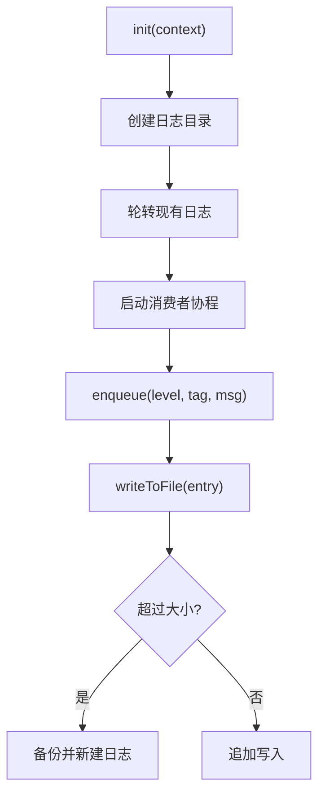

**图示来源**
- [FileLogger.kt:34-88](file://app/src/main/java/com/lansync/app/data/FileLogger.kt#L34-L88)
- [FileLogger.kt:90-119](file://app/src/main/java/com/lansync/app/data/FileLogger.kt#L90-L119)
- [FileLogger.kt:121-167](file://app/src/main/java/com/lansync/app/data/FileLogger.kt#L121-L167)

**章节来源**
- [FileLogger.kt:34-88](file://app/src/main/java/com/lansync/app/data/FileLogger.kt#L34-L88)
- [FileLogger.kt:90-119](file://app/src/main/java/com/lansync/app/data/FileLogger.kt#L90-L119)
- [FileLogger.kt:121-167](file://app/src/main/java/com/lansync/app/data/FileLogger.kt#L121-L167)

### 更新与安装（UpdateManager & ApkInstaller）
- 更新发现
  - 并行拉取各设备应用列表，比较版本，去重后得到可用更新。
- 安装触发
  - 通过 FileProvider 启动系统安装器，捕获无安装器或异常并返回错误。

**章节来源**
- [UpdateManager.kt:14-35](file://app/src/main/java/com/lansync/app/data/update/UpdateManager.kt#L14-L35)
- [UpdateManager.kt:72-102](file://app/src/main/java/com/lansync/app/data/update/UpdateManager.kt#L72-L102)
- [ApkInstaller.kt:12-45](file://app/src/main/java/com/lansync/app/data/installer/ApkInstaller.kt#L12-L45)

## 依赖关系分析
- 松耦合设计
  - AppRepository 通过接口化的 AppListClient、KtorServer、UpdateManager、ApkInstaller 协作，降低模块间耦合。
- 关键依赖链
  - 连接建立：Repo -> Client -> Server -> ConnectionManager
  - 心跳与同步：Repo 内部协程驱动 Client 与 Server 接口
  - 更新与安装：Repo -> UpdateManager -> Client -> Installer
- 潜在风险
  - 长耗时下载需关注内存与磁盘空间；大量并发心跳可能增加网络压力；日志过大需定期清理。

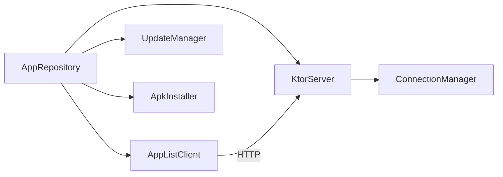

**图示来源**
- [AppRepository.kt:40-86](file://app/src/main/java/com/lansync/app/data/repository/AppRepository.kt#L40-L86)
- [AppListClient.kt:30-56](file://app/src/main/java/com/lansync/app/data/client/AppListClient.kt#L30-L56)
- [KtorServer.kt:30-63](file://app/src/main/java/com/lansync/app/data/server/KtorServer.kt#L30-L63)
- [ConnectionManager.kt:19-27](file://app/src/main/java/com/lansync/app/data/connection/ConnectionManager.kt#L19-L27)

**章节来源**
- [AppRepository.kt:40-86](file://app/src/main/java/com/lansync/app/data/repository/AppRepository.kt#L40-L86)
- [AppListClient.kt:30-56](file://app/src/main/java/com/lansync/app/data/client/AppListClient.kt#L30-L56)
- [KtorServer.kt:30-63](file://app/src/main/java/com/lansync/app/data/server/KtorServer.kt#L30-L63)
- [ConnectionManager.kt:19-27](file://app/src/main/java/com/lansync/app/data/connection/ConnectionManager.kt#L19-L27)

## 性能考量
- 网络层
  - 合理设置超时与连接池大小，避免频繁握手；下载专用客户端延长读写超时，提升大文件稳定性。
- 心跳与同步
  - 心跳间隔与容忍次数可调，避免过度重连造成拥塞；同步任务独立协程，异常隔离。
- 日志
  - 异步写入与文件轮转防止 I/O 阻塞主流程；限制堆栈长度减少日志体积。
- 下载
  - 分块读取与进度回调，避免一次性加载大文件；MD5 校验保障完整性。

[本节为通用指导，无需特定文件引用]

## 故障排查指南
- 常见问题定位
  - 连接失败：检查 sendConnectRequest 是否返回 null，查看 pollConnectStatus 超时日志。
  - 连接被拒：查看对方 respondToRequest 返回及 ConnectionManager 状态。
  - 下载失败：核对 HTTP 状态码、X-MD5 与实际 MD5 差异，确认文件是否为空。
  - 安装失败：确认系统安装器存在，检查 FileProvider 配置。
- 日志采集
  - 使用 FileLogger.getLogFilePath() 获取日志路径，结合 ERROR/WARN 级别筛选。
  - 对关键路径使用 json(tag, label, data) 记录结构化数据，便于分析。
- 恢复建议
  - 连接不稳定：等待心跳恢复或手动触发重连；必要时重启服务。
  - 下载损坏：删除缓存文件并重试；检查网络与存储权限。
  - 安装失败：提示用户重新选择安装包或检查系统设置。

**章节来源**
- [AppListClient.kt:62-133](file://app/src/main/java/com/lansync/app/data/client/AppListClient.kt#L62-L133)
- [AppListClient.kt:358-462](file://app/src/main/java/com/lansync/app/data/client/AppListClient.kt#L358-L462)
- [ApkInstaller.kt:12-45](file://app/src/main/java/com/lansync/app/data/installer/ApkInstaller.kt#L12-L45)
- [FileLogger.kt:141-167](file://app/src/main/java/com/lansync/app/data/FileLogger.kt#L141-L167)

## 结论
LanSync 构建了完善的错误处理与恢复体系：在网络层实现超时、重试与完整性校验；在连接层实现快速重连、优雅断开与状态回滚；在 UI 层提供友好的错误提示与恢复建议；在日志层提供稳定可靠的调试信息收集。通过模块化设计与清晰的错误分类，系统在复杂网络环境下具备较强的鲁棒性。

[本节为总结，无需特定文件引用]

## 附录：常见错误场景流程图

### 连接超时与重试
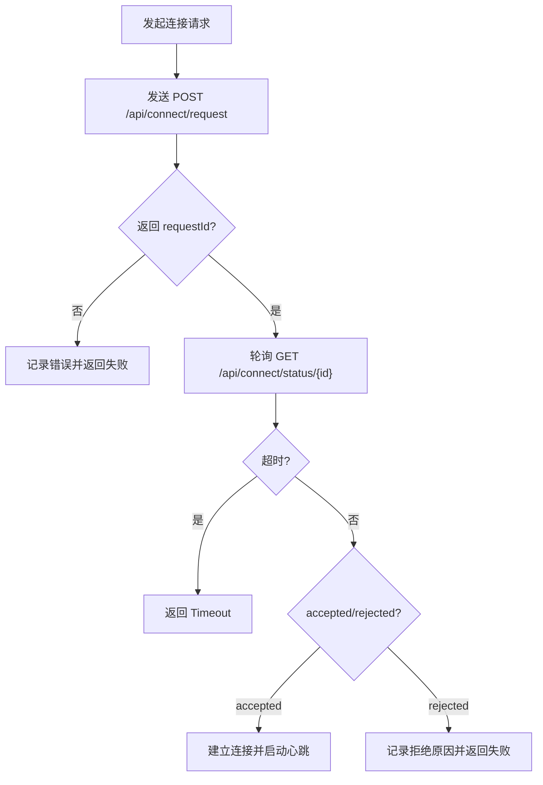

**图示来源**
- [AppListClient.kt:62-133](file://app/src/main/java/com/lansync/app/data/client/AppListClient.kt#L62-L133)
- [KtorServer.kt:88-148](file://app/src/main/java/com/lansync/app/data/server/KtorServer.kt#L88-L148)
- [ConnectionManager.kt:29-112](file://app/src/main/java/com/lansync/app/data/connection/ConnectionManager.kt#L29-L112)

### 下载失败与回滚
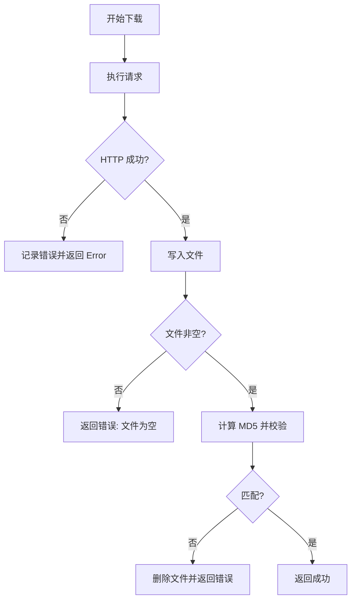

**图示来源**
- [AppListClient.kt:358-462](file://app/src/main/java/com/lansync/app/data/client/AppListClient.kt#L358-L462)