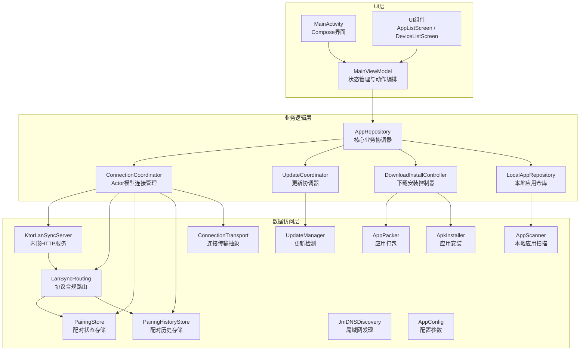
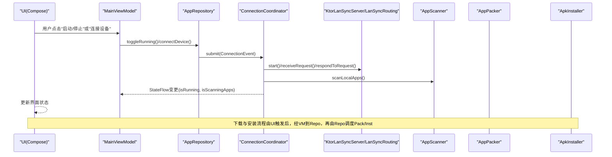
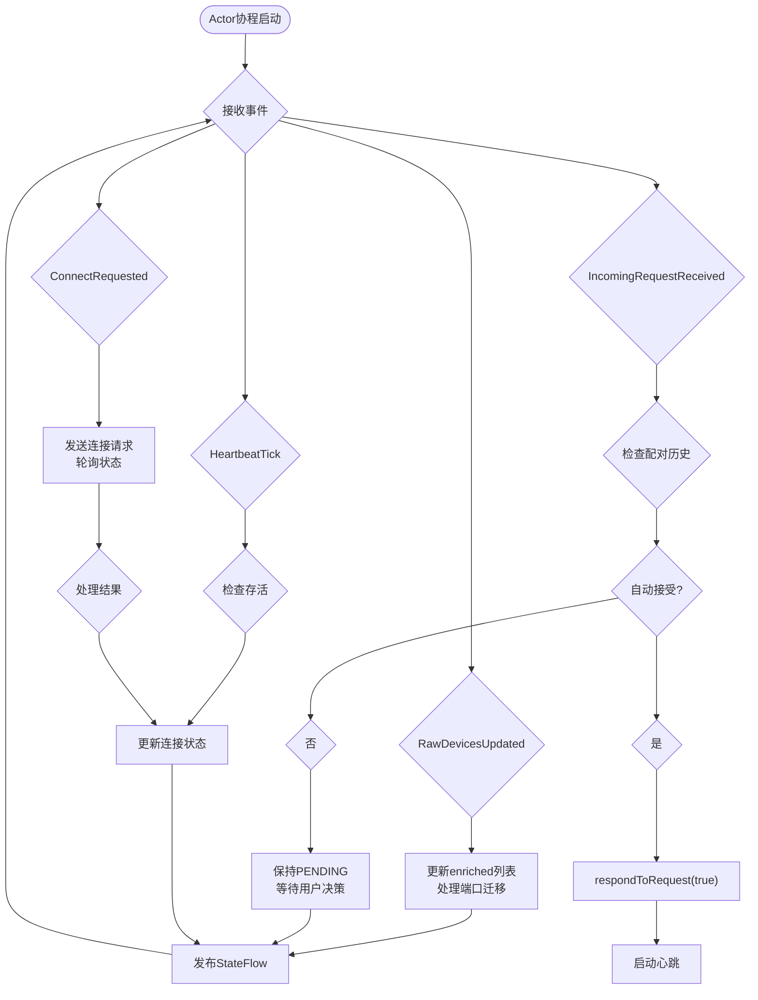
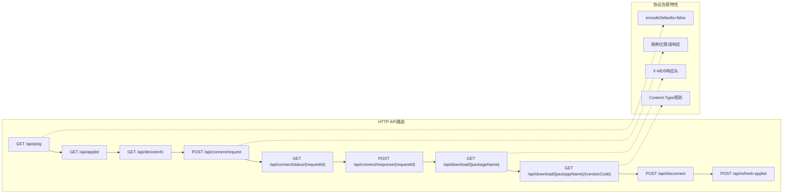
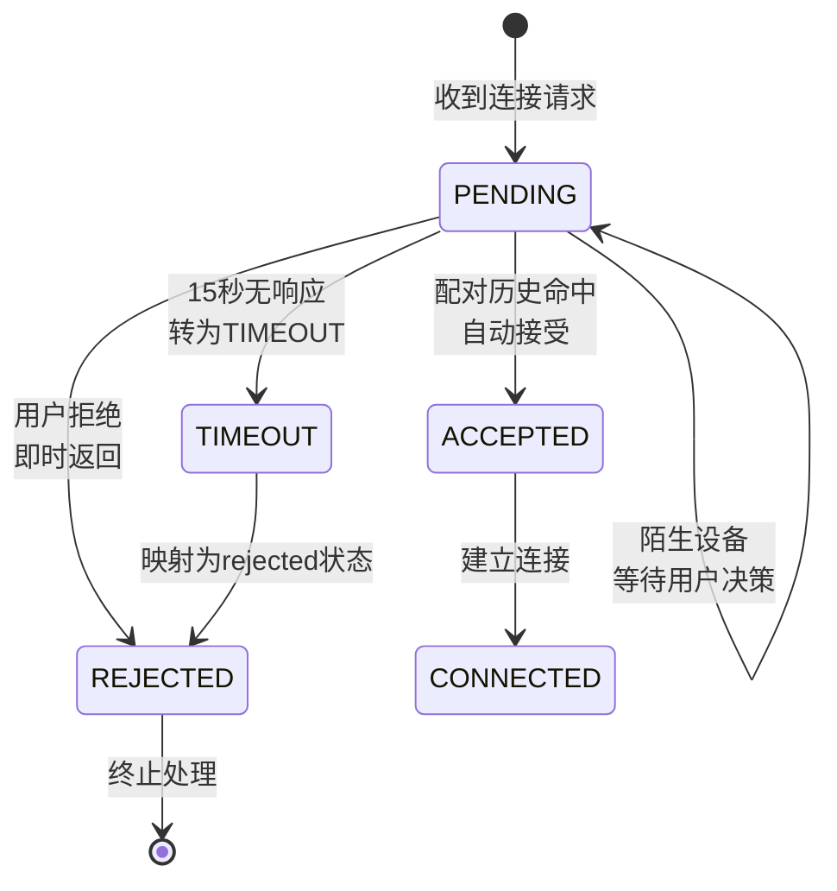

# 架构设计

<cite>
**本文引用的文件**
- [SPEC.md](file://docs/SPEC.md)
- [ARCHITECTURE.md](file://docs/ARCHITECTURE.md)
- [DefaultConnectionCoordinator.kt](file://app/src/main/java/com/lansync/app/data/connection/DefaultConnectionCoordinator.kt)
- [LanSyncRouting.kt](file://app/src/main/java/com/lansync/app/data/server/LanSyncRouting.kt)
- [KtorLanSyncServer.kt](file://app/src/main/java/com/lansync/app/data/server/KtorLanSyncServer.kt)
- [ServerContracts.kt](file://app/src/main/java/com/lansync/app/data/server/ServerContracts.kt)
- [PairingHistoryStore.kt](file://app/src/main/java/com/lansync/app/data/connection/PairingHistoryStore.kt)
- [InMemoryPairingStore.kt](file://app/src/main/java/com/lansync/app/data/server/InMemoryPairingStore.kt)
- [MainActivity.kt](file://app/src/main/java/com/lansync/app/MainActivity.kt)
- [MainViewModel.kt](file://app/src/main/java/com/lansync/app/ui/viewmodel/MainViewModel.kt)
- [AppRepository.kt](file://app/src/main/java/com/lansync/app/data/repository/AppRepository.kt)
- [Models.kt](file://app/src/main/java/com/lansync/app/data/model/Models.kt)
- [AppConfig.kt](file://app/src/main/java/com/lansync/app/data/AppConfig.kt)
- [LanSyncApplication.kt](file://app/src/main/java/com/lansync/app/LanSyncApplication.kt)
</cite>

## 更新摘要
**变更内容**
- 新增 Actor-based 连接协调器实现，消除并发竞态问题
- 完善协议合规性实现，包含完整的线上协议规范（615行）和目标架构设计（379行）
- 实现全面的服务器路由系统，支持10条HTTP API路由
- 引入配对历史存储机制，实现干净的反向连接接受策略
- 统一错误协议处理，消除异常信息泄露
- 增强状态管理机制，采用单一调度协程收敛所有状态变更

## 目录
1. [简介](#简介)
2. [项目结构](#项目结构)
3. [核心组件](#核心组件)
4. [架构总览](#架构总览)
5. [详细组件分析](#详细组件分析)
6. [依赖关系分析](#依赖关系分析)
7. [性能考量](#性能考量)
8. [故障排查指南](#故障排查指南)
9. [结论](#结论)
10. [附录](#附录)

## 简介
本架构设计文档面向LanSync应用，围绕MVVM架构模式与分层架构原则，系统阐述UI层、业务逻辑层与数据访问层的职责划分与协作方式。重点说明：
- **Actor-based连接协调器**：通过Channel事件模型消除并发竞态，实现单点状态收敛；
- **协议合规性实现**：严格遵循SPEC.md定义的615行线上协议规范，确保字节级兼容性；
- **全面服务器路由**：实现10条HTTP API路由，支持设备发现、连接管理、应用传输等完整功能；
- **配对历史存储**：实现干净的反向连接接受策略，修复旧实现的两个关键缺陷；
- **统一错误协议**：消除异常信息泄露，提供结构化的错误响应；
- AppRepository作为核心业务协调器，如何统一编排设备发现、连接管理、心跳保活、应用列表同步、更新检测与下载安装等能力；
- MainViewModel的状态管理机制，如何通过StateFlow组合与协程驱动UI状态；
- 数据层组件（网络、服务、扫描、打包、安装、配置）的协作关系；
- 响应式编程模式的应用（StateFlow、协程、combine）；
- 模块间依赖关系与数据流向，辅以架构图表帮助开发者理解整体设计思路。

## 项目结构
LanSync采用清晰的三层架构，现已升级为Actor-based并发模型：
- UI层：基于Jetpack Compose的界面与交互入口，通过MainViewModel暴露的UiState驱动渲染；
- 业务逻辑层：以AppRepository为核心，聚合设备发现、连接管理、网络通信、本地扫描、打包、安装、更新检测等能力；
- 数据访问层：封装HTTP客户端、本地存储、文件系统、JmDNS发现、Ktor内嵌服务等具体实现。

**图表来源**
- [DefaultConnectionCoordinator.kt:30-54](file://app/src/main/java/com/lansync/app/data/connection/DefaultConnectionCoordinator.kt#L30-L54)
- [LanSyncRouting.kt:49-253](file://app/src/main/java/com/lansync/app/data/server/LanSyncRouting.kt#L49-L253)
- [ServerContracts.kt:15-67](file://app/src/main/java/com/lansync/app/data/server/ServerContracts.kt#L15-L67)
- [PairingHistoryStore.kt:16-36](file://app/src/main/java/com/lansync/app/data/connection/PairingHistoryStore.kt#L16-L36)

**章节来源**
- [DefaultConnectionCoordinator.kt:30-54](file://app/src/main/java/com/lansync/app/data/connection/DefaultConnectionCoordinator.kt#L30-L54)
- [LanSyncRouting.kt:49-253](file://app/src/main/java/com/lansync/app/data/server/LanSyncRouting.kt#L49-L253)
- [ServerContracts.kt:15-67](file://app/src/main/java/com/lansync/app/data/server/ServerContracts.kt#L15-L67)

## 核心组件
- **DefaultConnectionCoordinator**：基于Actor模型的连接协调器，通过Channel事件队列实现单点状态收敛，消除并发竞态；
- **LanSyncRouting**：协议合规的路由模块，实现SPEC.md定义的10条HTTP API路由；
- **KtorLanSyncServer**：Ktor/Netty服务器实现，负责生命周期管理和端口分配；
- **ServerContracts**：定义HTTP API契约接口，解耦路由处理与服务器实现；
- **PairingHistoryStore**：配对历史存储，实现干净的反向连接接受策略；
- **InMemoryPairingStore**：配对状态存储的内存实现，支持虚拟时间测试；
- MainActivity：应用入口，使用Compose构建界面，订阅MainViewModel的UiState并触发用户操作；
- MainViewModel：维护UiState，组合多个StateFlow，提供连接、断开、刷新、批量更新、拉取远程应用等操作；
- AppRepository：单例协调器，持有设备发现、连接管理、网络客户端、本地扫描、打包、安装、更新检测等组件，统一管理状态流与后台任务；
- Models：定义AppInfo、DeviceInfo、UpdateInfo、SyncDiff、连接相关载荷等数据结构；
- AppConfig：集中配置心跳间隔、重试次数、超时时间等参数。

**章节来源**
- [DefaultConnectionCoordinator.kt:30-54](file://app/src/main/java/com/lansync/app/data/connection/DefaultConnectionCoordinator.kt#L30-L54)
- [LanSyncRouting.kt:49-253](file://app/src/main/java/com/lansync/app/data/server/LanSyncRouting.kt#L49-L253)
- [KtorLanSyncServer.kt:16-44](file://app/src/main/java/com/lansync/app/data/server/KtorLanSyncServer.kt#L16-L44)
- [ServerContracts.kt:15-67](file://app/src/main/java/com/lansync/app/data/server/ServerContracts.kt#L15-L67)
- [PairingHistoryStore.kt:16-36](file://app/src/main/java/com/lansync/app/data/connection/PairingHistoryStore.kt#L16-L36)
- [InMemoryPairingStore.kt:91-119](file://app/src/main/java/com/lansync/app/data/server/InMemoryPairingStore.kt#L91-L119)

## 架构总览
LanSync遵循MVVM与分层架构，现已升级为Actor-based并发模型：
- UI层（Activity + Compose）仅负责展示与事件转发，不直接访问数据层；
- ViewModel层（MainViewModel）聚合UI状态，调用Repository执行业务动作；
- Repository层（AppRepository）协调各数据组件，对外暴露StateFlow供UI观察；
- 协调层（ConnectionCoordinator等）采用Actor模型，通过Channel事件队列实现单点状态收敛；
- 数据层（KtorLanSyncServer、LanSyncRouting、ConnectionTransport等）完成具体I/O与计算。

**图表来源**
- [DefaultConnectionCoordinator.kt:78-86](file://app/src/main/java/com/lansync/app/data/connection/DefaultConnectionCoordinator.kt#L78-L86)
- [LanSyncRouting.kt:71-91](file://app/src/main/java/com/lansync/app/data/server/LanSyncRouting.kt#L71-L91)
- [KtorLanSyncServer.kt:24-33](file://app/src/main/java/com/lansync/app/data/server/KtorLanSyncServer.kt#L24-L33)

## 详细组件分析

### Actor-based连接协调器
**DefaultConnectionCoordinator**采用Actor模型实现连接管理，通过Channel事件队列消除并发竞态：

- **事件驱动架构**：所有状态变更通过`Channel<ConnectionEvent>`提交，由单一协程串行消费；
- **状态收敛**：所有可变状态（enriched、connected、pendingIncoming等）仅在Actor协程内访问；
- **协议合规**：严格遵循SPEC.md §7.4设备连接状态机、§7.5端口迁移、§7.6陈旧清理、§7.7反向连接语义；
- **并发安全**：消除旧实现中`ConcurrentHashMap`与`StateFlow`交错的竞态窗口；
- **可测试性**：支持虚拟时间测试，便于验证心跳、超时等时序逻辑。

**图表来源**
- [DefaultConnectionCoordinator.kt:58-80](file://app/src/main/java/com/lansync/app/data/connection/DefaultConnectionCoordinator.kt#L58-L80)
- [DefaultConnectionCoordinator.kt:111-173](file://app/src/main/java/com/lansync/app/data/connection/DefaultConnectionCoordinator.kt#L111-L173)
- [DefaultConnectionCoordinator.kt:322-368](file://app/src/main/java/com/lansync/app/data/connection/DefaultConnectionCoordinator.kt#L322-L368)

**章节来源**
- [DefaultConnectionCoordinator.kt:30-54](file://app/src/main/java/com/lansync/app/data/connection/DefaultConnectionCoordinator.kt#L30-L54)
- [DefaultConnectionCoordinator.kt:58-80](file://app/src/main/java/com/lansync/app/data/connection/DefaultConnectionCoordinator.kt#L58-L80)
- [DefaultConnectionCoordinator.kt:111-173](file://app/src/main/java/com/lansync/app/data/connection/DefaultConnectionCoordinator.kt#L111-L173)
- [DefaultConnectionCoordinator.kt:322-368](file://app/src/main/java/com/lansync/app/data/connection/DefaultConnectionCoordinator.kt#L322-L368)

### 协议合规的服务器路由
**LanSyncRouting**实现SPEC.md定义的10条HTTP API路由，确保字节级协议兼容：

- **JSON配置**：严格遵循SPEC §1.2的Json配置（prettyPrint=true、isLenient=true、ignoreUnknownKeys=true）；
- **路由实现**：完整实现ping、applist、deviceinfo、connect/request、connect/status、connect/response、download、disconnect、refresh-applist等10条路由；
- **错误处理**：统一使用`LanSyncErrorDto`结构化错误响应，消除异常信息泄露；
- **下载协议**：实现SPEC §5.1的三响应头（X-MD5、X-File-Size、Content-Disposition）；
- **Content-Type**：严格遵循SPEC §4的Content-Type规则。

**图表来源**
- [LanSyncRouting.kt:52-253](file://app/src/main/java/com/lansync/app/data/server/LanSyncRouting.kt#L52-L253)
- [LanSyncRouting.kt:261-299](file://app/src/main/java/com/lansync/app/data/server/LanSyncRouting.kt#L261-L299)

**章节来源**
- [LanSyncRouting.kt:49-253](file://app/src/main/java/com/lansync/app/data/server/LanSyncRouting.kt#L49-L253)
- [LanSyncRouting.kt:261-299](file://app/src/main/java/com/lansync/app/data/server/LanSyncRouting.kt#L261-L299)

### 配对历史存储机制
**PairingHistoryStore**实现SPEC §7.7的干净反向连接接受策略：

- **历史配对判断**：仅对「历史配对成功过」的设备自动接受，取代旧的「当前discovered/connected列表即视为已知」的错误语义；
- **陌生设备处理**：不在配对历史中的设备收到请求时保持PENDING状态，驱动UI弹窗，绝不自动放行；
- **即时拒绝**：用户显式拒绝时立即回REJECTED状态，不再走removeRequest导致发起方30秒超时；
- **持久化支持**：Phase 4将替换为SharedPreferences持久化实现，当前提供内存实现用于测试。

**图表来源**
- [PairingHistoryStore.kt:16-36](file://app/src/main/java/com/lansync/app/data/connection/PairingHistoryStore.kt#L16-L36)
- [DefaultConnectionCoordinator.kt:322-368](file://app/src/main/java/com/lansync/app/data/connection/DefaultConnectionCoordinator.kt#L322-L368)

**章节来源**
- [PairingHistoryStore.kt:16-36](file://app/src/main/java/com/lansync/app/data/connection/PairingHistoryStore.kt#L16-L36)
- [DefaultConnectionCoordinator.kt:322-368](file://app/src/main/java/com/lansync/app/data/connection/DefaultConnectionCoordinator.kt#L322-L368)

### MVVM与分层架构实现
- **UI层**：MainActivity通过viewModel()获取MainViewModel实例，collectAsState收集UiState，将状态传递给各Composable组件；
- **ViewModel层**：MainViewModel组合多个StateFlow，封装UiState并提供动作方法（如toggleRunning、connectDevice、startBatchUpdate等）；
- **Repository层**：AppRepository暴露StateFlow集合，内部使用协程与定时器进行心跳、同步、更新检测等异步任务；
- **协调层**：ConnectionCoordinator采用Actor模型，通过Channel事件队列实现单点状态收敛；
- **数据层**：KtorLanSyncServer提供HTTP接口，LanSyncRouting实现协议合规路由，ConnectionTransport抽象网络连接。

**章节来源**
- [MainActivity.kt:26-106](file://app/src/main/java/com/lansync/app/MainActivity.kt#L26-L106)
- [MainViewModel.kt:22-45](file://app/src/main/java/com/lansync/app/ui/viewmodel/MainViewModel.kt#L22-L45)
- [AppRepository.kt:40-80](file://app/src/main/java/com/lansync/app/data/repository/AppRepository.kt#L40-L80)
- [DefaultConnectionCoordinator.kt:30-54](file://app/src/main/java/com/lansync/app/data/connection/DefaultConnectionCoordinator.kt#L30-L54)

### AppRepository：核心业务协调器
- **职责**：统一协调设备发现、连接管理、心跳保活、应用列表同步、更新检测、下载与安装；
- **状态管理**：通过MutableStateFlow暴露localApps、discoveredDevices、connectedDevices、availableUpdates、syncDiffs、serverPort、isRunning、isScanningApps、downloadProgress、installStatus、incomingRequests等；
- **关键流程**：
  - 自动启动：根据是否有本地应用缓存决定是否先扫描再启动服务；
  - 连接流程：发送连接请求、轮询状态、成功后建立心跳与定时同步；
  - 心跳与重连：按配置周期性ping，失败计数控制状态迁移（RECONNECTING/CONNECTION_TIMEOUT）；
  - 端口迁移：当设备instanceId不变但端口变化时，保持已连接设备的appList并迁移心跳；
  - 更新检测：结合本地应用与已连接设备的应用列表，计算可用更新与同步差异；
  - 下载与安装：通过KtorServer提供的下载接口获取包，交由ApkInstaller安装。

**章节来源**
- [AppRepository.kt:40-80](file://app/src/main/java/com/lansync/app/data/repository/AppRepository.kt#L40-L80)
- [AppRepository.kt:284-375](file://app/src/main/java/com/lansync/app/data/repository/AppRepository.kt#L284-L375)
- [AppRepository.kt:386-484](file://app/src/main/java/com/lansync/app/data/repository/AppRepository.kt#L386-L484)
- [AppRepository.kt:134-249](file://app/src/main/java/com/lansync/app/data/repository/AppRepository.kt#L134-L249)
- [AppRepository.kt:761-795](file://app/src/main/java/com/lansync/app/data/repository/AppRepository.kt#L761-L795)

### MainViewModel：状态管理机制
- **UiState**：集中保存UI所需的全部状态字段，包括本地应用、设备列表、更新信息、选择状态、运行状态、下载进度、安装状态、服务端端口、操作消息、入站请求、下载文件等；
- **状态组合**：通过combine合并多个StateFlow，避免重复订阅与过度重组；
- **动作封装**：将用户操作（启动/停止、连接/断开、刷新、批量更新、拉取远程应用）封装为协程方法，确保线程安全与异常处理；
- **自动启动**：首次进入若无缓存则先扫描本地应用，再启动服务；否则直接启动服务并扫描。

**章节来源**
- [MainViewModel.kt:22-45](file://app/src/main/java/com/lansync/app/ui/viewmodel/MainViewModel.kt#L22-L45)
- [MainViewModel.kt:84-124](file://app/src/main/java/com/lansync/app/ui/viewmodel/MainViewModel.kt#L84-L124)
- [MainViewModel.kt:126-180](file://app/src/main/java/com/lansync/app/ui/viewmodel/MainViewModel.kt#L126-L180)

### 数据层组件协作关系
- **KtorLanSyncServer**：提供HTTP接口，接收连接请求、返回应用列表、下载应用包、处理断开通知与刷新应用列表；
- **LanSyncRouting**：实现协议合规的路由处理，严格遵循SPEC.md定义的10条API路由；
- **PairingStore**：管理配对请求的生命周期（接收、超时、接受/拒绝），并通过StateFlow暴露待处理请求列表；
- **PairingHistoryStore**：记录历史配对成功的设备实例ID，实现干净的反向连接接受策略；
- **ConnectionTransport**：抽象网络连接操作，支持发送连接请求、轮询状态、获取应用列表等；
- **AppScanner**：扫描本地已安装应用，生成AppInfo列表；
- **AppPacker**：将可提取的应用打包为ZIP或APK，供下载；
- **ApkInstaller**：执行应用安装，返回安装结果；
- **JmDNSDiscovery**：发现局域网内其他LanSync设备，提供设备信息与实例ID；
- **UpdateManager**：比较本地与远程应用版本，计算可用更新与同步差异；
- **AppConfig**：集中配置心跳间隔、重试次数、超时等参数。

**章节来源**
- [ServerContracts.kt:15-67](file://app/src/main/java/com/lansync/app/data/server/ServerContracts.kt#L15-L67)
- [LanSyncRouting.kt:49-253](file://app/src/main/java/com/lansync/app/data/server/LanSyncRouting.kt#L49-L253)
- [InMemoryPairingStore.kt:91-119](file://app/src/main/java/com/lansync/app/data/server/InMemoryPairingStore.kt#L91-L119)
- [PairingHistoryStore.kt:16-36](file://app/src/main/java/com/lansync/app/data/connection/PairingHistoryStore.kt#L16-L36)

### 响应式编程模式的使用
- **StateFlow**：Repository与ViewModel中广泛使用StateFlow暴露状态，UI通过collectAsState订阅；
- **协程**：所有耗时操作（网络请求、扫描、打包、安装、心跳、定时同步）均在协程中执行，使用SupervisorJob隔离异常；
- **combine**：ViewModel中使用combine组合多个StateFlow，减少重复订阅与状态不一致问题；
- **延迟与重试**：心跳与同步使用delay实现周期性任务，连接与应用列表获取支持重试机制；
- **Actor模型**：ConnectionCoordinator使用Channel+单协程实现事件驱动的响应式架构。

**章节来源**
- [MainViewModel.kt:84-124](file://app/src/main/java/com/lansync/app/ui/viewmodel/MainViewModel.kt#L84-L124)
- [DefaultConnectionCoordinator.kt:58-80](file://app/src/main/java/com/lansync/app/data/connection/DefaultConnectionCoordinator.kt#L58-L80)
- [AppRepository.kt:134-172](file://app/src/main/java/com/lansync/app/data/repository/AppRepository.kt#L134-L172)
- [AppRepository.kt:720-759](file://app/src/main/java/com/lansync/app/data/repository/AppRepository.kt#L720-L759)

### UI层、业务逻辑层与数据访问层的交互模式
- **UI层**：MainActivity与Compose组件仅消费UiState，不直接访问Repository；
- **业务逻辑层**：MainViewModel封装用户动作，调用Repository的方法；
- **协调层**：ConnectionCoordinator采用Actor模型，通过Channel事件队列处理连接管理；
- **数据访问层**：Repository协调各组件完成具体I/O与计算，并将结果通过StateFlow回传至ViewModel与UI；
- **数据流向**：UI -> ViewModel -> Repository -> Coordinator -> 数据组件 -> StateFlow -> ViewModel -> UI。

**章节来源**
- [MainActivity.kt:39-106](file://app/src/main/java/com/lansync/app/MainActivity.kt#L39-L106)
- [MainViewModel.kt:126-180](file://app/src/main/java/com/lansync/app/ui/viewmodel/MainViewModel.kt#L126-L180)
- [DefaultConnectionCoordinator.kt:78-86](file://app/src/main/java/com/lansync/app/data/connection/DefaultConnectionCoordinator.kt#L78-L86)

## 依赖关系分析
- **耦合度**：
  - UI层对ViewModel低耦合，仅依赖UiState与动作方法；
  - ViewModel对Repository低耦合，仅依赖其公开方法与StateFlow；
  - Repository对协调层低耦合，通过接口抽象连接管理；
  - 协调层对数据组件高内聚，通过Actor模型降低耦合；
- **循环依赖**：未发现循环依赖，依赖方向清晰（UI -> VM -> Repo -> Coordinator -> Data）；
- **外部依赖**：Ktor、JmDNS、Android系统API（文件、权限、安装）；
- **接口契约**：
  - LanSyncServer提供HTTP接口契约；
  - ServerApiDelegate提供路由处理器契约；
  - PairingStore提供配对状态存储契约；
  - ConnectionTransport提供连接传输契约。

**章节来源**
- [ServerContracts.kt:15-67](file://app/src/main/java/com/lansync/app/data/server/ServerContracts.kt#L15-L67)
- [DefaultConnectionCoordinator.kt:30-54](file://app/src/main/java/com/lansync/app/data/connection/DefaultConnectionCoordinator.kt#L30-L54)

## 性能考量
- **Actor模型**：通过Channel事件队列实现单点状态收敛，消除并发竞态，提升性能；
- **心跳与同步**：通过配置项控制心跳间隔与同步频率，避免频繁网络请求；
- **重试机制**：连接与应用列表获取支持重试，提升稳定性；
- **状态组合**：使用combine减少重复订阅与重组；
- **资源管理**：使用SupervisorJob隔离异常，避免级联失败；
- **文件传输**：KtorLanSyncServer分块读取文件并设置MD5与大小头，便于校验与进度显示；
- **内存优化**：Actor协程内使用局部变量管理状态，减少全局状态共享。

## 故障排查指南
- **连接失败**：检查KtorLanSyncServer是否启动、PairingStore是否就绪、目标设备是否响应；
- **心跳超时**：查看心跳失败计数与状态迁移（RECONNECTING/CONNECTION_TIMEOUT），确认网络连通性；
- **端口迁移**：当设备instanceId不变但端口变化时，确认心跳与同步是否迁移到新端口；
- **下载失败**：检查KtorLanSyncServer下载接口是否返回有效包、X-MD5是否匹配；
- **安装失败**：查看ApkInstaller返回的安装结果，确认权限与包名是否正确；
- **Actor阻塞**：检查ConnectionCoordinator的Channel是否阻塞，确认事件处理是否正常；
- **配对历史**：检查PairingHistoryStore是否正确记录配对历史，确认自动接受策略是否生效。

**章节来源**
- [DefaultConnectionCoordinator.kt:254-301](file://app/src/main/java/com/lansync/app/data/connection/DefaultConnectionCoordinator.kt#L254-L301)
- [LanSyncRouting.kt:261-299](file://app/src/main/java/com/lansync/app/data/server/LanSyncRouting.kt#L261-L299)
- [InMemoryPairingStore.kt:91-119](file://app/src/main/java/com/lansync/app/data/server/InMemoryPairingStore.kt#L91-L119)

## 结论
LanSync采用清晰的MVVM与分层架构，现已升级为Actor-based并发模型。DefaultConnectionCoordinator通过Channel事件队列实现单点状态收敛，消除并发竞态问题；LanSyncRouting严格遵循SPEC.md定义的协议规范，确保字节级兼容性；PairingHistoryStore实现干净的反向连接接受策略，修复旧实现的关键缺陷。该设计具备良好的可扩展性与可维护性，适合在局域网设备协同场景下持续演进。

## 附录
- **协议规范**：SPEC.md定义了615行的完整线上协议规范，涵盖JSON序列化、HTTP API、文件传输、连接状态机等全部细节；
- **架构设计**：ARCHITECTURE.md定义了379行的目标架构设计，包含模块拆分、依赖注入、并发规范等；
- **配置项**：AppConfig集中管理心跳间隔、重试次数、超时等参数；
- **数据模型**：Models.kt定义应用、设备、连接载荷等数据结构；
- **UI组件**：AppListScreen与DeviceListScreen提供丰富的界面交互。

**章节来源**
- [SPEC.md:1-616](file://docs/SPEC.md#L1-L616)
- [ARCHITECTURE.md:1-380](file://docs/ARCHITECTURE.md#L1-L380)
- [AppConfig.kt:3-18](file://app/src/main/java/com/lansync/app/data/AppConfig.kt#L3-L18)
- [Models.kt:5-138](file://app/src/main/java/com/lansync/app/data/model/Models.kt#L5-L138)