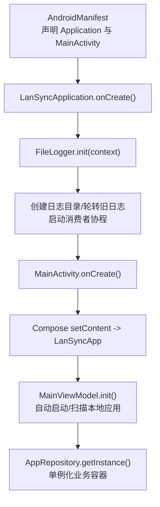
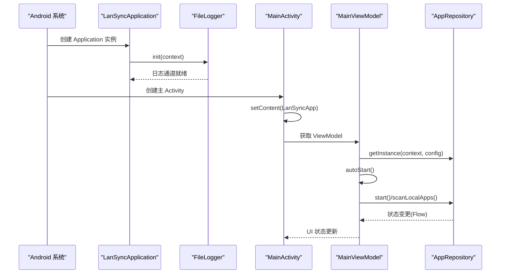
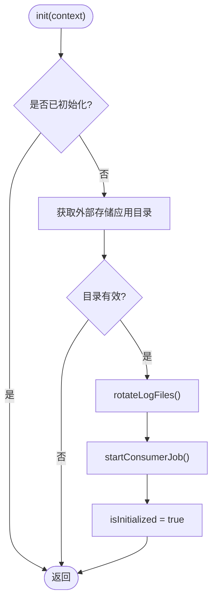
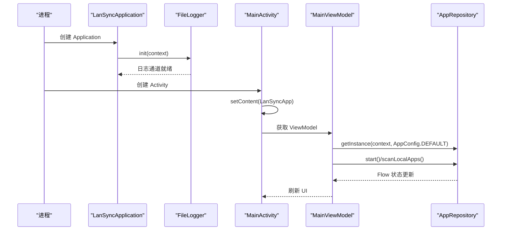
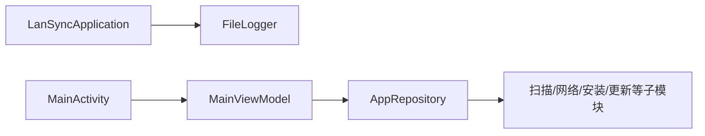

# 应用初始化流程

<cite>
**本文引用的文件**
- [LanSyncApplication.kt](file://app/src/main/java/com/lansync/app/LanSyncApplication.kt)
- [FileLogger.kt](file://app/src/main/java/com/lansync/app/data/FileLogger.kt)
- [MainActivity.kt](file://app/src/main/java/com/lansync/app/MainActivity.kt)
- [AndroidManifest.xml](file://app/src/main/AndroidManifest.xml)
- [AppConfig.kt](file://app/src/main/java/com/lansync/app/data/AppConfig.kt)
- [AppRepository.kt](file://app/src/main/java/com/lansync/app/data/repository/AppRepository.kt)
- [build.gradle.kts（模块）](file://app/build.gradle.kts)
</cite>

## 目录
1. [简介](#简介)
2. [项目结构](#项目结构)
3. [核心组件](#核心组件)
4. [架构总览](#架构总览)
5. [详细组件分析](#详细组件分析)
6. [依赖关系分析](#依赖关系分析)
7. [性能考虑](#性能考虑)
8. [故障排查指南](#故障排查指南)
9. [结论](#结论)

## 简介
本文聚焦 LanSync 应用的启动与初始化流程，围绕 Android Application 生命周期、日志系统 FileLogger 的初始化、全局资源加载策略以及依赖注入容器的启动过程进行系统化说明。文档提供从进程启动到 UI 就绪的关键时序图、流程图，并给出常见问题的定位方法与性能优化建议，帮助读者快速掌握应用初始化的关键路径与最佳实践。

## 项目结构
- 应用入口：在 AndroidManifest.xml 中声明了自定义 Application 类与主 Activity。
- 应用级初始化：LanSyncApplication 在 onCreate 中完成基础能力初始化（当前为日志系统）。
- 日志系统：FileLogger 负责日志落盘、轮转与异步写入。
- 业务层：AppRepository 作为核心业务聚合点，持有网络、扫描、安装等子模块；通过单例模式提供全局访问。
- UI 层：MainActivity 使用 Compose 构建界面，并在 ViewModel 中触发业务启动逻辑。

图表来源
- [AndroidManifest.xml:28-46](file://app/src/main/AndroidManifest.xml#L28-L46)
- [LanSyncApplication.kt:6-10](file://app/src/main/java/com/lansync/app/LanSyncApplication.kt#L6-L10)
- [FileLogger.kt:34-44](file://app/src/main/java/com/lansync/app/data/FileLogger.kt#L34-L44)
- [MainActivity.kt:26-34](file://app/src/main/java/com/lansync/app/MainActivity.kt#L26-L34)
- [AppRepository.kt:1175-1179](file://app/src/main/java/com/lansync/app/data/repository/AppRepository.kt#L1175-L1179)

章节来源
- [AndroidManifest.xml:28-46](file://app/src/main/AndroidManifest.xml#L28-L46)
- [LanSyncApplication.kt:6-10](file://app/src/main/java/com/lansync/app/LanSyncApplication.kt#L6-L10)
- [MainActivity.kt:26-34](file://app/src/main/java/com/lansync/app/MainActivity.kt#L26-L34)

## 核心组件
- LanSyncApplication：应用级入口，负责在 Application.onCreate 中执行全局初始化。
- FileLogger：线程安全的异步日志器，支持日志轮转、限流与优雅关闭。
- AppRepository：业务聚合中心，封装设备发现、应用扫描、更新检查、文件下载与安装等能力，并通过单例对外暴露。
- MainActivity + MainViewModel：UI 与状态管理入口，驱动业务启动与用户交互。

章节来源
- [LanSyncApplication.kt:6-10](file://app/src/main/java/com/lansync/app/LanSyncApplication.kt#L6-L10)
- [FileLogger.kt:19-44](file://app/src/main/java/com/lansync/app/data/FileLogger.kt#L19-L44)
- [AppRepository.kt:40-51](file://app/src/main/java/com/lansync/app/data/repository/AppRepository.kt#L40-L51)
- [MainActivity.kt:26-34](file://app/src/main/java/com/lansync/app/MainActivity.kt#L26-L34)

## 架构总览
下图展示了从进程启动到 UI 可交互的完整链路，包括 Application 初始化、日志系统准备、Activity 创建、Compose 渲染与 ViewModel 驱动的自动启动流程。

图表来源
- [LanSyncApplication.kt:6-10](file://app/src/main/java/com/lansync/app/LanSyncApplication.kt#L6-L10)
- [FileLogger.kt:34-44](file://app/src/main/java/com/lansync/app/data/FileLogger.kt#L34-L44)
- [MainActivity.kt:26-34](file://app/src/main/java/com/lansync/app/MainActivity.kt#L26-L34)
- [AppRepository.kt:1175-1179](file://app/src/main/java/com/lansync/app/data/repository/AppRepository.kt#L1175-L1179)

## 详细组件分析

### LanSyncApplication 与 Android Application 生命周期
- 作用：在 Application 创建时执行全局初始化。当前实现仅调用 FileLogger.init(context)。
- 时机：早于任何 Activity/Service/Provider 的创建，适合放置对全进程有效的初始化逻辑。
- 扩展建议：如需引入依赖注入容器（如 Hilt/Dagger），可在该处完成容器初始化，确保后续组件均可获取。

章节来源
- [LanSyncApplication.kt:6-10](file://app/src/main/java/com/lansync/app/LanSyncApplication.kt#L6-L10)
- [AndroidManifest.xml:28-46](file://app/src/main/AndroidManifest.xml#L28-L46)

### FileLogger 初始化与日志系统
- 初始化步骤
  - 确定日志目录：优先使用外部存储的应用专属目录。
  - 轮转旧日志：若存在历史日志，则按策略备份并创建新日志文件。
  - 启动消费者：基于 Channel 的无界队列 + IO 调度器，后台消费并落盘。
  - 标记已初始化：避免重复初始化。
- 配置要点
  - 日志文件名与大小阈值、备份数量由常量控制。
  - 写入采用互斥锁保证并发安全。
  - 提供多级别日志接口（debug/info/warn/error/json）。
- 错误处理
  - 初始化失败（如无可用目录）将跳过初始化，后续日志写入会被忽略。
  - 写入异常被吞掉，避免影响主流程。
  - 提供 shutdown 方法用于进程退出前清空队列并持久化剩余条目。

图表来源
- [FileLogger.kt:34-44](file://app/src/main/java/com/lansync/app/data/FileLogger.kt#L34-L44)
- [FileLogger.kt:46-76](file://app/src/main/java/com/lansync/app/data/FileLogger.kt#L46-L76)
- [FileLogger.kt:78-88](file://app/src/main/java/com/lansync/app/data/FileLogger.kt#L78-L88)

章节来源
- [FileLogger.kt:19-44](file://app/src/main/java/com/lansync/app/data/FileLogger.kt#L19-L44)
- [FileLogger.kt:46-76](file://app/src/main/java/com/lansync/app/data/FileLogger.kt#L46-L76)
- [FileLogger.kt:78-88](file://app/src/main/java/com/lansync/app/data/FileLogger.kt#L78-L88)
- [FileLogger.kt:121-167](file://app/src/main/java/com/lansync/app/data/FileLogger.kt#L121-L167)

### 全局资源加载策略
- 应用图标缓存：内存 LruCache + 磁盘缓存，减少重复解码与 I/O。
- 文件共享：通过 FileProvider 暴露应用私有目录给其他组件或系统服务。
- 网络与安全：清单中声明网络相关权限与明文流量开关，配合网络安全配置。
- 配置集中：AppConfig 提供默认参数，便于统一管理与测试覆盖。

章节来源
- [AppIcon.kt:32-40](file://app/src/main/java/com/lansync/app/ui/components/AppIcon.kt#L32-L40)
- [AndroidManifest.xml:14-37](file://app/src/main/AndroidManifest.xml#L14-L37)
- [AppConfig.kt:3-17](file://app/src/main/java/com/lansync/app/data/AppConfig.kt#L3-L17)

### 依赖注入容器的启动过程
- 现状：代码中未发现第三方 DI 框架集成；业务对象通过单例（AppRepository）与构造函数注入组合。
- 建议：在 LanSyncApplication.onCreate 中初始化 DI 容器，并将 Repository、网络客户端、配置等注册为单例，供 ViewModel 与 UI 层按需获取。

章节来源
- [LanSyncApplication.kt:6-10](file://app/src/main/java/com/lansync/app/LanSyncApplication.kt#L6-L10)
- [AppRepository.kt:1175-1179](file://app/src/main/java/com/lansync/app/data/repository/AppRepository.kt#L1175-L1179)

### 启动时序与关键路径
- 进程启动 -> Application 创建 -> FileLogger 初始化 -> Activity 创建 -> Compose 渲染 -> ViewModel 自动启动 -> Repository 启动网络与服务。

图表来源
- [LanSyncApplication.kt:6-10](file://app/src/main/java/com/lansync/app/LanSyncApplication.kt#L6-L10)
- [FileLogger.kt:34-44](file://app/src/main/java/com/lansync/app/data/FileLogger.kt#L34-L44)
- [MainActivity.kt:26-34](file://app/src/main/java/com/lansync/app/MainActivity.kt#L26-L34)
- [AppRepository.kt:1175-1179](file://app/src/main/java/com/lansync/app/data/repository/AppRepository.kt#L1175-L1179)

## 依赖关系分析
- 模块依赖
  - LanSyncApplication 依赖 FileLogger。
  - MainActivity 依赖 Compose 与 MainViewModel。
  - MainViewModel 依赖 AppRepository。
  - AppRepository 聚合多个子系统（扫描、网络、安装、更新等）。
- 运行时耦合
  - FileLogger 为静态单例，贯穿整个进程生命周期。
  - AppRepository 以单例形式提供全局访问，降低耦合度但需注意初始化顺序。

图表来源
- [LanSyncApplication.kt:6-10](file://app/src/main/java/com/lansync/app/LanSyncApplication.kt#L6-L10)
- [MainActivity.kt:26-34](file://app/src/main/java/com/lansync/app/MainActivity.kt#L26-L34)
- [AppRepository.kt:40-51](file://app/src/main/java/com/lansync/app/data/repository/AppRepository.kt#L40-L51)

章节来源
- [LanSyncApplication.kt:6-10](file://app/src/main/java/com/lansync/app/LanSyncApplication.kt#L6-L10)
- [MainActivity.kt:26-34](file://app/src/main/java/com/lansync/app/MainActivity.kt#L26-L34)
- [AppRepository.kt:40-51](file://app/src/main/java/com/lansync/app/data/repository/AppRepository.kt#L40-L51)

## 性能考虑
- 启动阶段
  - Application.onCreate 仅做最小必要初始化（当前为日志），避免阻塞主线程。
  - 将耗时任务（如应用列表扫描、网络请求）放入协程与后台线程。
- 日志写入
  - 使用无界 Channel 缓冲写入，避免 UI/业务线程阻塞。
  - 通过互斥锁串行化写盘，防止竞争条件。
  - 日志轮转限制文件大小与备份数，避免磁盘膨胀。
- 资源加载
  - 图标采用内存+磁盘两级缓存，减少重复解码与 I/O。
  - 使用 FileProvider 安全地共享文件，避免权限问题导致的额外重试。
- 构建与打包
  - 启用混淆与资源压缩，减小包体并提升冷启动效率。
  - 合理排除不必要的 META-INF 资源，减少打包体积。

章节来源
- [FileLogger.kt:27-29](file://app/src/main/java/com/lansync/app/data/FileLogger.kt#L27-L29)
- [FileLogger.kt:78-88](file://app/src/main/java/com/lansync/app/data/FileLogger.kt#L78-L88)
- [FileLogger.kt:121-139](file://app/src/main/java/com/lansync/app/data/FileLogger.kt#L121-L139)
- [AppIcon.kt:32-40](file://app/src/main/java/com/lansync/app/ui/components/AppIcon.kt#L32-L40)
- [build.gradle.kts（模块）:31-46](file://app/build.gradle.kts#L31-L46)
- [build.gradle.kts（模块）:65-75](file://app/build.gradle.kts#L65-L75)

## 故障排查指南
- 日志未生成
  - 检查 FileLogger.init 是否被调用（Application.onCreate 是否执行）。
  - 确认外部存储目录可用；若不可用，日志将被丢弃。
  - 查看 getLogFilePath 返回值是否为空。
- 日志丢失或截断
  - 检查是否在进程退出前调用 shutdown 以持久化队列剩余条目。
  - 关注 writeToFile 中的异常捕获，必要时增加可观测性。
- 启动卡顿
  - 确认 Application.onCreate 中无阻塞操作。
  - 将扫描、网络等耗时任务移至协程与后台线程。
- 权限问题
  - 核对清单中网络与位置相关权限是否声明。
  - 检查 FileProvider 配置是否正确。
- 依赖冲突
  - 清理并重建项目，确保依赖版本兼容。
  - 注意 packaging 中排除冲突资源。

章节来源
- [FileLogger.kt:34-44](file://app/src/main/java/com/lansync/app/data/FileLogger.kt#L34-L44)
- [FileLogger.kt:121-167](file://app/src/main/java/com/lansync/app/data/FileLogger.kt#L121-L167)
- [AndroidManifest.xml:4-12](file://app/src/main/AndroidManifest.xml#L4-L12)
- [AndroidManifest.xml:48-56](file://app/src/main/AndroidManifest.xml#L48-L56)
- [build.gradle.kts（模块）:65-75](file://app/build.gradle.kts#L65-L75)

## 结论
LanSync 的初始化流程简洁清晰：Application 层负责最基础的日志系统初始化，随后 Activity 与 Compose 完成 UI 构建，ViewModel 驱动业务启动。日志系统采用异步队列与互斥写盘，具备基本的轮转与优雅关闭能力。当前未集成第三方依赖注入容器，业务通过单例与构造注入组织。建议在 Application 层引入 DI 容器统一管理全局依赖，进一步优化启动性能与可测试性。