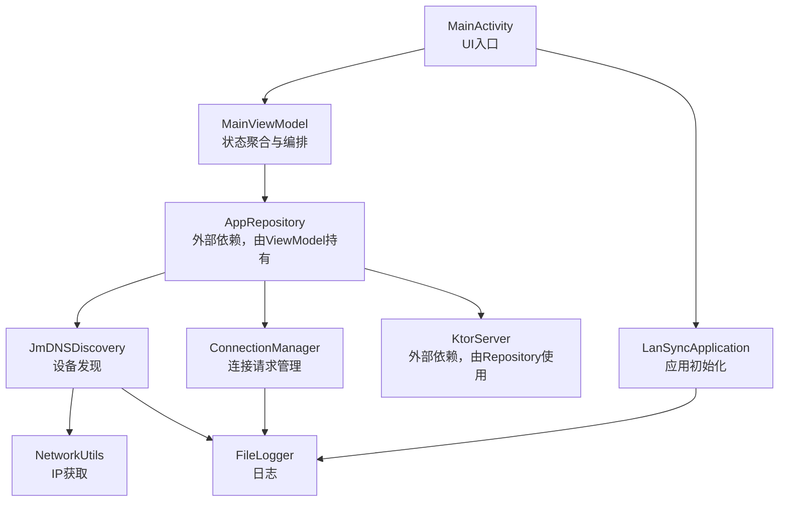
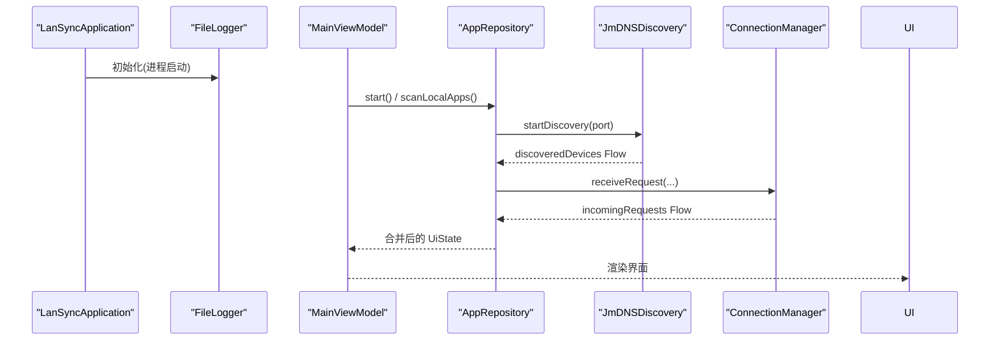
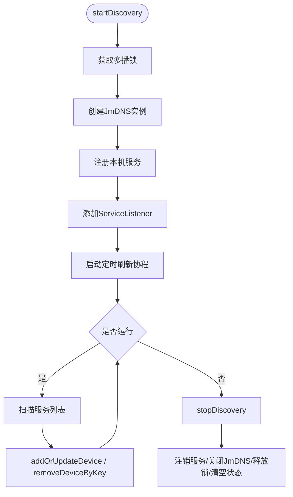
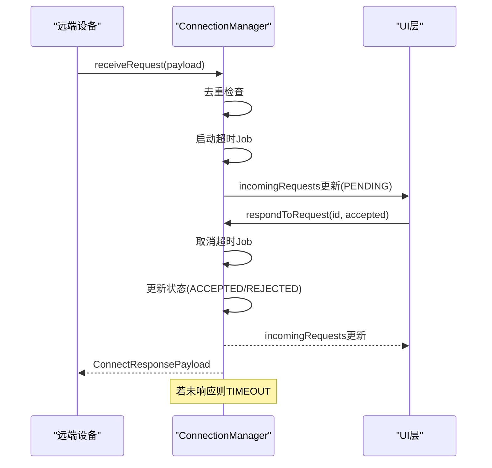
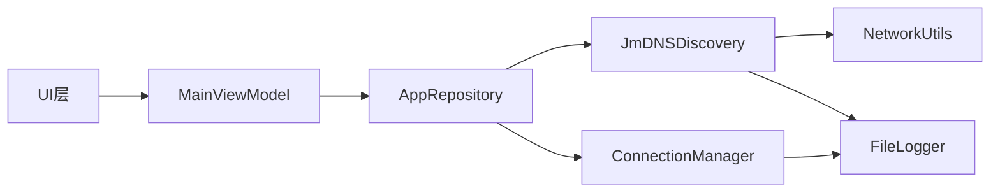
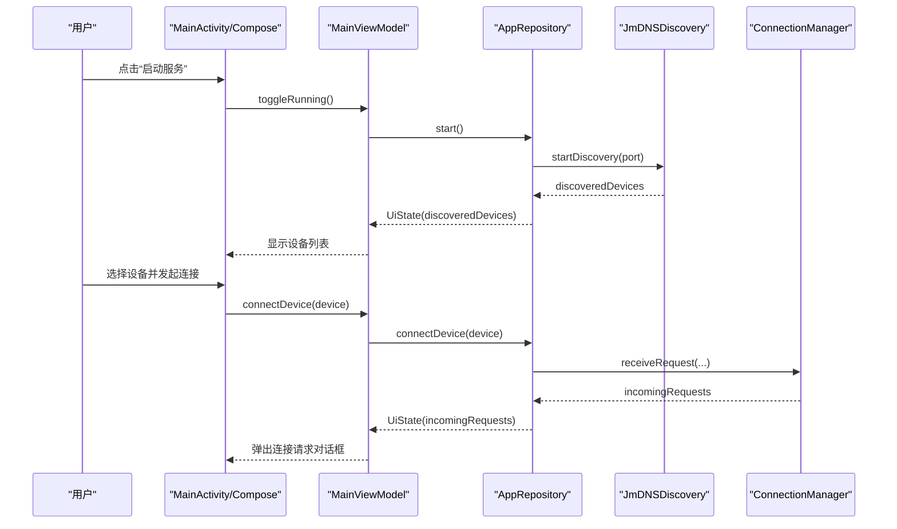
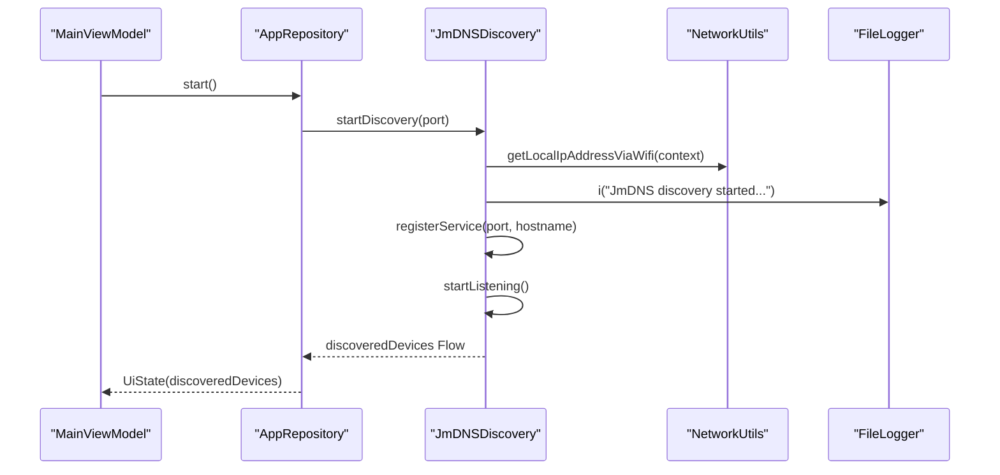
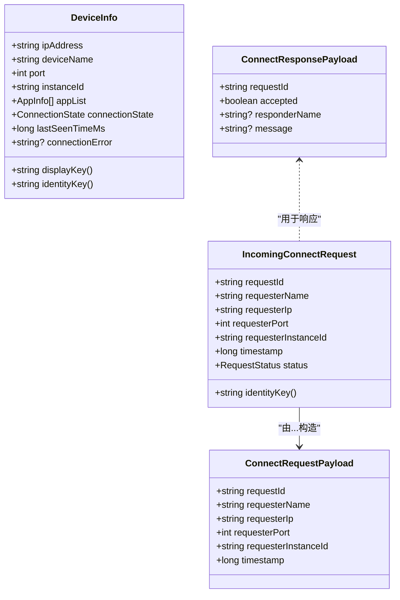

# 核心组件设计

<cite>
**本文引用的文件**
- [LanSyncApplication.kt](file://app/src/main/java/com/lansync/app/LanSyncApplication.kt)
- [JmDNSDiscovery.kt](file://app/src/main/java/com/lansync/app/data/discovery/JmDNSDiscovery.kt)
- [ConnectionManager.kt](file://app/src/main/java/com/lansync/app/data/connection/ConnectionManager.kt)
- [AppConfig.kt](file://app/src/main/java/com/lansync/app/data/AppConfig.kt)
- [Models.kt](file://app/src/main/java/com/lansync/app/data/model/Models.kt)
- [FileLogger.kt](file://app/src/main/java/com/lansync/app/data/FileLogger.kt)
- [NetworkUtils.kt](file://app/src/main/java/com/lansync/app/data/NetworkUtils.kt)
- [MainActivity.kt](file://app/src/main/java/com/lansync/app/MainActivity.kt)
- [MainViewModel.kt](file://app/src/main/java/com/lansync/app/ui/viewmodel/MainViewModel.kt)
</cite>

## 目录
1. [简介](#简介)
2. [项目结构](#项目结构)
3. [核心组件](#核心组件)
4. [架构总览](#架构总览)
5. [详细组件分析](#详细组件分析)
6. [依赖关系分析](#依赖关系分析)
7. [性能考量](#性能考量)
8. [故障排查指南](#故障排查指南)
9. [结论](#结论)
10. [附录](#附录)

## 简介
本文件聚焦 LanSync 应用的核心组件设计，围绕以下目标展开：
- 解析应用入口点 LanSyncApplication 的初始化流程
- 深入分析 JmDNSDiscovery 设备发现的工作原理与生命周期
- 剖析 ConnectionManager 连接管理的实现机制、状态流转与超时处理
- 说明组件间的依赖注入方式、生命周期管理与单例模式的应用场景
- 阐述可配置性、可扩展性与错误处理策略
- 提供组件协作流程图与关键方法的调用时序图

## 项目结构
从源码组织看，应用采用分层+按功能模块划分的结构：
- 应用层：Activity/Compose UI（MainActivity）与 ViewModel（MainViewModel）
- 数据层：设备发现（discovery）、连接管理（connection）、网络工具（NetworkUtils）、日志（FileLogger）、配置（AppConfig）、模型（Models）
- 其他：仓库、客户端、安装器等（不在本次范围）

图表来源
- [MainActivity.kt:26-35](file://app/src/main/java/com/lansync/app/MainActivity.kt#L26-L35)
- [MainViewModel.kt:47-82](file://app/src/main/java/com/lansync/app/ui/viewmodel/MainViewModel.kt#L47-L82)
- [JmDNSDiscovery.kt:23-86](file://app/src/main/java/com/lansync/app/data/discovery/JmDNSDiscovery.kt#L23-L86)
- [ConnectionManager.kt:19-56](file://app/src/main/java/com/lansync/app/data/connection/ConnectionManager.kt#L19-L56)
- [NetworkUtils.kt:31-53](file://app/src/main/java/com/lansync/app/data/NetworkUtils.kt#L31-L53)
- [FileLogger.kt:19-44](file://app/src/main/java/com/lansync/app/data/FileLogger.kt#L19-L44)

章节来源
- [MainActivity.kt:26-35](file://app/src/main/java/com/lansync/app/MainActivity.kt#L26-L35)
- [MainViewModel.kt:47-82](file://app/src/main/java/com/lansync/app/ui/viewmodel/MainViewModel.kt#L47-L82)

## 核心组件
- LanSyncApplication：应用进程启动时初始化全局日志系统，确保后续所有模块均可用。
- JmDNSDiscovery：基于 JmDNS 的局域网设备发现，负责注册本机服务、监听并维护已发现设备列表。
- ConnectionManager：集中管理入站连接请求的生命周期，包括去重、超时、状态更新与响应生成。
- AppConfig：集中定义心跳、轮询、超时等可调参数，便于运行时或构建期配置。
- Models：跨组件共享的数据结构与协议载荷，保证序列化一致性与类型安全。
- FileLogger：线程安全的异步日志写入器，支持日志轮转与清理。
- NetworkUtils：封装本地 IP 获取逻辑，为发现与服务提供网络地址。

章节来源
- [LanSyncApplication.kt:6-10](file://app/src/main/java/com/lansync/app/LanSyncApplication.kt#L6-L10)
- [JmDNSDiscovery.kt:23-86](file://app/src/main/java/com/lansync/app/data/discovery/JmDNSDiscovery.kt#L23-L86)
- [ConnectionManager.kt:19-56](file://app/src/main/java/com/lansync/app/data/connection/ConnectionManager.kt#L19-L56)
- [AppConfig.kt:3-17](file://app/src/main/java/com/lansync/app/data/AppConfig.kt#L3-L17)
- [Models.kt:19-101](file://app/src/main/java/com/lansync/app/data/model/Models.kt#L19-L101)
- [FileLogger.kt:19-44](file://app/src/main/java/com/lansync/app/data/FileLogger.kt#L19-L44)
- [NetworkUtils.kt:31-53](file://app/src/main/java/com/lansync/app/data/NetworkUtils.kt#L31-L53)

## 架构总览
整体采用“UI -> ViewModel -> Repository -> 基础设施”的分层架构。UI 通过 Compose 展示状态；ViewModel 聚合多个 StateFlow 并编排业务动作；Repository 协调设备发现、连接管理、网络通信等子系统；基础设施层提供日志、网络、配置等通用能力。

图表来源
- [LanSyncApplication.kt:6-10](file://app/src/main/java/com/lansync/app/LanSyncApplication.kt#L6-L10)
- [MainViewModel.kt:60-82](file://app/src/main/java/com/lansync/app/ui/viewmodel/MainViewModel.kt#L60-L82)
- [JmDNSDiscovery.kt:60-86](file://app/src/main/java/com/lansync/app/data/discovery/JmDNSDiscovery.kt#L60-L86)
- [ConnectionManager.kt:29-56](file://app/src/main/java/com/lansync/app/data/connection/ConnectionManager.kt#L29-L56)

## 详细组件分析

### LanSyncApplication：应用入口与初始化
- 职责：在 Application.onCreate 中初始化全局日志系统，确保后续模块可记录日志。
- 关键点：
  - 仅做最小化初始化，避免阻塞启动。
  - 日志系统内部具备线程安全与自动轮转，适合全进程共享。
- 扩展建议：可在未来扩展初始化其他全局资源（如配置加载、权限检查）。

章节来源
- [LanSyncApplication.kt:6-10](file://app/src/main/java/com/lansync/app/LanSyncApplication.kt#L6-L10)
- [FileLogger.kt:34-44](file://app/src/main/java/com/lansync/app/data/FileLogger.kt#L34-L44)

### JmDNSDiscovery：设备发现
- 职责：
  - 获取本地 IP 与主机名，创建 JmDNS 实例
  - 注册本机服务（包含 instanceId、deviceName 等 TXT 属性）
  - 监听服务加入/移除/解析事件，维护设备集合
  - 定时刷新服务列表，清理过期设备
- 关键流程：
  - startDiscovery：获取多播锁、创建 JmDNS、注册服务、开始监听、启动刷新协程
  - stopDiscovery：注销服务、关闭 JmDNS、释放多播锁、清空状态
  - addOrUpdateDevice/removeDeviceByKey：以 IP+端口 为键维护设备映射，过滤自身与无 instanceId 的设备
- 并发与流：
  - 使用 SupervisorJob + IO 调度器管理后台任务
  - 通过 MutableStateFlow 暴露 discoveredDevices，供上层订阅
- 错误处理：
  - 捕获异常并记录日志，必要时停止发现
  - 忽略无效设备信息（如无地址、无 instanceId）

图表来源
- [JmDNSDiscovery.kt:60-117](file://app/src/main/java/com/lansync/app/data/discovery/JmDNSDiscovery.kt#L60-L117)
- [JmDNSDiscovery.kt:136-189](file://app/src/main/java/com/lansync/app/data/discovery/JmDNSDiscovery.kt#L136-L189)
- [JmDNSDiscovery.kt:200-262](file://app/src/main/java/com/lansync/app/data/discovery/JmDNSDiscovery.kt#L200-L262)

章节来源
- [JmDNSDiscovery.kt:23-275](file://app/src/main/java/com/lansync/app/data/discovery/JmDNSDiscovery.kt#L23-L275)
- [NetworkUtils.kt:31-53](file://app/src/main/java/com/lansync/app/data/NetworkUtils.kt#L31-L53)
- [FileLogger.kt:90-104](file://app/src/main/java/com/lansync/app/data/FileLogger.kt#L90-L104)

### ConnectionManager：连接请求管理
- 职责：
  - 接收入站连接请求，去重并设置超时
  - 维护请求状态（PENDING/ACCEPTED/REJECTED/TIMEOUT）
  - 生成响应载荷供上层发送
  - 暴露待处理请求列表供 UI 展示
- 关键流程：
  - receiveRequest：校验重复、构造 IncomingConnectRequest、启动超时 Job、刷新列表
  - respondToRequest：查找请求、取消超时、更新状态、返回 ConnectResponsePayload
  - handleTimeout：将 PENDING 转为 TIMEOUT 并刷新列表
  - clearAll/removeRequest：清理资源与状态
- 并发与流：
  - 使用 SupervisorJob + IO 调度器管理超时任务
  - 通过 MutableStateFlow 暴露 incomingRequests，UI 实时显示待处理请求
- 错误处理：
  - 对未知 requestId 的响应进行防御性处理
  - 超时自动拒绝，避免悬挂请求

图表来源
- [ConnectionManager.kt:29-87](file://app/src/main/java/com/lansync/app/data/connection/ConnectionManager.kt#L29-L87)
- [ConnectionManager.kt:132-147](file://app/src/main/java/com/lansync/app/data/connection/ConnectionManager.kt#L132-L147)

章节来源
- [ConnectionManager.kt:19-156](file://app/src/main/java/com/lansync/app/data/connection/ConnectionManager.kt#L19-L156)
- [Models.kt:69-101](file://app/src/main/java/com/lansync/app/data/model/Models.kt#L69-L101)

### MainViewModel：状态编排与用户交互
- 职责：
  - 组合 Repository 的多路 StateFlow 为统一 UiState
  - 触发启动/停止、连接/断开、批量更新等操作
  - 处理下载进度与安装状态，驱动 UI 反馈
- 关键点：
  - autoStart：首次启动时扫描本地应用并启动服务
  - observeRepositoryState：使用 combine 分组订阅，避免参数过多限制
  - 错误与提示：连接失败、操作消息、初始扫描覆盖层

章节来源
- [MainViewModel.kt:47-124](file://app/src/main/java/com/lansync/app/ui/viewmodel/MainViewModel.kt#L47-L124)
- [MainViewModel.kt:126-223](file://app/src/main/java/com/lansync/app/ui/viewmodel/MainViewModel.kt#L126-L223)
- [MainViewModel.kt:245-413](file://app/src/main/java/com/lansync/app/ui/viewmodel/MainViewModel.kt#L245-L413)

### 配置与模型
- AppConfig：集中管理心跳、轮询、超时、重试等参数，便于统一调优与测试替换。
- Models：定义跨进程/跨设备的协议载荷与状态枚举，保证序列化一致性与类型安全。

章节来源
- [AppConfig.kt:3-17](file://app/src/main/java/com/lansync/app/data/AppConfig.kt#L3-L17)
- [Models.kt:19-138](file://app/src/main/java/com/lansync/app/data/model/Models.kt#L19-L138)

## 依赖关系分析
- 松耦合：各组件通过接口化的数据流（Flow/StateFlow）与明确的数据模型交互，降低直接耦合。
- 依赖方向：
  - UI -> ViewModel -> Repository -> Discovery/Connection/Network/Logger
  - Discovery/Connection 均依赖 Logger 与 NetworkUtils
- 潜在循环：未发现循环依赖；Repository 作为协调者，向上暴露统一状态，向下聚合子组件能力。

图表来源
- [MainViewModel.kt:47-82](file://app/src/main/java/com/lansync/app/ui/viewmodel/MainViewModel.kt#L47-L82)
- [JmDNSDiscovery.kt:23-86](file://app/src/main/java/com/lansync/app/data/discovery/JmDNSDiscovery.kt#L23-L86)
- [ConnectionManager.kt:19-56](file://app/src/main/java/com/lansync/app/data/connection/ConnectionManager.kt#L19-L56)
- [NetworkUtils.kt:31-53](file://app/src/main/java/com/lansync/app/data/NetworkUtils.kt#L31-L53)
- [FileLogger.kt:19-44](file://app/src/main/java/com/lansync/app/data/FileLogger.kt#L19-L44)

章节来源
- [MainViewModel.kt:47-124](file://app/src/main/java/com/lansync/app/ui/viewmodel/MainViewModel.kt#L47-L124)
- [JmDNSDiscovery.kt:23-86](file://app/src/main/java/com/lansync/app/data/discovery/JmDNSDiscovery.kt#L23-L86)
- [ConnectionManager.kt:19-56](file://app/src/main/java/com/lansync/app/data/connection/ConnectionManager.kt#L19-L56)

## 性能考量
- 设备发现：
  - 使用定时器周期性刷新，避免频繁网络查询
  - 以 IP+端口 为键维护设备映射，减少重复计算
  - 多播锁仅在需要时获取与释放，降低系统开销
- 连接管理：
  - 超时任务独立协程，避免阻塞主流程
  - 使用 ConcurrentHashMap 保证并发安全
- 日志系统：
  - 异步 Channel + Mutex 写盘，避免阻塞业务线程
  - 日志轮转与备份，防止磁盘占用过大
- 内存与生命周期：
  - 组件内 CoroutineScope 使用 SupervisorJob，子任务失败不影响整体
  - 停止时主动清理资源（服务注销、锁释放、协程取消）

[本节为通用性能指导，不直接分析具体文件]

## 故障排查指南
- 无法发现设备：
  - 检查多播锁是否成功获取与释放
  - 确认本机服务已注册且包含 instanceId
  - 查看日志中是否有服务刷新异常
- 连接请求无响应：
  - 检查 ConnectionManager 是否收到请求并启动超时任务
  - 确认 respondToRequest 是否被正确调用
  - 查看超时后是否自动标记为 TIMEOUT
- 日志缺失或过大：
  - 确认 FileLogger.init 已被调用
  - 检查日志目录权限与磁盘空间
  - 使用 clearLog 清理历史日志

章节来源
- [JmDNSDiscovery.kt:88-117](file://app/src/main/java/com/lansync/app/data/discovery/JmDNSDiscovery.kt#L88-L117)
- [JmDNSDiscovery.kt:230-262](file://app/src/main/java/com/lansync/app/data/discovery/JmDNSDiscovery.kt#L230-L262)
- [ConnectionManager.kt:58-87](file://app/src/main/java/com/lansync/app/data/connection/ConnectionManager.kt#L58-L87)
- [ConnectionManager.kt:132-147](file://app/src/main/java/com/lansync/app/data/connection/ConnectionManager.kt#L132-L147)
- [FileLogger.kt:141-167](file://app/src/main/java/com/lansync/app/data/FileLogger.kt#L141-L167)

## 结论
LanSync 的核心组件围绕“发现-连接-同步”的主线展开：
- LanSyncApplication 负责最小化初始化，确保日志可用
- JmDNSDiscovery 提供稳定的设备发现能力，并通过 Flow 暴露结果
- ConnectionManager 统一管理连接请求的生命周期，保障可靠性
- MainViewModel 聚合状态并编排业务流程，驱动 UI 更新
- 通过 AppConfig 与 Models 实现可配置性与一致性
- 组件间通过清晰的依赖方向与数据流解耦，具备良好的可扩展性与可维护性

[本节为总结性内容，不直接分析具体文件]

## 附录

### 组件协作流程图（端到端）

图表来源
- [MainActivity.kt:26-35](file://app/src/main/java/com/lansync/app/MainActivity.kt#L26-L35)
- [MainViewModel.kt:126-180](file://app/src/main/java/com/lansync/app/ui/viewmodel/MainViewModel.kt#L126-L180)
- [JmDNSDiscovery.kt:60-86](file://app/src/main/java/com/lansync/app/data/discovery/JmDNSDiscovery.kt#L60-L86)
- [ConnectionManager.kt:29-56](file://app/src/main/java/com/lansync/app/data/connection/ConnectionManager.kt#L29-L56)

### 关键方法调用时序图（设备发现）

图表来源
- [MainViewModel.kt:60-82](file://app/src/main/java/com/lansync/app/ui/viewmodel/MainViewModel.kt#L60-L82)
- [JmDNSDiscovery.kt:60-86](file://app/src/main/java/com/lansync/app/data/discovery/JmDNSDiscovery.kt#L60-L86)
- [NetworkUtils.kt:31-53](file://app/src/main/java/com/lansync/app/data/NetworkUtils.kt#L31-L53)
- [FileLogger.kt:90-104](file://app/src/main/java/com/lansync/app/data/FileLogger.kt#L90-L104)

### 类关系图（核心数据结构）

图表来源
- [Models.kt:29-101](file://app/src/main/java/com/lansync/app/data/model/Models.kt#L29-L101)