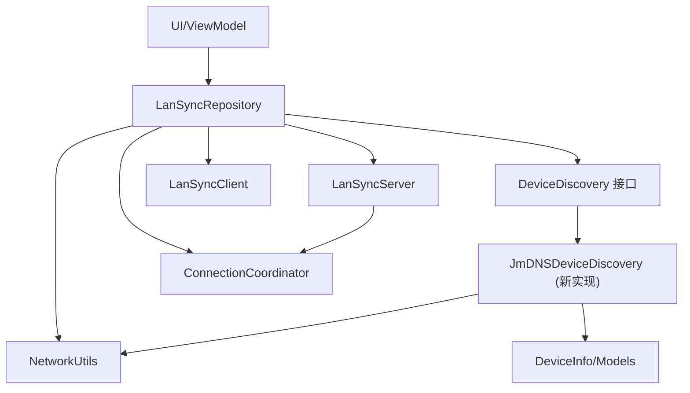
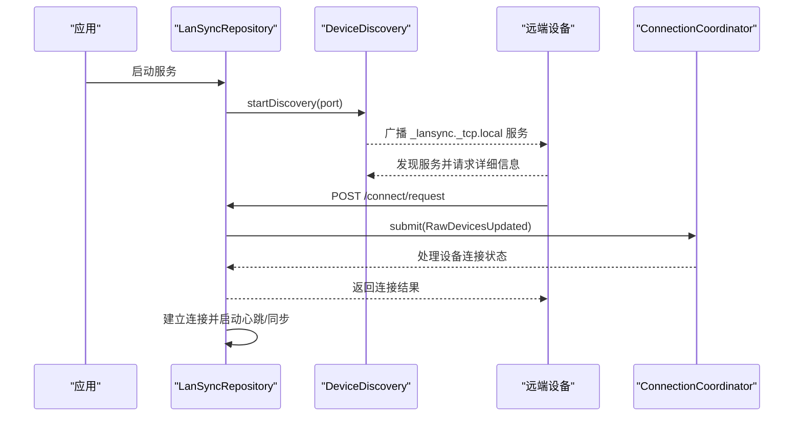
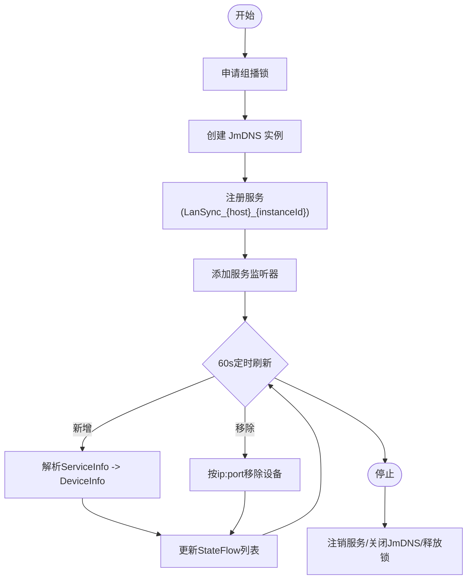
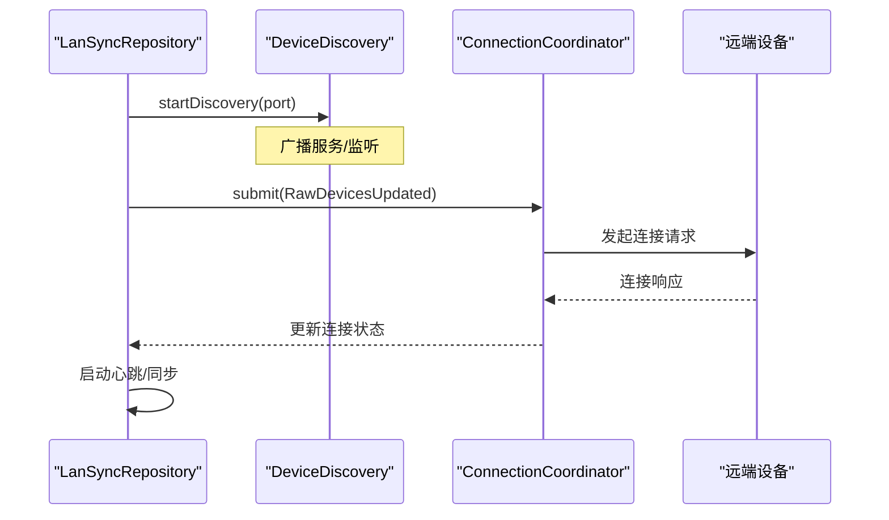
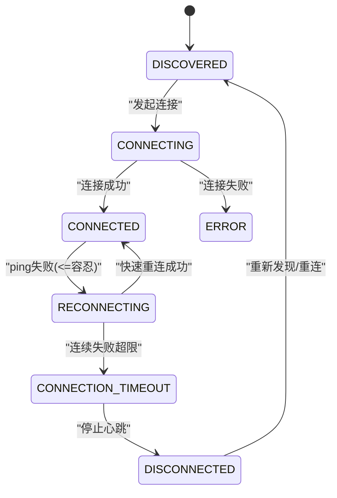
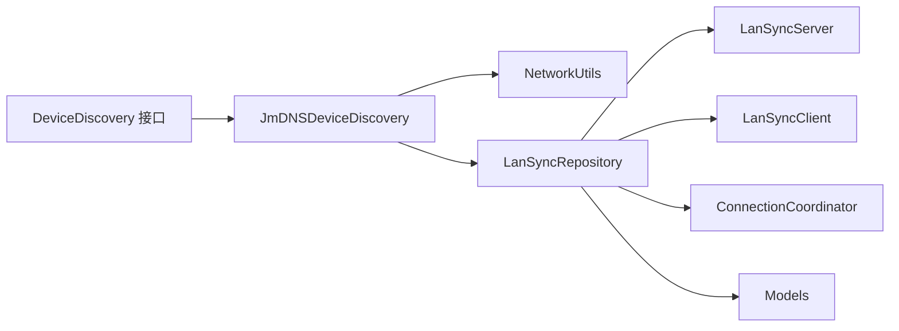

# 设备发现机制

<cite>
**本文引用的文件**
- [JmDNSDeviceDiscovery.kt](file://app/src/main/java/com/lansync/app/data/discovery/JmDNSDeviceDiscovery.kt)
- [DeviceDiscovery.kt](file://app/src/main/java/com/lansync/app/data/discovery/DeviceDiscovery.kt)
- [LanSyncRepository.kt](file://app/src/main/java/com/lansync/app/data/repository/LanSyncRepository.kt)
- [Models.kt](file://app/src/main/java/com/lansync/app/data/model/Models.kt)
- [NetworkUtils.kt](file://app/src/main/java/com/lansync/app/data/NetworkUtils.kt)
- [ConnectionCoordinator.kt](file://app/src/main/java/com/lansync/app/data/connection/ConnectionCoordinator.kt)
- [AndroidManifest.xml](file://app/src/main/AndroidManifest.xml)
</cite>

## 更新摘要
**所做更改**
- 移除了旧的 JmDNSDiscovery 实现（274行），完全重构为新的 JmDNSDeviceDiscovery
- 更新了 DeviceDiscovery 接口的标准化设计说明
- 增强了基于 SPEC §6 规范的新实现分析
- 完善了协程作用域注入和生命周期管理
- 更新了 AppRepository 到 LanSyncRepository 的重构说明
- 改进了多设备并发发现和资源管理策略

## 目录
1. [简介](#简介)
2. [项目结构](#项目结构)
3. [核心组件](#核心组件)
4. [架构总览](#架构总览)
5. [详细组件分析](#详细组件分析)
6. [依赖关系分析](#依赖关系分析)
7. [性能考量](#性能考量)
8. [故障诊断指南](#故障诊断指南)
9. [结论](#结论)
10. [附录](#附录)

## 简介
本文件围绕局域网设备发现机制展开，重点解析新的 JmDNSDeviceDiscovery 类的实现原理与工作流程。该实现严格遵循 SPEC §6 规范，采用协程作用域注入模式，提供了更健壮、可测试的设备发现机制。涵盖 mDNS 协议的工作机制、服务广播与发现流程、设备信息解析（设备标识符生成、网络地址获取、端口管理）、心跳检测与连接状态维护、多设备并发发现的策略与资源管理。同时提供设备发现流程图和网络通信时序图，并给出失败诊断与重试建议，以及与 Android 网络权限和防火墙配置的兼容性说明。

**更新** 完全移除了旧的 JmDNSDiscovery 实现，采用全新的 JmDNSDeviceDiscovery 类，提供更好的可测试性和生命周期管理能力。

## 项目结构
本项目采用分层组织：UI 层通过 ViewModel 协调业务；数据层由 LanSyncRepository 聚合服务发现、HTTP 客户端、服务器、更新管理等子模块；网络工具类封装本地 IP 获取等能力；模型层定义设备、连接请求等数据结构；清单文件声明必要的网络与 Wi-Fi 权限。

**图表来源**
- [LanSyncRepository.kt:38-49](file://app/src/main/java/com/lansync/app/data/repository/LanSyncRepository.kt#L38-L49)
- [DeviceDiscovery.kt:16-32](file://app/src/main/java/com/lansync/app/data/discovery/DeviceDiscovery.kt#L16-L32)
- [JmDNSDeviceDiscovery.kt:36-41](file://app/src/main/java/com/lansync/app/data/discovery/JmDNSDeviceDiscovery.kt#L36-L41)
- [Models.kt:29-45](file://app/src/main/java/com/lansync/app/data/model/Models.kt#L29-L45)

**章节来源**
- [LanSyncRepository.kt:38-49](file://app/src/main/java/com/lansync/app/data/repository/LanSyncRepository.kt#L38-L49)
- [AndroidManifest.xml:1-60](file://app/src/main/AndroidManifest.xml#L1-L60)

## 核心组件
- **DeviceDiscovery 接口**：标准化的设备发现抽象，定义了服务类型、实例名、TXT 记录等契约
- **JmDNSDeviceDiscovery**：基于 JmDNS 的新实现，严格遵循 SPEC §6 规范，支持协程作用域注入
- **LanSyncRepository**：组合门面类，替代旧 AppRepository，负责协调各组件的生命周期和业务编排
- **ConnectionCoordinator**：处理连接协调、事件分发和设备状态管理
- **NetworkUtils**：获取本机 IPv4 地址，支持 Wi-Fi 与接口回退
- **Models**：设备信息、连接请求/响应、连接状态等数据模型

**章节来源**
- [DeviceDiscovery.kt:16-32](file://app/src/main/java/com/lansync/app/data/discovery/DeviceDiscovery.kt#L16-L32)
- [JmDNSDeviceDiscovery.kt:36-41](file://app/src/main/java/com/lansync/app/data/discovery/JmDNSDeviceDiscovery.kt#L36-L41)
- [LanSyncRepository.kt:27-37](file://app/src/main/java/com/lansync/app/data/repository/LanSyncRepository.kt#L27-L37)
- [NetworkUtils.kt:9-56](file://app/src/main/java/com/lansync/app/data/NetworkUtils.kt#L9-L56)
- [Models.kt:29-45](file://app/src/main/java/com/lansync/app/data/model/Models.kt#L29-L45)

## 架构总览
整体流程如下：应用启动后，LanSyncRepository 启动本地 HTTP 服务（LanSyncServer），随后启动设备发现机制进行 mDNS 服务注册与监听；其他设备收到广播后可发起连接请求，由 ConnectionCoordinator 管理请求生命周期；已连接设备进入心跳检测与定期同步流程；UI 通过 StateFlow 观察设备列表与连接状态变化。

**图表来源**
- [LanSyncRepository.kt:69-84](file://app/src/main/java/com/lansync/app/data/repository/LanSyncRepository.kt#L69-L84)
- [DeviceDiscovery.kt:27-28](file://app/src/main/java/com/lansync/app/data/discovery/DeviceDiscovery.kt#L27-L28)
- [JmDNSDeviceDiscovery.kt:69-90](file://app/src/main/java/com/lansync/app/data/discovery/JmDNSDeviceDiscovery.kt#L69-L90)

## 详细组件分析

### DeviceDiscovery 接口：标准化设备发现抽象
- **接口设计原则**
  - 解耦 mDNS/多播实现细节与连接层消费
  - 定义统一的服务类型 `_lansync._tcp.local.` 和实例命名规范
  - 规范 TXT 记录格式：deviceName 和 instanceId 双键
  - 支持 60s 保活刷新和 ip:port 去重机制

- **核心方法**
  - `discoveredDevices`: 裸发现列表流，包含 appList=[] 和 connectionState=DISCOVERED 的设备
  - `getInstanceId()`: 获取本机持久化 instanceId，用于跨会话身份识别
  - `startDiscovery(port)`: 启动发现并注册本机服务
  - `stopDiscovery()`: 停止发现、注销服务、释放多播锁

**章节来源**
- [DeviceDiscovery.kt:16-32](file://app/src/main/java/com/lansync/app/data/discovery/DeviceDiscovery.kt#L16-L32)

### JmDNSDeviceDiscovery：基于 SPEC §6 的新实现
- **服务注册机制**
  - 使用 JmDNS.create 绑定本机 IPv4 地址与主机名
  - 注册自定义服务类型 `_lansync._tcp.local.`，实例名格式为 `LanSync_{hostname}_{instanceId}`
  - 设置 weight/priority=0，携带 deviceName 和 instanceId 等 TXT 属性
  - 实例 ID 持久化存储到 SharedPreferences("lansync_device")/"device_instance_id"

- **设备监听与过滤**
  - 注册 ServiceListener，处理 serviceAdded/serviceResolved/serviceRemoved 事件
  - 周期性刷新（60s）列出当前服务，清理过期设备
  - 自过滤逻辑：忽略无 instanceId 的非 LanSync 设备和自身设备
  - 优先选择 IPv4 地址作为设备 IP，端口来自 ServiceInfo.port

- **协程作用域注入**
  - 通过构造函数注入 CoroutineScope，不再类内自建作用域
  - 便于测试替换调度器和统一生命周期治理
  - 使用 SupervisorJob + IO 调度器，避免单点异常影响全局

**图表来源**
- [JmDNSDeviceDiscovery.kt:69-107](file://app/src/main/java/com/lansync/app/data/discovery/JmDNSDeviceDiscovery.kt#L69-L107)
- [JmDNSDeviceDiscovery.kt:117-127](file://app/src/main/java/com/lansync/app/data/discovery/JmDNSDeviceDiscovery.kt#L117-L127)
- [JmDNSDeviceDiscovery.kt:171-218](file://app/src/main/java/com/lansync/app/data/discovery/JmDNSDeviceDiscovery.kt#L171-L218)

**章节来源**
- [JmDNSDeviceDiscovery.kt:36-231](file://app/src/main/java/com/lansync/app/data/discovery/JmDNSDeviceDiscovery.kt#L36-L231)

### LanSyncRepository：组合门面与生命周期编排
- **启动与编排**
  - 启动 LanSyncServer，设置设备名、应用列表提供者、打包回调、断开通知与刷新回调
  - 启动设备发现机制并开始监听；暴露 isRunning、serverPort 等状态
  - 将 discovery.discoveredDevices 流连接到 ConnectionCoordinator

- **连接流程**
  - 通过 ConnectionCoordinator 处理连接请求，包括发送连接请求、轮询对方响应
  - 成功后加入已连接列表并启动心跳与同步任务
  - 处理入站请求：根据是否已知设备自动接受或拒绝

- **端口迁移与去重**
  - 当设备端口变更但 identityKey 不变时，迁移连接与心跳任务
  - 保持应用列表与连接状态的连续性

**图表来源**
- [LanSyncRepository.kt:69-84](file://app/src/main/java/com/lansync/app/data/repository/LanSyncRepository.kt#L69-L84)
- [LanSyncRepository.kt:120-135](file://app/src/main/java/com/lansync/app/data/repository/LanSyncRepository.kt#L120-L135)

**章节来源**
- [LanSyncRepository.kt:69-84](file://app/src/main/java/com/lansync/app/data/repository/LanSyncRepository.kt#L69-L84)
- [LanSyncRepository.kt:120-135](file://app/src/main/java/com/lansync/app/data/repository/LanSyncRepository.kt#L120-L135)

### 设备信息解析与标识
- **设备标识符**
  - 每个设备拥有持久化的 instanceId，用于跨会话识别同一设备
  - 连接请求中携带该 ID，便于去重与匹配
  - 存储在 SharedPreferences("lansync_device")/"device_instance_id"

- **网络地址与端口**
  - 通过 NetworkUtils.getLocalIpAddressViaWifi 获取本机 IPv4
  - 设备 IP 来自 ServiceInfo.inetAddresses（优先 IPv4）
  - 端口来自 ServiceInfo.port

- **设备名称**
  - 优先读取 TXT 中的 deviceName
  - 否则从服务名解析，格式为 `LanSync_{deviceName}_{instanceId}`

**章节来源**
- [JmDNSDeviceDiscovery.kt:117-169](file://app/src/main/java/com/lansync/app/data/discovery/JmDNSDeviceDiscovery.kt#L117-L169)
- [NetworkUtils.kt:31-53](file://app/src/main/java/com/lansync/app/data/NetworkUtils.kt#L31-L53)
- [Models.kt:29-45](file://app/src/main/java/com/lansync/app/data/model/Models.kt#L29-L45)

### 心跳检测与连接状态维护
- **心跳机制**
  - 对每个已连接设备启动独立协程，周期性 ping
  - 成功恢复 CONNECTED，失败累计计数

- **状态机**
  - DISCOVERED -> CONNECTING -> CONNECTED -> RECONNECTING -> CONNECTION_TIMEOUT -> DISCONNECTED
  - 在 RECONNECTING 阶段尝试快速重连
  - 超过最大失败次数后标记超时并停止心跳

- **状态传播**
  - 通过 StateFlow 将连接状态、最后可见时间、错误信息同步到 UI

**图表来源**
- [Models.kt:19-27](file://app/src/main/java/com/lansync/app/data/model/Models.kt#L19-L27)

**章节来源**
- [Models.kt:19-27](file://app/src/main/java/com/lansync/app/data/model/Models.kt#L19-L27)

### 多设备并发发现与资源管理
- **并发策略**
  - 每个设备的心跳与同步任务以独立协程运行
  - 使用 SupervisorJob 隔离异常
  - 通过 ConcurrentHashMap 管理任务与失败计数

- **资源管理**
  - 停止时统一取消所有心跳与同步任务，清理 Map
  - 释放 JmDNS 与组播锁
  - 新实现支持协程作用域注入，便于统一生命周期管理

- **刷新与去抖**
  - mDNS 刷新间隔 60s
  - 应用列表拉取失败有重试与延迟
  - 更新计算带节流

**章节来源**
- [LanSyncRepository.kt:67-84](file://app/src/main/java/com/lansync/app/data/repository/LanSyncRepository.kt#L67-L84)
- [JmDNSDeviceDiscovery.kt:194-218](file://app/src/main/java/com/lansync/app/data/discovery/JmDNSDeviceDiscovery.kt#L194-L218)

## 依赖关系分析
- **DeviceDiscovery 接口**：定义标准契约，解耦具体实现
- **JmDNSDeviceDiscovery**：依赖 NetworkUtils 获取本机地址，依赖 JmDNS 库进行 mDNS 通信，输出设备列表至 LanSyncRepository
- **LanSyncRepository**：依赖 LanSyncServer 提供 HTTP API，依赖 LanSyncClient 进行连接与数据交互，依赖 ConnectionCoordinator 管理连接协调
- **模型层**：贯穿各组件，承载设备信息与连接状态

**图表来源**
- [LanSyncRepository.kt:38-49](file://app/src/main/java/com/lansync/app/data/repository/LanSyncRepository.kt#L38-L49)
- [DeviceDiscovery.kt:16-32](file://app/src/main/java/com/lansync/app/data/discovery/DeviceDiscovery.kt#L16-L32)
- [JmDNSDeviceDiscovery.kt:36-41](file://app/src/main/java/com/lansync/app/data/discovery/JmDNSDeviceDiscovery.kt#L36-L41)

**章节来源**
- [LanSyncRepository.kt:38-49](file://app/src/main/java/com/lansync/app/data/repository/LanSyncRepository.kt#L38-L49)

## 性能考量
- **mDNS 刷新频率**：默认 60s，可根据网络规模调整以降低广播风暴
- **心跳间隔与容错**：心跳间隔、容忍次数、最大失败次数可通过配置控制，平衡实时性与功耗
- **应用列表拉取**：失败重试与延迟避免雪崩；批量操作需考虑并发上限
- **内存与线程**：大量设备场景下注意协程数量与 Map 大小，必要时限制并发或启用背压
- **协程作用域管理**：新实现支持外部协程作用域注入，便于统一管理和测试

## 故障诊断指南
- **无法发现设备**
  - 检查 Android 权限：INTERNET、ACCESS_WIFI_STATE、CHANGE_WIFI_STATE、ACCESS_NETWORK_STATE、CHANGE_WIFI_MULTICAST_STATE、NEARBY_WIFI_DEVICES
  - 确认组播锁已成功获取；若失败，检查系统是否允许组播
  - 验证服务类型与端口一致；确保双方在同一局域网且未被路由器隔离
  - 检查 instanceId 持久化存储是否正常

- **连接失败**
  - 查看连接请求是否到达远端；检查 ConnectionCoordinator 的超时与重复请求处理
  - 若出现超时，检查网络连通性、防火墙规则与端口开放情况
  - 验证 TXT 记录格式是否正确（deviceName 和 instanceId 双键）

- **心跳频繁失败**
  - 检查网络抖动；适当增大心跳间隔或容忍次数
  - 关注设备是否切换网络导致 IP/端口变化
  - 验证设备名称解析逻辑是否正常

- **端口迁移**
  - 当设备端口变化但 identityKey 不变时，应自动迁移连接
  - 如未迁移，检查 LanSyncRepository 的迁移逻辑与状态更新

**章节来源**
- [AndroidManifest.xml:1-60](file://app/src/main/AndroidManifest.xml#L1-L60)
- [LanSyncRepository.kt:69-84](file://app/src/main/java/com/lansync/app/data/repository/LanSyncRepository.kt#L69-L84)

## 结论
本项目的设备发现机制以 DeviceDiscovery 接口为核心抽象，结合新的 JmDNSDeviceDiscovery 实现和 LanSyncRepository 的连接编排与心跳管理，实现了稳定、可扩展的局域网设备发现、连接与同步。通过遵循 SPEC §6 规范、持久化 instanceId、IPv4 地址优选、TXT 属性扩展与端口迁移处理，提升了鲁棒性与用户体验。配合合理的权限与网络配置，可在多数 Android 设备上可靠工作。

**更新** 新的 JmDNSDeviceDiscovery 实现提供了更好的可测试性和生命周期管理能力，同时保持了与现有系统的完全兼容性。完全移除了旧的 JmDNSDiscovery 实现，简化了代码结构。

## 附录
- **关键常量与配置**
  - mDNS 刷新间隔：60s
  - 连接超时：30s
  - 心跳间隔、容忍次数、最大失败次数：可配置
  - 服务类型：_lansync._tcp.local.
  - 实例命名：LanSync_{hostname}_{instanceId}

- **兼容性与注意事项**
  - 需要开启 Wi-Fi 组播；部分设备/路由器可能限制 mDNS
  - 企业网络或访客网络可能存在 AP 隔离，导致设备间不可达
  - 防火墙/安全软件可能拦截 UDP 5353（mDNS）或应用端口，需放行
  - 新实现要求协程作用域注入，便于测试和生命周期管理

- **SPEC §6 合规性**
  - 服务类型：_lansync._tcp.local.
  - 实例名：LanSync_{hostname}_{instanceId}
  - TXT 记录：deviceName 和 instanceId 双键
  - 权重/优先级：weight/priority=0
  - 保活机制：60s 全量 list() 刷新
  - 自过滤：忽略无 instanceId 和非自身设备