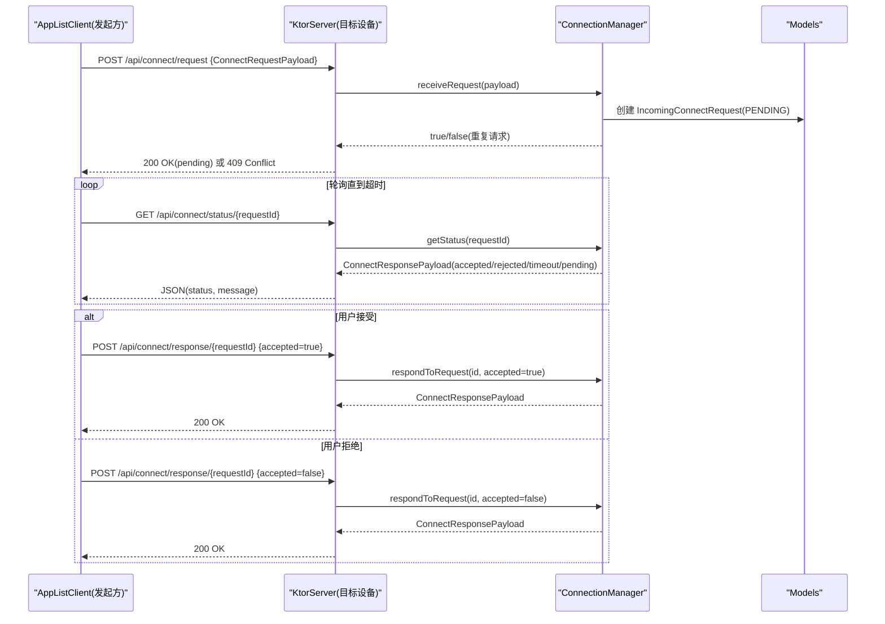
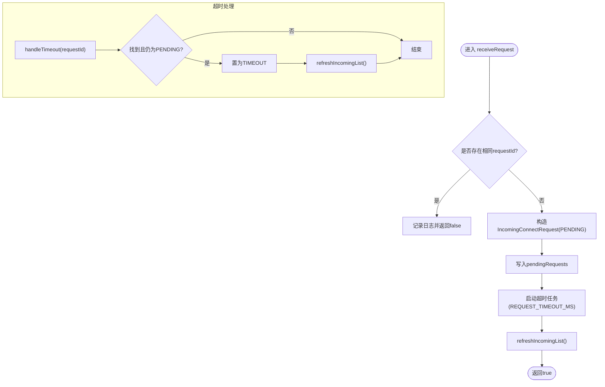
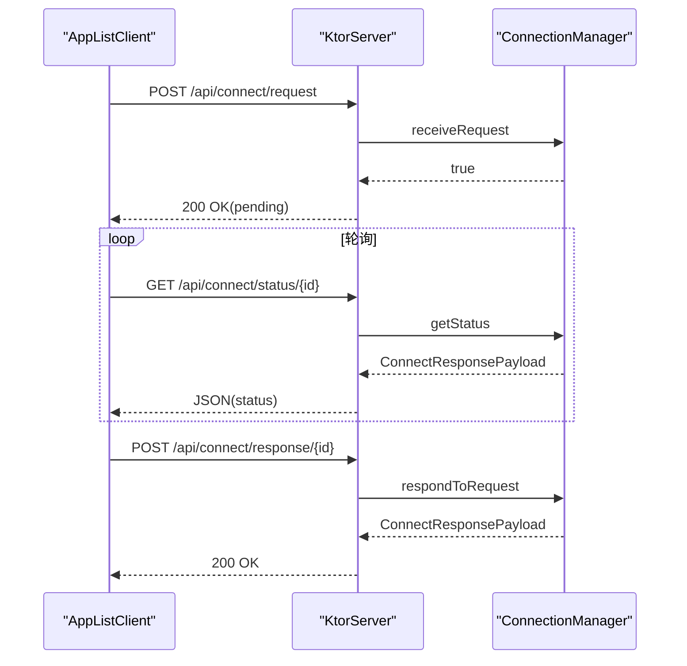
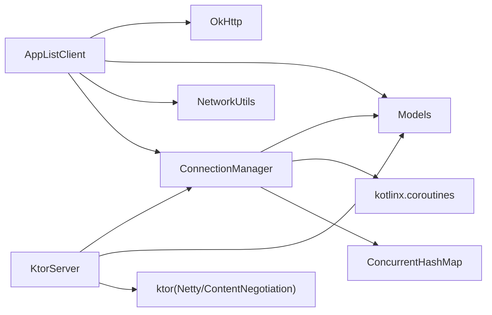
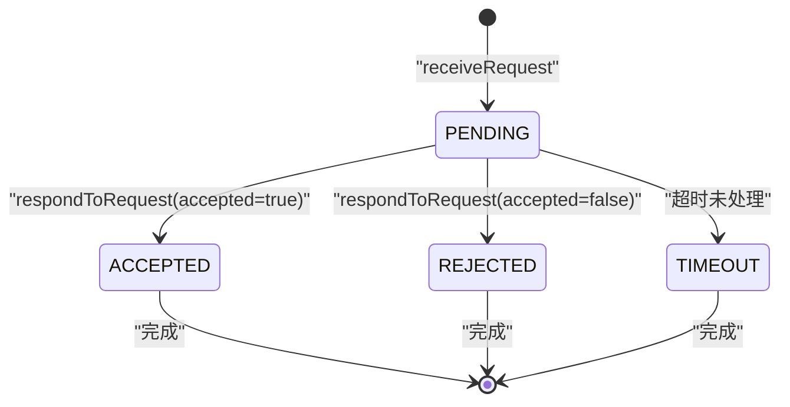

# 连接管理器

<cite>
**本文引用的文件**
- [ConnectionManager.kt](file://app/src/main/java/com/lansync/app/data/connection/ConnectionManager.kt)
- [AppListClient.kt](file://app/src/main/java/com/lansync/app/data/client/AppListClient.kt)
- [KtorServer.kt](file://app/src/main/java/com/lansync/app/data/server/KtorServer.kt)
- [Models.kt](file://app/src/main/java/com/lansync/app/data/model/Models.kt)
- [AppConfig.kt](file://app/src/main/java/com/lansync/app/data/AppConfig.kt)
- [NetworkUtils.kt](file://app/src/main/java/com/lansync/app/data/NetworkUtils.kt)
- [ConnectionManagerTest.kt](file://app/src/test/java/com/lansync/app/data/connection/ConnectionManagerTest.kt)
</cite>

## 目录
1. [简介](#简介)
2. [项目结构](#项目结构)
3. [核心组件](#核心组件)
4. [架构总览](#架构总览)
5. [详细组件分析](#详细组件分析)
6. [依赖关系分析](#依赖关系分析)
7. [性能考量](#性能考量)
8. [故障排查指南](#故障排查指南)
9. [结论](#结论)
10. [附录](#附录)

## 简介
本文件围绕连接管理器的设计与实现，系统性阐述连接请求的接收、状态流转、超时与自动拒绝机制；说明HTTP客户端（OkHttp）的连接池、超时与错误处理策略；描述从发起连接到响应、轮询、到优雅关闭的完整生命周期；并给出并发安全控制、资源限制、异常恢复与网络环境适配建议。文档同时提供架构图、数据流图与关键流程时序图，便于快速理解与排障。

## 项目结构
- 连接管理核心：ConnectionManager 负责入站连接请求的生命周期管理、状态机与超时处理。
- HTTP 客户端：AppListClient 封装 OkHttp 调用，负责发送连接请求、轮询状态、发送响应、下载等。
- HTTP 服务端：KtorServer 暴露 REST API，将请求路由到 ConnectionManager。
- 数据模型：Models.kt 定义连接相关的数据结构与枚举。
- 配置与工具：AppConfig 提供全局参数；NetworkUtils 提供本地IP获取等能力。
- 测试：ConnectionManagerTest 覆盖核心用例。

```mermaid
graph TB
subgraph "客户端"
A["AppListClient<br/>OkHttp 客户端"]
end
subgraph "服务端"
B["KtorServer<br/>REST 路由"]
C["ConnectionManager<br/>连接请求管理"]
end
subgraph "数据与配置"
D["Models<br/>数据模型"]
E["AppConfig<br/>全局参数"]
F["NetworkUtils<br/>网络工具"]
end
A --> |POST /api/connect/request| B
B --> C
A --> |GET /api/connect/status/{id}| B
B --> C
A --> |POST /api/connect/response/{id}| B
B --> C
C --> D
A --> D
B --> D
A --> E
A --> F
```

图表来源
- [AppListClient.kt:32-50](file://app/src/main/java/com/lansync/app/data/client/AppListClient.kt#L32-L50)
- [KtorServer.kt:68-175](file://app/src/main/java/com/lansync/app/data/server/KtorServer.kt#L68-L175)
- [ConnectionManager.kt:19-155](file://app/src/main/java/com/lansync/app/data/connection/ConnectionManager.kt#L19-L155)
- [Models.kt:69-116](file://app/src/main/java/com/lansync/app/data/model/Models.kt#L69-L116)
- [AppConfig.kt:3-17](file://app/src/main/java/com/lansync/app/data/AppConfig.kt#L3-L17)
- [NetworkUtils.kt:11-53](file://app/src/main/java/com/lansync/app/data/NetworkUtils.kt#L11-L53)

章节来源
- [ConnectionManager.kt:19-155](file://app/src/main/java/com/lansync/app/data/connection/ConnectionManager.kt#L19-L155)
- [AppListClient.kt:32-50](file://app/src/main/java/com/lansync/app/data/client/AppListClient.kt#L32-L50)
- [KtorServer.kt:68-175](file://app/src/main/java/com/lansync/app/data/server/KtorServer.kt#L68-L175)
- [Models.kt:69-116](file://app/src/main/java/com/lansync/app/data/model/Models.kt#L69-L116)
- [AppConfig.kt:3-17](file://app/src/main/java/com/lansync/app/data/AppConfig.kt#L3-L17)
- [NetworkUtils.kt:11-53](file://app/src/main/java/com/lansync/app/data/NetworkUtils.kt#L11-L53)

## 核心组件
- ConnectionManager：维护待处理请求集合、超时任务、状态流；提供接收请求、响应请求、查询状态、清理等能力。
- AppListClient：封装 OkHttp 客户端，负责连接握手、轮询、响应、下载等；内置连接池与超时配置。
- KtorServer：提供 REST API，桥接外部HTTP请求与 ConnectionManager。
- Models：定义连接请求/响应、设备信息、连接状态等数据结构。
- AppConfig：集中化配置项（心跳、重试、超时、轮询间隔等）。
- NetworkUtils：获取本机IP地址，支持WiFi与接口回退。

章节来源
- [ConnectionManager.kt:19-155](file://app/src/main/java/com/lansync/app/data/connection/ConnectionManager.kt#L19-L155)
- [AppListClient.kt:32-50](file://app/src/main/java/com/lansync/app/data/client/AppListClient.kt#L32-L50)
- [KtorServer.kt:68-175](file://app/src/main/java/com/lansync/app/data/server/KtorServer.kt#L68-L175)
- [Models.kt:19-116](file://app/src/main/java/com/lansync/app/data/model/Models.kt#L19-L116)
- [AppConfig.kt:3-17](file://app/src/main/java/com/lansync/app/data/AppConfig.kt#L3-L17)
- [NetworkUtils.kt:11-53](file://app/src/main/java/com/lansync/app/data/NetworkUtils.kt#L11-L53)

## 架构总览
连接建立采用“异步请求 + 轮询确认”的模式：
- 发起方通过 AppListClient 向目标设备 POST /api/connect/request，携带唯一 requestId。
- 目标设备 KtorServer 接收后交由 ConnectionManager 登记为 PENDING，并启动超时任务。
- 发起方周期性 GET /api/connect/status/{requestId} 轮询，直到收到 ACCEPTED/REJECTED 或超时。
- 目标设备在用户确认后，POST /api/connect/response/{requestId} 更新状态。
- 若超时未处理，ConnectionManager 自动标记为 TIMEOUT。



图表来源
- [AppListClient.kt:62-133](file://app/src/main/java/com/lansync/app/data/client/AppListClient.kt#L62-L133)
- [KtorServer.kt:88-175](file://app/src/main/java/com/lansync/app/data/server/KtorServer.kt#L88-L175)
- [ConnectionManager.kt:29-112](file://app/src/main/java/com/lansync/app/data/connection/ConnectionManager.kt#L29-L112)
- [Models.kt:69-116](file://app/src/main/java/com/lansync/app/data/model/Models.kt#L69-L116)

## 详细组件分析

### ConnectionManager：连接请求管理与状态机
- 职责
  - 接收入站连接请求，去重并登记为 PENDING。
  - 为每个请求启动超时任务，超时后自动标记为 TIMEOUT。
  - 响应请求（接受/拒绝），更新状态并返回响应体。
  - 提供状态查询、移除请求、清空所有请求的能力。
  - 通过 StateFlow 暴露仅包含 PENDING 的请求列表，供UI订阅。
- 并发与线程安全
  - 使用 ConcurrentHashMap 存储 pendingRequests 与 timeoutJobs，保证多线程访问安全。
  - 使用 SupervisorJob + Dispatchers.IO 的协程作用域管理超时任务，避免单个失败影响整体。
- 超时与自动拒绝
  - 默认请求超时 REQUEST_TIMEOUT_MS = 15秒，超时后将状态置为 TIMEOUT 并刷新列表。
- 数据流
  - receiveRequest -> 登记 -> 启动超时任务 -> refreshIncomingList()
  - respondToRequest -> 取消超时任务 -> 更新状态 -> refreshIncomingList()
  - handleTimeout -> 检查是否仍为 PENDING -> 置为 TIMEOUT -> refreshIncomingList()
- 复杂度
  - 插入/查找/删除均为 O(1)。
  - 刷新列表过滤+排序，时间复杂度 O(n log n)，n 为待处理请求数（通常较小）。



图表来源
- [ConnectionManager.kt:29-56](file://app/src/main/java/com/lansync/app/data/connection/ConnectionManager.kt#L29-L56)
- [ConnectionManager.kt:132-147](file://app/src/main/java/com/lansync/app/data/connection/ConnectionManager.kt#L132-L147)

章节来源
- [ConnectionManager.kt:19-155](file://app/src/main/java/com/lansync/app/data/connection/ConnectionManager.kt#L19-L155)
- [ConnectionManagerTest.kt:32-146](file://app/src/test/java/com/lansync/app/data/connection/ConnectionManagerTest.kt#L32-L146)

### AppListClient：HTTP客户端配置与优化
- 连接池与复用
  - 主客户端：最大空闲连接 5，保持存活 5 分钟，适合短连接高频调用。
  - 下载客户端：最大空闲连接 2，保持存活 1 分钟，读/写超时更长，callTimeout=0（无限等待），适合大文件传输。
- 超时设置
  - 连接/读取/写入超时统一 15s，调用超时 30s；下载场景分别提高至 120s。
  - ping 使用独立短超时客户端，提升探测灵敏度。
- 错误处理策略
  - 网络异常捕获并记录日志，返回空或布尔值表示失败。
  - 轮询时遇到HTTP错误或空体，延迟 pollIntervalMs 后继续。
  - 下载完成后进行MD5校验，失败则删除文件并返回错误。
- 轮询机制
  - pollConnectStatus 在 CONNECT_TIMEOUT_MS 内以 POLL_INTERVAL_MS 间隔轮询状态，直至 ACCEPTED/REJECTED 或超时。
- 数据流
  - sendConnectRequest -> 生成requestId -> POST /api/connect/request
  - pollConnectStatus -> GET /api/connect/status/{requestId} -> 解析状态
  - sendConnectResponse -> POST /api/connect/response/{requestId}



图表来源
- [AppListClient.kt:62-133](file://app/src/main/java/com/lansync/app/data/client/AppListClient.kt#L62-L133)
- [KtorServer.kt:88-175](file://app/src/main/java/com/lansync/app/data/server/KtorServer.kt#L88-L175)
- [ConnectionManager.kt:29-112](file://app/src/main/java/com/lansync/app/data/connection/ConnectionManager.kt#L29-L112)

章节来源
- [AppListClient.kt:32-50](file://app/src/main/java/com/lansync/app/data/client/AppListClient.kt#L32-L50)
- [AppListClient.kt:62-133](file://app/src/main/java/com/lansync/app/data/client/AppListClient.kt#L62-L133)
- [AppListClient.kt:135-193](file://app/src/main/java/com/lansync/app/data/client/AppListClient.kt#L135-L193)
- [AppListClient.kt:195-226](file://app/src/main/java/com/lansync/app/data/client/AppListClient.kt#L195-L226)

### KtorServer：API路由与服务端集成
- 路由
  - POST /api/connect/request：接收连接请求，调用 ConnectionManager.receiveRequest。
  - GET /api/connect/status/{requestId}：查询连接状态，调用 ConnectionManager.getStatus。
  - POST /api/connect/response/{requestId}：提交响应，调用 ConnectionManager.respondToRequest。
  - 其他：ping、applist、download、disconnect、refresh-applist、deviceinfo。
- 错误处理
  - 对异常进行捕获并返回合适的HTTP状态码与消息。
  - 当 connectionManager 为空或服务未就绪时返回 503。
- 与 ConnectionManager 的耦合点
  - setDeviceName 时初始化 ConnectionManager。
  - 路由处理器直接委托给 ConnectionManager 完成状态变更。

章节来源
- [KtorServer.kt:60-63](file://app/src/main/java/com/lansync/app/data/server/KtorServer.kt#L60-L63)
- [KtorServer.kt:88-175](file://app/src/main/java/com/lansync/app/data/server/KtorServer.kt#L88-L175)
- [KtorServer.kt:252-284](file://app/src/main/java/com/lansync/app/data/server/KtorServer.kt#L252-L284)

### 数据模型与状态
- ConnectRequestPayload / ConnectResponsePayload：连接请求与响应的载荷。
- IncomingConnectRequest：入站请求实体，含 RequestStatus（PENDING/ACCEPTED/REJECTED/TIMEOUT）。
- ConnectionState：设备级连接状态（DISCOVERED/CONNECTING/CONNECTED/ERROR/DISCONNECTED/RECONNECTING/CONNECTION_TIMEOUT）。
- ConnectStatusResponse：轮询状态响应体。

章节来源
- [Models.kt:69-116](file://app/src/main/java/com/lansync/app/data/model/Models.kt#L69-L116)
- [Models.kt:19-27](file://app/src/main/java/com/lansync/app/data/model/Models.kt#L19-L27)

## 依赖关系分析
- ConnectionManager 依赖：
  - FileLogger：日志记录。
  - Models：数据模型。
  - kotlinx.coroutines：协程与StateFlow。
  - java.util.concurrent.ConcurrentHashMap：并发容器。
- AppListClient 依赖：
  - OkHttp：HTTP客户端与连接池。
  - kotlinx.serialization：JSON编解码。
  - NetworkUtils：获取本地IP。
  - ConnectionManager：常量引用（超时与轮询间隔）。
- KtorServer 依赖：
  - ConnectionManager：连接请求管理。
  - Models：请求/响应体。
  - kotlinx.serialization：JSON序列化。



图表来源
- [ConnectionManager.kt:1-18](file://app/src/main/java/com/lansync/app/data/connection/ConnectionManager.kt#L1-L18)
- [AppListClient.kt:1-28](file://app/src/main/java/com/lansync/app/data/client/AppListClient.kt#L1-L28)
- [KtorServer.kt:1-28](file://app/src/main/java/com/lansync/app/data/server/KtorServer.kt#L1-L28)

章节来源
- [ConnectionManager.kt:1-18](file://app/src/main/java/com/lansync/app/data/connection/ConnectionManager.kt#L1-L18)
- [AppListClient.kt:1-28](file://app/src/main/java/com/lansync/app/data/client/AppListClient.kt#L1-L28)
- [KtorServer.kt:1-28](file://app/src/main/java/com/lansync/app/data/server/KtorServer.kt#L1-L28)

## 性能考量
- 连接池调优
  - 主客户端 maxIdleConnections=5，keepAliveDuration=5分钟，适合多设备频繁短连接。
  - 下载客户端 maxIdleConnections=2，read/write=120s，callTimeout=0，适合长耗时下载。
- 超时策略
  - 连接/读写/调用超时合理分离，避免阻塞；轮询间隔与总超时配合，平衡实时性与负载。
- I/O 调度
  - 使用 Dispatchers.IO 执行网络I/O，避免阻塞主线程。
- 内存与CPU
  - 使用 StateFlow 仅推送 PENDING 列表，减少UI渲染压力。
  - 超时任务数量与请求数线性相关，需关注极端情况下的资源占用。
- 可观测性
  - 关键路径均有日志输出（请求接收、轮询结果、超时、错误），便于定位问题。

[本节为通用指导，不直接分析具体文件]

## 故障排查指南
- 常见问题
  - 重复请求被拒：ConnectionManager 检测到相同 requestId 会拒绝并返回 false；检查客户端是否重复发送。
  - 轮询无响应：可能目标服务未启动或端口不通；检查网络连通性与防火墙。
  - 超时未处理：ConnectionManager 会在 REQUEST_TIMEOUT_MS 后自动标记 TIMEOUT；检查用户交互逻辑是否及时响应。
  - 下载失败：检查MD5校验、文件大小、网络稳定性；查看日志中的HTTP状态码与异常信息。
- 定位步骤
  - 查看 KtorServer 日志，确认请求是否到达及路由是否正确。
  - 查看 ConnectionManager 日志，确认请求是否登记、状态是否变更。
  - 查看 AppListClient 日志，确认轮询次数、超时时间与错误类型。
- 恢复策略
  - 网络抖动：利用轮询与超时机制自动重试；必要时增加 pollInterval 或延长 CONNECT_TIMEOUT。
  - 服务重启：客户端应检测服务可用性（ping）并重试；服务端停止时应通知对端断开。

章节来源
- [ConnectionManager.kt:29-56](file://app/src/main/java/com/lansync/app/data/connection/ConnectionManager.kt#L29-L56)
- [ConnectionManager.kt:132-147](file://app/src/main/java/com/lansync/app/data/connection/ConnectionManager.kt#L132-L147)
- [AppListClient.kt:104-133](file://app/src/main/java/com/lansync/app/data/client/AppListClient.kt#L104-L133)
- [KtorServer.kt:88-175](file://app/src/main/java/com/lansync/app/data/server/KtorServer.kt#L88-L175)

## 结论
ConnectionManager 提供了健壮的连接请求生命周期管理，结合 KtorServer 的REST接口与 AppListClient 的HTTP客户端，实现了可靠的“请求-轮询-响应”连接握手流程。通过合理的连接池、超时与错误处理策略，系统在局域网环境下具备良好的稳定性与可扩展性。建议在复杂网络环境中根据实际延迟与丢包率调整超时与轮询参数，并结合日志与监控持续优化。

[本节为总结性内容，不直接分析具体文件]

## 附录

### 连接生命周期管理（端到端）
- 建立连接
  - 客户端发送连接请求，服务端登记为 PENDING 并启动超时任务。
- 状态监控
  - 客户端轮询状态，服务端返回当前状态；服务端在用户操作后更新状态。
- 自动重连/超时
  - 若超时未处理，服务端自动标记为 TIMEOUT；客户端可据此提示用户或重试。
- 优雅关闭
  - 客户端可通过 /api/disconnect 通知对端断开；服务端可触发清理逻辑（由上层业务实现）。



图表来源
- [ConnectionManager.kt:29-112](file://app/src/main/java/com/lansync/app/data/connection/ConnectionManager.kt#L29-L112)
- [ConnectionManager.kt:132-147](file://app/src/main/java/com/lansync/app/data/connection/ConnectionManager.kt#L132-L147)

### HTTP客户端配置与优化要点
- 连接池大小与存活时间按场景区分（短连接 vs 大文件下载）。
- 超时分层：连接/读写/调用超时分别设置，避免相互影响。
- 错误处理：捕获异常、记录日志、返回明确结果；下载阶段进行MD5校验。
- 轮询策略：固定间隔 + 总超时，避免无限循环；异常时延迟重试。

章节来源
- [AppListClient.kt:32-50](file://app/src/main/java/com/lansync/app/data/client/AppListClient.kt#L32-L50)
- [AppListClient.kt:104-133](file://app/src/main/java/com/lansync/app/data/client/AppListClient.kt#L104-L133)
- [AppListClient.kt:393-462](file://app/src/main/java/com/lansync/app/data/client/AppListClient.kt#L393-L462)

### 并发安全与资源限制
- 并发安全
  - 使用 ConcurrentHashMap 保证并发读写安全。
  - 协程作用域使用 SupervisorJob，隔离超时任务异常。
- 资源限制
  - 连接池上限与存活时间限制资源占用。
  - 超时任务数量受限于请求数量，避免无限增长。
- 清理机制
  - removeRequest/clearAll 可主动释放资源；超时任务结束后自动清理。

章节来源
- [ConnectionManager.kt:21-27](file://app/src/main/java/com/lansync/app/data/connection/ConnectionManager.kt#L21-L27)
- [ConnectionManager.kt:118-130](file://app/src/main/java/com/lansync/app/data/connection/ConnectionManager.kt#L118-L130)
- [AppListClient.kt:32-50](file://app/src/main/java/com/lansync/app/data/client/AppListClient.kt#L32-L50)

### 与不同网络环境的适配方案
- 高延迟/不稳定网络
  - 增大 CONNECT_TIMEOUT_MS 与 POLL_INTERVAL_MS，降低轮询频率。
  - 增加重试次数与退避策略（可在上层业务扩展）。
- 多网卡/移动网络切换
  - 使用 NetworkUtils 获取有效IP，支持WiFi优先与接口回退。
- NAT/防火墙
  - 确保端口开放与转发正确；必要时使用隧道或代理。

章节来源
- [NetworkUtils.kt:11-53](file://app/src/main/java/com/lansync/app/data/NetworkUtils.kt#L11-L53)
- [AppConfig.kt:3-17](file://app/src/main/java/com/lansync/app/data/AppConfig.kt#L3-L17)

### 性能调优参数建议
- 连接池
  - 短连接场景：maxIdleConnections=5~10，keepAliveDuration=3~5分钟。
  - 下载场景：maxIdleConnections=2~4，read/write超时适当放大。
- 超时
  - 连接/读写超时：10~20秒；调用超时：30~60秒。
  - 轮询总超时：根据业务容忍度设置（默认30秒）。
- 轮询
  - 间隔：300~1000毫秒；过大影响实时性，过小增加服务器压力。
- 日志与监控
  - 关键路径打点，统计成功率、平均耗时、超时比例，用于持续优化。

[本节为通用指导，不直接分析具体文件]