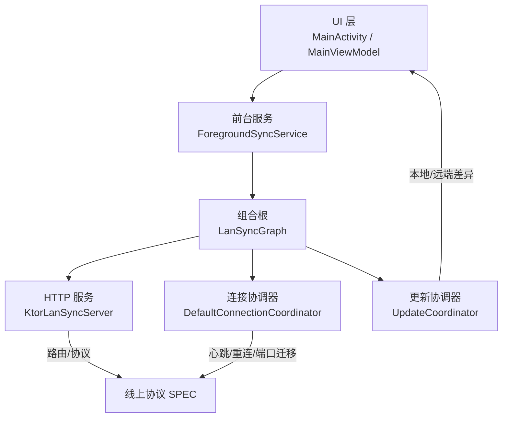
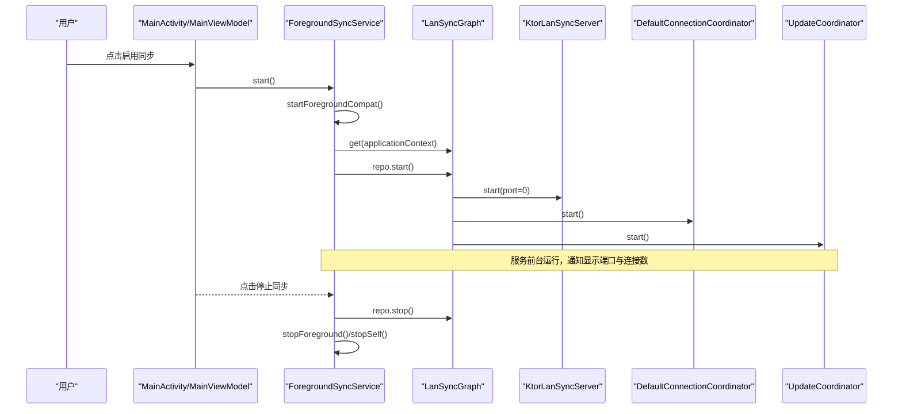
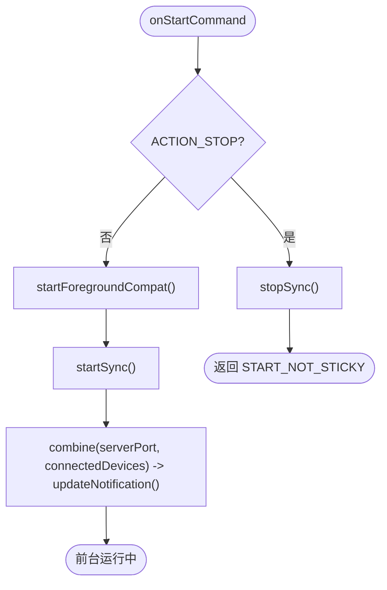
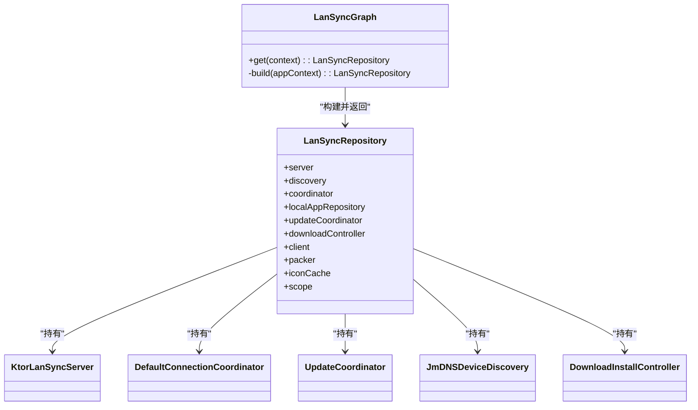
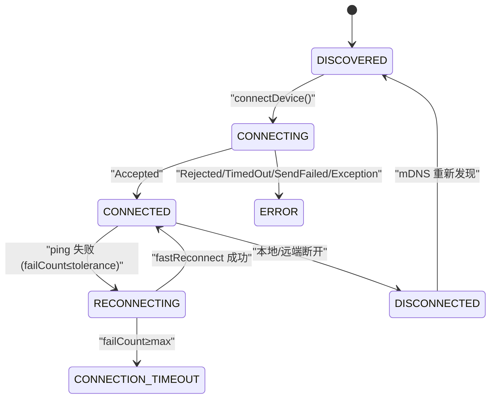
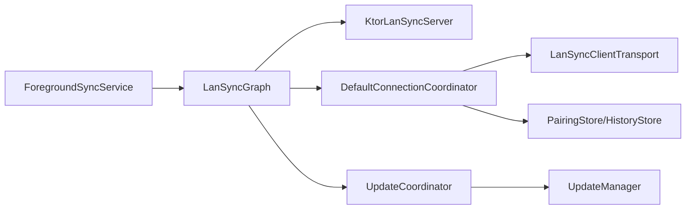

# 前台同步服务

<cite>
**本文引用的文件**
- [ForegroundSyncService.kt](file://app/src/main/java/com/lansync/app/service/ForegroundSyncService.kt)
- [LanSyncGraph.kt](file://app/src/main/java/com/lansync/app/data/repository/LanSyncGraph.kt)
- [KtorLanSyncServer.kt](file://app/src/main/java/com/lansync/app/data/server/KtorLanSyncServer.kt)
- [DefaultConnectionCoordinator.kt](file://app/src/main/java/com/lansync/app/data/connection/DefaultConnectionCoordinator.kt)
- [UpdateCoordinator.kt](file://app/src/main/java/com/lansync/app/data/sync/UpdateCoordinator.kt)
- [MainViewModel.kt](file://app/src/main/java/com/lansync/app/ui/viewmodel/MainViewModel.kt)
- [MainActivity.kt](file://app/src/main/java/com/lansync/app/MainActivity.kt)
- [ARCHITECTURE.md](file://docs/ARCHITECTURE.md)
- [SPEC.md](file://docs/SPEC.md)
</cite>

## 目录
1. [简介](#简介)
2. [项目结构](#项目结构)
3. [核心组件](#核心组件)
4. [架构总览](#架构总览)
5. [详细组件分析](#详细组件分析)
6. [依赖关系分析](#依赖关系分析)
7. [性能与可靠性](#性能与可靠性)
8. [故障排查指南](#故障排查指南)
9. [结论](#结论)
10. [附录](#附录)

## 简介
本文件聚焦“前台同步服务”：在 Android 前台以常驻通知运行，承载局域网发现、HTTP 服务、连接编排与更新推荐等后台能力，确保应用退后台或进程被杀后仍具备保活与恢复能力。该服务通过组合根（LanSyncGraph）装配各协调器与服务，对外暴露 start/stop 生命周期，并由 UI 层触发启动与停止。

## 项目结构
围绕前台同步服务的代码主要分布在 service、data（server、connection、sync、repository）、ui 三个层次：
- service：前台服务实现，负责通知、生命周期与协程作用域管理。
- data：服务与协调器的装配（LanSyncGraph），以及 HTTP 服务器、连接协调器、更新协调器等。
- ui：Activity 与 ViewModel 负责用户交互与状态聚合展示。

图表来源
- [ForegroundSyncService.kt:28-147](file://app/src/main/java/com/lansync/app/service/ForegroundSyncService.kt#L28-L147)
- [LanSyncGraph.kt:35-129](file://app/src/main/java/com/lansync/app/data/repository/LanSyncGraph.kt#L35-L129)
- [KtorLanSyncServer.kt:7-44](file://app/src/main/java/com/lansync/app/data/server/KtorLanSyncServer.kt#L7-L44)
- [DefaultConnectionCoordinator.kt:21-56](file://app/src/main/java/com/lansync/app/data/connection/DefaultConnectionCoordinator.kt#L21-L56)
- [UpdateCoordinator.kt:16-40](file://app/src/main/java/com/lansync/app/data/sync/UpdateCoordinator.kt#L16-L40)
- [SPEC.md:203-260](file://docs/SPEC.md#L203-L260)

章节来源
- [ForegroundSyncService.kt:28-147](file://app/src/main/java/com/lansync/app/service/ForegroundSyncService.kt#L28-L147)
- [LanSyncGraph.kt:35-129](file://app/src/main/java/com/lansync/app/data/repository/LanSyncGraph.kt#L35-L129)
- [ARCHITECTURE.md:246-274](file://docs/ARCHITECTURE.md#L246-L274)

## 核心组件
- 前台服务 ForegroundSyncService：承载 repo.start/stop，维护前台通知，监听端口与已连接设备数并刷新通知；支持 START_STICKY 与特殊用途前台类型。
- 组合根 LanSyncGraph：构建并持有单例对象图，注入 Server、Discovery、ConnectionCoordinator、UpdateCoordinator、DownloadInstallController 等，打破构造环。
- HTTP 服务 KtorLanSyncServer：基于 Netty 的嵌入式服务器，动态端口分配，路由逻辑由 lanSyncModule 提供，便于独立测试。
- 连接协调器 DefaultConnectionCoordinator：Actor 模型串行处理事件，实现连接状态机、心跳、端口迁移、陈旧清理与反向连接接受策略。
- 更新协调器 UpdateCoordinator：节流合并本地应用与已连接设备列表，计算可更新项与同步差异。
- UI 层 MainActivity/MainViewModel：触发服务启停、聚合仓库状态流、驱动下载/安装流程与批量操作。

章节来源
- [ForegroundSyncService.kt:28-147](file://app/src/main/java/com/lansync/app/service/ForegroundSyncService.kt#L28-L147)
- [LanSyncGraph.kt:35-129](file://app/src/main/java/com/lansync/app/data/repository/LanSyncGraph.kt#L35-L129)
- [KtorLanSyncServer.kt:7-44](file://app/src/main/java/com/lansync/app/data/server/KtorLanSyncServer.kt#L7-L44)
- [DefaultConnectionCoordinator.kt:21-56](file://app/src/main/java/com/lansync/app/data/connection/DefaultConnectionCoordinator.kt#L21-L56)
- [UpdateCoordinator.kt:16-40](file://app/src/main/java/com/lansync/app/data/sync/UpdateCoordinator.kt#L16-L40)
- [MainViewModel.kt:51-166](file://app/src/main/java/com/lansync/app/ui/viewmodel/MainViewModel.kt#L51-L166)

## 架构总览
前台同步服务作为进程级载体，将“服务 + 发现 + 心跳 + 更新推荐”从 Activity/ViewModel 中解耦，保证退后台存活与进程恢复后的自恢复能力。

图表来源
- [ForegroundSyncService.kt:43-86](file://app/src/main/java/com/lansync/app/service/ForegroundSyncService.kt#L43-L86)
- [LanSyncGraph.kt:52-127](file://app/src/main/java/com/lansync/app/data/repository/LanSyncGraph.kt#L52-L127)
- [KtorLanSyncServer.kt:24-43](file://app/src/main/java/com/lansync/app/data/server/KtorLanSyncServer.kt#L24-L43)
- [DefaultConnectionCoordinator.kt:58-76](file://app/src/main/java/com/lansync/app/data/connection/DefaultConnectionCoordinator.kt#L58-L76)
- [UpdateCoordinator.kt:45-62](file://app/src/main/java/com/lansync/app/data/sync/UpdateCoordinator.kt#L45-L62)

## 详细组件分析

### 前台服务 ForegroundSyncService
- 职责：前台启动/停止同步，创建通知渠道与通知，结合 Flow 实时刷新通知内容（端口、已连接数）。
- 关键点：
  - onStartCommand 处理 ACTION_STOP 与正常启动，返回 START_STICKY。
  - startForegroundCompat 兼容 API 34+ 的特殊用途前台服务类型。
  - startSync 获取 LanSyncGraph 实例，调用 repo.start，并在协程中 combine serverPort 与 connectedDevices 数量更新通知。
  - stopSync 取消观察 Job，调用 repo.stop，移除前台并结束服务。
  - 通知包含“打开主界面”和“停止同步”两个 PendingIntent。

图表来源
- [ForegroundSyncService.kt:43-86](file://app/src/main/java/com/lansync/app/service/ForegroundSyncService.kt#L43-L86)
- [ForegroundSyncService.kt:95-129](file://app/src/main/java/com/lansync/app/service/ForegroundSyncService.kt#L95-L129)

章节来源
- [ForegroundSyncService.kt:28-147](file://app/src/main/java/com/lansync/app/service/ForegroundSyncService.kt#L28-L147)

### 组合根 LanSyncGraph
- 职责：构建并缓存单例 LanSyncRepository，组装 LocalAppRepository、AppPacker、LanSyncClient、Transport、PairingStore、JmDNSDeviceDiscovery、ConnectionCoordinator、UpdateCoordinator、DownloadInstallController。
- 关键点：
  - 使用 late-bind 引用打破 coordinator ↔ server 构造环。
  - NotifyingPairingStore 将配对请求转发给 ConnectionCoordinator。
  - ServerApiDelegate 将路由回调映射到协调器与资源访问。
  - 统一 CoroutineScope（SupervisorJob + IO）供各组件使用。

图表来源
- [LanSyncGraph.kt:35-129](file://app/src/main/java/com/lansync/app/data/repository/LanSyncGraph.kt#L35-L129)

章节来源
- [LanSyncGraph.kt:35-129](file://app/src/main/java/com/lansync/app/data/repository/LanSyncGraph.kt#L35-L129)

### HTTP 服务 KtorLanSyncServer
- 职责：基于 Netty 的嵌入式服务器，port=0 动态分配，实际端口读取后缓存；路由逻辑由 lanSyncModule 提供，便于独立测试。
- 关键点：
  - start 时创建引擎并注册模块，记录 resolvedConnectors().first().port。
  - stop 时优雅关闭引擎并重置端口。
  - isRunning 与 getPort 暴露运行态与端口。

章节来源
- [KtorLanSyncServer.kt:7-44](file://app/src/main/java/com/lansync/app/data/server/KtorLanSyncServer.kt#L7-L44)

### 连接协调器 DefaultConnectionCoordinator
- 职责：以 Actor 模型串行消费事件，实现连接状态机、心跳三档阈值、端口迁移、陈旧清理与反向连接接受策略（TT3）。
- 关键点：
  - 所有可变状态仅在单一 Actor 协程内读写，避免并发竞态。
  - 连接尝试去重锁（connectingKeys），失败计数与快速重连。
  - 端口迁移保留 appList 与连接状态，迁移后重启心跳/同步。
  - 反向连接：命中配对历史自动接受；陌生设备保持 PENDING 弹窗；显式拒绝即时回 rejected。

图表来源
- [DefaultConnectionCoordinator.kt:178-255](file://app/src/main/java/com/lansync/app/data/connection/DefaultConnectionCoordinator.kt#L178-L255)
- [DefaultConnectionCoordinator.kt:257-316](file://app/src/main/java/com/lansync/app/data/connection/DefaultConnectionCoordinator.kt#L257-L316)
- [DefaultConnectionCoordinator.kt:324-375](file://app/src/main/java/com/lansync/app/data/connection/DefaultConnectionCoordinator.kt#L324-L375)

章节来源
- [DefaultConnectionCoordinator.kt:21-56](file://app/src/main/java/com/lansync/app/data/connection/DefaultConnectionCoordinator.kt#L21-L56)
- [DefaultConnectionCoordinator.kt:113-176](file://app/src/main/java/com/lansync/app/data/connection/DefaultConnectionCoordinator.kt#L113-L176)
- [DefaultConnectionCoordinator.kt:178-255](file://app/src/main/java/com/lansync/app/data/connection/DefaultConnectionCoordinator.kt#L178-L255)
- [DefaultConnectionCoordinator.kt:257-316](file://app/src/main/java/com/lansync/app/data/connection/DefaultConnectionCoordinator.kt#L257-L316)
- [DefaultConnectionCoordinator.kt:324-375](file://app/src/main/java/com/lansync/app/data/connection/DefaultConnectionCoordinator.kt#L324-L375)

### 更新协调器 UpdateCoordinator
- 职责：节流合并 localApps 与 connectedDevices，计算 availableUpdates 与 syncDiffs。
- 关键点：
  - 节流时间戳为 collect 协程局部状态，消除跨协程竞态。
  - 仅读上游 StateFlow，产出不可变列表。

章节来源
- [UpdateCoordinator.kt:16-40](file://app/src/main/java/com/lansync/app/data/sync/UpdateCoordinator.kt#L16-L40)
- [UpdateCoordinator.kt:45-82](file://app/src/main/java/com/lansync/app/data/sync/UpdateCoordinator.kt#L45-L82)

### UI 层与前台服务交互
- MainActivity/MainViewModel：
  - 首次启动若无本地应用缓存则触发初始扫描，完成后启动前台服务。
  - toggleRunning 根据当前状态调用 ForegroundSyncService.start/stop。
  - 聚合仓库状态流（本地应用、发现设备、已连接设备、更新、差异、下载进度、安装状态等）并展示。

章节来源
- [MainViewModel.kt:51-166](file://app/src/main/java/com/lansync/app/ui/viewmodel/MainViewModel.kt#L51-L166)
- [MainActivity.kt:26-106](file://app/src/main/java/com/lansync/app/MainActivity.kt#L26-L106)

## 依赖关系分析
- 前台服务依赖 LanSyncGraph 提供的 repo 进行 start/stop。
- LanSyncGraph 依赖各组件：KtorLanSyncServer、DefaultConnectionCoordinator、UpdateCoordinator、JmDNSDeviceDiscovery、DownloadInstallController。
- 连接协调器依赖 Transport（LanSyncClientTransport）与 PairingStore/HistoryStore。
- 更新协调器依赖 UpdateManager 与上游 StateFlow。

图表来源
- [ForegroundSyncService.kt:62-86](file://app/src/main/java/com/lansync/app/service/ForegroundSyncService.kt#L62-L86)
- [LanSyncGraph.kt:52-127](file://app/src/main/java/com/lansync/app/data/repository/LanSyncGraph.kt#L52-L127)
- [DefaultConnectionCoordinator.kt:30-37](file://app/src/main/java/com/lansync/app/data/connection/DefaultConnectionCoordinator.kt#L30-L37)
- [UpdateCoordinator.kt:27-34](file://app/src/main/java/com/lansync/app/data/sync/UpdateCoordinator.kt#L27-L34)

章节来源
- [LanSyncGraph.kt:52-127](file://app/src/main/java/com/lansync/app/data/repository/LanSyncGraph.kt#L52-L127)
- [DefaultConnectionCoordinator.kt:30-37](file://app/src/main/java/com/lansync/app/data/connection/DefaultConnectionCoordinator.kt#L30-L37)
- [UpdateCoordinator.kt:27-34](file://app/src/main/java/com/lansync/app/data/sync/UpdateCoordinator.kt#L27-L34)

## 性能与可靠性
- 前台服务使用 START_STICKY 与特殊用途前台类型，提升退后台存活率；通知常驻显示端口与连接数，提供“停止同步”快捷操作。
- 连接协调器采用 Actor 模型，所有状态变更收敛到单一协程，避免并发竞态；心跳三档阈值与快速重连提升稳定性。
- 更新协调器节流合并数据，减少频繁计算；下载与安装流程由 DownloadInstallController 统一管理。
- 服务端端口动态分配，客户端通过 mDNS 发现；错误响应体统一结构化（SPEC §7），避免泄露异常细节。

[本节为通用指导，不直接分析具体文件]

## 故障排查指南
- 服务未启动或立即退出：检查是否在前台交互时调用 startForegroundService；确认通知渠道创建与权限配置。
- 通知不更新：确认 repo.serverPort 与 repo.connectedDevices Flow 是否正常推送；检查 combine 与 updateNotification 调用路径。
- 连接不稳定或超时：查看心跳失败计数与快速重连结果；确认对端设备可达性与端口迁移情况。
- 反向连接被拒绝：确认配对历史存储是否正确写入；陌生设备应弹窗等待用户决策，拒绝时应即时返回 rejected。
- 下载校验失败：依据 SPEC §5.6，优先以 X-MD5 为准；缺失或校验失败会删除文件并返回错误。

章节来源
- [ForegroundSyncService.kt:53-86](file://app/src/main/java/com/lansync/app/service/ForegroundSyncService.kt#L53-L86)
- [DefaultConnectionCoordinator.kt:257-316](file://app/src/main/java/com/lansync/app/data/connection/DefaultConnectionCoordinator.kt#L257-L316)
- [SPEC.md:327-337](file://docs/SPEC.md#L327-L337)

## 结论
前台同步服务通过前台通知与进程级生命周期管理，将局域网发现、HTTP 服务、连接编排与更新推荐整合为稳定可靠的后台能力。配合 Actor 模型与节流合并，有效降低并发风险与计算开销；遵循冻结协议与错误规范，保障互操作性与安全性。后续可在 Hilt DI、静态检查与特征化测试方面进一步增强可维护性。

[本节为总结，不直接分析具体文件]

## 附录
- 关键常量与行为参考：
  - 前台服务类型与权限：API 34+ 需声明 specialUse 与对应权限。
  - 端口分配：port=0 动态分配，实际端口取自 resolvedConnectors().first().port。
  - 连接状态机参数：配对请求超时 15s、轮询总超时 30s、心跳间隔 20s、周期同步 120s、ping 超时 3s、容忍失败 1、最大失败 4。
  - 下载命名与 Content-Type：按 SPEC §4/§5.3 规则。

章节来源
- [ForegroundSyncService.kt:53-59](file://app/src/main/java/com/lansync/app/service/ForegroundSyncService.kt#L53-L59)
- [KtorLanSyncServer.kt:24-33](file://app/src/main/java/com/lansync/app/data/server/KtorLanSyncServer.kt#L24-L33)
- [SPEC.md:384-398](file://docs/SPEC.md#L384-L398)
- [SPEC.md:264-277](file://docs/SPEC.md#L264-L277)
- [SPEC.md:298-313](file://docs/SPEC.md#L298-L313)