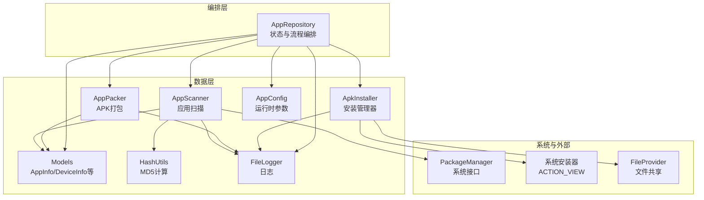
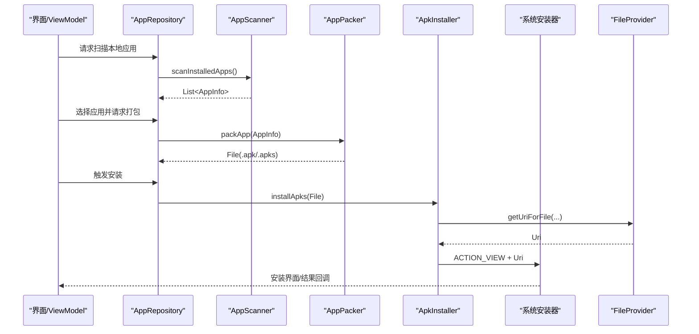
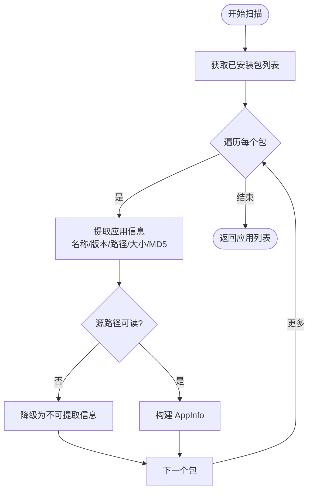
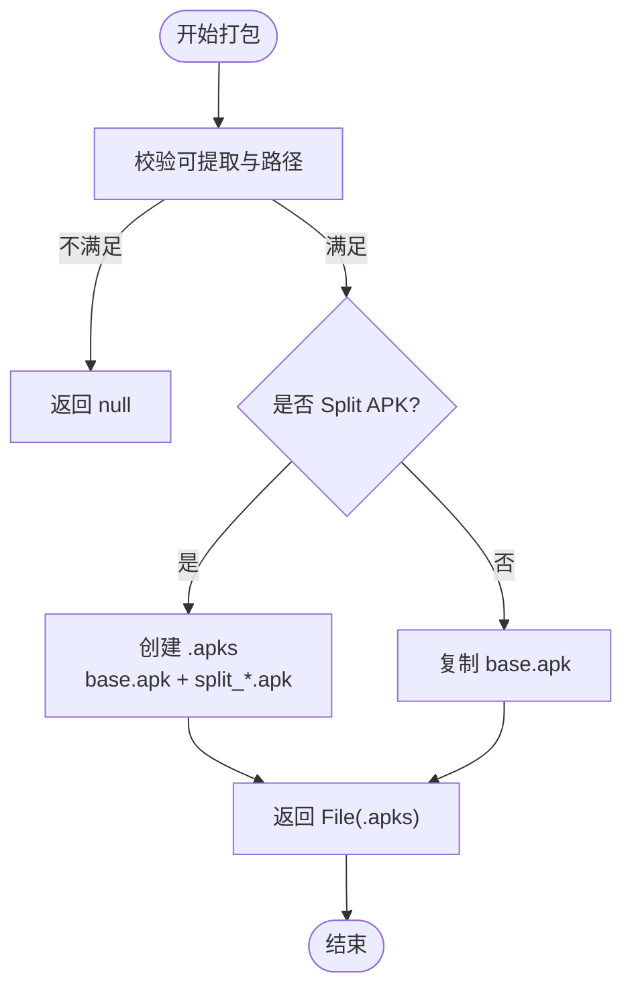
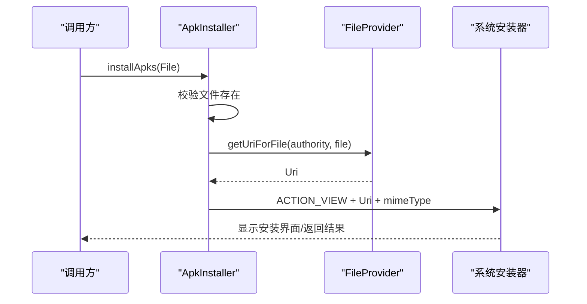
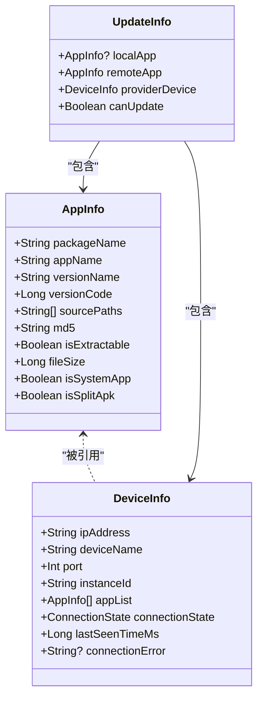
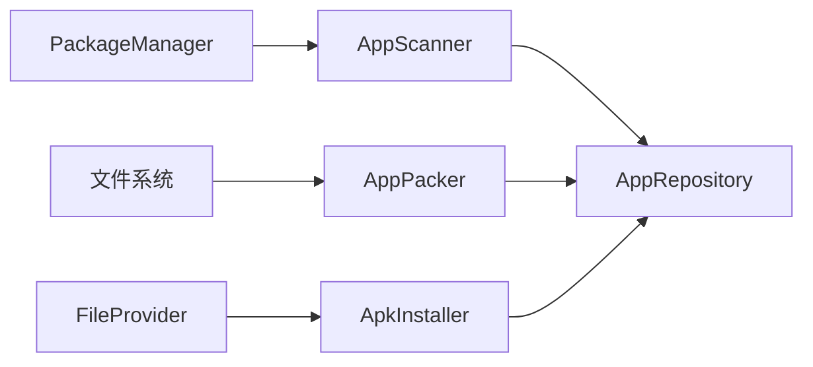
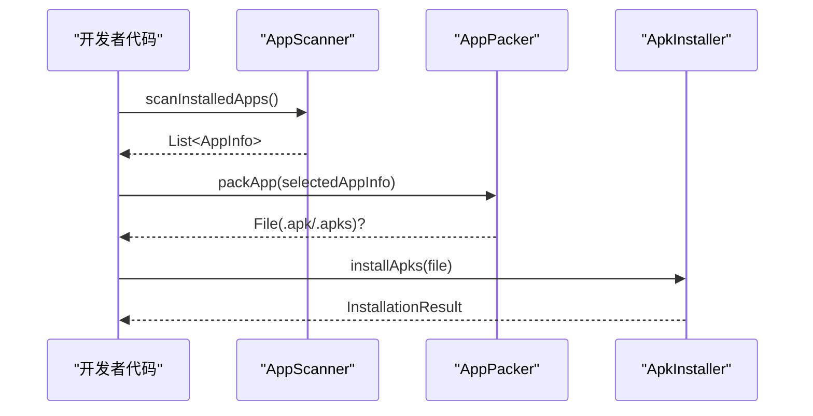

# 应用管理系统

<cite>
**本文引用的文件**
- [AppScanner.kt](file://app/src/main/java/com/lansync/app/data/scanner/AppScanner.kt)
- [AppPacker.kt](file://app/src/main/java/com/lansync/app/data/packer/AppPacker.kt)
- [ApkInstaller.kt](file://app/src/main/java/com/lansync/app/data/installer/ApkInstaller.kt)
- [Models.kt](file://app/src/main/java/com/lansync/app/data/model/Models.kt)
- [AppRepository.kt](file://app/src/main/java/com/lansync/app/data/repository/AppRepository.kt)
- [HashUtils.kt](file://app/src/main/java/com/lansync/app/data/HashUtils.kt)
- [AppConfig.kt](file://app/src/main/java/com/lansync/app/data/AppConfig.kt)
- [AndroidManifest.xml](file://app/src/main/AndroidManifest.xml)
- [file_paths.xml](file://app/src/main/res/xml/file_paths.xml)
- [FileLogger.kt](file://app/src/main/java/com/lansync/app/data/FileLogger.kt)
</cite>

## 目录
1. [简介](#简介)
2. [项目结构](#项目结构)
3. [核心组件](#核心组件)
4. [架构总览](#架构总览)
5. [详细组件分析](#详细组件分析)
6. [依赖关系分析](#依赖关系分析)
7. [性能与优化](#性能与优化)
8. [故障排查指南](#故障排查指南)
9. [结论](#结论)
10. [附录：API 参考与使用示例](#附录api-参考与使用示例)

## 简介
本技术文档面向 LanSync 的应用管理系统，聚焦三大核心能力：应用扫描、APK 打包与安装。通过 AppScanner 集成 Android Package Manager 完成已安装应用的枚举与信息提取；通过 AppPacker 将单包或 Split APK 打包为可传输的 .apk/.apks 文件；通过 ApkInstaller 调用系统安装器完成安装流程。文档同时覆盖权限要求、安全考虑、兼容性处理以及端到端工作流示例，帮助开发者理解并扩展应用管理功能。

## 项目结构
应用管理相关代码位于 data 层，按职责划分为 scanner、packer、installer、model 等子模块，并通过 repository 进行编排与状态管理。关键文件如下：
- 扫描：AppScanner.kt
- 打包：AppPacker.kt
- 安装：ApkInstaller.kt
- 数据模型：Models.kt（AppInfo 等）
- 仓库编排：AppRepository.kt
- 工具与配置：HashUtils.kt、AppConfig.kt、FileLogger.kt
- 权限与共享：AndroidManifest.xml、file_paths.xml

图表来源
- [AppScanner.kt:21-47](file://app/src/main/java/com/lansync/app/data/scanner/AppScanner.kt#L21-L47)
- [AppPacker.kt:20-56](file://app/src/main/java/com/lansync/app/data/packer/AppPacker.kt#L20-L56)
- [ApkInstaller.kt:12-45](file://app/src/main/java/com/lansync/app/data/installer/ApkInstaller.kt#L12-L45)
- [Models.kt:5-17](file://app/src/main/java/com/lansync/app/data/model/Models.kt#L5-L17)
- [AppRepository.kt:40-79](file://app/src/main/java/com/lansync/app/data/repository/AppRepository.kt#L40-L79)

章节来源
- [AppScanner.kt:21-47](file://app/src/main/java/com/lansync/app/data/scanner/AppScanner.kt#L21-L47)
- [AppPacker.kt:20-56](file://app/src/main/java/com/lansync/app/data/packer/AppPacker.kt#L20-L56)
- [ApkInstaller.kt:12-45](file://app/src/main/java/com/lansync/app/data/installer/ApkInstaller.kt#L12-L45)
- [Models.kt:5-17](file://app/src/main/java/com/lansync/app/data/model/Models.kt#L5-L17)
- [AppRepository.kt:40-79](file://app/src/main/java/com/lansync/app/data/repository/AppRepository.kt#L40-L79)

## 核心组件
- AppScanner：基于 PackageManager 获取已安装应用列表，提取应用名、版本、源路径、文件大小、是否系统应用、是否为 Split APK，并计算 MD5 用于去重与比对。对不可提取的应用提供降级信息构造。
- AppPacker：根据 AppInfo 判断单包或 Split APK，输出到缓存目录的 .apk 或 .apks 文件；支持读取多个 split 文件并压缩归档。
- ApkInstaller：通过 FileProvider 暴露本地文件 URI，调用系统安装器（ACTION_VIEW）完成安装；返回统一结果类型便于上层处理。
- Models：定义 AppInfo、DeviceInfo、UpdateInfo 等数据结构，贯穿扫描、同步、更新与安装流程。
- AppRepository：协调扫描、打包、安装与网络同步，维护设备连接与应用列表状态，提供统一的 StateFlow 对外暴露。

章节来源
- [AppScanner.kt:49-132](file://app/src/main/java/com/lansync/app/data/scanner/AppScanner.kt#L49-L132)
- [AppPacker.kt:58-112](file://app/src/main/java/com/lansync/app/data/packer/AppPacker.kt#L58-L112)
- [ApkInstaller.kt:47-59](file://app/src/main/java/com/lansync/app/data/installer/ApkInstaller.kt#L47-L59)
- [Models.kt:5-17](file://app/src/main/java/com/lansync/app/data/model/Models.kt#L5-L17)
- [AppRepository.kt:40-79](file://app/src/main/java/com/lansync/app/data/repository/AppRepository.kt#L40-L79)

## 架构总览
应用管理在数据层以“扫描→打包→安装”为主线，由 Repository 编排并驱动 UI 状态变化。系统权限与 Provider 保障跨进程文件共享与安装流程。

图表来源
- [AppRepository.kt:40-79](file://app/src/main/java/com/lansync/app/data/repository/AppRepository.kt#L40-L79)
- [AppScanner.kt:21-47](file://app/src/main/java/com/lansync/app/data/scanner/AppScanner.kt#L21-L47)
- [AppPacker.kt:20-56](file://app/src/main/java/com/lansync/app/data/packer/AppPacker.kt#L20-L56)
- [ApkInstaller.kt:12-45](file://app/src/main/java/com/lansync/app/data/installer/ApkInstaller.kt#L12-L45)
- [AndroidManifest.xml:48-56](file://app/src/main/AndroidManifest.xml#L48-L56)

## 详细组件分析

### AppScanner：应用扫描机制
- 集成方式：通过 PackageManager.getInstalledPackages 获取所有包，兼容高版本 API 使用 flags。
- 信息提取：从 ApplicationInfo 与 PackageInfo 中提取名称、版本、源路径、是否系统应用、Split APK 标志；计算总大小与 MD5。
- 权限检查与过滤：若无法读取源路径或抛出 SecurityException，则降级为不可提取模式，保留基础元信息。
- 并发与性能：在 IO 线程执行，避免阻塞主线程；对每个包进行异常隔离，确保整体扫描不中断。

图表来源
- [AppScanner.kt:21-47](file://app/src/main/java/com/lansync/app/data/scanner/AppScanner.kt#L21-L47)
- [AppScanner.kt:49-132](file://app/src/main/java/com/lansync/app/data/scanner/AppScanner.kt#L49-L132)

章节来源
- [AppScanner.kt:21-47](file://app/src/main/java/com/lansync/app/data/scanner/AppScanner.kt#L21-L47)
- [AppScanner.kt:49-132](file://app/src/main/java/com/lansync/app/data/scanner/AppScanner.kt#L49-L132)
- [HashUtils.kt:16-24](file://app/src/main/java/com/lansync/app/data/HashUtils.kt#L16-L24)

### AppPacker：APK 打包处理
- 输入校验：仅对可提取且存在源路径的应用进行打包。
- 单包处理：直接复制 base.apk 到缓存目录。
- Split APK 处理：将 base.apk 与 split_*.apk 写入 Zip 输出流，命名为 base.apk/split_N.apk，形成 .apks。
- 错误处理：捕获安全与 IO 异常，记录日志并清理失败产物。
- 缓存管理：提供 clearCache 方法清理 apks 目录。

图表来源
- [AppPacker.kt:20-56](file://app/src/main/java/com/lansync/app/data/packer/AppPacker.kt#L20-L56)
- [AppPacker.kt:58-112](file://app/src/main/java/com/lansync/app/data/packer/AppPacker.kt#L58-L112)

章节来源
- [AppPacker.kt:20-56](file://app/src/main/java/com/lansync/app/data/packer/AppPacker.kt#L20-L56)
- [AppPacker.kt:58-112](file://app/src/main/java/com/lansync/app/data/packer/AppPacker.kt#L58-L112)

### ApkInstaller：安装管理器实现
- 安装入口：installApks(file) 接收本地文件，校验存在性后通过 FileProvider 生成 URI。
- MIME 类型：根据后缀区分 .apks 与 .apk，设置合适的 mimeType。
- 系统调用：构造 ACTION_VIEW Intent，附加读权限标记，启动系统安装器。
- 结果回调：封装为 InstallationResult.Success/Error，便于上层处理。
- 权限与共享：依赖 Manifest 中声明的 FileProvider 与 file_paths.xml 暴露缓存目录。

图表来源
- [ApkInstaller.kt:12-45](file://app/src/main/java/com/lansync/app/data/installer/ApkInstaller.kt#L12-L45)
- [AndroidManifest.xml:48-56](file://app/src/main/AndroidManifest.xml#L48-L56)
- [file_paths.xml:1-6](file://app/src/main/res/xml/file_paths.xml#L1-L6)

章节来源
- [ApkInstaller.kt:12-45](file://app/src/main/java/com/lansync/app/data/installer/ApkInstaller.kt#L12-L45)
- [AndroidManifest.xml:48-56](file://app/src/main/AndroidManifest.xml#L48-L56)
- [file_paths.xml:1-6](file://app/src/main/res/xml/file_paths.xml#L1-L6)

### 数据模型与状态流转
- AppInfo：承载包名、应用名、版本、源路径、MD5、是否可提取、文件大小、是否系统应用、是否 Split APK。
- DeviceInfo/UpdateInfo/SyncDiff：用于远程设备发现、更新检测与差异对比。
- Repository 状态：通过 StateFlow 暴露本地应用列表、设备连接状态、可用更新、下载进度、安装状态等。

图表来源
- [Models.kt:5-17](file://app/src/main/java/com/lansync/app/data/model/Models.kt#L5-L17)
- [Models.kt:29-57](file://app/src/main/java/com/lansync/app/data/model/Models.kt#L29-L57)

章节来源
- [Models.kt:5-17](file://app/src/main/java/com/lansync/app/data/model/Models.kt#L5-L17)
- [Models.kt:29-57](file://app/src/main/java/com/lansync/app/data/model/Models.kt#L29-L57)

## 依赖关系分析
- AppScanner 依赖 PackageManager 与 HashUtils，输出 AppInfo。
- AppPacker 依赖文件系统与 ZipOutputStream，输出 .apk/.apks。
- ApkInstaller 依赖 FileProvider 与系统安装器，输出 InstallationResult。
- AppRepository 组合上述组件，管理生命周期与状态流，并与网络模块交互。

图表来源
- [AppScanner.kt:21-47](file://app/src/main/java/com/lansync/app/data/scanner/AppScanner.kt#L21-L47)
- [AppPacker.kt:20-56](file://app/src/main/java/com/lansync/app/data/packer/AppPacker.kt#L20-L56)
- [ApkInstaller.kt:12-45](file://app/src/main/java/com/lansync/app/data/installer/ApkInstaller.kt#L12-L45)
- [AppRepository.kt:40-79](file://app/src/main/java/com/lansync/app/data/repository/AppRepository.kt#L40-L79)

章节来源
- [AppRepository.kt:40-79](file://app/src/main/java/com/lansync/app/data/repository/AppRepository.kt#L40-L79)

## 性能与优化
- 扫描性能：在 IO 线程执行，逐包异常隔离，避免单个包失败影响整体；对不可提取应用快速降级。
- 打包性能：采用 8KB 缓冲流式读写，减少内存占用；Split APK 使用 ZipOutputStream 顺序写入，避免额外解压开销。
- 安装性能：通过 FileProvider 传递 URI，避免大文件拷贝；MIME 类型精确匹配提升系统安装器识别效率。
- 资源管理：提供 clearCache 清理临时文件，防止缓存膨胀；日志轮转控制磁盘占用。

[本节为通用性能建议，无需特定文件来源]

## 故障排查指南
- 扫描不到应用：确认已声明 QUERY_ALL_PACKAGES 权限；检查目标应用是否可提取源路径。
- 打包失败：检查源路径可读性与权限；查看日志中的 SecurityException 或 IO 异常；确认缓存目录空间充足。
- 安装失败：确认 FileProvider 已正确声明且 file_paths.xml 包含 apks 目录；检查系统是否有安装器响应；留意 .apks 的 MIME 类型。
- 日志定位：使用 FileLogger 输出的调试日志，关注 ERROR/WARN 级别信息与堆栈片段。

章节来源
- [AndroidManifest.xml:4-12](file://app/src/main/AndroidManifest.xml#L4-L12)
- [file_paths.xml:1-6](file://app/src/main/res/xml/file_paths.xml#L1-L6)
- [FileLogger.kt:90-104](file://app/src/main/java/com/lansync/app/data/FileLogger.kt#L90-L104)

## 结论
LanSync 的应用管理系统以清晰的分层与职责划分实现了从扫描、打包到安装的完整闭环。AppScanner 可靠地提取应用元数据与源路径，AppPacker 高效处理单包与 Split APK，ApkInstaller 借助系统安装器完成安装。配合 Repository 的状态管理与日志体系，开发者可在此基础上扩展更丰富的应用分发与同步能力。

[本节为总结性内容，无需特定文件来源]

## 附录：API 参考与使用示例

### 核心 API 说明
- AppScanner.scanInstalledApps(): 异步扫描已安装应用，返回 List<AppInfo>。
  - 参数：无（内部持有 Context）
  - 返回值：List<AppInfo>
  - 注意：在 IO 线程执行；不可提取的应用会保留基础元信息但无源路径。
- AppPacker.packApp(appInfo): 将应用打包为 .apk 或 .apks。
  - 参数：AppInfo
  - 返回值：File?（成功返回文件路径，失败返回 null）
  - 注意：仅对可提取且有源路径的应用有效；Split APK 会生成 .apks。
- ApkInstaller.installApks(file): 启动系统安装器安装本地文件。
  - 参数：File（.apk 或 .apks）
  - 返回值：InstallationResult（Success 或 Error）
  - 注意：需要 FileProvider 与相应权限；.apks 的 MIME 类型为 application/zip。

章节来源
- [AppScanner.kt:21-47](file://app/src/main/java/com/lansync/app/data/scanner/AppScanner.kt#L21-L47)
- [AppPacker.kt:20-56](file://app/src/main/java/com/lansync/app/data/packer/AppPacker.kt#L20-L56)
- [ApkInstaller.kt:12-45](file://app/src/main/java/com/lansync/app/data/installer/ApkInstaller.kt#L12-L45)

### 使用示例：端到端工作流
- 步骤一：调用 AppScanner.scanInstalledApps() 获取本地应用列表。
- 步骤二：选择目标应用，调用 AppPacker.packApp(appInfo) 生成 .apk/.apks。
- 步骤三：调用 ApkInstaller.installApks(file) 启动系统安装器。
- 步骤四：根据 InstallationResult 处理成功或错误分支。

图表来源
- [AppScanner.kt:21-47](file://app/src/main/java/com/lansync/app/data/scanner/AppScanner.kt#L21-L47)
- [AppPacker.kt:20-56](file://app/src/main/java/com/lansync/app/data/packer/AppPacker.kt#L20-L56)
- [ApkInstaller.kt:12-45](file://app/src/main/java/com/lansync/app/data/installer/ApkInstaller.kt#L12-L45)

### 权限与安全
- 必要权限：
  - INTERNET、ACCESS_NETWORK_STATE、ACCESS_WIFI_STATE、CHANGE_WIFI_STATE、CHANGE_WIFI_MULTICAST_STATE、NEARBY_WIFI_DEVICES（neverForLocation）、QUERY_ALL_PACKAGES。
  - 位置权限（ACCESS_FINE_LOCATION/ACCESS_COARSE_LOCATION）用于局域网发现。
- 文件共享：
  - 通过 FileProvider 暴露缓存目录下的 apks 与 downloads 路径，需确保 file_paths.xml 配置正确。
- 安全考虑：
  - 仅对可提取的应用进行打包，避免访问受限路径。
  - 安装过程交由系统安装器处理，遵循系统安全策略。
  - 日志中包含敏感信息时注意脱敏与最小化输出。

章节来源
- [AndroidManifest.xml:4-12](file://app/src/main/AndroidManifest.xml#L4-L12)
- [AndroidManifest.xml:48-56](file://app/src/main/AndroidManifest.xml#L48-L56)
- [file_paths.xml:1-6](file://app/src/main/res/xml/file_paths.xml#L1-L6)

### 兼容性处理
- 高版本 API：使用 PackageInfoFlags 兼容 TIRAMISU 及以上版本。
- Split APK：自动识别并打包为 .apks，适配现代应用分发格式。
- 不可提取应用：降级为只读元信息，保证扫描鲁棒性。

章节来源
- [AppScanner.kt:21-47](file://app/src/main/java/com/lansync/app/data/scanner/AppScanner.kt#L21-L47)
- [AppPacker.kt:31-56](file://app/src/main/java/com/lansync/app/data/packer/AppPacker.kt#L31-L56)