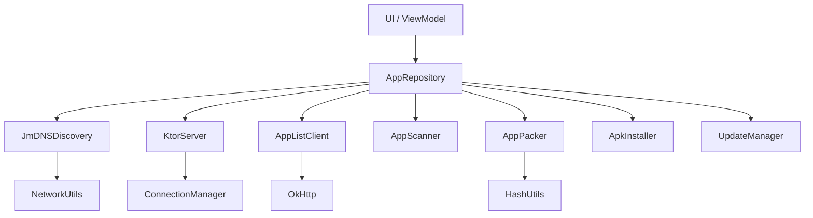
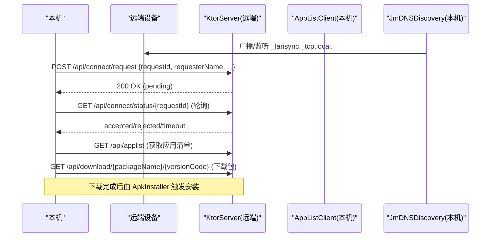
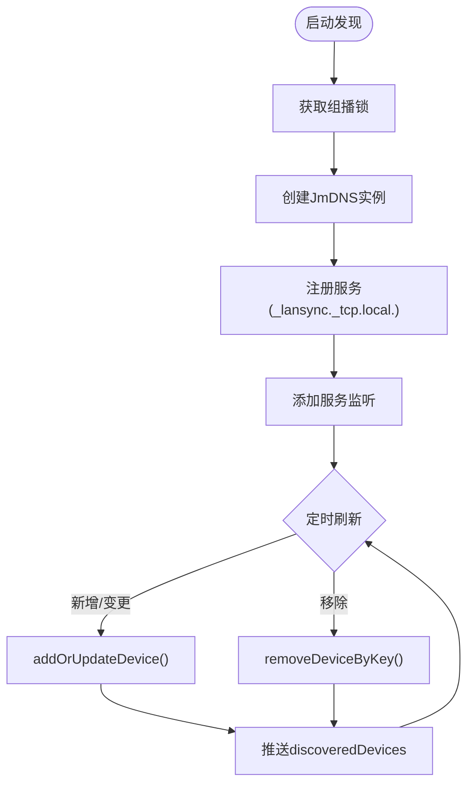
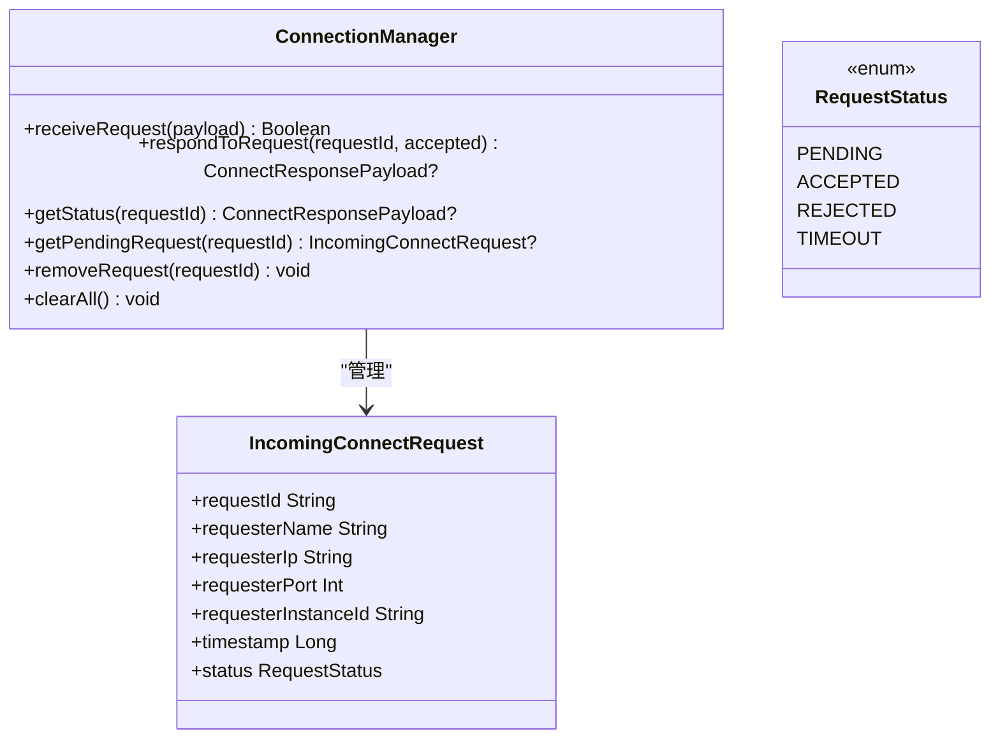
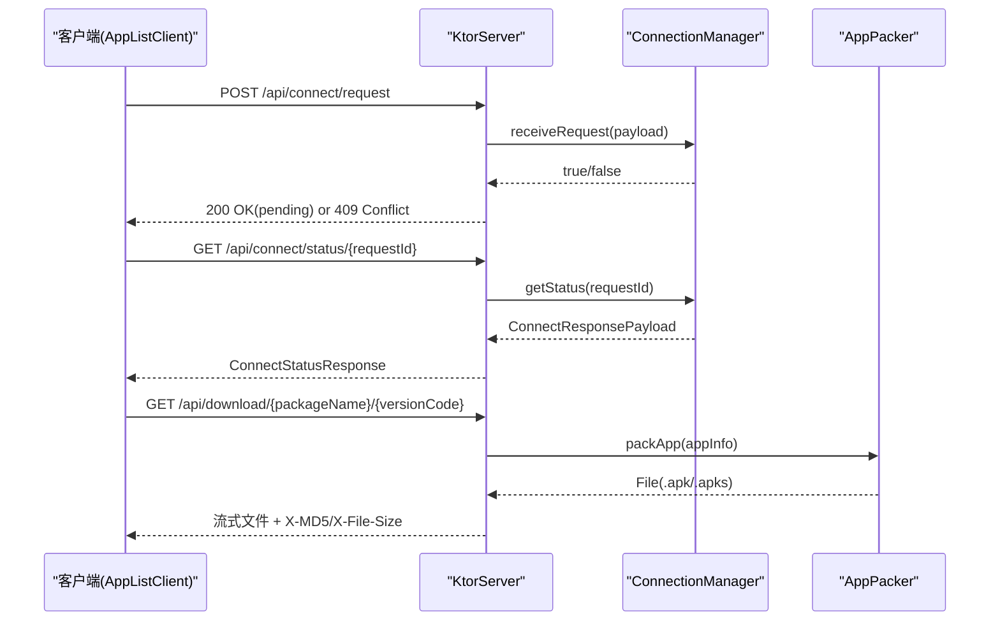
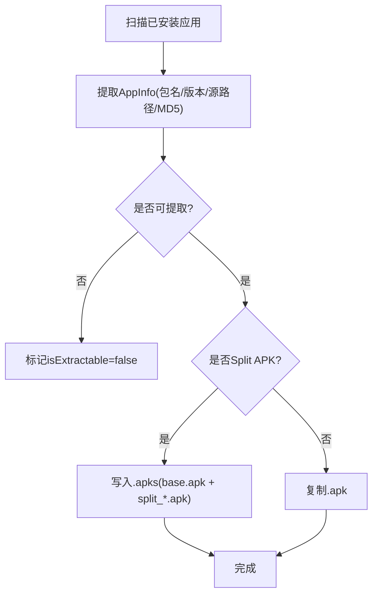
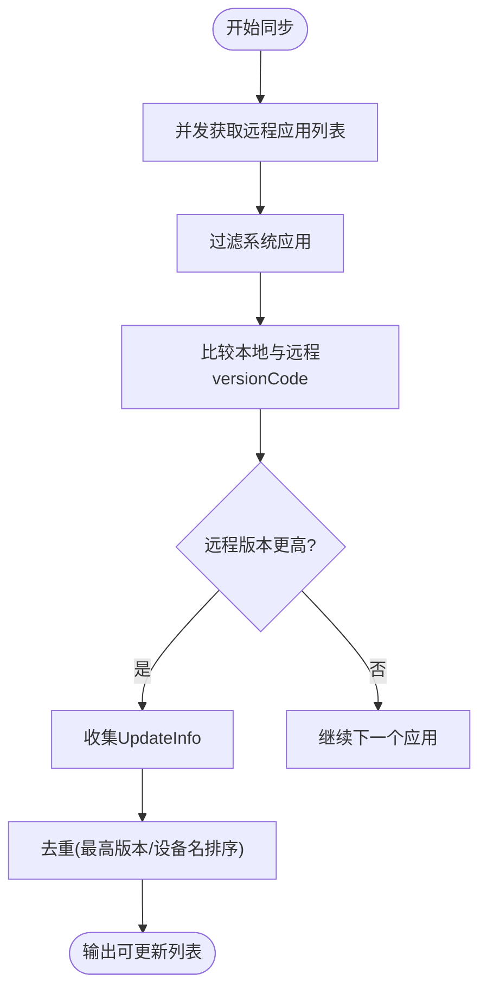
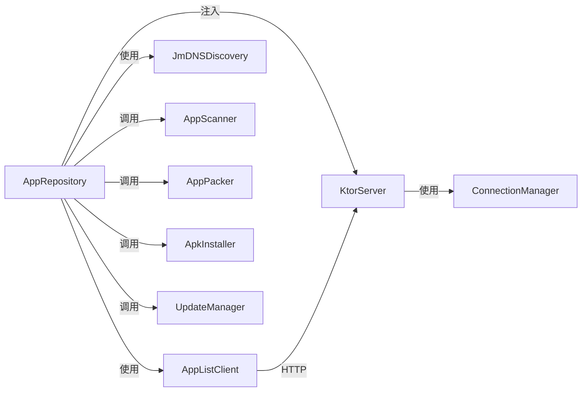

# 核心功能模块

<cite>
**本文引用的文件**
- [JmDNSDiscovery.kt](file://app/src/main/java/com/lansync/app/data/discovery/JmDNSDiscovery.kt)
- [ConnectionManager.kt](file://app/src/main/java/com/lansync/app/data/connection/ConnectionManager.kt)
- [KtorServer.kt](file://app/src/main/java/com/lansync/app/data/server/KtorServer.kt)
- [AppScanner.kt](file://app/src/main/java/com/lansync/app/data/scanner/AppScanner.kt)
- [AppPacker.kt](file://app/src/main/java/com/lansync/app/data/packer/AppPacker.kt)
- [ApkInstaller.kt](file://app/src/main/java/com/lansync/app/data/installer/ApkInstaller.kt)
- [UpdateManager.kt](file://app/src/main/java/com/lansync/app/data/update/UpdateManager.kt)
- [Models.kt](file://app/src/main/java/com/lansync/app/data/model/Models.kt)
- [AppRepository.kt](file://app/src/main/java/com/lansync/app/data/repository/AppRepository.kt)
- [AppListClient.kt](file://app/src/main/java/com/lansync/app/data/client/AppListClient.kt)
- [AppConfig.kt](file://app/src/main/java/com/lansync/app/data/AppConfig.kt)
- [HashUtils.kt](file://app/src/main/java/com/lansync/app/data/HashUtils.kt)
- [NetworkUtils.kt](file://app/src/main/java/com/lansync/app/data/NetworkUtils.kt)
- [MainViewModel.kt](file://app/src/main/java/com/lansync/app/ui/viewmodel/MainViewModel.kt)
</cite>

## 目录
1. [简介](#简介)
2. [项目结构](#项目结构)
3. [核心组件](#核心组件)
4. [架构总览](#架构总览)
5. [详细组件分析](#详细组件分析)
6. [依赖关系分析](#依赖关系分析)
7. [性能考量](#性能考量)
8. [故障排查指南](#故障排查指南)
9. [结论](#结论)
10. [附录：API与配置](#附录api与配置)

## 简介
本技术文档聚焦 LanSync 的核心功能模块，覆盖设备发现（基于 mDNS）、连接管理、网络通信层（Ktor 服务器）、应用扫描与打包、APK 安装管理以及版本同步算法。文档从实现原理、API 接口、配置选项、使用示例到错误处理、异常恢复与性能优化进行系统化说明，并给出关键调用路径的代码片段位置，帮助开发者理解与扩展这些能力。

## 项目结构
LanSync 采用分层模块化组织：
- 数据层：设备发现、连接管理、网络客户端、服务端、扫描与打包、安装器、更新管理器、模型与工具类
- 业务编排：仓库 AppRepository 聚合各子模块，协调状态流转与生命周期
- UI 层：ViewModel 暴露 StateFlow 给界面消费

图表来源
- [AppRepository.kt:40-80](file://app/src/main/java/com/lansync/app/data/repository/AppRepository.kt#L40-L80)
- [KtorServer.kt:30-65](file://app/src/main/java/com/lansync/app/data/server/KtorServer.kt#L30-L65)
- [AppListClient.kt:30-56](file://app/src/main/java/com/lansync/app/data/client/AppListClient.kt#L30-L56)
- [JmDNSDiscovery.kt:23-43](file://app/src/main/java/com/lansync/app/data/discovery/JmDNSDiscovery.kt#L23-L43)

章节来源
- [AppRepository.kt:40-80](file://app/src/main/java/com/lansync/app/data/repository/AppRepository.kt#L40-L80)
- [MainViewModel.kt:47-82](file://app/src/main/java/com/lansync/app/ui/viewmodel/MainViewModel.kt#L47-L82)

## 核心组件
- 设备发现：JmDNSDiscovery 基于 mDNS 广播/组播注册与监听服务，维护本地实例 ID，周期性刷新设备列表
- 连接管理：ConnectionManager 维护待处理的连接请求、超时与响应，提供状态查询与清理
- 网络通信：KtorServer 暴露 REST API 用于设备发现后的握手、应用列表获取、文件下载、断开通知等；AppListClient 作为 HTTP 客户端封装所有远端交互
- 应用扫描与打包：AppScanner 扫描已安装应用并生成可传输的元数据；AppPacker 将单 APK 或 Split APK 打包为 .apk/.apks
- 安装管理：ApkInstaller 通过系统安装器打开安装包
- 版本同步：UpdateManager 对比本地与远程应用版本，计算可更新项并去重

章节来源
- [JmDNSDiscovery.kt:23-275](file://app/src/main/java/com/lansync/app/data/discovery/JmDNSDiscovery.kt#L23-L275)
- [ConnectionManager.kt:19-156](file://app/src/main/java/com/lansync/app/data/connection/ConnectionManager.kt#L19-L156)
- [KtorServer.kt:30-330](file://app/src/main/java/com/lansync/app/data/server/KtorServer.kt#L30-L330)
- [AppScanner.kt:15-134](file://app/src/main/java/com/lansync/app/data/scanner/AppScanner.kt#L15-L134)
- [AppPacker.kt:14-114](file://app/src/main/java/com/lansync/app/data/packer/AppPacker.kt#L14-L114)
- [ApkInstaller.kt:10-61](file://app/src/main/java/com/lansync/app/data/installer/ApkInstaller.kt#L10-L61)
- [UpdateManager.kt:12-104](file://app/src/main/java/com/lansync/app/data/update/UpdateManager.kt#L12-L104)

## 架构总览
整体流程：
- 启动后，AppRepository 启动 KtorServer 与 JmDNSDiscovery，开始监听与广播
- 设备间通过 mDNS 互相发现，随后通过 HTTP 握手建立连接（请求-响应-轮询）
- 连接成功后，定期心跳探测与增量同步应用列表
- 当检测到版本差异时，UpdateManager 计算可更新项，支持下载与安装

图表来源
- [KtorServer.kt:77-285](file://app/src/main/java/com/lansync/app/data/server/KtorServer.kt#L77-L285)
- [AppListClient.kt:62-133](file://app/src/main/java/com/lansync/app/data/client/AppListClient.kt#L62-L133)
- [JmDNSDiscovery.kt:60-117](file://app/src/main/java/com/lansync/app/data/discovery/JmDNSDiscovery.kt#L60-L117)

## 详细组件分析

### 设备发现机制（mDNS）
- 实现要点
  - 使用 JmDNS 创建实例，绑定本地 IP 与主机名，注册服务类型为 _lansync._tcp.local.，携带 deviceName 与 instanceId 属性
  - 维护设备映射表，按 IP+Port 去重，过滤自身实例，仅保留非空 instanceId 的设备
  - 周期性刷新服务列表，移除离线设备
  - 持久化 instanceId 避免重启后重复识别
- 关键流程
  - startDiscovery(port) 初始化并开启监听
  - stopDiscovery() 注销服务、关闭 JmDNS、释放组播锁
  - discoveredDevices Flow 推送设备列表变化
- 错误处理
  - 捕获异常并记录日志，确保资源释放
  - 忽略无 instanceId 或非 LanSync 设备
- 性能优化
  - 60 秒刷新间隔，避免频繁广播
  - 仅 IPv4 地址优先选择，减少无效条目

图表来源
- [JmDNSDiscovery.kt:60-117](file://app/src/main/java/com/lansync/app/data/discovery/JmDNSDiscovery.kt#L60-L117)
- [JmDNSDiscovery.kt:119-182](file://app/src/main/java/com/lansync/app/data/discovery/JmDNSDiscovery.kt#L119-L182)
- [JmDNSDiscovery.kt:200-262](file://app/src/main/java/com/lansync/app/data/discovery/JmDNSDiscovery.kt#L200-L262)

章节来源
- [JmDNSDiscovery.kt:23-275](file://app/src/main/java/com/lansync/app/data/discovery/JmDNSDiscovery.kt#L23-L275)
- [NetworkUtils.kt:31-53](file://app/src/main/java/com/lansync/app/data/NetworkUtils.kt#L31-L53)

### 连接管理策略
- 职责
  - 接收连接请求，分配唯一 requestId，设置超时任务
  - 支持接受/拒绝响应，返回 ConnectResponsePayload
  - 提供状态查询与清理方法
- 超时与重试
  - REQUEST_TIMEOUT_MS=15s，超时自动标记 TIMEOUT
  - CONNECT_TIMEOUT_MS=30s，POLL_INTERVAL_MS=500ms 用于客户端轮询
- 并发安全
  - 使用 ConcurrentHashMap 存储待处理请求与超时任务
- 与 Ktor 集成
  - KtorServer 路由将请求转发至 ConnectionManager，并返回统一状态码

图表来源
- [ConnectionManager.kt:19-156](file://app/src/main/java/com/lansync/app/data/connection/ConnectionManager.kt#L19-L156)
- [Models.kt:87-101](file://app/src/main/java/com/lansync/app/data/model/Models.kt#L87-L101)

章节来源
- [ConnectionManager.kt:19-156](file://app/src/main/java/com/lansync/app/data/connection/ConnectionManager.kt#L19-L156)
- [Models.kt:69-101](file://app/src/main/java/com/lansync/app/data/model/Models.kt#L69-L101)

### 网络通信层（Ktor 服务器）
- 提供的 API
  - GET /api/ping：健康检查
  - GET /api/applist：返回本地应用列表（由 AppRepository 注入）
  - POST /api/connect/request：接收连接请求，交由 ConnectionManager 处理
  - GET /api/connect/status/{requestId}：轮询连接结果
  - POST /api/connect/response/{requestId}：对端响应接受/拒绝
  - GET /api/download/{packageName}[/versionCode]：下载应用包（支持单 APK 与 Split APK），附带 X-MD5、X-File-Size 头
  - POST /api/disconnect：远端主动断开通知
  - POST /api/refresh-applist：远端请求刷新应用列表
  - GET /api/deviceinfo：返回设备名称与版本
- 数据处理
  - JSON 序列化使用 kotlinx.serialization，宽松模式兼容未知字段
  - 大文件流式发送，避免内存峰值
- 错误处理
  - 参数校验失败返回 400
  - 未找到资源返回 404
  - 系统/受保护应用禁止提取返回 403
  - 打包失败返回 500

图表来源
- [KtorServer.kt:77-285](file://app/src/main/java/com/lansync/app/data/server/KtorServer.kt#L77-L285)
- [AppListClient.kt:62-133](file://app/src/main/java/com/lansync/app/data/client/AppListClient.kt#L62-L133)
- [AppPacker.kt:20-56](file://app/src/main/java/com/lansync/app/data/packer/AppPacker.kt#L20-L56)

章节来源
- [KtorServer.kt:30-330](file://app/src/main/java/com/lansync/app/data/server/KtorServer.kt#L30-L330)
- [AppListClient.kt:30-571](file://app/src/main/java/com/lansync/app/data/client/AppListClient.kt#L30-L571)

### 应用扫描与打包处理
- 应用扫描
  - 遍历已安装应用，提取包名、名称、版本、源路径、MD5、是否系统应用、是否 Split APK
  - 不可读或权限不足的应用标记为非可提取
- 打包处理
  - 单 APK：直接复制为 .apk
  - Split APK：压缩为 .apks，首包命名为 base.apk，后续 split_*.apk
  - 输出到缓存目录 apks，支持清理
- 错误处理
  - 捕获 SecurityException 与 IO 异常，记录日志并跳过问题文件
- 性能优化
  - 使用 8KB 缓冲流式读写，降低内存占用

图表来源
- [AppScanner.kt:21-93](file://app/src/main/java/com/lansync/app/data/scanner/AppScanner.kt#L21-L93)
- [AppPacker.kt:20-108](file://app/src/main/java/com/lansync/app/data/packer/AppPacker.kt#L20-L108)

章节来源
- [AppScanner.kt:15-134](file://app/src/main/java/com/lansync/app/data/scanner/AppScanner.kt#L15-L134)
- [AppPacker.kt:14-114](file://app/src/main/java/com/lansync/app/data/packer/AppPacker.kt#L14-L114)
- [HashUtils.kt:6-54](file://app/src/main/java/com/lansync/app/data/HashUtils.kt#L6-L54)

### APK 安装管理
- 流程
  - 通过 FileProvider 生成 URI，设置 MIME 类型（.apks -> application/zip，.apk -> package-archive）
  - 启动系统安装器 Intent，授予读取权限
  - 若无可用安装器则返回错误
- 错误处理
  - 文件不存在、无安装器、异常均返回错误信息
- 使用建议
  - 在 UI 层提示用户确认安装，并在安装完成后刷新状态

章节来源
- [ApkInstaller.kt:10-61](file://app/src/main/java/com/lansync/app/data/installer/ApkInstaller.kt#L10-L61)

### 版本同步算法
- 算法步骤
  - 并行拉取多台设备的远程应用列表
  - 过滤系统应用，比较本地与远程 versionCode
  - 若远程版本更高，生成 UpdateInfo
  - 去重：同一 packageName 只保留最高版本，版本相同则选择设备名更小的设备
- 性能优化
  - 使用协程 async/awaitAll 并发拉取
  - 节流更新计算，避免频繁重算
- 与仓库协作
  - AppRepository 组合本地应用与已连接设备，自动触发更新计算与差异计算

图表来源
- [UpdateManager.kt:14-104](file://app/src/main/java/com/lansync/app/data/update/UpdateManager.kt#L14-L104)
- [AppRepository.kt:761-796](file://app/src/main/java/com/lansync/app/data/repository/AppRepository.kt#L761-L796)

章节来源
- [UpdateManager.kt:12-104](file://app/src/main/java/com/lansync/app/data/update/UpdateManager.kt#L12-L104)
- [AppRepository.kt:761-796](file://app/src/main/java/com/lansync/app/data/repository/AppRepository.kt#L761-L796)

## 依赖关系分析
- 耦合度
  - AppRepository 作为编排中心，耦合度高但职责清晰，便于测试替换
  - KtorServer 通过回调注入 appListProvider 与 packer，降低直接依赖
  - AppListClient 与 KtorServer 通过约定好的 REST API 解耦
- 外部依赖
  - OkHttp 负责 HTTP 通信
  - JmDNS 负责局域网设备发现
  - Android PackageManager/FileProvider 用于应用信息与安装
- 循环依赖
  - 未发现循环依赖；模块间通过接口与回调解耦

图表来源
- [AppRepository.kt:40-80](file://app/src/main/java/com/lansync/app/data/repository/AppRepository.kt#L40-L80)
- [KtorServer.kt:30-65](file://app/src/main/java/com/lansync/app/data/server/KtorServer.kt#L30-L65)
- [AppListClient.kt:30-56](file://app/src/main/java/com/lansync/app/data/client/AppListClient.kt#L30-L56)

章节来源
- [AppRepository.kt:40-80](file://app/src/main/java/com/lansync/app/data/repository/AppRepository.kt#L40-L80)

## 性能考量
- 网络层
  - OkHttpClient 连接池复用，合理设置超时与保活时间
  - 下载使用独立客户端，长超时与大缓冲区提升稳定性
- 设备发现
  - 60 秒刷新间隔，避免过多广播
  - 仅 IPv4 地址优先，减少无效条目
- 应用扫描与打包
  - 流式 I/O，8KB 缓冲，避免 OOM
  - Split APK 压缩写入，减少传输体积
- 同步与心跳
  - 心跳间隔与容忍次数可配置，快速重连与超时判定
  - 更新计算节流，避免频繁重算

[本节为通用性能指导，不直接分析具体文件]

## 故障排查指南
- 常见问题
  - 无法发现设备：检查组播锁是否成功获取、防火墙/路由器是否允许 UDP 多播、设备是否在同一局域网
  - 连接被拒绝：检查对方 ConnectionManager 是否就绪、请求是否重复、是否已被处理
  - 下载失败：检查 X-MD5 校验是否通过、目标应用是否为系统/受保护应用
  - 安装失败：确认存在系统安装器、URI 权限是否正确授予
- 日志定位
  - 关注 KtorServer、ConnectionManager、AppListClient、AppPacker 的日志输出
  - 使用 FileLogger 查看关键节点（如连接请求、轮询结果、打包过程）
- 恢复策略
  - 心跳失败逐步降级为 RECONNECTING，超过阈值标记 CONNECTION_TIMEOUT
  - 端口迁移时自动迁移连接状态与应用列表，保持用户体验一致

章节来源
- [KtorServer.kt:88-175](file://app/src/main/java/com/lansync/app/data/server/KtorServer.kt#L88-L175)
- [ConnectionManager.kt:29-140](file://app/src/main/java/com/lansync/app/data/connection/ConnectionManager.kt#L29-L140)
- [AppListClient.kt:393-462](file://app/src/main/java/com/lansync/app/data/client/AppListClient.kt#L393-L462)
- [AppRepository.kt:179-249](file://app/src/main/java/com/lansync/app/data/repository/AppRepository.kt#L179-L249)

## 结论
LanSync 通过 mDNS 实现轻量级设备发现，结合 Ktor 提供的稳定 HTTP 服务与 AppListClient 的健壮网络层，构建了完整的局域网应用共享与同步方案。模块间职责清晰、耦合适度，具备较好的可扩展性与可维护性。配合心跳与超时机制、节流与并发优化，能够在复杂网络环境下保持稳定运行。

[本节为总结性内容，不直接分析具体文件]

## 附录：API与配置

### 关键 API 定义
- 连接握手
  - POST /api/connect/request：提交连接请求，返回 pending 状态
  - GET /api/connect/status/{requestId}：轮询连接结果（accepted/rejected/timeout）
  - POST /api/connect/response/{requestId}：对端响应接受/拒绝
- 应用与文件
  - GET /api/applist：返回本地应用列表
  - GET /api/download/{packageName}[/versionCode]：下载应用包，返回 X-MD5、X-File-Size
- 设备管理
  - GET /api/ping：健康检查
  - POST /api/disconnect：远端主动断开
  - POST /api/refresh-applist：远端请求刷新应用列表
  - GET /api/deviceinfo：返回设备名称与版本

章节来源
- [KtorServer.kt:77-285](file://app/src/main/java/com/lansync/app/data/server/KtorServer.kt#L77-L285)
- [AppListClient.kt:62-133](file://app/src/main/java/com/lansync/app/data/client/AppListClient.kt#L62-L133)

### 配置选项
- AppConfig
  - heartbeatPingIntervalMs：心跳间隔
  - heartbeatSyncIntervalMs：同步间隔
  - heartbeatPingTolerance：心跳容忍次数
  - heartbeatPingMaxFailures：最大失败次数
  - updateRecalculationThrottleMs：更新计算节流
  - connectTimeoutMs：连接超时
  - pollIntervalMs：轮询间隔
  - fetchAppListMaxRetries：拉取应用列表最大重试次数
  - fetchAppListRetryDelayMs：拉取重试延迟
  - pingTimeoutMs：ping 超时

章节来源
- [AppConfig.kt:3-17](file://app/src/main/java/com/lansync/app/data/AppConfig.kt#L3-L17)

### 使用示例（代码片段路径）
- 启动服务与发现
  - [AppRepository.forceStartSync:624-647](file://app/src/main/java/com/lansync/app/data/repository/AppRepository.kt#L624-L647)
  - [JmDNSDiscovery.startDiscovery:60-86](file://app/src/main/java/com/lansync/app/data/discovery/JmDNSDiscovery.kt#L60-L86)
- 发起连接
  - [AppListClient.sendConnectRequest:62-102](file://app/src/main/java/com/lansync/app/data/client/AppListClient.kt#L62-L102)
  - [AppListClient.pollConnectStatus:104-133](file://app/src/main/java/com/lansync/app/data/client/AppListClient.kt#L104-L133)
- 下载应用
  - [AppListClient.downloadLatestApksFile:376-391](file://app/src/main/java/com/lansync/app/data/client/AppListClient.kt#L376-L391)
  - [KtorServer.sendZipFile:293-312](file://app/src/main/java/com/lansync/app/data/server/KtorServer.kt#L293-L312)
- 安装应用
  - [ApkInstaller.installApks:12-45](file://app/src/main/java/com/lansync/app/data/installer/ApkInstaller.kt#L12-L45)
- 版本同步
  - [UpdateManager.findUpdates:14-35](file://app/src/main/java/com/lansync/app/data/update/UpdateManager.kt#L14-L35)
  - [UpdateManager.deduplicateUpdates:81-102](file://app/src/main/java/com/lansync/app/data/update/UpdateManager.kt#L81-L102)