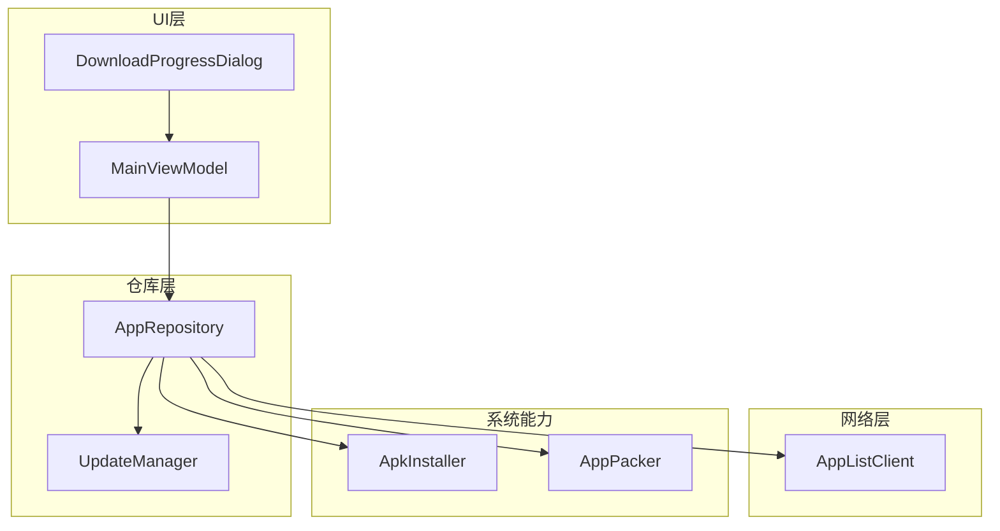
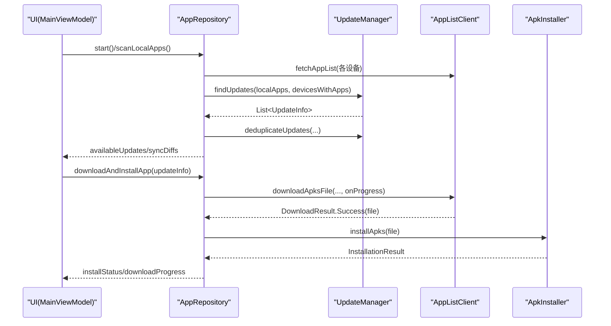
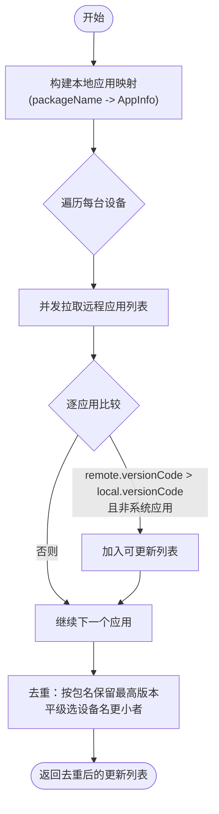
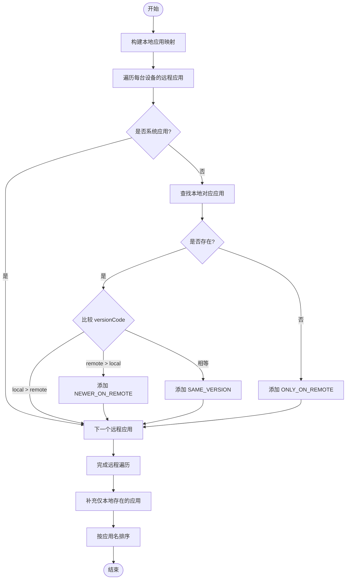
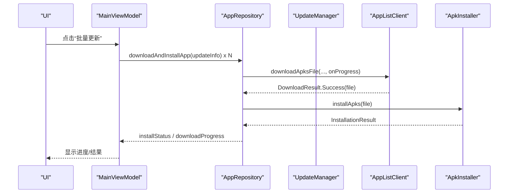
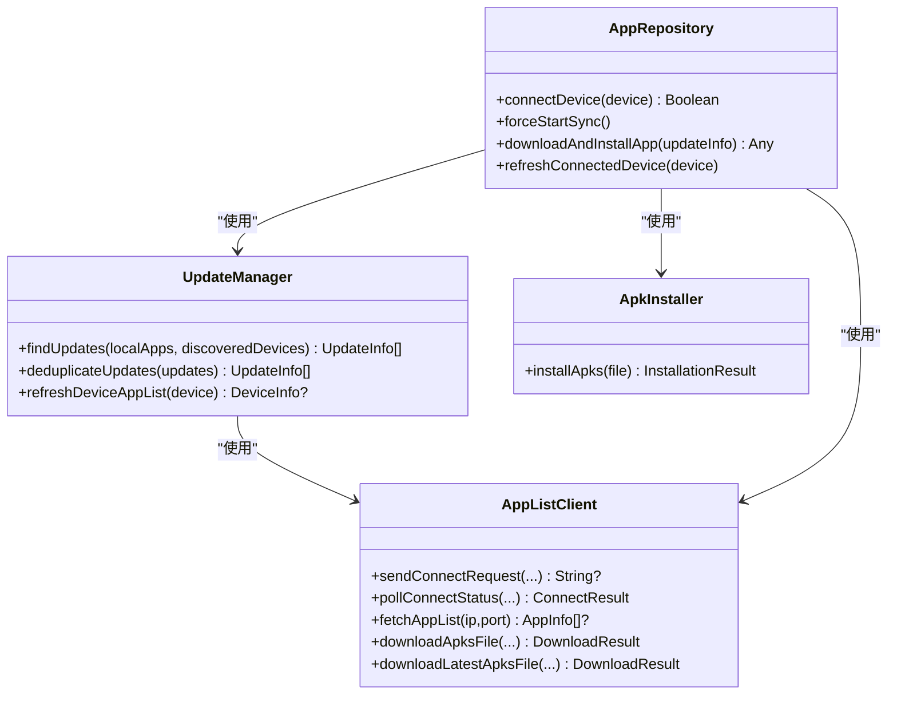

# 版本管理与同步

<cite>
**本文引用的文件**
- [UpdateManager.kt](file://app/src/main/java/com/lansync/app/data/update/UpdateManager.kt)
- [Models.kt](file://app/src/main/java/com/lansync/app/data/model/Models.kt)
- [AppRepository.kt](file://app/src/main/java/com/lansync/app/data/repository/AppRepository.kt)
- [AppListClient.kt](file://app/src/main/java/com/lansync/app/data/client/AppListClient.kt)
- [MainViewModel.kt](file://app/src/main/java/com/lansync/app/ui/viewmodel/MainViewModel.kt)
- [AppConfig.kt](file://app/src/main/java/com/lansync/app/data/AppConfig.kt)
- [ApkInstaller.kt](file://app/src/main/java/com/lansync/app/data/installer/ApkInstaller.kt)
- [AppPacker.kt](file://app/src/main/java/com/lansync/app/data/packer/AppPacker.kt)
- [DownloadProgressDialog.kt](file://app/src/main/java/com/lansync/app/ui/components/DownloadProgressDialog.kt)
- [REPORT.md](file://REPORT.md)
</cite>

## 目录
1. [简介](#简介)
2. [项目结构](#项目结构)
3. [核心组件](#核心组件)
4. [架构总览](#架构总览)
5. [详细组件分析](#详细组件分析)
6. [依赖关系分析](#依赖关系分析)
7. [性能与可靠性](#性能与可靠性)
8. [故障排查指南](#故障排查指南)
9. [结论](#结论)
10. [附录：API 参考与调用示例](#附录api-参考与调用示例)

## 简介
本技术文档聚焦于 LanSync 的版本管理与同步模块，围绕 UpdateManager 的版本比较算法、差异计算机制、更新策略实现、网络与下载能力、错误恢复与缓存策略进行系统化说明，并提供完整的 API 接口说明与端到端调用示例，帮助开发者高效集成版本管理功能。

## 项目结构
版本管理与同步涉及以下关键层次：
- 数据模型层：定义 AppInfo、DeviceInfo、UpdateInfo、SyncDiff 等数据结构
- 客户端与服务端通信：AppListClient 负责 HTTP 请求、连接协商、下载与校验
- 仓库层：AppRepository 聚合扫描、发现、连接、心跳、同步、更新计算与安装调度
- 更新管理器：UpdateManager 负责跨设备应用列表对比与去重
- UI 层：MainViewModel 与 Compose 组件暴露状态与交互入口

图表来源
- [AppRepository.kt:40-79](file://app/src/main/java/com/lansync/app/data/repository/AppRepository.kt#L40-L79)
- [UpdateManager.kt:12-103](file://app/src/main/java/com/lansync/app/data/update/UpdateManager.kt#L12-L103)
- [AppListClient.kt:30-571](file://app/src/main/java/com/lansync/app/data/client/AppListClient.kt#L30-L571)
- [MainViewModel.kt:47-124](file://app/src/main/java/com/lansync/app/ui/viewmodel/MainViewModel.kt#L47-L124)

章节来源
- [AppRepository.kt:40-79](file://app/src/main/java/com/lansync/app/data/repository/AppRepository.kt#L40-L79)
- [UpdateManager.kt:12-103](file://app/src/main/java/com/lansync/app/data/update/UpdateManager.kt#L12-L103)
- [AppListClient.kt:30-571](file://app/src/main/java/com/lansync/app/data/client/AppListClient.kt#L30-L571)
- [MainViewModel.kt:47-124](file://app/src/main/java/com/lansync/app/ui/viewmodel/MainViewModel.kt#L47-L124)

## 核心组件
- UpdateManager：并发拉取远程设备应用列表，基于 versionCode 比较生成可更新项，并进行按包名去重（优先更高版本，平级时选择设备名字典序更小的设备）
- AppRepository：协调本地应用扫描、设备发现、连接管理、心跳保活、周期同步、自动更新检测、差异计算、批量更新与安装调度
- AppListClient：封装 HTTP 连接池、超时配置、连接协商轮询、应用列表获取、APK/APKS 下载与 MD5 校验、下载文件管理
- MainViewModel：将仓库状态映射到 UI 状态，处理用户操作（连接、刷新、批量更新、拉取远程应用、安装已下载文件等）

章节来源
- [UpdateManager.kt:12-103](file://app/src/main/java/com/lansync/app/data/update/UpdateManager.kt#L12-L103)
- [AppRepository.kt:40-79](file://app/src/main/java/com/lansync/app/data/repository/AppRepository.kt#L40-L79)
- [AppListClient.kt:30-571](file://app/src/main/java/com/lansync/app/data/client/AppListClient.kt#L30-L571)
- [MainViewModel.kt:47-124](file://app/src/main/java/com/lansync/app/ui/viewmodel/MainViewModel.kt#L47-L124)

## 架构总览
版本管理与同步的整体流程如下：
- 启动后扫描本地应用并启动服务，监听局域网设备
- 建立连接后启动心跳与周期同步任务，持续刷新远程应用列表
- 当本地与应用列表就绪时，自动触发更新检测与差异计算
- 用户可选择单个或批量更新，后台下载并校验 APK/APKS，完成后提示安装

图表来源
- [AppRepository.kt:761-796](file://app/src/main/java/com/lansync/app/data/repository/AppRepository.kt#L761-L796)
- [UpdateManager.kt:14-103](file://app/src/main/java/com/lansync/app/data/update/UpdateManager.kt#L14-L103)
- [AppListClient.kt:358-462](file://app/src/main/java/com/lansync/app/data/client/AppListClient.kt#L358-L462)
- [ApkInstaller.kt:12-45](file://app/src/main/java/com/lansync/app/data/installer/ApkInstaller.kt#L12-L45)
- [MainViewModel.kt:245-282](file://app/src/main/java/com/lansync/app/ui/viewmodel/MainViewModel.kt#L245-L282)

## 详细组件分析

### UpdateManager 版本比较与去重
- 版本比较规则：仅当 remoteApp.versionCode > localApp.versionCode 且双方均非系统应用时，才标记为可更新
- 并发策略：对每个发现设备使用 async 并发拉取应用列表，再汇总结果
- 去重策略：按包名去重，保留最高 versionCode；若版本相同，选择 deviceName 字典序更小的设备作为最佳来源
- 复杂度：O(N*M + K)，N 为设备数，M 为每设备应用数，K 为去重 map 大小

图表来源
- [UpdateManager.kt:14-70](file://app/src/main/java/com/lansync/app/data/update/UpdateManager.kt#L14-L70)
- [UpdateManager.kt:81-103](file://app/src/main/java/com/lansync/app/data/update/UpdateManager.kt#L81-L103)

章节来源
- [UpdateManager.kt:14-103](file://app/src/main/java/com/lansync/app/data/update/UpdateManager.kt#L14-L103)
- [Models.kt:6-67](file://app/src/main/java/com/lansync/app/data/model/Models.kt#L6-L67)

### 同步差异计算机制
- 差异类型：NEWER_ON_REMOTE（远程版本更高）、ONLY_ON_REMOTE（仅远程存在）、SAME_VERSION（版本一致）、ONLY_ON_LOCAL（仅本地存在）
- 计算过程：
  - 遍历所有已连接设备的远程应用列表，跳过系统应用
  - 与本地应用映射对比，记录差异
  - 补充仅本地存在的差异项
  - 最终按应用名称排序输出
- 触发时机：本地应用列表与已连接设备列表任一变化时，结合节流（默认 5s）重新计算

图表来源
- [AppRepository.kt:798-852](file://app/src/main/java/com/lansync/app/data/repository/AppRepository.kt#L798-L852)
- [Models.kt:59-67](file://app/src/main/java/com/lansync/app/data/model/Models.kt#L59-L67)

章节来源
- [AppRepository.kt:798-852](file://app/src/main/java/com/lansync/app/data/repository/AppRepository.kt#L798-L852)
- [Models.kt:59-67](file://app/src/main/java/com/lansync/app/data/model/Models.kt#L59-L67)

### 更新策略实现
- 自动更新检测：监听本地应用与已连接设备列表变化，达到条件后触发 recalculateUpdates 与 calculateSyncDiffs，并设置节流避免频繁计算
- 用户确认机制：UI 层维护 selectedUpdates 集合，支持全选/取消/批量更新；下载完成后提供“安装”按钮，防止误触
- 后台下载管理：通过 AppListClient.downloadApksFile 或 downloadLatestApksFile 执行下载，带进度回调；下载完成后进行 MD5 校验
- 安装调度：下载成功后调用 ApkInstaller.installApks，通过系统安装器发起安装；失败则返回错误信息

图表来源
- [MainViewModel.kt:245-282](file://app/src/main/java/com/lansync/app/ui/viewmodel/MainViewModel.kt#L245-L282)
- [AppListClient.kt:358-462](file://app/src/main/java/com/lansync/app/data/client/AppListClient.kt#L358-L462)
- [ApkInstaller.kt:12-45](file://app/src/main/java/com/lansync/app/data/installer/ApkInstaller.kt#L12-L45)

章节来源
- [AppRepository.kt:761-796](file://app/src/main/java/com/lansync/app/data/repository/AppRepository.kt#L761-L796)
- [MainViewModel.kt:245-282](file://app/src/main/java/com/lansync/app/ui/viewmodel/MainViewModel.kt#L245-L282)
- [AppListClient.kt:358-462](file://app/src/main/java/com/lansync/app/data/client/AppListClient.kt#L358-L462)
- [ApkInstaller.kt:12-45](file://app/src/main/java/com/lansync/app/data/installer/ApkInstaller.kt#L12-L45)

### 网络超时、断点续传与缓存策略
- 网络超时：
  - 通用客户端：连接/读取/写入/调用超时分别为 15s/15s/15s/30s
  - 下载客户端：连接/读取/写入超时为 30s/120s/120s，调用超时关闭以支持长耗时下载
  - Ping 专用客户端：短超时用于心跳探测
- 断点续传：当前实现未包含 Range 头与分片续传逻辑，下载失败需从头重试
- 缓存策略：
  - 下载文件缓存：downloadsDir 下保存 .apk/.apks 文件，支持查询与清理
  - 本地应用缓存：应用列表持久化至本地 JSON，首次启动可加速
  - 图标缓存：AppIconDiskCache 用于应用图标磁盘缓存（与本模块间接相关）

章节来源
- [AppListClient.kt:30-50](file://app/src/main/java/com/lansync/app/data/client/AppListClient.kt#L30-L50)
- [AppListClient.kt:283-304](file://app/src/main/java/com/lansync/app/data/client/AppListClient.kt#L283-L304)
- [AppListClient.kt:483-501](file://app/src/main/java/com/lansync/app/data/client/AppListClient.kt#L483-L501)
- [AppRepository.kt:66-68](file://app/src/main/java/com/lansync/app/data/repository/AppRepository.kt#L66-L68)

## 依赖关系分析
- UpdateManager 依赖 AppListClient 获取远程应用列表
- AppRepository 组合 UpdateManager、AppListClient、ApkInstaller、AppPacker、JmDNSDiscovery、KtorServer 等
- MainViewModel 依赖 AppRepository 暴露的状态流，驱动 UI 行为
- 数据模型集中定义在 Models.kt，贯穿各层

图表来源
- [UpdateManager.kt:12-103](file://app/src/main/java/com/lansync/app/data/update/UpdateManager.kt#L12-L103)
- [AppRepository.kt:40-79](file://app/src/main/java/com/lansync/app/data/repository/AppRepository.kt#L40-L79)
- [AppListClient.kt:30-571](file://app/src/main/java/com/lansync/app/data/client/AppListClient.kt#L30-L571)
- [ApkInstaller.kt:10-61](file://app/src/main/java/com/lansync/app/data/installer/ApkInstaller.kt#L10-L61)

章节来源
- [UpdateManager.kt:12-103](file://app/src/main/java/com/lansync/app/data/update/UpdateManager.kt#L12-L103)
- [AppRepository.kt:40-79](file://app/src/main/java/com/lansync/app/data/repository/AppRepository.kt#L40-L79)
- [AppListClient.kt:30-571](file://app/src/main/java/com/lansync/app/data/client/AppListClient.kt#L30-L571)
- [ApkInstaller.kt:10-61](file://app/src/main/java/com/lansync/app/data/installer/ApkInstaller.kt#L10-L61)

## 性能与可靠性
- 并发优化：UpdateManager 对多设备应用列表拉取采用协程并发，显著降低整体延迟
- 节流防抖：更新检测与差异计算设置 5s 节流，避免高频状态变更导致重复计算
- 心跳与重连：心跳失败计数分级推进状态，支持快速重连与超时断开，保障连接稳定性
- 下载可靠性：下载完成后进行 MD5 校验，失败删除临时文件并返回错误；下载客户端具备较长超时以适应大文件传输
- 资源管理：连接池复用、下载目录集中管理、缓存清理接口可用

章节来源
- [UpdateManager.kt:14-35](file://app/src/main/java/com/lansync/app/data/update/UpdateManager.kt#L14-L35)
- [AppRepository.kt:134-249](file://app/src/main/java/com/lansync/app/data/repository/AppRepository.kt#L134-L249)
- [AppRepository.kt:761-777](file://app/src/main/java/com/lansync/app/data/repository/AppRepository.kt#L761-L777)
- [AppListClient.kt:30-50](file://app/src/main/java/com/lansync/app/data/client/AppListClient.kt#L30-L50)
- [AppListClient.kt:417-453](file://app/src/main/java/com/lansync/app/data/client/AppListClient.kt#L417-L453)

## 故障排查指南
- 连接失败/拒绝/超时：
  - 检查 sendConnectRequest 返回值是否为空；若为空表示目标无响应
  - pollConnectStatus 返回 Rejected/Timeout 时，查看日志中的原因消息
  - 已连接但心跳失败：观察 RECONNECTING 与 CONNECTION_TIMEOUT 状态转换
- 下载失败：
  - 关注 HTTP 错误码与响应体前 200 字符
  - 若 MD5 校验失败，会删除临时文件并返回错误
  - 检查 downloadsDir 是否存在及文件大小是否为 0
- 安装失败：
  - 确认系统安装器可用；若无安装器则返回错误
  - 检查 FileProvider 权限与 MIME 类型是否正确

章节来源
- [AppListClient.kt:62-133](file://app/src/main/java/com/lansync/app/data/client/AppListClient.kt#L62-L133)
- [AppListClient.kt:410-462](file://app/src/main/java/com/lansync/app/data/client/AppListClient.kt#L410-L462)
- [ApkInstaller.kt:12-45](file://app/src/main/java/com/lansync/app/data/installer/ApkInstaller.kt#L12-L45)
- [AppRepository.kt:386-484](file://app/src/main/java/com/lansync/app/data/repository/AppRepository.kt#L386-L484)

## 结论
LanSync 的版本管理与同步模块通过清晰的职责划分与可靠的网络/下载机制，实现了高效的跨设备版本检测、差异计算与批量更新。UpdateManager 的并发与去重策略保证了在多设备环境下的准确性与性能；AppRepository 的心跳与重连机制提升了连接鲁棒性；AppListClient 的下载与校验确保文件完整性。结合 UI 层的用户确认与进度反馈，形成了一套完整可用的版本管理方案。

## 附录：API 参考与调用示例

### UpdateManager API
- findUpdates(localApps: List<AppInfo>, discoveredDevices: List<DeviceInfo>): List<UpdateInfo>
  - 作用：并发拉取远程设备应用列表并与本地对比，返回可更新项
  - 返回值：可更新应用列表
- deduplicateUpdates(updates: List<UpdateInfo>): List<UpdateInfo>
  - 作用：按包名去重，保留最高版本；平级时选择设备名字典序更小者
  - 返回值：去重后的更新列表
- refreshDeviceAppList(device: DeviceInfo): DeviceInfo?
  - 作用：刷新指定设备的远程应用列表
  - 返回值：携带最新 appList 的设备信息

章节来源
- [UpdateManager.kt:14-103](file://app/src/main/java/com/lansync/app/data/update/UpdateManager.kt#L14-L103)

### AppListClient API
- sendConnectRequest(targetIp, targetPort, localDeviceName, localPort, localInstanceId): String?
  - 作用：发送连接请求，返回 requestId
- pollConnectStatus(targetIp, targetPort, requestId, timeoutMs, pollIntervalMs): ConnectResult
  - 作用：轮询连接状态，返回 Accepted/Rejected/Timeout
- fetchAppList(ipAddress, port): List<AppInfo>?
  - 作用：获取远程设备应用列表
- downloadApksFile(ipAddress, port, packageName, versionCode, expectedMd5, onProgress): DownloadResult
  - 作用：下载指定版本的 APKS 文件，支持进度回调与 MD5 校验
- downloadLatestApksFile(ipAddress, port, packageName, expectedMd5, onProgress): DownloadResult
  - 作用：下载最新版本 APKS 文件
- getDownloadedFiles(): List<DownloadedFileInfo>
  - 作用：列出已下载文件
- clearDownloads(): void
  - 作用：清空下载目录

章节来源
- [AppListClient.kt:62-571](file://app/src/main/java/com/lansync/app/data/client/AppListClient.kt#L62-L571)

### AppRepository 关键方法
- connectDevice(device): Boolean
  - 作用：发起连接并等待对方接受
- forceStartSync(): void
  - 作用：强制启动服务与发现
- downloadAndInstallApp(updateInfo): Any
  - 作用：下载并安装指定更新
- refreshConnectedDevice(device): void
  - 作用：刷新已连接设备的远程应用列表

章节来源
- [AppRepository.kt:386-484](file://app/src/main/java/com/lansync/app/data/repository/AppRepository.kt#L386-L484)
- [AppRepository.kt:624-647](file://app/src/main/java/com/lansync/app/data/repository/AppRepository.kt#L624-L647)

### 端到端调用示例（步骤）
- 初始化与启动
  - 调用 repository.start() 与 repository.scanLocalApps()
  - 监听 repository.localApps、repository.connectedDevices、repository.availableUpdates、repository.syncDiffs
- 连接设备
  - 调用 repository.connectDevice(device)
  - 根据返回结果更新 UI 状态
- 自动更新检测
  - 当本地应用与已连接设备列表就绪，自动触发更新检测与差异计算
- 批量更新
  - 在 UI 中收集 selectedUpdates
  - 调用 repository.downloadAndInstallApp(updateInfo) 逐个下载并安装
  - 监听 downloadProgress 与 installStatus 更新 UI
- 拉取远程应用
  - 构造 UpdateInfo(localApp=null, ...) 并调用 repository.downloadAndInstallApp(updateInfo)
- 安装已下载文件
  - 调用 repository.getDownloadedFiles() 获取文件列表
  - 选择文件后调用 repository.installDownloadedFile(fileName, pkgName)

章节来源
- [MainViewModel.kt:60-82](file://app/src/main/java/com/lansync/app/ui/viewmodel/MainViewModel.kt#L60-L82)
- [MainViewModel.kt:162-180](file://app/src/main/java/com/lansync/app/ui/viewmodel/MainViewModel.kt#L162-L180)
- [MainViewModel.kt:245-282](file://app/src/main/java/com/lansync/app/ui/viewmodel/MainViewModel.kt#L245-L282)
- [MainViewModel.kt:363-410](file://app/src/main/java/com/lansync/app/ui/viewmodel/MainViewModel.kt#L363-L410)

### 配置项（AppConfig）
- heartbeatPingIntervalMs：心跳间隔
- heartbeatSyncIntervalMs：周期同步间隔
- heartbeatPingTolerance：不稳定容忍次数
- heartbeatPingMaxFailures：最大失败次数
- updateRecalculationThrottleMs：更新计算节流时间
- connectTimeoutMs：连接超时
- pollIntervalMs：轮询间隔
- fetchAppListMaxRetries：应用列表获取最大重试次数
- fetchAppListRetryDelayMs：应用列表获取重试延迟
- pingTimeoutMs：ping 超时

章节来源
- [AppConfig.kt:3-13](file://app/src/main/java/com/lansync/app/data/AppConfig.kt#L3-L13)

### 数据模型（Models）
- AppInfo：应用基本信息（包名、名称、版本、MD5、大小、是否系统应用等）
- DeviceInfo：设备信息与连接状态
- UpdateInfo：更新项（本地/远程应用、提供者设备、是否可更新）
- SyncDiff：同步差异（新旧关系、来源设备）

章节来源
- [Models.kt:6-67](file://app/src/main/java/com/lansync/app/data/model/Models.kt#L6-L67)

### 报告摘要（来自 REPORT.md）
- 心跳与连接状态机：心跳失败分级推进状态，支持快速重连与超时断开
- 版本比较与更新推荐：并发拉取、跳过系统应用、versionCode 比较、去重策略
- 差异计算：四类差异类型，自动触发与节流

章节来源
- [REPORT.md:119-138](file://REPORT.md#L119-L138)