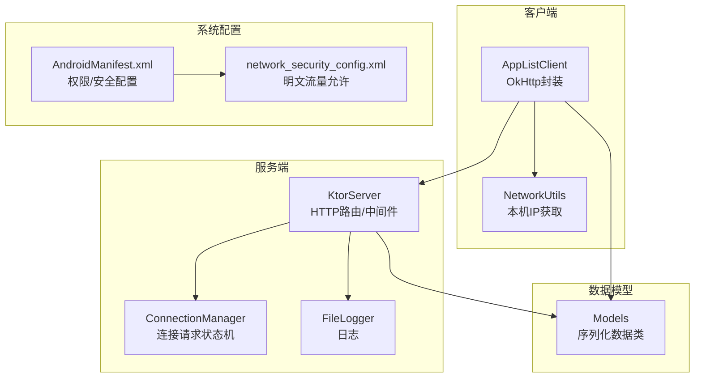
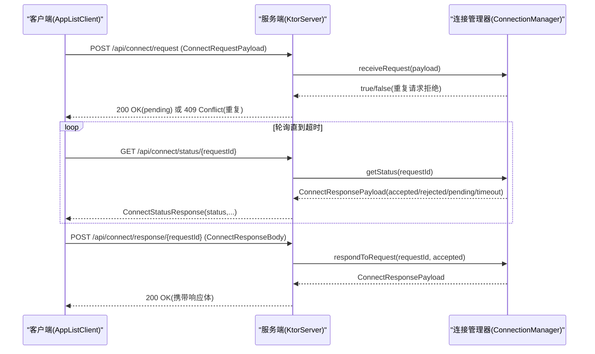
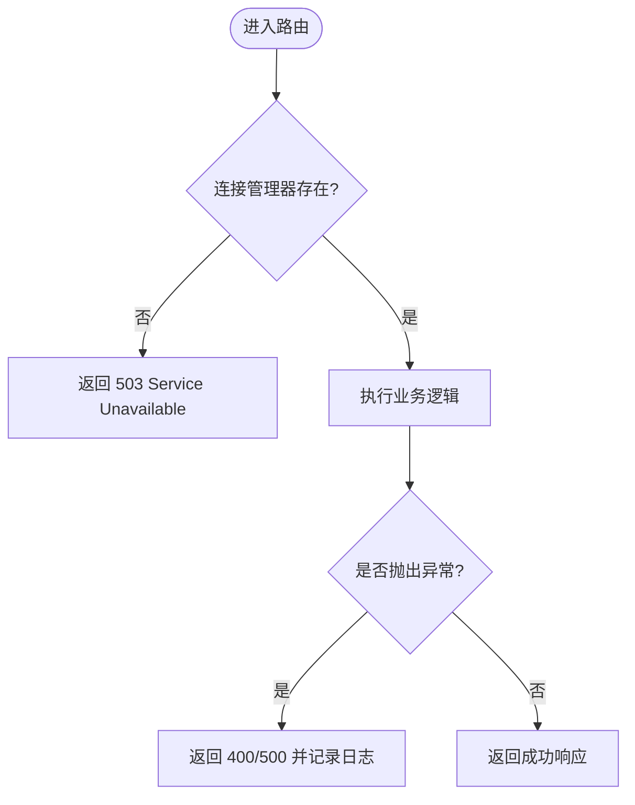
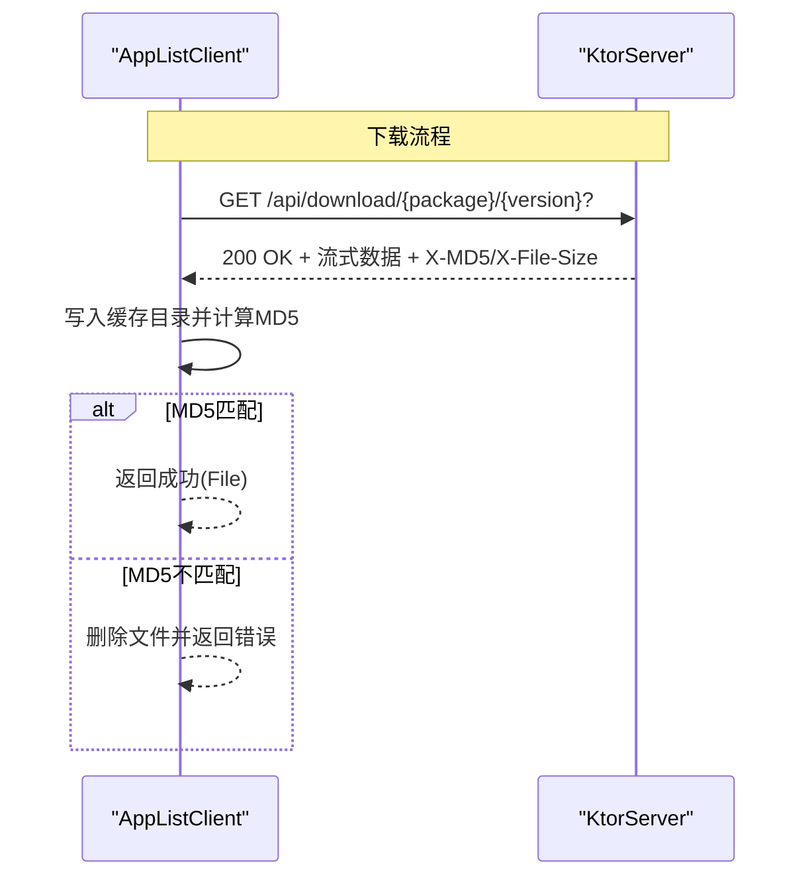
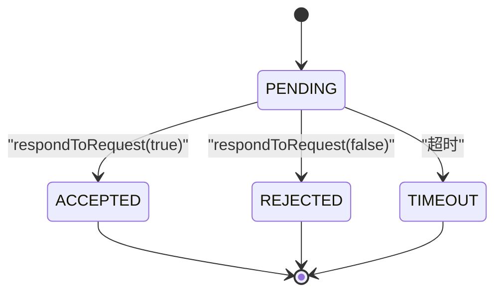
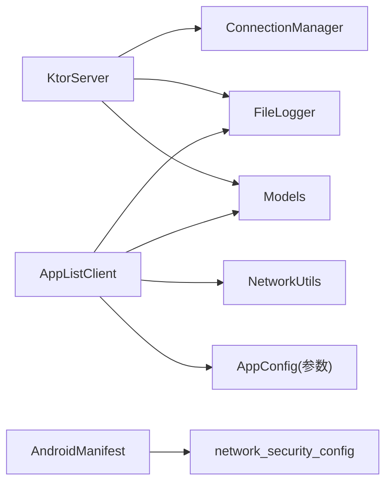

# 网络通信层

<cite>
**本文引用的文件**
- [KtorServer.kt](file://app/src/main/java/com/lansync/app/data/server/KtorServer.kt)
- [AppListClient.kt](file://app/src/main/java/com/lansync/app/data/client/AppListClient.kt)
- [Models.kt](file://app/src/main/java/com/lansync/app/data/model/Models.kt)
- [ConnectionManager.kt](file://app/src/main/java/com/lansync/app/data/connection/ConnectionManager.kt)
- [NetworkUtils.kt](file://app/src/main/java/com/lansync/app/data/NetworkUtils.kt)
- [FileLogger.kt](file://app/src/main/java/com/lansync/app/data/FileLogger.kt)
- [AppConfig.kt](file://app/src/main/java/com/lansync/app/data/AppConfig.kt)
- [network_security_config.xml](file://app/src/main/res/xml/network_security_config.xml)
- [AndroidManifest.xml](file://app/src/main/AndroidManifest.xml)
</cite>

## 目录
1. [简介](#简介)
2. [项目结构](#项目结构)
3. [核心组件](#核心组件)
4. [架构总览](#架构总览)
5. [详细组件分析](#详细组件分析)
6. [依赖关系分析](#依赖关系分析)
7. [性能考量](#性能考量)
8. [故障排查指南](#故障排查指南)
9. [结论](#结论)
10. [附录：API 接口文档](#附录api-接口文档)

## 简介
本技术文档聚焦 LanSync 的网络通信层，系统性阐述基于 Ktor 的本地 HTTP 服务器实现、OkHttp 客户端通信机制、RESTful API 设计原则与端点规范、网络安全配置以及错误处理策略。文档同时提供完整的 API 接口说明，帮助开发者快速集成与扩展网络通信功能。

## 项目结构
网络通信相关代码主要分布在 data 层的 server、client、model、connection 等子包中，配合 Android 清单与安全配置文件共同构成端到端的局域网应用分发与连接管理方案。

图表来源
- [KtorServer.kt:65-290](file://app/src/main/java/com/lansync/app/data/server/KtorServer.kt#L65-L290)
- [AppListClient.kt:30-56](file://app/src/main/java/com/lansync/app/data/client/AppListClient.kt#L30-L56)
- [ConnectionManager.kt:19-156](file://app/src/main/java/com/lansync/app/data/connection/ConnectionManager.kt#L19-L156)
- [Models.kt:5-138](file://app/src/main/java/com/lansync/app/data/model/Models.kt#L5-L138)
- [network_security_config.xml:1-8](file://app/src/main/res/xml/network_security_config.xml#L1-L8)
- [AndroidManifest.xml:28-37](file://app/src/main/AndroidManifest.xml#L28-L37)

章节来源
- [KtorServer.kt:65-290](file://app/src/main/java/com/lansync/app/data/server/KtorServer.kt#L65-L290)
- [AppListClient.kt:30-56](file://app/src/main/java/com/lansync/app/data/client/AppListClient.kt#L30-L56)
- [ConnectionManager.kt:19-156](file://app/src/main/java/com/lansync/app/data/connection/ConnectionManager.kt#L19-L156)
- [Models.kt:5-138](file://app/src/main/java/com/lansync/app/data/model/Models.kt#L5-L138)
- [network_security_config.xml:1-8](file://app/src/main/res/xml/network_security_config.xml#L1-L8)
- [AndroidManifest.xml:28-37](file://app/src/main/AndroidManifest.xml#L28-L37)

## 核心组件
- KtorServer：基于 Netty 的嵌入式 HTTP 服务器，负责路由注册、JSON 内容协商、文件流式下载、连接请求处理与设备信息查询。
- AppListClient：基于 OkHttp 的客户端封装，提供应用列表拉取、设备信息获取、连接建立与响应、断连通知、应用包下载等功能。
- ConnectionManager：维护待处理的连接请求、超时控制、状态流转（pending/accepted/rejected/timeout）并暴露给 UI 订阅。
- Models：统一的 JSON 序列化数据模型，涵盖应用信息、连接载荷、响应体、设备信息等。
- NetworkUtils：获取本机 IPv4 地址，用于构建请求源地址。
- FileLogger：异步落盘日志，支持轮转与备份，便于问题定位。
- AppConfig：网络与重试相关的可调参数（心跳、超时、重试次数等）。
- 网络安全配置：允许明文 HTTP 流量，适配局域网场景。

章节来源
- [KtorServer.kt:65-290](file://app/src/main/java/com/lansync/app/data/server/KtorServer.kt#L65-L290)
- [AppListClient.kt:30-56](file://app/src/main/java/com/lansync/app/data/client/AppListClient.kt#L30-L56)
- [ConnectionManager.kt:19-156](file://app/src/main/java/com/lansync/app/data/connection/ConnectionManager.kt#L19-L156)
- [Models.kt:5-138](file://app/src/main/java/com/lansync/app/data/model/Models.kt#L5-L138)
- [NetworkUtils.kt:9-56](file://app/src/main/java/com/lansync/app/data/NetworkUtils.kt#L9-L56)
- [FileLogger.kt:19-167](file://app/src/main/java/com/lansync/app/data/FileLogger.kt#L19-L167)
- [AppConfig.kt:1-18](file://app/src/main/java/com/lansync/app/data/AppConfig.kt#L1-L18)
- [network_security_config.xml:1-8](file://app/src/main/res/xml/network_security_config.xml#L1-L8)

## 架构总览
整体采用“服务端 Ktor + 客户端 OkHttp”的对称通信模式，通过 RESTful 风格端点进行应用发现、连接协商与二进制文件传输。连接协商流程包含“发起请求—轮询状态—响应确认”三阶段；文件传输使用流式输出与 MD5 校验保障完整性。

图表来源
- [KtorServer.kt:88-175](file://app/src/main/java/com/lansync/app/data/server/KtorServer.kt#L88-L175)
- [AppListClient.kt:62-220](file://app/src/main/java/com/lansync/app/data/client/AppListClient.kt#L62-L220)
- [ConnectionManager.kt:29-112](file://app/src/main/java/com/lansync/app/data/connection/ConnectionManager.kt#L29-L112)

## 详细组件分析

### Ktor 服务器实现
- 启动与内容协商：使用 embeddedServer(Netty) 启动，安装 ContentNegotiation 并使用 kotlinx.serialization 的 Json 配置（宽松解析、忽略未知键、美化输出）。
- 路由与处理管道：
  - GET /api/ping：健康检查，返回通用状态响应。
  - GET /api/applist：调用外部提供的 appListProvider 返回应用列表。
  - POST /api/connect/request：接收连接请求，交由 ConnectionManager 处理，防重入与异常兜底。
  - GET /api/connect/status/{requestId}：查询连接请求状态。
  - POST /api/connect/response/{requestId}：对连接请求进行接受/拒绝响应。
  - GET /api/download/{packageName}/{versionCode?}：按包名与版本（或最新）打包并流式发送 APK/APKS，附带 X-MD5、X-File-Size、Content-Disposition 头。
  - POST /api/disconnect：断开连接通知。
  - POST /api/refresh-applist：刷新应用列表通知。
  - GET /api/deviceinfo：返回设备名称与版本。
- 错误处理：各路由均捕获异常并返回合适的 HTTP 状态码（如 400、404、409、500），并通过 FileLogger 记录上下文。
- 文件传输：sendZipFile 使用 OutputStream 分块写入，设置正确的 Content-Type（单 APK 为 octet-stream，APKS 为 zip），并计算实际 MD5 写入响应头供客户端校验。

图表来源
- [KtorServer.kt:88-175](file://app/src/main/java/com/lansync/app/data/server/KtorServer.kt#L88-L175)
- [KtorServer.kt:293-312](file://app/src/main/java/com/lansync/app/data/server/KtorServer.kt#L293-L312)

章节来源
- [KtorServer.kt:65-290](file://app/src/main/java/com/lansync/app/data/server/KtorServer.kt#L65-L290)
- [KtorServer.kt:293-312](file://app/src/main/java/com/lansync/app/data/server/KtorServer.kt#L293-L312)

### AppListClient 客户端通信机制
- 客户端实例：
  - 常规请求使用 OkHttpClient（短超时、连接池复用、跟随重定向）。
  - 下载专用客户端 downloadClient（更长读写超时、无 callTimeout，适合大文件）。
- JSON 序列化：使用 kotlinx.serialization 的 Json（宽松解析、忽略未知键、美化输出）。
- 连接协商：
  - sendConnectRequest：构造 ConnectRequestPayload，POST 到 /api/connect/request，成功后返回 requestId。
  - pollConnectStatus：周期性 GET /api/connect/status/{requestId}，解析 ConnectStatusResponse，根据 status 返回 Accepted/Rejected/Timeout。
  - sendConnectResponse：POST /api/connect/response/{requestId} 提交接受/拒绝结果。
- 应用列表与设备信息：
  - fetchAppList：GET /api/applist，反序列化为 List<AppInfo>。
  - fetchDeviceInfo：GET /api/deviceinfo，反序列化为 Map<String,String>。
- Ping：GET /api/ping，自定义短超时判断可达性。
- 断连与刷新通知：
  - sendDisconnectNotification：POST /api/disconnect，携带 displayKey/identityKey。
  - sendRefreshAppListNotification：POST /api/refresh-applist，携带 displayKey。
- 下载与校验：
  - downloadLatestApksFile / downloadApksFile：GET /api/download/{...}，读取 X-MD5/X-File-Size，流式写入缓存目录，计算本地 MD5 并与期望值比对，失败删除临时文件。
  - getDownloadedFiles/getDownloadedFileFromName：列举与查找已下载文件。
  - clearDownloads/deleteDownloadedFiles：清理下载目录。

图表来源
- [AppListClient.kt:358-462](file://app/src/main/java/com/lansync/app/data/client/AppListClient.kt#L358-L462)
- [KtorServer.kt:177-250](file://app/src/main/java/com/lansync/app/data/server/KtorServer.kt#L177-L250)

章节来源
- [AppListClient.kt:30-56](file://app/src/main/java/com/lansync/app/data/client/AppListClient.kt#L30-L56)
- [AppListClient.kt:62-220](file://app/src/main/java/com/lansync/app/data/client/AppListClient.kt#L62-L220)
- [AppListClient.kt:228-356](file://app/src/main/java/com/lansync/app/data/client/AppListClient.kt#L228-L356)
- [AppListClient.kt:358-462](file://app/src/main/java/com/lansync/app/data/client/AppListClient.kt#L358-L462)

### ConnectionManager 连接状态机
- 职责：维护 pending 连接请求、超时自动拒绝、状态更新与对外 StateFlow 暴露。
- 关键方法：
  - receiveRequest：去重、创建 IncomingConnectRequest、启动超时任务。
  - respondToRequest：取消超时任务、更新状态、返回 ConnectResponsePayload。
  - getStatus：根据状态返回对应响应体。
  - removeRequest/clearAll：清理资源。
- 超时策略：REQUEST_TIMEOUT_MS 后自动标记为 TIMEOUT。

图表来源
- [ConnectionManager.kt:29-112](file://app/src/main/java/com/lansync/app/data/connection/ConnectionManager.kt#L29-L112)
- [ConnectionManager.kt:132-147](file://app/src/main/java/com/lansync/app/data/connection/ConnectionManager.kt#L132-L147)

章节来源
- [ConnectionManager.kt:19-156](file://app/src/main/java/com/lansync/app/data/connection/ConnectionManager.kt#L19-L156)

### 数据模型与序列化
- 统一使用 @Serializable 注解的数据类承载请求与响应体，确保跨进程/设备间一致的数据契约。
- 关键模型：
  - AppInfo：应用元信息与可提取性标识。
  - ConnectRequestPayload/ConnectResponseBody/ConnectStatusResponse：连接协商三要素。
  - DeviceInfoResponse/GenericStatusResponse：通用响应。
  - DisconnectPayload/RefreshAppListPayload：事件通知载荷。

章节来源
- [Models.kt:5-138](file://app/src/main/java/com/lansync/app/data/model/Models.kt#L5-L138)

### 网络安全与认证授权
- 明文流量：network_security_config.xml 允许 cleartextTrafficPermitted=true，适配局域网内 HTTP 通信。
- 清单配置：AndroidManifest.xml 启用 usesCleartextTraffic 并引用 network_security_config。
- 认证与鉴权：当前实现未内置认证与授权机制，适用于可信局域网环境。如需生产加固，建议增加 Token/签名校验与访问白名单。

章节来源
- [network_security_config.xml:1-8](file://app/src/main/res/xml/network_security_config.xml#L1-L8)
- [AndroidManifest.xml:28-37](file://app/src/main/AndroidManifest.xml#L28-L37)

## 依赖关系分析
- KtorServer 依赖：
  - ConnectionManager：连接请求管理与状态查询。
  - FileLogger：调试与错误追踪。
  - Models：请求/响应数据契约。
  - HashUtils（间接）：文件 MD5 计算。
- AppListClient 依赖：
  - OkHttp：HTTP 客户端与连接池。
  - Models：序列化/反序列化。
  - NetworkUtils：获取本机 IP。
  - FileLogger：日志记录。
- 配置依赖：
  - AppConfig：超时、重试等参数。
  - Android 安全配置：明文流量与权限声明。

图表来源
- [KtorServer.kt:65-290](file://app/src/main/java/com/lansync/app/data/server/KtorServer.kt#L65-L290)
- [AppListClient.kt:30-56](file://app/src/main/java/com/lansync/app/data/client/AppListClient.kt#L30-L56)
- [ConnectionManager.kt:19-156](file://app/src/main/java/com/lansync/app/data/connection/ConnectionManager.kt#L19-L156)
- [AndroidManifest.xml:28-37](file://app/src/main/AndroidManifest.xml#L28-L37)

章节来源
- [KtorServer.kt:65-290](file://app/src/main/java/com/lansync/app/data/server/KtorServer.kt#L65-L290)
- [AppListClient.kt:30-56](file://app/src/main/java/com/lansync/app/data/client/AppListClient.kt#L30-L56)
- [ConnectionManager.kt:19-156](file://app/src/main/java/com/lansync/app/data/connection/ConnectionManager.kt#L19-L156)
- [AndroidManifest.xml:28-37](file://app/src/main/AndroidManifest.xml#L28-L37)

## 性能考量
- 连接池与超时：
  - 客户端使用连接池减少握手开销；下载专用客户端放宽超时以支持大文件。
- 流式传输：
  - 服务端使用 OutputStream 分块写入，避免一次性加载大文件到内存。
- 并发与线程：
  - 服务端路由在 IO 调度器执行耗时操作；连接管理器使用协程与 SupervisorJob 管理超时任务。
- 日志与监控：
  - FileLogger 异步落盘，限制日志大小并轮转，降低 I/O 阻塞。
- 可扩展性：
  - 通过 setAppListProvider/setPacker 注入业务逻辑，解耦服务与具体实现。

[本节为通用性能指导，无需特定文件来源]

## 故障排查指南
- 常见问题定位：
  - 连接请求重复：服务端返回 409 Conflict，检查客户端是否重复发送相同 requestId。
  - 下载失败：检查 X-MD5 与实际文件 MD5 是否一致，查看日志中的 MD5 对比信息。
  - 超时：调整 pollConnectStatus 的 timeoutMs 与 pollIntervalMs，或增大 CONNECT_TIMEOUT_MS。
  - 明文流量被拒：确认 network_security_config.xml 与 Manifest 的 usesCleartextTraffic 配置生效。
- 日志路径：
  - FileLogger 将日志写入应用外部存储目录，文件名 lansync_debug.log，支持轮转与备份。

章节来源
- [KtorServer.kt:88-175](file://app/src/main/java/com/lansync/app/data/server/KtorServer.kt#L88-L175)
- [AppListClient.kt:358-462](file://app/src/main/java/com/lansync/app/data/client/AppListClient.kt#L358-L462)
- [FileLogger.kt:19-167](file://app/src/main/java/com/lansync/app/data/FileLogger.kt#L19-L167)

## 结论
LanSync 的网络通信层以 Ktor 服务器与 OkHttp 客户端为核心，围绕连接协商与应用分发构建了清晰、可扩展的 RESTful 体系。通过严格的序列化模型、完善的错误处理与日志记录、以及安全的明文流量配置，满足了局域网环境下的高效通信需求。后续可在认证授权、速率限制与监控告警方面进一步增强。

[本节为总结性内容，无需特定文件来源]

## 附录：API 接口文档

### 通用约定
- 协议：HTTP/1.1（局域网明文）
- 内容类型：application/json（除文件下载外）
- 字符编码：UTF-8
- 版本控制：通过 DeviceInfoResponse.version 字段体现；未来可通过 URL 前缀或请求头扩展

### 端点列表

- GET /api/ping
  - 描述：健康检查
  - 请求体：无
  - 响应体：GenericStatusResponse
  - 状态码：200 OK

- GET /api/applist
  - 描述：获取本地应用列表
  - 请求体：无
  - 响应体：List<AppInfo>
  - 状态码：200 OK

- POST /api/connect/request
  - 描述：发起连接请求
  - 请求体：ConnectRequestPayload
  - 响应体：ConnectStatusResponse（status=pending）或 409 Conflict（重复请求）
  - 状态码：200 OK / 409 Conflict / 503 Service Unavailable（服务未就绪）

- GET /api/connect/status/{requestId}
  - 描述：轮询连接请求状态
  - 路径参数：requestId
  - 响应体：ConnectStatusResponse（status=pending/accepted/rejected）
  - 状态码：200 OK

- POST /api/connect/response/{requestId}
  - 描述：对连接请求进行接受/拒绝
  - 路径参数：requestId
  - 请求体：ConnectResponseBody
  - 响应体：ConnectResponsePayload
  - 状态码：200 OK / 404 Not Found（请求不存在或已处理）

- GET /api/download/{packageName}/{versionCode}
  - 描述：下载指定版本的应用包（APK/APKS）
  - 路径参数：packageName, versionCode
  - 响应头：X-MD5、X-File-Size、Content-Disposition
  - 响应体：二进制流
  - 状态码：200 OK / 404 Not Found / 403 Forbidden（系统/受保护应用不可提取）/ 500 Internal Server Error

- GET /api/download/{packageName}
  - 描述：下载最新版本的应用包
  - 路径参数：packageName
  - 响应头：X-MD5、X-File-Size、Content-Disposition
  - 响应体：二进制流
  - 状态码：同上

- POST /api/disconnect
  - 描述：断开连接通知
  - 请求体：DisconnectPayload
  - 响应体：GenericStatusResponse
  - 状态码：200 OK / 400 Bad Request

- POST /api/refresh-applist
  - 描述：刷新应用列表通知
  - 请求体：RefreshAppListPayload
  - 响应体：GenericStatusResponse
  - 状态码：200 OK / 400 Bad Request

- GET /api/deviceinfo
  - 描述：获取设备信息
  - 请求体：无
  - 响应体：DeviceInfoResponse
  - 状态码：200 OK

章节来源
- [KtorServer.kt:77-285](file://app/src/main/java/com/lansync/app/data/server/KtorServer.kt#L77-L285)
- [Models.kt:5-138](file://app/src/main/java/com/lansync/app/data/model/Models.kt#L5-L138)