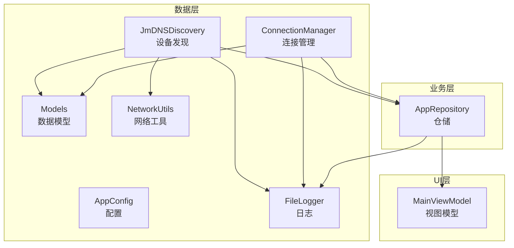
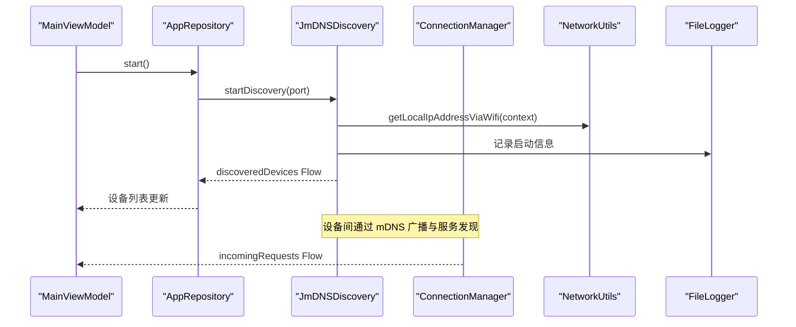
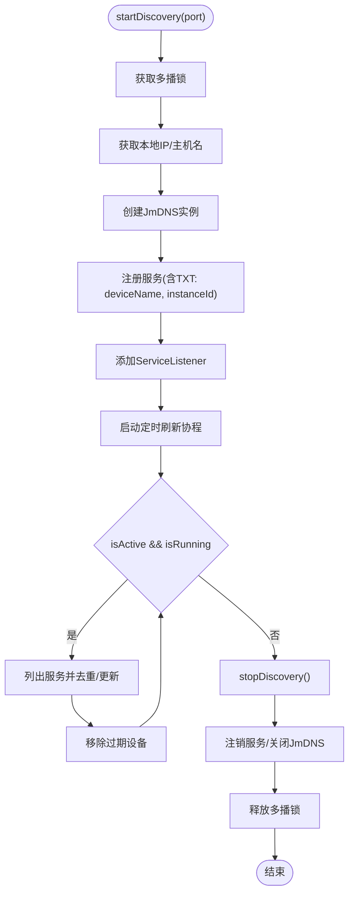
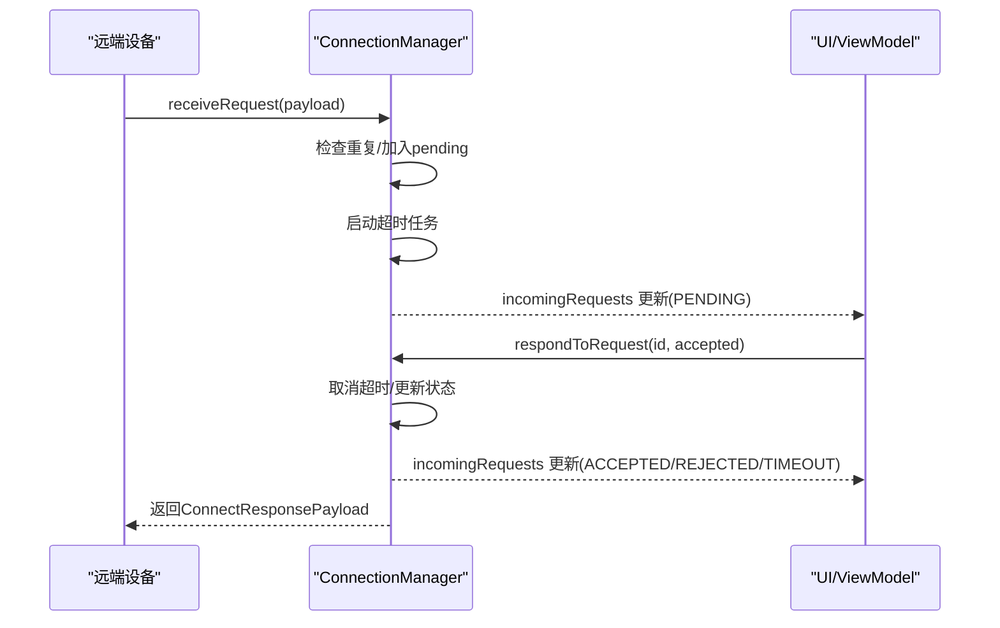
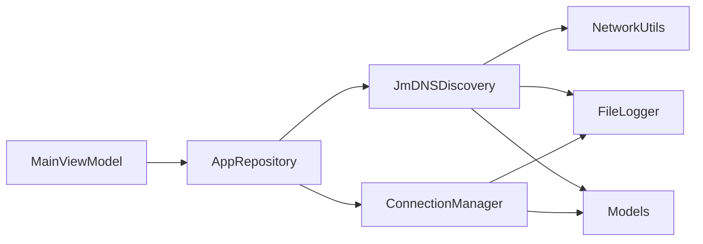
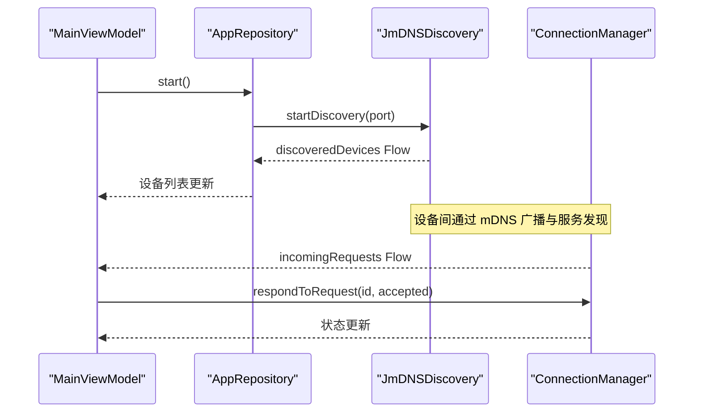

# 设备发现与管理

<cite>
**本文引用的文件**
- [JmDNSDiscovery.kt](file://app/src/main/java/com/lansync/app/data/discovery/JmDNSDiscovery.kt)
- [ConnectionManager.kt](file://app/src/main/java/com/lansync/app/data/connection/ConnectionManager.kt)
- [Models.kt](file://app/src/main/java/com/lansync/app/data/model/Models.kt)
- [AppConfig.kt](file://app/src/main/java/com/lansync/app/data/AppConfig.kt)
- [NetworkUtils.kt](file://app/src/main/java/com/lansync/app/data/NetworkUtils.kt)
- [FileLogger.kt](file://app/src/main/java/com/lansync/app/data/FileLogger.kt)
- [AppRepository.kt](file://app/src/main/java/com/lansync/app/data/repository/AppRepository.kt)
- [MainViewModel.kt](file://app/src/main/java/com/lansync/app/ui/viewmodel/MainViewModel.kt)
</cite>

## 目录
1. [简介](#简介)
2. [项目结构](#项目结构)
3. [核心组件](#核心组件)
4. [架构总览](#架构总览)
5. [详细组件分析](#详细组件分析)
6. [依赖关系分析](#依赖关系分析)
7. [性能考量](#性能考量)
8. [故障排查指南](#故障排查指南)
9. [结论](#结论)
10. [附录：API 参考与调用示例](#附录api-参考与调用示例)

## 简介
本技术文档聚焦于 LanSync 的设备发现与管理模块，围绕 mDNS 协议实现、服务注册与发现、多播锁管理、设备生命周期管理展开，深入解析 JmDNSDiscovery 的核心能力（设备实例 ID 生成与持久化、服务信息注册与广播、设备列表实时更新），并阐述 ConnectionManager 的连接管理策略（连接建立、心跳检测、断线重连、连接池管理）。文档同时提供完整的 API 接口说明、错误处理机制、异常恢复策略、性能优化建议以及端到端调用流程示例，帮助开发者快速理解和使用这些核心功能。

## 项目结构
LanSync 在 Android 应用中采用分层组织方式：
- 数据层：discovery（设备发现）、connection（连接管理）、model（数据模型）、config（配置）、network（网络工具）、logger（日志）
- 业务层：repository（仓储，协调 discovery 与 connection）
- UI 层：viewmodel（状态聚合与调度）、components（界面组件）

图表来源
- [JmDNSDiscovery.kt:23-275](file://app/src/main/java/com/lansync/app/data/discovery/JmDNSDiscovery.kt#L23-L275)
- [ConnectionManager.kt:19-156](file://app/src/main/java/com/lansync/app/data/connection/ConnectionManager.kt#L19-L156)
- [Models.kt:19-138](file://app/src/main/java/com/lansync/app/data/model/Models.kt#L19-L138)
- [AppConfig.kt:3-18](file://app/src/main/java/com/lansync/app/data/AppConfig.kt#L3-L18)
- [NetworkUtils.kt:9-56](file://app/src/main/java/com/lansync/app/data/NetworkUtils.kt#L9-L56)
- [FileLogger.kt:19-167](file://app/src/main/java/com/lansync/app/data/FileLogger.kt#L19-L167)
- [AppRepository.kt:284-963](file://app/src/main/java/com/lansync/app/data/repository/AppRepository.kt#L284-L963)
- [MainViewModel.kt:55-104](file://app/src/main/java/com/lansync/app/ui/viewmodel/MainViewModel.kt#L55-L104)

章节来源
- [JmDNSDiscovery.kt:23-275](file://app/src/main/java/com/lansync/app/data/discovery/JmDNSDiscovery.kt#L23-L275)
- [ConnectionManager.kt:19-156](file://app/src/main/java/com/lansync/app/data/connection/ConnectionManager.kt#L19-L156)
- [Models.kt:19-138](file://app/src/main/java/com/lansync/app/data/model/Models.kt#L19-L138)
- [AppConfig.kt:3-18](file://app/src/main/java/com/lansync/app/data/AppConfig.kt#L3-L18)
- [NetworkUtils.kt:9-56](file://app/src/main/java/com/lansync/app/data/NetworkUtils.kt#L9-L56)
- [FileLogger.kt:19-167](file://app/src/main/java/com/lansync/app/data/FileLogger.kt#L19-L167)
- [AppRepository.kt:284-963](file://app/src/main/java/com/lansync/app/data/repository/AppRepository.kt#L284-L963)
- [MainViewModel.kt:55-104](file://app/src/main/java/com/lansync/app/ui/viewmodel/MainViewModel.kt#L55-L104)

## 核心组件
- JmDNSDiscovery：基于 JmDNS 的局域网设备发现，负责 mDNS 服务注册、监听、刷新、设备去重与实时列表更新；维护设备实例 ID 的持久化；管理多播锁。
- ConnectionManager：管理连接请求的生命周期（接收、响应、超时、清理），暴露待处理请求流供 UI 展示与交互。
- Models：定义设备信息、连接载荷、状态枚举等数据结构。
- AppConfig：集中配置心跳、轮询、超时、重试等参数。
- NetworkUtils：获取本地 IP、回退策略。
- FileLogger：异步落盘日志，支持旋转与备份。

章节来源
- [JmDNSDiscovery.kt:23-275](file://app/src/main/java/com/lansync/app/data/discovery/JmDNSDiscovery.kt#L23-L275)
- [ConnectionManager.kt:19-156](file://app/src/main/java/com/lansync/app/data/connection/ConnectionManager.kt#L19-L156)
- [Models.kt:19-138](file://app/src/main/java/com/lansync/app/data/model/Models.kt#L19-L138)
- [AppConfig.kt:3-18](file://app/src/main/java/com/lansync/app/data/AppConfig.kt#L3-L18)
- [NetworkUtils.kt:9-56](file://app/src/main/java/com/lansync/app/data/NetworkUtils.kt#L9-L56)
- [FileLogger.kt:19-167](file://app/src/main/java/com/lansync/app/data/FileLogger.kt#L19-L167)

## 架构总览
整体流程由 Repository 统一编排：启动时扫描本地应用，随后启动服务发现；发现设备后，通过 ConnectionManager 处理连接请求；UI 通过 ViewModel 订阅仓库状态进行渲染。

图表来源
- [MainViewModel.kt:55-104](file://app/src/main/java/com/lansync/app/ui/viewmodel/MainViewModel.kt#L55-L104)
- [AppRepository.kt:284-963](file://app/src/main/java/com/lansync/app/data/repository/AppRepository.kt#L284-L963)
- [JmDNSDiscovery.kt:60-117](file://app/src/main/java/com/lansync/app/data/discovery/JmDNSDiscovery.kt#L60-L117)
- [ConnectionManager.kt:29-147](file://app/src/main/java/com/lansync/app/data/connection/ConnectionManager.kt#L29-L147)
- [NetworkUtils.kt:31-53](file://app/src/main/java/com/lansync/app/data/NetworkUtils.kt#L31-L53)
- [FileLogger.kt:90-119](file://app/src/main/java/com/lansync/app/data/FileLogger.kt#L90-L119)

## 详细组件分析

### JmDNSDiscovery：mDNS 设备发现与生命周期管理
- 设备实例 ID 生成与持久化
  - 首次启动生成 UUID 并写入 SharedPreferences，后续启动直接读取，保证跨进程/重启稳定标识。
  - 该 ID 作为服务名的一部分和 TXT 字段，用于区分不同设备实例。
- 服务注册与广播
  - 使用 JmDNS 创建实例，绑定本地地址与主机名，注册自定义服务类型与端口，携带 deviceName、instanceId 等 TXT 属性。
- 多播锁管理
  - 通过 WifiManager 创建并持有 MulticastLock，确保能收发组播包；停止时释放。
- 设备列表实时更新机制
  - 注册 ServiceListener，处理 serviceAdded/serviceResolved/serviceRemoved 事件。
  - 后台协程定时刷新服务列表，对比当前设备映射，移除过期设备。
  - 以 StateFlow 暴露 discoveredDevices，供上层消费。
- 错误处理与恢复
  - 启动失败时记录日志并安全停止；刷新过程中捕获异常避免中断。
  - 忽略无 instanceId 或本地实例的服务，避免自环。

图表来源
- [JmDNSDiscovery.kt:60-117](file://app/src/main/java/com/lansync/app/data/discovery/JmDNSDiscovery.kt#L60-L117)
- [JmDNSDiscovery.kt:119-262](file://app/src/main/java/com/lansync/app/data/discovery/JmDNSDiscovery.kt#L119-L262)
- [NetworkUtils.kt:31-53](file://app/src/main/java/com/lansync/app/data/NetworkUtils.kt#L31-L53)

章节来源
- [JmDNSDiscovery.kt:41-56](file://app/src/main/java/com/lansync/app/data/discovery/JmDNSDiscovery.kt#L41-L56)
- [JmDNSDiscovery.kt:60-117](file://app/src/main/java/com/lansync/app/data/discovery/JmDNSDiscovery.kt#L60-L117)
- [JmDNSDiscovery.kt:119-262](file://app/src/main/java/com/lansync/app/data/discovery/JmDNSDiscovery.kt#L119-L262)
- [NetworkUtils.kt:31-53](file://app/src/main/java/com/lansync/app/data/NetworkUtils.kt#L31-L53)

### ConnectionManager：连接请求管理与超时控制
- 连接请求接收与去重
  - receiveRequest 将入站请求加入 pendingRequests，设置超时任务，重复请求拒绝。
- 响应与状态流转
  - respondToRequest 根据接受/拒绝更新请求状态，返回 ConnectResponsePayload；getStatus 查询当前状态。
- 超时与清理
  - handleTimeout 将 PENDING 转为 TIMEOUT；removeRequest/clearAll 清理资源。
- 状态流
  - incomingRequests 暴露仅包含 PENDING 的请求列表，按时间倒序排列，便于 UI 展示。

图表来源
- [ConnectionManager.kt:29-147](file://app/src/main/java/com/lansync/app/data/connection/ConnectionManager.kt#L29-L147)
- [Models.kt:69-116](file://app/src/main/java/com/lansync/app/data/model/Models.kt#L69-L116)

章节来源
- [ConnectionManager.kt:29-147](file://app/src/main/java/com/lansync/app/data/connection/ConnectionManager.kt#L29-L147)
- [Models.kt:69-116](file://app/src/main/java/com/lansync/app/data/model/Models.kt#L69-L116)

### 数据模型与配置
- DeviceInfo：设备标识（ip+port/displayKey/identityKey）、名称、端口、实例ID、应用列表、连接状态、最后可见时间、连接错误信息。
- ConnectionState：DISCOVERED/CONNECTING/CONNECTED/ERROR/DISCONNECTED/RECONNECTING/CONNECTION_TIMEOUT。
- 连接载荷：ConnectRequestPayload、ConnectResponsePayload、IncomingConnectRequest（含 RequestStatus）。
- AppConfig：心跳间隔、同步间隔、容忍度、最大失败次数、更新节流、连接超时、轮询间隔、重试次数与延迟、ping 超时等。

章节来源
- [Models.kt:19-138](file://app/src/main/java/com/lansync/app/data/model/Models.kt#L19-L138)
- [AppConfig.kt:3-18](file://app/src/main/java/com/lansync/app/data/AppConfig.kt#L3-L18)

## 依赖关系分析
- JmDNSDiscovery 依赖：
  - NetworkUtils：获取本地 IP（优先 WiFi，回退到网络接口）。
  - FileLogger：记录关键事件与异常。
  - Models：构造 DeviceInfo。
  - JmDNS 库：服务注册与监听。
- ConnectionManager 依赖：
  - Models：连接载荷与状态。
  - FileLogger：记录请求与状态变更。
- AppRepository 协调 discovery 与 connection，并将状态暴露给 ViewModel。
- MainViewModel 聚合仓库状态，驱动 UI。

图表来源
- [JmDNSDiscovery.kt:23-275](file://app/src/main/java/com/lansync/app/data/discovery/JmDNSDiscovery.kt#L23-L275)
- [ConnectionManager.kt:19-156](file://app/src/main/java/com/lansync/app/data/connection/ConnectionManager.kt#L19-L156)
- [AppRepository.kt:284-963](file://app/src/main/java/com/lansync/app/data/repository/AppRepository.kt#L284-L963)
- [MainViewModel.kt:55-104](file://app/src/main/java/com/lansync/app/ui/viewmodel/MainViewModel.kt#L55-L104)

章节来源
- [JmDNSDiscovery.kt:23-275](file://app/src/main/java/com/lansync/app/data/discovery/JmDNSDiscovery.kt#L23-L275)
- [ConnectionManager.kt:19-156](file://app/src/main/java/com/lansync/app/data/connection/ConnectionManager.kt#L19-L156)
- [AppRepository.kt:284-963](file://app/src/main/java/com/lansync/app/data/repository/AppRepository.kt#L284-L963)
- [MainViewModel.kt:55-104](file://app/src/main/java/com/lansync/app/ui/viewmodel/MainViewModel.kt#L55-L104)

## 性能考量
- 设备发现刷新频率
  - 默认每 60 秒刷新一次服务列表，避免频繁网络 IO；可根据网络环境调整 REFRESH_INTERVAL_MS。
- 多播锁与线程
  - 使用协程 SupervisorJob + IO 调度器，避免阻塞主线程；确保 stopDiscovery 时正确释放锁与资源。
- 内存与并发
  - 使用 ConcurrentHashMap 存储连接请求，避免竞态；StateFlow 减少重复 UI 更新。
- 日志与 I/O
  - FileLogger 异步写入，限制日志大小与备份数量，防止磁盘占用过高。
- 连接超时与重试
  - 连接请求默认 15 秒超时；可结合 AppConfig 中的 connectTimeoutMs、pollIntervalMs、fetchAppListRetryDelayMs 等参数调优。

[本节为通用性能讨论，不直接分析具体文件]

## 故障排查指南
- 无法发现设备
  - 检查是否成功获取多播锁；确认防火墙/路由器是否允许 UDP 组播。
  - 查看日志中“Multicast lock acquired”“JmDNS discovery started”等关键信息。
- 设备列表不更新
  - 确认刷新协程是否运行；检查 serviceResolved 回调是否触发；核对 instanceId 过滤逻辑。
- 连接请求未响应
  - 检查 receiveRequest 是否被调用；确认 requestId 唯一性；查看超时任务是否触发。
- 常见异常
  - 启动失败：捕获异常并调用 stopDiscovery 清理资源。
  - 刷新异常：捕获并记录警告，不影响其他设备处理。

章节来源
- [JmDNSDiscovery.kt:81-85](file://app/src/main/java/com/lansync/app/data/discovery/JmDNSDiscovery.kt#L81-L85)
- [JmDNSDiscovery.kt:256-258](file://app/src/main/java/com/lansync/app/data/discovery/JmDNSDiscovery.kt#L256-L258)
- [ConnectionManager.kt:58-64](file://app/src/main/java/com/lansync/app/data/connection/ConnectionManager.kt#L58-L64)
- [FileLogger.kt:90-119](file://app/src/main/java/com/lansync/app/data/FileLogger.kt#L90-L119)

## 结论
本模块通过 JmDNSDiscovery 实现了稳定的局域网设备发现，利用 mDNS 服务注册与监听完成设备自动发现与实时更新；ConnectionManager 提供了可靠的连接请求生命周期管理，包括超时与状态流转。配合统一的配置与日志体系，系统具备良好的可观测性与可维护性。建议在复杂网络环境下合理调整刷新与超时参数，并结合 UI 层的状态流进行友好提示。

[本节为总结性内容，不直接分析具体文件]

## 附录：API 参考与调用示例

### JmDNSDiscovery API
- getInstanceId(): String
  - 返回持久化的设备实例 ID。
- startDiscovery(port: Int): suspend
  - 启动设备发现，内部会获取多播锁、创建 JmDNS、注册服务、开始监听与定时刷新。
  - 抛出异常时会记录日志并调用 stopDiscovery 清理。
- stopDiscovery(): void
  - 停止发现，注销服务、关闭 JmDNS、释放多播锁、清空设备列表。
- discoveredDevices: Flow<List<DeviceInfo>>
  - 实时设备列表流，包含新增、更新与删除事件。

章节来源
- [JmDNSDiscovery.kt:41-56](file://app/src/main/java/com/lansync/app/data/discovery/JmDNSDiscovery.kt#L41-L56)
- [JmDNSDiscovery.kt:60-117](file://app/src/main/java/com/lansync/app/data/discovery/JmDNSDiscovery.kt#L60-L117)
- [JmDNSDiscovery.kt:200-262](file://app/src/main/java/com/lansync/app/data/discovery/JmDNSDiscovery.kt#L200-L262)

### ConnectionManager API
- receiveRequest(payload: ConnectRequestPayload): Boolean
  - 接收连接请求，若重复则拒绝；返回 true 表示已加入待处理队列。
- respondToRequest(requestId: String, accepted: Boolean): ConnectResponsePayload?
  - 对请求进行接受或拒绝，返回响应载荷；若请求不存在返回 null。
- getStatus(requestId: String): ConnectResponsePayload?
  - 查询请求当前状态（PENDING/ACCEPTED/REJECTED/TIMEOUT）。
- removeRequest(requestId: String): void
  - 移除指定请求并清理超时任务。
- clearAll(): void
  - 清理所有待处理请求与超时任务。
- incomingRequests: StateFlow<List<IncomingConnectRequest>>
  - 仅包含 PENDING 状态的请求列表，按时间倒序。

章节来源
- [ConnectionManager.kt:29-147](file://app/src/main/java/com/lansync/app/data/connection/ConnectionManager.kt#L29-L147)
- [Models.kt:69-116](file://app/src/main/java/com/lansync/app/data/model/Models.kt#L69-L116)

### 完整调用流程示例（端到端）
- 启动与发现
  - 在 ViewModel 中调用 repository.start()，仓库内部启动 JmDNSDiscovery。
  - Discovery 启动后，通过 discoveredDevices 流推送设备列表。
- 接收连接请求
  - 当远端发起连接请求时，ConnectionManager.receiveRequest 将其加入待处理队列。
  - UI 通过 incomingRequests 流展示待处理请求。
- 响应连接
  - 用户选择接受或拒绝后，调用 respondToRequest 更新状态并返回响应。
- 刷新与清理
  - 需要重新扫描时，调用 refreshDeviceAppLists 停止并重启发现；必要时清理连接请求。

图表来源
- [MainViewModel.kt:55-104](file://app/src/main/java/com/lansync/app/ui/viewmodel/MainViewModel.kt#L55-L104)
- [AppRepository.kt:284-963](file://app/src/main/java/com/lansync/app/data/repository/AppRepository.kt#L284-L963)
- [JmDNSDiscovery.kt:60-117](file://app/src/main/java/com/lansync/app/data/discovery/JmDNSDiscovery.kt#L60-L117)
- [ConnectionManager.kt:29-147](file://app/src/main/java/com/lansync/app/data/connection/ConnectionManager.kt#L29-L147)