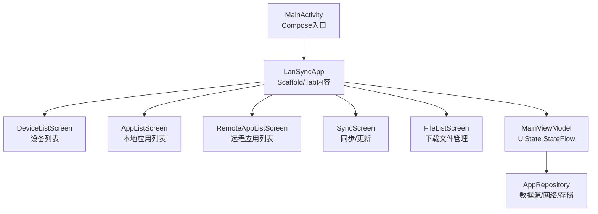
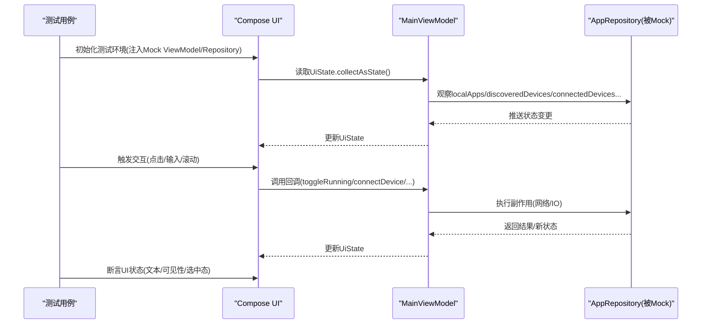
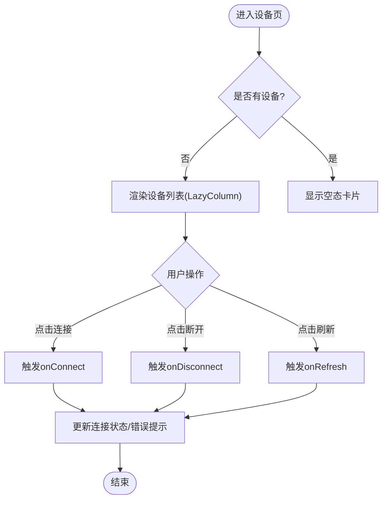
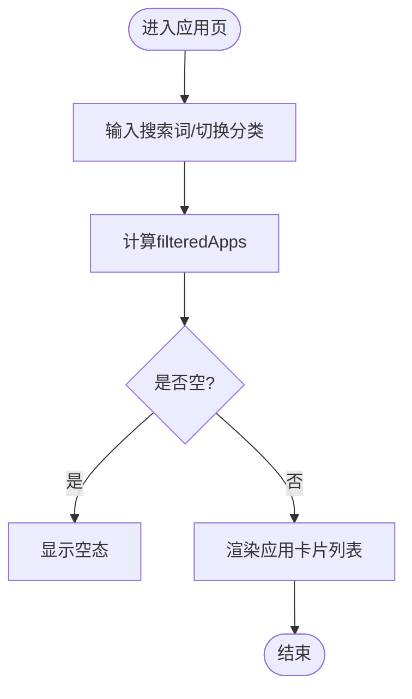
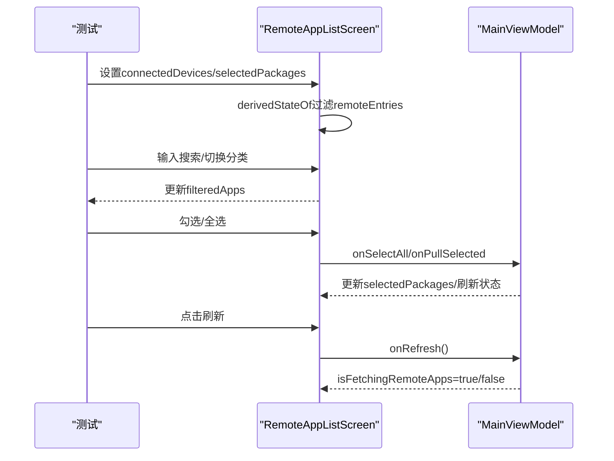
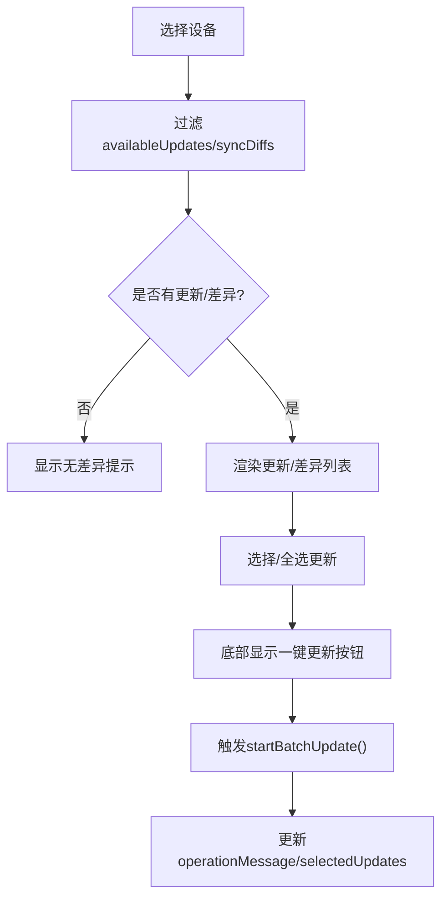
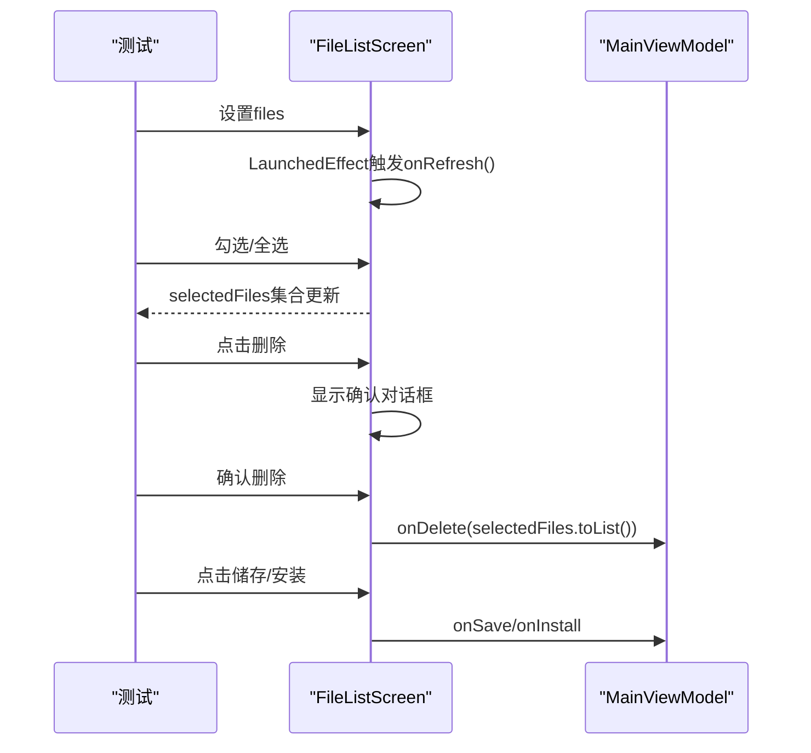
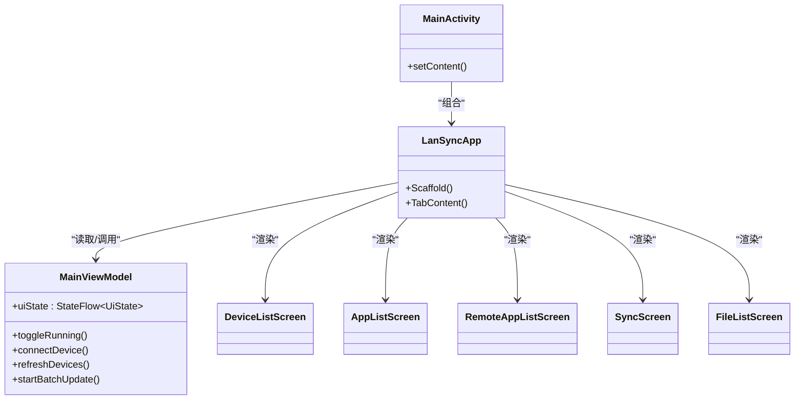

# UI测试

<cite>
**本文引用的文件**
- [MainActivity.kt](file://app/src/main/java/com/lansync/app/MainActivity.kt)
- [MainViewModel.kt](file://app/src/main/java/com/lansync/app/ui/viewmodel/MainViewModel.kt)
- [DeviceListScreen.kt](file://app/src/main/java/com/lansync/app/ui/components/DeviceListScreen.kt)
- [AppListScreen.kt](file://app/src/main/java/com/lansync/app/ui/components/AppListScreen.kt)
- [RemoteAppListScreen.kt](file://app/src/main/java/com/lansync/app/ui/components/RemoteAppListScreen.kt)
- [SyncScreen.kt](file://app/src/main/java/com/lansync/app/ui/components/SyncScreen.kt)
- [FileListScreen.kt](file://app/src/main/java/com/lansync/app/ui/components/FileListScreen.kt)
- [build.gradle.kts](file://app/build.gradle.kts)
</cite>

## 目录
1. [简介](#简介)
2. [项目结构](#项目结构)
3. [核心组件](#核心组件)
4. [架构总览](#架构总览)
5. [详细组件分析](#详细组件分析)
6. [依赖关系分析](#依赖关系分析)
7. [性能考虑](#性能考虑)
8. [故障排查指南](#故障排查指南)
9. [结论](#结论)
10. [附录](#附录)

## 简介
本文件面向LanSync应用的UI测试，聚焦于Jetpack Compose UI测试方法与工具，包括Compose Testing库的使用。文档将说明如何测试界面状态变化、用户交互响应与导航流程；如何模拟点击、滑动、输入等用户操作并验证UI状态；并提供设备列表、应用列表、同步界面等核心界面的具体测试示例。同时涵盖异步操作和网络请求在UI测试中的模拟策略，以及可访问性测试与响应式布局测试的方法。

## 项目结构
LanSync采用典型的MVVM + Compose架构：
- MainActivity负责启动Compose根节点与主题，组织Scaffold、顶部栏、底部导航与内容区域。
- MainViewModel通过StateFlow暴露UiState，聚合仓库层数据流（本地应用、发现设备、已连接设备、更新差异、下载进度、安装状态等）。
- UI组件（DeviceListScreen、AppListScreen、RemoteAppListScreen、SyncScreen、FileListScreen）消费UiState并通过回调与ViewModel交互。
- 构建配置中启用Compose，并在debug实现中包含ui-test-manifest以支持UI测试。

图表来源
- [MainActivity.kt:27-106](file://app/src/main/java/com/lansync/app/MainActivity.kt#L27-L106)
- [MainViewModel.kt:22-56](file://app/src/main/java/com/lansync/app/ui/viewmodel/MainViewModel.kt#L22-L56)

章节来源
- [MainActivity.kt:27-106](file://app/src/main/java/com/lansync/app/MainActivity.kt#L27-L106)
- [build.gradle.kts:57-63](file://app/build.gradle.kts#L57-L63)
- [build.gradle.kts:108-109](file://app/build.gradle.kts#L108-L109)

## 核心组件
- MainActivity/LanSyncApp：组合顶层UI，绑定BottomBar切换Tab，分发事件到ViewModel。
- MainViewModel：集中管理业务状态与副作用，使用combine订阅仓库流，暴露UiState给UI。
- DeviceListScreen：展示设备发现/连接状态、错误提示、刷新与开关服务。
- AppListScreen：搜索、分类过滤、展示本地应用卡片。
- RemoteAppListScreen：多设备聚合、搜索、全选/批量拉取。
- SyncScreen：按设备筛选更新项与版本差异，支持选择与一键更新。
- FileListScreen：下载文件列表、多选删除、保存与安装。

章节来源
- [MainActivity.kt:108-329](file://app/src/main/java/com/lansync/app/MainActivity.kt#L108-L329)
- [MainViewModel.kt:84-124](file://app/src/main/java/com/lansync/app/ui/viewmodel/MainViewModel.kt#L84-L124)
- [DeviceListScreen.kt:20-152](file://app/src/main/java/com/lansync/app/ui/components/DeviceListScreen.kt#L20-L152)
- [AppListScreen.kt:27-121](file://app/src/main/java/com/lansync/app/ui/components/AppListScreen.kt#L27-L121)
- [RemoteAppListScreen.kt:24-283](file://app/src/main/java/com/lansync/app/ui/components/RemoteAppListScreen.kt#L24-L283)
- [SyncScreen.kt:22-209](file://app/src/main/java/com/lansync/app/ui/components/SyncScreen.kt#L22-L209)
- [FileListScreen.kt:22-160](file://app/src/main/java/com/lansync/app/ui/components/FileListScreen.kt#L22-L160)

## 架构总览
UI测试的切入点为Compose根节点与ViewModel状态。测试时通过TestDispatcher控制协程时序，使用MockK或自定义Repository替换真实网络/存储依赖，确保测试稳定且快速。

图表来源
- [MainViewModel.kt:84-124](file://app/src/main/java/com/lansync/app/ui/viewmodel/MainViewModel.kt#L84-L124)
- [MainActivity.kt:39-106](file://app/src/main/java/com/lansync/app/MainActivity.kt#L39-L106)

## 详细组件分析

### 设备列表(DeviceListScreen)测试
- 目标：验证服务开关、设备刷新、连接/断开、错误提示与空态。
- 关键交互：
  - 点击“刷新”按钮触发onRefresh。
  - 点击设备卡片的“连接/断开”按钮触发onConnect/onDisconnect。
  - 显示connectionError时，点击关闭按钮触发onDismissError。
- 状态断言：
  - 无设备时显示空态卡片；有设备时显示LazyColumn列表。
  - 不同ConnectionState对应不同颜色与文案。
- 异步处理：
  - 连接/断开可能涉及网络，测试中应Mock Repository并立即返回成功/失败，或使用TestScheduler推进协程。

图表来源
- [DeviceListScreen.kt:20-152](file://app/src/main/java/com/lansync/app/ui/components/DeviceListScreen.kt#L20-L152)
- [DeviceListScreen.kt:154-240](file://app/src/main/java/com/lansync/app/ui/components/DeviceListScreen.kt#L154-L240)
- [DeviceListScreen.kt:242-423](file://app/src/main/java/com/lansync/app/ui/components/DeviceListScreen.kt#L242-L423)

章节来源
- [DeviceListScreen.kt:20-423](file://app/src/main/java/com/lansync/app/ui/components/DeviceListScreen.kt#L20-L423)

### 应用列表(AppListScreen)测试
- 目标：验证搜索、分类过滤、计数与空态。
- 关键交互：
  - 在SearchBar中输入查询，验证filteredApps数量变化。
  - 切换CategoryTabs（全部/用户/系统），验证列表与计数。
- 状态断言：
  - 无匹配时显示空态卡片；有数据时渲染LazyColumn。
- 异步处理：
  - 列表数据来自UiState.localApps，测试中直接设置初始数据即可。

图表来源
- [AppListScreen.kt:27-121](file://app/src/main/java/com/lansync/app/ui/components/AppListScreen.kt#L27-L121)
- [AppListScreen.kt:123-174](file://app/src/main/java/com/lansync/app/ui/components/AppListScreen.kt#L123-L174)

章节来源
- [AppListScreen.kt:27-121](file://app/src/main/java/com/lansync/app/ui/components/AppListScreen.kt#L27-L121)
- [AppListScreen.kt:123-174](file://app/src/main/java/com/lansync/app/ui/components/AppListScreen.kt#L123-L174)

### 远程应用列表(RemoteAppListScreen)测试
- 目标：验证多设备聚合、搜索、全选/批量拉取、刷新。
- 关键交互：
  - 搜索框输入后过滤remoteEntries。
  - 勾选单个应用或全选，底部出现“拉取安装”按钮。
  - 点击刷新触发onRefresh。
- 状态断言：
  - 无连接设备时显示引导信息；有设备但无应用时显示刷新提示。
- 异步处理：
  - 首次检测到空应用列表时自动触发一次刷新（LaunchedEffect），测试中需等待该效果完成。

图表来源
- [RemoteAppListScreen.kt:24-283](file://app/src/main/java/com/lansync/app/ui/components/RemoteAppListScreen.kt#L24-L283)
- [MainViewModel.kt:202-217](file://app/src/main/java/com/lansync/app/ui/viewmodel/MainViewModel.kt#L202-L217)

章节来源
- [RemoteAppListScreen.kt:24-283](file://app/src/main/java/com/lansync/app/ui/components/RemoteAppListScreen.kt#L24-L283)
- [MainViewModel.kt:202-217](file://app/src/main/java/com/lansync/app/ui/viewmodel/MainViewModel.kt#L202-L217)

### 同步界面(SyncScreen)测试
- 目标：验证设备选择、搜索、选择更新、一键更新。
- 关键交互：
  - 选择ConnectedDeviceChips中的设备。
  - 搜索过滤availableUpdates与syncDiffs。
  - 勾选更新项，底部出现“一键更新”。
- 状态断言：
  - 无差异时显示“应用版本已同步，无差异”。
  - 有差异时分别展示“可更新”和“版本差异”区块。
- 异步处理：
  - 一键更新会触发批量下载/安装，测试中Mock Repository并验证UiState.selectedUpdates与operationMessage。

图表来源
- [SyncScreen.kt:22-209](file://app/src/main/java/com/lansync/app/ui/components/SyncScreen.kt#L22-L209)
- [MainViewModel.kt:245-274](file://app/src/main/java/com/lansync/app/ui/viewmodel/MainViewModel.kt#L245-L274)

章节来源
- [SyncScreen.kt:22-209](file://app/src/main/java/com/lansync/app/ui/components/SyncScreen.kt#L22-L209)
- [MainViewModel.kt:245-274](file://app/src/main/java/com/lansync/app/ui/viewmodel/MainViewModel.kt#L245-L274)

### 文件列表(FileListScreen)测试
- 目标：验证多选、全选/取消、删除确认、保存与安装。
- 关键交互：
  - 勾选多个文件，显示“已选择X个文件”，启用删除按钮。
  - 点击删除弹出确认对话框，确认后调用onDelete。
  - 点击“储存”触发onSave，“安装”触发onInstall。
- 状态断言：
  - 无文件时显示空态；有文件时渲染列表。
- 异步处理：
  - 页面加载时调用onRefresh，测试中需等待LaunchedEffect完成。

图表来源
- [FileListScreen.kt:22-160](file://app/src/main/java/com/lansync/app/ui/components/FileListScreen.kt#L22-L160)
- [FileListScreen.kt:162-283](file://app/src/main/java/com/lansync/app/ui/components/FileListScreen.kt#L162-L283)

章节来源
- [FileListScreen.kt:22-160](file://app/src/main/java/com/lansync/app/ui/components/FileListScreen.kt#L22-L160)
- [FileListScreen.kt:162-283](file://app/src/main/java/com/lansync/app/ui/components/FileListScreen.kt#L162-L283)

## 依赖关系分析
- UI组件依赖ViewModel暴露的UiState与回调方法。
- ViewModel依赖AppRepository提供的StateFlow数据流与业务方法。
- 测试中通过MockK替换Repository，避免真实网络/IO，保证测试确定性。

图表来源
- [MainActivity.kt:27-106](file://app/src/main/java/com/lansync/app/MainActivity.kt#L27-L106)
- [MainViewModel.kt:22-56](file://app/src/main/java/com/lansync/app/ui/viewmodel/MainViewModel.kt#L22-L56)

章节来源
- [MainActivity.kt:27-106](file://app/src/main/java/com/lansync/app/MainActivity.kt#L27-L106)
- [MainViewModel.kt:22-56](file://app/src/main/java/com/lansync/app/ui/viewmodel/MainViewModel.kt#L22-L56)

## 性能考虑
- 使用derivedStateOf减少不必要的重组（如AppListScreen、RemoteAppListScreen中的过滤逻辑）。
- LazyColumn用于长列表渲染，提升滚动性能。
- 测试中避免真实网络/IO，使用MockK与TestDispatcher缩短执行时间。
- 对大量数据的过滤与统计尽量在ViewModel侧完成，UI仅消费状态。

## 故障排查指南
- 常见问题：
  - 测试中协程未推进导致状态未更新：使用runTest与advanceUntilIdle或TestScheduler。
  - Mock对象未正确注入：确保测试中提供自定义ViewModel或Repository。
  - 异步LaunchedEffect未执行：在测试中等待相关副作用完成。
- 定位方法：
  - 打印UiState关键字段变化。
  - 检查回调是否正确传递到ViewModel。
  - 验证Mock返回值是否符合预期。

章节来源
- [MainViewModel.kt:84-124](file://app/src/main/java/com/lansync/app/ui/viewmodel/MainViewModel.kt#L84-L124)
- [RemoteAppListScreen.kt:65-75](file://app/src/main/java/com/lansync/app/ui/components/RemoteAppListScreen.kt#L65-L75)
- [FileListScreen.kt:35-37](file://app/src/main/java/com/lansync/app/ui/components/FileListScreen.kt#L35-L37)

## 结论
通过对LanSync的UI组件与ViewModel进行分析，可以基于Compose Testing库建立稳定的UI测试体系。重点在于：
- 使用MockK隔离外部依赖，确保测试可控。
- 利用StateFlow驱动UI，测试断言集中在UiState变化。
- 针对设备列表、应用列表、同步界面与文件管理等核心场景设计用例，覆盖状态变化、用户交互与导航流程。
- 结合可访问性与响应式布局测试，提升应用质量与兼容性。

## 附录

### Compose UI测试方法与工具
- 测试框架：AndroidJUnitRunner + androidx.compose.ui:ui-test-manifest（已在debugImplementation中引入）。
- 常用API：
  - createComposeRule()：启动Compose测试。
  - setContent{}：渲染被测Composable。
  - onNodeWithText()/onNodeWithTag()：查找节点。
  - performClick()/performTextInput()：模拟点击与输入。
  - awaitIdle()/advanceUntilIdle()：等待异步完成。
- 协程测试：kotlinx-coroutines-test的runTest与TestDispatcher控制时序。

章节来源
- [build.gradle.kts:108-109](file://app/build.gradle.kts#L108-L109)
- [build.gradle.kts:111-114](file://app/build.gradle.kts#L111-L114)

### 模拟用户操作与验证UI状态
- 点击：
  - 设备列表：点击刷新、连接/断开、关闭错误提示。
  - 应用列表：点击分类标签、清空搜索。
  - 远程应用：全选、拉取安装。
  - 同步：选择更新、一键更新。
  - 文件：多选、删除确认、保存/安装。
- 输入：
  - 搜索框输入关键词，验证过滤结果。
- 滑动：
  - 长列表滚动到底部，验证加载更多或空态。
- 断言：
  - 文本内容、可见性、选中态、禁用态。

章节来源
- [DeviceListScreen.kt:20-152](file://app/src/main/java/com/lansync/app/ui/components/DeviceListScreen.kt#L20-L152)
- [AppListScreen.kt:27-121](file://app/src/main/java/com/lansync/app/ui/components/AppListScreen.kt#L27-L121)
- [RemoteAppListScreen.kt:24-283](file://app/src/main/java/com/lansync/app/ui/components/RemoteAppListScreen.kt#L24-L283)
- [SyncScreen.kt:22-209](file://app/src/main/java/com/lansync/app/ui/components/SyncScreen.kt#L22-L209)
- [FileListScreen.kt:22-160](file://app/src/main/java/com/lansync/app/ui/components/FileListScreen.kt#L22-L160)

### 异步操作与网络请求的模拟
- 使用MockK创建Repository替身，返回预设的StateFlow值或立即完成的操作。
- 在ViewModel中，所有网络/IO均通过Repository封装，测试时无需真实调用。
- 使用runTest与TestScheduler推进协程，确保状态更新完成后再断言。

章节来源
- [MainViewModel.kt:84-124](file://app/src/main/java/com/lansync/app/ui/viewmodel/MainViewModel.kt#L84-L124)
- [MainViewModel.kt:245-274](file://app/src/main/java/com/lansync/app/ui/viewmodel/MainViewModel.kt#L245-L274)

### 可访问性测试与响应式布局测试
- 可访问性：
  - 为关键控件设置contentDescription（如图标、按钮）。
  - 使用accessibilityChecks()验证无障碍语义。
- 响应式布局：
  - 在不同屏幕尺寸下运行测试，验证布局适配。
  - 使用WindowInsets与Modifier.padding确保内容不被遮挡。

章节来源
- [DeviceListScreen.kt:242-423](file://app/src/main/java/com/lansync/app/ui/components/DeviceListScreen.kt#L242-L423)
- [AppListScreen.kt:202-288](file://app/src/main/java/com/lansync/app/ui/components/AppListScreen.kt#L202-L288)
- [RemoteAppListScreen.kt:357-482](file://app/src/main/java/com/lansync/app/ui/components/RemoteAppListScreen.kt#L357-L482)
- [SyncScreen.kt:237-265](file://app/src/main/java/com/lansync/app/ui/components/SyncScreen.kt#L237-L265)
- [FileListScreen.kt:162-283](file://app/src/main/java/com/lansync/app/ui/components/FileListScreen.kt#L162-L283)