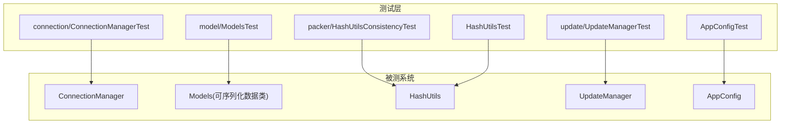
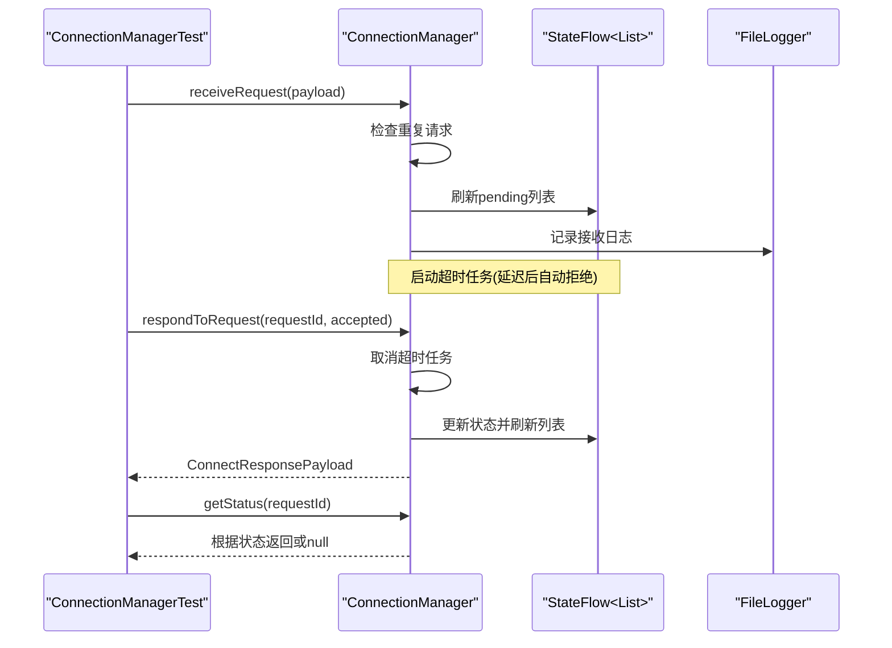
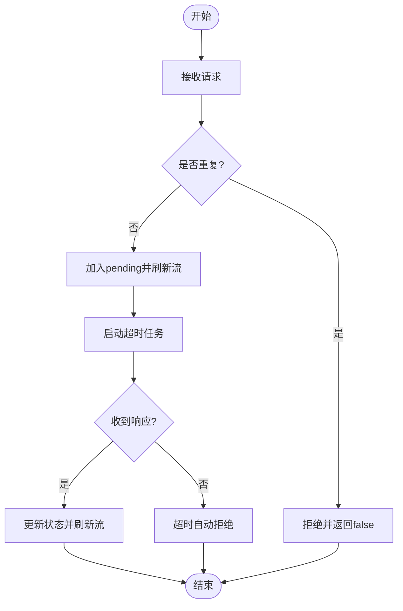
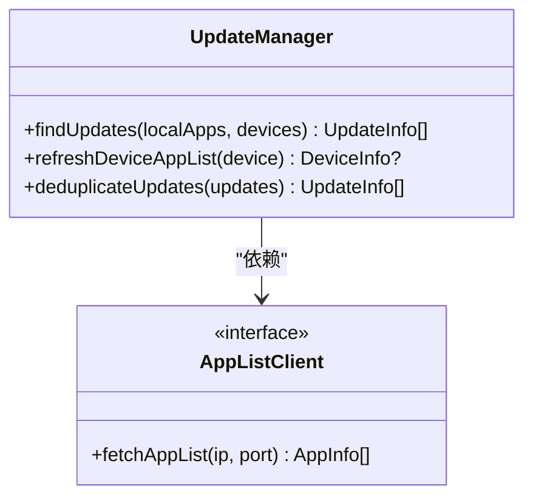
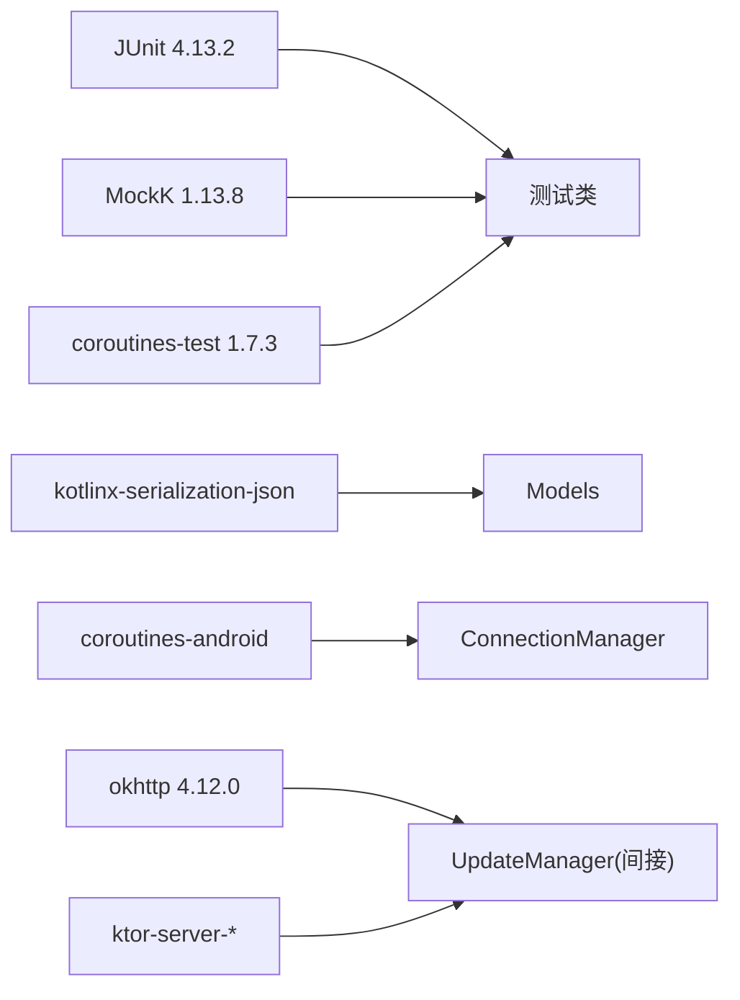

# 单元测试

<cite>
**本文引用的文件**
- [ConnectionManagerTest.kt](file://app/src/test/java/com/lansync/app/data/connection/ConnectionManagerTest.kt)
- [ModelsTest.kt](file://app/src/test/java/com/lansync/app/data/model/ModelsTest.kt)
- [HashUtilsConsistencyTest.kt](file://app/src/test/java/com/lansync/app/data/packer/HashUtilsConsistencyTest.kt)
- [UpdateManagerTest.kt](file://app/src/test/java/com/lansync/app/data/update/UpdateManagerTest.kt)
- [AppConfigTest.kt](file://app/src/test/java/com/lansync/app/data/AppConfigTest.kt)
- [HashUtilsTest.kt](file://app/src/test/java/com/lansync/app/data/HashUtilsTest.kt)
- [ConnectionManager.kt](file://app/src/main/java/com/lansync/app/data/connection/ConnectionManager.kt)
- [Models.kt](file://app/src/main/java/com/lansync/app/data/model/Models.kt)
- [UpdateManager.kt](file://app/src/main/java/com/lansync/app/data/update/UpdateManager.kt)
- [HashUtils.kt](file://app/src/main/java/com/lansync/app/data/HashUtils.kt)
- [AppConfig.kt](file://app/src/main/java/com/lansync/app/data/AppConfig.kt)
- [build.gradle.kts](file://app/build.gradle.kts)
</cite>

## 目录
1. [简介](#简介)
2. [项目结构](#项目结构)
3. [核心组件](#核心组件)
4. [架构总览](#架构总览)
5. [详细组件分析](#详细组件分析)
6. [依赖分析](#依赖分析)
7. [性能考虑](#性能考虑)
8. [故障排查指南](#故障排查指南)
9. [结论](#结论)
10. [附录](#附录)

## 简介
本文件面向LanSync应用的单元测试，系统梳理现有测试用例的设计原则、命名约定、断言方法、Mock使用策略、覆盖率目标与提升方法，并给出针对连接管理、更新管理、哈希计算等核心模块的测试示例与实践建议。同时说明测试环境配置与测试数据准备方式，以及异步代码与协程测试的最佳实践。

## 项目结构
当前仓库采用Android工程结构，单元测试位于 app/src/test/java 下，按业务域组织：
- connection: 连接请求管理与状态流转
- model: 序列化模型（JSON编解码）
- packer: 打包与哈希一致性
- update: 更新发现与去重
- 顶层data: 配置与工具类

图表来源
- [ConnectionManagerTest.kt:1-148](file://app/src/test/java/com/lansync/app/data/connection/ConnectionManagerTest.kt#L1-L148)
- [ModelsTest.kt:1-116](file://app/src/test/java/com/lansync/app/data/model/ModelsTest.kt#L1-L116)
- [HashUtilsConsistencyTest.kt:1-31](file://app/src/test/java/com/lansync/app/data/packer/HashUtilsConsistencyTest.kt#L1-L31)
- [UpdateManagerTest.kt:1-101](file://app/src/test/java/com/lansync/app/data/update/UpdateManagerTest.kt#L1-L101)
- [AppConfigTest.kt:1-26](file://app/src/test/java/com/lansync/app/data/AppConfigTest.kt#L1-L26)
- [HashUtilsTest.kt:1-48](file://app/src/test/java/com/lansync/app/data/HashUtilsTest.kt#L1-L48)

章节来源
- [build.gradle.kts:78-115](file://app/build.gradle.kts#L78-L115)

## 核心组件
- 连接管理（ConnectionManager）：维护待处理连接请求、超时处理、响应生成与状态查询，暴露StateFlow供UI订阅。
- 模型（Models）：定义设备信息、应用信息、连接载荷等可序列化数据结构。
- 哈希工具（HashUtils）：提供单文件或路径列表的MD5计算，具备异常安全与空值返回。
- 更新管理（UpdateManager）：并发获取远端应用列表并与本地对比，支持去重策略。
- 应用配置（AppConfig）：集中管理心跳、超时、轮询等参数，提供默认配置。

章节来源
- [ConnectionManager.kt:19-156](file://app/src/main/java/com/lansync/app/data/connection/ConnectionManager.kt#L19-L156)
- [Models.kt:6-138](file://app/src/main/java/com/lansync/app/data/model/Models.kt#L6-L138)
- [HashUtils.kt:6-54](file://app/src/main/java/com/lansync/app/data/HashUtils.kt#L6-L54)
- [UpdateManager.kt:12-104](file://app/src/main/java/com/lansync/app/data/update/UpdateManager.kt#L12-L104)
- [AppConfig.kt:3-18](file://app/src/main/java/com/lansync/app/data/AppConfig.kt#L3-L18)

## 架构总览
下图展示测试与对应被测模块的关系，以及关键交互流程（以连接管理为例）。

图表来源
- [ConnectionManagerTest.kt:32-146](file://app/src/test/java/com/lansync/app/data/connection/ConnectionManagerTest.kt#L32-L146)
- [ConnectionManager.kt:29-147](file://app/src/main/java/com/lansync/app/data/connection/ConnectionManager.kt#L29-L147)

## 详细组件分析

### 连接管理测试（ConnectionManagerTest）
- 设计原则
  - 覆盖正常流程与边界条件：重复请求拒绝、响应接受/拒绝、不存在请求返回空、状态查询、清理全部请求、流式输出仅包含pending。
  - 使用协程测试runTest确保异步逻辑在测试中可控执行。
- 命名约定
  - 测试方法名使用反引号包裹的自然语言描述，如“receiveRequest adds to pending and returns true”。
- 断言方法
  - 使用JUnit Assert进行布尔、相等性、非空判断；结合StateFlow的值断言集合大小与元素状态。
- Mock与外部依赖
  - 该模块内部依赖FileLogger用于日志，测试未直接mock，但通过行为验证间接保证日志调用路径。
- 关键用例
  - 接收请求加入待处理并返回true
  - 重复请求被拒绝
  - 响应生成正确负载
  - 状态查询在不同阶段返回预期结果
  - 移除与清空操作对内部状态的影响
  - incomingRequests流仅发射pending项

图表来源
- [ConnectionManager.kt:29-147](file://app/src/main/java/com/lansync/app/data/connection/ConnectionManager.kt#L29-L147)
- [ConnectionManagerTest.kt:32-146](file://app/src/test/java/com/lansync/app/data/connection/ConnectionManagerTest.kt#L32-L146)

章节来源
- [ConnectionManagerTest.kt:1-148](file://app/src/test/java/com/lansync/app/data/connection/ConnectionManagerTest.kt#L1-L148)
- [ConnectionManager.kt:19-156](file://app/src/main/java/com/lansync/app/data/connection/ConnectionManager.kt#L19-L156)

### 模型序列化测试（ModelsTest）
- 设计原则
  - 验证JSON序列化和反序列化的一致性，包括布尔字段、字符串字段、嵌套对象与列表。
  - 使用kotlinx.serialization进行编解码，忽略未知键以提升兼容性。
- 命名约定
  - 自然语言描述测试意图，如“ConnectResponseBody serializes accepted=true”。
- 断言方法
  - 断言序列化字符串包含期望片段；断言反序列化后的字段值。
- 关键用例
  - ConnectResponseBody的accepted字段序列化与反序列化
  - RefreshAppListPayload的displayKey字段
  - ConnectStatusResponse的多字段反序列化
  - AppInfo与DeviceInfo的往返序列化保持字段一致

章节来源
- [ModelsTest.kt:1-116](file://app/src/test/java/com/lansync/app/data/model/ModelsTest.kt#L1-L116)
- [Models.kt:6-138](file://app/src/main/java/com/lansync/app/data/model/Models.kt#L6-L138)

### 哈希一致性测试（HashUtilsConsistencyTest）
- 设计原则
  - 相同内容不同文件应产生相同哈希；不存在包返回null。
  - 使用TemporaryFolder隔离测试文件，避免污染文件系统。
- 命名约定
  - 清晰表达一致性或异常场景。
- 断言方法
  - 比较哈希值相等；断言null返回。
- 关键用例
  - 相同内容的两个文件哈希一致
  - 不存在的.apks文件返回null

章节来源
- [HashUtilsConsistencyTest.kt:1-31](file://app/src/test/java/com/lansync/app/data/packer/HashUtilsConsistencyTest.kt#L1-L31)
- [HashUtils.kt:6-54](file://app/src/main/java/com/lansync/app/data/HashUtils.kt#L6-L54)

### 更新管理测试（UpdateManagerTest）
- 设计原则
  - 使用MockK模拟AppListClient，控制远端应用列表返回，聚焦去重逻辑。
  - 验证去重策略：同一包名保留最高versionCode；不同包名均保留；空输入返回空。
- 命名约定
  - 明确表达去重行为的语义。
- 断言方法
  - 断言去重后列表大小与具体版本码。
- 关键用例
  - deduplicateUpdates保留最高版本
  - 多包名去重后数量正确
  - 空输入去重结果为空

图表来源
- [UpdateManager.kt:12-104](file://app/src/main/java/com/lansync/app/data/update/UpdateManager.kt#L12-L104)
- [UpdateManagerTest.kt:18-22](file://app/src/test/java/com/lansync/app/data/update/UpdateManagerTest.kt#L18-L22)

章节来源
- [UpdateManagerTest.kt:1-101](file://app/src/test/java/com/lansync/app/data/update/UpdateManagerTest.kt#L1-L101)
- [UpdateManager.kt:12-104](file://app/src/main/java/com/lansync/app/data/update/UpdateManager.kt#L12-L104)

### 配置测试（AppConfigTest）
- 设计原则
  - 验证默认配置值与自定义覆盖行为。
- 命名约定
  - 描述默认值与覆盖场景。
- 断言方法
  - 断言各配置项等于期望值。
- 关键用例
  - DEFAULT配置的各字段值
  - 自定义构造时部分字段覆盖生效

章节来源
- [AppConfigTest.kt:1-26](file://app/src/test/java/com/lansync/app/data/AppConfigTest.kt#L1-L26)
- [AppConfig.kt:3-18](file://app/src/main/java/com/lansync/app/data/AppConfig.kt#L3-L18)

### 哈希工具测试（HashUtilsTest）
- 设计原则
  - 验证单文件MD5为32位十六进制；多路径合并哈希；不存在文件返回null；不可读文件优雅处理。
- 命名约定
  - 明确测试场景与预期行为。
- 断言方法
  - 长度、字符范围、null与非空断言。
- 关键用例
  - 单文件MD5格式校验
  - 多路径合并哈希
  - 不存在文件返回null
  - 不可读文件处理不崩溃且返回有效长度

章节来源
- [HashUtilsTest.kt:1-48](file://app/src/test/java/com/lansync/app/data/HashUtilsTest.kt#L1-L48)
- [HashUtils.kt:6-54](file://app/src/main/java/com/lansync/app/data/HashUtils.kt#L6-L54)

## 依赖分析
- 测试框架与库
  - JUnit 4.13.2：基础测试框架
  - MockK 1.13.8：协程友好的Mock库
  - kotlinx-coroutines-test 1.7.3：协程测试工具（runTest）
  - Ktor Server Test Host 2.3.5：服务端测试宿主（当前未直接使用）
- 被测依赖
  - kotlinx-serialization-json：模型序列化
  - coroutines-android：协程运行环境
  - okhttp、ktor、jmdns等网络与发现相关依赖（由被测系统使用）

图表来源
- [build.gradle.kts:78-115](file://app/build.gradle.kts#L78-L115)

章节来源
- [build.gradle.kts:78-115](file://app/build.gradle.kts#L78-L115)

## 性能考虑
- 测试执行效率
  - 使用runTest避免真实延时，缩短测试时间。
  - 对网络与IO相关逻辑尽量用Mock隔离，减少I/O开销。
- 资源隔离
  - 使用TemporaryFolder创建临时文件，避免磁盘竞争与残留。
- 并发测试
  - 对UpdateManager的并发获取逻辑，可通过Mock控制返回数据，验证聚合与去重性能特性。

[本节为通用指导，无需特定文件引用]

## 故障排查指南
- 常见问题
  - 协程测试阻塞：确认使用runTest并在测试内等待所有协程完成。
  - Mock未设置返回值：确保coEvery正确配置，避免空指针或空列表导致分支未覆盖。
  - 文件路径问题：使用TemporaryFolder并确保写入后再读取。
  - JSON解析失败：检查ignoreUnknownKeys配置与字段类型匹配。
- 定位方法
  - 查看测试日志输出（如FileLogger），结合断言失败堆栈定位。
  - 逐步缩小Mock范围，先验证最小可用路径。

章节来源
- [ConnectionManagerTest.kt:32-146](file://app/src/test/java/com/lansync/app/data/connection/ConnectionManagerTest.kt#L32-L146)
- [UpdateManagerTest.kt:18-22](file://app/src/test/java/com/lansync/app/data/update/UpdateManagerTest.kt#L18-L22)
- [HashUtilsTest.kt:15-48](file://app/src/test/java/com/lansync/app/data/HashUtilsTest.kt#L15-L48)

## 结论
当前测试覆盖了连接管理、模型序列化、哈希工具、更新去重与配置等核心模块的关键路径，具备良好的可读性与可维护性。建议在后续迭代中补充更多边界用例、增加覆盖率统计与报告，并持续优化Mock策略与异步测试稳定性。

[本节为总结性内容，无需特定文件引用]

## 附录

### 单元测试编写规范与最佳实践
- 设计原则
  - 单一职责：每个测试只验证一个行为或场景。
  - 可重复性：测试之间相互独立，不依赖执行顺序。
  - 快速反馈：优先使用内存与Mock，避免慢I/O。
- 命名约定
  - 使用自然语言描述测试意图，便于阅读与检索。
- 断言方法
  - 使用JUnit Assert进行精确断言；对集合与流使用size与元素断言。
- Mock策略
  - 对外部依赖（网络、文件系统、第三方SDK）使用MockK进行隔离。
  - 对协程函数使用coEvery与coVerify，确保异步行为可测。
- 覆盖率要求与提升
  - 目标：行覆盖率≥80%，分支覆盖率≥70%（可按项目阶段调整）。
  - 提升方法：补充边界条件、异常路径、并发场景；使用覆盖率工具生成报告并分析未覆盖分支。
- 测试环境与数据准备
  - 使用TemporaryFolder管理临时文件。
  - 使用固定种子或固定时间戳（如System.currentTimeMillis()）以保证确定性。
- 异步与协程测试
  - 使用runTest封装协程测试块。
  - 避免真实延时，必要时使用advanceTimeBy或testScheduler控制时间。
  - 对StateFlow使用收集器或快照断言其最终状态。

[本节为通用指导，无需特定文件引用]