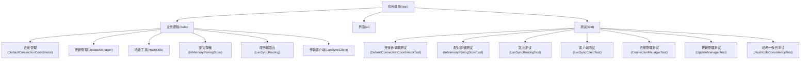
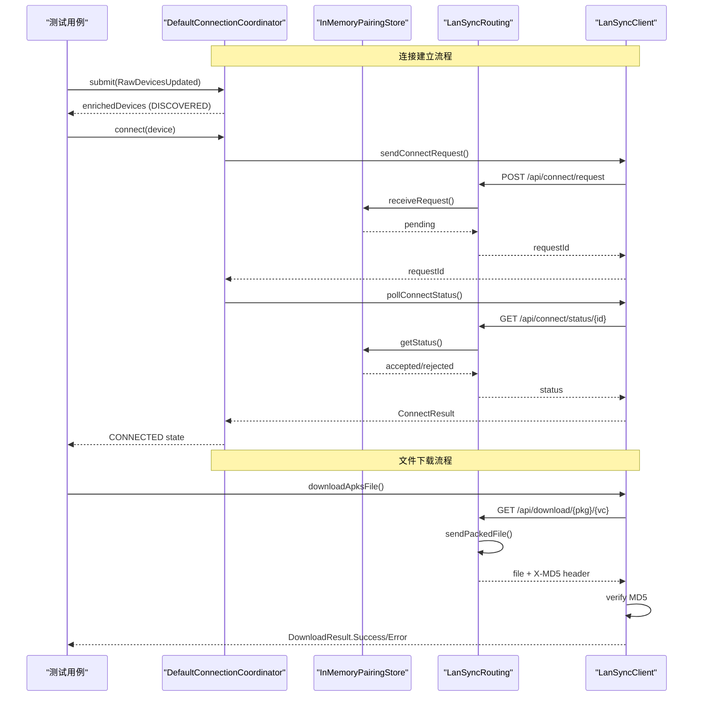
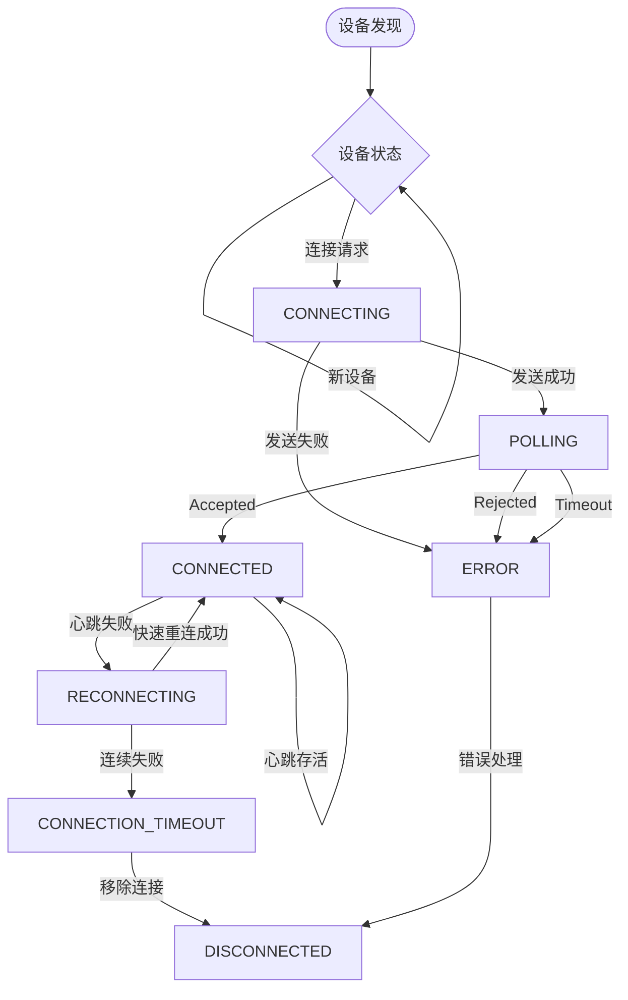
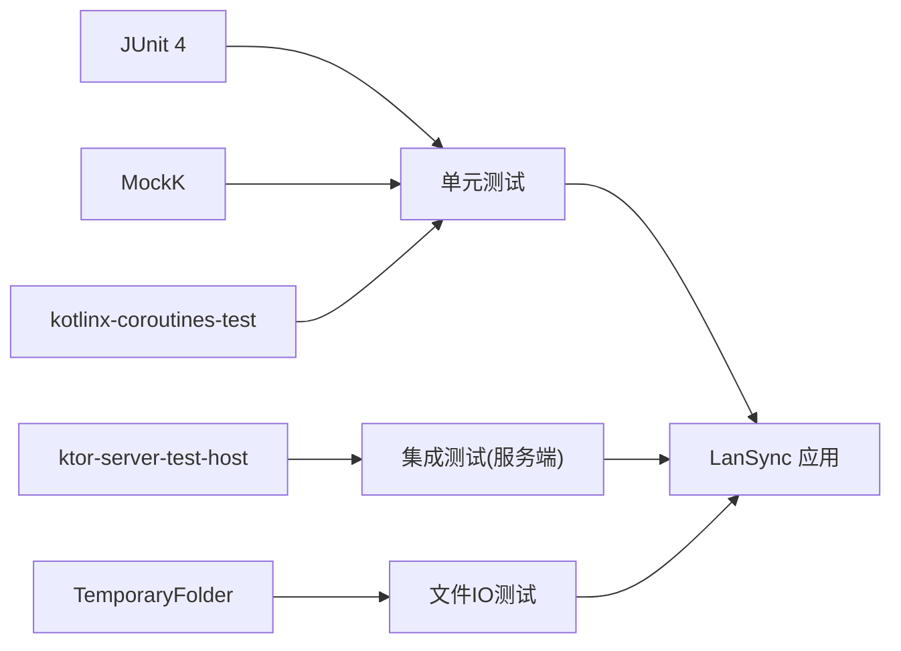

# 测试策略

<cite>
**本文引用的文件**
- [app/build.gradle.kts](file://app/build.gradle.kts)
- [gradle.properties](file://gradle.properties)
- [DefaultConnectionCoordinatorTest.kt](file://app/src/test/java/com/lansync/app/data/connection/DefaultConnectionCoordinatorTest.kt)
- [InMemoryPairingStoreTest.kt](file://app/src/test/java/com/lansync/app/data/server/InMemoryPairingStoreTest.kt)
- [LanSyncRoutingTest.kt](file://app/src/test/java/com/lansync/app/data/server/LanSyncRoutingTest.kt)
- [LanSyncClientTest.kt](file://app/src/test/java/com/lansync/app/data/transfer/LanSyncClientTest.kt)
- [ConnectionManagerTest.kt](file://app/src/test/java/com/lansync/app/data/connection/ConnectionManagerTest.kt)
- [UpdateManagerTest.kt](file://app/src/test/java/com/lansync/app/data/update/UpdateManagerTest.kt)
- [HashUtilsConsistencyTest.kt](file://app/src/test/java/com/lansync/app/data/packer/HashUtilsConsistencyTest.kt)
- [HashUtilsTest.kt](file://app/src/test/java/com/lansync/app/data/HashUtilsTest.kt)
- [ModelsTest.kt](file://app/src/test/java/com/lansync/app/data/model/ModelsTest.kt)
- [AppConfigTest.kt](file://app/src/test/java/com/lansync/app/data/AppConfigTest.kt)
- [DefaultConnectionCoordinator.kt](file://app/src/main/java/com/lansync/app/data/connection/DefaultConnectionCoordinator.kt)
- [InMemoryPairingStore.kt](file://app/src/main/java/com/lansync/app/data/server/InMemoryPairingStore.kt)
- [LanSyncRouting.kt](file://app/src/main/java/com/lansync/app/data/server/LanSyncRouting.kt)
- [LanSyncClient.kt](file://app/src/main/java/com/lansync/app/data/transfer/LanSyncClient.kt)
</cite>

## 更新摘要
**变更内容**
- 新增 DefaultConnectionCoordinatorTest（21个测试用例），全面验证连接状态机
- 新增 InMemoryPairingStoreTest，覆盖配对协议状态机
- 新增 LanSyncRoutingTest，完整测试10条API路由
- 新增 LanSyncClientTest，验证下载MD5校验和连接状态解析
- 扩展测试架构，支持Actor模型、状态机、网络模拟等高级测试模式

## 目录
1. [简介](#简介)
2. [项目结构](#项目结构)
3. [核心组件](#核心组件)
4. [架构总览](#架构总览)
5. [详细组件分析](#详细组件分析)
6. [依赖分析](#依赖分析)
7. [性能考虑](#性能考虑)
8. [故障排查指南](#故障排查指南)
9. [结论](#结论)
10. [附录](#附录)

## 简介
本测试策略面向 LanSync 应用，目标是建立一套可维护、可扩展的测试体系，覆盖单元测试、集成测试与 UI 测试，确保连接管理、更新管理与哈希计算等核心模块的正确性、稳定性与可靠性。文档涵盖：
- 单元测试规范与实践（Mock 对象使用、用例设计、覆盖率要求）
- 集成测试方案（网络模拟、数据库/文件 IO 测试、UI 测试）
- 测试环境与数据准备
- 持续集成中的自动化流程与质量门禁
- 性能与压力测试指导

**更新** 新增了基于 Actor 模型的连接协调器测试、完整的配对协议状态机测试、服务器路由集成测试以及客户端下载验证测试，形成了从底层协议到上层应用的完整测试覆盖。

## 项目结构
LanSync 采用 Android 工程结构，测试代码位于 app/src/test/java，针对纯逻辑模块进行 JUnit + MockK + Coroutines Test 的本地单元测试；同时已引入 Ktor Server Test Host，为后续服务端路由与网络层集成测试提供基础。

**图表来源**
- [app/build.gradle.kts:78-115](file://app/build.gradle.kts#L78-L115)

**章节来源**
- [app/build.gradle.kts:78-115](file://app/build.gradle.kts#L78-L115)

## 核心组件
- **连接协调器**：基于 Actor 模型的状态机实现，处理设备发现、连接建立、心跳检测、端口迁移和断线重连，通过 StateFlow 暴露设备状态。
- **配对存储**：内存实现的配对协议状态机，处理连接请求的接收、响应和超时管理。
- **服务器路由**：完整的 HTTP API 路由实现，包含10条标准接口，支持应用列表查询、文件下载、连接管理等。
- **传输客户端**：HTTP 客户端封装，负责配对通信、应用列表获取、文件下载和 MD5 校验。
- **更新管理**：并发拉取远端设备应用列表，比较版本并去重，返回可更新的 App 集合。
- **哈希工具**：对文件或路径列表计算 MD5，具备异常安全与空值返回能力。

上述组件均有对应的测试覆盖关键行为，包括边界条件、异常路径与并发场景。

**章节来源**
- [DefaultConnectionCoordinator.kt:30-500](file://app/src/main/java/com/lansync/app/data/connection/DefaultConnectionCoordinator.kt#L30-L500)
- [InMemoryPairingStore.kt:24-120](file://app/src/main/java/com/lansync/app/data/server/InMemoryPairingStore.kt#L24-L120)
- [LanSyncRouting.kt:49-299](file://app/src/main/java/com/lansync/app/data/server/LanSyncRouting.kt#L49-L299)
- [LanSyncClient.kt:66-448](file://app/src/main/java/com/lansync/app/data/transfer/LanSyncClient.kt#L66-L448)
- [UpdateManager.kt:12-104](file://app/src/main/java/com/lansync/app/data/update/UpdateManager.kt#L12-L104)
- [HashUtils.kt:6-54](file://app/src/main/java/com/lansync/app/data/HashUtils.kt#L6-L54)

## 架构总览
下图展示了核心组件在测试中的交互关系与调用链，体现连接协调器的 Actor 模型、配对协议的完整生命周期、服务器路由的10条接口以及客户端的下载验证流程。

**图表来源**
- [DefaultConnectionCoordinator.kt:82-252](file://app/src/main/java/com/lansync/app/data/connection/DefaultConnectionCoordinator.kt#L82-L252)
- [InMemoryPairingStore.kt:32-93](file://app/src/main/java/com/lansync/app/data/server/InMemoryPairingStore.kt#L32-L93)
- [LanSyncRouting.kt:71-215](file://app/src/main/java/com/lansync/app/data/server/LanSyncRouting.kt#L71-L215)
- [LanSyncClient.kt:82-172](file://app/src/main/java/com/lansync/app/data/transfer/LanSyncClient.kt#L82-L172)

## 详细组件分析

### 连接协调器（DefaultConnectionCoordinator）
- **职责**：基于 Actor 模型的设备连接状态机，处理设备发现、连接建立、心跳检测、端口迁移、陈旧清理和反向连接。
- **状态管理**：使用单一 Actor 协程收敛所有可变状态，避免竞态条件。
- **测试要点**：
  - 设备发现与 DISCOVERED 状态
  - 连接成功/失败/拒绝/超时的状态转换
  - 心跳检测的三档容错机制（不稳定→重连→离线）
  - 快速重连恢复
  - 本地/远端断开处理
  - 端口迁移时状态保持
  - 陈旧设备清理
  - 配对历史自动接受 vs 陌生设备手动确认

**图表来源**
- [DefaultConnectionCoordinator.kt:110-313](file://app/src/main/java/com/lansync/app/data/connection/DefaultConnectionCoordinator.kt#L110-L313)

**章节来源**
- [DefaultConnectionCoordinatorTest.kt:60-340](file://app/src/test/java/com/lansync/app/data/connection/DefaultConnectionCoordinatorTest.kt#L60-L340)
- [DefaultConnectionCoordinator.kt:30-500](file://app/src/main/java/com/lansync/app/data/connection/DefaultConnectionCoordinator.kt#L30-L500)

### 配对存储（InMemoryPairingStore）
- **职责**：内存实现的配对协议状态机，处理连接请求的接收、响应、超时管理和状态查询。
- **超时机制**：15秒自动超时，防止悬挂的连接请求。
- **测试要点**：
  - 重复请求拒绝
  - 接受/拒绝响应的状态同步
  - 超时后的 TIMEOUT 状态
  - 响应取消超时任务
  - 请求清理和批量清除

**章节来源**
- [InMemoryPairingStoreTest.kt:31-122](file://app/src/test/java/com/lansync/app/data/server/InMemoryPairingStoreTest.kt#L31-L122)
- [InMemoryPairingStore.kt:24-120](file://app/src/main/java/com/lansync/app/data/server/InMemoryPairingStore.kt#L24-L120)

### 服务器路由（LanSyncRouting）
- **职责**：实现 SPEC.md §3 定义的10条 HTTP API 路由，包括 ping、应用列表、设备信息、连接管理、文件下载和通知。
- **错误处理**：结构化错误响应，不泄露内部异常细节。
- **测试要点**：
  - 所有10条路由的状态码矩阵
  - Content-Type 正确设置
  - 下载接口的三个响应头（X-MD5、X-File-Size、Content-Disposition）
  - 版本选择逻辑（最高 versionCode）
  - 系统应用保护（不可提取）
  - 错误处理的健壮性

**章节来源**
- [LanSyncRoutingTest.kt:66-436](file://app/src/test/java/com/lansync/app/data/server/LanSyncRoutingTest.kt#L66-L436)
- [LanSyncRouting.kt:49-299](file://app/src/main/java/com/lansync/app/data/server/LanSyncRouting.kt#L49-L299)

### 传输客户端（LanSyncClient）
- **职责**：HTTP 客户端封装，实现配对通信、应用列表获取、文件下载和 MD5 校验。
- **MD5 校验**：严格遵循决策 D1，以 X-MD5 响应头为唯一权威，缺失直接失败。
- **测试要点**：
  - 下载成功时的 MD5 校验
  - MD5 不匹配时删除文件并报错
  - 缺少 X-MD5 头时直接失败
  - HTTP 错误码处理
  - 默认文件名生成
  - 连接状态解析（pending/accepted/rejected）
  - 应用列表 JSON 解析

**章节来源**
- [LanSyncClientTest.kt:61-211](file://app/src/test/java/com/lansync/app/data/transfer/LanSyncClientTest.kt#L61-L211)
- [LanSyncClient.kt:66-448](file://app/src/main/java/com/lansync/app/data/transfer/LanSyncClient.kt#L66-L448)

### 更新管理（UpdateManager）
- **职责**：并发拉取多个设备的远端应用列表，比较本地与远端版本，收集可更新项；提供去重策略。
- **并发与性能**：使用 async/awaitAll 并行请求，减少端到端时延。
- **测试要点**：
  - 去重后保留最高 versionCode
  - 不同包名均保留
  - 空输入返回空列表

**章节来源**
- [UpdateManagerTest.kt:24-88](file://app/src/test/java/com/lansync/app/data/update/UpdateManagerTest.kt#L24-L88)
- [UpdateManager.kt:14-102](file://app/src/main/java/com/lansync/app/data/update/UpdateManager.kt#L14-L102)

### 哈希工具（HashUtils）
- **职责**：对单个文件或路径列表计算 MD5；对不可读/不存在文件返回 null 或空串，保证健壮性。
- **测试要点**：
  - 相同内容产生一致哈希
  - 多路径合并哈希
  - 不存在文件返回 null
  - 不可读文件不抛异常，优雅降级

**章节来源**
- [HashUtilsConsistencyTest.kt:16-29](file://app/src/test/java/com/lansync/app/data/packer/HashUtilsConsistencyTest.kt#L16-L29)
- [HashUtilsTest.kt:15-47](file://app/src/test/java/com/lansync/app/data/HashUtilsTest.kt#L15-L47)
- [HashUtils.kt:8-24](file://app/src/main/java/com/lansync/app/data/HashUtils.kt#L8-L24)

### 模型与配置
- **模型序列化**：验证 JSON 编解码正确性，包括布尔字段、嵌套对象与数组。
- **配置默认值**：校验默认配置常量是否符合预期，支持自定义覆盖。

**章节来源**
- [ModelsTest.kt:14-114](file://app/src/test/java/com/lansync/app/data/model/ModelsTest.kt#L14-L114)
- [AppConfigTest.kt:8-25](file://app/src/test/java/com/lansync/app/data/AppConfigTest.kt#L8-L25)

## 依赖分析
- **测试框架与库**：
  - JUnit 4 作为测试运行器
  - MockK 用于 Kotlin/协程方法 Mock
  - kotlinx-coroutines-test 用于协程测试
  - ktor-server-test-host 为服务端集成测试提供宿主
  - TemporaryFolder 用于临时文件测试
- **构建配置**：Android Gradle 插件与 Kotlin 版本由根 build 脚本管理；应用模块声明了测试依赖。

**图表来源**
- [app/build.gradle.kts:111-115](file://app/build.gradle.kts#L111-L115)

**章节来源**
- [app/build.gradle.kts:111-115](file://app/build.gradle.kts#L111-L115)

## 性能考虑
- **并发优化**：UpdateManager 使用协程并发拉取远端应用列表，显著降低端到端延迟；建议在测试中验证并发正确性与资源释放。
- **超时控制**：DefaultConnectionCoordinator 对每个请求设置超时，避免悬挂任务；测试应覆盖超时路径与清理逻辑。
- **哈希性能**：HashUtils 使用固定大小缓冲流式读取，适合大文件；测试可使用临时小文件验证正确性，生产环境注意磁盘 IO 与内存占用。
- **Actor 模型**：DefaultConnectionCoordinator 使用 Actor 模型收敛状态，避免竞态条件；测试需验证事件处理和状态同步。
- **建议的性能测试**：
  - 高并发设备发现与更新检测：模拟大量设备，评估 CPU/内存与网络吞吐
  - 大文件哈希：验证 MD5 计算耗时与峰值内存
  - 连接风暴：短时间内大量连接请求，验证超时与清理机制
  - 文件下载：验证大文件下载的内存使用和进度回调

## 故障排查指南
- **连接协调器问题**：检查 Actor 事件队列是否阻塞；验证状态转换逻辑；确认心跳任务和同步任务的启停。
- **配对协议问题**：确认请求ID唯一性；检查超时任务是否正确取消；验证状态同步的一致性。
- **路由问题**：检查JSON序列化和反序列化；验证错误响应格式；确认Content-Type设置。
- **下载问题**：验证X-MD5头存在性和正确性；检查文件写入完整性；确认MD5校验逻辑。
- **更新去重异常**：确认版本号比较逻辑与设备名字典序选择；检查 mock 数据是否包含系统应用导致过滤。
- **哈希结果为空**：确认文件可读性与路径有效性；对于多路径聚合，任一不可读将被跳过但不影响整体结果。
- **协程测试失败**：确保使用 runTest 与正确的调度器；避免真实网络与文件系统访问，使用 Mock 与临时目录。

**章节来源**
- [DefaultConnectionCoordinator.kt:58-443](file://app/src/main/java/com/lansync/app/data/connection/DefaultConnectionCoordinator.kt#L58-L443)
- [InMemoryPairingStore.kt:32-113](file://app/src/main/java/com/lansync/app/data/server/InMemoryPairingStore.kt#L32-L113)
- [LanSyncRouting.kt:71-251](file://app/src/main/java/com/lansync/app/data/server/LanSyncRouting.kt#L71-L251)
- [LanSyncClient.kt:303-362](file://app/src/main/java/com/lansync/app/data/transfer/LanSyncClient.kt#L303-L362)

## 结论
当前测试覆盖了连接协调器、配对存储、服务器路由、传输客户端、更新管理与哈希工具的关键路径，具备良好的断言与边界覆盖。新增的21个连接协调器测试用例、完整的配对协议测试、10条路由的集成测试以及客户端下载验证测试，形成了从底层协议到上层应用的完整测试体系。下一步建议：
- 补充 AppRepository 编排、Ktor 路由与下载校验流程的自动化测试
- 引入覆盖率统计与质量门禁，确保新增代码保持覆盖率基线
- 完善 UI 测试与端到端集成测试，提升用户体验保障
- 增加性能基准测试，监控关键路径的性能回归

## 附录

### 单元测试编写规范与实践
- **命名与组织**：测试类与方法以"被测功能_场景"命名，便于检索与理解。
- **Mock 对象**：
  - 使用 MockK 对协程方法与外部依赖进行精确断言与返回值控制
  - 对网络客户端（如 OkHttpClient）进行 Mock，隔离真实网络
  - 使用 FakeTransport 模拟网络连接层
- **协程测试**：
  - 使用 runTest 管理协程生命周期，避免真实时间推进
  - 对超时与延迟逻辑使用虚拟时间或缩短超时阈值
  - 验证 Actor 模型的事件处理和状态同步
- **文件 IO**：
  - 使用 TemporaryFolder 创建临时文件，确保测试隔离与清理
  - 对 HashUtils 的文件读写使用 TemporaryFolder
- **断言策略**：
  - 不仅断言返回值，还断言副作用（如 Map 大小、StateFlow 值、日志输出）
  - 验证状态机的完整生命周期
  - 检查错误消息的准确性和安全性

**章节来源**
- [DefaultConnectionCoordinatorTest.kt:32-340](file://app/src/test/java/com/lansync/app/data/connection/DefaultConnectionCoordinatorTest.kt#L32-L340)
- [LanSyncRoutingTest.kt:39-466](file://app/src/test/java/com/lansync/app/data/server/LanSyncRoutingTest.kt#L39-L466)
- [LanSyncClientTest.kt:46-57](file://app/src/test/java/com/lansync/app/data/transfer/LanSyncClientTest.kt#L46-L57)

### 覆盖率要求
- **建议目标**：
  - 行覆盖率 ≥ 80%
  - 分支覆盖率 ≥ 70%
  - 关键路径（连接、更新、哈希、下载）覆盖率 ≥ 90%
- **工具建议**：
  - 使用 JaCoCo 或 Android Gradle 内置覆盖率报告
  - 在 CI 中阻断低于阈值的提交
  - 重点关注新增的 Actor 模型和状态机测试

### 集成测试方案
- **网络模拟**：
  - 使用 MockK 模拟 OkHttpClient 的网络请求，返回预设数据
  - 使用 ktor-server-test-host 启动内嵌服务器，验证路由与序列化
  - 使用 FakeTransport 模拟网络连接层
- **数据库/文件 IO**：
  - 使用内存或临时目录替代持久化存储，确保测试可重复
  - 对 HashUtils 的文件读写使用 TemporaryFolder
- **UI 测试**：
  - 使用 Compose Test 或 Espresso 对关键页面进行交互与状态断言
  - 模拟用户操作（点击、滑动）与异步结果（加载完成、错误提示）

**章节来源**
- [LanSyncRoutingTest.kt:66-436](file://app/src/test/java/com/lansync/app/data/server/LanSyncRoutingTest.kt#L66-L436)
- [LanSyncClientTest.kt:61-211](file://app/src/test/java/com/lansync/app/data/transfer/LanSyncClientTest.kt#L61-L211)

### 测试环境与数据准备
- **环境**：
  - JDK 17、Android SDK 34、Gradle 8.13
  - 启用 JVM 参数与 TLS 协议（见 gradle.properties）
- **数据**：
  - 使用固定随机种子或固定构造数据，保证测试确定性
  - 预置设备与应用列表，覆盖系统应用、非系统应用、版本差异等场景
  - 使用 TemporaryFolder 管理测试文件

**章节来源**
- [gradle.properties:1-7](file://gradle.properties#L1-L7)
- [app/build.gradle.kts:7-22](file://app/build.gradle.kts#L7-L22)

### 持续集成与质量保证
- **CI 流水线**：
  - 构建、单元测试、覆盖率收集、报告归档
  - 失败即阻断合并，确保代码质量
- **质量门禁**：
  - 覆盖率阈值、静态检查（Lint/Ktlint）、依赖漏洞扫描
- **发布前检查**：
  - 签名配置、混淆规则、资源压缩验证

**章节来源**
- [app/build.gradle.kts:31-46](file://app/build.gradle.kts#L31-L46)
- [app/build.gradle.kts:108-115](file://app/build.gradle.kts#L108-L115)

### 性能与压力测试指导
- **场景设计**：
  - 高并发设备发现与更新检测
  - 大文件哈希计算
  - 连接风暴与超时恢复
  - 文件下载性能测试
- **指标监控**：
  - CPU、内存、GC、网络吞吐、I/O 延迟
- **工具建议**：
  - 使用 JMH 进行微基准测试
  - 使用压测工具（如 wrk/k6）模拟网络负载
  - 结合 Android Profiler 分析 UI 与主线程阻塞
  - 使用协程调试工具监控 Actor 模型性能