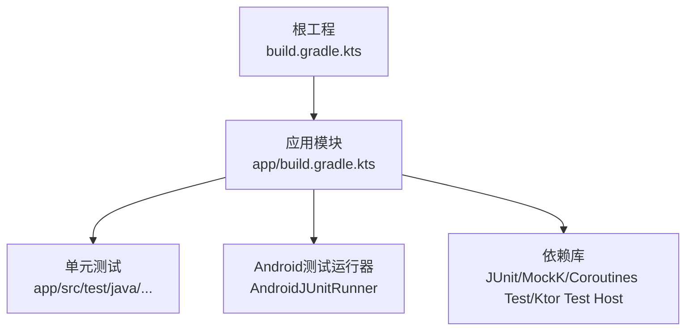
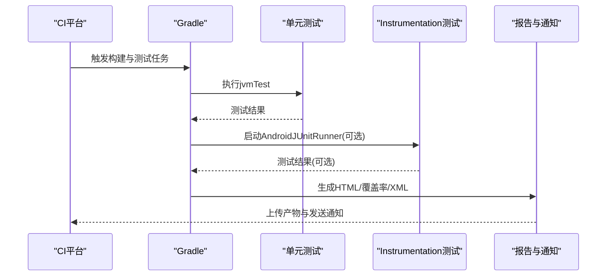
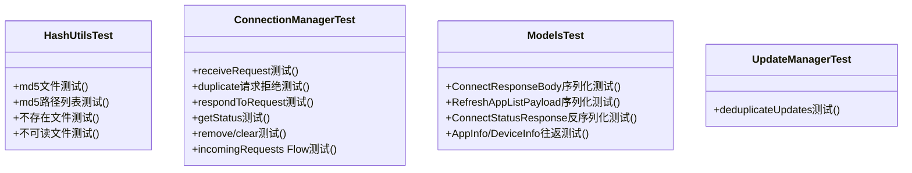
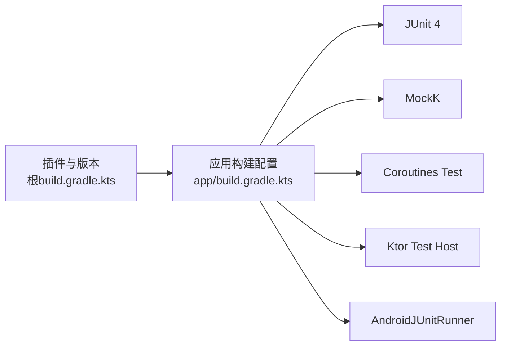

# 测试自动化

<cite>
**本文引用的文件**
- [build.gradle.kts](file://build.gradle.kts)
- [app/build.gradle.kts](file://app/build.gradle.kts)
- [gradle.properties](file://gradle.properties)
- [settings.gradle.kts](file://settings.gradle.kts)
- [gradle-wrapper.properties](file://gradle/wrapper/gradle-wrapper.properties)
- [HashUtilsTest.kt](file://app/src/test/java/com/lansync/app/data/HashUtilsTest.kt)
- [ConnectionManagerTest.kt](file://app/src/test/java/com/lansync/app/data/connection/ConnectionManagerTest.kt)
- [ModelsTest.kt](file://app/src/test/java/com/lansync/app/data/model/ModelsTest.kt)
- [UpdateManagerTest.kt](file://app/src/test/java/com/lansync/app/data/update/UpdateManagerTest.kt)
- [REPORT.md](file://REPORT.md)
</cite>

## 目录
1. [简介](#简介)
2. [项目结构](#项目结构)
3. [核心组件](#核心组件)
4. [架构总览](#架构总览)
5. [详细组件分析](#详细组件分析)
6. [依赖分析](#依赖分析)
7. [性能考虑](#性能考虑)
8. [故障排查指南](#故障排查指南)
9. [结论](#结论)
10. [附录](#附录)

## 简介
本文件面向LanSync应用的测试自动化，聚焦持续集成环境中的Gradle测试任务配置与CI/CD流水线集成。内容涵盖：
- Gradle测试任务配置（单元测试、Android Instrumentation测试）
- CI/CD流水线集成（GitHub Actions等）
- 自动化测试环境搭建（Android SDK、设备/模拟器管理）
- 测试报告生成与分析（HTML报告、覆盖率、结果通知）
- 并行执行与分片优化策略
- 失败调试与问题诊断流程

## 项目结构
LanSync采用标准Android多模块工程结构，测试代码位于app模块的test目录，使用JUnit 4与MockK进行单元测试；应用层通过AndroidX Test Runner支持Instrumentation测试。构建系统基于Gradle Kotlin DSL，根工程仅声明插件版本，具体构建逻辑在app模块中完成。

图表来源
- [build.gradle.kts:1-6](file://build.gradle.kts#L1-L6)
- [app/build.gradle.kts:1-22](file://app/build.gradle.kts#L1-L22)
- [app/build.gradle.kts:111-115](file://app/build.gradle.kts#L111-L115)

章节来源
- [build.gradle.kts:1-6](file://build.gradle.kts#L1-L6)
- [app/build.gradle.kts:1-22](file://app/build.gradle.kts#L1-L22)
- [settings.gradle.kts:1-27](file://settings.gradle.kts#L1-L27)
- [gradle-wrapper.properties:1-7](file://gradle/wrapper/gradle-wrapper.properties#L1-L7)

## 核心组件
- 构建与插件
  - 根工程声明Android与Kotlin插件版本，确保构建一致性。
  - app模块启用Android Application插件、Kotlin与序列化插件，并配置编译SDK、签名、Compose选项与打包资源排除。
- 测试框架与依赖
  - 单元测试：JUnit 4、MockK、kotlinx-coroutines-test、ktor-server-test-host（用于服务端相关测试）。
  - Android测试运行器：androidx.test.runner.AndroidJUnitRunner（为Instrumentation测试准备）。
- 构建参数
  - gradle.properties配置JVM内存、编码、TLS协议与配置缓存，提升构建稳定性与速度。

章节来源
- [build.gradle.kts:1-6](file://build.gradle.kts#L1-L6)
- [app/build.gradle.kts:7-76](file://app/build.gradle.kts#L7-L76)
- [app/build.gradle.kts:111-115](file://app/build.gradle.kts#L111-L115)
- [gradle.properties:1-8](file://gradle.properties#L1-L8)

## 架构总览
下图展示从CI触发到测试执行的端到端流程，包括环境准备、Gradle任务执行、报告生成与通知。

图表来源
- [app/build.gradle.kts:18](file://app/build.gradle.kts#L18)
- [app/build.gradle.kts:111-115](file://app/build.gradle.kts#L111-L115)
- [gradle.properties:1-8](file://gradle.properties#L1-L8)

## 详细组件分析

### 单元测试套件与用例
- HashUtilsTest
  - 验证MD5哈希计算的正确性、路径列表组合哈希、不存在文件处理与不可读文件容错。
  - 使用TemporaryFolder隔离临时文件，保证测试可重复执行。
- ConnectionManagerTest
  - 覆盖连接请求接收、去重、响应、状态查询、清理与Flow行为。
  - 使用协程测试runTest验证异步逻辑。
- ModelsTest
  - 校验数据模型JSON序列化/反序列化正确性与往返一致性。
- UpdateManagerTest
  - 使用MockK模拟AppListClient，验证更新去重策略（保留最高versionCode）、唯一包名保留与空输入处理。

图表来源
- [HashUtilsTest.kt:1-48](file://app/src/test/java/com/lansync/app/data/HashUtilsTest.kt#L1-L48)
- [ConnectionManagerTest.kt:1-148](file://app/src/test/java/com/lansync/app/data/connection/ConnectionManagerTest.kt#L1-L148)
- [ModelsTest.kt:1-116](file://app/src/test/java/com/lansync/app/data/model/ModelsTest.kt#L1-L116)
- [UpdateManagerTest.kt:1-101](file://app/src/test/java/com/lansync/app/data/update/UpdateManagerTest.kt#L1-L101)

章节来源
- [HashUtilsTest.kt:1-48](file://app/src/test/java/com/lansync/app/data/HashUtilsTest.kt#L1-L48)
- [ConnectionManagerTest.kt:1-148](file://app/src/test/java/com/lansync/app/data/connection/ConnectionManagerTest.kt#L1-L148)
- [ModelsTest.kt:1-116](file://app/src/test/java/com/lansync/app/data/model/ModelsTest.kt#L1-L116)
- [UpdateManagerTest.kt:1-101](file://app/src/test/java/com/lansync/app/data/update/UpdateManagerTest.kt#L1-L101)

### 测试环境与设备管理
- Android SDK与工具链
  - 通过Gradle Wrapper固定Gradle版本，确保跨环境一致。
  - 使用AndroidX与Compose，需安装对应SDK组件（如Android SDK Build Tools、Platform、Emulator）。
- 模拟器管理
  - 建议在CI中预创建轻量级AVD（如Google APIs或AOSP），并使用headless模式启动。
  - 可通过adb等待设备就绪后再执行Instrumentation测试。
- 设备选择
  - 若使用物理设备，确保USB调试开启并通过adb连接；CI中通常优先使用模拟器以保证稳定性。

章节来源
- [gradle-wrapper.properties:1-7](file://gradle/wrapper/gradle-wrapper.properties#L1-L7)
- [app/build.gradle.kts:7-22](file://app/build.gradle.kts#L7-L22)

### 测试报告与通知
- 报告类型
  - XML结果：由JUnit/Android测试生成，便于CI解析与聚合。
  - HTML报告：可通过Gradle插件或CI步骤将XML转换为HTML，便于可视化查看。
  - 覆盖率报告：建议引入JaCoCo插件，生成覆盖率HTML/XML，并在PR中展示差异。
- 通知机制
  - 在CI中根据测试结果状态发送通知（如邮件、Slack、企业微信等），失败时附带报告链接。

章节来源
- [app/build.gradle.kts:111-115](file://app/build.gradle.kts#L111-L115)
- [gradle.properties:1-8](file://gradle.properties#L1-L8)

### 并行执行与测试分片
- 并行执行
  - 使用Gradle并行任务与线程数优化（结合gradle.properties的JVM参数）。
  - 对单元测试可使用并发执行，缩短整体耗时。
- 测试分片
  - 将测试类按模块或功能分组，拆分为多个分片在多台机器上并行执行，最后汇总结果。
  - 对于Instrumentation测试，可按设备或用例集分片，提高吞吐。

章节来源
- [gradle.properties:1-8](file://gradle.properties#L1-L8)

### CI/CD流水线示例（GitHub Actions）
以下为在GitHub Actions中运行LanSync测试的参考流程（概念性说明，非代码片段）：
- 设置Java与Gradle环境
  - 使用与wrapper一致的Gradle版本，配置JDK 17以匹配kotlinOptions jvmTarget。
- 缓存Gradle依赖与构建缓存
  - 缓存~/.gradle与构建输出，加速后续运行。
- 安装Android SDK与组件
  - 安装必要的SDK Platform、Build Tools、Emulator与System Image。
- 启动模拟器
  - 创建并启动无头AVD，等待设备就绪。
- 执行测试
  - 运行单元测试：./gradlew :app:jvmTest
  - 运行Instrumentation测试（可选）：./gradlew :app:connectedDebugAndroidTest
- 生成与上传报告
  - 收集XML结果，转换为HTML，上传为构建产物。
  - 生成覆盖率报告（如启用JaCoCo），上传并展示。
- 通知
  - 根据测试结果发送通知，失败时附带报告链接。

[本节为概念性说明，不直接分析具体文件]

## 依赖分析
- 构建依赖
  - 根工程声明Android与Kotlin插件版本，统一构建环境。
  - app模块引入UI、网络、序列化、协程与测试依赖。
- 测试依赖
  - JUnit 4用于断言与测试组织。
  - MockK用于协程与函数式接口模拟。
  - kotlinx-coroutines-test用于协程测试。
  - ktor-server-test-host用于服务端相关测试（当前未充分利用，见报告）。

图表来源
- [build.gradle.kts:1-6](file://build.gradle.kts#L1-L6)
- [app/build.gradle.kts:111-115](file://app/build.gradle.kts#L111-L115)
- [app/build.gradle.kts:18](file://app/build.gradle.kts#L18)

章节来源
- [build.gradle.kts:1-6](file://build.gradle.kts#L1-L6)
- [app/build.gradle.kts:111-115](file://app/build.gradle.kts#L111-L115)
- [app/build.gradle.kts:18](file://app/build.gradle.kts#L18)

## 性能考虑
- 构建与测试并行
  - 利用Gradle并行任务与线程数，结合配置缓存减少重复工作。
- 模拟器预热
  - 在CI中复用已创建的模拟器实例，避免每次启动开销。
- 测试分片
  - 将大型测试套件拆分为多个分片，在多节点并行执行，缩短总时长。
- 资源限制
  - 合理设置JVM内存与GC参数，避免OOM导致测试不稳定。

[本节提供通用指导，不直接分析具体文件]

## 故障排查指南
- 常见问题定位
  - 环境变量与SDK路径：确认ANDROID_HOME、PATH包含正确的SDK与emulator路径。
  - 模拟器状态：检查是否成功启动并处于可用状态（adb devices）。
  - 权限与网络：确保模拟器具备网络访问能力，必要时配置代理。
- 日志与调试
  - 查看Gradle构建日志与测试输出，定位失败用例。
  - 对协程测试，使用runTest提供的调度器与超时控制，避免死锁与悬挂。
- 覆盖率与报告
  - 若覆盖率报告为空，检查是否启用了相应插件与任务。
  - 若HTML报告缺失，确认转换步骤与产物上传是否正确。
- 已知缺口
  - 当前测试覆盖以纯逻辑为主，对AppRepository编排、Ktor路由、下载校验流程缺乏自动化覆盖（即使引入了相关测试依赖也未充分利用）。

章节来源
- [REPORT.md:262-265](file://REPORT.md#L262-L265)

## 结论
LanSync的测试自动化基础已具备：明确的Gradle配置、完善的单元测试套件与Android测试运行器。下一步建议：
- 完善Instrumentation测试与UI测试，覆盖关键用户流程。
- 引入JaCoCo生成覆盖率报告，并在CI中展示趋势与阈值。
- 实现测试分片与并行执行，优化CI时长。
- 建立稳定的CI流水线与环境管理，确保可重复与可观测的测试结果。

[本节为总结性内容，不直接分析具体文件]

## 附录
- 快速命令参考（概念性）
  - 运行单元测试：./gradlew :app:jvmTest
  - 运行Instrumentation测试：./gradlew :app:connectedDebugAndroidTest
  - 生成覆盖率报告：启用JaCoCo后执行对应任务
- 环境清单
  - JDK 17、Android SDK（含Platform与Build Tools）、Emulator与System Image、ADB工具链

[本节提供通用信息，不直接分析具体文件]